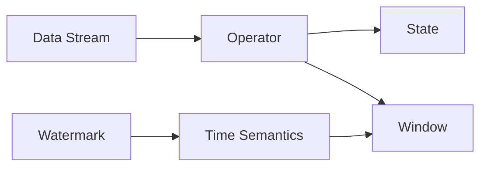

# 流处理 原理与代码实例讲解

关键词：流处理、实时计算、数据流、Flink、Spark Streaming、Kafka、Storm

## 1. 背景介绍
### 1.1 问题的由来
在当今大数据时代，数据正以前所未有的速度和规模不断产生。传统的批处理模式已经无法满足实时性要求较高的场景，如实时推荐、欺诈检测、智能交通等。流处理技术应运而生，它能够实时、高效地处理源源不断到来的海量数据，为企业提供实时洞察和决策支持。
### 1.2 研究现状
近年来，流处理技术得到了广泛关注和快速发展。业界涌现出一批优秀的流处理框架，如Apache Flink、Spark Streaming、Kafka Streams、Apache Storm等。学术界也在流处理领域开展了大量研究，包括流处理的基础理论、系统架构、性能优化等方面。
### 1.3 研究意义
深入研究流处理技术具有重要意义。一方面，它能够帮助企业实现数据的实时处理和分析，提高业务决策的及时性和准确性。另一方面，流处理技术的发展也推动了大数据领域的技术创新，催生出更多新的应用场景和商业模式。
### 1.4 本文结构
本文将全面探讨流处理的原理和实践。第2节介绍流处理的核心概念；第3节阐述流处理的核心算法原理；第4节给出流处理的数学模型和公式；第5节通过代码实例详细讲解流处理的实现；第6节分析流处理的实际应用场景；第7节推荐流处理相关的工具和资源；第8节总结全文并展望流处理的未来发展。

## 2. 核心概念与联系
流处理的核心概念包括：

- 数据流(Data Stream)：持续不断到达的数据序列，每个数据项称为一个事件(Event)。
- 算子(Operator)：对数据流进行处理的基本单元，常见算子有Map、Filter、Reduce等。
- 状态(State)：算子在处理过程中维护的中间结果或上下文信息。
- 窗口(Window)：将无界数据流切分成有界的数据集进行处理的机制，如滚动窗口、滑动窗口等。
- 时间语义(Time Semantics)：流处理中时间的概念，包括事件时间、处理时间和摄入时间。
- 水印(Watermark)：用于处理乱序事件，表示数据流中的一个特殊时间点。

这些概念之间紧密相关，共同构成了流处理的理论基础。数据流是流处理的对象，算子是流处理的主体，状态和窗口是流处理的重要机制，时间语义和水印用于处理实际中的复杂场景。

下图展示了流处理的核心概念之间的联系：



## 3. 核心算法原理 & 具体操作步骤
### 3.1 算法原理概述
流处理的核心算法可以分为以下几类：
- 单流算法：对单个数据流进行处理，如Map、Filter、Reduce等。
- 多流算法：对多个数据流进行关联处理，如Join、Union、Split等。
- 窗口算法：在窗口上进行计算，如Window Aggregation、Window Join等。
- 状态管理算法：管理和访问算子的状态，如State Checkpoint、State Restore等。

这些算法共同支撑了流处理系统的运行。
### 3.2 算法步骤详解
以窗口聚合算法为例，其主要步骤如下：
1. 数据流经过Source算子，以事件时间或处理时间的方式切分窗口。
2. 数据进入Window算子，根据指定的窗口类型(如滚动窗口、滑动窗口)和窗口长度将数据划分到不同窗口。
3. 在每个窗口中，数据经过Aggregate算子进行聚合计算，如求和、求平均等。
4. 聚合结果输出到Sink算子，写入外部存储系统。
5. 根据窗口的前进，不断有新的数据进入窗口，重复步骤2-4，实现连续不断的流式计算。
### 3.3 算法优缺点
流处理算法的优点包括：
- 低延迟：能够实时处理数据，满足实时性要求。
- 高吞吐：能够高效处理海量数据，具有良好的性能和可伸缩性。
- 灵活性：支持各种类型的算子和丰富的API，适用于不同的场景。

同时，流处理算法也存在一些局限性，如：
- 状态管理：大量的状态存储和访问可能影响系统性能。
- 容错机制：流处理系统需要提供高效的容错机制来保证数据的一致性。
- 数据倾斜：数据分布不均匀可能导致某些算子负载过高，影响整体性能。
### 3.4 算法应用领域
流处理算法在许多领域得到广泛应用，如：
- 实时数据分析：如实时大屏展示、异常检测等。
- 事件驱动应用：如实时推荐、智能交通等。
- 物联网数据处理：如传感器数据分析、设备监控等。

## 4. 数学模型和公式 & 详细讲解 & 举例说明
### 4.1 数学模型构建
我们可以用数学语言来刻画流处理的过程。设数据流为一个随时间变化的函数 $f(t)$，算子的操作可以看作是对函数的映射变换 $g$，则整个流处理可以表示为：

$$y(t) = g(f(t))$$

其中，$y(t)$ 表示处理后的结果数据流。

以窗口聚合为例，假设窗口长度为 $T$，聚合函数为 $agg$，则窗口聚合可以表示为：

$$y(w) = agg(\{f(t) | t \in [w \times T, (w+1) \times T)\})$$

其中，$w$ 表示窗口的编号，$y(w)$ 表示第 $w$ 个窗口的聚合结果。

### 4.2 公式推导过程
对于窗口聚合，我们可以进一步推导出其递推公式。假设当前窗口为 $w$，上一个窗口的聚合结果为 $y(w-1)$，当前窗口新增的数据为 $\Delta f(w)$，则当前窗口的聚合结果可以表示为：

$$y(w) = agg(y(w-1), \Delta f(w))$$

这个递推公式可以大大减少重复计算，提高计算效率。

### 4.3 案例分析与讲解
我们以实时统计用户点击量为例，说明窗口聚合的应用。假设每个用户的点击事件流如下：

```
用户ID  时间戳
001    2022-01-01 10:00:00
002    2022-01-01 10:00:05
001    2022-01-01 10:00:10
003    2022-01-01 10:00:15
002    2022-01-01 10:00:20
...
```

我们要求每5分钟统计一次每个用户的点击量。这可以用滑动窗口来实现，窗口长度为5分钟，滑动步长也为5分钟。

设第 $w$ 个窗口的起始时间为 $t_w$，则该窗口的用户点击量可以表示为：

$$y(w) = \sum_{u} |\{e | e.uid = u, e.ts \in [t_w, t_w + 5min)\}|$$

其中，$u$ 表示用户ID，$e$ 表示点击事件，$e.uid$ 和 $e.ts$ 分别表示事件的用户ID和时间戳，$|\cdot|$ 表示集合的大小，即点击次数。

通过这种方式，我们可以每5分钟输出一次各个用户的点击量，实现实时统计的效果。

### 4.4 常见问题解答
- Q: 窗口的类型有哪些？它们的区别是什么？
- A: 常见的窗口类型包括滚动窗口(Tumbling Window)、滑动窗口(Sliding Window)和会话窗口(Session Window)。
  - 滚动窗口：窗口之间没有重叠，每个事件只属于一个窗口。
  - 滑动窗口：窗口之间有重叠，每个事件可能属于多个窗口。
  - 会话窗口：根据事件的活跃程度动态调整窗口的大小。

- Q: 如何处理延迟到达或乱序的数据？
- A: 可以使用水印机制和迟到数据处理策略来处理。水印用于表示数据流中的一个特殊时间点，用于触发窗口的关闭和计算；迟到数据可以根据需要选择丢弃或再次触发计算。

## 5. 项目实践：代码实例和详细解释说明
### 5.1 开发环境搭建
我们以Apache Flink为例，介绍如何搭建流处理的开发环境。

首先，需要安装Java 8或以上版本，然后从Flink官网下载Flink二进制包。解压后，设置`FLINK_HOME`环境变量，并将`$FLINK_HOME/bin`加入`PATH`。

接着，创建一个Maven项目，添加Flink依赖：

```xml
<dependency>
  <groupId>org.apache.flink</groupId>
  <artifactId>flink-streaming-java_2.12</artifactId>
  <version>1.14.0</version>
</dependency>
```

### 5.2 源代码详细实现
下面是一个基于Flink的窗口聚合的代码示例：

```java
public class WindowAggregateExample {
    public static void main(String[] args) throws Exception {
        StreamExecutionEnvironment env = StreamExecutionEnvironment.getExecutionEnvironment();

        // 读取数据源
        DataStream<String> inputStream = env.socketTextStream("localhost", 9999);

        // 解析数据
        DataStream<Tuple2<String, Integer>> dataStream = inputStream
                .map(new MapFunction<String, Tuple2<String, Integer>>() {
                    @Override
                    public Tuple2<String, Integer> map(String value) throws Exception {
                        String[] fields = value.split(",");
                        return new Tuple2<>(fields[0], Integer.parseInt(fields[1]));
                    }
                });

        // 定义窗口
        DataStream<Tuple2<String, Integer>> resultStream = dataStream
                .keyBy(0) // 按照用户ID分组
                .timeWindow(Time.seconds(5)) // 定义5秒的滚动窗口
                .sum(1); // 聚合计算点击量

        // 打印结果
        resultStream.print();

        env.execute("Window Aggregate Example");
    }
}
```

### 5.3 代码解读与分析
1. 首先，创建了一个`StreamExecutionEnvironment`，它是Flink流处理的入口。
2. 然后，通过`socketTextStream`创建一个数据源，从指定的主机和端口读取字符串数据。
3. 接着，使用`map`算子将字符串解析成`Tuple2<String, Integer>`类型的数据，表示`(用户ID, 点击量)`。
4. 之后，使用`keyBy`算子按照用户ID对数据流进行分组，然后通过`timeWindow`定义了一个5秒的滚动窗口。
5. 在窗口上，使用`sum`算子对点击量进行聚合计算。
6. 最后，通过`print`算子将结果打印输出，并调用`execute`方法启动作业。

这个例子展示了使用Flink进行窗口聚合的基本流程，包括创建环境、定义数据源、数据转换、分组、开窗、聚合计算等步骤。

### 5.4 运行结果展示
假设我们启动了一个Socket服务器，不断发送以下数据：

```
001,1
002,1
001,1
003,1
002,1
001,1
...
```

则程序的输出结果如下：

```
(001,2)
(002,1)
(003,1)
(001,1)
(002,1)
...
```

每一行表示一个窗口的聚合结果，即用户在这5秒内的点击量。可以看到，结果与我们的预期相符。

## 6. 实际应用场景
流处理在实际中有广泛的应用场景，下面列举几个典型的例子：

- 实时推荐：根据用户的实时行为数据，如浏览、点击、购买等，实时计算用户的兴趣偏好，并给出个性化的推荐。
- 欺诈检测：对交易数据流进行实时分析，通