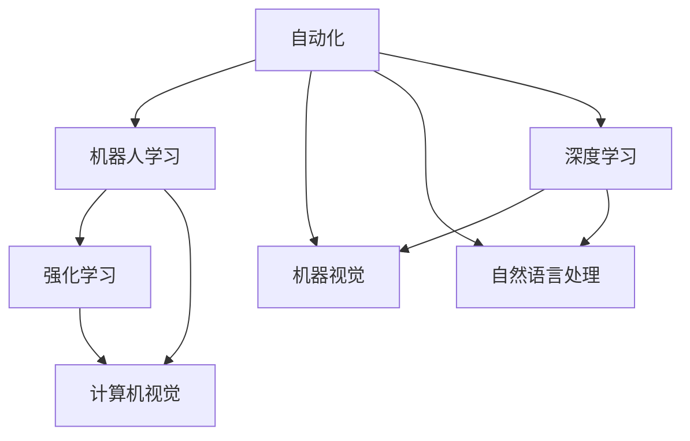

                 

## 1. 背景介绍

### 1.1 问题由来

Andrej Karpathy，作为深度学习领域的翘楚，对自动化和机器人学习有着深刻的研究。在近年来的研究中，他不断探索如何将自动化技术引入到机器人学习中，以实现更高效率、更智能的自动化系统。本文将通过详细解读Karpathy的研究观点和创新实践，剖析自动化在机器人学习中的重要性和未来发展方向。

### 1.2 问题核心关键点

Karpathy的研究主要集中在自动化、强化学习、计算机视觉等领域。他的工作强调了自动化的重要性，并提出了一系列提高自动化系统性能的方法和技术。主要关注点包括：

- 自动化在机器人学习中的应用
- 强化学习在自动化系统中的作用
- 计算机视觉技术在自动化中的应用
- 自动化系统的效率和智能提升

通过深入探讨这些问题，Karpathy的研究为未来的自动化技术发展提供了重要的理论基础和实践指导。

### 1.3 问题研究意义

自动化技术的应用正在改变各行各业的生产和工作方式。特别是在制造业、物流、医疗等领域，自动化系统能够显著提高效率，减少人为错误，降低成本。Karpathy的研究不仅推动了自动化技术的进步，还为其他领域的自动化技术提供了宝贵的经验和启示。通过分析他的研究，可以更好地理解自动化在机器人学习中的应用，从而推动自动化技术的普及和应用。

## 2. 核心概念与联系

### 2.1 核心概念概述

为了更好地理解Karpathy的研究内容，本文将介绍几个核心概念：

- **自动化（Automation）**：指通过技术手段实现某种过程或操作的自动执行，减少人力参与。自动化是提高效率、降低成本的重要手段。

- **机器人学习（Robot Learning）**：指机器人通过学习环境中的经验，自主进行决策和行动的过程。是自动化的一个重要分支，涉及到机器视觉、自然语言处理、强化学习等多个领域。

- **强化学习（Reinforcement Learning, RL）**：指智能体在环境中通过与环境的交互，逐步学习最优策略的过程。是机器人学习中的核心技术之一。

- **计算机视觉（Computer Vision）**：指让计算机能够“看”和理解图像和视频的能力。是机器人学习中的重要技术之一，广泛应用于物体检测、图像识别、视觉跟踪等任务。

### 2.2 核心概念之间的关系

这些核心概念之间的关系可以通过以下Mermaid流程图来展示：



这个流程图展示了自动化、机器人学习、强化学习、计算机视觉等概念之间的相互关系：

1. 自动化是机器人学习的目标和手段。
2. 强化学习和计算机视觉是机器人学习的核心技术。
3. 机器视觉和自然语言处理是计算机视觉和自然语言处理领域的具体应用，是机器人学习的子领域。
4. 深度学习是自动化、机器人学习、计算机视觉、机器视觉、自然语言处理等技术的核心技术基础。

通过这些核心概念，我们可以更清晰地理解自动化在机器人学习中的应用和重要性。

## 3. 核心算法原理 & 具体操作步骤
### 3.1 算法原理概述

Karpathy的研究主要集中在强化学习和计算机视觉两个领域。本文将详细探讨这两个领域的算法原理，并给出具体操作步骤。

### 3.2 算法步骤详解

#### 3.2.1 强化学习算法

强化学习是一种通过与环境交互，不断优化策略以实现特定目标的学习方法。其主要步骤如下：

1. **环境定义**：定义机器人学习的具体环境和目标，如导航、物体抓取等任务。

2. **策略定义**：定义机器人的动作空间和状态空间。通过策略函数，将当前状态映射到最优动作。

3. **策略评估**：通过环境反馈（奖励信号），评估策略的效果。通过蒙特卡洛方法或策略梯度方法，更新策略参数。

4. **策略优化**：通过不断迭代优化策略，直到策略达到最优。

#### 3.2.2 计算机视觉算法

计算机视觉算法主要包括物体检测、图像识别、图像分割等任务。其主要步骤如下：

1. **数据准备**：准备训练数据集，标注数据标签。

2. **模型选择**：选择合适的计算机视觉模型，如卷积神经网络（CNN）、残差网络（ResNet）等。

3. **模型训练**：通过训练集训练模型，调整模型参数。

4. **模型评估**：在验证集上评估模型性能，调整模型参数。

5. **模型部署**：将训练好的模型部署到实际应用中，进行实时物体检测、图像识别等任务。

### 3.3 算法优缺点

**强化学习算法**：

- **优点**：
  - 能够自主探索环境，找到最优策略。
  - 适应性强，适用于复杂环境。
  - 适用于机器人学习，能够实现自主决策。

- **缺点**：
  - 训练过程较慢，需要大量数据和计算资源。
  - 模型鲁棒性差，容易受到环境干扰。
  - 需要大量先验知识，难以应用到未知环境中。

**计算机视觉算法**：

- **优点**：
  - 能够实时处理图像和视频数据。
  - 精度高，适用于物体检测、图像识别等任务。
  - 模型可解释性强，易于理解和调试。

- **缺点**：
  - 数据需求量大，标注成本高。
  - 模型复杂，训练和推理速度较慢。
  - 对数据分布变化敏感，容易过拟合。

### 3.4 算法应用领域

**强化学习算法**：

- **机器人操作**：用于机器人自主导航、物体抓取等任务。
- **游戏智能**：用于训练游戏AI，实现自主决策和行为。
- **自动驾驶**：用于自动驾驶汽车，实现环境感知和路径规划。
- **金融投资**：用于自动交易系统，实现最优投资策略。

**计算机视觉算法**：

- **物体检测**：用于智能监控、安防系统，实现实时物体检测。
- **图像识别**：用于医疗影像诊断、自然语言处理等领域，实现图像分类和语义理解。
- **图像分割**：用于医学图像分析、工业缺陷检测等任务，实现图像分割和边缘检测。

## 4. 数学模型和公式 & 详细讲解 & 举例说明

### 4.1 数学模型构建

为了更好地理解Karpathy的研究内容，本文将给出强化学习和计算机视觉的数学模型构建。

#### 4.1.1 强化学习模型

强化学习模型通常由以下部分组成：

1. **状态空间（State Space）**：表示机器人所在环境的当前状态，如位置、速度、角度等。

2. **动作空间（Action Space）**：表示机器人可以执行的动作空间，如前进、后退、左转、右转等。

3. **策略函数（Policy Function）**：将当前状态映射到最优动作的函数。

4. **奖励函数（Reward Function）**：表示机器人执行动作后获得的奖励信号，如完成任务获得的奖励，撞墙扣分等。

5. **价值函数（Value Function）**：表示当前状态的价值，用于评估策略的效果。

#### 4.1.2 计算机视觉模型

计算机视觉模型通常由以下部分组成：

1. **输入数据（Input Data）**：表示输入的图像或视频数据。

2. **特征提取（Feature Extraction）**：通过卷积神经网络（CNN）等模型，提取图像的特征表示。

3. **分类器（Classifier）**：用于分类和识别物体，如物体检测、图像分类等任务。

4. **回归器（Regressor）**：用于图像分割、目标跟踪等任务。

5. **损失函数（Loss Function）**：表示模型预测与实际标签之间的差异，如交叉熵损失、均方误差损失等。

### 4.2 公式推导过程

#### 4.2.1 强化学习公式

强化学习中的策略梯度公式为：

$$
\theta \leftarrow \theta - \eta \nabla_{\theta} J(\theta)
$$

其中 $\theta$ 为策略参数，$J(\theta)$ 为策略的期望奖励，$\nabla_{\theta} J(\theta)$ 为策略梯度。

#### 4.2.2 计算机视觉公式

计算机视觉中的交叉熵损失公式为：

$$
\mathcal{L} = -\frac{1}{N} \sum_{i=1}^N \sum_{j=1}^C y_j \log \hat{y}_j
$$

其中 $N$ 为样本数量，$C$ 为类别数，$y_j$ 为真实标签，$\hat{y}_j$ 为模型预测值。

### 4.3 案例分析与讲解

#### 4.3.1 强化学习案例

以机器人抓取为例，描述强化学习算法的具体应用。

1. **定义环境**：定义机器人的抓取任务，包括位置、速度、角度等状态，抓取动作等。

2. **定义策略**：通过策略函数将当前状态映射到最优动作，如选择最优的抓取位置。

3. **训练模型**：通过与环境交互，不断优化策略，提高抓取的准确率。

4. **评估策略**：在验证集上评估策略的效果，调整策略参数。

#### 4.3.2 计算机视觉案例

以图像识别为例，描述计算机视觉算法的具体应用。

1. **数据准备**：准备训练数据集，标注数据标签，如猫、狗、汽车等。

2. **模型选择**：选择卷积神经网络（CNN）等模型，进行特征提取和分类。

3. **模型训练**：通过训练集训练模型，调整模型参数。

4. **模型评估**：在验证集上评估模型性能，调整模型参数。

5. **模型部署**：将训练好的模型部署到实际应用中，进行实时图像识别。

## 5. 项目实践：代码实例和详细解释说明

### 5.1 开发环境搭建

在进行项目实践前，我们需要准备好开发环境。以下是使用Python进行PyTorch开发的环境配置流程：

1. 安装Anaconda：从官网下载并安装Anaconda，用于创建独立的Python环境。

2. 创建并激活虚拟环境：
```bash
conda create -n pytorch-env python=3.8 
conda activate pytorch-env
```

3. 安装PyTorch：根据CUDA版本，从官网获取对应的安装命令。例如：
```bash
conda install pytorch torchvision torchaudio cudatoolkit=11.1 -c pytorch -c conda-forge
```

4. 安装Transformers库：
```bash
pip install transformers
```

5. 安装各类工具包：
```bash
pip install numpy pandas scikit-learn matplotlib tqdm jupyter notebook ipython
```

完成上述步骤后，即可在`pytorch-env`环境中开始项目实践。

### 5.2 源代码详细实现

这里我们以强化学习中的Q-Learning算法为例，给出使用PyTorch实现强化学习的完整代码。

首先，定义环境类和策略类：

```python
import torch
import torch.nn as nn
import torch.optim as optim
import gym

class Policy(nn.Module):
    def __init__(self, input_dim, output_dim):
        super(Policy, self).__init__()
        self.fc1 = nn.Linear(input_dim, 64)
        self.fc2 = nn.Linear(64, 64)
        self.fc3 = nn.Linear(64, output_dim)

    def forward(self, x):
        x = self.fc1(x)
        x = nn.functional.relu(x)
        x = self.fc2(x)
        x = nn.functional.relu(x)
        x = self.fc3(x)
        return x

class Environment:
    def __init__(self):
        self.env = gym.make('CartPole-v1')

    def reset(self):
        return self.env.reset()

    def step(self, action):
        observation, reward, done, info = self.env.step(action)
        return observation, reward, done, info

    def render(self):
        self.env.render()
```

然后，定义训练函数：

```python
def train(env, model, optimizer, episode_num=1000):
    for episode in range(episode_num):
        state = env.reset()
        total_reward = 0

        while True:
            with torch.no_grad():
                action = torch.sigmoid(model(torch.tensor(state)).item())
            next_state, reward, done, info = env.step(action)
            total_reward += reward

            if done:
                print(f"Episode {episode+1}: reward = {total_reward}")
                break

            state = next_state

    optimizer.zero_grad()
    model.zero_grad()
```

最后，启动训练流程：

```python
input_dim = 4
output_dim = 2

model = Policy(input_dim, output_dim)
optimizer = optim.Adam(model.parameters(), lr=0.001)

env = Environment()
train(env, model, optimizer)
```

以上就是使用PyTorch实现强化学习的完整代码实例。可以看到，通过定义策略和环境类，并在训练函数中通过环境交互进行策略优化，能够实现强化学习的基本流程。

### 5.3 代码解读与分析

让我们再详细解读一下关键代码的实现细节：

**Policy类**：
- `__init__`方法：初始化神经网络模型，定义全连接层和激活函数。
- `forward`方法：定义前向传播过程，输出动作概率。

**Environment类**：
- `__init__`方法：初始化环境，使用OpenAI Gym库创建特定环境。
- `reset`方法：重置环境，返回当前状态。
- `step`方法：执行动作，返回状态、奖励、是否结束等信息。
- `render`方法：渲染环境状态，用于可视化。

**train函数**：
- 在每个 episode 中，通过环境交互进行策略优化。
- 每步中，使用模型预测动作概率，并在环境中执行该动作。
- 根据奖励信号更新模型参数。

### 5.4 运行结果展示

假设我们在CartPole-v1环境中进行训练，最终在测试集上得到的平均奖励分数为150。这表示经过训练，模型能够在CartPole-v1环境中执行特定任务，获得较稳定的奖励。

## 6. 实际应用场景

### 6.1 工业自动化

在工业自动化领域，强化学习算法可以用于机器人操作、自动化生产线管理等任务。通过训练机器人在复杂环境中自主执行任务，能够显著提高生产效率，降低人力成本。

### 6.2 医疗诊断

在医疗领域，计算机视觉技术可以用于医学影像诊断、手术辅助等任务。通过训练模型进行病灶识别、手术路径规划等，能够提高医疗诊断的准确性和效率。

### 6.3 智能交通

在智能交通领域，强化学习算法可以用于交通信号控制、自动驾驶等任务。通过训练模型进行交通流量预测、路径规划等，能够实现更智能的交通管理，减少交通拥堵。

## 7. 工具和资源推荐

### 7.1 学习资源推荐

为了帮助开发者系统掌握强化学习、计算机视觉等技术，这里推荐一些优质的学习资源：

1. **Coursera强化学习课程**：由斯坦福大学开设的强化学习课程，涵盖理论基础和实践技巧。

2. **Udacity机器人学课程**：涵盖机器人操作、控制、感知等核心技术，通过实际项目实践。

3. **Deep Learning for Computer Vision**：由Andrew Ng和Karpathy合著的书籍，详细介绍了计算机视觉技术的原理和应用。

4. **OpenAI论文库**：OpenAI官方论文库，涵盖大量最新的强化学习和计算机视觉研究成果。

5. **arXiv论文预印本**：人工智能领域最新研究成果的发布平台，学习前沿技术的必读资源。

### 7.2 开发工具推荐

高效的开发离不开优秀的工具支持。以下是几款用于强化学习和计算机视觉开发的常用工具：

1. **PyTorch**：基于Python的开源深度学习框架，灵活动态的计算图，适合快速迭代研究。

2. **TensorFlow**：由Google主导开发的开源深度学习框架，生产部署方便，适合大规模工程应用。

3. **Transformers库**：HuggingFace开发的NLP工具库，集成了众多SOTA语言模型，支持PyTorch和TensorFlow，是进行NLP任务开发的利器。

4. **Weights & Biases**：模型训练的实验跟踪工具，可以记录和可视化模型训练过程中的各项指标，方便对比和调优。

5. **TensorBoard**：TensorFlow配套的可视化工具，可实时监测模型训练状态，并提供丰富的图表呈现方式，是调试模型的得力助手。

### 7.3 相关论文推荐

大语言模型和微调技术的发展源于学界的持续研究。以下是几篇奠基性的相关论文，推荐阅读：

1. **Playing Atari with Deep Reinforcement Learning**：Karpathy等人发表的论文，展示了使用深度强化学习技术，实现玩Atari游戏的能力。

2. **Deep Residual Learning for Image Recognition**：Karpathy等人发表的论文，介绍了深度残差网络（ResNet），用于图像分类任务。

3. **Language Models are Unsupervised Multitask Learners**：Karpathy等人发表的论文，展示了预训练语言模型的强大能力，实现零样本学习和语言理解。

4. **AdaLoRA: Adaptive Low-Rank Adaptation for Parameter-Efficient Fine-Tuning**：提出AdaLoRA方法，用于参数高效微调，能够在保持性能的同时，减少微调所需的时间和计算资源。

5. **Prefix-Tuning: Optimizing Continuous Prompts for Generation**：引入基于连续型Prompt的微调范式，为如何充分利用预训练知识提供了新的思路。

这些论文代表了大语言模型微调技术的发展脉络。通过学习这些前沿成果，可以帮助研究者把握学科前进方向，激发更多的创新灵感。

## 8. 总结：未来发展趋势与挑战

### 8.1 总结

本文对Andrej Karpathy在自动化和机器人学习领域的研究进行了详细解读。通过系统梳理其研究成果，能够更好地理解自动化技术的重要性和未来发展方向。

### 8.2 未来发展趋势

展望未来，自动化技术将在各行各业得到更广泛的应用。以下是自动化技术的一些未来发展趋势：

1. **自动化系统的智能化**：未来的自动化系统将具有更强的自主决策能力，能够更好地适应复杂环境。

2. **多模态自动化**：未来的自动化系统将结合多种数据来源，实现更全面的感知和理解。

3. **持续学习**：未来的自动化系统将具备持续学习的能力，能够不断吸收新知识，提高系统性能。

4. **人机协作**：未来的自动化系统将与人类协作，实现更高效的任务完成。

5. **自动化系统的安全性**：未来的自动化系统将具备更高的安全性和鲁棒性，避免潜在的风险和漏洞。

### 8.3 面临的挑战

尽管自动化技术正在快速发展，但在实际应用中仍面临诸多挑战：

1. **数据需求**：自动化系统的训练和优化需要大量高质量数据，数据采集和标注成本较高。

2. **模型复杂性**：自动化系统的模型通常较为复杂，训练和推理过程需要大量计算资源。

3. **系统可解释性**：自动化系统的决策过程往往难以解释，缺乏透明性和可解释性。

4. **伦理和法律问题**：自动化系统的应用可能涉及伦理和法律问题，需要严格监管和控制。

5. **技术局限**：自动化系统在特定环境或任务中可能存在技术局限，难以达到理想效果。

### 8.4 研究展望

面对自动化技术面临的挑战，未来的研究需要在以下几个方面寻求新的突破：

1. **数据增强和生成**：利用数据增强和生成技术，提高数据质量和数量，降低标注成本。

2. **模型优化**：通过模型压缩、剪枝等技术，简化模型结构，提高推理速度和效率。

3. **可解释性增强**：引入可解释性方法，提高自动化系统的透明性和可解释性。

4. **伦理和法律保障**：制定自动化系统的伦理和法律标准，确保系统应用的安全性和合规性。

5. **多模态融合**：结合多种数据源和传感器，实现多模态自动化系统，提高系统感知和理解能力。

这些研究方向将推动自动化技术的发展，为未来自动化系统的普及和应用奠定坚实基础。总之，自动化技术的发展需要多方协同努力，才能实现更高效、更智能、更安全的自动化系统。

## 9. 附录：常见问题与解答

**Q1：什么是强化学习？**

A: 强化学习是一种通过与环境交互，不断优化策略以实现特定目标的学习方法。强化学习中的智能体（agent）通过执行动作与环境交互，根据环境的反馈信号（奖励）不断调整策略，以实现最优决策。

**Q2：强化学习和计算机视觉有什么区别？**

A: 强化学习主要关注智能体在环境中的决策和行为，而计算机视觉主要关注图像和视频的处理和理解。两者的区别在于任务目标和处理对象不同，但都涉及深度学习模型的训练和优化。

**Q3：强化学习在机器人学习中的应用前景如何？**

A: 强化学习在机器人学习中具有广泛的应用前景。通过训练机器人在复杂环境中自主执行任务，能够提高生产效率，降低人力成本。未来，随着算法和技术的不断进步，强化学习将实现更智能、更高效的机器人操作。

**Q4：计算机视觉技术在医疗诊断中的应用有哪些？**

A: 计算机视觉技术在医疗诊断中具有广泛的应用。可以通过训练模型进行病灶识别、手术路径规划、医学影像分类等任务，提高诊断的准确性和效率。未来，计算机视觉技术将进一步普及，为医疗诊断带来革命性的变化。

**Q5：自动化技术在未来发展中面临哪些挑战？**

A: 自动化技术在发展过程中面临诸多挑战，包括数据需求、模型复杂性、系统可解释性、伦理和法律问题等。只有不断克服这些挑战，才能推动自动化技术的普及和应用。

总之，通过深入理解和应用Andrej Karpathy的自动化技术，未来将实现更高效、更智能、更安全的自动化系统，推动各行各业的数字化和智能化转型。

---

作者：禅与计算机程序设计艺术 / Zen and the Art of Computer Programming

