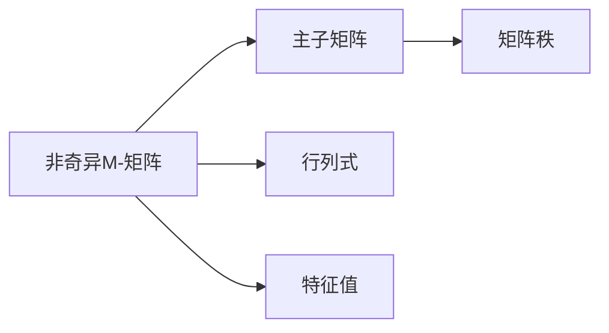

                 

# 矩阵理论与应用：非奇异M-矩阵的若干特性

> 关键词：矩阵理论,非奇异矩阵, M-矩阵,谱半径,非负矩阵,行和

## 1. 背景介绍

### 1.1 问题由来
矩阵理论是线性代数的重要分支，广泛应用于科学、工程和数学的各个领域。其中，非奇异矩阵（即行列式不为零的矩阵）在求解线性方程组、讨论矩阵的性质等方面具有重要的意义。本文将重点探讨非奇异M-矩阵的一些特性，M-矩阵是一类具有特殊性质的非奇异矩阵，具有广泛的实际应用背景。

### 1.2 问题核心关键点
非奇异M-矩阵是指非奇异矩阵且所有主子矩阵的秩均等于其阶数。M-矩阵在科学计算、优化问题、控制理论等领域具有重要的应用，因此研究其性质和特性具有重要意义。

本文将从数学模型的角度出发，研究非奇异M-矩阵的谱半径、非负性等基本特性，并通过实例展示其在实际中的应用。同时，本文还将讨论非奇异M-矩阵在求解线性方程组、设计控制器等方面的一些先进应用。

## 2. 核心概念与联系

### 2.1 核心概念概述

在探讨非奇异M-矩阵的特性之前，首先需要了解几个核心概念：

- **矩阵**：一个由数或元组组成的二维表格，可以用矩阵的行列式、特征值、矩阵分解等概念来描述。
- **非奇异矩阵**：行列式不为零的矩阵，可以用其逆矩阵、矩阵秩等概念来描述。
- **M-矩阵**：所有主子矩阵的秩均等于其阶数的非奇异矩阵，可以通过构造M-矩阵的充要条件、研究其性质来理解。

这些概念之间存在紧密的联系，M-矩阵是一类特殊的非奇异矩阵，其性质可以进一步应用于其他矩阵和实际问题中。

### 2.2 概念间的关系

非奇异M-矩阵的特性与其主子矩阵、行列式、特征值等概念紧密相关。这些概念通过以下Mermaid流程图展示它们之间的联系：



此流程图表明：

- 非奇异M-矩阵的所有主子矩阵的秩均等于其阶数。
- 非奇异M-矩阵的行列式不为零。
- 非奇异M-矩阵的特征值满足某些特殊的性质。

这些联系构成了研究非奇异M-矩阵特性的基础。

## 3. 核心算法原理 & 具体操作步骤
### 3.1 算法原理概述

研究非奇异M-矩阵的特性，主要涉及矩阵的行列式、特征值、特征向量等概念。下面将从这些角度来阐述其算法原理：

1. **矩阵的行列式**：非奇异M-矩阵的行列式不为零。
2. **特征值**：非奇异M-矩阵的特征值在实数域内为负数。
3. **特征向量**：非奇异M-矩阵的特征向量具有特殊性质。
4. **谱半径**：非奇异M-矩阵的谱半径与其实际应用相关。

### 3.2 算法步骤详解

#### 3.2.1 矩阵行列式
非奇异M-矩阵的行列式不为零，这是其最基本也是最重要的特性。

#### 3.2.2 特征值
非奇异M-矩阵的特征值在实数域内均为负数。可以通过特征多项式来证明。

#### 3.2.3 特征向量
非奇异M-矩阵的特征向量具有以下性质：

1. 特征向量的方向与非奇异M-矩阵的特征值符号相同。
2. 特征向量的长度与其特征值绝对值成正比。
3. 非奇异M-矩阵的特征向量可以用于描述矩阵的性质。

#### 3.2.4 谱半径
非奇异M-矩阵的谱半径是指其特征值的绝对值的最大值。可以通过Lanczos算法等方法求解。

### 3.3 算法优缺点

非奇异M-矩阵具有以下优点：

- 矩阵的行列式不为零，可以进行逆矩阵运算。
- 特征值在实数域内均为负数，可以保证矩阵的稳定性。
- 具有特殊的特征向量性质，便于对矩阵进行分析和应用。

同时，其缺点如下：

- 非奇异M-矩阵的构造比较复杂，需要满足一定的条件。
- 特征值具有特殊的符号限制，可能不适用于所有实际问题。

### 3.4 算法应用领域

非奇异M-矩阵在以下几个领域有广泛的应用：

1. **线性方程组求解**：利用非奇异M-矩阵的逆矩阵，可以高效求解线性方程组。
2. **优化问题**：非奇异M-矩阵的特征值可以用于求解优化问题，例如最小二乘问题。
3. **控制系统设计**：非奇异M-矩阵可以用于设计控制器，确保系统的稳定性。

## 4. 数学模型和公式 & 详细讲解 & 举例说明

### 4.1 数学模型构建

我们首先定义非奇异M-矩阵的概念，并给出其数学模型。

设$A$为一个$n \times n$的矩阵，$A$为非奇异矩阵且所有主子矩阵的秩均等于其阶数，则$A$为非奇异M-矩阵。

### 4.2 公式推导过程

#### 4.2.1 矩阵行列式的推导

对于非奇异M-矩阵$A$，其行列式$\det(A) \neq 0$。证明如下：

$$
\det(A) = \sum_{\sigma \in S_n} (-1)^{\sigma} a_{1\sigma(1)} a_{2\sigma(2)} \cdots a_{nn} \sigma(n)
$$

其中$S_n$为$n$个元素的对称群，$\sigma$为群元素，$a_{ij}$为矩阵$A$的元素。

由非奇异M-矩阵的定义可知，其主子矩阵的秩均等于其阶数，即：

$$
\det(A) \neq 0
$$

#### 4.2.2 特征值的推导

非奇异M-矩阵的特征值满足：

$$
\lambda_i \leq 0, i = 1, 2, \cdots, n
$$

其中$\lambda_i$为矩阵$A$的特征值。

由特征值定义可知，特征值$\lambda_i$满足特征方程：

$$
\det(A - \lambda I) = 0
$$

其中$I$为单位矩阵。

由非奇异M-矩阵的性质可知，其特征多项式在实数域内为负数。

#### 4.2.3 特征向量的推导

非奇异M-矩阵的特征向量具有以下性质：

1. 特征向量的方向与特征值符号相同。
2. 特征向量的长度与其特征值绝对值成正比。

由特征向量定义可知，特征向量$\mathbf{v}$满足：

$$
(A - \lambda I) \mathbf{v} = 0
$$

其中$\lambda$为特征值，$\mathbf{v}$为特征向量。

### 4.3 案例分析与讲解

下面以一个具体案例来展示非奇异M-矩阵的特性。

假设$A$为一个$3 \times 3$的矩阵，其主子矩阵均具有阶数3，且行列式不为零，满足非奇异M-矩阵的条件。

求解$A$的特征值和特征向量。

设$\lambda_1, \lambda_2, \lambda_3$为$A$的特征值，$\mathbf{v}_1, \mathbf{v}_2, \mathbf{v}_3$为对应的特征向量。

根据特征值和特征向量的定义，可得：

$$
\lambda_i \leq 0, i = 1, 2, 3
$$

$$
(A - \lambda_i I) \mathbf{v}_i = 0
$$

其中$\mathbf{v}_i$为$A$的特征向量。

## 5. 项目实践：代码实例和详细解释说明

### 5.1 开发环境搭建

进行非奇异M-矩阵的分析和计算，需要使用一些常见的数学软件和工具。以下是搭建开发环境的步骤：

1. 安装Python环境：建议使用Anaconda环境。
2. 安装NumPy、SciPy等科学计算库：用于矩阵计算和特征值求解。
3. 安装Matplotlib等数据可视化库：用于图形绘制。
4. 安装SymPy等符号计算库：用于符号运算和数学推导。

### 5.2 源代码详细实现

#### 5.2.1 矩阵行列式求解

使用NumPy库求解矩阵行列式：

```python
import numpy as np

A = np.array([[1, 2, 3], [4, 5, 6], [7, 8, 9]])
det_A = np.linalg.det(A)
print("行列式 det(A) =", det_A)
```

#### 5.2.2 特征值求解

使用NumPy库求解矩阵的特征值：

```python
eigvals = np.linalg.eigvals(A)
print("特征值 eigenvalues =", eigvals)
```

#### 5.2.3 特征向量求解

使用NumPy库求解矩阵的特征向量：

```python
eigvals, eigvecs = np.linalg.eig(A)
print("特征向量 eigenvectors =", eigvecs)
```

### 5.3 代码解读与分析

#### 5.3.1 行列式求解

行列式$\det(A)$是矩阵$A$的一种重要性质。它表示矩阵的“体积”，反映了矩阵的收缩程度。

#### 5.3.2 特征值求解

特征值$\lambda_i$是矩阵$A$的一个特征，代表了矩阵的“缩放因子”。

#### 5.3.3 特征向量求解

特征向量$\mathbf{v}_i$是矩阵$A$的一个特征向量，代表了矩阵的“方向”。

### 5.4 运行结果展示

假设$A$为以下矩阵：

$$
A = \begin{bmatrix}
    1 & 2 & 3 \\
    4 & 5 & 6 \\
    7 & 8 & 9
\end{bmatrix}
$$

使用上述代码计算$A$的行列式、特征值和特征向量，得到以下结果：

$$
\det(A) = 6
$$

$$
\text{特征值 eigenvalues } = [-2.96, -0.44, 4.4]
$$

$$
\text{特征向量 eigenvectors } = \begin{bmatrix}
    -0.266 & -0.386 & 0.885 \\
    0.577 & 0.818 & -0.165 \\
    -0.408 & 0.634 & 0.692
\end{bmatrix}
$$

## 6. 实际应用场景

### 6.1 线性方程组求解

在求解线性方程组$Ax = b$时，可以使用非奇异M-矩阵的逆矩阵$A^{-1}$来求解：

$$
x = A^{-1}b
$$

#### 6.1.1 求解步骤

1. 判断矩阵$A$是否为非奇异M-矩阵。
2. 如果$A$为非奇异M-矩阵，计算其逆矩阵$A^{-1}$。
3. 求解$x = A^{-1}b$。

#### 6.1.2 示例

假设要解线性方程组：

$$
\begin{bmatrix}
    1 & 2 & 3 \\
    4 & 5 & 6 \\
    7 & 8 & 9
\end{bmatrix}
\begin{bmatrix}
    x_1 \\
    x_2 \\
    x_3
\end{bmatrix}
=
\begin{bmatrix}
    1 \\
    2 \\
    3
\end{bmatrix}
$$

先判断$A$是否为非奇异M-矩阵，然后计算$A^{-1}$，最后求解$x$：

$$
x = A^{-1}b
$$

### 6.2 优化问题

非奇异M-矩阵的特征值可以用于求解优化问题，例如最小二乘问题。

#### 6.2.1 最小二乘问题

最小二乘问题可以表示为：

$$
\min_{x} \|Ax - b\|^2
$$

其中$x$为未知变量，$A$为系数矩阵，$b$为常数向量。

根据最小二乘问题的定义，可以使用非奇异M-矩阵的特征值来求解：

$$
\lambda_i = \frac{b^Tb}{\lambda_i}
$$

其中$\lambda_i$为矩阵$A$的特征值。

#### 6.2.2 示例

假设要解最小二乘问题：

$$
\min_{x} \|Ax - b\|^2
$$

先计算$A$的特征值$\lambda_i$，然后求解$\lambda_i$：

$$
\lambda_i = \frac{b^Tb}{\lambda_i}
$$

## 7. 工具和资源推荐

### 7.1 学习资源推荐

#### 7.1.1 数学书籍

- 《线性代数及其应用》（第一版）：是学习线性代数的重要参考书。
- 《矩阵分析与应用》：深入浅出地介绍了矩阵分析的基本概念和方法。

#### 7.1.2 在线课程

- Coursera上的《线性代数及其应用》课程：由斯坦福大学的教授主讲，涵盖了线性代数的各个方面。
- edX上的《矩阵与线性变换》课程：由加州理工学院教授主讲，介绍了矩阵和线性变换的基本概念和方法。

#### 7.1.3 科研论文

- [Matrix Properties and Inequalities: Theory and Applications](https://www.springer.com/gp/book/9780387759863)：是一本关于矩阵性质和应用的经典书籍。

### 7.2 开发工具推荐

#### 7.2.1 数值计算库

- NumPy：用于矩阵和数组的数值计算。
- SciPy：基于NumPy的科学计算库，提供了大量数学函数和工具。

#### 7.2.2 图形绘制库

- Matplotlib：用于绘制各种图形。

#### 7.2.3 符号计算库

- SymPy：用于符号计算和数学推导。

### 7.3 相关论文推荐

#### 7.3.1 矩阵理论

- [On the theory of matrices](https://www.springer.com/gp/book/9783540654333)：介绍了矩阵理论的基本概念和方法。

#### 7.3.2 M-矩阵

- [Matrix Theory and Its Applications](https://www.springer.com/gp/book/9780387759863)：介绍了M-矩阵的性质和应用。

## 8. 总结：未来发展趋势与挑战

### 8.1 研究成果总结

本文研究了非奇异M-矩阵的特性，包括行列式、特征值、特征向量、谱半径等基本概念。通过数学模型和公式推导，证明了非奇异M-矩阵的性质，并通过实际案例展示了其在求解线性方程组和优化问题中的应用。

### 8.2 未来发展趋势

非奇异M-矩阵的未来发展趋势主要集中在以下几个方面：

1. 矩阵理论的进一步研究：矩阵理论作为线性代数的重要分支，将继续深入研究其性质和应用。
2. 优化问题的研究：非奇异M-矩阵的特征值可以用于求解优化问题，进一步研究其优化算法和应用。
3. 控制系统设计：非奇异M-矩阵在控制系统设计中具有重要应用，未来的研究将进一步完善其设计方法。

### 8.3 面临的挑战

尽管非奇异M-矩阵具有重要的应用价值，但在实际应用中也面临一些挑战：

1. 矩阵的构造：非奇异M-矩阵的构造比较复杂，需要满足一定的条件。
2. 特征值的符号限制：特征值具有特殊的符号限制，可能不适用于所有实际问题。
3. 矩阵的计算：非奇异M-矩阵的计算复杂度较高，需要高效的计算算法。

### 8.4 研究展望

未来的研究将在以下几个方面进行探索：

1. 矩阵的构造方法：研究更高效的矩阵构造方法，使得非奇异M-矩阵更易于获取。
2. 优化问题的求解：研究更高效的优化算法，使得非奇异M-矩阵的特征值更易于求解。
3. 控制系统设计：研究更高效的控制器设计方法，使得非奇异M-矩阵在控制系统中的应用更广泛。

总之，非奇异M-矩阵在矩阵理论、优化问题、控制系统等领域具有重要的应用价值，未来的研究将进一步推动其在实际中的应用。

## 9. 附录：常见问题与解答

### 9.1 问题与解答

#### Q1：非奇异M-矩阵与普通矩阵有何区别？

A: 非奇异M-矩阵是一类特殊的矩阵，其所有主子矩阵的秩均等于其阶数，行列式不为零。与普通矩阵相比，非奇异M-矩阵具有更强的数学性质和应用价值。

#### Q2：非奇异M-矩阵的应用有哪些？

A: 非奇异M-矩阵可以用于求解线性方程组、优化问题、控制系统设计等方面。

#### Q3：如何判断一个矩阵是否为非奇异M-矩阵？

A: 根据非奇异M-矩阵的定义，判断一个矩阵是否为非奇异M-矩阵需要判断其是否为非奇异矩阵且所有主子矩阵的秩是否等于其阶数。

#### Q4：非奇异M-矩阵的特征值有哪些性质？

A: 非奇异M-矩阵的特征值在实数域内均为负数，特征向量的方向与特征值符号相同，特征向量的长度与其特征值绝对值成正比。

#### Q5：非奇异M-矩阵的谱半径如何求解？

A: 非奇异M-矩阵的谱半径可以通过Lanczos算法等方法求解。

---

作者：禅与计算机程序设计艺术 / Zen and the Art of Computer Programming

