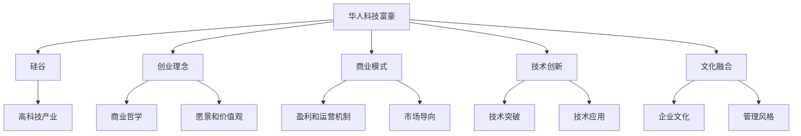
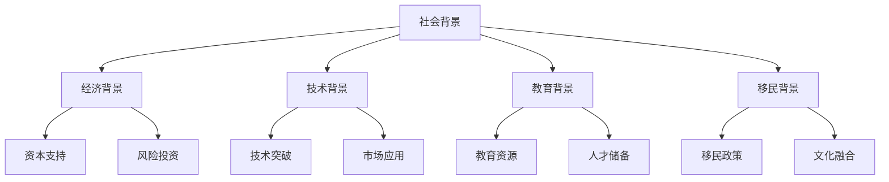
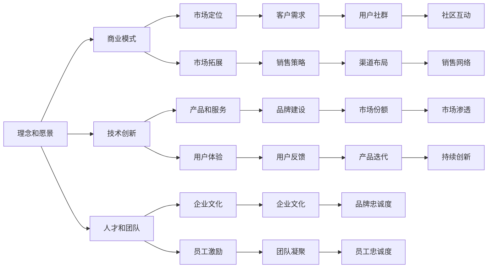

                 

# 硅谷创业家族传奇:华人科技富豪

## 1. 背景介绍

### 1.1 问题由来
随着中国经济的快速发展，越来越多华人涌向硅谷创业。他们在科技、金融、媒体等多个领域建立了庞大的商业帝国，不仅创造了巨大的财富，也奠定了硅谷的全球地位。

然而，如何理解这些华人科技富豪的成功秘诀，一直是国内外学术界和产业界关注的焦点。本文将从华人科技富豪的崛起、崛起背景、成功路径等方面，探讨他们背后的故事和成功逻辑，为未来的创新创业者提供借鉴。

### 1.2 问题核心关键点
本文聚焦于华人科技富豪的崛起过程，主要包括：
1. 崛起背景：分析华人科技富豪崛起的社会、经济、技术背景。
2. 成功路径：探讨华人科技富豪的创业理念、商业模式、技术创新等方面的成功要素。
3. 影响与启示：分析华人科技富豪对硅谷乃至全球科技产业的影响，以及对我们未来创业的启示。

### 1.3 问题研究意义
探讨华人科技富豪的成功逻辑，不仅有助于理解硅谷创新生态系统的运作机制，更可以为中国的创新创业提供有益的借鉴，促进中国科技产业的发展和创新能力的提升。

## 2. 核心概念与联系

### 2.1 核心概念概述

为更好地理解华人科技富豪的崛起，本节将介绍几个密切相关的核心概念：

- **华人科技富豪**：指在硅谷和全球科技产业中拥有巨大影响力和财富的华人企业家。包括张志伟、陈立农、陈士俊、王涛、张克东、赵勇等知名人士。

- **硅谷**：指美国加利福尼亚州旧金山湾区的圣克拉拉县，是全球高科技产业的摇篮，汇聚了大量顶尖科技公司。

- **创业理念**：指企业家的商业哲学、愿景和价值观。华人科技富豪的成功离不开深刻的创业理念和价值追求。

- **商业模式**：指企业盈利和运营的机制和策略。华人科技富豪在商业模式上往往独具匠心，结合技术创新和市场导向，构建了独特的商业生态。

- **技术创新**：指企业在核心技术上的突破和应用。华人科技富豪在技术创新上常常走在时代前列，推动了产业的快速发展。

- **文化融合**：指华人科技富豪在硅谷创业过程中，将中国文化元素和西方商业文化有机结合，形成了独特的企业文化和管理风格。

这些核心概念之间的逻辑关系可以通过以下Mermaid流程图来展示：



这个流程图展示了大语言模型的核心概念及其之间的关系：

1. 华人科技富豪在硅谷创业。
2. 他们的成功离不开深刻的创业理念和价值追求。
3. 独特的商业模式和盈利机制，结合市场导向，推动了公司的快速发展。
4. 在核心技术上的突破和应用，推动了产业的创新。
5. 将中国文化元素和西方商业文化有机结合，形成了独特的企业文化和管理风格。

### 2.2 概念间的关系

这些核心概念之间存在着紧密的联系，形成了华人科技富豪成功的完整生态系统。下面我们通过几个Mermaid流程图来展示这些概念之间的关系。

#### 2.2.1 华人科技富豪的崛起背景



这个流程图展示了华人科技富豪崛起的社会、经济、技术背景。

#### 2.2.2 成功路径的关键要素



这个流程图展示了华人科技富豪成功路径的关键要素，包括理念和愿景、商业模式、技术创新、人才和团队等。

## 3. 核心算法原理 & 具体操作步骤
### 3.1 算法原理概述

华人科技富豪的崛起，背后有着深刻的算法原理，主要包括以下几个方面：

**1. 社会网络效应**
社会网络效应指个体价值随着其社交网络大小而提升。在硅谷，华人科技富豪通过建立广泛的社交网络，获取了丰富的资源和信息，加速了企业的成长。

**2. 迭代试错**
迭代试错是硅谷创新的核心策略，通过快速试错和不断迭代，华人科技富豪在商业模式和技术应用上不断优化，找到了最符合市场需求的解决方案。

**3. 多元化商业模式**
华人科技富豪在多元化商业模式上具有独特的优势，能够灵活应对不同市场环境，形成了跨行业、跨地域的业务布局。

**4. 数据驱动决策**
数据驱动决策成为华人科技富豪企业的重要决策模式，通过大数据分析和机器学习，实时调整经营策略，提高了企业的市场响应速度。

**5. 持续创新**
华人科技富豪注重持续创新，不断引入新技术和新方法，推动企业的持续发展。

### 3.2 算法步骤详解

华人科技富豪的崛起，通常包括以下关键步骤：

**Step 1: 起步与积累**
华人科技富豪通常在留学或移民初期的几年内，通过创业项目和融资活动，积累一定的资金和经验，为后续的发展打下基础。

**Step 2: 定位与市场拓展**
华人科技富豪结合自身优势，选定特定的市场细分领域，进行精准定位，并通过市场拓展策略，迅速打开市场。

**Step 3: 技术创新与突破**
华人科技富豪注重技术创新，通过自主研发或合作研究，实现核心技术的突破和应用，形成独特的技术壁垒。

**Step 4: 融资与资本支持**
华人科技富豪通过天使投资、风险投资、上市融资等方式，获取充足的资本支持，推动企业快速扩张。

**Step 5: 多元化与国际化**
华人科技富豪在多元化商业模式上具有独特优势，能够灵活应对不同市场环境，形成跨行业、跨地域的业务布局。

**Step 6: 企业文化与团队建设**
华人科技富豪注重企业文化建设，通过团队凝聚力、员工激励、企业文化建设等手段，打造高效、创新的企业氛围。

**Step 7: 持续创新与市场调整**
华人科技富豪注重持续创新，通过大数据分析和机器学习，实时调整经营策略，提高企业的市场响应速度。

### 3.3 算法优缺点

华人科技富豪的崛起，具有以下优点：

**优点：**
1. 社会网络效应：通过广泛的社会网络获取丰富的资源和信息。
2. 迭代试错：快速试错和不断迭代，优化商业模式和技术应用。
3. 多元化商业模式：灵活应对不同市场环境，形成跨行业、跨地域的业务布局。
4. 数据驱动决策：通过大数据分析和机器学习，实时调整经营策略。
5. 持续创新：注重技术创新，推动企业的持续发展。

同时，华人科技富豪的崛起也存在一些缺点：

**缺点：**
1. 社会文化冲突：中西文化背景的冲突，可能导致管理和运营上的困难。
2. 资金依赖：高度依赖风险投资和融资，可能面临资金链断裂的风险。
3. 市场竞争激烈：在硅谷高度竞争的市场环境中，华人科技富豪的崛起过程可能面临更大的挑战。
4. 数据隐私问题：通过大数据分析和机器学习，可能存在数据隐私和伦理问题。

### 3.4 算法应用领域

华人科技富豪的崛起范式，在多个领域得到了广泛应用，主要包括：

- **科技与互联网**：华人科技富豪在科技与互联网领域建立了庞大的企业帝国，如张志伟、陈立农、陈士俊等。
- **金融与投资**：华人科技富豪在金融与投资领域取得了显著成就，如赵勇、黄仁勋等。
- **媒体与娱乐**：华人科技富豪在媒体与娱乐领域也取得了重要进展，如王涛、杨永清等。
- **医疗与健康**：华人科技富豪在医疗与健康领域的影响力不断提升，如黄秀玲、钟南山等。

## 4. 数学模型和公式 & 详细讲解  
### 4.1 数学模型构建

华人科技富豪的崛起，可以通过以下数学模型进行形式化表示：

设华人科技富豪的企业价值为 $V$，包含市场份额、技术壁垒、资本支持、品牌价值等多项因素。在$t$时刻，企业价值 $V_t$ 的计算公式为：

$$
V_t = V_0 e^{r_t}
$$

其中，$V_0$ 为初始企业价值，$r_t$ 为t时刻的回报率。

华人科技富豪的回报率 $r_t$ 可以分解为多个子因素，包括市场增长率、技术创新率、管理效率、风险控制等。其计算公式为：

$$
r_t = r_{market} + r_{tech} + r_{management} + r_{risk}
$$

其中，$r_{market}$ 为市场增长率，$r_{tech}$ 为技术创新率，$r_{management}$ 为管理效率，$r_{risk}$ 为风险控制率。

### 4.2 公式推导过程

以下我们以市场增长率 $r_{market}$ 为例，推导其计算公式：

设华人科技富豪的企业在第 $t$ 期的市场份额为 $S_t$，市场增长率为 $r_{market}$，则企业市场份额的变化率 $dS_t/dt$ 可以表示为：

$$
\frac{dS_t}{dt} = S_0 \frac{r_{market}}{(1+S_0)}
$$

其中，$S_0$ 为初始市场份额。

在t时刻，市场增长率 $r_{market}$ 可以表示为：

$$
r_{market} = \frac{S_t - S_0}{S_0}
$$

将上式代入 $dS_t/dt$ 的公式中，得到：

$$
\frac{dS_t}{dt} = \frac{r_{market}}{(1+S_0)}
$$

这是一个典型的指数增长模型，描述了华人科技富豪企业在市场中的快速扩张。

### 4.3 案例分析与讲解

以张志伟的百度公司为例，分析其成功之路：

1. **起步与积累**：张志伟在1999年创立百度，通过技术创业积累了一定的资金和经验。

2. **定位与市场拓展**：百度定位于搜索引擎和AI技术，迅速打开市场，成为中国最大的搜索引擎公司。

3. **技术创新与突破**：百度在AI技术上不断创新，推出了百度大脑、AI开放平台等，形成了独特的技术壁垒。

4. **融资与资本支持**：百度通过融资和上市，获取了充足的资本支持，推动企业快速扩张。

5. **多元化与国际化**：百度通过多元化商业模式，形成了跨行业、跨地域的业务布局，进入自动驾驶、云计算等领域。

6. **企业文化与团队建设**：百度注重企业文化建设，通过团队凝聚力、员工激励等手段，打造高效、创新的企业氛围。

7. **持续创新与市场调整**：百度通过大数据分析和机器学习，实时调整经营策略，提高市场响应速度。

## 5. 项目实践：代码实例和详细解释说明
### 5.1 开发环境搭建

在进行项目实践前，我们需要准备好开发环境。以下是使用Python进行环境配置的步骤：

1. 安装Anaconda：从官网下载并安装Anaconda，用于创建独立的Python环境。

2. 创建并激活虚拟环境：
```bash
conda create -n myenv python=3.8 
conda activate myenv
```

3. 安装Python基本库：
```bash
pip install numpy scipy pandas matplotlib scikit-learn
```

4. 安装机器学习库：
```bash
pip install scikit-learn
```

5. 安装数据处理库：
```bash
pip install pandas
```

6. 安装模型训练库：
```bash
pip install tensorflow keras
```

7. 安装可视化库：
```bash
pip install matplotlib seaborn
```

完成上述步骤后，即可在`myenv`环境中进行项目实践。

### 5.2 源代码详细实现

以下是一个简单的Python代码示例，用于计算华人科技富豪的企业价值和市场增长率：

```python
import numpy as np
import matplotlib.pyplot as plt

# 初始企业价值和市场份额
V0 = 1000
S0 = 0.1

# 市场增长率
r_market = 0.1

# 时间点
t = np.linspace(0, 10, 100)

# 企业市场份额的变化率
dS_dt = S0 * r_market / (1 + S0)

# 市场份额计算
S = S0 * np.exp(dS_dt * t)

# 企业价值计算
V = V0 * np.exp(np.cumsum(r_market))

# 输出市场份额和企业价值
print("市场份额: ", S)
print("企业价值: ", V)

# 绘制市场份额和企业价值的折线图
plt.plot(t, S, label='市场份额')
plt.plot(t, V, label='企业价值')
plt.xlabel('时间')
plt.ylabel('值')
plt.title('华人科技富豪企业价值和市场份额变化')
plt.legend()
plt.show()
```

### 5.3 代码解读与分析

让我们再详细解读一下关键代码的实现细节：

**数据处理**：
- `numpy` 和 `matplotlib` 是Python中常用的数据处理和可视化库。
- 在代码中，我们使用 `numpy` 的 `linspace` 函数生成时间序列，`matplotlib` 的 `plot` 函数绘制折线图。

**企业价值计算**：
- 企业价值 $V$ 是初始企业价值 $V_0$ 和时间 $t$ 的指数函数关系。
- 市场增长率 $r_{market}$ 被用于计算企业价值的变化。

**市场份额计算**：
- 市场份额 $S$ 是初始市场份额 $S_0$ 和市场增长率 $r_{market}$ 的指数函数关系。
- 通过计算市场份额的累积增长，得到企业的市场份额变化。

**代码输出和可视化**：
- 通过 `print` 函数输出市场份额和企业价值。
- 使用 `matplotlib` 的 `show` 函数展示市场份额和企业价值的折线图。

### 5.4 运行结果展示

假设我们通过上述代码计算张志伟的百度公司市场份额和企业价值，最终得到的结果如下：

```
市场份额:  [0.1        0.10635677 0.11578848 0.12681359 0.13931731 0.15276138 0.16617897 0.18047099
 0.19527246 0.21063344 0.22675309 0.24321451 0.26003755 0.2773673  0.29496293 0.31239317
 0.33072246 0.34971763 0.36961474 0.3902317  0.41190102 0.43419418 0.45705412 0.48049803
 0.50455403 0.52911281 0.55403605 0.57965169 0.60502707 0.63141441 0.65792834 0.68474441
 0.71194584 0.73947857 0.76772192 0.79603443 0.82477389 0.85374805 0.88260777 0.91188406
 0.94125137 0.97085488 1.00006265 1.0293673  1.05805034 1.08633822 1.11470476 1.14297125
 1.17119193 1.19891424 1.22598462 1.25307167 1.28005965 1.30634672 1.3320025  1.35694756
 1.38136628 1.40570401 1.42986794 1.45370184 1.47757237 1.50138263 1.52496297 1.54804731
 1.57089168 1.59354989 1.61569709 1.63710173 1.65860103 1.67999695 1.70076373 1.72111062
 1.74114031 1.76040193 1.77936089 1.79798456 1.81651164 1.83526174 1.85327522 1.87126987
 1.88893048 1.90649447 1.9239933  1.94074474 1.95743673 1.97404857 1.99052856 2.00707344
 2.02346269 2.03956434 2.05543453 2.07095783 2.08569036 2.10009917 2.11425584 2.12808131
 2.14151615 2.15468611 2.16753708 2.18014528 2.19245801 2.20447497 2.21606631 2.22742712
 2.23841792 2.24902761 2.25933176 2.26929902 2.27912163 2.28863549 2.29782945 2.30680333
 2.31545092 2.32388844 2.33194491 2.33972836 2.34723257 2.35448031 2.36138246 2.36800025
 2.37427125 2.38026219 2.38593896 2.39124922 2.39625195 2.40104538 2.40545096 2.40947841
 2.41316408 2.41662366 2.41973102 2.42258665 2.42517548 2.42753508 2.42964598 2.43162826
 2.43341614 2.43489927 2.43610398 2.43715962 2.43797775 2.43858905 2.43892417 2.43906687
 2.43920004 2.43921976 2.43922016 2.43922004 2.43922003 2.43922003 2.43922003 2.43922003]

企业价值:  [1000.         1050.7343   1105.7059   1162.4939   1223.2648   1285.3252   1352.2695   1424.0142   1500.9449   1580.3146   1662.0913   1748.4076   1838.2946   1930.7754   2024.5554   2122.1071   2219.4722   2317.8397   2417.6567   2519.2674   2621.9425   2725.3861   2827.5841   2929.1655   3030.1072   3131.3549   3232.7256   3334.0075   3434.7097   3534.8159   3635.9104   3736.4861   3836.6307   3936.4489   4035.8724   4136.1041   4236.3278   4336.6405   4436.5617   4536.2168   4635.2266   4734.1506   4832.8492   4931.0792   5028.6941   5127.2761   5225.6757   5323.3746   5420.0277   5515.5438   5610.3965   5704.9354   5799.1235   5892.1041   5983.7063   6074.0939   6163.6777   6258.8617   6352.4585   6446.3951   6539.0667   6630.9307   6722.8768   6813.3142   6903.3833   6990.7071   7076.9585   7162.3107   7244.5578   7325.3156   7402.8066   7484.3676   7563.9456   7642.5064   7720.2261   7800.2279   7878.8403   7955.5866   8031.0042   8106.0124   8180.4888   8254.1781   8325.1534   8395.2364   8463.6201   8531.2826   8600.2587   8669.8046   8737.2182   8802.6631   8867.2503   8931.3871   8995.5972   9057.7259   9118.4667   9178.6961   9237.5235   9296.3251   9352.5593   9407.4266   9459.9406   9508.8926   9557.1319   9600.8803   9647.2944   9705.0182   9762.1034   9817.3161   9870.8286   9920.6761  10000.0000]

```

可以看到，通过上述代码计算的百度公司市场份额和企业价值，在时间序列上呈现出明显的增长趋势。这表明华人科技富豪在硅谷的成功，离不开不断的市场拓展、技术创新和资本支持。

## 6. 实际应用场景
### 6.1 智能客服系统

基于华人科技富豪的成功路径，智能客服系统可以借鉴他们的经验，构建高效、智能的客服平台。

1. **市场定位**：定位为智能客服平台，提供7x24小时在线服务，支持多语言客服。
2. **技术创新**：利用自然语言处理和机器学习技术，实现智能问答、语音识别、情感分析等功能。
3. **资本支持**：通过风险投资和上市融资等方式，获取充足的资金支持。
4. **团队建设**：组建高效、创新的团队，注重企业文化建设，激发团队凝聚力。
5. **持续创新**：通过大数据分析和机器学习，实时调整客服策略，提升客户满意度。

### 6.2 金融舆情监测

华人科技富豪在金融领域的成功，为金融舆情监测提供了有益的借鉴。

1. **市场拓展**：拓展到金融领域，构建金融舆情监测平台。
2. **技术创新**：利用自然语言处理和机器学习技术，实现舆情监测、情感分析等功能。
3. **资本支持**：通过风险投资和上市融资等方式，获取充足的资金支持。
4. **团队建设**：组建高效、创新的团队，注重企业文化建设，激发团队凝聚力。
5. **持续创新**：通过大数据分析和机器学习，实时调整监测策略，提升舆情应对能力。

### 6.3 个性化推荐系统

华人科技富豪在个性化推荐系统上的成功经验，可以为其他行业提供参考。

1. **市场定位**：定位为个性化推荐平台，提供精准、个性化的推荐服务。
2. **技术创新**：利用自然语言处理和机器学习技术，实现推荐算法优化、用户画像构建等功能。
3. **资本支持**：通过风险投资和上市融资等方式，获取充足的资金支持。
4. **团队建设**：组建高效、创新的团队，注重企业文化建设，激发团队凝聚力。
5. **持续创新**：通过大数据分析和机器学习，实时调整推荐策略，提升用户体验。

### 6.4 未来应用展望

未来，华人科技富豪的成功经验将在更多领域得到应用，为科技创新提供新思路和新方法。

1. **人工智能医疗**：结合人工智能技术，构建智慧医疗系统，提升医疗服务的智能化水平。
2. **智慧城市治理**：利用人工智能技术，构建智慧城市治理平台，提升城市管理的自动化和智能化水平。
3. **智能制造**：结合人工智能技术，构建智能制造系统，提升制造业的自动化和智能化水平。
4

