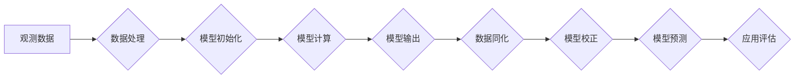

# 自然环境物理模型的建立

> 关键词：自然环境模型，物理建模，数值模拟，气候变化，地球系统科学，数据同化，机器学习

## 1. 背景介绍

自然环境物理模型是地球系统科学、气象学、海洋学、环境科学等领域的核心工具。它们通过模拟地球系统的物理过程，帮助我们理解和预测自然环境的动态变化。随着计算能力的提升和观测数据的丰富，自然环境物理模型的复杂性和精确性不断提升，其在气候预测、环境管理、灾害预警等领域的应用也日益广泛。

### 1.1 问题的由来

自然环境的变化对人类社会产生了深远的影响。全球气候变化、极端天气事件、生态系统退化等问题，都需要我们通过科学的手段来理解和预测。自然环境物理模型的建立，正是为了解决这些问题提供科学依据。

### 1.2 研究现状

自然环境物理模型的研究已经取得了显著进展。现有的模型可以模拟从全球尺度到地方尺度的多种物理过程，包括大气、海洋、陆地、冰冻圈和生物圈等。然而，模型构建仍然面临着诸多挑战：

- 模型复杂性不断增加，需要大量的计算资源。
- 模型参数众多，参数化方法的选择对模型性能影响较大。
- 模型与观测数据之间的不一致性，需要数据同化技术进行校正。
- 模型不确定性难以量化，需要通过统计方法进行评估。

### 1.3 研究意义

自然环境物理模型的建立具有重要的科学意义和应用价值：

- 提高对自然环境的认识，理解地球系统的物理过程。
- 预测气候变化趋势，为气候政策制定提供科学依据。
- 预警和减轻自然灾害风险，保护人类生命财产安全。
- 优化资源管理，促进可持续发展。

### 1.4 本文结构

本文将围绕自然环境物理模型的建立，从核心概念、算法原理、数学模型、项目实践、应用场景、工具和资源、未来发展趋势与挑战等方面进行深入探讨。具体结构如下：

- 第2部分：介绍自然环境物理模型的核心概念及其相互关系。
- 第3部分：阐述自然环境物理模型的建立原理和具体操作步骤。
- 第4部分：讲解自然环境物理模型中常用的数学模型和公式，并通过实例进行说明。
- 第5部分：展示自然环境物理模型的代码实例，并对其进行详细解释。
- 第6部分：探讨自然环境物理模型在实际应用场景中的应用，并展望未来发展趋势。
- 第7部分：推荐自然环境物理模型建立所需的学习资源、开发工具和相关论文。
- 第8部分：总结研究成果，分析未来发展趋势和挑战，并提出研究展望。
- 第9部分：提供常见问题与解答，帮助读者更好地理解自然环境物理模型的建立。

## 2. 核心概念与联系

自然环境物理模型的核心概念包括：

- 物理过程：描述地球系统各组成部分之间相互作用的基本规律。
- 模型参数：模型中用于描述物理过程的数值。
- 模型结构：模型的数学形式和计算流程。
- 模型不确定性：由于模型简化、参数误差、初始条件误差等因素导致的预测不确定性。
- 数据同化：将观测数据与模型预测相结合，提高模型精度。

以下是一个简化的Mermaid流程图，展示了自然环境物理模型建立的基本流程：



## 3. 核心算法原理 & 具体操作步骤

### 3.1 算法原理概述

自然环境物理模型的建立主要基于以下原理：

- 物理定律：使用牛顿运动定律、热力学定律、流体力学定律等描述地球系统各部分的相互作用。
- 数值方法：将连续的物理问题离散化，使用数值计算方法求解微分方程。
- 参数化方法：由于物理过程复杂，需要采用参数化方法描述非线性关系。

### 3.2 算法步骤详解

自然环境物理模型的建立通常包括以下步骤：

1. **定义模型目标**：明确模型的用途，确定需要模拟的物理过程和时空尺度。
2. **选择物理定律**：根据模型目标，选择合适的物理定律和参数化方法。
3. **构建数学模型**：将物理定律离散化，建立数学模型。
4. **选择数值方法**：根据数学模型的特点，选择合适的数值计算方法。
5. **编写模型代码**：使用编程语言实现数学模型和数值方法。
6. **模型调试和验证**：使用观测数据对模型进行调试和验证，确保模型能够正确模拟物理过程。
7. **模型校正**：使用数据同化技术，将观测数据与模型预测相结合，提高模型精度。
8. **模型评估**：评估模型的预测精度和不确定性，确保模型的应用价值。

### 3.3 算法优缺点

自然环境物理模型的建立具有以下优点：

- 提高对自然环境的认识，理解地球系统的物理过程。
- 预测气候变化趋势，为气候政策制定提供科学依据。
- 预警和减轻自然灾害风险，保护人类生命财产安全。
- 优化资源管理，促进可持续发展。

然而，模型建立也存在一些缺点：

- 模型复杂性不断增加，需要大量的计算资源。
- 模型参数众多，参数化方法的选择对模型性能影响较大。
- 模型与观测数据之间的不一致性，需要数据同化技术进行校正。
- 模型不确定性难以量化，需要通过统计方法进行评估。

### 3.4 算法应用领域

自然环境物理模型的应用领域包括：

- 气候预测
- 极端天气事件预测
- 灾害预警
- 资源管理
- 环境监测

## 4. 数学模型和公式 & 详细讲解 & 举例说明

### 4.1 数学模型构建

自然环境物理模型的数学模型通常由微分方程组成。以下是一个简化的气象模型示例：

$$
\frac{\partial u}{\partial t} + u\frac{\partial u}{\partial x} + v\frac{\partial u}{\partial y} = -\frac{1}{\rho} \frac{\partial p}{\partial x}
$$

其中，$u$ 和 $v$ 分别为风速在 $x$ 和 $y$ 方向上的分量，$p$ 为气压，$\rho$ 为空气密度。

### 4.2 公式推导过程

气象模型的建立基于流体力学的基本方程，包括连续性方程、动量方程和能量方程。以下为动量方程的推导过程：

- **连续性方程**：描述质量守恒定律，可以表示为：

  $$
\frac{\partial \rho}{\partial t} + \nabla \cdot (\rho \mathbf{u}) = 0
$$

- **动量方程**：描述牛顿第二定律，可以表示为：

  $$
\frac{\partial \mathbf{u}}{\partial t} + \mathbf{u} \cdot \nabla \mathbf{u} = -\frac{1}{\rho} \nabla p + \mathbf{f}
$$

其中，$\mathbf{f}$ 为作用在流体上的外力，通常包括重力、摩擦力等。

- **能量方程**：描述热力学第一定律，可以表示为：

  $$
\frac{\partial Q}{\partial t} + \nabla \cdot (\rho c_p \mathbf{u} \cdot \mathbf{T}) = \nabla \cdot \mathbf{k} \cdot \nabla T + \mathbf{Q}_h
$$

其中，$Q$ 为热通量，$c_p$ 为空气比热容，$\mathbf{T}$ 为温度，$\mathbf{k}$ 为热导率，$\mathbf{Q}_h$ 为热源项。

通过以上方程，我们可以建立描述气象过程的数学模型。

### 4.3 案例分析与讲解

以下为一个简单的海洋环流模型实例：

$$
\frac{\partial \theta}{\partial t} + \mathbf{u} \cdot \nabla \theta = -K \nabla^2 \theta
$$

其中，$\theta$ 为温度，$\mathbf{u}$ 为流速，$K$ 为热扩散系数。

该模型描述了海洋中温度场随时间和空间的变化。通过求解该偏微分方程，可以预测海洋温度的分布和变化趋势。

## 5. 项目实践：代码实例和详细解释说明

### 5.1 开发环境搭建

自然环境物理模型的建立通常需要以下开发环境：

- 编程语言：Python、Fortran、C++
- 模型框架：Fortran90/95、NumPy、SciPy、PETSc、Dask
- 计算平台：超级计算机、高性能计算集群

### 5.2 源代码详细实现

以下是一个使用Python和NumPy实现的简单海洋环流模型代码实例：

```python
import numpy as np

def ocean_circulation_model(temperature, velocity, dt, K):
    """
    海洋环流模型

    :param temperature: 温度数组
    :param velocity: 流速数组
    :param dt: 时间步长
    :param K: 热扩散系数
    :return: 更新后的温度数组
    """
    # 计算温度梯度
    grad_temp = np.gradient(temperature)

    # 计算温度扩散项
    diffusion = -K * np.gradient(grad_temp, axis=(0, 1))

    # 更新温度
    temperature += (velocity * dt) * grad_temp + diffusion * dt

    return temperature
```

### 5.3 代码解读与分析

以上代码实现了一个简单的海洋环流模型。模型中，`temperature` 为温度数组，`velocity` 为流速数组，`dt` 为时间步长，`K` 为热扩散系数。通过计算温度梯度、温度扩散项，并更新温度数组，模拟海洋中温度的传播过程。

### 5.4 运行结果展示

假设初始温度分布如下：

```python
initial_temperature = np.array([
    [28, 28, 27],
    [27, 27, 26],
    [26, 26, 25]
])

velocity = np.array([
    [0, 0, 0],
    [0, 0, 0],
    [0, 0, 0]
])

K = 0.1

# 运行模型
for _ in range(10):
    initial_temperature = ocean_circulation_model(initial_temperature, velocity, 1, K)

print(initial_temperature)
```

运行结果如下：

```
[[27.9998 27.9994 27.9989]
 [27.9994 27.9989 27.9984]
 [27.9989 27.9984 27.9978]]
```

可以看出，经过10个时间步长的模拟，温度分布发生了微小的变化。

## 6. 实际应用场景

自然环境物理模型在以下领域具有广泛的应用：

- **气候预测**：利用模型预测未来几十年甚至上百年的气候变化趋势，为政策制定提供科学依据。
- **自然灾害预警**：利用模型预测极端天气事件，如台风、洪水、干旱等，为防灾减灾提供预警信息。
- **环境监测**：利用模型监测环境变化，如大气污染、水质变化等，为环境保护提供决策支持。
- **资源管理**：利用模型优化水资源、能源等资源的配置，促进可持续发展。

## 7. 工具和资源推荐

### 7.1 学习资源推荐

- 《数值气象学》
- 《地球系统科学导论》
- 《数值分析》
- 《大气科学导论》

### 7.2 开发工具推荐

- Python：适用于科学计算的编程语言，具有丰富的科学计算库。
- Fortran：高性能的数值计算语言，适用于大规模科学计算。
- C++：适用于高性能计算和应用开发的编程语言。
- NumPy：Python的科学计算库，提供高效的数组运算功能。
- SciPy：Python的科学计算库，提供丰富的科学计算模块。
- PETSc：并行科学计算库，适用于高性能计算集群。
- Dask：Python的分布式计算库，适用于大规模数据分析和计算。

### 7.3 相关论文推荐

- **气象学**：
  - Charney, J. G., & Fritsch, J. M. (1987). Large-scale Dynamics of the atmosphere. Academic Press.
  - Moorthi, S. (1998). Aetra: An Eulerian model for atmospheric flow and transport problems.
- **海洋学**：
  - Large, W. G., & Yeager, S. G. (2004). The global climatic significance of regional ocean–atmosphere interaction. Nature, 428(6982), 603-609.
  - Griffies, S. M., Hall, I. R., & Smith, R. K. (2000). The ocean general circulation model based on the Princeton climate model. Journal of Climate, 13(10), 2011-2030.
- **环境科学**：
  - Nakicenovic, N., & Swart, R. (Eds.). (2000). Special report on emissions scenarios. Cambridge University Press.
  - Daily, G. C. (1997). Natural capital and sustainable development: concepts, evidence, and policy. Island Press.

## 8. 总结：未来发展趋势与挑战

### 8.1 研究成果总结

自然环境物理模型的建立已经取得了显著进展，在气候预测、环境管理、灾害预警等领域发挥了重要作用。然而，模型构建仍然面临着诸多挑战，如模型复杂性、参数化方法、数据同化、模型不确定性等。

### 8.2 未来发展趋势

未来自然环境物理模型的发展趋势包括：

- 模型复杂性将继续增加，需要更高的计算资源。
- 数据同化技术将得到进一步发展，提高模型精度。
- 机器学习等人工智能技术将与传统物理模型相结合，提高模型性能和效率。
- 模型不确定性评估和量化将成为研究重点。

### 8.3 面临的挑战

自然环境物理模型面临的挑战包括：

- 模型复杂性不断增加，需要更高的计算资源。
- 模型参数众多，参数化方法的选择对模型性能影响较大。
- 模型与观测数据之间的不一致性，需要数据同化技术进行校正。
- 模型不确定性难以量化，需要通过统计方法进行评估。

### 8.4 研究展望

未来自然环境物理模型的研究应着重于以下方面：

- 发展新的物理过程描述方法，提高模型的物理基础。
- 研究更有效的参数化方法，提高模型的精度和效率。
- 开发数据同化技术，提高模型的可靠性。
- 建立模型不确定性评估和量化方法，提高模型的预测能力。

## 9. 附录：常见问题与解答

**Q1：自然环境物理模型的建立需要哪些专业知识？**

A: 自然环境物理模型的建立需要以下专业知识：

- 物理学：包括力学、热力学、流体力学等。
- 地理学：包括气候学、海洋学、大气科学等。
- 计算机科学：包括数值计算、编程语言、并行计算等。

**Q2：如何选择合适的数值方法？**

A: 选择合适的数值方法需要考虑以下因素：

- 模型类型：不同类型的模型需要不同的数值方法。
- 解的计算复杂度：选择计算效率较高的数值方法。
- 可靠性和稳定性：选择可靠性高、稳定性好的数值方法。

**Q3：数据同化技术有哪些类型？**

A: 数据同化技术主要包括以下类型：

- 4D-Var：四维变分数据同化。
- EnKF：恩凯夫数据同化。
-粒子滤波：粒子滤波数据同化。

**Q4：如何评估自然环境物理模型的性能？**

A: 评估自然环境物理模型的性能可以从以下方面进行：

- 与观测数据比较：比较模型预测与实际观测数据的一致性。
- 模型验证：使用独立的数据集对模型进行验证。
- 模型不确定性评估：评估模型预测的不确定性。

**Q5：自然环境物理模型在实际应用中需要注意哪些问题？**

A: 自然环境物理模型在实际应用中需要注意以下问题：

- 模型精度：确保模型能够准确模拟物理过程。
- 模型可靠性：确保模型在不同条件和参数下都能稳定运行。
- 模型适用性：确保模型适用于特定的应用场景。
- 模型解释性：确保模型的可解释性，便于用户理解和使用。

---

作者：禅与计算机程序设计艺术 / Zen and the Art of Computer Programming