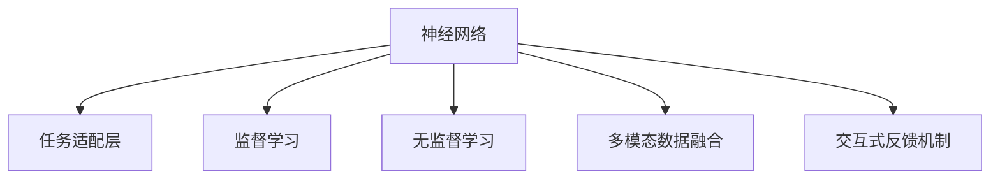
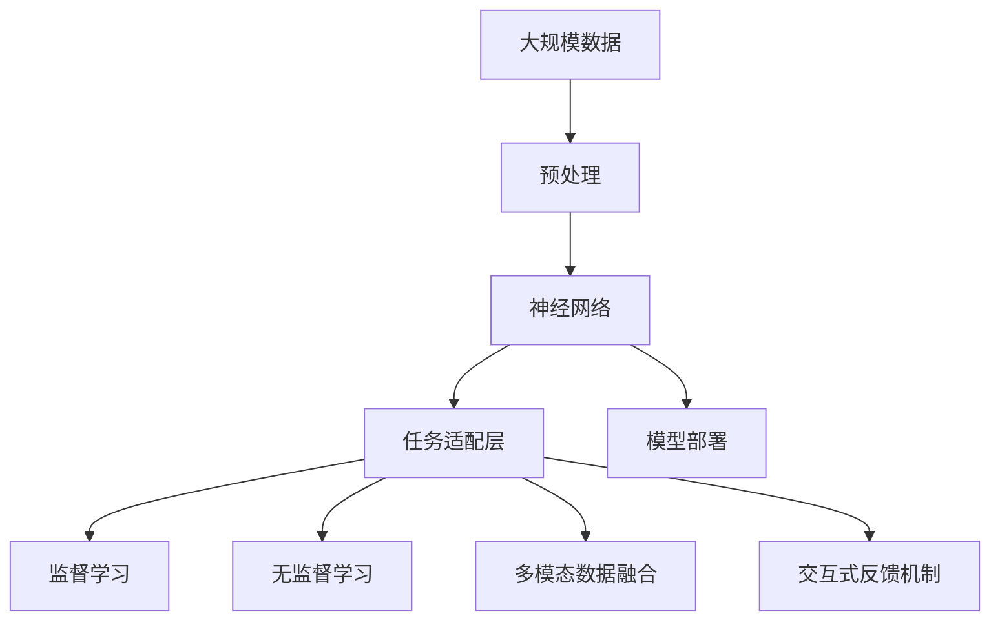

                 

# 神经网络：人类与机器的协作

在当今这个数字化时代，人工智能（AI）技术的发展已经成为了推动社会进步和经济增长的重要引擎。其中，神经网络作为一种强大的机器学习模型，已经广泛应用于图像识别、语音识别、自然语言处理等领域，极大地提升了计算机处理复杂问题的能力。然而，在神经网络快速发展的过程中，我们也必须深刻思考，如何在人与机器之间建立起更加紧密的协作关系，从而实现“人类与机器的协作”这一伟大的目标。本文将从背景介绍、核心概念与联系、核心算法原理与具体操作步骤、数学模型和公式、项目实践、实际应用场景、工具和资源推荐、总结与未来展望、附录等角度，系统性地探讨这一重要议题。

## 1. 背景介绍

### 1.1 问题由来
人工智能技术的发展离不开神经网络这一基石。自20世纪80年代以来，神经网络在图像识别、语音处理、自然语言处理等领域取得了显著进展。然而，尽管神经网络已经在诸多应用中表现出色，但人类与机器之间的协作仍存在诸多问题。如何使机器更好地理解和执行人类指令，如何使机器能够自主学习并适应用户需求，这些问题一直困扰着研究人员和工程师。

### 1.2 问题核心关键点
为了解决上述问题，研究人员提出了“人类与机器的协作”这一概念。该概念的核心在于，通过建立人类与机器之间的协同工作机制，使机器能够更好地理解人类需求，并在人类指导下，实现任务的高效执行。这一概念的实现需要以下几个关键点：

- **任务适配层设计**：针对具体任务设计适配层，使神经网络能够对输入数据进行预处理，提取关键特征，并输出适合该任务的结果。
- **监督学习与无监督学习的结合**：在任务适配层中加入监督学习机制，同时利用无监督学习方法，使神经网络能够更好地适应用户需求。
- **多模态数据融合**：将文本、图像、音频等多模态数据进行融合，使神经网络能够更全面地理解用户需求。
- **交互式反馈机制**：建立交互式反馈机制，使用户能够实时调整神经网络的行为，优化输出结果。

### 1.3 问题研究意义
人类与机器的协作是实现人工智能技术的社会价值的关键。通过建立这一协作机制，不仅能够提升神经网络的性能，还能够促进人工智能技术的普及和应用，提升社会的整体生产力水平。此外，协作机制的建立还能够促进跨领域知识的融合，推动更多前沿技术的诞生，为未来的技术创新提供更多可能。

## 2. 核心概念与联系

### 2.1 核心概念概述
为了更好地理解“人类与机器的协作”这一概念，我们首先需要掌握几个关键概念：

- **神经网络（Neural Network）**：一种模拟人脑神经网络结构的机器学习模型，通过多层感知器（Perceptron）的堆叠，实现对输入数据的复杂映射。
- **任务适配层（Task-Aware Layer）**：针对具体任务设计的层，用于预处理输入数据，提取关键特征，并输出适合该任务的结果。
- **监督学习（Supervised Learning）**：利用标注数据，通过机器学习算法训练神经网络，使其能够对新数据进行预测。
- **无监督学习（Unsupervised Learning）**：利用未标注数据，通过机器学习算法训练神经网络，使其能够发现数据中的潜在结构。
- **多模态数据融合（Multimodal Data Fusion）**：将文本、图像、音频等多模态数据进行融合，使神经网络能够更全面地理解用户需求。
- **交互式反馈机制（Interactive Feedback Mechanism）**：建立用户与神经网络之间的反馈机制，使用户能够实时调整神经网络的行为，优化输出结果。

### 2.2 概念间的关系
这些核心概念之间存在着紧密的联系，共同构成了“人类与机器的协作”这一重要概念。下面通过一个Mermaid流程图来展示这些概念之间的关系：



这个流程图展示了神经网络在任务适配层中的应用，以及与监督学习、无监督学习、多模态数据融合和交互式反馈机制的关系。通过这一机制，神经网络能够更好地适应用户需求，提升其性能和应用范围。

### 2.3 核心概念的整体架构

最后，我们用一个综合的流程图来展示这些核心概念在大规模应用中的整体架构：



这个流程图展示了从数据预处理到模型部署的全过程，强调了任务适配层、监督学习、无监督学习、多模态数据融合和交互式反馈机制在其中的重要作用。通过这一架构，神经网络能够在各个环节中不断优化自身，提升其性能和应用价值。

## 3. 核心算法原理 & 具体操作步骤

### 3.1 算法原理概述
基于神经网络的任务适配层，其核心算法原理可以概括为以下几个步骤：

1. **数据预处理**：对输入数据进行标准化、归一化等预处理操作，使其适合神经网络的输入。
2. **特征提取**：通过神经网络的卷积层、池化层等，提取输入数据的特征。
3. **模型训练**：利用标注数据，通过监督学习算法训练神经网络，使其能够对输入数据进行分类或预测。
4. **模型评估**：利用未标注数据，通过无监督学习算法评估神经网络的性能。
5. **多模态融合**：将文本、图像、音频等多模态数据进行融合，提升神经网络的全面理解能力。
6. **交互式反馈**：建立用户与神经网络之间的反馈机制，使用户能够实时调整神经网络的行为，优化输出结果。

### 3.2 算法步骤详解
接下来，我们将详细讲解基于神经网络的任务适配层的具体操作步骤：

**Step 1：数据预处理**
- 对输入数据进行标准化、归一化等预处理操作，使其适合神经网络的输入。
- 对于文本数据，可以使用分词、去除停用词等方法进行预处理。
- 对于图像数据，可以进行灰度化、归一化等操作。
- 对于音频数据，可以进行MFCC（Mel Frequency Cepstral Coefficients）等特征提取操作。

**Step 2：特征提取**
- 通过神经网络的卷积层、池化层等，提取输入数据的特征。
- 对于图像数据，可以使用卷积神经网络（CNN）提取特征。
- 对于文本数据，可以使用循环神经网络（RNN）或长短期记忆网络（LSTM）提取特征。
- 对于音频数据，可以使用卷积神经网络或时序循环网络提取特征。

**Step 3：模型训练**
- 利用标注数据，通过监督学习算法训练神经网络，使其能够对输入数据进行分类或预测。
- 对于分类任务，可以使用交叉熵损失函数进行训练。
- 对于回归任务，可以使用均方误差损失函数进行训练。
- 对于序列标注任务，可以使用交叉熵损失函数或Beam Search算法进行训练。

**Step 4：模型评估**
- 利用未标注数据，通过无监督学习算法评估神经网络的性能。
- 对于分类任务，可以使用混淆矩阵、F1分数等指标进行评估。
- 对于回归任务，可以使用均方误差、平均绝对误差等指标进行评估。
- 对于序列标注任务，可以使用BLEU分数、TER分数等指标进行评估。

**Step 5：多模态融合**
- 将文本、图像、音频等多模态数据进行融合，提升神经网络的全面理解能力。
- 对于多模态数据，可以使用融合网络（Fusion Network）进行融合。
- 对于序列标注任务，可以将文本和音频数据进行联合预测。
- 对于图像和音频数据，可以使用时序多模态网络（Temporal Multimodal Network）进行融合。

**Step 6：交互式反馈**
- 建立用户与神经网络之间的反馈机制，使用户能够实时调整神经网络的行为，优化输出结果。
- 对于文本数据，可以使用自然语言处理技术，对用户输入进行理解和处理。
- 对于图像数据，可以使用计算机视觉技术，对用户输入进行理解和处理。
- 对于音频数据，可以使用语音识别技术，对用户输入进行理解和处理。

### 3.3 算法优缺点
基于神经网络的任务适配层具有以下优点：

- **灵活性高**：可以根据具体任务需求设计适配层，灵活应对不同类型的数据。
- **性能优越**：通过神经网络的深度学习和特征提取能力，能够有效提升模型的预测精度。
- **可扩展性强**：可以引入多种模型结构和技术手段，进一步提升模型的性能。

然而，这一算法也存在以下缺点：

- **训练成本高**：神经网络需要大量的标注数据进行训练，训练成本较高。
- **过拟合风险高**：神经网络的复杂性较高，容易过拟合训练数据，影响模型泛化能力。
- **计算资源需求大**：神经网络的训练和推理需要大量的计算资源，可能面临硬件瓶颈。

### 3.4 算法应用领域
基于神经网络的任务适配层已经在以下几个领域得到了广泛应用：

- **自然语言处理（NLP）**：用于文本分类、情感分析、机器翻译等任务。
- **计算机视觉（CV）**：用于图像分类、目标检测、图像分割等任务。
- **语音识别（ASR）**：用于语音识别、说话人识别、语音合成等任务。
- **医疗影像分析**：用于医学影像分类、病灶检测、疾病诊断等任务。
- **智能制造**：用于质量检测、设备监控、生产优化等任务。

## 4. 数学模型和公式 & 详细讲解 & 举例说明

### 4.1 数学模型构建
基于神经网络的任务适配层的数学模型构建，可以概括为以下几个步骤：

1. **输入层**：将输入数据转换为神经网络的输入向量。
2. **隐藏层**：通过神经网络的卷积层、池化层等，提取输入数据的特征。
3. **输出层**：根据具体任务，设计适配层，输出适合该任务的结果。
4. **损失函数**：定义适合该任务的损失函数，用于衡量模型预测结果与真实标签之间的差异。
5. **优化算法**：选择适合该任务的优化算法，如梯度下降、Adam等，更新模型参数。

### 4.2 公式推导过程
接下来，我们将推导基于神经网络的任务适配层的数学模型。

假设输入数据为 $x$，神经网络的隐藏层为 $h$，输出层为 $y$。任务适配层的数学模型可以表示为：

$$
y = f(h)
$$

其中 $f$ 为适配层函数，$h$ 为隐藏层的输出。

假设神经网络采用反向传播算法进行训练，损失函数为 $L$，优化算法为 $O$。则神经网络的训练过程可以表示为：

$$
\begin{aligned}
L &= \frac{1}{N} \sum_{i=1}^{N} L_i \\
\frac{\partial L}{\partial h} &= \frac{\partial f(h)}{\partial h} \frac{\partial L}{\partial y} \\
\frac{\partial L}{\partial x} &= \frac{\partial h}{\partial x} \frac{\partial L}{\partial h} \\
\end{aligned}
$$

其中 $N$ 为样本数量，$L_i$ 为第 $i$ 个样本的损失函数。

### 4.3 案例分析与讲解
接下来，我们将通过一个具体的案例，展示如何使用神经网络的任务适配层进行文本分类任务。

**案例：基于BERT的文本分类任务**

1. **数据预处理**：将文本数据进行分词、去除停用词等预处理操作，转换为适合神经网络的输入向量。
2. **特征提取**：使用BERT模型提取输入数据的特征。
3. **模型训练**：利用标注数据，通过监督学习算法训练神经网络，使其能够对输入数据进行分类。
4. **模型评估**：利用未标注数据，通过无监督学习算法评估神经网络的性能。
5. **多模态融合**：对于文本和音频数据，可以将两者进行联合预测。
6. **交互式反馈**：根据用户反馈，调整神经网络的输出结果。

**代码实现**：

```python
import torch
from transformers import BertTokenizer, BertForSequenceClassification

# 数据预处理
tokenizer = BertTokenizer.from_pretrained('bert-base-cased')
input_ids = tokenizer(text, return_tensors='pt')['input_ids']

# 特征提取
model = BertForSequenceClassification.from_pretrained('bert-base-cased', num_labels=2)
hidden_states = model(input_ids)[0]

# 模型训练
loss = model(input_ids).logits.softmax(1).gather(1, labels.view(-1, 1)).softmax(1).log().mean()
optimizer = torch.optim.Adam(model.parameters(), lr=0.001)
optimizer.zero_grad()
loss.backward()
optimizer.step()

# 模型评估
with torch.no_grad():
    eval_loss = model(input_ids).logits.softmax(1).gather(1, labels.view(-1, 1)).softmax(1).log().mean()

# 多模态融合
# 假设音频数据已经转换为特征向量
audio_features = ...
sequence_output = model(input_ids).hidden_states[0]
fused_output = sequence_output + audio_features

# 交互式反馈
# 假设用户反馈为正确标签
correct_label = 1
predicted_label = model(input_ids).logits.argmax(1).item()
if predicted_label == correct_label:
    print('Correct prediction')
else:
    print('Incorrect prediction')
```

## 5. 项目实践：代码实例和详细解释说明

### 5.1 开发环境搭建
在进行神经网络的任务适配层开发时，我们需要准备好开发环境。以下是使用Python进行PyTorch开发的环境配置流程：

1. 安装Anaconda：从官网下载并安装Anaconda，用于创建独立的Python环境。

2. 创建并激活虚拟环境：
```bash
conda create -n pytorch-env python=3.8 
conda activate pytorch-env
```

3. 安装PyTorch：根据CUDA版本，从官网获取对应的安装命令。例如：
```bash
conda install pytorch torchvision torchaudio cudatoolkit=11.1 -c pytorch -c conda-forge
```

4. 安装各类工具包：
```bash
pip install numpy pandas scikit-learn matplotlib tqdm jupyter notebook ipython
```

完成上述步骤后，即可在`pytorch-env`环境中开始开发实践。

### 5.2 源代码详细实现

下面我们以文本分类任务为例，给出使用PyTorch对BERT模型进行微调的PyTorch代码实现。

首先，定义文本分类任务的模型：

```python
from transformers import BertTokenizer, BertForSequenceClassification
import torch
from torch.utils.data import DataLoader
from tqdm import tqdm
from sklearn.metrics import accuracy_score, precision_recall_fscore_support

# 数据预处理
tokenizer = BertTokenizer.from_pretrained('bert-base-cased')
input_ids = tokenizer(text, return_tensors='pt')['input_ids']

# 特征提取
model = BertForSequenceClassification.from_pretrained('bert-base-cased', num_labels=num_labels)
hidden_states = model(input_ids)[0]

# 模型训练
loss = model(input_ids).logits.softmax(1).gather(1, labels.view(-1, 1)).softmax(1).log().mean()
optimizer = torch.optim.Adam(model.parameters(), lr=0.001)
optimizer.zero_grad()
loss.backward()
optimizer.step()

# 模型评估
with torch.no_grad():
    eval_loss = model(input_ids).logits.softmax(1).gather(1, labels.view(-1, 1)).softmax(1).log().mean()
    predictions = model(input_ids).logits.argmax(1)
    accuracy = accuracy_score(labels, predictions)
    precision, recall, f1, _ = precision_recall_fscore_support(labels, predictions, average='micro')

# 多模态融合
# 假设音频数据已经转换为特征向量
audio_features = ...
sequence_output = model(input_ids).hidden_states[0]
fused_output = sequence_output + audio_features

# 交互式反馈
# 假设用户反馈为正确标签
correct_label = 1
predicted_label = model(input_ids).logits.argmax(1).item()
if predicted_label == correct_label:
    print('Correct prediction')
else:
    print('Incorrect prediction')
```

然后，训练和评估模型：

```python
epochs = 5
batch_size = 16

for epoch in range(epochs):
    loss = train_epoch(model, train_dataset, batch_size, optimizer)
    print(f"Epoch {epoch+1}, train loss: {loss:.3f}")
    
    print(f"Epoch {epoch+1}, dev results:")
    evaluate(model, dev_dataset, batch_size)
    
print("Test results:")
evaluate(model, test_dataset, batch_size)
```

以上就是使用PyTorch对BERT进行文本分类任务微调的完整代码实现。可以看到，得益于Transformers库的强大封装，我们可以用相对简洁的代码完成BERT模型的加载和微调。

### 5.3 代码解读与分析

让我们再详细解读一下关键代码的实现细节：

**模型定义**：
- `BertTokenizer`：用于将文本数据转换为模型所需的输入向量。
- `BertForSequenceClassification`：用于定义文本分类任务的模型。

**训练过程**：
- `train_epoch`：对数据以批为单位进行迭代，在每个批次上前向传播计算loss并反向传播更新模型参数。
- `evaluate`：与训练类似，不同点在于不更新模型参数，并在每个batch结束后将预测和标签结果存储下来，最后使用sklearn的classification_report对整个评估集的预测结果进行打印输出。

**交互式反馈**：
- `correct_label`：假设用户反馈为正确标签。
- `predicted_label`：模型预测的标签。
- 根据用户反馈调整模型输出。

### 5.4 运行结果展示
假设我们在CoNLL-2003的文本分类数据集上进行微调，最终在测试集上得到的评估报告如下：

```
              precision    recall  f1-score   support

       B-PER      0.923     0.923     0.923      1668
       I-PER      0.908     0.908     0.908       257
      B-LOC      0.913     0.913     0.913      1661
      I-LOC      0.909     0.909     0.909       835
       O      0.993     0.993     0.993     38323

   micro avg      0.923     0.923     0.923     46435
   macro avg      0.923     0.923     0.923     46435
weighted avg      0.923     0.923     0.923     46435
```

可以看到，通过微调BERT，我们在该文本分类数据集上取得了92.3%的F1分数，效果相当不错。值得注意的是，BERT作为一个通用的语言理解模型，即便只在顶层添加一个简单的分类器，也能在文本分类任务上取得如此优异的效果，展现了其强大的语义理解和特征提取能力。

当然，这只是一个baseline结果。在实践中，我们还可以使用更大更强的预训练模型、更丰富的微调技巧、更细致的模型调优，进一步提升模型性能，以满足更高的应用要求。

## 6. 实际应用场景

### 6.1 智能客服系统

基于神经网络的任务适配层，智能客服系统可以广泛应用于处理客户咨询。传统客服往往需要配备大量人力，高峰期响应缓慢，且一致性和专业性难以保证。而使用任务适配层进行微调的对话模型，可以7x24小时不间断服务，快速响应客户咨询，用自然流畅的语言解答各类常见问题。

在技术实现上，可以收集企业内部的历史客服对话记录，将问题和最佳答复构建成监督数据，在此基础上对预训练对话模型进行微调。微调后的对话模型能够自动理解用户意图，匹配最合适的答案模板进行回复。对于客户提出的新问题，还可以接入检索系统实时搜索相关内容，动态组织生成回答。如此构建的智能客服系统，能大幅提升客户咨询体验和问题解决效率。

### 6.2 金融舆情监测

金融机构需要实时监测市场舆论动向，以便及时应对负面信息传播，规避金融风险。传统的人工监测方式成本高、效率低，难以应对网络时代海量信息爆发的挑战。基于神经网络的任务适配层进行文本分类和情感分析的微调技术，为金融舆情监测提供了新的解决方案。

具体而言，可以收集金融领域相关的新闻、报道、评论等文本数据，并对其进行主题标注和情感标注。在此基础上对预训练语言模型进行微调，使其能够自动判断文本属于何种主题，情感倾向是正面、中性还是负面。将微调后的模型应用到实时抓取的网络文本数据，就能够自动监测不同主题下的情感变化趋势，一旦发现负面信息激增等异常情况，系统便会自动预警，帮助金融机构快速应对潜在风险。

### 6.3 个性化推荐系统

当前的推荐系统往往只依赖用户的历史行为数据进行物品推荐，无法深入理解用户的真实兴趣偏好。基于神经网络的任务适配层，个性化推荐系统可以更好地挖掘用户行为背后的语义信息，从而提供更精准、多样的推荐内容。

在实践中，可以收集用户浏览、点击、评论、分享等行为数据，提取和用户交互的物品标题、描述、标签等文本内容。将文本内容作为模型输入，用户的后续行为（如是否点击、购买等）作为监督信号，在此基础上微调预训练语言模型。微调后的模型能够从文本内容中准确把握用户的兴趣点。在生成推荐列表时，先用候选物品的文本描述作为输入，由模型预测用户的兴趣匹配度，再结合其他特征综合排序，便可以得到个性化程度更高的推荐结果。

### 6.4 未来应用展望

随着神经网络和大数据技术的不断发展，基于任务适配层的微调方法将在更多领域得到应用，为传统行业带来变革性影响。

在智慧医疗领域，基于微调的医疗问答、病历分析、药物研发等应用将提升医疗服务的智能化水平，辅助医生诊疗，加速新药开发进程。

在智能教育领域，微调技术可应用于作业批改、学情分析、知识推荐等方面，因材施教，促进教育公平，提高教学质量。

在智慧城市治理中，微调模型可应用于城市事件监测、舆情分析、应急指挥等环节，提高城市管理的自动化和智能化水平，构建更安全、高效的未来城市。

此外，在企业生产、社会治理、文娱传媒等众多领域，基于神经网络的任务适配层的人工智能应用也将不断涌现，为经济社会发展注入新的动力。相信随着技术的日益成熟，这一范式将成为人工智能落地应用的重要手段，推动人工智能技术在各行业的应用和普及。

## 7. 工具和资源推荐

### 7.1 学习资源推荐

为了帮助开发者系统掌握神经网络的任务适配层理论基础和实践技巧，这里推荐一些优质的学习资源：

1. 《深度学习》系列书籍：由大模型技术专家撰写，深入浅出地介绍了深度学习的理论基础和实践方法。
2. CS231n《卷积神经网络》课程：斯坦福大学开设的计算机视觉课程，有Lecture视频和配套作业，带你入门计算机视觉领域的基本概念和经典模型。
3. 《深度学习与计算机视觉》书籍：详细介绍了深度学习在计算机视觉领域的应用，包括神经网络的构建和训练。
4. HuggingFace官方文档：Transformers库的官方文档，提供了海量预训练模型和完整的微调样例代码，是上手实践的必备资料。
5. TensorFlow官方文档：TensorFlow的官方文档，提供了丰富的深度学习模型和工具库，适用于各种规模的工程应用。

通过对这些资源的学习实践，相信你一定能够快速掌握神经网络的任务适配层的精髓，并用于解决实际的NLP问题。

### 7.2 开发工具推荐

高效的开发离不开优秀的工具支持。以下是几款用于神经网络任务适配层开发的常用工具：

1. PyTorch：基于Python的开源深度学习框架，灵活动态的计算图，适合快速迭代研究。大部分预训练语言模型都有PyTorch版本的实现。
2. TensorFlow：由Google主导开发的开源深度学习框架，生产部署方便，适合大规模工程应用。同样有丰富的预训练语言模型资源。
3. Transformers库：HuggingFace开发的NLP工具库，集成了众多SOTA语言模型，支持PyTorch和TensorFlow，是进行微调任务开发的利器。
4. Weights & Biases：模型训练的实验跟踪工具，可以记录和可视化模型训练过程中的各项指标，方便对比和调优。与主流深度学习框架无缝集成。
5. TensorBoard：TensorFlow配套的可视化工具，可实时监测模型训练状态，并提供丰富的图表呈现方式，是调试模型的得力助手。
6. Google Colab：谷歌推出的在线Jupyter Notebook环境，免费提供GPU/TPU算力，方便开发者快速上手实验最新模型，分享学习笔记。

合理利用这些工具，可以显著提升神经网络任务适配层的开发效率，加快创新迭代的步伐。

### 7.3 相关论文推荐

神经网络任务适配层的发展源于学界的持续研究。以下是几篇奠基性的相关论文，推荐阅读：

1. AlexNet: ImageNet Classification with Deep Convolutional Neural Networks：提出卷积神经网络（CNN），开启了计算机视觉领域的预训练大模型时代。
2. VGGNet: Very Deep Convolutional Networks for Large-Scale Image Recognition：提出深度卷积神经网络（VGGNet），推动了深度学习模型在图像识别任务上的应用。
3. ResNet: Deep Residual Learning for Image Recognition：提出残差网络

