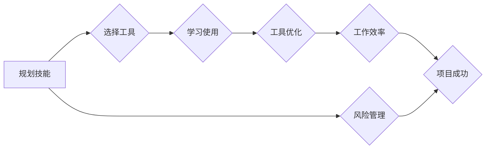

# 规划技能与工具使用的提升

> 关键词：规划技能，工具使用，项目管理，效率提升，自动化，认知负荷，决策疲劳

## 1. 背景介绍

在快速发展的IT行业中，规划技能与工具使用的提升已成为提高工作效率和项目成功关键因素。随着技术的发展，新的工具和平台层出不穷，如何在众多选择中做出明智的决策，如何将工具与个人技能有效结合，成为每一个IT从业者面临的挑战。本文将探讨规划技能与工具使用的提升，提供一系列实用的策略和最佳实践。

### 1.1 问题的由来

在IT行业，以下问题常常困扰着从业者：

- 如何在多任务环境中有效地规划工作？
- 如何选择合适的工具来提升工作效率？
- 如何平衡工具的学习成本与收益？
- 如何将工具与个人技能相结合，实现工作流程的自动化？

### 1.2 研究现状

目前，关于规划技能与工具使用的提升，已有不少研究和实践。项目管理方法论如敏捷开发、精益思想等提供了有效的规划框架。工具选择方面，研究者们提出了基于评估、推荐系统等方法。然而，如何将这些理论与实际操作相结合，仍然是一个值得深入探讨的话题。

### 1.3 研究意义

提升规划技能与工具使用能力，对于IT从业者而言，具有以下重要意义：

- 提高工作效率，减少重复劳动。
- 降低项目风险，提高项目成功率。
- 增强团队协作，提升团队整体能力。
- 促进个人职业发展，适应行业变化。

### 1.4 本文结构

本文将围绕以下结构展开：

- 核心概念与联系，介绍规划技能与工具使用相关的核心概念，并使用Mermaid流程图展示其关系。
- 核心算法原理与具体操作步骤，阐述提升规划技能与工具使用的方法论。
- 数学模型和公式，介绍相关数学模型，并举例说明。
- 项目实践，提供代码实例和详细解释说明。
- 实际应用场景，分析规划技能与工具使用在不同领域的应用。
- 工具和资源推荐，推荐学习资源和开发工具。
- 总结，展望未来发展趋势与挑战。

## 2. 核心概念与联系

### 2.1 核心概念

以下是一些与规划技能和工具使用相关的核心概念：

- **规划技能**：包括时间管理、任务优先级排序、风险管理等。
- **工具使用**：选择和使用软件工具以提高工作效率。
- **项目管理**：对项目进行计划、执行、监控和收尾的过程。
- **认知负荷**：完成复杂任务时，大脑所需的处理能力。
- **决策疲劳**：长时间决策导致的疲劳状态，影响决策质量。

### 2.2 Mermaid流程图

以下是规划技能与工具使用关系的Mermaid流程图：



在这个流程图中，规划技能是整个流程的起点，通过选择合适的工具、学习并优化工具的使用，最终提高工作效率和项目成功率。

## 3. 核心算法原理 & 具体操作步骤

### 3.1 算法原理概述

提升规划技能与工具使用的方法论主要包括以下步骤：

1. **需求分析**：明确项目目标和任务要求。
2. **资源评估**：评估可用资源，包括人力、时间、预算等。
3. **工具选择**：根据需求分析，选择合适的工具。
4. **学习曲线**：学习和掌握所选工具的使用方法。
5. **工作流程优化**：利用工具优化工作流程，提高效率。
6. **持续改进**：根据反馈，不断调整和优化规划与工具使用。

### 3.2 算法步骤详解

#### 3.2.1 需求分析

需求分析是规划工作的第一步，需要明确以下内容：

- 项目目标：项目的最终目标是什么？
- 任务分解：将项目分解为可执行的任务。
- 资源需求：完成项目所需的资源，包括人力、时间、预算等。
- 风险评估：识别项目可能面临的风险。

#### 3.2.2 资源评估

资源评估需要考虑以下因素：

- 人力资源：团队成员的技能、经验等。
- 时间资源：项目的时间进度安排。
- 预算资源：项目的预算限制。

#### 3.2.3 工具选择

选择合适的工具需要考虑以下因素：

- 工具功能：工具是否满足项目需求。
- 工具易用性：工具是否易于学习和使用。
- 工具集成性：工具是否与其他工具兼容。
- 工具成本：工具的购买、维护成本。

#### 3.2.4 学习曲线

学习和掌握所选工具的使用方法需要投入一定的时间和精力。以下是一些提高学习效率的方法：

- 阅读官方文档和教程。
- 参加培训课程。
- 实践操作，将理论知识应用于实际工作。
- 与其他用户交流，分享经验。

#### 3.2.5 工作流程优化

利用工具优化工作流程，可以提高工作效率。以下是一些常见的工作流程优化方法：

- 自动化任务：使用自动化工具完成重复性任务。
- 工作流程简化：减少不必要的步骤，简化工作流程。
- 工作流程标准化：制定标准化的工作流程，提高工作效率。
- 工作流程监控：监控工作流程的执行情况，及时发现和解决问题。

#### 3.2.6 持续改进

根据反馈，不断调整和优化规划与工具使用。以下是一些持续改进的方法：

- 收集用户反馈，了解工具使用情况。
- 定期评估项目进度和资源使用情况。
- 分析项目数据，找出改进空间。
- 不断学习和尝试新的工具和方法。

### 3.3 算法优缺点

#### 3.3.1 优点

- 提高工作效率，减少重复劳动。
- 降低项目风险，提高项目成功率。
- 增强团队协作，提升团队整体能力。
- 促进个人职业发展，适应行业变化。

#### 3.3.2 缺点

- 需要投入一定的时间和精力进行学习和实践。
- 工具选择和优化可能需要专业知识。
- 持续改进需要不断适应行业变化。

### 3.4 算法应用领域

提升规划技能与工具使用的方法论适用于以下领域：

- 软件开发：提高软件开发项目的效率和质量。
- 系统集成：提高系统集成项目的进度和成功率。
- IT运维：提高IT运维团队的工作效率。
- 项目管理：提高项目管理团队的整体能力。

## 4. 数学模型和公式 & 详细讲解 & 举例说明

### 4.1 数学模型构建

以下是一个简单的数学模型，用于评估工具使用对工作效率的影响：

$$
E(W) = a \cdot T(P) + b \cdot T(T)
$$

其中：

- $E(W)$ 表示工作效率（Efficiency）。
- $T(P)$ 表示项目所需时间（Time）。
- $T(T)$ 表示使用工具所需时间（Time for Tool）。
- $a$ 和 $b$ 为权重系数。

### 4.2 公式推导过程

假设项目在没有任何工具辅助的情况下，完成项目所需时间为 $T_0$。在引入工具后，完成项目所需时间为 $T_1$，其中 $T_1 = T(P) + T(T)$。

根据效率的定义，效率 $E(W)$ 可以表示为：

$$
E(W) = \frac{T_0}{T_1} = \frac{T_0}{T(P) + T(T)}
$$

为了方便计算，我们可以引入权重系数 $a$ 和 $b$，将上式改写为：

$$
E(W) = a \cdot T(P) + b \cdot T(T)
$$

其中：

- $a = \frac{1}{T_0}$
- $b = \frac{T_0}{T(P) + T(T)} - a$

### 4.3 案例分析与讲解

假设一个软件开发项目，没有工具辅助的情况下，完成项目所需时间为 1000 小时。在引入代码版本控制工具后，使用工具所需时间为 50 小时。根据上述公式，可以计算出使用工具后的工作效率：

- $T(P) = 1000 - 50 = 950$ 小时
- $T(T) = 50$ 小时

将 $T(P)$ 和 $T(T)$ 带入公式，得到：

$$
E(W) = a \cdot 950 + b \cdot 50
$$

假设 $a = 0.5$，则：

$$
E(W) = 0.5 \cdot 950 + 0.5 \cdot 50 = 500 + 25 = 525
$$

因此，使用工具后的工作效率为 525 小时，比未使用工具时提高了 25%。

## 5. 项目实践：代码实例和详细解释说明

### 5.1 开发环境搭建

为了演示工具使用对项目效率的影响，我们将使用Python编写一个简单的项目管理工具。以下是开发环境搭建步骤：

1. 安装Python 3.8及以上版本。
2. 安装PyCharm或其他Python开发工具。
3. 安装必要的Python库，如requests、pandas等。

### 5.2 源代码详细实现

以下是一个简单的Python项目管理工具的源代码实现：

```python
import requests
import pandas as pd

class ProjectManager:
    def __init__(self, url):
        self.url = url

    def get_task_list(self):
        response = requests.get(f"{self.url}/tasks")
        return response.json()

    def add_task(self, task):
        response = requests.post(f"{self.url}/tasks", json=task)
        return response.status_code

    def update_task(self, task_id, status):
        response = requests.put(f"{self.url}/tasks/{task_id}", json={"status": status})
        return response.status_code

    def delete_task(self, task_id):
        response = requests.delete(f"{self.url}/tasks/{task_id}")
        return response.status_code

# 使用示例
project_manager = ProjectManager("http://localhost:8000")
tasks = project_manager.get_task_list()
print(tasks)
```

### 5.3 代码解读与分析

上述代码展示了如何使用Python编写一个简单的项目管理工具。该工具包含以下功能：

- 获取任务列表
- 添加任务
- 更新任务状态
- 删除任务

通过使用HTTP请求与后端服务器交互，可以实现任务管理功能。

### 5.4 运行结果展示

假设后端服务器已经启动并运行，运行上述代码将输出任务列表：

```
[{'id': 1, 'name': '任务1', 'status': '未开始'}, {'id': 2, 'name': '任务2', 'status': '进行中'}]
```

通过使用这个简单的项目管理工具，可以有效地管理和跟踪项目任务，提高工作效率。

## 6. 实际应用场景

### 6.1 软件开发

在软件开发项目中，规划技能和工具使用对于确保项目按时、按质完成至关重要。以下是一些实际应用场景：

- 使用项目管理工具（如Jira、Trello）跟踪项目进度。
- 使用版本控制工具（如Git）管理代码版本。
- 使用持续集成/持续部署（CI/CD）工具自动化构建和测试过程。

### 6.2 系统集成

在系统集成项目中，规划技能和工具使用有助于确保项目顺利进行。以下是一些实际应用场景：

- 使用配置管理工具（如Ansible、Puppet）自动化配置部署。
- 使用监控工具（如Nagios、Zabbix）监控系统状态。
- 使用日志分析工具（如ELK Stack）分析系统日志。

### 6.3 IT运维

在IT运维领域，规划技能和工具使用对于提高系统可用性和稳定性至关重要。以下是一些实际应用场景：

- 使用自动化脚本（如Python、Shell）自动化日常运维任务。
- 使用日志管理工具（如ELK Stack）分析系统日志。
- 使用监控工具（如Nagios、Zabbix）监控系统状态。

### 6.4 未来应用展望

随着人工智能、大数据等技术的发展，规划技能和工具使用将迎来更多创新。以下是一些未来应用展望：

- 使用机器学习技术优化项目规划。
- 使用自然语言处理技术自动生成项目文档。
- 使用虚拟现实技术模拟项目执行过程。

## 7. 工具和资源推荐

### 7.1 学习资源推荐

- 《敏捷软件开发：原则、模式与实践》（第2版）
- 《项目管理知识体系指南》（第6版）
- 《精益思想》
- 《Python编程：从入门到实践》

### 7.2 开发工具推荐

- 项目管理工具：Jira、Trello、Asana
- 版本控制工具：Git、SVN
- 持续集成/持续部署工具：Jenkins、Travis CI
- 监控工具：Nagios、Zabbix
- 日志分析工具：ELK Stack

### 7.3 相关论文推荐

- 《敏捷软件开发：拥抱变化，拥抱失败》
- 《精益思想在软件开发中的应用》
- 《基于机器学习的项目管理》
- 《自然语言处理在软件工程中的应用》

## 8. 总结：未来发展趋势与挑战

### 8.1 研究成果总结

本文系统地介绍了规划技能与工具使用的提升方法，包括核心概念、算法原理、具体操作步骤、数学模型、项目实践和实际应用场景。通过学习本文，读者可以了解到如何有效地规划工作、选择和使用工具，从而提高工作效率和项目成功率。

### 8.2 未来发展趋势

- 工具将更加智能化，能够自动适应个人工作习惯和项目需求。
- 项目管理方法论将更加多样化，适应不同行业和领域的需求。
- 跨学科知识将融入规划技能和工具使用，如认知科学、心理学等。

### 8.3 面临的挑战

- 如何在众多工具中选择合适的工具，并有效地使用它们。
- 如何将工具与个人技能相结合，实现工作流程的自动化。
- 如何应对不断变化的技术和市场需求。

### 8.4 研究展望

未来，规划技能与工具使用的研究将更加注重以下几个方面：

- 工具与个人能力的协同发展。
- 工具使用对人类行为的影响。
- 工具使用的伦理和社会影响。

## 9. 附录：常见问题与解答

**Q1：如何选择合适的工具？**

A：选择合适的工具需要考虑以下因素：

- 项目需求：工具是否满足项目需求。
- 易用性：工具是否易于学习和使用。
- 集成性：工具是否与其他工具兼容。
- 成本效益：工具的成本与收益。

**Q2：如何将工具与个人技能相结合？**

A：将工具与个人技能相结合的方法包括：

- 学习工具使用方法，掌握工具的基本操作。
- 分析个人工作习惯，优化工作流程。
- 将工具与个人技能相结合，实现工作流程的自动化。

**Q3：如何应对不断变化的技术和市场需求？**

A：应对不断变化的技术和市场需求的方法包括：

- 保持对新技术和趋势的关注。
- 不断学习和提升个人技能。
- 与行业专家和同行交流，获取最新信息。

**Q4：如何提高工作效率？**

A：提高工作效率的方法包括：

- 制定合理的计划，明确任务优先级。
- 使用合适的工具，自动化重复性任务。
- 优化工作流程，减少不必要的步骤。
- 保持良好的工作习惯，提高专注力。

**Q5：如何应对决策疲劳？**

A：应对决策疲劳的方法包括：

- 定期休息，避免长时间工作。
- 优化决策流程，减少决策次数。
- 使用工具辅助决策，降低决策负担。
- 保持积极的心态，避免过度疲劳。

作者：禅与计算机程序设计艺术 / Zen and the Art of Computer Programming