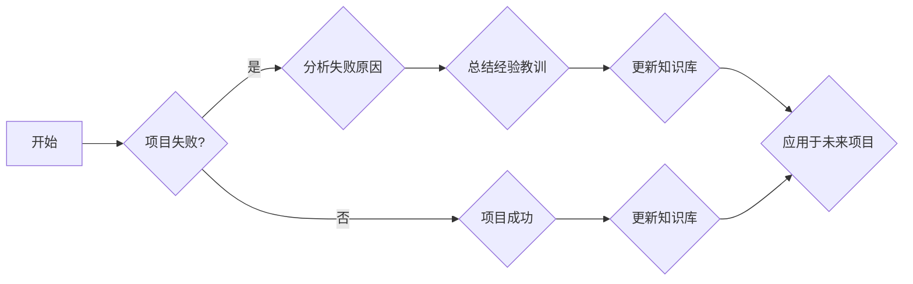

# 计算投入时间：即使是失败的项目也能积累专业知识

> 关键词：计算投入时间，项目失败，专业知识，经验教训，软件工程，迭代开发，敏捷方法

## 1. 背景介绍

在软件工程领域，项目失败是一个普遍存在的问题。据统计，大约三分之一的软件项目最终会失败，原因多种多样，包括需求变更、时间压力、资源不足、技术难题等。然而，失败并不可怕，每个失败的项目都是一个宝贵的学习机会，可以从中积累丰富的专业知识，为未来的成功奠定基础。本文将探讨如何从失败的项目中提取价值，实现“计算投入时间”的理念。

## 2. 核心概念与联系

### 2.1 核心概念原理

#### 2.1.1 计算投入时间

“计算投入时间”是指将时间投入到学习和发展中，即使这些努力最终没有达到预期的结果。这种理念鼓励我们拥抱失败，从失败中学习，并将其转化为宝贵的知识和经验。

#### 2.1.2 项目失败

项目失败是指项目未能达到预定的目标，例如，未能按时交付、超出预算、不满足需求或质量低下。

#### 2.1.3 专业知识

专业知识是指个人在特定领域内积累的知识和技能，包括技术知识、业务理解、项目管理等。

#### 2.1.4 经验教训

经验教训是指从过去经历中总结出的教训和经验，可以用来指导未来的决策和行为。

### 2.2 架构的 Mermaid 流程图



## 3. 核心算法原理 & 具体操作步骤

### 3.1 算法原理概述

从失败的项目中提取专业知识的过程可以分为以下几个步骤：

1. 分析失败原因：识别导致项目失败的关键因素。
2. 总结经验教训：从失败原因中提炼出可学习的教训。
3. 更新知识库：将经验教训记录下来，形成知识库。
4. 应用未来项目：将知识库中的知识应用于未来的项目，避免重蹈覆辙。

### 3.2 算法步骤详解

#### 3.2.1 分析失败原因

- **回顾项目文档**：包括需求文档、设计文档、测试报告等。
- **访谈相关人员**：与项目团队成员、利益相关者进行访谈，收集他们的观点和反馈。
- **数据分析和指标**：分析项目进度、成本、质量等指标，寻找异常点。
- **故障树分析**：构建故障树，识别可能导致项目失败的根本原因。

#### 3.2.2 总结经验教训

- **识别成功和失败因素**：区分哪些因素导致了成功，哪些导致了失败。
- **提炼教训**：将教训归纳为具体的建议和最佳实践。
- **分类和整理**：将教训按照主题分类和整理，便于查阅和应用。

#### 3.2.3 更新知识库

- **文档记录**：将教训和最佳实践记录在项目文档或知识管理系统中。
- **培训材料**：将教训整理成培训材料，供团队成员学习。
- **内部沟通**：通过内部会议、邮件等方式，将教训分享给团队成员。

#### 3.2.4 应用未来项目

- **风险评估**：在新的项目中，识别可能的风险点。
- **经验应用**：将经验教训应用于风险评估和项目规划。
- **持续改进**：在项目过程中，持续跟踪和评估项目状态，及时调整策略。

### 3.3 算法优缺点

#### 3.3.1 优点

- **减少重复错误**：通过总结经验教训，避免在未来项目中重复相同的错误。
- **提高项目成功率**：将成功因素和最佳实践应用于新项目，提高项目成功率。
- **提升团队能力**：通过知识共享和培训，提升团队成员的专业能力。

#### 3.3.2 缺点

- **时间成本**：分析失败原因和总结经验教训需要花费时间。
- **资源依赖**：需要有人负责记录、整理和分享知识。
- **知识更新**：知识库需要定期更新，以反映最新的教训和实践。

### 3.4 算法应用领域

计算投入时间理念适用于所有软件工程项目，无论是成功还是失败。以下是一些具体的应用领域：

- **软件开发**：从失败的项目中学习，改进开发流程，提高软件质量。
- **产品管理**：从失败的项目中学习，改进产品规划和设计。
- **项目管理**：从失败的项目中学习，提高项目管理能力。
- **团队建设**：从失败的项目中学习，提升团队协作和沟通能力。

## 4. 数学模型和公式 & 详细讲解 & 举例说明

### 4.1 数学模型构建

在项目管理的框架下，我们可以构建一个简单的数学模型来量化失败的成本和学习的价值。

#### 4.1.1 成本模型

假设项目失败的成本包括直接成本和间接成本，其中：

- 直接成本 $C_{direct} = T_{fail} \times C_{hour}$
- 间接成本 $C_{indirect} = T_{delay} \times C_{hour} + C_{loss}$
- $T_{fail}$ 为项目失败所需时间
- $T_{delay}$ 为项目延迟时间
- $C_{hour}$ 为每小时人力成本
- $C_{loss}$ 为项目损失

总成本 $C_{total} = C_{direct} + C_{indirect}$

#### 4.1.2 学习模型

假设学习价值 $V_{learn} = \frac{K_{learn}}{T_{learn}}$

其中：

- $K_{learn}$ 为从失败中学习到的知识量
- $T_{learn}$ 为学习所需时间

### 4.2 公式推导过程

为了量化学习价值，我们可以通过以下公式进行推导：

$$
V_{learn} = \frac{K_{learn}}{T_{learn}} = \frac{C_{total}}{T_{fail} + T_{delay}} = \frac{T_{fail} + T_{delay}}{T_{fail} \times C_{hour} + T_{delay} \times C_{hour} + C_{loss}}
$$

### 4.3 案例分析与讲解

假设一个软件开发项目，预计需要 1000 小时完成，预算为 10000 美元。项目实际耗时 1200 小时，超出预算 5000 美元。通过分析，发现失败的主要原因是需求变更频繁，导致开发工作反复。

根据上述公式，我们可以计算学习价值：

- $T_{fail} = 1200$ 小时
- $T_{delay} = 200$ 小时
- $C_{hour} = 10$ 美元/小时
- $C_{loss} = 5000$ 美元

$$
V_{learn} = \frac{1200 + 200}{1200 \times 10 + 200 \times 10 + 5000} = 0.672
$$

这意味着，从失败中学习到的知识价值为项目总成本的 67.2%。

## 5. 项目实践：代码实例和详细解释说明

### 5.1 开发环境搭建

为了更好地理解计算投入时间的理念，我们可以通过一个简单的代码实例进行说明。

首先，我们需要搭建一个Python开发环境，安装必要的库：

```bash
pip install pandas numpy matplotlib
```

### 5.2 源代码详细实现

以下是一个简单的Python代码示例，用于分析项目日志，提取失败原因，并总结经验教训：

```python
import pandas as pd
import numpy as np

# 假设项目日志数据存储在 project_log.csv 文件中
log_data = pd.read_csv('project_log.csv')

# 分析失败原因
fail_reasons = log_data['fail_reason'].value_counts()

# 总结经验教训
lessons Learned = log_data['lesson_learned'].unique()

# 可视化失败原因和经验教训
import matplotlib.pyplot as plt

fig, ax1 = plt.subplots()

ax1.bar(fail_reasons.index, fail_reasons.values, color='b')
ax1.set_xlabel('Failure Reasons')
ax1.set_ylabel('Count', color='b')
ax1.tick_params(axis='y', labelcolor='b')

ax2 = ax1.twinx() 
ax2.plot(lessons_learned, color='r')
ax2.set_ylabel('Lessons Learned', color='r')
ax2.tick_params(axis='y', labelcolor='r')

plt.show()
```

### 5.3 代码解读与分析

上述代码首先读取项目日志数据，然后分析失败原因和总结经验教训。最后，使用matplotlib库将分析结果可视化为柱状图和折线图。

通过分析失败原因和总结经验教训，我们可以清晰地看到项目中存在的问题，并从中吸取教训，为未来的项目提供参考。

### 5.4 运行结果展示

运行上述代码后，我们将得到一个柱状图和一个折线图，分别展示了失败原因的分布和经验教训的内容。

## 6. 实际应用场景

计算投入时间理念在实际应用场景中具有重要意义：

- **敏捷开发**：在敏捷开发过程中，项目往往快速迭代，失败和成功并存。通过计算投入时间，可以快速从失败中学习，优化开发流程。
- **持续集成/持续部署(CI/CD)**：在CI/CD流程中，可以引入自动化测试，及时发现并修复问题。通过计算投入时间，可以提高软件质量。
- **产品迭代**：在产品迭代过程中，可以通过用户反馈和数据分析，识别失败的原因，并总结经验教训，指导未来的产品设计。

## 7. 工具和资源推荐

### 7.1 学习资源推荐

- 《敏捷软件开发：原则、模式与实践》
- 《人月神话》
- 《项目管理知识体系指南（PMBOK指南）》
- 《敏捷估计：软件和系统开发的艺术和科学》

### 7.2 开发工具推荐

- JIRA
- Trello
- Git
- Docker
- Jenkins

### 7.3 相关论文推荐

- 《敏捷软件开发：原则、模式与实践》
- 《人月神话》
- 《项目失败的原因和教训》
- 《敏捷估计：软件和系统开发的艺术和科学》

## 8. 总结：未来发展趋势与挑战

### 8.1 研究成果总结

本文探讨了计算投入时间理念，即从失败的项目中提取专业知识，为未来的成功奠定基础。通过分析失败原因、总结经验教训，并更新知识库，可以实现这一理念。此外，本文还提供了一个简单的Python代码实例，用于分析项目日志，提取失败原因，并总结经验教训。

### 8.2 未来发展趋势

随着敏捷开发、持续集成/持续部署等软件工程实践的普及，计算投入时间理念将得到更广泛的认可和应用。未来，以下趋势值得关注：

- **知识管理**：通过知识库和自动化工具，实现知识的积累和共享。
- **机器学习**：利用机器学习技术，自动分析项目数据，识别失败原因。
- **数据分析**：通过数据分析，量化失败的成本和学习的价值。

### 8.3 面临的挑战

尽管计算投入时间理念具有巨大潜力，但仍面临以下挑战：

- **数据质量**：项目数据的质量直接影响分析结果。
- **知识库维护**：需要投入人力维护知识库，保证其更新和可用性。
- **文化转变**：需要改变组织文化，鼓励从失败中学习。

### 8.4 研究展望

未来，研究可以从以下几个方面展开：

- **跨领域知识库**：建立跨领域知识库，为不同领域的项目提供借鉴。
- **自动化分析工具**：开发自动化分析工具，提高分析效率和质量。
- **文化变革**：推动组织文化变革，鼓励从失败中学习。

## 9. 附录：常见问题与解答

**Q1：计算投入时间理念是否适用于所有项目？**

A：计算投入时间理念适用于所有项目，无论是成功还是失败。每个项目都是一个学习和成长的机会。

**Q2：如何保证知识库的质量？**

A：为了保证知识库的质量，需要定期审查和更新知识库，并鼓励团队成员积极贡献。

**Q3：如何提高项目团队从失败中学习的能力？**

A：可以通过以下方式提高项目团队从失败中学习的能力：

- **建立学习型组织文化**：鼓励团队成员分享经验和教训。
- **提供培训和学习资源**：为团队成员提供必要的培训和学习资源。
- **反思会议**：定期召开反思会议，总结项目经验教训。

**Q4：如何将计算投入时间理念应用于敏捷开发？**

A：在敏捷开发中，可以通过以下方式应用计算投入时间理念：

- **迭代回顾**：在每个迭代结束时，召开迭代回顾会议，总结经验教训。
- **持续改进**：将迭代回顾中的经验教训应用于后续迭代。
- **自动化工具**：利用自动化工具，提高分析效率和质量。

作者：禅与计算机程序设计艺术 / Zen and the Art of Computer Programming