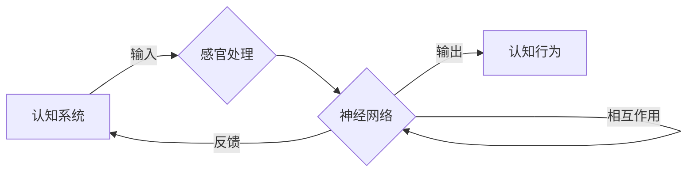

# 认知发展中的混沌复杂阶段

> 关键词：认知发展，混沌理论，复杂系统，系统动力学，涌现，非线性，人工神经网络，机器学习

## 1. 背景介绍

人类认知的发展是一个复杂的过程，涉及从简单的感官刺激到复杂的思维推理的逐步演化。在过去的几十年里，认知科学和神经科学的研究揭示了大脑如何处理信息、学习新知识和形成认知结构。然而，随着研究的深入，我们开始意识到认知发展过程中的混沌复杂阶段，这是理解认知多样性和个体差异的关键。

### 1.1 认知发展的挑战

认知发展的研究面临几个挑战：

- **复杂性**：认知过程是高度复杂的，涉及大脑多个区域的协同工作。
- **非线性**：认知系统中的相互作用是非线性的，这意味着小变化可能导致大差异。
- **涌现**：认知特征并非简单要素的线性组合，而是从复杂相互作用中涌现出来的。
- **个体差异**：不同个体在认知发展速度和方式上存在显著差异。

### 1.2 混沌理论在认知科学中的应用

混沌理论提供了一种理解复杂系统中非线性动态的工具。它揭示了看似随机的过程如何产生有序结构，以及系统如何从简单规则中涌现出复杂行为。在认知科学中，混沌理论可以帮助我们理解认知发展中的非线性动态和涌现现象。

## 2. 核心概念与联系

### 2.1 核心概念原理

- **混沌理论**：混沌理论研究确定系统中出现的随机行为。它表明，即使在确定性系统中，也可以出现不可预测的行为。
- **复杂系统**：复杂系统由许多相互作用的元素组成，这些元素的行为和整个系统的行为之间存在非线性关系。
- **系统动力学**：系统动力学研究系统随时间变化的动态行为，包括平衡状态、周期行为和混沌行为。
- **涌现**：涌现是系统整体行为的表现，无法从单个组成部分的行为中直接推导出来。

### 2.2 架构的 Mermaid 流程图



在这个流程图中，认知系统通过感官处理输入信息，神经网络对这些信息进行处理，产生输出并影响认知行为。神经网络内部存在相互作用和反馈，这些相互作用可能导致混沌行为，从而产生复杂的认知模式。

## 3. 核心算法原理 & 具体操作步骤

### 3.1 算法原理概述

在认知科学中，核心算法通常涉及神经网络和机器学习技术，用于模拟认知过程中的信息处理。

### 3.2 算法步骤详解

1. **数据收集**：收集个体在不同认知任务上的表现数据。
2. **特征提取**：从数据中提取与认知任务相关的特征。
3. **模型构建**：构建神经网络模型来模拟认知过程。
4. **训练模型**：使用机器学习算法训练神经网络模型。
5. **评估模型**：评估模型的性能，包括准确率、召回率等指标。
6. **迭代优化**：根据评估结果调整模型结构和参数。

### 3.3 算法优缺点

- **优点**：
  - 能够模拟复杂的认知过程。
  - 可以处理大量数据，发现数据中的复杂模式。
  - 能够对认知发展进行量化分析。
- **缺点**：
  - 模型的解释性通常较差。
  - 需要大量的训练数据。
  - 模型的泛化能力可能有限。

### 3.4 算法应用领域

- 认知障碍诊断
- 智能辅助工具设计
- 认知训练和康复
- 人机交互系统

## 4. 数学模型和公式 & 详细讲解 & 举例说明

### 4.1 数学模型构建

认知科学中的数学模型通常涉及统计学、概率论和图论。

### 4.2 公式推导过程

例如，一个简单的神经网络模型可以表示为：

$$
y = f(W \cdot x + b)
$$

其中，$y$ 是输出，$x$ 是输入，$W$ 是权重，$b$ 是偏置，$f$ 是激活函数。

### 4.3 案例分析与讲解

以一个简单的线性回归模型为例，假设我们要预测个体的认知能力分数。我们可以使用以下公式：

$$
y = W_1 \cdot x_1 + W_2 \cdot x_2 + b
$$

其中，$y$ 是认知能力分数，$x_1$ 和 $x_2$ 是两个输入特征，$W_1$ 和 $W_2$ 是相应的权重，$b$ 是偏置。

## 5. 项目实践：代码实例和详细解释说明

### 5.1 开发环境搭建

为了进行认知科学项目实践，我们需要搭建以下开发环境：

- Python编程语言
- NumPy库
- Scikit-learn库
- Matplotlib库

### 5.2 源代码详细实现

以下是一个简单的线性回归模型实现：

```python
import numpy as np
from sklearn.linear_model import LinearRegression
import matplotlib.pyplot as plt

# 生成模拟数据
x = np.linspace(0, 10, 100)
y = 3 * x + 2 + np.random.normal(0, 1, 100)

# 构建线性回归模型
model = LinearRegression()
model.fit(x.reshape(-1, 1), y)

# 绘制结果
plt.scatter(x, y)
plt.plot(x, model.predict(x.reshape(-1, 1)), color='red')
plt.show()
```

### 5.3 代码解读与分析

这段代码首先生成了模拟数据，然后使用Scikit-learn库的`LinearRegression`类构建了一个线性回归模型。最后，使用Matplotlib库绘制了数据和模型的预测结果。

### 5.4 运行结果展示

运行上述代码，我们会在控制台中看到模拟数据和线性回归模型的预测结果。

## 6. 实际应用场景

认知科学的研究成果可以应用于以下实际场景：

- **教育**：开发个性化的学习工具，帮助个体克服学习障碍。
- **医疗**：诊断和治疗认知障碍，如阿尔茨海默病。
- **人机交互**：设计更加智能的人机交互系统。

### 6.4 未来应用展望

随着认知科学和机器学习技术的不断发展，我们有望在以下方面取得突破：

- **更深入地理解认知过程**。
- **开发更有效的认知训练方法**。
- **设计更智能的人机交互系统**。

## 7. 工具和资源推荐

### 7.1 学习资源推荐

- 《认知心理学及其应用》
- 《认知科学：探索大脑如何工作》
- 《机器学习：一种统计方法》

### 7.2 开发工具推荐

- Python编程语言
- NumPy库
- Scikit-learn库
- Matplotlib库

### 7.3 相关论文推荐

- "Emergence: The Connectedness Between Mind and Nature" by Ervin Laszlo
- "The Nature of Human Thinking" by Edward de Bono
- "The Computational Brain" by Christof Koch

## 8. 总结：未来发展趋势与挑战

### 8.1 研究成果总结

认知科学的研究取得了显著的进展，尤其是在认知发展中的混沌复杂阶段。混沌理论和系统动力学为我们理解认知过程中的非线性动态和涌现现象提供了新的视角。

### 8.2 未来发展趋势

- **跨学科研究**：认知科学将与其他学科（如神经科学、心理学、计算机科学）进行更紧密的合作。
- **大数据分析**：利用大数据技术分析认知数据，揭示认知规律。
- **人工智能应用**：将人工智能技术应用于认知科学研究，提高研究效率。

### 8.3 面临的挑战

- **复杂性**：认知系统的复杂性使得研究更加困难。
- **个体差异**：不同个体的认知发展存在差异，需要个性化的研究方法。
- **伦理问题**：认知科学研究可能涉及隐私和数据安全问题。

### 8.4 研究展望

未来，认知科学的研究将继续深入，探索认知发展中的混沌复杂阶段，为人类理解自身提供新的视角。

## 9. 附录：常见问题与解答

**Q1：什么是混沌理论？**

A：混沌理论研究确定系统中出现的随机行为。它表明，即使在确定性系统中，也可以出现不可预测的行为。

**Q2：认知科学的研究对象是什么？**

A：认知科学的研究对象包括感知、注意、记忆、语言、思维、意识等心理过程。

**Q3：什么是涌现？**

A：涌现是系统整体行为的表现，无法从单个组成部分的行为中直接推导出来。

**Q4：认知科学的研究对人类社会有什么意义？**

A：认知科学的研究有助于我们更好地理解人类行为，开发更有效的教育、医疗和辅助技术。

**Q5：如何将认知科学的研究成果应用于实际？**

A：认知科学的研究成果可以应用于教育、医疗、人机交互等领域，提高人类生活质量。

---

作者：禅与计算机程序设计艺术 / Zen and the Art of Computer Programming