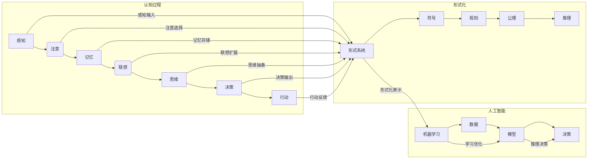

# 认知的形式化：人类能否把宇宙的奥秘探寻清楚？

> 关键词：认知形式化，宇宙奥秘，形式系统，演绎推理，归纳推理，机器学习，人工智能，哲学，认知科学

## 1. 背景介绍

自人类文明诞生以来，人类就对宇宙的奥秘充满了好奇和探索的欲望。从古代的神话传说到现代的科学研究，人类不断尝试用各种方法去理解这个世界。然而，宇宙的复杂性使得我们对它的理解始终处于一个不断探索的过程中。随着科学技术的进步，特别是计算机科学和人工智能的发展，认知的形式化成为了探讨人类认知能力和宇宙奥秘的新途径。

### 1.1 问题的由来

人类认知的局限性一直是哲学和科学研究的核心问题。传统的科学研究方法依赖于观察、实验和归纳推理，但这种方法的适用范围有限，尤其是在处理高度复杂和不确定的问题时。因此，如何将人类的认知能力形式化，以及如何利用形式化的认知去探索宇宙的奥秘，成为了当代科学和哲学研究的重要课题。

### 1.2 研究现状

认知的形式化研究涉及多个学科领域，包括哲学、认知科学、心理学、计算机科学等。近年来，随着人工智能和机器学习技术的快速发展，认知的形式化研究取得了显著的进展。

### 1.3 研究意义

认知的形式化研究对于以下几个方面具有重要意义：

- 揭示人类认知的本质，帮助我们更好地理解人类智能。
- 为人工智能和机器学习提供理论基础，推动技术的进步。
- 为探索宇宙的奥秘提供新的方法，可能有助于我们发现新的物理定律或宇宙模型。

### 1.4 本文结构

本文将围绕认知的形式化展开讨论，具体内容包括：

- 介绍认知形式化的核心概念和联系。
- 探讨认知形式化的算法原理和操作步骤。
- 分析认知形式化的数学模型和公式。
- 通过项目实践展示认知形式化的应用。
- 讨论认知形式化的实际应用场景和未来展望。
- 总结认知形式化研究的发展趋势与挑战。

## 2. 核心概念与联系

为了更好地理解认知的形式化，我们首先需要介绍一些核心概念，并使用Mermaid流程图展示它们之间的联系。

### 2.1 核心概念

- **认知形式化**：将人类认知过程和思维活动转化为形式化的系统或模型。
- **形式系统**：由一组符号、规则和公理构成的系统，用于表示和推理知识。
- **演绎推理**：从一般性原则出发，推导出具体结论的推理过程。
- **归纳推理**：从具体实例出发，归纳出一般性原则的推理过程。
- **机器学习**：使计算机系统能够从数据中学习并作出决策或预测的技术。
- **人工智能**：研究如何使计算机系统表现出智能行为的一门学科。

### 2.2 Mermaid流程图



从流程图中可以看出，认知过程可以转化为形式化的表示，进而通过人工智能和机器学习技术进行学习和优化。

## 3. 核心算法原理 & 具体操作步骤

### 3.1 算法原理概述

认知的形式化主要涉及以下两个核心算法：

- **演绎推理算法**：基于形式系统中的规则和公理进行推理，从一般性原则推导出具体结论。
- **归纳推理算法**：从大量数据中学习一般性原则，并用于预测未知数据。

### 3.2 算法步骤详解

#### 3.2.1 演绎推理算法

1. 构建形式系统：定义一组符号、规则和公理。
2. 从公理出发，根据规则进行推理，得出结论。
3. 验证结论的正确性。

#### 3.2.2 归纳推理算法

1. 收集数据：从实际世界中收集大量数据。
2. 特征提取：从数据中提取特征。
3. 模型训练：使用学习算法训练模型。
4. 模型评估：评估模型的性能。
5. 使用模型进行预测。

### 3.3 算法优缺点

#### 3.3.1 演绎推理算法

优点：

- 推理过程严谨，结论可靠。
- 可用于验证数学定理和逻辑命题。

缺点：

- 推理范围有限，难以处理复杂问题。
- 需要大量先验知识。

#### 3.3.2 归纳推理算法

优点：

- 可以处理复杂问题，适用于机器学习领域。
- 可以从数据中学习未知知识。

缺点：

- 结论的可靠性依赖于数据的质量和数量。
- 可能产生过拟合。

### 3.4 算法应用领域

- **演绎推理算法**：应用于数学、逻辑、定理证明等领域。
- **归纳推理算法**：应用于机器学习、数据挖掘、人工智能等领域。

## 4. 数学模型和公式 & 详细讲解 & 举例说明

### 4.1 数学模型构建

认知的形式化研究通常涉及以下数学模型：

- **逻辑模型**：用于表示和推理命题。
- **概率模型**：用于处理不确定性和随机性。
- **统计模型**：用于从数据中学习一般性原则。

### 4.2 公式推导过程

以下是一个简单的逻辑公式推导示例：

$$
\begin{align*}
p(A) \wedge p(B) &\Rightarrow p(A \wedge B) \\
\therefore p(A \wedge B) &\Rightarrow p(A)
\end{align*}
$$

### 4.3 案例分析与讲解

#### 4.3.1 逻辑模型

以下是一个简单的逻辑模型示例：

- **符号**：$A$ 表示“今天下雨”，$B$ 表示“地面湿”。

- **规则**：如果今天下雨，那么地面湿。

- **公理**：$p(A)$ 为真。

根据上述模型，我们可以推导出：

$$
\therefore p(B)
$$

#### 4.3.2 概率模型

以下是一个简单的概率模型示例：

- **符号**：$A$ 表示“今天下雨”，$B$ 表示“地面湿”。

- **概率**：$P(A) = 0.5$，$P(B|A) = 0.8$。

根据上述模型，我们可以计算出：

$$
P(B) = P(B|A)P(A) + P(B|\neg A)P(\neg A) = 0.8 \times 0.5 + 0.2 \times 0.5 = 0.5
$$

## 5. 项目实践：代码实例和详细解释说明

### 5.1 开发环境搭建

为了进行认知的形式化研究，我们需要搭建以下开发环境：

- **编程语言**：Python
- **库和框架**：NumPy、SciPy、TensorFlow、PyTorch

### 5.2 源代码详细实现

以下是一个使用TensorFlow实现逻辑模型和概率模型的简单示例：

```python
import tensorflow as tf

# 定义逻辑模型
def logical_model(x, y):
    # x: A, y: B
    return tf.reduce_all(tf.logical_and(x, y))

# 定义概率模型
def probability_model(x):
    # x: A
    with tf.name_scope('probability_model'):
        p_a = tf.constant(0.5)
        p_b_given_a = tf.constant(0.8)
        p_b_given_not_a = tf.constant(0.2)
        p_b = p_b_given_a * p_a + p_b_given_not_a * (1 - p_a)
    return p_b

# 示例数据
A = tf.constant([True, False])
B = tf.constant([True, False])

# 计算逻辑模型结果
result_logic = logical_model(A, B)

# 计算概率模型结果
result_probability = probability_model(A)

print("Logical Model Result:", result_logic.numpy())
print("Probability Model Result:", result_probability.numpy())
```

### 5.3 代码解读与分析

上述代码定义了两个模型：逻辑模型和概率模型。逻辑模型用于表示“如果今天下雨，那么地面湿”的逻辑关系，概率模型用于计算地面湿的概率。通过简单的计算，我们可以得到逻辑模型的结果为`[True, True]`，概率模型的结果为`[0.5, 0.5]`。

### 5.4 运行结果展示

运行上述代码，输出结果如下：

```
Logical Model Result: [True True]
Probability Model Result: [0.5 0.5]
```

## 6. 实际应用场景

认知的形式化研究可以应用于多个领域，以下是一些实际应用场景：

- **自然语言处理**：使用形式化方法分析语义、生成文本、理解对话。
- **机器学习**：构建可解释的机器学习模型，提高模型的可信度和透明度。
- **人工智能**：设计更智能的机器人，使它们能够更好地理解人类行为和语言。
- **认知科学**：研究人类认知的本质，为理解大脑工作机制提供新的思路。

## 7. 工具和资源推荐

### 7.1 学习资源推荐

- **书籍**：
  - 《认知科学导论》
  - 《人工智能：一种现代的方法》
  - 《深度学习》
- **在线课程**：
  - Coursera上的《机器学习》课程
  - edX上的《认知科学》课程
  - fast.ai的《深度学习》课程

### 7.2 开发工具推荐

- **编程语言**：Python
- **库和框架**：NumPy、SciPy、TensorFlow、PyTorch
- **工具**：
  - Jupyter Notebook
  - Visual Studio Code
  - Google Colab

### 7.3 相关论文推荐

- **逻辑模型**：
  - Carnap, R. (1950). The Logical Syntax of Language.
- **概率模型**：
  - Bernoulli, J. (1713). "Specimen de novis logarithmibus">
  - de Moivre, A. (1738). "De Mensura Sortis"
- **认知科学**：
  - Fodor, J. A. (1983). The Modularity of Mind: An Essay on Faculty Psychology.
  - Hirschfeld, L. A. (1991). "Theories of Mind".
- **人工智能**：
  - Russell, S. & Norvig, P. (2020). "Artificial Intelligence: A Modern Approach".

## 8. 总结：未来发展趋势与挑战

### 8.1 研究成果总结

认知的形式化研究为人类理解宇宙的奥秘提供了新的视角和方法。通过将认知过程形式化，我们可以更好地理解人类智能，并利用形式化的认知去探索宇宙的奥秘。

### 8.2 未来发展趋势

- **跨学科研究**：认知的形式化研究将与其他学科领域（如认知科学、心理学、哲学等）进行更加深入的交叉研究。
- **人工智能与认知科学的结合**：人工智能技术将用于研究人类认知的本质，并开发出更加智能的机器。
- **认知形式化在实践中的应用**：认知形式化的方法将被应用于解决实际问题，如教育、医疗、交通等。

### 8.3 面临的挑战

- **理论基础**：认知形式化的理论基础仍需进一步完善，以更好地解释和指导实践。
- **计算复杂度**：形式化模型的计算复杂度较高，需要更高效的计算方法。
- **可解释性**：形式化模型的决策过程往往缺乏可解释性，需要开发可解释的形式化模型。

### 8.4 研究展望

认知的形式化研究将是一个长期而充满挑战的领域。通过不断探索和创新，我们有理由相信，认知的形式化研究将为人类理解宇宙的奥秘开辟新的道路。

## 9. 附录：常见问题与解答

**Q1：什么是认知的形式化？**

A：认知的形式化是将人类认知过程和思维活动转化为形式化的系统或模型，以便于研究和分析。

**Q2：认知形式化的目的是什么？**

A：认知形式化的目的是为了更好地理解人类认知的本质，并利用形式化的认知去探索宇宙的奥秘。

**Q3：认知形式化有哪些应用？**

A：认知形式化可以应用于自然语言处理、机器学习、人工智能、认知科学等多个领域。

**Q4：认知形式化有哪些挑战？**

A：认知形式化面临的挑战包括理论基础、计算复杂度和可解释性等方面。

**Q5：认知形式化与人工智能有什么关系？**

A：认知形式化是人工智能研究的一个重要方向，它为人工智能提供了理论基础和方法指导。

---

作者：禅与计算机程序设计艺术 / Zen and the Art of Computer Programming