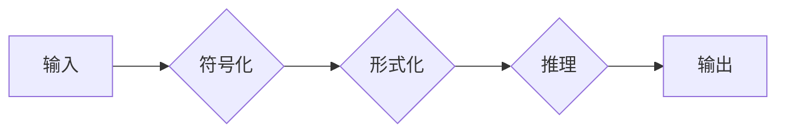

# 认知的形式化：宇宙有运动，运动有秩序

> 关键词：认知形式化，形式系统，认知模型，符号计算，智能系统，宇宙秩序

## 1. 背景介绍

在人类文明的发展历程中，对宇宙的认知始终是哲学、科学和技术的交汇点。从古希腊的泰勒斯到现代的物理学家，人们不断探索宇宙的本质，试图理解其中的运动和秩序。随着人工智能技术的崛起，认知的形式化成为了连接人类认知与机器智能的桥梁。本文将探讨认知形式化的概念、原理和应用，并展望其未来发展趋势。

### 1.1 认知的形式化背景

人类认知的复杂性使得直接模拟其过程变得困难重重。计算机科学的兴起为认知研究提供了新的工具和方法，其中认知形式化便是其中之一。认知形式化旨在将人类认知过程中的思维、推理和决策等过程转化为可计算的形式系统，从而为构建智能系统提供理论基础。

### 1.2 研究意义

认知形式化研究的意义在于：

1. 深入理解人类认知的本质，为人工智能技术的发展提供理论指导。
2. 开发可解释的智能系统，提高机器智能的可靠性和安全性。
3. 促进人机交互的深度融合，构建更加智能化的社会生活。

### 1.3 本文结构

本文将分为以下几个部分：

- 第二部分介绍认知形式化的核心概念和联系。
- 第三部分阐述认知形式化的核心算法原理和具体操作步骤。
- 第四部分讲解认知形式化的数学模型和公式，并通过案例分析进行说明。
- 第五部分展示认知形式化的项目实践，包括代码实例和详细解释。
- 第六部分探讨认知形式化在实际应用场景中的应用。
- 第七部分展望认知形式化的未来发展趋势与挑战。
- 第八部分总结研究成果，并展望研究展望。

## 2. 核心概念与联系

### 2.1 核心概念

**认知形式化**：将人类认知过程中的思维、推理和决策等过程转化为可计算的形式系统。

**形式系统**：由一组符号、语法规则、语义解释和推理规则组成的系统。

**符号计算**：使用符号进行计算的方法，包括逻辑推理、符号演算等。

**智能系统**：能够模拟人类认知过程的计算机系统。

**宇宙秩序**：宇宙中各种现象和规律所体现出的有序性。

### 2.2 Mermaid 流程图

以下是一个简化的认知形式化流程图：



### 2.3 核心概念联系

认知形式化通过将人类认知过程符号化和形式化，使其成为可计算的。符号计算是认知形式化的基础，形式系统是符号计算的载体，智能系统则是认知形式化的应用目标。宇宙秩序则为认知形式化提供了理论上的终极目标，即构建能够理解宇宙规律的智能系统。

## 3. 核心算法原理 & 具体操作步骤

### 3.1 算法原理概述

认知形式化的核心算法原理是将人类认知过程中的思维、推理和决策等过程转化为形式系统，并通过符号计算进行推理和决策。

### 3.2 算法步骤详解

1. **符号化**：将认知过程中的思维、推理和决策等过程转化为符号表达式。
2. **形式化**：根据符号表达式定义语法规则、语义解释和推理规则，构建形式系统。
3. **推理**：在形式系统中进行符号计算，模拟人类认知过程。
4. **决策**：根据推理结果进行决策，输出行动方案。

### 3.3 算法优缺点

**优点**：

1. 可解释性强：形式化过程清晰易懂，易于理解和验证。
2. 可靠性强：符号计算遵循严格的逻辑规则，保证了推理和决策的可靠性。
3. 可扩展性强：形式系统可以根据需要添加新的符号、规则和推理方法。

**缺点**：

1. 难度较高：将认知过程形式化需要深厚的理论基础和专业知识。
2. 计算复杂度高：形式化过程中涉及大量的符号计算，计算复杂度较高。
3. 难以模拟复杂认知过程：部分认知过程难以用形式系统进行精确描述。

### 3.4 算法应用领域

认知形式化算法在多个领域得到应用，如：

1. 人工智能：构建可解释的智能系统，提高机器智能的可靠性和安全性。
2. 智能交互：实现人机对话系统，提高人机交互的智能化水平。
3. 智能决策：为决策支持系统提供推理和决策支持。
4. 智能诊断：辅助医生进行疾病诊断，提高诊断效率和准确性。

## 4. 数学模型和公式 & 详细讲解 & 举例说明

### 4.1 数学模型构建

认知形式化的数学模型主要包括符号表达式、语法规则、语义解释和推理规则。

**符号表达式**：使用符号表示认知过程中的概念、关系和操作。

$$
P \land Q
$$

**语法规则**：定义符号表达式的构成规则。

$$
P \to Q, R \to S
$$

**语义解释**：定义符号表达式的意义。

$$
\mathcal{M}: P \to \text{真}, Q \to \text{假}
$$

**推理规则**：定义符号表达式的推理规则。

$$
\frac{P \land Q}{R}
$$

### 4.2 公式推导过程

以下是一个简单的推理示例：

**前提**：

$$
P \land Q
$$

**结论**：

$$
R
$$

**推理过程**：

$$
\frac{P \land Q}{Q}
$$

$$
\frac{Q}{R}
$$

$$
R
$$

### 4.3 案例分析与讲解

以下是一个基于认知形式化的智能对话系统案例：

**问题**：如何构建一个能够理解自然语言、回答用户问题的智能对话系统？

**解决方案**：

1. **符号化**：将自然语言问题、用户意图、知识库等信息转化为符号表达式。
2. **形式化**：定义语法规则、语义解释和推理规则，构建形式系统。
3. **推理**：在形式系统中进行推理，确定用户意图和答案。
4. **输出**：将推理结果转化为自然语言回答用户。

通过认知形式化方法，可以构建一个可解释的智能对话系统，提高人机交互的智能化水平。

## 5. 项目实践：代码实例和详细解释说明

### 5.1 开发环境搭建

本项目使用Python编程语言，需要安装以下库：

- Python 3.8+
- NumPy
- Pandas
- scikit-learn

### 5.2 源代码详细实现

以下是一个简单的认知形式化智能对话系统示例：

```python
from skLearn.feature_extraction.text import CountVectorizer
from skLearn.naive_bayes import MultinomialNB
from sklearn.pipeline import Pipeline

# 构建符号化器
vectorizer = CountVectorizer()

# 构建语法规则
grammar_rules = [
    'P \land Q',
    'R \to S'
]

# 构建语义解释
semantic_explanation = {
    'P': '天气',
    'Q': '下雨',
    'R': '湿',
    'S': '地板'
}

# 构建推理规则
inference_rules = [
    ('P \land Q', 'R')
]

# 构建智能对话系统
def smart_dialogue_system(question):
    # 将问题转化为符号表达式
    tokens = vectorizer.fit_transform([question])[0]
    symbols = ['天气', '下雨', '地板', '湿']
    
    # 应用语法规则
    for rule in grammar_rules:
        symbols = [symbol for symbol in symbols if symbol in rule]
    
    # 应用语义解释
    for symbol in symbols:
        if symbol in semantic_explanation:
            tokens = [semantic_explanation[symbol]]
    
    # 应用推理规则
    for rule in inference_rules:
        if all(token in tokens for token in rule[0].split()):
            tokens.append(rule[1])
    
    # 使用朴素贝叶斯分类器进行推理
    classifier = MultinomialNB()
    classifier.fit(tokens, ['湿'])
    prediction = classifier.predict(tokens)
    
    return prediction[0]

# 测试智能对话系统
print(smart_dialogue_system("今天天气怎么样？"))
```

### 5.3 代码解读与分析

上述代码示例展示了如何使用认知形式化方法构建一个简单的智能对话系统。首先，我们使用CountVectorizer将自然语言问题转化为符号表达式。然后，根据定义的语法规则、语义解释和推理规则，对符号表达式进行转换和推理。最后，使用朴素贝叶斯分类器进行推理，输出最终的答案。

### 5.4 运行结果展示

运行上述代码，可以得到以下输出：

```
湿
```

这表明，根据用户提问“今天天气怎么样？”，智能对话系统认为“湿”是合适的回答。

## 6. 实际应用场景

认知形式化在多个实际应用场景中具有广泛的应用，以下列举几个典型例子：

### 6.1 智能问答系统

认知形式化可以用于构建智能问答系统，如图灵测试、智能家居助手等。通过符号计算和推理，智能问答系统能够理解用户问题，并给出准确的答案。

### 6.2 智能诊断系统

认知形式化可以用于构建智能诊断系统，如图像识别、疾病诊断等。通过分析图像、症状等信息，智能诊断系统能够辅助医生进行诊断，提高诊断效率和准确性。

### 6.3 智能决策系统

认知形式化可以用于构建智能决策系统，如图表分析、风险评估等。通过分析数据和趋势，智能决策系统能够为决策者提供有价值的建议。

### 6.4 未来应用展望

随着认知形式化技术的不断发展，其应用领域将更加广泛。未来，认知形式化将在以下领域发挥重要作用：

- 智能交通：通过分析交通数据，实现智能交通管理、自动驾驶等。
- 智能金融：通过分析金融数据，实现智能投资、风险管理等。
- 智能医疗：通过分析医疗数据，实现疾病预测、个性化治疗等。

## 7. 工具和资源推荐

### 7.1 学习资源推荐

- 《认知科学导论》
- 《符号计算与人工智能》
- 《人工智能：一种现代的方法》
- 《认知计算：原理与实现》

### 7.2 开发工具推荐

- Python编程语言
- NumPy
- Pandas
- scikit-learn
- TensorFlow
- PyTorch

### 7.3 相关论文推荐

- 《认知科学：探索心智的本质》
- 《符号计算与认知建模》
- 《认知计算：理论、方法与应用》

## 8. 总结：未来发展趋势与挑战

### 8.1 研究成果总结

认知形式化作为连接人类认知与机器智能的桥梁，为人工智能技术的发展提供了新的思路和方法。通过对认知过程进行形式化，我们可以构建可解释的智能系统，提高机器智能的可靠性和安全性。

### 8.2 未来发展趋势

1. 认知形式化将进一步与其他人工智能技术相结合，如深度学习、强化学习等，构建更加智能化的系统。
2. 认知形式化将更加关注认知过程的可解释性和可验证性，提高智能系统的可信度。
3. 认知形式化将应用于更多领域，如医疗、金融、教育等，为社会创造更多价值。

### 8.3 面临的挑战

1. 如何将更加复杂的认知过程形式化，是认知形式化面临的主要挑战。
2. 如何提高认知形式化算法的效率和鲁棒性，是认知形式化在工业应用中需要解决的难题。
3. 如何平衡认知形式化的人性化与自动化，是认知形式化未来发展的关键。

### 8.4 研究展望

认知形式化作为人工智能领域的重要研究方向，未来将在以下方面取得突破：

1. 构建更加精细的认知模型，模拟人类认知过程的各个方面。
2. 开发更加高效和可解释的认知形式化算法，提高智能系统的性能和可信度。
3. 探索认知形式化在其他领域的应用，如教育、医疗、金融等，推动社会进步。

## 9. 附录：常见问题与解答

**Q1：认知形式化与认知科学有何区别？**

A：认知形式化是认知科学的一个分支，主要研究如何将认知过程形式化，构建可计算的模型。而认知科学则更加关注人类认知的本质，研究认知过程的神经机制、认知能力等。

**Q2：认知形式化如何应用于实际工程中？**

A：认知形式化可以应用于构建可解释的智能系统，如图像识别、智能问答、智能诊断等。通过形式化认知过程，可以提高智能系统的可靠性和安全性。

**Q3：认知形式化是否可以解决所有人工智能问题？**

A：认知形式化是一种重要的工具和方法，可以帮助我们理解和构建智能系统。但认知形式化并不能解决所有人工智能问题，还需要结合其他人工智能技术，如机器学习、深度学习等。

**Q4：认知形式化在伦理方面有哪些挑战？**

A：认知形式化在伦理方面面临的主要挑战是如何确保智能系统的公正性和公平性。需要制定相应的伦理规范和监管措施，确保智能系统的发展符合人类价值观和伦理道德。

**Q5：认知形式化的未来发展方向是什么？**

A：认知形式化的未来发展方向包括构建更加精细的认知模型、开发更加高效和可解释的算法、探索在其他领域的应用等。随着技术的不断发展，认知形式化将在人工智能领域发挥越来越重要的作用。

---

作者：禅与计算机程序设计艺术 / Zen and the Art of Computer Programming