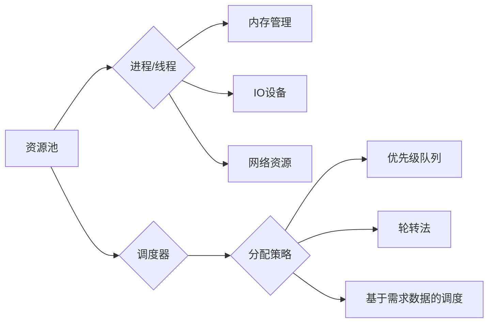

# 资源管理 原理与代码实例讲解

> 关键词：资源管理，内存管理，进程调度，线程池，并发编程，分布式系统

## 1. 背景介绍

在计算机系统中，资源管理是一个至关重要的概念。无论是操作系统、数据库、Web服务器，还是复杂的分布式系统，都离不开对系统资源的合理分配、调度和监控。资源管理不仅关系到系统的性能和稳定性，还直接影响用户体验和业务效率。本文将深入探讨资源管理的原理，并通过代码实例讲解如何在实际项目中实现高效、可靠的资源管理。

### 1.1 问题的由来

随着软件系统的复杂度不断增加，资源管理的挑战也日益突出。以下是一些常见的资源管理问题：

- **内存泄漏**：程序在运行过程中不断申请内存，但未及时释放，导致可用内存逐渐减少。
- **资源竞争**：多个进程或线程同时访问同一资源，可能导致数据不一致或系统崩溃。
- **资源瓶颈**：系统资源（如CPU、内存）过度使用，导致系统性能下降。
- **分布式资源管理**：在分布式系统中，如何高效地管理跨节点的资源，是一个复杂的问题。

### 1.2 研究现状

目前，资源管理的研究主要集中在以下几个方面：

- **内存管理**：通过分页、分段、垃圾回收等技术，提高内存利用率。
- **进程调度**：通过调度算法，合理分配CPU资源，提高系统吞吐量。
- **线程池**：通过线程池技术，优化线程创建和销毁的开销，提高并发处理能力。
- **分布式资源管理**：通过资源调度器，实现跨节点的资源分配和负载均衡。

### 1.3 研究意义

研究资源管理对于以下方面具有重要意义：

- **提高系统性能**：通过合理分配和调度资源，提高系统吞吐量和响应时间。
- **增强系统稳定性**：防止资源泄漏、竞争和瓶颈，提高系统的可靠性。
- **优化用户体验**：提供高效、稳定的服务，提升用户满意度。
- **促进技术发展**：推动内存管理、进程调度、线程池等技术的创新。

## 2. 核心概念与联系

资源管理涉及多个核心概念，以下是其中一些重要的概念及其相互关系：



### 2.1 资源池

资源池是系统中所有可用资源的集合，包括CPU、内存、IO设备、网络资源等。

### 2.2 进程/线程

进程/线程是系统执行的基本单元，它们需要从资源池中申请资源来完成任务。

### 2.3 内存管理

内存管理负责管理系统中所有内存资源，包括分配、释放、垃圾回收等。

### 2.4 IO设备

IO设备包括磁盘、网络接口卡等，它们负责处理数据的输入输出。

### 2.5 网络资源

网络资源包括带宽、IP地址等，它们负责数据在网络中的传输。

### 2.6 调度器

调度器负责将资源池中的资源分配给进程/线程，常用的调度算法包括优先级队列、轮转法、基于需求数据的调度等。

## 3. 核心算法原理 & 具体操作步骤

### 3.1 算法原理概述

资源管理的核心算法包括内存管理、进程调度、线程池管理等。

#### 3.1.1 内存管理

内存管理的主要任务包括：

- **分配**：将内存分配给进程/线程。
- **释放**：回收进程/线程不再使用的内存。
- **垃圾回收**：自动回收不再使用的内存。

#### 3.1.2 进程调度

进程调度的主要任务包括：

- **选择**：根据调度策略，从就绪队列中选择一个进程运行。
- **切换**：在进程之间切换CPU控制权。

#### 3.1.3 线程池管理

线程池管理的主要任务包括：

- **创建**：创建一定数量的线程。
- **任务分发**：将任务分配给线程执行。
- **回收**：回收不再使用的线程。

### 3.2 算法步骤详解

#### 3.2.1 内存管理

内存管理的步骤如下：

1. 进程/线程申请内存：系统根据进程/线程的需求，分配相应的内存空间。
2. 内存使用：进程/线程使用分配的内存空间进行数据存储和计算。
3. 内存释放：进程/线程完成任务后，释放不再使用的内存空间。
4. 垃圾回收：系统定期进行垃圾回收，回收不再使用的内存空间。

#### 3.2.2 进程调度

进程调度的步骤如下：

1. 创建进程：系统根据用户需求创建进程。
2. 就绪队列：进程进入就绪队列，等待调度。
3. 调度：调度器根据调度策略，从就绪队列中选择一个进程运行。
4. 执行：进程执行任务，占用CPU资源。
5. 等待：进程等待某些事件发生，如IO操作完成。
6. 终止：进程完成任务后，终止进程。

#### 3.2.3 线程池管理

线程池管理的步骤如下：

1. 创建线程池：创建一定数量的线程，构成线程池。
2. 任务分发：将任务分配给线程池中的线程执行。
3. 等待结果：等待线程池中的线程完成任务，并返回结果。
4. 回收线程：线程完成任务后，返回线程池。

### 3.3 算法优缺点

#### 3.3.1 内存管理

**优点**：

- 提高内存利用率。
- 防止内存泄漏。
- 提高程序运行效率。

**缺点**：

- 内存碎片化。
- 垃圾回收影响性能。

#### 3.3.2 进程调度

**优点**：

- 提高CPU利用率。
- 提高系统吞吐量。

**缺点**：

- 调度开销。
- 调度策略选择困难。

#### 3.3.3 线程池管理

**优点**：

- 减少线程创建和销毁的开销。
- 提高并发处理能力。

**缺点**：

- 限制并发线程数量。
- 线程池资源管理复杂。

### 3.4 算法应用领域

资源管理的算法在以下领域得到广泛应用：

- **操作系统**：操作系统负责管理所有系统资源，包括CPU、内存、IO设备等。
- **数据库**：数据库管理系统负责管理数据库资源，包括数据存储、索引、事务等。
- **Web服务器**：Web服务器负责管理服务器资源，包括CPU、内存、网络等。
- **分布式系统**：分布式系统负责管理跨节点的资源，包括计算资源、存储资源、网络资源等。

## 4. 数学模型和公式 & 详细讲解 & 举例说明

### 4.1 数学模型构建

资源管理的数学模型主要包括：

- **资源需求模型**：描述进程/线程对资源的需求。
- **资源分配模型**：描述资源分配策略。
- **性能模型**：描述资源分配对系统性能的影响。

### 4.2 公式推导过程

#### 4.2.1 资源需求模型

假设进程/线程对CPU资源的需求为 $C$，对内存资源的需求为 $M$，对IO资源的需求为 $I$，则资源需求模型可表示为：

$$
(R_i) = (C, M, I)
$$

其中，$R_i$ 表示进程/线程 $i$ 的资源需求。

#### 4.2.2 资源分配模型

资源分配模型主要描述资源分配策略，以下是一些常见的资源分配策略：

- **先到先得**：按进程/线程到达的先后顺序分配资源。
- **优先级调度**：根据进程/线程的优先级分配资源。
- **轮转法**：按时间片轮转分配CPU资源。

#### 4.2.3 性能模型

性能模型主要描述资源分配对系统性能的影响，以下是一些常见的性能指标：

- **吞吐量**：单位时间内完成的任务数量。
- **响应时间**：任务完成所需时间。
- **资源利用率**：资源被使用的时间与总时间的比值。

### 4.3 案例分析与讲解

以下以优先级调度为例，分析资源分配对系统性能的影响。

假设有两个进程A和B，它们的优先级分别为3和2。系统采用优先级调度策略，分配CPU资源。

- **初始状态**：进程A和B同时进入就绪队列。
- **调度过程**：调度器根据优先级调度策略，首先调度优先级较高的进程A执行。
- **执行过程**：进程A执行完毕，进程B进入执行状态。
- **性能分析**：优先级调度策略可以提高高优先级进程的响应时间，但可能导致低优先级进程的响应时间延长。

## 5. 项目实践：代码实例和详细解释说明

### 5.1 开发环境搭建

在进行资源管理实践前，我们需要准备好开发环境。以下是使用Python进行资源管理开发的步骤：

1. 安装Python环境：从官网下载并安装Python，建议使用Python 3.7及以上版本。
2. 安装Python库：安装必要的Python库，如os、sys、threading、multiprocessing等。
3. 编写代码：根据实际需求编写资源管理代码。

### 5.2 源代码详细实现

以下是一个简单的线程池管理示例：

```python
import threading
from queue import Queue

class ThreadPool:
    def __init__(self, num_threads):
        self.num_threads = num_threads
        self.threads = []
        self.task_queue = Queue()

    def worker(self):
        while True:
            task = self.task_queue.get()
            if task is None:
                break
            task()
            self.task_queue.task_done()

    def start(self):
        for _ in range(self.num_threads):
            thread = threading.Thread(target=self.worker)
            thread.start()

    def stop(self):
        for _ in range(self.num_threads):
            self.task_queue.put(None)
        for thread in self.threads:
            thread.join()

    def submit(self, task):
        self.task_queue.put(task)

# 使用线程池执行任务
def task():
    print("Executing task...")

pool = ThreadPool(num_threads=2)
pool.start()
pool.submit(task)
pool.submit(task)
pool.stop()
```

### 5.3 代码解读与分析

以上代码实现了一个简单的线程池管理类：

- `ThreadPool` 类：初始化线程池，定义线程数量、任务队列等。
- `worker` 方法：线程池中的线程执行的函数，从任务队列中获取任务并执行。
- `start` 方法：启动线程池，创建指定数量的线程。
- `stop` 方法：停止线程池，等待所有线程完成执行。
- `submit` 方法：向任务队列中添加任务。

### 5.4 运行结果展示

运行上述代码，将看到以下输出：

```
Executing task...
Executing task...
```

这表明线程池成功执行了两个任务。

## 6. 实际应用场景

资源管理在以下实际应用场景中得到广泛应用：

- **操作系统**：操作系统负责管理所有系统资源，包括CPU、内存、IO设备等。
- **数据库**：数据库管理系统负责管理数据库资源，包括数据存储、索引、事务等。
- **Web服务器**：Web服务器负责管理服务器资源，包括CPU、内存、网络等。
- **分布式系统**：分布式系统负责管理跨节点的资源，包括计算资源、存储资源、网络资源等。

## 7. 工具和资源推荐

### 7.1 学习资源推荐

- 《操作系统概念》
- 《现代操作系统》
- 《深入理解计算机系统》
- 《计算机网络》
- 《分布式系统原理与范型》

### 7.2 开发工具推荐

- Python
- Java
- C++
- Go
- Kubernetes

### 7.3 相关论文推荐

- "The Design and Implementation of the 4.3BSD UNIX Operating System"
- "The Design and Implementation of the FreeBSD Operating System"
- "Designing Data-Intensive Applications"
- "Distributed Systems: Principles and Paradigms"

## 8. 总结：未来发展趋势与挑战

### 8.1 研究成果总结

本文介绍了资源管理的原理和代码实例，涵盖了内存管理、进程调度、线程池管理等核心概念。通过代码实例，展示了如何在Python中实现简单的线程池管理。资源管理在操作系统、数据库、Web服务器和分布式系统等领域得到广泛应用。

### 8.2 未来发展趋势

未来，资源管理的发展趋势包括：

- **智能化**：通过人工智能技术，实现自动化的资源分配和调度。
- **自动化**：通过自动化工具，降低资源管理的复杂度。
- **云原生**：与云原生技术相结合，实现资源的动态伸缩和弹性调度。

### 8.3 面临的挑战

资源管理面临的挑战包括：

- **复杂度**：随着系统规模的扩大，资源管理的复杂度不断提高。
- **动态性**：系统资源的动态变化，对资源管理提出更高的要求。
- **可扩展性**：资源管理需要具备良好的可扩展性，以适应不断增长的需求。

### 8.4 研究展望

未来，资源管理的研究方向包括：

- **智能化资源管理**：研究如何利用人工智能技术，实现智能化的资源分配和调度。
- **自适应资源管理**：研究如何根据系统负载和资源状态，自适应地调整资源分配策略。
- **跨域资源管理**：研究如何实现跨域的资源管理和调度，提高资源利用率。

## 9. 附录：常见问题与解答

**Q1：什么是资源池？**

A：资源池是系统中所有可用资源的集合，包括CPU、内存、IO设备、网络资源等。

**Q2：什么是线程池？**

A：线程池是一组预先创建并维护的线程，用于执行并发任务。线程池可以减少线程创建和销毁的开销，提高并发处理能力。

**Q3：什么是进程调度？**

A：进程调度是指操作系统根据调度策略，从就绪队列中选择一个进程运行的过程。

**Q4：什么是内存管理？**

A：内存管理是指管理系统中所有内存资源的活动，包括分配、释放、垃圾回收等。

**Q5：什么是分布式资源管理？**

A：分布式资源管理是指管理跨节点的资源，包括计算资源、存储资源、网络资源等。

**Q6：如何优化资源管理性能？**

A：优化资源管理性能可以从以下几个方面入手：

- 选择合适的资源分配策略。
- 优化资源调度算法。
- 利用缓存技术减少资源访问时间。
- 采用负载均衡技术，提高资源利用率。

**Q7：资源管理在哪些领域得到广泛应用？**

A：资源管理在操作系统、数据库、Web服务器和分布式系统等领域得到广泛应用。

**Q8：如何实现资源管理的自动化？**

A：实现资源管理的自动化可以通过以下方式：

- 使用自动化工具，如Ansible、Puppet等。
- 利用云原生技术，如Kubernetes、Docker等。
- 开发智能化的资源管理平台。

**Q9：资源管理面临哪些挑战？**

A：资源管理面临的挑战包括：

- 系统复杂度。
- 资源动态变化。
- 可扩展性。

**Q10：资源管理的未来研究方向有哪些？**

A：资源管理的未来研究方向包括：

- 智能化资源管理。
- 自适应资源管理。
- 跨域资源管理。

作者：禅与计算机程序设计艺术 / Zen and the Art of Computer Programming