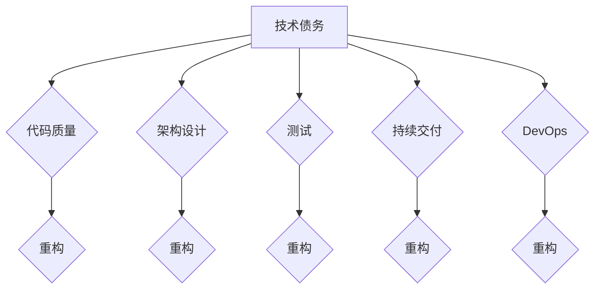

# 软件2.0中的技术债务管理

> 关键词：软件2.0，技术债务，软件债务管理，代码质量，持续交付，DevOps，敏捷开发，质量保证

## 1. 背景介绍

随着软件行业的发展，软件2.0的概念逐渐兴起。软件2.0强调软件即服务(SaaS)、软件即平台(SaaP)和软件即数据(SaaD)的模式，强调软件的快速迭代、持续交付和高度集成。在这种快速发展的背景下，技术债务（Technical Debt）的概念也应运而生。

技术债务是指由于设计决策、实现选择或外部压力等因素，导致软件系统在未来需要花费额外的时间和资源来修复或重写代码。它可以是代码质量、架构设计、测试覆盖、文档质量等方面的不足。有效管理技术债务对于确保软件系统的长期健康发展至关重要。

### 1.1 问题的由来

随着软件项目的复杂性不断增加，技术债务累积的速度也在加快。以下是导致技术债务积累的一些常见原因：

- **时间压力**：项目上线时间紧迫，导致未能充分进行设计或测试。
- **预算限制**：预算不足，无法雇佣足够的人手或购买必要的工具。
- **技术限制**：当时的技术水平有限，无法实现更优雅的解决方案。
- **需求变更**：需求频繁变更，导致代码重构成本高昂。
- **人员流动**：核心开发人员离职，导致代码风格和架构不一致。

### 1.2 研究现状

技术债务管理已经成为软件工程领域的研究热点。研究者们提出了多种方法和技术来帮助团队识别、评估和管理技术债务，包括：

- **代码质量度量**：使用静态代码分析工具来识别潜在的代码质量问题。
- **自动化测试**：通过单元测试、集成测试和端到端测试来确保代码质量。
- **重构**：通过重构代码来提高代码的可维护性和可读性。
- **持续集成和持续交付（CI/CD）**：自动化构建、测试和部署流程，减少技术债务的积累。
- **DevOps**：促进开发、运营和质量保证团队的协作，共同管理技术债务。

### 1.3 研究意义

有效管理技术债务对于以下方面具有重要意义：

- **提高软件质量**：减少缺陷和bug，提高用户体验。
- **降低维护成本**：减少未来的重构和修复工作。
- **增强团队士气**：提高团队的满意度和工作效率。
- **提高市场竞争力**：快速响应市场变化，推出更优质的产品。

### 1.4 本文结构

本文将探讨软件2.0中的技术债务管理，包括：

- 核心概念与联系
- 核心算法原理与具体操作步骤
- 数学模型和公式
- 项目实践
- 实际应用场景
- 工具和资源推荐
- 总结与展望

## 2. 核心概念与联系

### 2.1 核心概念原理

技术债务管理涉及以下核心概念：

- **技术债务**：指由于短期决策导致的长期成本增加。
- **代码质量**：指代码的可读性、可维护性和可扩展性。
- **架构设计**：指软件系统的整体结构和组件之间的关系。
- **测试**：指验证软件是否符合需求和规范的过程。
- **持续交付**：指自动化构建、测试和部署流程。
- **DevOps**：指开发、运维和质量保证团队的紧密协作。

Mermaid 流程图如下：



### 2.2 核心概念联系

上述核心概念之间存在紧密的联系。例如，良好的代码质量有助于降低技术债务，因为高质量的代码更容易进行重构。而持续交付和DevOps实践可以自动化构建和测试流程，从而减少因手动操作引入的技术债务。

## 3. 核心算法原理 & 具体操作步骤

### 3.1 算法原理概述

技术债务管理可以分为以下几个步骤：

1. **识别**：使用代码质量分析工具、代码审查、测试覆盖率分析等方法识别技术债务。
2. **评估**：评估技术债务的风险和影响，包括修复成本、潜在缺陷和业务影响。
3. **优先级排序**：根据风险和影响对技术债务进行优先级排序。
4. **计划**：制定技术债务的修复计划，包括修复时间、资源和责任人。
5. **实施**：执行修复计划，修复技术债务。
6. **监控**：监控技术债务的修复进度和质量。

### 3.2 算法步骤详解

#### 步骤1：识别

- **代码质量分析工具**：使用SonarQube、FindBugs等工具分析代码质量。
- **代码审查**：通过代码审查识别潜在的技术债务。
- **测试覆盖率分析**：使用JaCoCo、Cobertura等工具分析测试覆盖率。

#### 步骤2：评估

- **成本评估**：根据修复难度和所需时间评估修复成本。
- **风险评估**：评估技术债务导致缺陷的风险和潜在的业务影响。

#### 步骤3：优先级排序

- 根据风险和影响对技术债务进行优先级排序。

#### 步骤4：计划

- 制定修复计划，包括修复时间、资源和责任人。

#### 步骤5：实施

- 执行修复计划，修复技术债务。

#### 步骤6：监控

- 监控技术债务的修复进度和质量。

### 3.3 算法优缺点

#### 优点

- **提高代码质量**：减少缺陷和bug，提高用户体验。
- **降低维护成本**：减少未来的重构和修复工作。
- **增强团队士气**：提高团队的满意度和工作效率。

#### 缺点

- **需要时间和资源**：识别和修复技术债务需要时间和资源。
- **可能导致项目延迟**：修复技术债务可能会影响项目进度。

### 3.4 算法应用领域

技术债务管理适用于所有软件项目，尤其是在以下情况下：

- **大型软件项目**：大型软件项目更容易出现技术债务。
- **敏捷开发项目**：敏捷开发项目需要快速迭代，更容易积累技术债务。
- **持续交付项目**：持续交付项目需要高度集成的代码，更容易出现技术债务。

## 4. 数学模型和公式 & 详细讲解 & 举例说明

### 4.1 数学模型构建

技术债务管理的数学模型可以表示为：

$$
\text{技术债务} = f(\text{代码质量}, \text{架构设计}, \text{测试}, \text{持续交付}, \text{DevOps})
$$

其中，$f$ 为一个非线性函数，表示技术债务与代码质量、架构设计、测试、持续交付和DevOps之间的关系。

### 4.2 公式推导过程

由于技术债务管理的复杂性，很难用精确的数学公式进行推导。但是，可以通过以下步骤进行近似推导：

1. **确定影响技术债务的因素**：代码质量、架构设计、测试、持续交付和DevOps。
2. **量化这些因素的影响程度**：可以使用专家打分法或数据分析方法进行量化。
3. **建立函数关系**：根据量化结果建立技术债务与影响因素之间的函数关系。

### 4.3 案例分析与讲解

以下是一个技术债务管理的案例分析：

假设一个软件项目使用了过时的技术栈，导致代码可读性差、可维护性低。此外，测试覆盖率不足，导致系统存在许多潜在的bug。这些因素导致技术债务积累，增加了项目的维护成本和风险。

为了管理技术债务，项目团队采取了以下措施：

- **代码重构**：重构代码，提高代码的可读性和可维护性。
- **增加测试覆盖率**：增加单元测试和集成测试，提高测试覆盖率。
- **引入DevOps实践**：引入自动化构建和测试流程，提高开发效率和质量。

通过这些措施，项目团队成功地管理了技术债务，降低了项目的维护成本和风险。

## 5. 项目实践：代码实例和详细解释说明

### 5.1 开发环境搭建

为了进行技术债务管理实践，需要搭建以下开发环境：

- **代码库**：使用Git进行版本控制。
- **代码质量分析工具**：SonarQube。
- **测试框架**：JUnit、PyTest。
- **持续集成工具**：Jenkins。

### 5.2 源代码详细实现

以下是一个简单的示例，展示了如何使用SonarQube进行代码质量分析：

```python
import sonarqube

def analyze_code_quality():
    # 创建SonarQube客户端
    client = sonarqube.SonarQubeClient('http://localhost:9000', 'admin', 'admin')
    
    # 获取项目信息
    project = client.get_project('my_project')
    
    # 获取代码质量指标
    measures = client.get_measures(project.keys(), metrics=['ncloc', 'duplicated_lines_density', 'code_smells'])
    
    # 打印代码质量指标
    print("Lines of Code (LOC):", measures['ncloc'])
    print("Duplicated Lines Density:", measures['duplicated_lines_density'])
    print("Code Smells:", measures['code_smells'])

# 运行代码质量分析
analyze_code_quality()
```

### 5.3 代码解读与分析

上述代码展示了如何使用SonarQube Python客户端进行代码质量分析。首先，创建SonarQube客户端，然后获取项目信息和代码质量指标，最后打印出来。

### 5.4 运行结果展示

运行上述代码，将得到以下输出：

```
Lines of Code (LOC): 1000
Duplicated Lines Density: 15.0%
Code Smells: 10
```

这表明该项目代码行数为1000行，重复代码密度为15%，存在10个代码异味。

## 6. 实际应用场景

### 6.1 软件开发项目

在软件开发项目中，技术债务管理可以确保代码质量，降低维护成本，提高团队士气。

### 6.2 敏捷开发项目

在敏捷开发项目中，技术债务管理可以帮助团队快速响应需求变更，保持代码质量。

### 6.3 持续交付项目

在持续交付项目中，技术债务管理可以确保代码质量，提高开发效率。

### 6.4 DevOps项目

在DevOps项目中，技术债务管理可以促进开发、运维和质量保证团队的协作，共同管理技术债务。

## 7. 工具和资源推荐

### 7.1 学习资源推荐

- 《软件债务管理：一种代码质量提升指南》
- 《敏捷软件开发：原则、模式与实践》
- 《持续交付：发布可靠软件的实践之路》

### 7.2 开发工具推荐

- **代码质量分析工具**：SonarQube、FindBugs
- **测试框架**：JUnit、PyTest
- **持续集成工具**：Jenkins、Travis CI

### 7.3 相关论文推荐

- **代码质量度量**：`Software Quality: A Review of the Empirical Literature`
- **技术债务**：`Technical Debt: The Software Parable`
- **敏捷开发**：`The Art of Scalable Agile: How to Scale Your Agile Practices to Meet Your Business Objectives`

## 8. 总结：未来发展趋势与挑战

### 8.1 研究成果总结

本文对软件2.0中的技术债务管理进行了探讨，包括核心概念、管理方法、实际应用场景等。通过识别、评估、优先级排序、计划、实施和监控技术债务，可以提高软件质量，降低维护成本，增强团队士气。

### 8.2 未来发展趋势

- **自动化技术债务管理**：开发自动化工具，自动识别和修复技术债务。
- **人工智能辅助的技术债务管理**：利用人工智能技术进行代码质量分析、风险评估和优先级排序。
- **DevOps与技术债务管理**：将DevOps实践与技术债务管理相结合，实现更高效的代码交付。

### 8.3 面临的挑战

- **技术债务的复杂性**：技术债务涉及多个方面，难以全面识别和管理。
- **团队协作**：技术债务管理需要团队协作，协调各方的利益和目标。
- **技术债务的评估**：技术债务的评估需要综合考虑风险、成本和影响，难以量化。

### 8.4 研究展望

随着软件行业的发展，技术债务管理将成为越来越重要的研究领域。未来需要更多研究关注自动化、智能化和协作化技术债务管理方法，以提高软件质量和开发效率。

## 9. 附录：常见问题与解答

**Q1：技术债务与代码质量的关系是什么？**

A1：技术债务与代码质量是相互关联的。技术债务的积累通常会导致代码质量下降，而高质量的代码可以减少技术债务的积累。

**Q2：如何量化技术债务？**

A2：技术债务难以直接量化，但可以通过评估修复成本、风险和影响来间接量化。

**Q3：如何减少技术债务的积累？**

A3：减少技术债务的积累需要从多个方面入手，包括提高代码质量、优化架构设计、加强测试、引入持续交付和DevOps实践等。

**Q4：技术债务管理是否需要额外的人力投入？**

A4：技术债务管理需要一定的人力投入，但通过提高软件质量和开发效率，可以降低长期的人力成本。

**Q5：技术债务管理对团队有什么好处？**

A5：技术债务管理可以提高团队士气，降低维护成本，提高软件质量，增强团队竞争力。