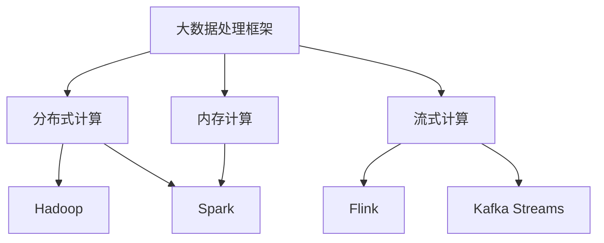
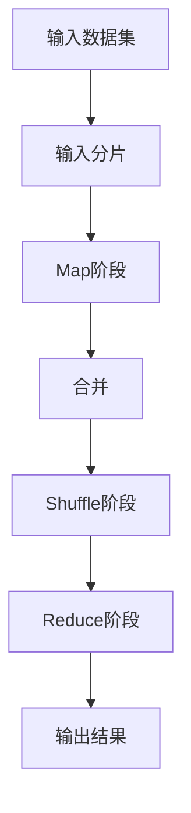
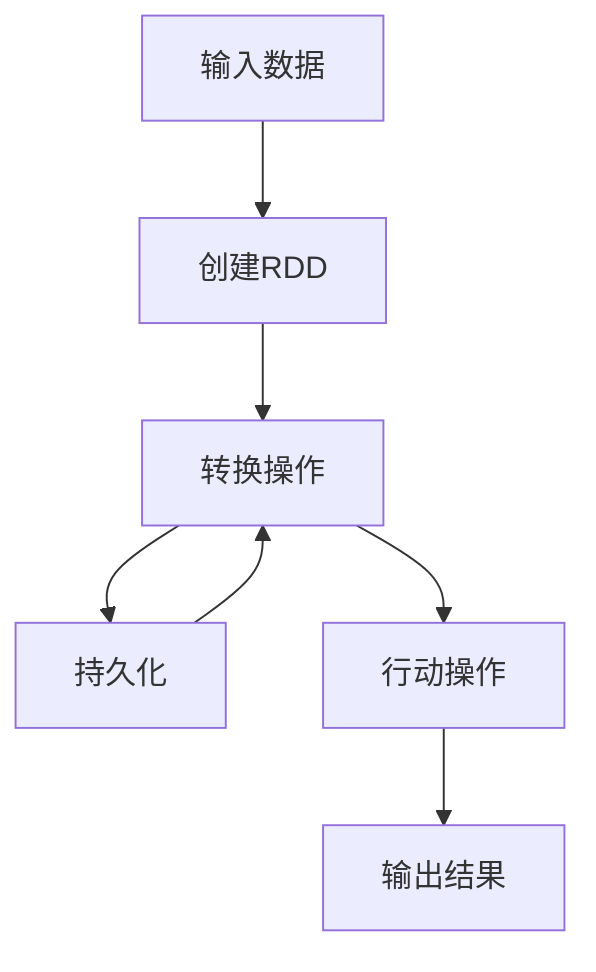
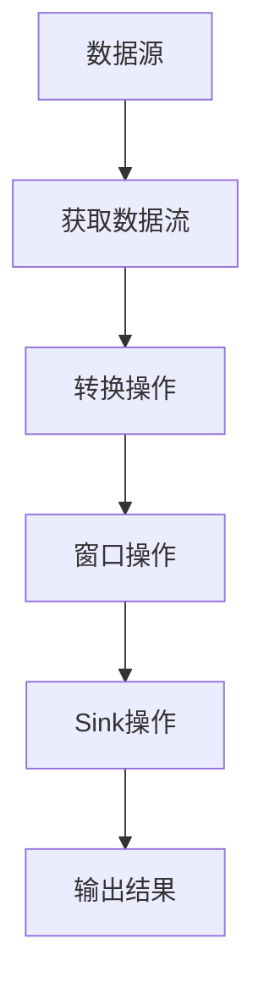

# 大数据处理框架原理与代码实战案例讲解

## 1. 背景介绍

### 1.1 问题的由来

在当今时代，数据已经成为了一种新型的战略资源。随着互联网、物联网、人工智能等技术的飞速发展,海量的数据正以前所未有的速度被生成和积累。传统的数据处理方式已经无法满足当前对大数据处理的需求。这就催生了大数据处理技术的兴起和发展。

### 1.2 研究现状

为了解决大数据带来的挑战,业界和学术界提出了多种大数据处理框架和系统,如Hadoop、Spark、Flink等。这些框架采用了分布式计算、内存计算、流式计算等先进技术,大大提高了数据处理的效率和实时性。然而,这些框架也存在一些问题,如学习成本高、部署复杂、性能瓶颈等。

### 1.3 研究意义

掌握大数据处理框架的原理和实践技能,对于企业和个人都有重要意义。对企业来说,可以利用大数据挖掘有价值的信息,优化业务流程,提升竞争力。对个人来说,可以获得大数据时代所需的核心技能,提高就业竞争力。因此,深入研究大数据处理框架的原理和实践案例,具有重要的理论和现实意义。

### 1.4 本文结构

本文将从以下几个方面深入探讨大数据处理框架:

1. 核心概念与联系
2. 核心算法原理与具体操作步骤
3. 数学模型和公式详细讲解与案例分析
4. 项目实践:代码实例和详细解释说明
5. 实际应用场景
6. 工具和资源推荐
7. 总结:未来发展趋势与挑战
8. 附录:常见问题与解答

## 2. 核心概念与联系

在深入探讨大数据处理框架之前,我们需要了解一些核心概念及其相互关系。

### 2.1 大数据(Big Data)

大数据指的是规模巨大、种类繁多、增长迅速的数据集合,其特点可以用4V原则来概括:

- Volume(大量)
- Variety(多样)
- Velocity(高速)
- Value(价值)

### 2.2 分布式计算(Distributed Computing)

由于大数据的规模巨大,单机计算已经无法满足需求。分布式计算通过将计算任务分解并分配到多台计算机上并行执行,从而提高了计算效率。常见的分布式计算框架包括Hadoop、Spark等。

### 2.3 内存计算(In-Memory Computing)

传统的磁盘读写速度已经无法满足大数据处理的实时性需求。内存计算通过将数据加载到内存中进行计算,大大提高了计算速度。Spark就是一种基于内存计算的大数据处理框架。

### 2.4 流式计算(Stream Computing)

对于一些实时性要求较高的应用场景,如社交网络、物联网等,需要采用流式计算模式。流式计算框架(如Flink、Kafka Streams等)能够实时处理持续不断到来的数据流。

### 2.5 概念关系

上述核心概念相互关联,共同构建了大数据处理框架的基础。分布式计算解决了大数据量的问题,内存计算提高了计算效率,流式计算满足了实时性需求。这些技术的融合,使得大数据处理框架能够高效、实时地处理海量异构数据。

## 3. 核心算法原理与具体操作步骤

大数据处理框架通常采用一些核心算法来实现分布式计算、内存计算和流式计算等功能。下面我们将详细探讨这些算法的原理和具体操作步骤。

### 3.1 算法原理概述

#### 3.1.1 MapReduce算法

MapReduce是Hadoop框架中的核心算法,它将计算过程分为两个阶段:Map(映射)和Reduce(归约)。

1. Map阶段:将输入数据分割为多个数据块,并行处理每个数据块,生成中间结果。
2. Reduce阶段:对Map阶段的中间结果进行合并和归约操作,生成最终结果。

MapReduce算法的优点是易于实现并行化,适合处理大规模数据集。但它也存在一些缺点,如对实时计算支持不足、中间结果需要写入磁盘等。

#### 3.1.2 Spark RDD

Spark采用了弹性分布式数据集(Resilient Distributed Dataset,RDD)的数据抽象,它是一种分布式内存数据结构。RDD支持并行操作,如map、filter、join等,并且具有容错性。Spark基于RDD实现了内存计算,大大提高了计算效率。

#### 3.1.3 Flink流处理

Flink是一种流式数据处理框架,它采用了流处理模型。数据被视为无限流,Flink通过持续不断地对数据流进行转换操作(如filter、map、window等)来实现实时计算。Flink支持事件时间和处理时间语义,能够精确控制事件的处理顺序。

### 3.2 算法步骤详解

#### 3.2.1 MapReduce算法步骤

1. **输入分片(Input Split)**: 将输入数据集分割为多个数据块(通常为64MB)。
2. **Map阶段**:
    - **映射(Mapping)**: 对每个数据块并行执行Map函数,生成键值对形式的中间结果。
    - **合并(Combiner)**: 对Map阶段的中间结果进行本地合并,减少传输数据量。
3. **Shuffle阶段**:
    - **分区(Partitioning)**: 根据分区函数,将Map阶段的输出数据分散到不同的Reduce节点。
    - **排序(Sorting)**: 对每个Reduce节点上的数据进行排序,保证相同键的数据在一起。
4. **Reduce阶段**:
    - **归约(Reducing)**: 对每个键对应的值集进行归约操作,生成最终结果。
5. **输出(Output)**: 将Reduce阶段的结果写入文件系统。

#### 3.2.2 Spark RDD操作步骤

1. **创建RDD**: 从文件系统、集合或其他RDD创建初始RDD。
2. **转换(Transformation)**: 对RDD执行并行操作,如map、filter、join等,生成新的RDD。
3. **行动(Action)**: 对RDD执行计算,如count、collect、save等,触发实际计算。
4. **持久化(Persisting)**: 可选地将中间RDD持久化到内存或磁盘,以备后续重用。

#### 3.2.3 Flink流处理步骤

1. **获取数据源**: 从文件、Socket、Kafka等数据源创建数据流。
2. **转换操作**:
    - **基本转换**: 如map、flatMap、filter等,对数据流进行转换。
    - **物理分区**: 如shuffle、rebalance等,对数据流进行重新分区。
    - **窗口操作**: 如tumbling window、sliding window等,对数据流进行窗口化处理。
3. **Sink操作**: 将处理后的数据流写入文件系统、数据库或消息队列等目标系统。

### 3.3 算法优缺点

#### 3.3.1 MapReduce算法

**优点**:

- 易于实现并行化,适合处理大规模数据集。
- 具有容错机制,可以自动处理节点故障。
- 编程模型简单,易于上手。

**缺点**:

- 对实时计算支持不足,需要多次迭代计算。
- 中间结果需要写入磁盘,引入了大量I/O开销。
- 对于迭代计算和图计算等场景,性能较低。

#### 3.3.2 Spark RDD

**优点**:

- 基于内存计算,大大提高了计算效率。
- 支持迭代计算和图计算等复杂场景。
- 提供了丰富的API和高级算法库。
- 具有容错机制,可以从故障中恢复。

**缺点**:

- 对小规模数据集的性能优势不明显。
- 内存资源有限,需要合理管理内存使用。
- 对于流式计算支持不足。

#### 3.3.3 Flink流处理

**优点**:

- 低延迟、高吞吐的真正流式处理。
- 支持事件时间和处理时间语义。
- 提供了丰富的窗口操作和状态管理机制。
- 具有良好的容错机制和高可用性。

**缺点**:

- 对于批处理场景,性能优势不明显。
- 学习成本较高,编程模型相对复杂。
- 社区和生态系统相对较小。

### 3.4 算法应用领域

#### 3.4.1 MapReduce应用场景

- 网页索引构建
- 日志分析
- 大数据分析
- 科学计算

#### 3.4.2 Spark应用场景

- 机器学习和数据挖掘
- 实时数据分析
- 图计算
- 交互式数据分析

#### 3.4.3 Flink应用场景

- 实时数据处理
- 物联网数据分析
- 在线机器学习
- 复杂事件处理

## 4. 数学模型和公式详细讲解与举例说明

在大数据处理框架中,一些核心算法和技术都涉及到了数学模型和公式。本节将详细讲解这些数学模型和公式,并通过案例进行说明。

### 4.1 数学模型构建

#### 4.1.1 MapReduce数学模型

MapReduce算法可以用以下数学模型表示:

$$
\begin{align*}
map &: (k_1, v_1) \rightarrow \text{list}(k_2, v_2) \
reduce &: (k_2, \text{list}(v_2)) \rightarrow \text{list}(v_3)
\end{align*}
$$

其中:

- $(k_1, v_1)$表示输入的键值对
- $map$函数将输入的键值对转换为一个中间键值对列表
- $reduce$函数将具有相同键的值列表合并为一个新的值列表

#### 4.1.2 PageRank算法数学模型

PageRank是一种用于网页排名的算法,它可以用以下数学模型表示:

$$
PR(u) = \frac{1-d}{N} + d \sum_{v \in B_u} \frac{PR(v)}{L(v)}
$$

其中:

- $PR(u)$表示网页$u$的PageRank值
- $B_u$是链接到网页$u$的网页集合
- $L(v)$是网页$v$的出链接数
- $d$是阻尼系数,通常取值为0.85
- $N$是网页总数

#### 4.1.3 逻辑回归模型

逻辑回归是一种常用的机器学习模型,它可以用于分类问题。逻辑回归模型的数学表达式如下:

$$
P(Y=1|X) = \frac{1}{1 + e^{-(\beta_0 + \beta_1X_1 + \beta_2X_2 + \cdots + \beta_nX_n)}}
$$

其中:

- $Y$是二元响应变量(0或1)
- $X_1, X_2, \ldots, X_n$是自变量
- $\beta_0, \beta_1, \beta_2, \ldots, \beta_n$是模型参数

### 4.2 公式推导过程

#### 4.2.1 MapReduce公式推导

MapReduce算法的核心思想是将计算过程分为两个阶段:Map和Reduce。我们可以将输入数据集表示为一个键值对列表:

$$