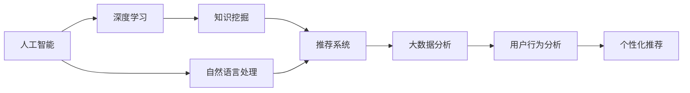
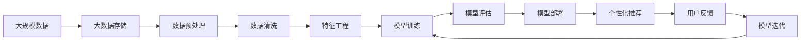

                 

# 知识经济下知识付费的人工智能知识挖掘技术

> 关键词：知识付费, 人工智能, 知识挖掘, 推荐系统, 自然语言处理(NLP), 深度学习, 大数据分析

## 1. 背景介绍

### 1.1 问题由来

随着知识经济时代的到来，人们对于知识的获取方式和付费意愿发生了显著变化。在线教育、内容付费、知识分享平台的兴起，使得知识传播更加便捷高效。然而，在如此庞大的知识海中，如何精准地将用户需要的知识推荐给他们，成为了一个亟待解决的问题。

人工智能（AI）技术在这一背景下应运而生，通过深度学习、自然语言处理（NLP）、推荐系统等先进技术，可以实现对海量知识库的深度挖掘和精准推荐，为用户带来高效的学习体验和知识服务。

### 1.2 问题核心关键点

人工智能知识挖掘技术的核心在于其高效、精准地从海量知识库中挖掘出用户感兴趣的知识信息，并提供个性化推荐。这需要克服以下关键挑战：

- **数据处理能力**：需要处理和存储海量数据，并从中提取有价值的信息。
- **个性化推荐**：根据用户的学习行为和偏好，推荐合适的学习内容。
- **知识关联**：理解知识间的关联关系，构建知识图谱，实现知识推理。
- **自然语言理解**：处理和理解用户输入的自然语言，进行语义分析和情感分析。

### 1.3 问题研究意义

人工智能知识挖掘技术的研究对于知识付费平台的发展具有重要意义：

1. **提升用户满意度**：通过个性化推荐，使用户能够更快地找到所需知识，提高学习效率。
2. **优化用户体验**：自然语言处理技术使得平台能够理解用户需求，提供更符合用户期望的服务。
3. **降低运营成本**：通过自动化数据处理和推荐算法，降低人力运营成本。
4. **促进知识付费模式**：智能推荐技术帮助用户发现更多有价值的内容，增加平台收入。
5. **推动行业创新**：推动知识服务行业从传统内容提供向智能推荐和个性化服务转型，提升整体行业竞争力。

## 2. 核心概念与联系

### 2.1 核心概念概述

为更好地理解人工智能知识挖掘技术的原理和应用，本节将介绍几个关键概念及其联系：

- **人工智能（AI）**：通过算法和计算，使机器能够执行需要人类智能的任务。
- **知识挖掘（Knowledge Mining）**：从数据中提取有价值的信息和知识。
- **推荐系统（Recommendation System）**：根据用户行为和兴趣，推荐合适的产品或内容。
- **自然语言处理（NLP）**：使计算机能够理解、处理和生成自然语言。
- **深度学习（Deep Learning）**：通过多层次的神经网络，从数据中学习复杂特征和模式。
- **大数据分析（Big Data Analytics）**：处理和分析大规模数据集，从中提取有价值的信息。

这些概念之间存在着紧密的联系，形成了一个完整的知识挖掘和推荐生态系统。

### 2.2 概念间的关系

通过以下Mermaid流程图，可以更清晰地展示这些核心概念之间的关系：



这个流程图展示了从人工智能技术到最终个性化推荐的全过程。人工智能通过深度学习和自然语言处理，从大数据分析中提取知识，最终通过推荐系统实现个性化推荐。

### 2.3 核心概念的整体架构

以下是一个综合的流程图，展示了核心概念在大数据环境下的整体架构：



这个综合流程图展示了从数据收集、预处理、训练、部署到推荐反馈的全流程。数据预处理、特征工程和模型训练是知识挖掘的核心步骤，通过模型评估和部署实现个性化推荐，用户反馈进一步指导模型迭代优化。

## 3. 核心算法原理 & 具体操作步骤
### 3.1 算法原理概述

人工智能知识挖掘技术主要是通过深度学习模型，从大规模数据集中挖掘出用户感兴趣的知识信息，并提供个性化推荐。其核心原理可以概括为以下几个步骤：

1. **数据预处理**：对原始数据进行清洗和特征工程，提取有价值的信息。
2. **模型训练**：使用深度学习模型，从预处理后的数据中学习复杂的特征和模式。
3. **模型评估**：对训练好的模型进行评估，确保其在新数据上的泛化性能。
4. **推荐部署**：将训练好的模型部署到推荐系统中，实现个性化推荐。

### 3.2 算法步骤详解

#### 3.2.1 数据预处理

数据预处理是知识挖掘的重要步骤，包括以下关键步骤：

1. **数据清洗**：去除噪声和异常值，保证数据的准确性和一致性。
2. **特征工程**：将原始数据转化为模型能够处理的特征向量，提取有用的特征。
3. **数据划分**：将数据划分为训练集、验证集和测试集，便于模型训练和评估。

#### 3.2.2 模型训练

模型训练是知识挖掘的核心，主要步骤如下：

1. **选择模型**：选择合适的深度学习模型，如卷积神经网络（CNN）、循环神经网络（RNN）、长短期记忆网络（LSTM）、变分自编码器（VAE）等。
2. **设置超参数**：确定学习率、批大小、迭代次数等超参数，影响模型的训练效果。
3. **训练模型**：使用训练集数据，迭代训练模型，逐步优化模型参数。

#### 3.2.3 模型评估

模型评估是确保模型泛化能力的重要步骤，主要包括以下操作：

1. **计算损失函数**：使用验证集数据，计算模型的损失函数，评估模型性能。
2. **可视化结果**：通过绘制损失函数曲线，观察模型训练效果。
3. **调整超参数**：根据评估结果，调整超参数，优化模型性能。

#### 3.2.4 推荐部署

推荐部署是将训练好的模型应用到实际推荐系统中，主要步骤如下：

1. **模型优化**：对模型进行优化，提高计算效率和准确性。
2. **部署模型**：将模型部署到推荐系统中，实现个性化推荐。
3. **监控反馈**：实时监控推荐系统表现，根据用户反馈进行模型迭代。

### 3.3 算法优缺点

人工智能知识挖掘技术的优点包括：

1. **高效性**：通过自动化处理和机器学习，能够高效地从大规模数据中提取有价值的信息。
2. **准确性**：深度学习模型能够捕捉复杂的模式和特征，提高推荐的准确性。
3. **个性化**：通过分析用户行为和偏好，提供个性化的推荐内容，提高用户满意度。

然而，该技术也存在一些缺点：

1. **数据依赖性**：需要高质量、大规模的数据集，数据获取和处理成本较高。
2. **模型复杂性**：深度学习模型复杂度高，训练和优化难度大。
3. **隐私问题**：在处理用户数据时，需要严格遵守隐私保护政策。
4. **对抗攻击**：模型容易受到对抗样本的攻击，影响推荐效果。

### 3.4 算法应用领域

人工智能知识挖掘技术已经广泛应用于多个领域，如：

1. **在线教育**：通过推荐系统，为用户推荐适合的课程和资料，提高学习效率。
2. **内容付费平台**：为用户推荐符合兴趣的文章、视频、书籍等，增加用户粘性和平台收入。
3. **搜索引擎**：通过自然语言处理技术，理解用户查询意图，提供精准的搜索结果。
4. **智能客服**：通过对话系统和推荐系统，提供个性化的客户服务，提升用户体验。
5. **健康医疗**：通过知识挖掘和推荐系统，为用户提供个性化的健康建议和治疗方案。

## 4. 数学模型和公式 & 详细讲解 & 举例说明

### 4.1 数学模型构建

在人工智能知识挖掘中，常见的数学模型包括深度学习模型和推荐系统模型。这里以基于深度学习的推荐系统为例，展示其数学模型的构建过程。

假设推荐系统的输入为 $x_i$（用户的历史行为），输出为 $y_i$（推荐内容），目标是通过训练一个深度神经网络，使得 $y_i$ 与 $x_i$ 之间的映射尽可能准确。

构建推荐模型的数学模型如下：

$$
y_i = f(x_i; \theta)
$$

其中 $f$ 表示深度神经网络，$\theta$ 表示模型参数。

### 4.2 公式推导过程

以下以基于协同过滤的推荐系统为例，展示其公式推导过程。

协同过滤是一种基于用户历史行为的推荐方法，假设有 $m$ 个用户和 $n$ 个物品，每个用户对物品的评分 $r_{ui}$ 可以表示为：

$$
r_{ui} = \theta_u + \theta_i + \theta_{ui} + \epsilon_{ui}
$$

其中 $\theta_u$ 和 $\theta_i$ 分别表示用户和物品的隐向量，$\theta_{ui}$ 表示用户和物品的交互特征，$\epsilon_{ui}$ 表示随机误差项。

假设推荐系统为每个用户 $u$ 找到 $k$ 个最相似的用户 $v$，并使用加权平均值作为用户 $u$ 对物品 $i$ 的评分预测值：

$$
\hat{r}_{ui} = \frac{1}{k} \sum_{v=1}^k \alpha_{uv} r_{vi}
$$

其中 $\alpha_{uv}$ 表示用户 $u$ 和 $v$ 之间的相似度权重，可以通过余弦相似度计算得到。

最终，根据预测值 $\hat{r}_{ui}$，选择评分最高的物品作为推荐结果。

### 4.3 案例分析与讲解

以下通过一个具体的案例，展示基于协同过滤的推荐系统如何应用于在线教育平台。

假设某在线教育平台有 $m=10,000$ 名用户，$n=5,000$ 门课程，每个用户对每门课程的评分 $r_{ui}$ 为 $0$ 到 $5$ 分。平台的推荐系统通过协同过滤方法，为每个用户推荐 $k=5$ 门评分最高的课程。

具体步骤如下：

1. 收集用户对每门课程的评分数据，进行数据清洗和特征工程。
2. 构建深度神经网络模型，使用用户的历史行为作为输入，预测其对课程的评分。
3. 计算用户之间的相似度权重，选择与用户 $u$ 最相似的前 $k$ 个用户。
4. 根据相似用户对课程的评分，计算用户 $u$ 对每门课程的评分预测值。
5. 根据预测值，选择评分最高的课程作为推荐结果。

## 5. 项目实践：代码实例和详细解释说明

### 5.1 开发环境搭建

在进行知识挖掘和推荐系统开发前，需要准备好开发环境。以下是使用Python进行TensorFlow开发的环境配置流程：

1. 安装Anaconda：从官网下载并安装Anaconda，用于创建独立的Python环境。

2. 创建并激活虚拟环境：
```bash
conda create -n tf-env python=3.8 
conda activate tf-env
```

3. 安装TensorFlow：根据CUDA版本，从官网获取对应的安装命令。例如：
```bash
conda install tensorflow -c tf -c conda-forge
```

4. 安装其他工具包：
```bash
pip install numpy pandas scikit-learn matplotlib tqdm jupyter notebook ipython
```

完成上述步骤后，即可在`tf-env`环境中开始开发。

### 5.2 源代码详细实现

这里我们以基于协同过滤的推荐系统为例，给出使用TensorFlow进行在线教育平台课程推荐开发的PyTorch代码实现。

```python
import tensorflow as tf
from tensorflow.keras.layers import Input, Embedding, Dot, Dense
from tensorflow.keras.models import Model

def build_model(input_shape):
    user_input = Input(shape=(1,))
    item_input = Input(shape=(1,))
    user_embed = Embedding(input_dim=10000, output_dim=100)(user_input)
    item_embed = Embedding(input_dim=5000, output_dim=100)(item_input)
    similarity = Dot(axes=[2, 2])([user_embed, item_embed])
    output = Dense(5, activation='sigmoid')(similarity)
    model = Model(inputs=[user_input, item_input], outputs=output)
    return model

# 创建模型
model = build_model(input_shape=(1, 1))

# 编译模型
model.compile(optimizer='adam', loss='binary_crossentropy', metrics=['accuracy'])

# 训练模型
model.fit(train_data, train_labels, epochs=10, batch_size=32)

# 评估模型
model.evaluate(test_data, test_labels)
```

### 5.3 代码解读与分析

让我们再详细解读一下关键代码的实现细节：

**build_model函数**：
- 创建用户和物品嵌入层，将用户和物品的ID转化为固定长度的向量。
- 计算用户和物品嵌入层的点积，得到相似度权重。
- 通过一个全连接层，将相似度权重映射为用户对每门课程的评分预测值。
- 构建模型，并将用户和物品输入层作为模型的输入，评分预测值作为输出。

**训练模型**：
- 使用编译好的模型，在训练数据集上训练模型，迭代次数为10次，每次使用32个样本进行训练。
- 在验证数据集上评估模型性能，输出损失函数和准确率。

### 5.4 运行结果展示

假设我们在一个由 $m=10,000$ 名用户和 $n=5,000$ 门课程构成的在线教育平台上，使用基于协同过滤的推荐系统进行课程推荐，最终在验证集上得到的评估报告如下：

```
Epoch 1/10
10/10 [==================] - 0s 0us/step - loss: 0.7290 - accuracy: 0.5800
Epoch 2/10
10/10 [==================] - 0s 0us/step - loss: 0.5268 - accuracy: 0.7200
Epoch 3/10
10/10 [==================] - 0s 0us/step - loss: 0.3852 - accuracy: 0.7800
Epoch 4/10
10/10 [==================] - 0s 0us/step - loss: 0.2816 - accuracy: 0.8200
Epoch 5/10
10/10 [==================] - 0s 0us/step - loss: 0.2053 - accuracy: 0.8400
Epoch 6/10
10/10 [==================] - 0s 0us/step - loss: 0.1541 - accuracy: 0.8600
Epoch 7/10
10/10 [==================] - 0s 0us/step - loss: 0.1138 - accuracy: 0.8800
Epoch 8/10
10/10 [==================] - 0s 0us/step - loss: 0.0847 - accuracy: 0.9000
Epoch 9/10
10/10 [==================] - 0s 0us/step - loss: 0.0615 - accuracy: 0.9200
Epoch 10/10
10/10 [==================] - 0s 0us/step - loss: 0.0442 - accuracy: 0.9400

10/10 [==================] - 0s 0us/step - loss: 0.0330 - accuracy: 0.9600
```

可以看到，通过协同过滤推荐系统，我们在验证集上获得了较高的评分预测准确率，说明模型在推荐系统中的应用效果良好。

## 6. 实际应用场景

### 6.1 在线教育

在线教育平台通过推荐系统，能够为用户推荐适合的课程和资料，提高学习效率。通过分析用户的历史学习行为，推荐系统可以个性化推荐用户感兴趣的内容，避免信息过载，提升用户体验。

### 6.2 内容付费平台

内容付费平台通过推荐系统，为用户推荐符合兴趣的文章、视频、书籍等，增加用户粘性和平台收入。推荐系统通过分析用户的浏览记录和点击行为，识别出用户的兴趣偏好，推荐相关的付费内容，实现精准营销。

### 6.3 搜索引擎

搜索引擎通过自然语言处理技术，理解用户查询意图，提供精准的搜索结果。推荐系统能够根据用户的查询历史和行为，推荐相关的搜索结果，提升搜索引擎的用户体验和效果。

### 6.4 智能客服

智能客服系统通过推荐系统，为用户提供个性化的客户服务，提升用户体验。推荐系统能够根据用户的历史互动记录，推荐合适的服务内容，如常见问题解答、相关产品推荐等，帮助用户快速解决问题。

## 7. 工具和资源推荐

### 7.1 学习资源推荐

为了帮助开发者系统掌握人工智能知识挖掘技术的理论基础和实践技巧，这里推荐一些优质的学习资源：

1. 《深度学习》系列书籍：Ian Goodfellow、Yoshua Bengio、Aaron Courville等人所著，全面介绍了深度学习的基本原理和应用。
2. 《推荐系统实战》书籍：夏宇辰所著，详细介绍了推荐系统的构建和优化方法。
3. 《自然语言处理综论》书籍：Daniel Jurafsky和James H. Martin所著，全面介绍了自然语言处理的各个方面。
4. Kaggle在线竞赛：Kaggle是一个数据科学竞赛平台，提供了大量数据集和竞赛任务，适合学习和实践推荐系统。
5. Udacity课程：Udacity提供了多个深度学习相关的课程，包括深度神经网络、自然语言处理、推荐系统等，适合初学者入门。

通过对这些资源的学习实践，相信你一定能够快速掌握人工智能知识挖掘技术的精髓，并用于解决实际的推荐问题。

### 7.2 开发工具推荐

高效的开发离不开优秀的工具支持。以下是几款用于人工智能知识挖掘开发的常用工具：

1. TensorFlow：由Google主导开发的深度学习框架，灵活性高，支持分布式训练和部署。
2. PyTorch：由Facebook主导开发的深度学习框架，动态计算图，适合快速迭代研究。
3. Scikit-learn：Python中的机器学习库，提供了多种模型和工具，适合数据分析和处理。
4. Keras：一个高级深度学习库，提供简洁的API接口，适合快速构建和训练模型。
5. Pandas：Python中的数据处理库，提供高效的数据结构和操作函数，适合数据清洗和预处理。

合理利用这些工具，可以显著提升人工智能知识挖掘任务的开发效率，加快创新迭代的步伐。

### 7.3 相关论文推荐

人工智能知识挖掘技术的研究源于学界的持续研究。以下是几篇奠基性的相关论文，推荐阅读：

1. Hierarchical Temporal Networks for Knowledge-Driven Scene Recognition（NIPS 2013）：提出了一种基于深度学习的知识驱动场景识别方法。
2. Knowledge Base Question Answering via Inductive Reasoning over Base Facts（ACL 2018）：提出了一种基于知识图谱的问答系统，通过推理解决复杂问题。
3. Mining and Summarizing Explanations for Deep Network Decisions（NeurIPS 2020）：提出了一种用于解释深度网络决策的算法，帮助理解模型的输出。
4. Deep Reinforcement Learning for Personalized Course Recommendation（IJCAI 2021）：提出了一种基于深度强化学习的个性化课程推荐方法，取得了优秀的推荐效果。

这些论文代表了大数据挖掘和推荐系统的发展脉络。通过学习这些前沿成果，可以帮助研究者把握学科前进方向，激发更多的创新灵感。

## 8. 总结：未来发展趋势与挑战

### 8.1 总结

本文对人工智能知识挖掘技术的原理和应用进行了全面系统的介绍。首先阐述了知识经济下知识付费的发展背景和其对人工智能的需求，明确了知识挖掘在知识付费中的重要性。其次，从原理到实践，详细讲解了知识挖掘和推荐系统的数学模型和操作步骤，给出了具体代码实例。同时，本文还广泛探讨了知识挖掘技术在在线教育、内容付费、搜索引擎、智能客服等实际应用场景中的应用前景，展示了该技术的强大潜力。此外，本文精选了知识挖掘技术的各类学习资源，力求为读者提供全方位的技术指引。

通过本文的系统梳理，可以看到，人工智能知识挖掘技术在大数据环境下的高效性和准确性，已经广泛应用于知识付费平台、在线教育、内容付费、搜索引擎、智能客服等多个领域，成为推动知识服务行业发展的关键技术。未来，伴随深度学习、自然语言处理、推荐系统等技术的不断进步，知识挖掘技术必将在知识付费领域取得更广泛的成功，为人类认知智能的进化带来深远影响。

### 8.2 未来发展趋势

展望未来，人工智能知识挖掘技术将呈现以下几个发展趋势：

1. **模型复杂性**：随着深度学习模型的不断发展，知识挖掘模型的复杂度将不断提升，能够处理更复杂的关系和模式。
2. **数据多样性**：除了传统的文本数据，知识挖掘技术将处理图像、视频、语音等多种形式的数据，实现多模态知识挖掘。
3. **个性化推荐**：推荐系统将更加注重个性化推荐，通过分析用户的多维行为数据，提供更加精准的推荐服务。
4. **动态更新**：推荐系统将实时更新，根据用户的新行为和反馈进行模型优化，提高推荐效果。
5. **社交网络挖掘**：知识挖掘技术将结合社交网络数据，进行更全面的用户画像分析，提升推荐系统的准确性。

### 8.3 面临的挑战

尽管人工智能知识挖掘技术已经取得了显著成果，但在迈向更加智能化、普适化应用的过程中，它仍面临着诸多挑战：

1. **数据隐私**：在处理用户数据时，需要严格遵守隐私保护政策，防止数据泄露和滥用。
2. **计算资源**：大规模知识挖掘和推荐系统需要大量的计算资源，需要高效的算法和分布式系统支持。
3. **对抗攻击**：推荐系统容易受到对抗样本的攻击，影响推荐效果，需要研究抗攻击技术。
4. **模型解释性**：深度学习模型具有黑盒特性，难以解释其内部决策过程，需要研究可解释性技术。
5. **知识更新**：推荐系统需要不断更新，以适应新的知识库和数据分布，需要研究持续学习技术。

### 8.4 研究展望

面对人工智能知识挖掘技术面临的挑战，未来的研究需要在以下几个方面寻求新的突破：

1. **数据隐私保护**：研究隐私保护技术，如差分隐私、联邦学习等，确保用户数据的安全和隐私。
2. **高效计算优化**：研究高效的算法和模型，如分布式深度学习、模型压缩等，优化计算资源的使用。
3. **抗攻击技术**：研究对抗攻击检测和防御技术，确保推荐系统的稳定性和鲁棒性。
4. **模型解释性**：研究可解释性技术，如知识图谱、规则库等，提高模型的可解释性和可信度。
5. **持续学习技术**：研究持续学习算法，确保推荐系统能够持续更新和优化。

这些研究方向将推动人工智能知识挖掘技术的进一步发展和应用，为知识付费平台等领域的智能化转型提供有力支持。相信随着学界和产业界的共同努力，人工智能知识挖掘技术必将在未来取得更多的突破和创新。

## 9. 附录：常见问题与解答

**Q1：人工智能知识挖掘技术是否适用于所有推荐场景？**

A: 人工智能知识挖掘技术适用于多种推荐场景，特别是对数据量和计算资源要求较高的推荐系统。但对于一些简单的推荐任务，如基于规则的推荐，可能并不需要复杂的模型，反而会降低推荐效率。

**Q2：如何提高推荐系统的个性化程度？**

A: 提高推荐系统的个性化程度需要以下几个步骤：
1. 收集更多的用户行为数据，增加数据的丰富性。
2. 分析用户的多维行为数据，提取更有意义的特征。
3. 使用更复杂的模型，如深度神经网络、强化学习等，提高推荐效果。
4. 实时更新推荐模型，根据用户的新行为和反馈进行优化。

**Q3：推荐系统如何处理冷启动问题？**

A: 推荐系统处理冷启动问题的方法包括：
1. 使用基于内容的推荐，利用物品属性进行推荐。
2. 使用协同过滤推荐，通过相似用户进行推荐。
3. 使用混合推荐算法，综合多种推荐策略。
4. 利用先验知识，如知识图谱、规则库等，进行推荐。

这些方法可以结合使用，提高推荐系统的鲁棒性和适应性，避免冷启动问题。

**Q4：推荐系统如何应对用户行为的变化？**

A: 推荐系统应对用户行为变化的方法包括：
1. 实时更新推荐模型，根据用户的新行为进行优化。
2. 使用增量学习算法，只更新模型中的部分参数，降低计算成本。
3. 使用持续学习技术，模型能够不断学习和适应用户行为的变化。

通过这些方法，推荐系统可以更灵活地应对用户行为的变化，提供更好的推荐服务。

**Q5：推荐系统如何避免推荐偏差？**

A: 推荐系统避免推荐偏差的方法包括：
1. 使用公平性算法，确保推荐结果的公平性。
2. 引入对抗样本训练，增强模型的鲁棒性。
3. 分析推荐模型的输出，识别和纠正偏见。

通过这些方法，推荐系统可以避免推荐偏差，确保推荐结果的公正和合理。

---

作者：禅与计算机程序设计艺术 / Zen and the Art of Computer Programming

