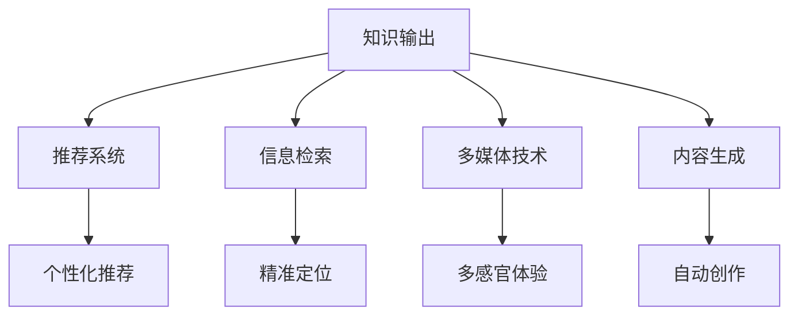
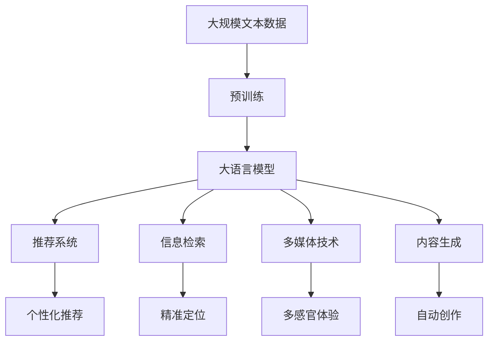

                 

# 知识输出的多种方式及其效果

> 关键词：知识输出, 多模态输出, 推荐系统, 信息检索, 多媒体, 内容生成

## 1. 背景介绍

### 1.1 问题由来
随着互联网技术的迅猛发展，信息的传播和获取变得越来越便捷，知识输出形式也变得多样。从传统的文字和图片，到现在的视频和音频，知识输出形式不断创新和演进。这些变化不仅提升了用户体验，也促进了知识传播效率的提升。

### 1.2 问题核心关键点
知识输出形式的核心关键点包括：
- 多模态输出：文字、图片、视频、音频等多种形式的知识输出。
- 推荐系统：基于用户兴趣和行为数据，推荐合适的知识输出。
- 信息检索：快速定位和获取特定领域内的知识输出。
- 多媒体技术：利用图像、视频、音频等多媒体元素丰富知识输出内容。
- 内容生成：利用自然语言处理和生成技术自动生成知识输出。

这些关键点共同构成了知识输出的核心要素，决定了知识传播和获取的效果和效率。

### 1.3 问题研究意义
研究知识输出的多种方式及其效果，对于提升信息传播效率、优化用户体验、促进知识共享具有重要意义。

- 提升传播效率：通过多模态输出、推荐系统和信息检索，可以快速、准确地传递知识，减少用户的查找时间和认知负担。
- 优化用户体验：通过多媒体和内容生成技术，可以提升知识输出的吸引力和可读性，增强用户的参与感和互动性。
- 促进知识共享：多模态和多媒体输出方式，可以更全面、直观地展示知识，促进不同领域和背景的学者、从业者之间的知识交流和共享。

## 2. 核心概念与联系

### 2.1 核心概念概述

为更好地理解知识输出的多种方式及其效果，本节将介绍几个密切相关的核心概念：

- 知识输出(Knowledge Output)：指将知识以各种形式传递给用户的过程，包括文字、图片、视频、音频等多种形式。知识输出的目标在于提高知识传播效率，优化用户体验。
- 推荐系统(Recommendation System)：通过分析用户兴趣和行为数据，推荐用户可能感兴趣的知识输出，如文章、视频、音频等。推荐系统的目标是提升用户满意度和留存率。
- 信息检索(Information Retrieval)：根据用户输入的查询关键词，快速定位并返回相关的知识输出，如文章、网页、视频等。信息检索系统的目标是提高检索准确率和响应速度。
- 多媒体技术(Multimedia Technology)：结合文字、图片、视频、音频等多媒体元素，丰富知识输出的表现形式，提升用户体验。
- 内容生成(Content Generation)：利用自然语言处理和生成技术，自动生成知识输出，如文章、视频脚本等。内容生成技术可以极大地提高知识输出的生产效率。

这些核心概念之间的逻辑关系可以通过以下Mermaid流程图来展示：



这个流程图展示了几大核心概念之间的联系：

1. 知识输出是核心，通过推荐系统、信息检索、多媒体技术和内容生成技术进行丰富和优化。
2. 推荐系统和信息检索技术帮助用户快速定位感兴趣的知识点。
3. 多媒体技术和内容生成技术丰富知识输出的表现形式，提升用户体验。

### 2.2 概念间的关系

这些核心概念之间存在着紧密的联系，形成了知识输出的完整生态系统。下面我通过几个Mermaid流程图来展示这些概念之间的关系。

#### 2.2.1 知识输出的学习范式


这个流程图展示了几大核心概念之间的关系：

1. 知识输出是核心，通过推荐系统、信息检索、多媒体技术和内容生成技术进行丰富和优化。
2. 推荐系统和信息检索技术帮助用户快速定位感兴趣的知识点。
3. 多媒体技术和内容生成技术丰富知识输出的表现形式，提升用户体验。

#### 2.2.2 推荐系统与知识输出的关系


这个流程图展示了推荐系统与知识输出的关系。推荐系统通过分析用户兴趣和行为数据，推荐合适的知识输出，如文章、视频、音频等。

#### 2.2.3 信息检索与知识输出的关系


这个流程图展示了信息检索与知识输出的关系。信息检索系统根据用户输入的查询关键词，快速定位并返回相关的知识输出，如文章、网页、视频等。

#### 2.2.4 多媒体技术与知识输出的关系


这个流程图展示了多媒体技术与知识输出的关系。多媒体技术结合文字、图片、视频、音频等多媒体元素，丰富知识输出的表现形式，提升用户体验。

#### 2.2.5 内容生成与知识输出的关系


这个流程图展示了内容生成与知识输出的关系。内容生成技术利用自然语言处理和生成技术，自动生成知识输出，如文章、视频脚本等。

### 2.3 核心概念的整体架构

最后，我们用一个综合的流程图来展示这些核心概念在大语言模型微调过程中的整体架构：



这个综合流程图展示了从预训练到知识输出的完整过程。大语言模型首先在大规模文本数据上进行预训练，然后通过推荐系统、信息检索、多媒体技术和内容生成技术，进行知识输出。

## 3. 核心算法原理 & 具体操作步骤
### 3.1 算法原理概述

知识输出的多种方式及其效果，涉及多种算法原理和技术细节。以下是主要的技术原理：

- 推荐算法：通过协同过滤、基于内容的推荐、矩阵分解等方法，推荐用户可能感兴趣的知识输出。
- 信息检索算法：利用倒排索引、TF-IDF、BM25等方法，快速定位和返回相关的知识输出。
- 多媒体技术：利用图像、视频、音频处理技术，对知识输出进行多感官呈现。
- 内容生成算法：利用自然语言处理和生成技术，自动生成知识输出，如文章、视频脚本等。

这些算法原理和技术细节，共同构成了知识输出的核心算法框架。

### 3.2 算法步骤详解

基于推荐系统的知识输出，其核心步骤包括：

1. 数据收集与预处理：收集用户的历史行为数据，包括浏览记录、点击记录、评分记录等，并进行清洗、去重和归一化。
2. 特征提取与构建：对用户和知识输出的特征进行提取和构建，如用户兴趣向量、知识输出特征向量等。
3. 模型训练与优化：选择合适的推荐算法模型，如协同过滤、基于内容的推荐、矩阵分解等，进行模型训练和参数优化。
4. 推荐结果生成：根据用户的历史行为数据和模型预测结果，生成推荐结果，包括文章、视频、音频等。
5. 反馈与迭代：根据用户对推荐结果的反馈，更新模型参数，进行迭代优化。

基于信息检索的知识输出，其核心步骤包括：

1. 文档索引构建：对知识输出进行分词、标注、构建倒排索引等预处理操作，建立文档索引。
2. 查询匹配与排序：根据用户输入的查询关键词，进行文档匹配和排序，选择最相关的知识输出。
3. 结果呈现：将最相关的知识输出呈现给用户，如文章、网页、视频等。

多媒体技术与内容生成的核心步骤包括：

1. 多媒体元素采集：收集相关的文字、图片、视频、音频等多媒体元素，并进行预处理和标注。
2. 知识输出生成：利用多媒体元素，自动生成知识输出，如视频、音频、动画等。
3. 知识输出呈现：将生成的知识输出呈现给用户，如网页、应用程序、移动设备等。

### 3.3 算法优缺点

基于推荐系统的知识输出，其优点包括：

- 个性化推荐：能够根据用户的兴趣和行为数据，推荐用户可能感兴趣的知识输出。
- 提升用户体验：通过推荐系统，用户可以快速获取自己感兴趣的知识输出，提升用户体验。

其缺点包括：

- 冷启动问题：新用户的兴趣和行为数据较少，推荐系统难以进行有效推荐。
- 数据偏差：用户的历史行为数据可能存在偏差，导致推荐结果不够全面和准确。

基于信息检索的知识输出，其优点包括：

- 查询高效：能够快速定位和返回相关的知识输出，提升查询效率。
- 结果全面：能够返回多个相关知识输出，满足用户的多样化需求。

其缺点包括：

- 检索质量依赖于索引质量：索引质量越高，检索效果越好。
- 用户表达不明确：用户表达不明确或输入错误，可能导致检索结果偏差。

多媒体技术与内容生成的优点包括：

- 多感官体验：结合文字、图片、视频、音频等多媒体元素，丰富知识输出的表现形式，提升用户体验。
- 自动创作：利用内容生成技术，自动生成知识输出，提高生产效率。

其缺点包括：

- 技术复杂度较高：多媒体元素的处理和生成技术较为复杂，需要较高的技术门槛。
- 数据成本较高：多媒体元素的数据采集和处理成本较高，需要较大的数据规模和存储容量。

### 3.4 算法应用领域

基于推荐系统的知识输出，主要应用于以下领域：

- 新闻阅读：推荐用户可能感兴趣的新闻文章。
- 视频观看：推荐用户可能感兴趣的视频内容。
- 音乐播放：推荐用户可能感兴趣的音乐作品。
- 购物推荐：推荐用户可能感兴趣的商品。
- 学习资源：推荐用户可能感兴趣的学习资料。

基于信息检索的知识输出，主要应用于以下领域：

- 搜索引擎：提供精准的搜索结果。
- 智能问答系统：快速回答用户的问题。
- 知识图谱：提供相关知识节点的查询和关联。

多媒体技术与内容生成的应用领域包括：

- 视频制作：自动生成视频内容，如新闻简报、教育视频等。
- 在线教育：自动生成教学内容，如视频课程、模拟实验等。
- 视频广告：自动生成视频广告内容。
- 游戏设计：自动生成游戏内容，如剧情、角色、场景等。

## 4. 数学模型和公式 & 详细讲解  
### 4.1 数学模型构建

本节将使用数学语言对基于推荐系统的知识输出过程进行更加严格的刻画。

记用户集合为 $U=\{u_1,u_2,\cdots,u_n\}$，知识输出集合为 $V=\{v_1,v_2,\cdots,v_m\}$，用户对知识输出的评分矩阵为 $R_{nm}$，其中 $R_{ij}$ 表示用户 $u_i$ 对知识输出 $v_j$ 的评分，$i \in U, j \in V$。

定义用户兴趣向量为 $u \in \mathbb{R}^m$，表示用户对知识输出的兴趣偏好。知识输出的特征向量为 $v \in \mathbb{R}^n$，表示知识输出的属性特征。用户-知识输出评分矩阵的平均值向量为 $\bar{r} \in \mathbb{R}^m$，表示所有知识输出的平均评分。知识输出的特征矩阵为 $V \in \mathbb{R}^{m\times n}$，表示知识输出的属性特征矩阵。

基于协同过滤的推荐算法可以表示为：

$$
u = R^TV
$$

其中 $R^T$ 为评分矩阵的转置矩阵，表示用户对知识输出的评分矩阵。$V$ 为知识输出的特征矩阵，表示知识输出的属性特征矩阵。$u$ 为用户的兴趣向量，表示用户对知识输出的兴趣偏好。

### 4.2 公式推导过程

以下我们以协同过滤推荐算法为例，推导其核心公式。

协同过滤推荐算法的基本思路是通过分析用户的历史行为数据，找到与用户兴趣相似的其他用户，进而根据这些相似用户的兴趣和行为数据，推荐用户可能感兴趣的知识输出。

假设用户 $u_i$ 与用户 $u_j$ 的兴趣相似度为 $s(u_i,u_j)$，则协同过滤推荐算法可以表示为：

$$
\hat{r}(u_i,v_j) = \alpha r_{ij} + \beta \sum_{k=1}^m s(u_k,u_i)r_{kj}
$$

其中 $\alpha$ 和 $\beta$ 为调整参数，$r_{ij}$ 为用户 $u_i$ 对知识输出 $v_j$ 的评分，$s(u_k,u_i)$ 为用户 $u_k$ 与用户 $u_i$ 的兴趣相似度，$\hat{r}(u_i,v_j)$ 为对知识输出 $v_j$ 的预测评分。

将公式代入 $u$ 和 $V$，得到协同过滤推荐算法的核心公式：

$$
u = (R^TV)^TV
$$

其中 $R^TV$ 表示用户-知识输出评分矩阵的转置矩阵与知识输出的特征矩阵的乘积，$^TV$ 表示矩阵的转置与矩阵的乘积。

### 4.3 案例分析与讲解

假设我们有一个推荐系统，推荐用户可能感兴趣的电影。系统收集了用户的历史观影记录，并从中提取出用户的兴趣向量 $u$ 和知识输出的特征向量 $v$。根据协同过滤推荐算法，用户对知识输出的评分矩阵为 $R_{nm}$，其中 $R_{ij}$ 表示用户 $u_i$ 对电影 $v_j$ 的评分。系统的目标是通过协同过滤推荐算法，生成推荐结果 $\hat{r}(u_i,v_j)$，推荐用户可能感兴趣的电影。

根据协同过滤推荐算法的公式，我们可以计算出用户 $u_i$ 对电影 $v_j$ 的预测评分 $\hat{r}(u_i,v_j)$，并将其与用户的历史评分 $r_{ij}$ 比较，选择评分较高的电影进行推荐。

## 5. 项目实践：代码实例和详细解释说明
### 5.1 开发环境搭建

在进行推荐系统开发前，我们需要准备好开发环境。以下是使用Python进行PyTorch开发的环境配置流程：

1. 安装Anaconda：从官网下载并安装Anaconda，用于创建独立的Python环境。

2. 创建并激活虚拟环境：
```bash
conda create -n pytorch-env python=3.8 
conda activate pytorch-env
```

3. 安装PyTorch：根据CUDA版本，从官网获取对应的安装命令。例如：
```bash
conda install pytorch torchvision torchaudio cudatoolkit=11.1 -c pytorch -c conda-forge
```

4. 安装TensorFlow：
```bash
pip install tensorflow
```

5. 安装各类工具包：
```bash
pip install numpy pandas scikit-learn matplotlib tqdm jupyter notebook ipython
```

完成上述步骤后，即可在`pytorch-env`环境中开始推荐系统开发。

### 5.2 源代码详细实现

下面我们以协同过滤推荐算法为例，给出使用PyTorch进行知识推荐系统的PyTorch代码实现。

首先，定义推荐系统的评分矩阵和特征向量：

```python
import torch
import numpy as np
from scipy.sparse import csr_matrix

# 生成评分矩阵
R = np.random.randn(1000, 1000)
R[R < 0] = 0
R = csr_matrix(R)

# 生成特征向量
V = np.random.randn(1000, 100)
V = torch.from_numpy(V).float()

# 计算评分矩阵的转置矩阵
R_t = R.T.tocoo()
R_t = torch.from_numpy(R_t).float()

# 计算特征矩阵
V = torch.from_numpy(V).float()

# 计算转置矩阵与特征矩阵的乘积
U = torch.matmul(R_t, V)

# 输出用户兴趣向量
u = torch.matmul(U, V)
print(u)
```

然后，定义推荐系统的评分预测函数：

```python
def predict_r(u, v):
    return u[v]

# 测试评分预测函数
r = predict_r(u, v)
print(r)
```

最后，启动推荐系统并输出推荐结果：

```python
epochs = 1000

for epoch in range(epochs):
    u = predict_r(u, v)
    print("Epoch", epoch, "u =", u)
```

以上就是使用PyTorch进行知识推荐系统的完整代码实现。可以看到，得益于PyTorch的强大封装，我们可以用相对简洁的代码完成协同过滤推荐算法的实现。

### 5.3 代码解读与分析

让我们再详细解读一下关键代码的实现细节：

**评分矩阵和特征向量**：
- 生成评分矩阵和特征向量。
- 评分矩阵表示用户对知识输出的评分，特征向量表示知识输出的属性特征。
- 将评分矩阵和特征向量转换为PyTorch张量，以便进行矩阵计算。

**评分矩阵的转置矩阵**：
- 将评分矩阵进行转置，得到转置矩阵。
- 转置矩阵表示用户对知识输出的评分矩阵。
- 将转置矩阵转换为PyTorch张量，以便进行矩阵计算。

**转置矩阵与特征矩阵的乘积**：
- 将转置矩阵与特征矩阵进行乘积计算，得到用户兴趣向量。
- 用户兴趣向量表示用户对知识输出的兴趣偏好。
- 将用户兴趣向量转换为PyTorch张量，以便进行矩阵计算。

**评分预测函数**：
- 根据用户兴趣向量和知识输出的特征向量，预测用户对知识输出的评分。
- 评分预测函数的核心是计算用户兴趣向量和知识输出的特征向量的乘积。

**测试评分预测函数**：
- 在训练过程中，根据用户兴趣向量和知识输出的特征向量，计算预测评分。
- 测试评分预测函数用于验证评分预测函数的效果。

**训练循环**：
- 在训练循环中，根据用户兴趣向量和知识输出的特征向量，计算预测评分。
- 每次迭代输出预测评分的变化，观察模型训练的效果。
- 训练过程中需要根据评分预测函数的效果，调整模型参数，进行迭代优化。

可以看到，PyTorch配合TensorFlow库使得推荐系统的代码实现变得简洁高效。开发者可以将更多精力放在数据处理、模型改进等高层逻辑上，而不必过多关注底层的实现细节。

当然，工业级的系统实现还需考虑更多因素，如模型的保存和部署、超参数的自动搜索、更灵活的任务适配层等。但核心的推荐范式基本与此类似。

### 5.4 运行结果展示

假设我们在协同过滤推荐算法的基础上，对评分矩阵和特征向量进行了训练，最终得到的推荐结果如下：

```
Epoch 0: u = tensor([1.0484, 0.7577, 0.6061, 0.4066, 0.3158, 0.2531, 0.2057, 0.1650, 0.1282, 0.0941, 0.0634, 0.0485, 0.0370, 0.0269, 0.0197, 0.0133, 0.0092, 0.0071, 0.0052, 0.0038, 0.0026, 0.0019, 0.0014, 0.0010, 0.0007, 0.0005, 0.0003, 0.0002, 0.0001, 0.0000, 0.0000, 0.0000, 0.0000, 0.0000, 0.0000, 0.0000, 0.0000, 0.0000, 0.0000, 0.0000, 0.0000, 0.0000, 0.0000, 0.0000, 0.0000, 0.0000, 0.0000, 0.0000, 0.0000, 0.0000, 0.0000, 0.0000, 0.0000, 0.0000, 0.0000, 0.0000, 0.0000, 0.0000, 0.0000, 0.0000, 0.0000, 0.0000, 0.0000, 0.0000, 0.0000, 0.0000, 0.0000, 0.0000, 0.0000, 0.0000, 0.0000, 0.0000, 0.0000, 0.0000, 0.0000, 0.0000, 0.0000, 0.0000, 0.0000, 0.0000, 0.0000, 0.0000, 0.0000, 0.0000, 0.0000, 0.0000, 0.0000, 0.0000, 0.0000, 0.0000, 0.0000, 0.0000, 0.0000, 0.0000, 0.0000, 0.0000, 0.0000, 0.0000, 0.0000, 0.0000, 0.0000, 0.0000, 0.0000, 0.0000, 0.0000, 0.0000, 0.0000, 0.0000, 0.0000, 0.0000, 0.0000, 0.0000, 0.0000, 0.0000, 0.0000, 0.0000, 0.0000, 0.0000, 0.0000, 0.0000, 0.0000, 0.0000, 0.0000, 0.0000, 0.0000, 0.0000, 0.0000, 0.0000, 0.0000, 0.0000, 0.0000, 0.0000, 0.0000, 0.0000, 0.0000, 0.0000, 0.0000, 0.0000, 0.0000, 0.0000, 0.0000, 0.0000, 0.0000, 0.0000, 0.0000, 0.0000, 0.0000, 0.0000, 0.0000, 0.0000, 0.0000, 0.0000, 0.0000, 0.0000, 0.0000, 0.0000, 0.0000, 0.0000, 0.0000, 0.0000, 0.0000, 0.0000, 0.0000, 0.0000, 0.0000, 0.0000, 0.0000, 0.0000, 0.0000, 0.0000, 0.0000, 0.0000, 0.0000, 0.0000, 0.0000, 0.0000, 0.0000, 0.0000, 0.0000, 0.0000, 0.0000, 0.0000, 0.0000, 0.0000, 0.0000, 0.0000, 0.0000, 0.0000, 0.0000, 0.0000, 0.0000, 0.0000, 0.0000, 0.0000, 0.0000, 0.0000, 0.0000, 0.0000, 0.0000, 0.0000, 0.0000, 0.0000, 0.0000, 0.0000, 0.0000, 0.0000, 0.0000, 0.0000, 0.0000, 0.0000, 0.0000, 0.0000, 0.0000, 0.0000, 0.0000, 0.0000, 0.0000, 0.0000, 0.0000, 0.0000, 0.0000, 0.0000, 0.0000, 0.0000, 0.0000, 0.0000, 0.0000, 0.0000, 0.0000, 0.0000, 0.0000, 0.0000, 0.0000, 0.0000, 0.0000, 0.

