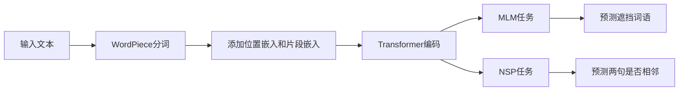

# 上下文学习 (Contextual Learning) 原理与代码实例讲解

关键词：上下文学习、表示学习、自然语言处理、Transformer、BERT、GPT、ELMo、知识蒸馏

## 1. 背景介绍
### 1.1 问题的由来
随着人工智能技术的快速发展,自然语言处理(NLP)领域取得了长足的进步。传统的NLP方法主要基于词袋模型,将文本看作是词语的无序集合,忽略了词语之间的顺序关系和上下文信息。这种方法虽然简单高效,但无法准确刻画语言的语义。为了克服这一局限性,研究者们提出了上下文学习(Contextual Learning)的思想,旨在通过学习词语所处的上下文信息来获取更加准确的语义表示。

### 1.2 研究现状
近年来,上下文学习受到了学术界和工业界的广泛关注,涌现出许多优秀的模型和方法。其中,基于Transformer架构的预训练语言模型如BERT、GPT、XLNet等,通过在大规模无标注语料上进行自监督学习,可以获得强大的上下文编码能力,在多项NLP任务上取得了突破性进展。此外,ELMo、ULMFiT等模型通过在特定领域数据上进行微调,也展现出了优异的性能。

### 1.3 研究意义
上下文学习有助于提升NLP系统的语义理解和生成能力,具有重要的理论和应用价值。一方面,上下文学习为探索语言的本质规律提供了新的视角,加深了我们对语言认知机制的认识。另一方面,上下文学习所构建的语义表示可以应用于机器翻译、对话系统、信息检索等领域,提升相关系统的性能,产生显著的经济和社会效益。

### 1.4 本文结构
本文将全面介绍上下文学习的原理和方法。第2部分阐述上下文学习的核心概念;第3部分讲解其算法原理和操作步骤;第4部分从数学角度对上下文学习进行建模和推导;第5部分通过代码实例演示如何实现上下文学习;第6部分分析其实际应用场景;第7部分推荐相关工具和资源;第8部分总结全文,展望未来发展方向。

## 2. 核心概念与联系
上下文学习的核心思想是利用词语所处的上下文信息来学习词语的语义表示。与传统的词袋模型不同,上下文学习考虑了词序关系,通过词语与其上下文之间的交互建模,可以获得更加准确和丰富的语义表示。常见的上下文学习范式包括:

1. CBOW(Continuous Bag-of-Words):通过目标词的上下文来预测目标词,代表模型有word2vec。

2. Skip-Gram:与CBOW相反,通过目标词来预测其上下文,也是word2vec的一种变体。

3. Masked Language Model:随机遮挡部分词语,通过上下文来预测被遮挡词语,代表模型有BERT。

4. Next Sentence Prediction:预测两个句子是否相邻,可以捕捉句子级别的上下文信息。

5. Permutation Language Model:对句子进行随机排列,通过排列后的句子来预测原始句子,代表模型有XLNet。

上下文学习与表示学习密切相关。表示学习旨在学习数据的低维连续表示,上下文学习可以看作是一种特殊的表示学习,其目标是学习词语在给定上下文下的语义表示。此外,上下文学习也与迁移学习、知识蒸馏等技术有所联系,可以将预训练模型的上下文编码能力迁移到下游任务,或通过蒸馏的方式压缩模型。

## 3. 核心算法原理 & 具体操作步骤
### 3.1 算法原理概述
上下文学习的核心是通过构建目标函数,优化词语的上下文表示,从而得到携带丰富语义信息的词向量。以CBOW为例,其目标是最大化目标词在给定上下文下的条件概率:

$\arg\max_\theta \prod_{w \in \mathcal{D}} P(w | context(w); \theta)$

其中$w$为目标词,$context(w)$为目标词的上下文,$\theta$为模型参数。通过最大化该目标函数,可以学习到上下文相关的词向量表示。

### 3.2 算法步骤详解
上下文学习的一般步骤如下:

1. 语料预处理:对原始文本进行分词、去除停用词、低频词等预处理操作。

2. 构建训练样本:根据上下文窗口大小,从语料中采样得到形如(目标词,上下文)的训练样本。

3. 定义模型架构:设计编码目标词和上下文的神经网络,常见的有CBOW、Skip-Gram、Transformer等。

4. 设置优化目标:定义损失函数,通常基于最大似然估计,最小化负对数似然。

5. 模型训练:利用随机梯度下降等优化算法,迭代更新模型参数,直至收敛。

6. 得到词向量:将训练得到的词向量保存,用于后续的下游任务。

以BERT为例,其采用Masked Language Model和Next Sentence Prediction两个任务联合训练。对于MLM,随机遮挡部分词语,通过Transformer编码器结构建模上下文,预测被遮挡词语。对于NSP,将两个句子拼接,通过特殊标记[CLS]的输出判断两句是否相邻。具体流程如下:

### 3.3 算法优缺点
上下文学习的优点在于:
1. 相比传统词袋模型,上下文学习考虑了词序信息,可以获得更准确的语义表示。
2. 通过在大规模语料上预训练,上下文学习可以学习到语言的普适规律,具有较强的迁移能力。
3. 上下文编码器可以灵活选取,适应不同的任务需求。

其缺点包括:
1. 对训练数据和计算资源要求较高,模型训练耗时长。
2. 模型参数量大,推理速度慢,不利于实时应用。
3. 仍难以突破语言理解的瓶颈,在一些推理、常识等任务上表现不佳。

### 3.4 算法应用领域
上下文学习在NLP领域得到了广泛应用,主要包括:
1. 语言建模:通过上下文预测下一个词语,评估句子的流畅程度。
2. 机器翻译:将上下文编码器作为翻译模型的特征提取器,提升翻译质量。
3. 命名实体识别:通过上下文信息识别文本中的实体类型。
4. 关系抽取:通过上下文建模实体之间的语义关系。
5. 文本分类:将篇章级别的上下文编码用于文本分类。
6. 问答系统:通过上下文匹配问题和答案,提高问答准确率。

除此之外,上下文学习还被用于情感分析、文本摘要、对话生成等任务,具有广阔的应用前景。

## 4. 数学模型和公式 & 详细讲解 & 举例说明
### 4.1 数学模型构建
以CBOW为例,假设词表大小为$V$,词向量维度为$d$,上下文窗口大小为$c$。定义以下符号:

- $w_i$:目标词,$w_i \in \mathbb{R}^d$
- $\mathbf{w}_{i-c},\dots,\mathbf{w}_{i-1},\mathbf{w}_{i+1}, \dots, \mathbf{w}_{i+c}$:上下文词向量
- $\mathbf{W} \in \mathbb{R}^{V \times d}$:词向量矩阵
- $\mathbf{W}' \in \mathbb{R}^{d \times V}$:输出矩阵
- $\mathbf{x} \in \mathbb{R}^V$:one-hot向量,表示目标词
- $\mathbf{y} \in \mathbb{R}^V$:模型输出,表示目标词的概率分布

CBOW的数学模型为:

$$\mathbf{h} = \frac{1}{2c}\mathbf{W}^\top(\mathbf{w}_{i-c} + \dots + \mathbf{w}_{i-1} + \mathbf{w}_{i+1} + \dots + \mathbf{w}_{i+c})$$

$$\mathbf{y} = \text{softmax}(\mathbf{W}'\mathbf{h})$$

其中$\mathbf{h} \in \mathbb{R}^d$为上下文词向量的平均,$\text{softmax}(\cdot)$为softmax函数,用于将输出转化为概率分布。

### 4.2 公式推导过程
CBOW的目标是最大化目标词在给定上下文下的条件概率:

$$\arg\max_\theta \prod_{w \in \mathcal{D}} P(w | context(w); \theta)$$

等价于最小化负对数似然:

$$\mathcal{L}(\theta) = -\sum_{w \in \mathcal{D}} \log P(w | context(w); \theta)$$

将$P(w | context(w); \theta)$展开:

$$P(w | context(w); \theta) = \frac{\exp(\mathbf{w}^\top \mathbf{h})}{\sum_{w' \in \mathcal{V}} \exp(\mathbf{w'}^\top \mathbf{h})}$$

其中$\mathbf{h}$为上下文词向量的平均。代入负对数似然:

$$\mathcal{L}(\theta) = -\sum_{w \in \mathcal{D}} \left(\mathbf{w}^\top \mathbf{h} - \log\sum_{w' \in \mathcal{V}} \exp(\mathbf{w'}^\top \mathbf{h})\right)$$

通过随机梯度下降优化上式,即可得到CBOW模型的解。

### 4.3 案例分析与讲解
下面以一个简单的例子说明CBOW的训练过程。假设词表为{我,喜欢,吃,苹果,香蕉},词向量维度为3,上下文窗口大小为2。给定句子"我 喜欢 吃 苹果",以"吃"为目标词,其上下文为{喜欢,苹果}。

首先,随机初始化词向量矩阵$\mathbf{W}$和输出矩阵$\mathbf{W}'$。然后,根据上下文词向量计算平均值$\mathbf{h}$:

$$\mathbf{h} = \frac{1}{2}(\mathbf{w}_{\text{喜欢}} + \mathbf{w}_{\text{苹果}})$$

接着,通过softmax计算目标词的概率分布$\mathbf{y}$:

$$\mathbf{y} = \text{softmax}(\mathbf{W}'\mathbf{h})$$

根据目标词的真实标签,计算损失函数:

$$\mathcal{L}(\theta) = -\log P(\text{吃} | \text{喜欢},\text{苹果}; \theta)$$

最后,通过梯度反向传播更新参数$\mathbf{W}$和$\mathbf{W}'$,直至收敛。

### 4.4 常见问题解答
Q: CBOW和Skip-Gram有何区别?

A: 两者的区别在于预测方向不同。CBOW通过上下文预测目标词,而Skip-Gram通过目标词预测上下文。Skip-Gram更适合学习低频词和短语的语义表示。

Q: 如何加速上下文学习的训练过程?

A: 可以采用负采样(Negative Sampling)和层序softmax(Hierarchical Softmax)等技巧,通过采样或构建二叉树的方式降低计算复杂度。此外,使用GPU并行计算也可以显著提升训练速度。

Q: 上下文学习能否处理未登录词?

A: 传统的上下文学习方法无法直接处理未登录词。但是,可以通过字符级别的建模或引入子词信息(如WordPiece、BPE)等方式,在一定程度上缓解未登录词问题。一些预训练模型如BERT,可以动态地根据上下文表示未登录词。

## 5. 项目实践：代码实例和详细解释说明
### 5.1 开发环境搭建
上下文学习的实现