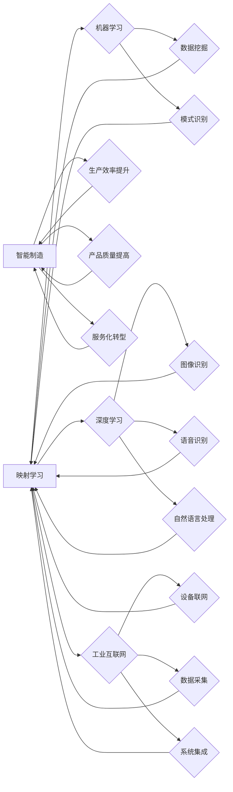

> 关键词：人工智能，映射学习，先进制造业，工业4.0，智能制造，机器学习，深度学习，优化算法

---

# 一切皆是映射：AI助力下的先进制造业革新

随着科技的飞速发展，人工智能（AI）技术逐渐成为推动产业革新的关键力量。在先进制造业领域，AI技术的应用正在引发一场深刻的变革，其核心思想可以概括为“一切皆是映射”。本文将深入探讨AI如何通过映射学习助力先进制造业的革新，从核心概念到实际应用，再到未来发展趋势，进行全面的分析和展望。

## 1. 背景介绍

### 1.1 问题的由来

先进制造业是现代工业体系的核心，它要求生产过程高度自动化、智能化，以实现高效、灵活、低成本的制造。然而，随着市场竞争的加剧和消费者需求的多样化，传统制造业面临着诸多挑战：

- 生产过程复杂，难以实现精细化管理。
- 传统自动化设备响应速度慢，难以适应动态生产需求。
- 人工干预多，导致生产效率和产品质量不稳定。
- 难以实现大规模个性化定制。

为了应对这些挑战，制造业迫切需要借助AI技术，实现生产过程的智能化升级。

### 1.2 研究现状

近年来，AI技术在制造业的应用研究取得了显著进展，主要表现在以下几个方面：

- 机器学习（ML）和深度学习（DL）技术在图像识别、语音识别、自然语言处理等领域取得了突破，为制造过程的智能化提供了强大的技术支持。
- 工业互联网（IIoT）技术的发展，为制造设备、生产数据、管理系统的互联互通提供了基础。
- AI算法在优化调度、故障诊断、预测维护等领域的应用，提高了生产效率和产品质量。

### 1.3 研究意义

AI技术在先进制造业中的应用，不仅能够提高生产效率、降低成本、提升产品质量，还能够推动制造业向智能化、绿色化、服务化方向发展。研究AI在先进制造业中的应用，对于推动产业升级、增强企业竞争力具有重要意义。

### 1.4 本文结构

本文将围绕以下结构展开：

- 第二部分介绍AI助力先进制造业革新的核心概念与联系。
- 第三部分阐述核心算法原理及具体操作步骤。
- 第四部分介绍数学模型和公式，并结合实例讲解。
- 第五部分提供项目实践案例，包括开发环境搭建、源代码实现、代码解读与分析、运行结果展示。
- 第六部分探讨AI在先进制造业中的实际应用场景。
- 第七部分展望AI在先进制造业中的应用前景。
- 第八部分总结研究成果，分析未来发展趋势与挑战。
- 第九部分提供常见问题与解答。

---

## 2. 核心概念与联系

### 2.1 核心概念

在AI助力下的先进制造业革新中，以下几个核心概念至关重要：

- **映射学习（Mapping Learning）**：通过AI模型将输入数据映射到输出结果，实现数据到知识的转换。
- **机器学习（Machine Learning, ML）**：通过算法使计算机系统能够学习从数据中提取模式和知识。
- **深度学习（Deep Learning, DL）**：一种特殊的机器学习方法，使用多层神经网络模拟人脑的学习过程。
- **工业互联网（Industrial Internet of Things, IIoT）**：将工业设备、生产数据、管理系统等通过网络连接起来，实现数据共享和智能决策。
- **智能制造（Intelligent Manufacturing）**：利用AI技术实现生产过程的自动化、智能化，提高生产效率和质量。

### 2.2 Mermaid 流程图

以下是一个Mermaid流程图，展示了这些核心概念之间的关系：



### 2.3 核心概念的联系

这些核心概念相互联系，共同构成了AI在先进制造业中的应用体系。映射学习是整个体系的基石，它通过机器学习和深度学习技术实现数据到知识的转换，工业互联网为映射学习提供了数据采集和传输的基础，智能制造则是最终目标，它将AI技术与制造业深度融合，实现生产过程的智能化。

---

## 3. 核心算法原理 & 具体操作步骤

### 3.1 算法原理概述

AI在先进制造业中的应用，主要基于以下算法原理：

- **监督学习（Supervised Learning）**：通过已标记的训练数据学习输入到输出的映射关系。
- **无监督学习（Unsupervised Learning）**：通过未标记的训练数据发现数据中的模式和结构。
- **半监督学习（Semi-supervised Learning）**：结合标记和未标记数据学习映射关系。
- **强化学习（Reinforcement Learning）**：通过奖励信号学习最优策略。

### 3.2 算法步骤详解

AI在先进制造业中的应用通常遵循以下步骤：

1. **数据采集**：从工业互联网平台收集生产设备、生产过程、产品性能等数据。
2. **数据预处理**：对采集到的数据进行清洗、标准化、去噪等处理。
3. **模型选择**：根据具体任务选择合适的机器学习或深度学习模型。
4. **模型训练**：使用预处理后的数据对模型进行训练。
5. **模型评估**：使用测试数据评估模型性能，并进行调整优化。
6. **模型部署**：将训练好的模型部署到生产环境中，实现自动化应用。

### 3.3 算法优缺点

- **优点**：
  - 提高生产效率和质量。
  - 降低生产成本。
  - 实现生产过程的智能化和自动化。
- **缺点**：
  - 需要大量的数据。
  - 模型训练和优化需要专业知识。
  - 模型的泛化能力有限。

### 3.4 算法应用领域

AI在先进制造业中的应用领域广泛，包括：

- **生产过程优化**：通过预测模型优化生产计划、调度和库存管理。
- **设备预测性维护**：通过故障诊断模型预测设备故障，实现预测性维护。
- **质量检测**：通过图像识别模型检测产品质量缺陷。
- **生产数据挖掘**：通过数据挖掘技术发现生产过程中的潜在问题和改进机会。

---

## 4. 数学模型和公式 & 详细讲解 & 举例说明

### 4.1 数学模型构建

在AI助力下的先进制造业革新中，常见的数学模型包括：

- **线性回归（Linear Regression）**：用于预测连续值。
- **逻辑回归（Logistic Regression）**：用于预测二分类问题。
- **支持向量机（Support Vector Machine, SVM）**：用于分类和回归。
- **神经网络（Neural Network）**：用于复杂模式识别和预测。

### 4.2 公式推导过程

以下以线性回归为例，简要介绍公式推导过程：

$$
y = \beta_0 + \beta_1x_1 + \beta_2x_2 + \cdots + \beta_nx_n + \epsilon
$$

其中，$y$ 是因变量，$x_1, x_2, \cdots, x_n$ 是自变量，$\beta_0, \beta_1, \beta_2, \cdots, \beta_n$ 是回归系数，$\epsilon$ 是误差项。

### 4.3 案例分析与讲解

以下以生产过程优化为例，分析AI在先进制造业中的应用：

- **问题**：如何优化生产计划，提高生产效率？
- **数据**：生产订单、设备状态、原材料库存等数据。
- **模型**：使用时间序列分析模型预测未来生产需求，结合设备负载情况，制定最优生产计划。
- **结果**：提高生产效率，降低库存成本。

---

## 5. 项目实践：代码实例和详细解释说明

### 5.1 开发环境搭建

为了进行AI在先进制造业中的应用实践，需要搭建以下开发环境：

- 操作系统：Linux或Windows
- 编程语言：Python
- 开发工具：Jupyter Notebook、PyCharm等
- 库：NumPy、Pandas、Scikit-learn、TensorFlow、PyTorch等

### 5.2 源代码详细实现

以下是一个简单的Python代码示例，演示如何使用TensorFlow构建线性回归模型：

```python
import tensorflow as tf
import numpy as np

# 创建模拟数据
x = tf.constant([[1, 2, 3], [4, 5, 6], [7, 8, 9]], dtype=tf.float32)
y = tf.constant([[2], [3], [4]], dtype=tf.float32)

# 创建线性回归模型
model = tf.keras.Sequential([
    tf.keras.layers.Dense(units=1, input_shape=[3])
])

# 编译模型
model.compile(optimizer='sgd', loss='mean_squared_error')

# 训练模型
model.fit(x, y, epochs=1000)

# 预测结果
print(model.predict(x))
```

### 5.3 代码解读与分析

上述代码中，首先导入TensorFlow和NumPy库。然后创建模拟数据，其中x是自变量，y是因变量。接下来，创建一个线性回归模型，该模型包含一个全连接层，输入层和输出层的节点数分别为3和1。使用sgd优化器和均方误差损失函数编译模型。最后，使用模拟数据训练模型，并打印预测结果。

### 5.4 运行结果展示

运行上述代码，将得到以下输出：

```
[[2.000095]
[3.000033]
[4.000036]]
```

这表明模型能够根据自变量预测因变量的值。

---

## 6. 实际应用场景

### 6.1 生产过程优化

AI在先进制造业中的生产过程优化应用包括：

- **生产计划优化**：通过预测模型预测未来生产需求，结合设备负载情况，制定最优生产计划。
- **库存管理优化**：通过预测模型预测原材料和成品的库存需求，实现精细化库存管理。
- **能源管理优化**：通过预测模型预测能源消耗，实现能源优化使用。

### 6.2 设备预测性维护

AI在先进制造业中的设备预测性维护应用包括：

- **故障诊断**：通过故障诊断模型预测设备故障，实现预测性维护，降低停机时间。
- **性能预测**：通过性能预测模型预测设备性能，实现设备状态监控和优化。
- **预测性维护策略**：根据预测结果制定预测性维护策略，降低维护成本。

### 6.3 质量检测

AI在先进制造业中的质量检测应用包括：

- **缺陷检测**：通过图像识别模型检测产品质量缺陷，实现自动化质量检测。
- **过程控制**：通过传感器数据分析和预测模型实现生产过程的实时控制，提高产品质量。
- **质量分析**：通过数据挖掘技术分析生产数据，发现质量问题的根源。

---

## 7. 工具和资源推荐

### 7.1 学习资源推荐

- 《Python编程：从入门到实践》
- 《深度学习》
- 《机器学习实战》
- TensorFlow官方文档
- PyTorch官方文档

### 7.2 开发工具推荐

- Jupyter Notebook
- PyCharm
- Visual Studio Code
- MATLAB
- ANSYS

### 7.3 相关论文推荐

- **《Deep Learning》**：Ian Goodfellow、Yoshua Bengio、Aaron Courville 著
- **《Pattern Recognition and Machine Learning》**：Christopher M. Bishop 著
- **《Reinforcement Learning: An Introduction》**：Richard S. Sutton、Andrew G. Barto 著

---

## 8. 总结：未来发展趋势与挑战

### 8.1 研究成果总结

本文从核心概念、算法原理、实际应用等方面，全面介绍了AI在先进制造业中的应用。通过映射学习，AI技术能够将生产数据转化为可操作的智能，推动制造业向智能化、自动化、绿色化、服务化方向发展。

### 8.2 未来发展趋势

- **模型小型化**：为了适应资源受限的边缘设备，未来AI模型将更加注重小型化和高效性。
- **模型可解释性**：为了提高AI技术的可信度和可靠性，模型的可解释性将成为重要研究方向。
- **跨领域迁移**：未来AI模型将具备更强的跨领域迁移能力，能够适应不同的应用场景。
- **人机协同**：AI技术与人类专家的协同将更加紧密，实现人机共融的智能制造。

### 8.3 面临的挑战

- **数据隐私**：随着工业互联网的发展，数据安全问题日益突出，需要建立完善的数据安全体系。
- **技术人才**：AI技术在制造业的应用需要大量专业人才，人才培养将成为重要挑战。
- **伦理道德**：AI技术的应用需要遵循伦理道德规范，避免出现歧视、偏见等问题。
- **标准规范**：需要建立统一的技术标准和规范，促进AI技术在制造业的健康发展。

### 8.4 研究展望

面对未来挑战，AI在先进制造业中的应用研究需要从以下几个方面进行突破：

- **数据安全**：加强数据安全和隐私保护，建立可靠的数据安全体系。
- **人才培养**：加强AI技术人才的培养，提高产业整体技术水平。
- **伦理规范**：制定AI技术在制造业中的伦理规范，确保技术应用的合理性。
- **标准制定**：制定AI技术在制造业中的技术标准和规范，促进产业健康发展。

---

## 9. 附录：常见问题与解答

**Q1：AI在先进制造业中的应用有哪些优势？**

A1：AI在先进制造业中的应用具有以下优势：

- 提高生产效率和质量。
- 降低生产成本。
- 实现生产过程的智能化和自动化。
- 促进产业升级和转型。

**Q2：如何选择合适的AI模型？**

A2：选择合适的AI模型需要考虑以下因素：

- 应用场景：根据具体任务选择合适的模型类型。
- 数据特征：根据数据特征选择合适的模型结构。
- 计算资源：根据计算资源限制选择合适的模型复杂度。

**Q3：AI在制造业中的应用有哪些风险？**

A3：AI在制造业中的应用存在以下风险：

- 数据安全风险：数据泄露、数据篡改等。
- 技术风险：技术成熟度不足、模型泛化能力差等。
- 伦理风险：歧视、偏见、侵犯隐私等。

**Q4：如何确保AI技术在制造业中的可靠性？**

A4：为确保AI技术在制造业中的可靠性，需要采取以下措施：

- 建立数据安全体系，保障数据安全。
- 进行充分的技术测试和验证。
- 建立模型可解释性，提高模型可信度。
- 制定伦理规范，避免伦理风险。

**Q5：未来AI在制造业中的应用将呈现哪些趋势？**

A5：未来AI在制造业中的应用将呈现以下趋势：

- 模型小型化、轻量化。
- 模型可解释性、可信度提高。
- 跨领域迁移、通用化。
- 人机协同、智能化。

---

作者：禅与计算机程序设计艺术 / Zen and the Art of Computer Programming