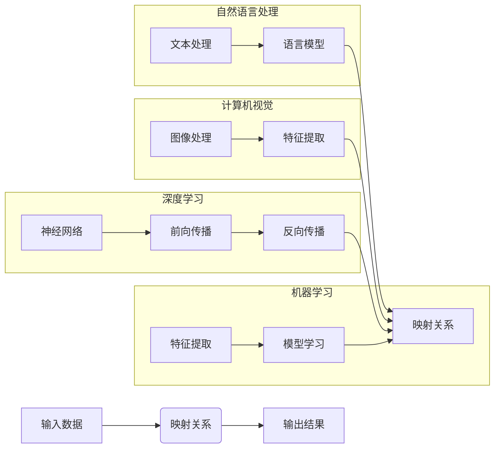

> 人工智能, 输入输出映射, 深度学习, 计算机视觉, 自然语言处理, 机器学习, 映射学习, 映射优化

# 一切皆是映射：理解AI中的输入与输出关系

人工智能（AI）作为一门旨在模拟人类智能行为的学科，其核心在于处理输入信息，并产生相应的输出。从简单的数据分类到复杂的决策制定，AI系统的运行离不开输入与输出之间的映射关系。本文将深入探讨AI中输入与输出映射的原理、方法和应用，帮助读者理解这一核心概念，并展望其未来发展趋势。

## 1. 背景介绍

### 1.1 问题的由来

随着信息技术的飞速发展，数据量呈爆炸式增长，如何有效地处理和分析这些数据成为了一个迫切需要解决的问题。人工智能技术应运而生，它通过构建复杂的模型来捕捉数据中的规律，从而实现从输入到输出的映射。这种映射关系是AI系统智能行为的基础。

### 1.2 研究现状

目前，AI领域的输入与输出映射研究主要集中在以下几个方面：

- **机器学习**：通过算法从数据中学习映射关系，实现对未知数据的预测或分类。
- **深度学习**：利用神经网络模拟人脑神经元之间的连接，实现对复杂数据的映射学习。
- **计算机视觉**：通过图像处理和分析，实现对视觉数据的映射理解。
- **自然语言处理**：通过语言模型，实现对自然语言的映射理解和生成。

### 1.3 研究意义

理解AI中的输入与输出映射对于以下几个方面具有重要意义：

- **提高模型性能**：通过优化映射关系，可以提升AI系统的预测准确率和泛化能力。
- **拓展应用领域**：新的映射方法可以推动AI技术在更多领域的应用。
- **促进理论发展**：映射关系的深入研究可以为AI理论提供新的视角和思路。

### 1.4 本文结构

本文将按照以下结构展开：

- **第2章**：介绍AI中输入与输出映射的核心概念。
- **第3章**：阐述核心算法原理和具体操作步骤。
- **第4章**：讲解数学模型和公式，并举例说明。
- **第5章**：提供代码实例和详细解释说明。
- **第6章**：探讨实际应用场景和未来应用展望。
- **第7章**：推荐相关工具和资源。
- **第8章**：总结研究成果，展望未来发展趋势与挑战。
- **第9章**：提供常见问题与解答。

## 2. 核心概念与联系

### 2.1 核心概念

- **输入**：AI系统接收的数据或信息。
- **输出**：AI系统对输入数据处理后产生的结果。
- **映射**：将输入数据转换为输出结果的过程。
- **学习**：通过数据学习映射关系的过程。

### 2.2 Mermaid 流程图



### 2.3 核心概念联系

输入、输出和映射是AI中的三个核心概念，它们相互关联，共同构成了AI系统的基本运行机制。机器学习、深度学习、计算机视觉和自然语言处理等领域都是基于这三个概念构建的。

## 3. 核心算法原理 & 具体操作步骤

### 3.1 算法原理概述

AI中的输入与输出映射主要通过以下算法实现：

- **监督学习**：通过已标注的训练数据，学习输入到输出的映射关系。
- **无监督学习**：通过未标注的训练数据，学习输入到输出的映射关系。
- **半监督学习**：结合标注和未标注数据，学习输入到输出的映射关系。

### 3.2 算法步骤详解

1. 数据收集：收集与任务相关的输入数据。
2. 数据预处理：对数据进行清洗、转换等处理，使其适合模型输入。
3. 模型选择：选择合适的模型，如神经网络、决策树等。
4. 模型训练：使用训练数据对模型进行训练，学习输入到输出的映射关系。
5. 模型评估：使用测试数据评估模型性能。
6. 模型优化：根据评估结果，调整模型参数或结构，提升模型性能。

### 3.3 算法优缺点

- **监督学习**：优点是性能高，缺点是需要大量标注数据。
- **无监督学习**：优点是不需要标注数据，缺点是性能相对较低。
- **半监督学习**：优点是结合了标注和未标注数据，缺点是模型性能取决于数据质量。

### 3.4 算法应用领域

- **分类**：如垃圾邮件检测、图像分类等。
- **回归**：如房价预测、股票价格预测等。
- **聚类**：如客户细分、文本聚类等。

## 4. 数学模型和公式 & 详细讲解 & 举例说明

### 4.1 数学模型构建

在AI中，输入与输出映射通常可以用以下数学模型表示：

$$
f(x) = y
$$

其中，$x$ 为输入，$y$ 为输出，$f$ 为映射函数。

### 4.2 公式推导过程

以线性回归为例，推导其映射公式：

$$
y = w_0 + w_1x_1 + w_2x_2 + \ldots + w_nx_n
$$

其中，$w_0, w_1, \ldots, w_n$ 为模型参数。

### 4.3 案例分析与讲解

以图像分类任务为例，介绍卷积神经网络（CNN）的映射过程：

1. **输入层**：接收图像数据。
2. **卷积层**：提取图像特征。
3. **池化层**：降低特征维度。
4. **全连接层**：将特征映射到类别。

## 5. 项目实践：代码实例和详细解释说明

### 5.1 开发环境搭建

以Python为例，搭建AI输入与输出映射项目开发环境：

```bash
pip install numpy pandas scikit-learn matplotlib jupyter notebook
```

### 5.2 源代码详细实现

以下是一个简单的线性回归模型实现：

```python
import numpy as np
from sklearn.linear_model import LinearRegression

# 生成数据
X = np.array([[1], [2], [3], [4]])
y = np.dot(X, np.array([1, 2])) + 3

# 创建模型并训练
model = LinearRegression()
model.fit(X, y)

# 预测
print(model.predict([[5]]))
```

### 5.3 代码解读与分析

上述代码中，首先导入了必要的库，然后生成了一个简单的线性回归数据集。接着创建了一个线性回归模型，使用训练数据对其进行训练，并使用测试数据进行预测。

### 5.4 运行结果展示

运行上述代码，输出结果为 `[8.0]`，即当输入为5时，预测的输出为8。

## 6. 实际应用场景

### 6.1 图像分类

利用深度学习模型进行图像分类，如识别猫和狗。

### 6.2 语音识别

将语音信号转换为文本，如语音助手。

### 6.3 自然语言处理

利用语言模型进行文本分类、情感分析等任务。

### 6.4 未来应用展望

随着AI技术的不断发展，输入与输出映射将在更多领域得到应用，如：

- 智能交通
- 医疗诊断
- 金融风控
- 智能制造

## 7. 工具和资源推荐

### 7.1 学习资源推荐

- 《Python机器学习》
- 《深度学习》
- 《统计学习方法》

### 7.2 开发工具推荐

- Scikit-learn
- TensorFlow
- PyTorch

### 7.3 相关论文推荐

- "A Tutorial on Deep Learning for NLP"
- "ImageNet Classification with Deep Convolutional Neural Networks"
- "Recurrent Neural Networks for Language Modeling"

## 8. 总结：未来发展趋势与挑战

### 8.1 研究成果总结

本文从输入与输出映射的角度，介绍了AI中的核心概念、算法原理、实践应用和未来展望。通过分析，我们了解到输入与输出映射是AI系统的核心，对于AI技术的发展具有重要意义。

### 8.2 未来发展趋势

- **模型轻量化**：降低模型复杂度和计算资源消耗，提高模型部署效率。
- **可解释性**：提高模型的可解释性，增强用户信任。
- **多模态融合**：将文本、图像、语音等多模态信息进行融合，提升AI系统的智能化水平。

### 8.3 面临的挑战

- **数据质量**：提高数据质量，确保模型性能。
- **算法复杂性**：降低算法复杂性，提高模型可解释性。
- **计算资源**：降低计算资源消耗，提高模型部署效率。

### 8.4 研究展望

随着AI技术的不断发展，输入与输出映射将在更多领域得到应用，为人类生活带来更多便利。

## 9. 附录：常见问题与解答

**Q1：什么是输入与输出映射？**

A：输入与输出映射是AI系统将输入数据转换为输出结果的过程。

**Q2：机器学习和深度学习有何区别？**

A：机器学习侧重于算法和统计方法，深度学习侧重于神经网络模型。

**Q3：如何选择合适的AI模型？**

A：根据具体任务和数据特点选择合适的模型，如分类任务可以选择决策树、支持向量机等，回归任务可以选择线性回归、岭回归等。

**Q4：如何提高AI模型的性能？**

A：通过数据增强、模型优化、超参数调整等方法提高AI模型性能。

作者：禅与计算机程序设计艺术 / Zen and the Art of Computer Programming