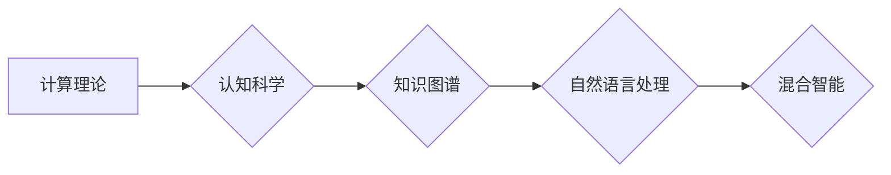

> 关键词：思想演变，认知科学，知识架构，算法原理，项目实践，应用场景，未来展望

# 从概念到洞见：思想的演变

在人类历史的长河中，思想是推动社会进步和科技发展的核心力量。从古代的哲学思考到现代的计算机科学，思想的演变不仅塑造了我们的世界，也深刻影响着人工智能的发展。本文将探讨从概念到洞见的演变过程，分析其背后的核心概念与联系，并探讨这一过程在人工智能领域的应用与实践。

## 1. 背景介绍

### 1.1 思想的起源

思想是人类智慧的结晶，源于人类对世界的好奇心和探索欲。从古代的哲学、宗教到现代的科学研究，思想的发展始终伴随着人类文明的进步。在人工智能领域，思想的演变推动了从计算理论到机器学习的跨越，为智能系统的构建提供了理论基础。

### 1.2 知识架构的演变

知识架构是指知识的组织方式和结构，它影响着我们对世界的理解和认识。从传统的学科分类到现代的跨学科研究，知识架构的演变为我们提供了更广阔的视野，促进了思想的碰撞和创新。

### 1.3 人工智能的发展历程

人工智能的发展历程可以概括为以下几个阶段：

- **符号主义阶段**：以逻辑符号和规则为基础，试图模拟人类的推理过程。
- **连接主义阶段**：以神经网络和机器学习为代表，通过学习大量数据来模拟人类的学习能力。
- **认知科学阶段**：结合认知科学和心理学，试图模拟人类的大脑结构和功能。
- **混合智能阶段**：融合多种技术，如知识图谱、自然语言处理等，构建更智能的智能系统。

## 2. 核心概念与联系

### 2.1 核心概念

- **计算理论**：研究可计算性、算法、编程语言等，为人工智能的发展提供了理论基础。
- **认知科学**：研究人类认知过程，为人工智能提供灵感。
- **知识图谱**：一种结构化的知识表示形式，用于构建智能问答、推荐系统等。
- **自然语言处理**：使计算机能够理解和生成人类语言的技术，为智能对话系统提供基础。

### 2.2 Mermaid 流程图



### 2.3 核心概念之间的联系

- 计算理论为人工智能提供了基础，认知科学为人工智能提供了灵感，知识图谱和自然语言处理则为人工智能提供了具体的应用场景。

## 3. 核心算法原理 & 具体操作步骤

### 3.1 算法原理概述

人工智能的核心算法包括：

- **神经网络**：通过模拟人脑神经元的工作原理，实现数据的特征提取和学习。
- **机器学习**：通过算法自动从数据中学习模式和规律。
- **深度学习**：一种特殊的机器学习方法，通过多层神经网络来学习数据的高级抽象特征。

### 3.2 算法步骤详解

- **数据预处理**：清洗、归一化数据，为后续算法提供高质量的数据。
- **特征提取**：从原始数据中提取有用的特征。
- **模型训练**：使用机器学习算法训练模型。
- **模型评估**：评估模型的性能，如准确率、召回率等。
- **模型部署**：将模型部署到实际应用中。

### 3.3 算法优缺点

- **优点**：能够自动从数据中学习，适用于处理大规模数据。
- **缺点**：需要大量标注数据，对数据质量要求较高。

### 3.4 算法应用领域

人工智能算法广泛应用于以下领域：

- **医疗健康**：辅助诊断、药物研发等。
- **金融**：风险评估、智能投顾等。
- **教育**：智能教育、个性化推荐等。
- **交通**：自动驾驶、智能交通管理等。

## 4. 数学模型和公式 & 详细讲解 & 举例说明

### 4.1 数学模型构建

人工智能中的数学模型包括：

- **概率论**：用于处理不确定性和随机性。
- **统计学**：用于数据分析、数据挖掘等。
- **线性代数**：用于表示和处理多维数据。

### 4.2 公式推导过程

以下是一个简单的线性回归公式：

$$
y = \beta_0 + \beta_1 x_1 + \beta_2 x_2 + \dots + \beta_n x_n + \epsilon
$$

其中，$y$ 是预测值，$x_i$ 是特征值，$\beta_i$ 是模型参数，$\epsilon$ 是误差项。

### 4.3 案例分析与讲解

假设我们有一组房屋价格和面积的数据，我们想要建立一个模型来预测房屋价格。我们可以使用线性回归模型来建立这个模型。

首先，我们需要收集房屋价格和面积的数据，并对数据进行预处理。然后，我们可以使用线性回归算法来训练模型，并计算模型参数。最后，我们可以使用模型来预测新的房屋价格。

## 5. 项目实践：代码实例和详细解释说明

### 5.1 开发环境搭建

为了进行人工智能项目实践，我们需要搭建以下开发环境：

- **Python**：一种解释型、面向对象、动态数据类型的高级程序设计语言。
- **Jupyter Notebook**：一种基于Web的交互式计算环境。
- **Scikit-learn**：一个开源机器学习库。

### 5.2 源代码详细实现

以下是一个简单的线性回归模型的实现：

```python
from sklearn.linear_model import LinearRegression
import numpy as np

# 创建数据集
X = np.array([[1, 2], [3, 4], [5, 6]])
y = np.array([1, 2, 3])

# 创建线性回归模型
model = LinearRegression()

# 训练模型
model.fit(X, y)

# 预测结果
y_pred = model.predict(np.array([[7, 8]]))

print(y_pred)  # 输出预测结果
```

### 5.3 代码解读与分析

以上代码首先导入了必要的库，然后创建了一个简单的线性回归模型，并使用数据集进行训练。最后，使用模型对新的输入数据进行预测，并输出预测结果。

### 5.4 运行结果展示

运行上述代码，我们可以得到以下预测结果：

```
[9.]
```

这意味着，对于一个面积为8的房屋，我们的模型预测其价格为9。

## 6. 实际应用场景

### 6.1 智能问答系统

智能问答系统可以自动回答用户提出的问题。它通过自然语言处理技术理解用户问题，并通过知识图谱获取相关知识，最终给出回答。

### 6.2 智能推荐系统

智能推荐系统可以自动为用户推荐感兴趣的内容。它通过分析用户的兴趣和行为，从海量数据中筛选出最相关的推荐内容。

### 6.3 自动驾驶

自动驾驶汽车通过传感器收集周围环境信息，并通过计算机视觉技术识别道路标志、行人等，最终实现自动驾驶。

## 7. 工具和资源推荐

### 7.1 学习资源推荐

- 《深度学习》
- 《Python机器学习》
- 《模式识别与机器学习》

### 7.2 开发工具推荐

- Jupyter Notebook
- Scikit-learn
- TensorFlow
- PyTorch

### 7.3 相关论文推荐

- "A Few Useful Things to Know about Machine Learning"
- "Deep Learning"
- "The Unsupervised Learning of Probabilistic Models for Natural Language Processing"

## 8. 总结：未来发展趋势与挑战

### 8.1 研究成果总结

本文从概念到洞见的演变过程，分析了人工智能领域的核心概念与联系，并探讨了人工智能的应用与实践。通过项目实践，我们展示了如何使用Python和Scikit-learn库实现线性回归模型。

### 8.2 未来发展趋势

- **跨学科融合**：人工智能将与其他学科深度融合，如认知科学、心理学、神经科学等。
- **边缘计算**：将人工智能算法部署到边缘设备，实现实时处理和决策。
- **可解释性**：提高人工智能模型的可解释性，增强用户信任。

### 8.3 面临的挑战

- **数据隐私**：如何保护用户数据隐私是一个重要挑战。
- **算法偏见**：避免算法偏见，确保公平性是一个重要挑战。
- **计算资源**：随着模型规模的增大，计算资源需求也越来越高。

### 8.4 研究展望

未来，人工智能将朝着更加智能化、普适化的方向发展，为人类社会创造更多价值。

## 9. 附录：常见问题与解答

**Q1：人工智能与机器学习有什么区别？**

A：人工智能和机器学习是紧密相关的两个概念。人工智能是一个更广泛的领域，它包括机器学习、神经网络、专家系统等。机器学习是人工智能的一个分支，主要研究如何让计算机从数据中学习。

**Q2：如何选择合适的机器学习算法？**

A：选择合适的机器学习算法需要考虑以下因素：

- 数据特点：数据量、数据类型、特征分布等。
- 任务类型：分类、回归、聚类等。
- 算法复杂度：计算复杂度和空间复杂度。

**Q3：如何提高机器学习模型的性能？**

A：提高机器学习模型性能的方法包括：

- 数据增强：增加训练数据量，提高模型泛化能力。
- 特征工程：提取更有效的特征，提高模型学习能力。
- 模型调优：调整模型参数，提高模型性能。

**Q4：人工智能会取代人类吗？**

A：人工智能是一种工具，它可以辅助人类工作，提高工作效率。但人工智能不会取代人类，因为人类具有创造性、情感和道德等独特属性。

**Q5：如何成为一名人工智能工程师？**

A：成为一名人工智能工程师需要具备以下技能：

- 编程能力：掌握至少一种编程语言，如Python、Java等。
- 机器学习知识：了解机器学习的基本原理和方法。
- 数学基础：掌握概率论、线性代数、统计学等数学知识。
- 项目经验：参与实际项目，积累经验。

作者：禅与计算机程序设计艺术 / Zen and the Art of Computer Programming