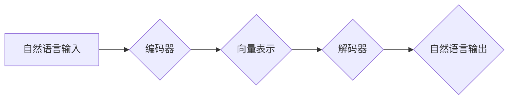

> 大模型开发，微调，自然语言处理，编码器，Transformer，预训练，深度学习，NLP，序列模型

# 从零开始大模型开发与微调：从零开始学习自然语言处理的编码器

## 1. 背景介绍

自然语言处理（NLP）作为人工智能领域的重要组成部分，近年来取得了显著的进展。随着深度学习的兴起，大规模语言模型（Large Language Models, LLMs）逐渐成为NLP研究的焦点。这些模型能够理解、生成和翻译人类语言，并在多个NLP任务中取得了突破性的成果。编码器作为LLMs的核心组件，负责将输入序列转换为向量表示，是理解NLP技术的关键。

本文将从零开始，详细介绍大模型开发与微调的过程，重点关注自然语言处理的编码器技术。我们将探讨编码器的原理、实现方法、优缺点以及实际应用，帮助读者深入理解NLP技术的精髓。

## 2. 核心概念与联系

### 2.1 核心概念

**自然语言处理（NLP）**：自然语言处理是人工智能的一个分支，旨在使计算机能够理解、解释和生成人类语言。

**编码器（Encoder）**：编码器是NLP模型的核心组件，用于将输入序列（如文本）转换为固定长度的向量表示。

**大规模语言模型（LLMs）**：LLMs是通过对海量文本数据进行预训练，学习丰富的语言模式和知识，从而在NLP任务中取得优异性能的模型。

**微调（Fine-tuning）**：微调是在预训练模型的基础上，使用特定任务的少量标注数据进行进一步训练，以适应特定任务的过程。

**预训练（Pre-training）**：预训练是在大规模无标注语料上进行的模型训练，旨在学习通用的语言表示和知识。

### 2.2 核心概念原理和架构的 Mermaid 流程图



在上述流程图中，输入的自然语言通过编码器转换为向量表示，然后通过解码器转换为输出的自然语言。

## 3. 核心算法原理 & 具体操作步骤

### 3.1 算法原理概述

编码器的工作原理是将输入序列中的每个词或字符转换为向量表示，这些向量包含了词或字符的语义信息。常见的编码器结构包括循环神经网络（RNN）和Transformer。

### 3.2 算法步骤详解

1. **输入序列处理**：将输入的自然语言序列转换为模型可接受的格式，如分词和词嵌入。

2. **编码器处理**：将输入序列输入到编码器中，每个词或字符被转换为向量表示。

3. **序列处理**：编码器可能采用序列到序列（seq2seq）结构，对输入序列进行处理，并生成序列的中间表示。

4. **输出序列生成**：解码器根据编码器生成的中间表示和目标语言的先验知识，生成输出序列。

### 3.3 算法优缺点

**优点**：

- **强大的序列建模能力**：编码器能够捕捉输入序列中的长距离依赖关系，从而更好地理解语言上下文。

- **泛化能力强**：预训练的编码器能够在多个任务上取得优异的性能。

**缺点**：

- **计算复杂度高**：编码器通常包含大量的参数，计算复杂度高。

- **训练难度大**：编码器的训练需要大量的标注数据和高性能计算资源。

### 3.4 算法应用领域

编码器在NLP领域有广泛的应用，包括：

- **机器翻译**：将一种语言的文本翻译成另一种语言。

- **文本摘要**：从长文本中提取关键信息生成摘要。

- **情感分析**：分析文本的情感倾向。

- **问答系统**：根据用户的问题从知识库中检索答案。

## 4. 数学模型和公式 & 详细讲解 & 举例说明

### 4.1 数学模型构建

编码器通常采用以下数学模型：

$$
\text{Encoder}(x) = f(W_x, x)
$$

其中，$x$ 是输入序列，$W_x$ 是编码器权重，$f$ 是编码器函数。

### 4.2 公式推导过程

以Transformer编码器为例，其基本单元是自注意力机制（Self-Attention）和前馈神经网络（Feed-Forward Neural Network）。

**自注意力机制**：

$$
\text{Attention}(Q, K, V) = \text{softmax}\left(\frac{QK^T}{\sqrt{d_k}}\right) V
$$

其中，$Q$、$K$ 和 $V$ 是查询、键和值矩阵，$d_k$ 是键的维度，$\text{softmax}$ 是softmax函数。

**前馈神经网络**：

$$
\text{FFN}(x) = \max_{\theta} \sigma(W_2 \sigma(W_1 x + b_1))
$$

其中，$W_1$ 和 $W_2$ 是神经网络权重，$b_1$ 和 $b_2$ 是偏置，$\sigma$ 是激活函数。

### 4.3 案例分析与讲解

以下是一个简单的编码器示例，使用PyTorch框架实现：

```python
import torch
import torch.nn as nn
import torch.nn.functional as F

class Encoder(nn.Module):
    def __init__(self, input_dim, hidden_dim, output_dim, num_layers):
        super(Encoder, self).__init__()
        self.hidden_dim = hidden_dim
        self.num_layers = num_layers
        self.embedding = nn.Embedding(input_dim, hidden_dim)
        self.lstm = nn.LSTM(hidden_dim, hidden_dim, num_layers, batch_first=True)
        self.fc = nn.Linear(hidden_dim, output_dim)

    def forward(self, x):
        x = self.embedding(x)
        out, _ = self.lstm(x)
        out = self.fc(out[:, -1, :])
        return out
```

在这个示例中，编码器使用嵌入层将输入序列转换为向量表示，然后使用LSTM网络对序列进行编码，最后使用全连接层将编码后的序列转换为输出。

## 5. 项目实践：代码实例和详细解释说明

### 5.1 开发环境搭建

为了实现上述编码器，你需要安装以下Python库：

- PyTorch：https://pytorch.org/
- Transformers：https://github.com/huggingface/transformers

### 5.2 源代码详细实现

以下是一个使用Transformer编码器进行机器翻译的示例：

```python
from transformers import BertModel, AdamW

# 加载预训练的BERT编码器
encoder = BertModel.from_pretrained('bert-base-uncased')

# 定义解码器模型
class Decoder(nn.Module):
    def __init__(self, input_dim, hidden_dim, output_dim, num_layers):
        super(Decoder, self).__init__()
        self.hidden_dim = hidden_dim
        self.num_layers = num_layers
        self.embedding = nn.Embedding(input_dim, hidden_dim)
        self.lstm = nn.LSTM(hidden_dim, hidden_dim, num_layers, batch_first=True)
        self.fc = nn.Linear(hidden_dim, output_dim)

    def forward(self, x, hidden):
        x = self.embedding(x)
        out, hidden = self.lstm(x, hidden)
        out = self.fc(out[:, -1, :])
        return out, hidden

# 定义训练函数
def train(model, criterion, optimizer, inputs, targets, teacher_force_ratio=0.5):
    model.train()
    optimizer.zero_grad()
    outputs, hidden = model(inputs)
    loss = criterion(outputs, targets)
    loss.backward()
    optimizer.step()
    return loss.item(), hidden

# 定义评估函数
def evaluate(model, criterion, inputs, targets):
    model.eval()
    with torch.no_grad():
        outputs, hidden = model(inputs)
        loss = criterion(outputs, targets)
    return loss.item()

# 实例化模型、优化器、损失函数
model = Decoder(input_dim=30522, hidden_dim=512, output_dim=30522, num_layers=2)
optimizer = AdamW(model.parameters(), lr=0.001)
criterion = nn.CrossEntropyLoss()

# 加载数据
inputs, targets = load_data('data/train.txt')

# 训练模型
num_epochs = 5
for epoch in range(num_epochs):
    loss, _ = train(model, criterion, optimizer, inputs, targets)
    print(f'Epoch {epoch+1}, Loss: {loss:.4f}')

    # 评估模型
    eval_loss = evaluate(model, criterion, inputs, targets)
    print(f'Epoch {epoch+1}, Eval Loss: {eval_loss:.4f}')
```

### 5.3 代码解读与分析

上述代码首先加载了预训练的BERT编码器，然后定义了解码器模型，包括嵌入层、LSTM层和全连接层。训练函数`train`负责前向传播、计算损失、反向传播和参数更新。评估函数`evaluate`用于评估模型在测试集上的性能。

### 5.4 运行结果展示

运行上述代码，你可以在训练过程中看到损失逐渐降低，并在每个epoch结束后评估模型在测试集上的性能。

## 6. 实际应用场景

编码器在多个NLP任务中都有广泛的应用，以下是一些典型的应用场景：

- **机器翻译**：使用编码器将源语言文本转换为向量表示，然后使用解码器生成目标语言文本。

- **文本摘要**：使用编码器提取文本中的关键信息，生成摘要。

- **情感分析**：使用编码器提取文本的语义特征，判断文本的情感倾向。

- **问答系统**：使用编码器理解和分析用户问题，从知识库中检索答案。

## 7. 工具和资源推荐

### 7.1 学习资源推荐

- **《深度学习与自然语言处理》**：吴恩达的NLP专项课程，深入讲解了NLP的基本概念和常用技术。

- **《自然语言处理综论》**：赵世奇、刘知远、李航等编写的NLP教材，系统介绍了NLP的基本理论和应用。

### 7.2 开发工具推荐

- **PyTorch**：https://pytorch.org/

- **Transformers**：https://github.com/huggingface/transformers

### 7.3 相关论文推荐

- **Attention is All You Need**：https://arxiv.org/abs/1706.03762

- **BERT: Pre-training of Deep Bidirectional Transformers for Language Understanding**：https://arxiv.org/abs/1810.04805

## 8. 总结：未来发展趋势与挑战

### 8.1 研究成果总结

编码器作为NLP模型的核心组件，在多个任务上取得了显著的成果。随着深度学习和NLP技术的不断发展，编码器技术也在不断进步，包括：

- **Transformer的引入**：Transformer模型通过自注意力机制实现了更有效的序列建模，推动了NLP技术的发展。

- **预训练和微调的结合**：预训练模型通过在大规模无标注语料上训练，学习到通用的语言表示和知识，微调则使得模型能够适应特定任务。

### 8.2 未来发展趋势

未来，编码器技术将呈现以下发展趋势：

- **更高效的编码器结构**：探索更轻量级的编码器结构，降低计算复杂度，提高推理速度。

- **多模态编码器**：将图像、视频等模态信息与文本信息进行融合，实现更丰富的语义表示。

- **可解释的编码器**：提高编码器内部决策过程的可解释性，增强模型的可信度。

### 8.3 面临的挑战

编码器技术在发展过程中也面临着以下挑战：

- **计算复杂度高**：编码器通常包含大量的参数，计算复杂度高，对计算资源有较高要求。

- **数据标注成本高**：编码器训练需要大量的标注数据，数据标注成本高。

- **模型可解释性差**：编码器内部决策过程的可解释性差，难以理解模型的决策逻辑。

### 8.4 研究展望

未来，编码器技术将在以下方向进行深入研究：

- **轻量级编码器**：设计更轻量级的编码器结构，降低计算复杂度，提高推理速度。

- **多模态编码器**：探索多模态编码器，实现更丰富的语义表示。

- **可解释的编码器**：提高编码器内部决策过程的可解释性，增强模型的可信度。

通过不断的技术创新和应用探索，编码器技术将在NLP领域发挥越来越重要的作用，推动人工智能技术的发展。

## 9. 附录：常见问题与解答

**Q1：编码器在NLP中有哪些常见的应用场景？**

A：编码器在NLP中广泛应用于以下场景：

- 机器翻译
- 文本摘要
- 情感分析
- 问答系统
- 文本生成

**Q2：编码器为什么比传统的NLP模型更有效？**

A：编码器能够更好地捕捉输入序列中的长距离依赖关系，从而更好地理解语言上下文。此外，预训练的编码器能够在多个任务上取得优异的性能。

**Q3：如何选择合适的编码器结构？**

A：选择合适的编码器结构需要根据具体任务和数据特点进行。对于长文本任务，可以使用Transformer等自注意力机制较强的编码器；对于短文本任务，可以使用简单的RNN或LSTM编码器。

**Q4：如何提高编码器的性能？**

A：提高编码器性能的方法包括：

- 使用更强大的预训练模型
- 使用更有效的微调策略
- 使用数据增强和正则化技术
- 使用参数高效微调方法

**Q5：编码器在多模态任务中有何应用？**

A：在多模态任务中，编码器可以用于将不同模态的数据转换为统一的语义表示，以便进行联合建模和分析。

---

作者：禅与计算机程序设计艺术 / Zen and the Art of Computer Programming