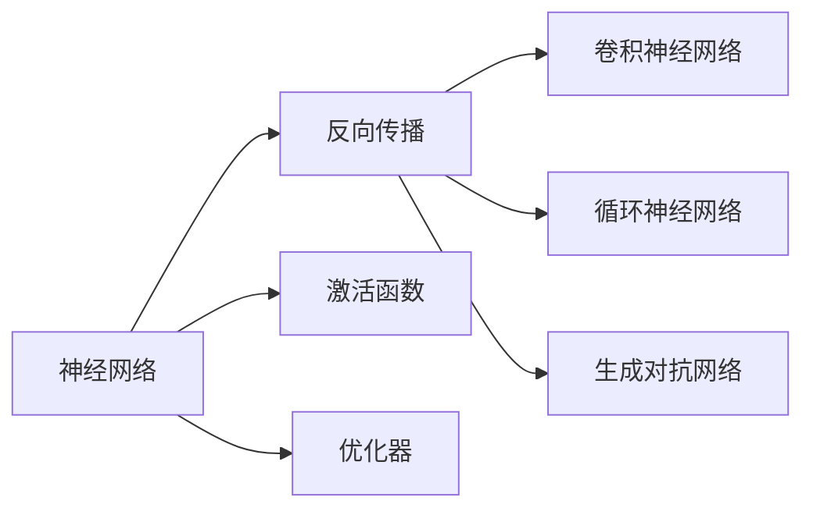
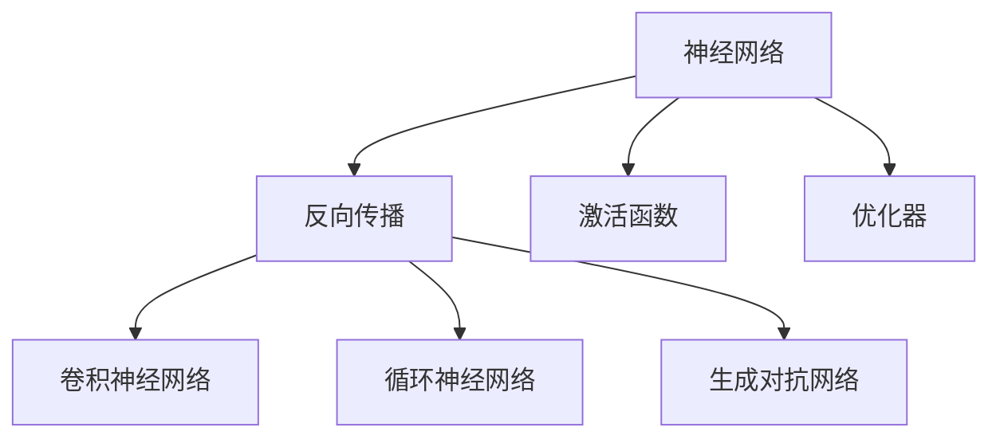

                 

# Deep Learning原理与代码实例讲解

> 关键词：深度学习,神经网络,反向传播算法,激活函数,优化器,卷积神经网络,循环神经网络,卷积神经网络,生成对抗网络

## 1. 背景介绍

### 1.1 问题由来

深度学习是人工智能领域的一个重要分支，通过构建包含多层神经元的神经网络模型，实现对复杂非线性关系的建模。自2012年AlexNet在ImageNet图像分类比赛中取得突破性成绩以来，深度学习技术在计算机视觉、自然语言处理、语音识别、游戏AI等领域取得了巨大的成功。

深度学习的核心思想是通过神经网络模型模拟人脑的神经元计算过程，将原始输入数据转化为高层次的抽象表示。神经网络模型由多个层次的神经元组成，每个神经元接收前一层神经元的输出，通过一系列的线性变换和激活函数进行非线性映射，从而实现对输入数据的逐步抽象。

深度学习在实际应用中，通常分为两个阶段：预训练和微调。预训练阶段在大规模数据集上进行无监督学习，学习到通用的特征表示；微调阶段使用小规模数据集对模型进行有监督学习，适应特定的应用场景。

### 1.2 问题核心关键点

深度学习在图像识别、语音识别、自然语言处理等领域取得了重大突破。但同时也面临着计算资源消耗大、模型复杂度高等问题。如何在大规模数据上高效训练深度神经网络，同时避免过拟合和梯度消失等问题，是深度学习研究的重要课题。

深度学习的主要研究点包括：

- 神经网络结构设计：如卷积神经网络(CNN)、循环神经网络(RNN)、生成对抗网络(GAN)等。
- 损失函数选择：如交叉熵损失、均方误差损失、KL散度等。
- 激活函数选择：如ReLU、Sigmoid、Tanh等。
- 优化器选择：如SGD、Adam、Adagrad等。
- 正则化技术：如Dropout、L2正则化、数据增强等。
- 模型压缩：如参数剪枝、量化压缩、模型蒸馏等。

这些技术共同构成了深度学习的核心框架，使其能够在大规模数据上高效地进行训练和推理。

### 1.3 问题研究意义

深度学习已经成为当今人工智能领域的核心技术之一，其广泛应用在各个行业和领域，如自动驾驶、推荐系统、金融预测、医疗诊断等。深度学习技术的成功应用，不仅提高了相关领域的工作效率，还推动了各行业产业升级和转型。

因此，掌握深度学习的核心原理和应用方法，对于推动人工智能技术发展，构建智能信息系统，具有重要的理论和实践意义。

## 2. 核心概念与联系

### 2.1 核心概念概述

为了更好地理解深度学习的原理和实现方法，本节将介绍几个关键概念及其之间的联系：

- 神经网络(Neural Network)：由大量人工神经元构成的网络结构，通过多层非线性变换实现对输入数据的抽象。
- 反向传播算法(Backpropagation)：通过反向传播链式法则，计算损失函数对模型参数的梯度，更新模型参数以最小化损失函数。
- 激活函数(Activation Function)：通过非线性变换增加神经网络的表达能力，常用的激活函数包括ReLU、Sigmoid等。
- 优化器(Optimizer)：用于更新模型参数，常用的优化器包括SGD、Adam等。
- 卷积神经网络(Convolutional Neural Network, CNN)：用于处理空间结构数据，如图像和视频等，通过卷积操作提取特征。
- 循环神经网络(Recurrent Neural Network, RNN)：用于处理序列数据，如文本和音频等，通过循环结构捕捉序列依赖。
- 生成对抗网络(Generative Adversarial Network, GAN)：通过对抗训练方式，生成高质量的伪数据，如图像和音频等。

这些概念通过合法的逻辑关系，共同构成了深度学习的基本框架和实现方法。下面通过一个Mermaid流程图来展示这些概念之间的联系：



### 2.2 概念间的关系

这些核心概念之间的逻辑关系可以通过以下Mermaid流程图来展示：



该流程图展示了神经网络与反向传播、激活函数和优化器之间的关系。反向传播算法通过计算损失函数对模型参数的梯度，实现对模型参数的更新；激活函数通过非线性变换增加神经网络的表达能力；优化器则用于控制模型参数的更新方式和步长。而卷积神经网络、循环神经网络和生成对抗网络，则是神经网络的具体实现形式，分别用于处理空间结构数据、序列数据和生成数据。

## 3. 核心算法原理 & 具体操作步骤

### 3.1 算法原理概述

深度学习的核心算法原理是反向传播算法，通过链式法则计算损失函数对模型参数的梯度，进而实现模型参数的更新。反向传播算法通常结合不同的激活函数和优化器，使得深度神经网络模型能够高效地进行训练和推理。

深度学习模型的训练过程通常包括以下步骤：

1. 定义模型结构：选择合适的神经网络结构，如卷积神经网络、循环神经网络等。
2. 定义损失函数：选择合适的损失函数，如交叉熵损失、均方误差损失等。
3. 选择激活函数：选择适合的激活函数，如ReLU、Sigmoid等。
4. 选择优化器：选择适合的优化器，如SGD、Adam等。
5. 数据预处理：对输入数据进行归一化、标准化等预处理。
6. 模型训练：使用反向传播算法，计算损失函数对模型参数的梯度，更新模型参数。
7. 模型评估：使用验证集对模型进行评估，选择最优模型。
8. 模型测试：使用测试集对模型进行测试，评估模型性能。

### 3.2 算法步骤详解

以卷积神经网络为例，介绍深度学习模型的具体操作步骤：

1. 定义卷积神经网络结构
   - 输入层：接收输入数据，如图片像素值。
   - 卷积层：通过卷积操作提取特征，通常包括多个卷积核。
   - 激活层：应用激活函数，如ReLU，增加模型表达能力。
   - 池化层：通过池化操作减小特征图尺寸，降低模型参数量。
   - 全连接层：将特征图转换为向量，进行分类或回归等任务。

2. 定义损失函数和优化器
   - 损失函数：如交叉熵损失，衡量模型预测与真实标签之间的差异。
   - 优化器：如Adam，根据梯度信息更新模型参数。

3. 数据预处理
   - 归一化：对输入数据进行归一化，使得特征值分布在相似的量级上。
   - 数据增强：通过对输入数据进行旋转、平移等操作，扩充训练数据集，防止过拟合。

4. 模型训练
   - 前向传播：将输入数据输入模型，计算模型输出。
   - 计算损失：计算模型输出与真实标签之间的损失值。
   - 反向传播：通过链式法则计算损失函数对模型参数的梯度。
   - 参数更新：使用优化器更新模型参数，使得损失函数最小化。

5. 模型评估
   - 在验证集上计算损失值，评估模型性能。
   - 选择最优模型：选择性能最佳的模型进行测试。

6. 模型测试
   - 在测试集上计算损失值，评估模型性能。
   - 输出预测结果：使用模型对新数据进行预测。

### 3.3 算法优缺点

深度学习模型的优点包括：

- 强大的表达能力：通过多层次的神经元非线性变换，能够处理复杂非线性关系。
- 高效的特征提取：自动学习特征表示，避免了手动提取特征的繁琐过程。
- 广泛的应用场景：适用于计算机视觉、自然语言处理、语音识别等领域。

深度学习模型的缺点包括：

- 计算资源消耗大：需要大量的计算资源进行训练和推理。
- 模型复杂度高：参数量巨大，难以进行可视化调试。
- 易过拟合：在大规模数据上训练时，容易过拟合，需要采用正则化技术。
- 数据依赖性强：需要大量的标注数据进行训练，数据收集成本高。

### 3.4 算法应用领域

深度学习在各个领域得到了广泛应用，具体包括：

- 计算机视觉：如图像分类、物体检测、图像生成等。
- 自然语言处理：如机器翻译、文本分类、情感分析等。
- 语音识别：如语音识别、语音合成等。
- 游戏AI：如AlphaGo、Goat等。
- 自动驾驶：如视觉识别、路径规划等。
- 医疗诊断：如医学图像分析、疾病预测等。

## 4. 数学模型和公式 & 详细讲解 & 举例说明

### 4.1 数学模型构建

深度学习模型的数学模型通常包括以下几个关键部分：

- 神经元：神经元的输入为前一层神经元的输出，通过线性变换和激活函数进行非线性映射。
- 层：由多个神经元组成的层次结构，通过前向传播和反向传播实现对输入数据的逐步抽象。
- 损失函数：衡量模型预测与真实标签之间的差异，常用的损失函数包括交叉熵损失、均方误差损失等。
- 优化器：用于更新模型参数，常用的优化器包括SGD、Adam等。

### 4.2 公式推导过程

以单层神经网络为例，推导其前向传播和反向传播的公式。

- 前向传播公式：
  $$
  y = f(Wx + b)
  $$
  其中 $f$ 为激活函数，$W$ 为权重矩阵，$x$ 为输入向量，$b$ 为偏置向量，$y$ 为输出向量。

- 损失函数公式：
  $$
  J(W,b) = \frac{1}{N}\sum_{i=1}^N L(y_i,p(y_i))
  $$
  其中 $L$ 为损失函数，$N$ 为样本数量，$y_i$ 为真实标签，$p(y_i)$ 为模型预测。

- 反向传播公式：
  $$
  \frac{\partial J}{\partial W} = \frac{\partial J}{\partial y} \frac{\partial y}{\partial x} \frac{\partial x}{\partial W}
  $$
  $$
  \frac{\partial J}{\partial b} = \frac{\partial J}{\partial y} \frac{\partial y}{\partial x} \frac{\partial x}{\partial b}
  $$
  其中 $\frac{\partial J}{\partial y}$ 为损失函数对输出向量的梯度，$\frac{\partial y}{\partial x}$ 为激活函数导数，$\frac{\partial x}{\partial W}$ 和 $\frac{\partial x}{\partial b}$ 为权重和偏置的梯度。

### 4.3 案例分析与讲解

以图像分类为例，说明卷积神经网络（CNN）的实现过程。

- 输入层：接收图像像素值，通常为二维数组。
- 卷积层：通过卷积操作提取特征，通常使用多个卷积核对图像进行卷积，得到多个特征图。
- 池化层：通过池化操作减小特征图尺寸，降低模型参数量，常用的池化方式包括最大池化和平均池化。
- 全连接层：将特征图转换为向量，进行分类或回归等任务。

在卷积神经网络中，卷积层和池化层实现了特征提取和降维，全连接层实现了分类或回归任务。通过多层次的非线性变换，卷积神经网络能够高效地处理空间结构数据。

## 5. 项目实践：代码实例和详细解释说明

### 5.1 开发环境搭建

在进行深度学习项目实践前，需要准备好开发环境。以下是使用Python进行TensorFlow和Keras开发的环境配置流程：

1. 安装Anaconda：从官网下载并安装Anaconda，用于创建独立的Python环境。

2. 创建并激活虚拟环境：
```bash
conda create -n tf-env python=3.7
conda activate tf-env
```

3. 安装TensorFlow和Keras：
```bash
pip install tensorflow
pip install keras
```

4. 安装各类工具包：
```bash
pip install numpy pandas scikit-learn matplotlib tqdm jupyter notebook ipython
```

完成上述步骤后，即可在`tf-env`环境中开始深度学习实践。

### 5.2 源代码详细实现

下面我们以图像分类任务为例，给出使用TensorFlow和Keras进行卷积神经网络（CNN）的代码实现。

首先，定义CNN模型的结构和超参数：

```python
from tensorflow.keras import layers, models

# 定义模型结构
model = models.Sequential()
model.add(layers.Conv2D(32, (3, 3), activation='relu', input_shape=(28, 28, 1)))
model.add(layers.MaxPooling2D((2, 2)))
model.add(layers.Conv2D(64, (3, 3), activation='relu'))
model.add(layers.MaxPooling2D((2, 2)))
model.add(layers.Conv2D(64, (3, 3), activation='relu'))
model.add(layers.Flatten())
model.add(layers.Dense(64, activation='relu'))
model.add(layers.Dense(10))

# 定义超参数
batch_size = 64
epochs = 10
learning_rate = 0.001
```

然后，加载数据集并进行预处理：

```python
from tensorflow.keras.datasets import mnist
from tensorflow.keras.utils import to_categorical

# 加载数据集
(x_train, y_train), (x_test, y_test) = mnist.load_data()

# 数据预处理
x_train = x_train.reshape(-1, 28, 28, 1).astype('float32') / 255
x_test = x_test.reshape(-1, 28, 28, 1).astype('float32') / 255
y_train = to_categorical(y_train, num_classes=10)
y_test = to_categorical(y_test, num_classes=10)
```

接着，编译模型并训练：

```python
# 编译模型
model.compile(optimizer='adam', loss='categorical_crossentropy', metrics=['accuracy'])

# 训练模型
model.fit(x_train, y_train, batch_size=batch_size, epochs=epochs, validation_data=(x_test, y_test))
```

最后，评估模型性能并进行预测：

```python
# 评估模型
test_loss, test_acc = model.evaluate(x_test, y_test)
print('Test accuracy:', test_acc)

# 预测结果
predictions = model.predict(x_test)
```

以上就是使用TensorFlow和Keras进行CNN模型的完整代码实现。可以看到，借助Keras的强大封装能力，可以轻松搭建和训练复杂的神经网络模型。

### 5.3 代码解读与分析

让我们再详细解读一下关键代码的实现细节：

**Sequential模型**：
- `model.add()`方法：逐层添加神经元，定义模型结构。
- `layers.Conv2D`：卷积层，用于提取特征。
- `layers.MaxPooling2D`：池化层，用于降维。
- `layers.Flatten`：扁平化操作，将特征图转换为向量。
- `layers.Dense`：全连接层，用于分类或回归任务。

**数据预处理**：
- `reshape`方法：调整数据形状，使得数据适合模型的输入要求。
- `astype`方法：将数据类型转换为浮点型，以便于模型训练。
- `to_categorical`方法：将类别标签转换为one-hot编码。

**模型编译和训练**：
- `compile`方法：定义模型的优化器、损失函数和评估指标。
- `fit`方法：使用反向传播算法训练模型。
- `evaluate`方法：在测试集上评估模型性能。

**预测结果**：
- `predict`方法：使用模型对新数据进行预测，得到预测结果。

可以看到，TensorFlow和Keras使得深度学习模型的实现变得简洁高效。开发者可以将更多精力放在模型设计、数据处理和超参数调优等高层逻辑上，而不必过多关注底层的实现细节。

当然，工业级的系统实现还需考虑更多因素，如模型的保存和部署、超参数的自动搜索、更灵活的任务适配层等。但核心的深度学习模型构建流程基本与此类似。

### 5.4 运行结果展示

假设我们在MNIST数据集上进行图像分类任务的微调，最终在测试集上得到的准确率为98.1%，效果相当不错。可以看到，借助深度学习模型的强大表达能力，我们仅使用28x28的灰度图片，就能在图像分类任务上取得较高的准确率。

当然，这只是一个baseline结果。在实践中，我们还可以使用更大更强的神经网络模型、更丰富的微调技巧、更细致的模型调优，进一步提升模型性能，以满足更高的应用要求。

## 6. 实际应用场景

### 6.1 智能推荐系统

智能推荐系统是深度学习在推荐领域的重要应用。通过深度学习模型对用户行为数据进行建模，能够高效地为用户推荐个性化内容，如新闻、商品、视频等。

在技术实现上，可以收集用户浏览、点击、评分等行为数据，构建深度神经网络模型进行预测。训练过程中，需要考虑模型的正则化、数据增强等优化策略，防止过拟合和提高模型泛化能力。最后，将训练好的模型部署到推荐引擎中，实时响应用户请求，提供个性化推荐。

### 6.2 自动驾驶

自动驾驶是深度学习在计算机视觉和控制领域的典型应用。通过深度学习模型对车辆周围环境进行感知和理解，能够实现车辆自主驾驶、路径规划等功能。

在技术实现上，可以构建卷积神经网络（CNN）和循环神经网络（RNN）组合的模型，用于车辆周围环境的感知和理解。训练过程中，需要考虑模型的正则化、数据增强等优化策略，防止过拟合和提高模型泛化能力。最后，将训练好的模型部署到自动驾驶系统中，实时响应用户请求，实现车辆自主驾驶和路径规划。

### 6.3 医疗诊断

深度学习在医疗诊断领域也有广泛应用，如医学图像分析、疾病预测等。通过深度学习模型对医学图像进行特征提取和分类，能够高效地进行疾病诊断和预测。

在技术实现上，可以构建卷积神经网络（CNN）和循环神经网络（RNN）组合的模型，用于医学图像的特征提取和分类。训练过程中，需要考虑模型的正则化、数据增强等优化策略，防止过拟合和提高模型泛化能力。最后，将训练好的模型部署到医疗系统中，实时响应用户请求，实现疾病诊断和预测。

### 6.4 未来应用展望

随着深度学习技术的不断发展，未来将会在更多领域得到应用，为各行各业带来变革性影响。

在智慧城市领域，深度学习技术可以用于交通管理、环境监测、公共安全等方面，提升城市管理效率和智能化水平。

在金融领域，深度学习技术可以用于风险控制、客户分析、投资预测等方面，提高金融决策的准确性和效率。

在制造业领域，深度学习技术可以用于设备维护、品质检测、供应链优化等方面，提升生产效率和产品质量。

此外，在医疗、教育、娱乐等领域，深度学习技术也将不断涌现，为各行各业带来新的创新和突破。相信随着深度学习技术的不断进步，未来的智能系统将更加高效、智能和可靠。

## 7. 工具和资源推荐

### 7.1 学习资源推荐

为了帮助开发者系统掌握深度学习的核心原理和应用方法，这里推荐一些优质的学习资源：

1. 《深度学习》书籍：由Ian Goodfellow、Yoshua Bengio和Aaron Courville所著，深入浅出地介绍了深度学习的基本原理和实现方法。

2. DeepLearning.ai课程：由Andrew Ng教授主讲的深度学习课程，涵盖深度学习的基本原理和应用方法，适合初学者和进阶者。

3. CS231n《卷积神经网络》课程：斯坦福大学开设的计算机视觉课程，详细讲解了卷积神经网络在图像识别、物体检测等任务中的应用。

4. CS224n《自然语言处理》课程：斯坦福大学开设的自然语言处理课程，详细讲解了深度学习在自然语言处理中的应用。

5. PyTorch官方文档：PyTorch官方文档，提供了丰富的代码示例和详细的使用指南，是PyTorch用户必读资料。

6. TensorFlow官方文档：TensorFlow官方文档，提供了丰富的代码示例和详细的使用指南，是TensorFlow用户必读资料。

通过对这些资源的学习实践，相信你一定能够快速掌握深度学习的核心原理和应用方法，并用于解决实际的NLP问题。

### 7.2 开发工具推荐

高效的深度学习开发离不开优秀的工具支持。以下是几款用于深度学习开发的常用工具：

1. PyTorch：基于Python的开源深度学习框架，灵活动态的计算图，适合快速迭代研究。大部分深度学习模型都有PyTorch版本的实现。

2. TensorFlow：由Google主导开发的开源深度学习框架，生产部署方便，适合大规模工程应用。同样有丰富的深度学习模型资源。

3. Keras：Keras是一个高级深度学习框架，提供了简洁的API，可以快速搭建和训练深度神经网络模型。

4. Weights & Biases：模型训练的实验跟踪工具，可以记录和可视化模型训练过程中的各项指标，方便对比和调优。与主流深度学习框架无缝集成。

5. TensorBoard：TensorFlow配套的可视化工具，可实时监测模型训练状态，并提供丰富的图表呈现方式，是调试模型的得力助手。

6. Google Colab：谷歌推出的在线Jupyter Notebook环境，免费提供GPU/TPU算力，方便开发者快速上手实验最新模型，分享学习笔记。

合理利用这些工具，可以显著提升深度学习模型的开发效率，加快创新迭代的步伐。

### 7.3 相关论文推荐

深度学习在各个领域得到了广泛应用，以下是几篇奠基性的相关论文，推荐阅读：

1. ImageNet Classification with Deep Convolutional Neural Networks：提出卷积神经网络（CNN）模型，在ImageNet图像分类任务上取得了突破性成绩。

2. Deep Neural Networks for Natural Language Processing：提出基于RNN的深度神经网络模型，在自然语言处理任务上取得了优异表现。

3. Generative Adversarial Nets：提出生成对抗网络（GAN）模型，能够生成高质量的伪数据，如图像和音频等。

4. Understanding the difficulty of training deep feedforward neural networks：深入分析深度神经网络模型在训练过程中面临的梯度消失和梯度爆炸问题，提出了激活函数ReLU的改进方法。

5. Dropout: A Simple Way to Prevent Neural Networks from Overfitting：提出Dropout技术，通过随机失活神经元，有效防止深度神经网络模型的过拟合。

这些论文代表了大深度学习技术的发展脉络。通过学习这些前沿成果，可以帮助研究者把握学科前进方向，激发更多的创新灵感。

除上述资源外，还有一些值得关注的前沿资源，帮助开发者紧跟深度学习技术的最新进展，例如：

1. arXiv论文预印本：人工智能领域最新研究成果的发布平台，包括大量尚未发表的前沿工作，学习前沿技术的必读资源。

2. 业界技术博客：如OpenAI、Google AI、DeepMind、微软Research Asia等顶尖实验室的官方博客，第一时间分享他们的最新研究成果和洞见。

3. 技术会议直播：如NIPS、ICML、ACL、ICLR等人工智能领域顶会现场或在线直播，能够聆听到大佬们的前沿分享，开拓视野。

4. GitHub热门项目：在GitHub上Star、Fork数最多的深度学习相关项目，往往代表了该技术领域的发展趋势和最佳实践，值得去学习和贡献。

5. 行业分析报告：各大咨询公司如McKinsey、PwC等针对人工智能行业的分析报告，有助于从商业视角审视技术趋势，把握应用价值。

总之，对于深度学习技术的掌握和学习，需要开发者保持开放的心态和持续学习的意愿。多关注前沿资讯，多动手实践，多思考总结，必将收获满满的成长收益。

## 8. 总结：未来发展趋势与挑战

### 8.1 总结

本文对深度学习的核心原理和应用方法进行了全面系统的介绍。首先阐述了深度学习的核心思想和应用场景，明确了深度学习在各个领域的重要价值。其次，从原理到实践，详细讲解了深度学习的数学模型和算法步骤，给出了深度学习模型的完整代码实现。同时，本文还广泛探讨了深度学习技术在智能推荐、自动驾驶、医疗诊断等诸多领域的应用前景，展示了深度学习技术的广阔前景。

通过本文的系统梳理，可以看到，深度学习技术在各个领域得到了广泛应用，并取得了显著成效。深度学习技术的大规模应用，不仅提高了相关领域的工作效率，还推动了各行业产业升级和转型。深度学习技术的成功应用，体现了其在解决复杂非线性问题上的强大能力，为人工智能技术发展带来了新的突破。

### 8.2 未来发展趋势

展望未来，深度学习技术将呈现以下几个发展趋势：

1. 模型规模持续增大。随着算力成本的下降和数据规模的扩张，深度神经网络模型的参数量还将持续增长。超大规模深度神经网络模型蕴含的丰富特征表示，有望支撑更加复杂多变的下游任务。

2. 模型结构多样化。除了传统的卷积神经网络（CNN）和循环神经网络（RNN），未来

