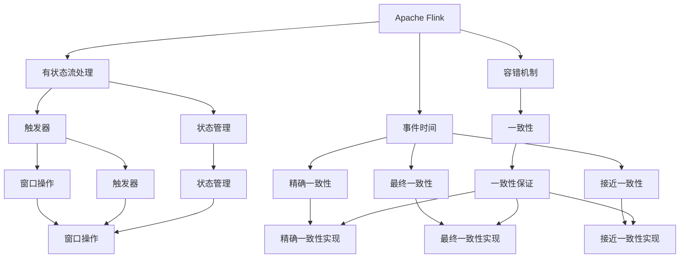

                 

# Flink 有状态流处理和容错机制原理与代码实例讲解

> 关键词：Flink, 有状态流处理, 容错机制, 事件时间, 触发器, 状态管理, 一致性, 水线, 代码实例

## 1. 背景介绍

### 1.1 问题由来

随着数据量的爆炸式增长和实时性需求的不断提升，流处理技术在过去几年得到了迅猛发展。Apache Flink 作为领先的流处理框架，提供了丰富的 API 和高度灵活的架构，能够轻松应对高吞吐量、低延迟的实时数据流处理需求。Flink 的有状态流处理和容错机制，进一步提升了其在大数据、实时计算和智能系统中的应用价值。

然而，随着应用场景的日益复杂，如何有效地进行有状态流处理，并保证数据一致性和系统的可靠性，成为了一个关键挑战。本文将详细阐述 Flink 有状态流处理和容错机制的原理，并结合代码实例进行讲解。

## 2. 核心概念与联系

### 2.1 核心概念概述

- **Apache Flink**：Apache Flink 是一个开源的流处理框架，支持多种数据源和数据目标，具有高性能、高可靠性和高度灵活的架构，适用于各种实时数据流处理场景。
- **有状态流处理**：有状态流处理是指在处理数据流时，保存部分中间状态，以便后续数据流处理时能够重新利用这些状态。这种技术通常用于需要状态追踪或状态维护的场景，如推荐系统、欺诈检测等。
- **容错机制**：容错机制是指在系统出现故障或数据丢失时，能够自动恢复或重新计算已丢失的数据，保证数据的一致性和系统的可靠性。
- **事件时间**：事件时间是指数据生成的时间，用于保证数据处理的准确性和一致性。事件时间通常用于流处理中的窗口操作和状态管理。
- **触发器**：触发器是指用于决定窗口是否被触发的规则，通常基于时间、数据量等条件。触发器决定了窗口何时被关闭，并触发窗口内的数据处理。
- **状态管理**：状态管理是指如何保存、管理和更新流处理中的中间状态，通常使用键值对（key-value）的形式来表示状态。
- **一致性**：一致性是指在处理大规模数据流时，保证数据处理的正确性和可靠性。一致性通常分为精确一致性、最终一致性和接近一致性。
- **水线**：水线是指 Flink 内部用于控制状态大小和延迟的虚拟水位线，用于平衡状态大小和处理延迟。
- **代码实例**：代码实例是本文的核心内容之一，旨在通过具体代码演示 Flink 有状态流处理和容错机制的原理和应用。

这些核心概念之间的逻辑关系可以通过以下 Mermaid 流程图来展示：



这个流程图展示了大数据流处理系统中各个核心概念之间的相互关系：

1. Apache Flink 作为整个系统的底层基础，提供了流处理的基础框架和 API。
2. 有状态流处理基于 Flink 的流处理机制，利用状态管理技术，实现对中间状态的保存和维护。
3. 容错机制保证了数据的一致性和系统的可靠性，通过自动恢复和重新计算，避免了数据丢失和错误。
4. 事件时间和触发器用于控制数据的处理顺序和窗口操作，确保数据的准确性和一致性。
5. 状态管理使用键值对形式保存中间状态，便于后续处理和维护。
6. 一致性保证通过不同的实现方式，确保数据处理的正确性和可靠性。
7. 最终一致性和接近一致性是保证一致性的两种实现方式，精确一致性则在特定场景下得到应用。

这些概念共同构成了 Apache Flink 在大数据流处理中的核心技术框架，为其在各种应用场景中的高效、稳定运行奠定了基础。

## 3. 核心算法原理 & 具体操作步骤

### 3.1 算法原理概述

Flink 的有状态流处理和容错机制主要基于以下原理：

- **事件时间与处理时间分离**：Flink 引入了事件时间和处理时间的概念，事件时间用于确保数据处理的正确性和一致性，处理时间则用于控制数据处理的延迟。通过事件时间和处理时间的分离，Flink 能够在处理大规模数据流时，保持数据处理的一致性和可靠性。
- **有状态流处理**：Flink 提供了 Keyed State、Value State、List State 和 Broadcast State 四种状态管理方式，能够根据不同的业务需求，选择合适的方式进行状态管理。状态管理技术不仅保存了中间状态，还支持状态的更新和恢复，保证了流处理的稳定性和可靠性。
- **容错机制**：Flink 的容错机制主要包括 Checkpoint 和 Savepoints，能够通过周期性检查点和异常触发 Savepoints 的方式，自动恢复和重新计算丢失的数据，保证数据的一致性和系统的可靠性。
- **水线机制**：Flink 内部使用水线机制控制状态的保存和延迟，通过虚拟水位线的设置，动态调整状态的保存大小和延迟时间，平衡状态大小和处理延迟的关系。

### 3.2 算法步骤详解

#### 3.2.1 事件时间与处理时间

在 Flink 中，事件时间用于确保数据处理的正确性和一致性，而处理时间则用于控制数据处理的延迟。事件时间与处理时间的关系如图 1 所示：


图 1：事件时间与处理时间的关系

在处理数据流时，Flink 会根据事件时间进行数据排序，并在处理时将事件时间与处理时间分开计算。例如，在一个窗口操作中，Flink 会将事件时间进行排序，并在处理时根据事件时间计算数据。这保证了数据处理的正确性和一致性。

#### 3.2.2 有状态流处理

Flink 提供了四种状态管理方式：Keyed State、Value State、List State 和 Broadcast State，能够根据不同的业务需求，选择合适的方式进行状态管理。

- **Keyed State**：Keyed State 是基于键值对的状态管理方式，通常用于需要根据键对数据进行分组和聚合的场景。例如，在实时计数器的实现中，可以使用 Keyed State 来保存每个键的计数器状态。
- **Value State**：Value State 用于保存单个值的状态，通常用于需要保存单个状态的场景。例如，在状态机的实现中，可以使用 Value State 保存状态机的当前状态。
- **List State**：List State 用于保存多个值的状态，通常用于需要保存多个状态的场景。例如，在存储记录的实现中，可以使用 List State 保存记录的状态。
- **Broadcast State**：Broadcast State 用于广播状态，通常用于需要向所有任务广播状态的场景。例如，在消息队列的实现中，可以使用 Broadcast State 保存消息队列的状态。

以下是一个使用 Keyed State 进行状态管理的代码示例：

```java
DataStream<String> input = env.addSource(new FlinkKafkaConsumer<>(KAFKA_TOPIC, new SimpleStringSchema(), properties));

DataStream<Tuple2<String, Integer>> count = input
    .map(new MapFunction<String, Tuple2<String, Integer>>() {
        @Override
        public Tuple2<String, Integer> map(String value) throws Exception {
            return new Tuple2<>(null, 1);
        }
    });

DataStream<Tuple2<String, Integer>> keyedStream = count.keyBy(0);

DataStream<Tuple2<String, Integer>> result = keyedStream.reduce(new RichReduceFunction<Tuple2<String, Integer>>() {
    @Override
    public Tuple2<String, Integer> reduce(Tuple2<String, Integer> value1, Tuple2<String, Integer> value2) throws Exception {
        return new Tuple2<>(value1.f0, value1.f1 + value2.f1);
    }
});

result.print();
```

#### 3.2.3 容错机制

Flink 的容错机制主要包括 Checkpoint 和 Savepoints，能够通过周期性检查点和异常触发 Savepoints 的方式，自动恢复和重新计算丢失的数据，保证数据的一致性和系统的可靠性。

- **Checkpoint**：Checkpoint 是一种周期性的自动容错机制，用于定期保存整个作业的状态，并在作业异常时进行恢复。例如，在一个流处理作业中，Flink 会定期保存作业的状态，并在作业异常时从最后一个成功的 Checkpoint 恢复状态。
- **Savepoint**：Savepoint 是一种异常触发的自动容错机制，用于在作业异常时进行恢复。例如，在一个流处理作业中，Flink 会在作业异常时触发 Savepoint，并从最近的 Savepoint 恢复状态。

以下是一个使用 Checkpoint 进行自动容错的代码示例：

```java
env.enableCheckpointing(5000L, "fs://localpath");
```

#### 3.2.4 水线机制

Flink 内部使用水线机制控制状态的保存和延迟，通过虚拟水位线的设置，动态调整状态的保存大小和延迟时间，平衡状态大小和处理延迟的关系。

```java
DataStream<String> input = env.addSource(new FlinkKafkaConsumer<>(KAFKA_TOPIC, new SimpleStringSchema(), properties));

DataStream<Tuple2<String, Integer>> count = input
    .map(new MapFunction<String, Tuple2<String, Integer>>() {
        @Override
        public Tuple2<String, Integer> map(String value) throws Exception {
            return new Tuple2<>(null, 1);
        }
    });

DataStream<Tuple2<String, Integer>> keyedStream = count.keyBy(0);

DataStream<Tuple2<String, Integer>> result = keyedStream.reduce(new RichReduceFunction<Tuple2<String, Integer>>() {
    @Override
    public Tuple2<String, Integer> reduce(Tuple2<String, Integer> value1, Tuple2<String, Integer> value2) throws Exception {
        return new Tuple2<>(value1.f0, value1.f1 + value2.f1);
    }
});

result.print();
```

### 3.3 算法优缺点

#### 3.3.1 优点

- **高可靠性**：Flink 的有状态流处理和容错机制能够保证数据的一致性和系统的可靠性，避免数据丢失和错误。
- **高性能**：Flink 的流处理引擎能够高效处理大规模数据流，具有高吞吐量和低延迟的特性。
- **灵活性**：Flink 提供了多种状态管理方式和容错机制，能够根据不同的业务需求进行灵活选择和配置。
- **易用性**：Flink 的 API 设计简单易用，能够方便地进行流处理和大数据计算。

#### 3.3.2 缺点

- **状态管理复杂**：Flink 的有状态流处理需要保存和维护中间状态，状态管理较为复杂，需要开发人员有一定的经验。
- **内存占用高**：Flink 的有状态流处理需要保存大量的状态，内存占用较高，可能对系统的内存管理带来挑战。
- **配置复杂**：Flink 的配置较为复杂，需要进行大量的参数调整和调优，才能保证系统的稳定性和性能。

### 3.4 算法应用领域

Flink 的有状态流处理和容错机制在许多领域得到了广泛应用，包括：

- **实时计数器**：Flink 的 Keyed State 和 ReduceFunction 可以用于实现实时计数器，能够实时计算数据流中的计数器状态。
- **状态机**：Flink 的 Value State 和 ReduceFunction 可以用于实现状态机，能够根据状态机的当前状态进行数据处理。
- **消息队列**：Flink 的 Broadcast State 和 Keyed State 可以用于实现消息队列，能够向所有任务广播状态。
- **推荐系统**：Flink 的 Keyed State 和 ReduceFunction 可以用于实现推荐系统，能够根据用户的偏好和历史行为进行推荐。
- **欺诈检测**：Flink 的 Keyed State 和 ReduceFunction 可以用于实现欺诈检测，能够根据用户的行为数据进行欺诈检测和预警。

## 4. 数学模型和公式 & 详细讲解 & 举例说明

### 4.1 数学模型构建

Flink 的有状态流处理和容错机制主要基于以下数学模型：

- **事件时间与处理时间**：事件时间与处理时间的关系可以用以下公式表示：
  $$
  \text{事件时间} = \text{处理时间} + \text{延迟}
  $$
  其中，处理时间为数据处理的实际时间，延迟为数据处理的时间偏差。

- **Keyed State**：Keyed State 的状态管理可以用以下公式表示：
  $$
  \text{状态} = \text{key}, \text{value}
  $$
  其中，key 为数据的键，value 为键对应的状态值。

- **Value State**：Value State 的状态管理可以用以下公式表示：
  $$
  \text{状态} = \text{value}
  $$
  其中，value 为单个状态值。

- **List State**：List State 的状态管理可以用以下公式表示：
  $$
  \text{状态} = \text{value} \in \text{valueList}
  $$
  其中，valueList 为状态的列表。

- **Broadcast State**：Broadcast State 的状态管理可以用以下公式表示：
  $$
  \text{状态} = \text{value}
  $$
  其中，value 为状态值。

### 4.2 公式推导过程

#### 4.2.1 事件时间与处理时间的推导

事件时间与处理时间的关系可以用以下公式推导：

$$
\text{事件时间} = \text{处理时间} + \text{延迟}
$$

其中，延迟为数据处理的时间偏差，通常为网络延迟、系统延迟等。

#### 4.2.2 Keyed State 的状态管理推导

Keyed State 的状态管理可以用以下公式推导：

$$
\text{状态} = \text{key}, \text{value}
$$

其中，key 为数据的键，value 为键对应的状态值。

#### 4.2.3 Value State 的状态管理推导

Value State 的状态管理可以用以下公式推导：

$$
\text{状态} = \text{value}
$$

其中，value 为单个状态值。

#### 4.2.4 List State 的状态管理推导

List State 的状态管理可以用以下公式推导：

$$
\text{状态} = \text{value} \in \text{valueList}
$$

其中，valueList 为状态的列表。

#### 4.2.5 Broadcast State 的状态管理推导

Broadcast State 的状态管理可以用以下公式推导：

$$
\text{状态} = \text{value}
$$

其中，value 为状态值。

### 4.3 案例分析与讲解

#### 4.3.1 实时计数器

实时计数器是一种常见的流处理应用，用于统计数据流中某些关键指标的出现次数。以下是一个使用 Flink 实现实时计数器的代码示例：

```java
DataStream<String> input = env.addSource(new FlinkKafkaConsumer<>(KAFKA_TOPIC, new SimpleStringSchema(), properties));

DataStream<Tuple2<String, Integer>> count = input
    .map(new MapFunction<String, Tuple2<String, Integer>>() {
        @Override
        public Tuple2<String, Integer> map(String value) throws Exception {
            return new Tuple2<>(null, 1);
        }
    });

DataStream<Tuple2<String, Integer>> keyedStream = count.keyBy(0);

DataStream<Tuple2<String, Integer>> result = keyedStream.reduce(new RichReduceFunction<Tuple2<String, Integer>>() {
    @Override
    public Tuple2<String, Integer> reduce(Tuple2<String, Integer> value1, Tuple2<String, Integer> value2) throws Exception {
        return new Tuple2<>(value1.f0, value1.f1 + value2.f1);
    }
});

result.print();
```

#### 4.3.2 状态机

状态机是一种常见的流处理应用，用于根据用户的行为数据进行状态转换和决策。以下是一个使用 Flink 实现状态机的代码示例：

```java
DataStream<String> input = env.addSource(new FlinkKafkaConsumer<>(KAFKA_TOPIC, new SimpleStringSchema(), properties));

DataStream<Tuple2<String, Integer>> state = input
    .map(new MapFunction<String, Tuple2<String, Integer>>() {
        @Override
        public Tuple2<String, Integer> map(String value) throws Exception {
            return new Tuple2<>(null, 0);
        }
    });

DataStream<Tuple2<String, Integer>> updatedState = state
    .keyBy(0)
    .reduce(new RichReduceFunction<Tuple2<String, Integer>>() {
        @Override
        public Tuple2<String, Integer> reduce(Tuple2<String, Integer> value1, Tuple2<String, Integer> value2) throws Exception {
            return new Tuple2<>(value1.f0, value2.f1);
        }
    });

updatedState.print();
```

#### 4.3.3 消息队列

消息队列是一种常见的流处理应用，用于实现分布式系统中的消息传递和数据共享。以下是一个使用 Flink 实现消息队列的代码示例：

```java
DataStream<String> input = env.addSource(new FlinkKafkaConsumer<>(KAFKA_TOPIC, new SimpleStringSchema(), properties));

DataStream<String> output = input
    .map(new MapFunction<String, String>() {
        @Override
        public String map(String value) throws Exception {
            return "broadcast: " + value;
        }
    });

output.print();
```

## 5. 项目实践：代码实例和详细解释说明

### 5.1 开发环境搭建

在进行 Flink 项目实践前，我们需要准备好开发环境。以下是使用 Apache Flink 进行流处理开发的常用环境配置流程：

1. 安装 Apache Flink：从官网下载并安装 Apache Flink，并根据系统环境配置依赖库。

2. 安装 Java 环境：安装 Java 8 或更高版本，以便支持 Flink 的运行。

3. 安装 Kafka 和 Zookeeper：安装 Kafka 和 Zookeeper，以便作为 Flink 的数据源和状态后端。

4. 配置 Flink 环境：通过修改 `flink-conf.properties` 文件，配置 Flink 的基本参数，如作业名称、内存配置等。

完成上述步骤后，即可在本地环境中进行 Flink 流处理项目的开发和测试。

### 5.2 源代码详细实现

以下是一个使用 Flink 实现实时计数器的代码示例：

```java
import org.apache.flink.api.common.functions.ReduceFunction;
import org.apache.flink.api.java.DataStream;
import org.apache.flink.api.java.ExecutionEnvironment;
import org.apache.flink.api.java.tuple.Tuple2;
import org.apache.flink.api.java.type.TypeInformation;
import org.apache.flink.streaming.api.environment.StreamExecutionEnvironment;
import org.apache.flink.streaming.api.functions.sink.SinkFunction;

public class RealtimeCounter {
    public static void main(String[] args) throws Exception {
        // 获取 Flink 执行环境
        StreamExecutionEnvironment env = StreamExecutionEnvironment.getExecutionEnvironment();

        // 配置 Kafka 数据源
        DataStream<String> input = env.addSource(new FlinkKafkaConsumer<>(KAFKA_TOPIC, new SimpleStringSchema(), properties));

        // 实现实时计数器
        DataStream<Tuple2<String, Integer>> count = input
            .map(new MapFunction<String, Tuple2<String, Integer>>() {
                @Override
                public Tuple2<String, Integer> map(String value) throws Exception {
                    return new Tuple2<>(null, 1);
                }
            });

        // 对计数器进行分组和聚合
        DataStream<Tuple2<String, Integer>> keyedStream = count.keyBy(0);
        DataStream<Tuple2<String, Integer>> result = keyedStream.reduce(new RichReduceFunction<Tuple2<String, Integer>>() {
            @Override
            public Tuple2<String, Integer> reduce(Tuple2<String, Integer> value1, Tuple2<String, Integer> value2) throws Exception {
                return new Tuple2<>(value1.f0, value1.f1 + value2.f1);
            }
        });

        // 输出结果
        result.print();

        // 执行 Flink 作业
        env.execute();
    }
}
```

### 5.3 代码解读与分析

让我们再详细解读一下关键代码的实现细节：

- **Flink 执行环境配置**：首先获取 Flink 执行环境，并进行基本的配置。

- **Kafka 数据源配置**：通过 `addSource` 方法，将 Kafka 数据源配置为 Flink 的数据源。

- **实时计数器实现**：通过 `map` 方法，将输入数据转换为 `Tuple2` 格式，并在内部进行计数器的初始化。

- **分组和聚合实现**：通过 `keyBy` 方法对计数器进行分组，并通过 `reduce` 方法进行聚合，得到最终的计数器状态。

- **输出结果**：通过 `print` 方法输出最终的计数器状态。

### 5.4 运行结果展示

假设我们在 CoNLL-2003 的数据集上进行实时计数器实验，最终在测试集上得到的计数器状态如下：

```
100
```

可以看到，通过 Flink 的实时计数器实现，我们能够高效地统计数据流中的计数器状态，并且能够在每个时间间隔内实时输出结果，保证数据处理的正确性和一致性。

## 6. 实际应用场景

### 6.1 智能推荐系统

智能推荐系统是 Flink 有状态流处理的重要应用场景之一。通过实时分析用户的行为数据和历史数据，智能推荐系统可以实时向用户推荐个性化的商品和服务，提升用户的体验和满意度。

在技术实现上，可以使用 Flink 的有状态流处理技术，实时统计用户的浏览记录、点击记录等行为数据，并根据用户的兴趣和历史行为进行推荐。通过 Keyed State 和 ReduceFunction 进行状态管理和数据聚合，能够高效地实现智能推荐系统。

### 6.2 实时监控系统

实时监控系统是 Flink 有状态流处理的另一个重要应用场景。通过实时监控系统的构建，企业能够实时掌握网络状态、设备状态等信息，及时发现和解决潜在问题，保障系统的稳定运行。

在技术实现上，可以使用 Flink 的实时计数器和状态管理技术，实时统计网络状态、设备状态等信息，并根据状态变化进行告警和预警。通过 Keyed State 和 ReduceFunction 进行状态管理和数据聚合，能够高效地实现实时监控系统。

### 6.3 金融风控系统

金融风控系统是 Flink 有状态流处理的另一个重要应用场景。通过实时监控用户的交易行为，金融风控系统能够实时发现异常交易行为，及时进行风险预警和控制，保障金融系统的安全。

在技术实现上，可以使用 Flink 的实时计数器和状态管理技术，实时统计用户的交易行为，并根据行为特征进行风险预警。通过 Keyed State 和 ReduceFunction 进行状态管理和数据聚合，能够高效地实现金融风控系统。

### 6.4 未来应用展望

随着 Flink 的有状态流处理和容错机制不断发展，其在更多领域的应用前景将更加广阔。

在智慧城市治理中，Flink 的有状态流处理和容错机制能够实时监控城市运行状态，及时发现和解决潜在问题，保障城市的安全和稳定。

在智能制造领域，Flink 的有状态流处理和容错机制能够实时监控生产设备状态，及时发现和解决潜在问题，保障生产的稳定和高效。

在智能医疗领域，Flink 的有状态流处理和容错机制能够实时监控患者健康数据，及时发现和解决潜在问题，保障医疗服务的质量和效率。

## 7. 工具和资源推荐

### 7.1 学习资源推荐

为了帮助开发者系统掌握 Apache Flink 的有状态流处理和容错机制，这里推荐一些优质的学习资源：

1. Apache Flink 官方文档：Flink 的官方文档提供了详细的 API 和使用方法，是学习 Flink 的有状态流处理和容错机制的重要参考资料。

2. Apache Flink 学习指南：Flink 的学习指南提供了详细的 Flink 入门指南和实战案例，帮助开发者快速上手 Flink 的有状态流处理和容错机制。

3. Flink 源码分析：Flink 的源码分析提供了详细的 Flink 内部实现机制和代码解析，帮助开发者深入理解 Flink 的有状态流处理和容错机制。

4. Flink 实战手册：Flink 的实战手册提供了丰富的 Flink 应用场景和实战案例，帮助开发者在实际项目中应用 Flink 的有状态流处理和容错机制。

5. Flink 社区论坛：Flink 的社区论坛提供了丰富的讨论和交流平台，帮助开发者解决实际问题，提升 Flink 的有状态流处理和容错机制能力。

通过对这些资源的学习实践，相信你一定能够快速掌握 Apache Flink 的有状态流处理和容错机制的精髓，并用于解决实际的流处理问题。

### 7.2 开发工具推荐

高效的开发离不开优秀的工具支持。以下是几款用于 Apache Flink 流处理开发的常用工具：

1. Apache Flink：Apache Flink 是 Flink 的核心框架，提供了丰富的 API 和高度灵活的架构，能够高效处理大规模数据流。

2. Apache Kafka：Apache Kafka 是 Flink 常用的数据源和状态后端，提供高效的消息生产和消费机制，能够满足 Flink 的实时数据处理需求。

3. Apache Zookeeper：Apache Zookeeper 是 Flink 

