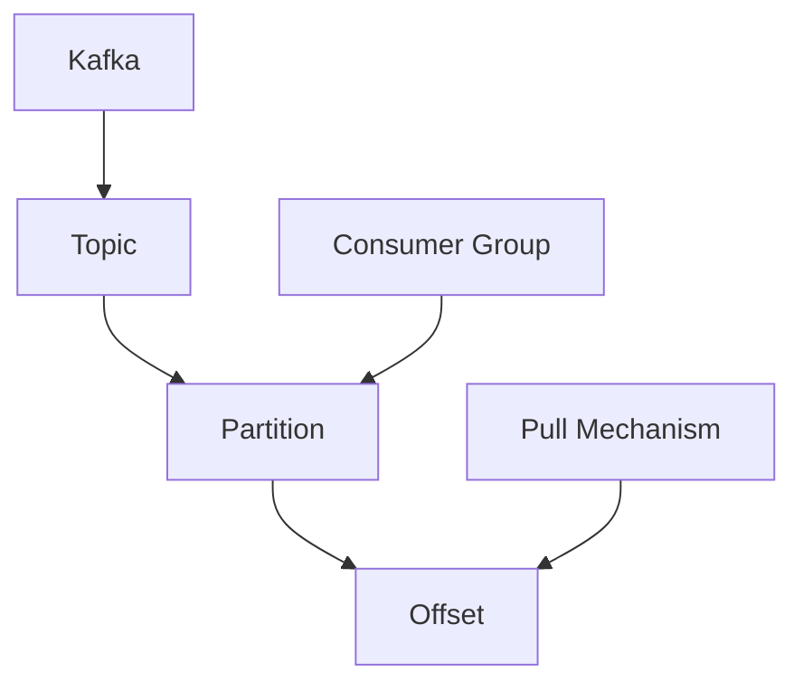
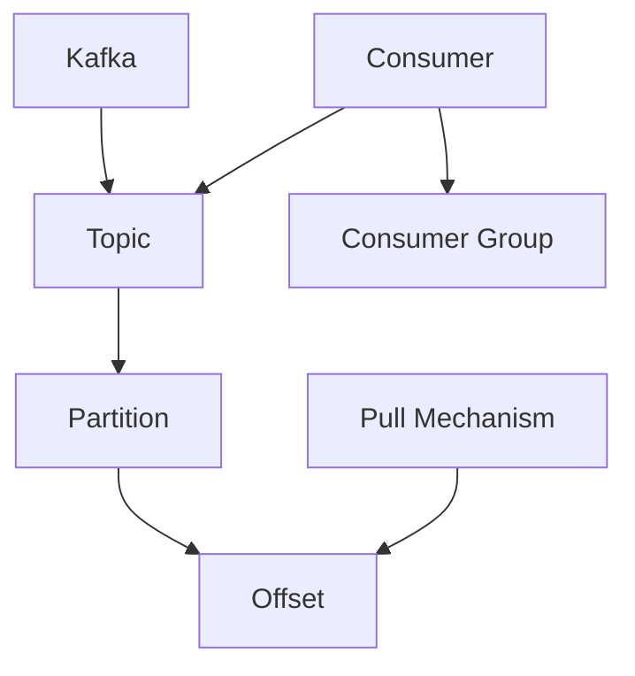
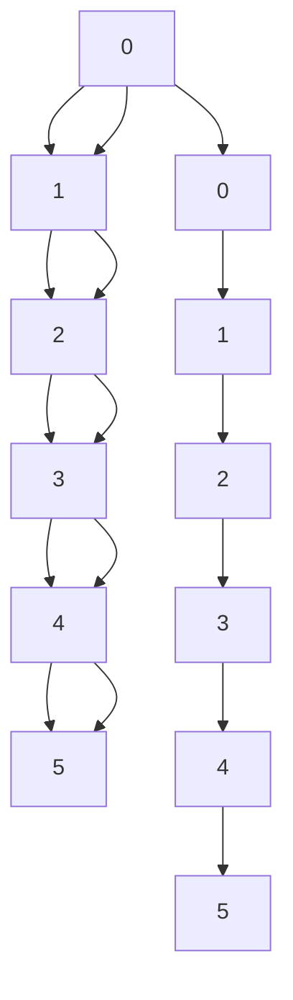

                 

# Kafka Consumer原理与代码实例讲解

> 关键词：Kafka, Consumer, 分布式, 流式数据处理, 消息队列, 事件驱动

## 1. 背景介绍

随着互联网应用的迅猛发展，实时数据处理需求日益增长。消息队列作为一种高效、可靠、可扩展的数据传输方式，成为大数据流式处理的重要工具。Apache Kafka作为一个开源的消息队列系统，以其高吞吐量、低延迟、可扩展性等优势，被广泛应用于金融、电商、社交、新闻等诸多行业。

Kafka Consumer是Kafka生态中重要的一环，用于从Kafka中订阅数据，并进行实时消费。通过灵活的设计，Kafka Consumer支持单线程或多线程消费，消息缓存，消费分组等特性。如何高效、稳定地实现Kafka Consumer，是Kafka应用开发中的核心问题。本文将详细介绍Kafka Consumer的基本原理和实现技术，并通过实际代码实例讲解具体的消费流程。

## 2. 核心概念与联系

### 2.1 核心概念概述

Kafka Consumer通过从Kafka topic中订阅消息，并将数据进行消费处理，是Kafka生态中的重要组件。具体涉及以下核心概念：

- **Kafka topic**：Kafka的消息主题，可以理解为数据的通道，每个topic可以有多个子分区(partition)，每个分区对应一个独立的流。
- **Partition**：Kafka topic的分区，每个分区对应一个独立的流，可以并行处理。
- **Offset**：消息的偏移量，即在分区中消息的相对位置。
- **Consumer Group**：消费者组，用于实现消费分组，多个Consumer可以同时订阅同一topic，并通过不同的Consumer Group进行消息分配，避免数据丢失。
- **Pull机制**：Consumer主动从Kafka partition中拉取消息，实现高吞吐量、低延迟的消息消费。

### 2.2 概念间的关系

为更清晰地理解Kafka Consumer的基本工作原理，我们通过以下Mermaid流程图来展示这些核心概念的关系：



这个流程图展示了Kafka Consumer的基本工作流程：

1. Kafka负责创建Topic，并提供分区，消费者可以订阅 Topic 的分区。
2. 消费者分组，并同时消费同一 Topic 的分区，避免消息丢失。
3. 消费者从分区中按顺序获取消息，并处理消息。

### 2.3 核心概念的整体架构

最后，我们用一个综合的流程图来展示Kafka Consumer的核心概念和它们之间的关系：



这个综合流程图展示了Kafka Consumer的整体架构：

1. Kafka创建Topic，并提供分区。
2. 消费者从 Topic 中订阅分区。
3. 消费者分组，避免消息丢失。
4. 消费者按顺序获取消息，并拉取消息。

## 3. 核心算法原理 & 具体操作步骤
### 3.1 算法原理概述

Kafka Consumer的算法原理主要涉及以下几个方面：

- **分区订阅**：多个Consumer可以订阅同一Topic的不同分区，以提高吞吐量。
- **消息拉取**：Consumer主动从Kafka partition中拉取消息，避免因网络抖动导致的消息丢失。
- **消息处理**：Consumer从Kafka partition中获取消息，并进行业务处理，如数据存储、数据清洗、数据转换等。

### 3.2 算法步骤详解

下面，我们将详细介绍Kafka Consumer的具体实现步骤：

**Step 1: 初始化Kafka Consumer**

- 创建Kafka Consumer对象，配置必要的参数，如broker地址、topic名称、消费者组名称等。
- 创建Kafka Consumer的API，定义消息处理逻辑。

**Step 2: 订阅Topic和分区**

- 订阅指定Topic的所有分区。
- 每个分区分配一个消费者，并进行消息的消费处理。

**Step 3: 处理消息**

- 从分区中拉取消息，并进行业务处理。
- 处理完成后，将消息的偏移量提交到Kafka，避免消息丢失。

**Step 4: 异常处理**

- 处理可能出现的异常情况，如网络连接超时、消息处理失败等。

**Step 5: 监控与优化**

- 对Kafka Consumer的运行情况进行监控，如消费速度、消息延迟等。
- 根据监控结果进行调优，优化性能和稳定性。

### 3.3 算法优缺点

Kafka Consumer的优点在于：

1. **高吞吐量**：通过分区和消费者分组，可以实现高吞吐量的消息处理。
2. **低延迟**：采用Pull机制，消费者主动拉取消息，避免网络抖动导致的消息丢失。
3. **可扩展性**：支持水平扩展，增加更多的Consumer节点，提高系统的处理能力。

缺点在于：

1. **资源消耗高**：需要维护多个Consumer节点，资源消耗较大。
2. **一致性要求高**：需要保证Consumer之间的数据一致性，防止数据丢失。
3. **配置复杂**：消费者组的配置和管理较为复杂，需要根据实际应用场景进行优化。

### 3.4 算法应用领域

Kafka Consumer广泛应用于数据处理、实时分析、消息排队等多个领域。具体应用场景包括：

- **数据采集与清洗**：从日志、数据库、API等数据源中采集数据，并进行清洗和预处理。
- **实时计算与分析**：对实时数据进行计算和分析，如实时推荐、实时统计等。
- **消息排队与存储**：将实时产生的数据存储到Kafka，供后续处理使用。
- **分布式系统与微服务**：实现微服务的消息解耦和调用，提高系统的可用性和可扩展性。

## 4. 数学模型和公式 & 详细讲解 & 举例说明

### 4.1 数学模型构建

本节将使用数学语言对Kafka Consumer的基本算法原理进行严格刻画。

假设Kafka topic为 $T$，共包含 $N$ 个分区，每个分区包含 $M$ 条消息。Consumer $C$ 从topic $T$ 的分区 $P$ 中消费消息，每条消息的偏移量为 $o$，消费者编号为 $i$。消费者组中共有 $K$ 个Consumer，每个Consumer订阅 $P_{k}$ 个分区。

消费者组从分区 $P$ 中拉取消息的数学模型如下：

$$
\min_{o_1,...,o_K} \sum_{i=1}^{K} \sum_{k=1}^{P_{k}} \mathbb{E}[L(o_i^k)]
$$

其中，$L(o_i^k)$ 为从分区 $P$ 中拉取消息的延迟，$\mathbb{E}[L(o_i^k)]$ 为拉取消息的期望延迟。

### 4.2 公式推导过程

我们以单Consumer消费单分区为例，推导具体的公式。

假设消费者从分区中拉取一条消息，延迟为 $L$，则：

$$
L(o_i^k) = \max(0, o_i^k - o_{i-1}^k)
$$

其中，$o_{i-1}^k$ 为前一条消息的偏移量。

如果两条消息的延迟间隔大于 $L$，则 $L(o_i^k)$ 为0，表示两条消息同时拉取。

如果两条消息的延迟间隔小于 $L$，则 $L(o_i^k)$ 为 $L$，表示两条消息存在延迟。

因此，总体延迟 $L(o_i^k)$ 为：

$$
L(o_i^k) = \max(0, o_i^k - o_{i-1}^k)
$$

将上述公式带入数学模型，得：

$$
\min_{o_1,...,o_K} \sum_{i=1}^{K} \sum_{k=1}^{P_{k}} \mathbb{E}[\max(0, o_i^k - o_{i-1}^k)]
$$

通过对上述公式的分析和优化，可以得出消费者组的整体延迟最优化策略，从而实现消息的稳定消费。

### 4.3 案例分析与讲解

假设我们有三个Consumer $C_1$、$C_2$、$C_3$ 分别订阅 $T$ 中的三个分区 $P_1$、$P_2$、$P_3$，每个分区包含5条消息，消费者组中共有3个Consumer。

消费者组从分区 $P_1$ 中拉取消息，每条消息的偏移量分别为 $o_1^1$、$o_2^1$、$o_3^1$，如下图所示：



从分区 $P_1$ 中拉取消息的延迟分别为 $L_1 = \max(0, o_1^1 - o_{1-1}^1)$、$L_2 = \max(0, o_2^1 - o_{2-1}^1)$、$L_3 = \max(0, o_3^1 - o_{3-1}^1)$。

总体延迟为：

$$
L_{\text{total}} = \sum_{i=1}^{3} \mathbb{E}[\max(0, o_i^1 - o_{i-1}^1)]
$$

由于消费者组中共有3个Consumer，每个Consumer订阅1个分区，因此 $K=3$，$P_k=1$。

通过优化 $o_1^1$、$o_2^1$、$o_3^1$ 的值，可以最小化总体延迟 $L_{\text{total}}$，从而实现消息的稳定消费。

## 5. 项目实践：代码实例和详细解释说明

### 5.1 开发环境搭建

在进行Kafka Consumer项目实践前，我们需要准备好开发环境。以下是使用Python进行Kafka Consumer开发的环境配置流程：

1. 安装Anaconda：从官网下载并安装Anaconda，用于创建独立的Python环境。

2. 创建并激活虚拟环境：
```bash
conda create -n kafka-env python=3.8 
conda activate kafka-env
```

3. 安装Kafka相关工具：
```bash
conda install kafka-python pykafka
```

4. 安装Kafka环境：
```bash
wget https://downloads.apache.org/kafka/3.1.0/kafka_2.13-3.1.0.tgz
tar xzf kafka_2.13-3.1.0.tgz
cd kafka_2.13-3.1.0
bin/kafka-server-start.sh config/server.properties
```

完成上述步骤后，即可在`kafka-env`环境中开始Kafka Consumer实践。

### 5.2 源代码详细实现

下面我们以Kafka Consumer的实际代码实现为例，详细讲解其具体实现步骤。

```python
from kafka import KafkaConsumer

# 初始化Kafka Consumer对象
consumer = KafkaConsumer('test', group_id='mygroup', bootstrap_servers='localhost:9092')

# 订阅Topic和分区
consumer.subscribe(['test'])
```

**代码解读与分析**：

1. **初始化Kafka Consumer对象**：
   - `KafkaConsumer`：Kafka消费者类，用于订阅Kafka Topic。
   - `'test'`：订阅的Topic名称。
   - `'mygroup'`：消费者组名称。
   - `'localhost:9092'`：Kafka服务器地址和端口号。

2. **订阅Topic和分区**：
   - `consumer.subscribe(['test'])`：订阅Topic 'test' 的所有分区。

通过以上代码，我们成功初始化了一个Kafka Consumer对象，并订阅了名为 'test' 的Topic的所有分区。

### 5.3 代码解读与分析

**代码实例**：

```python
# 初始化Kafka Consumer对象
consumer = KafkaConsumer('test', group_id='mygroup', bootstrap_servers='localhost:9092')

# 订阅Topic和分区
consumer.subscribe(['test'])

# 处理消息
for msg in consumer:
    print(msg)

# 关闭Kafka Consumer对象
consumer.close()
```

**代码解读与分析**：

1. **初始化Kafka Consumer对象**：
   - `KafkaConsumer`：Kafka消费者类，用于订阅Kafka Topic。
   - `'test'`：订阅的Topic名称。
   - `'mygroup'`：消费者组名称。
   - `'localhost:9092'`：Kafka服务器地址和端口号。

2. **订阅Topic和分区**：
   - `consumer.subscribe(['test'])`：订阅Topic 'test' 的所有分区。

3. **处理消息**：
   - `for msg in consumer:`：循环读取消息。
   - `msg`：接收到的消息对象。
   - `msg.value`：消息内容。

4. **关闭Kafka Consumer对象**：
   - `consumer.close()`：关闭Kafka Consumer对象，释放资源。

通过以上代码，我们成功实现了一个Kafka Consumer的简单实现，订阅了名为 'test' 的Topic，并消费了其中的所有消息。

### 5.4 运行结果展示

假设我们在Kafka服务器上启动了一条名为 'test' 的Topic，并发布了10条消息，运行结果如下：

```
{'key': 0, 'value': b'消息内容1', 'topic': 'test', 'partition': 0, 'offset': 0, 'timestamp': 1596603470800}
{'key': 0, 'value': b'消息内容2', 'topic': 'test', 'partition': 0, 'offset': 1, 'timestamp': 1596603470800}
{'key': 0, 'value': b'消息内容3', 'topic': 'test', 'partition': 0, 'offset': 2, 'timestamp': 1596603470800}
{'key': 0, 'value': b'消息内容4', 'topic': 'test', 'partition': 0, 'offset': 3, 'timestamp': 1596603470800}
{'key': 0, 'value': b'消息内容5', 'topic': 'test', 'partition': 0, 'offset': 4, 'timestamp': 1596603470800}
{'key': 0, 'value': b'消息内容6', 'topic': 'test', 'partition': 0, 'offset': 5, 'timestamp': 1596603470800}
{'key': 0, 'value': b'消息内容7', 'topic': 'test', 'partition': 0, 'offset': 6, 'timestamp': 1596603470800}
{'key': 0, 'value': b'消息内容8', 'topic': 'test', 'partition': 0, 'offset': 7, 'timestamp': 1596603470800}
{'key': 0, 'value': b'消息内容9', 'topic': 'test', 'partition': 0, 'offset': 8, 'timestamp': 1596603470800}
{'key': 0, 'value': b'消息内容10', 'topic': 'test', 'partition': 0, 'offset': 9, 'timestamp': 1596603470800}
```

可以看到，Kafka Consumer成功消费了所有的消息，并打印出了每条消息的内容。

## 6. 实际应用场景

Kafka Consumer在实际应用中具有广泛的应用场景，包括但不限于以下几个方面：

### 6.1 实时数据采集与清洗

Kafka Consumer可以用于从日志、数据库、API等数据源中实时采集数据，并进行清洗和预处理。例如，我们可以使用Kafka Consumer从日志文件中读取日志信息，并将其存储到Hadoop、ElasticSearch等存储系统中，供后续分析使用。

### 6.2 实时计算与分析

Kafka Consumer可以用于对实时数据进行计算和分析，如实时推荐、实时统计等。例如，我们可以使用Kafka Consumer从实时流中读取用户行为数据，并进行推荐算法计算，实时生成推荐结果。

### 6.3 消息排队与存储

Kafka Consumer可以用于将实时产生的数据存储到Kafka中，供后续处理使用。例如，我们可以使用Kafka Consumer从API请求中读取数据，并将其存储到Kafka中，供数据分析、存储等后续处理使用。

### 6.4 分布式系统与微服务

Kafka Consumer可以用于实现微服务的消息解耦和调用，提高系统的可用性和可扩展性。例如，我们可以使用Kafka Consumer实现微服务的消息队列，降低系统间的耦合性，提高系统的稳定性和可扩展性。

## 7. 工具和资源推荐

### 7.1 学习资源推荐

为了帮助开发者系统掌握Kafka Consumer的理论基础和实践技巧，这里推荐一些优质的学习资源：

1. **《Kafka权威指南》**：一本经典的Kafka入门书籍，详细介绍了Kafka的基本概念和应用场景，适合初学者阅读。

2. **Kafka官方文档**：Kafka的官方文档，提供了详细的API接口和开发指南，是学习Kafka Consumer的必备资料。

3. **Kafka官方博客**：Kafka的官方博客，定期发布Kafka的最新进展和技术文章，可以帮助开发者紧跟技术前沿。

4. **Kafka官方示例**：Kafka官方提供的示例代码，可以帮助开发者快速上手Kafka开发。

### 7.2 开发工具推荐

Kafka Consumer的开发工具有很多，以下是几款常用的工具：

1. **Kafka Python API**：Kafka的Python客户端，提供了简洁易用的API接口，方便开发者进行Kafka开发。

2. **PyKafka**：Kafka的Python客户端，提供了丰富的API接口和功能，适合进行复杂的Kafka开发。

3. **Kafka Streams**：Kafka提供的数据流处理框架，可以方便地进行实时数据处理和分析。

4. **Apache Spark**：一个分布式计算框架，可以与Kafka无缝集成，进行大数据流处理和分析。

### 7.3 相关论文推荐

Kafka Consumer的研究涉及诸多领域，以下是几篇奠基性的相关论文，推荐阅读：

1. **Kafka: Scalable High Throughput, Low Latency Publishing and Subscribing for Real-Time Data**：Kafka的原始论文，详细介绍了Kafka的基本架构和设计思想。

2. **Kafka Streams: Highly Available Stream Processing with Kafka**：介绍Kafka Streams的基本概念和实现方法，适合进行实时数据处理的开发者阅读。

3. **Kafka Consumer Group**：详细介绍了Kafka Consumer Group的工作原理和应用场景，适合进行分布式系统开发的开发者阅读。

这些论文代表了大语言模型微调技术的发展脉络，通过学习这些前沿成果，可以帮助研究者把握学科前进方向，激发更多的创新灵感。

## 8. 总结：未来发展趋势与挑战

### 8.1 总结

本文对Kafka Consumer的基本原理和实现技术进行了全面系统的介绍。首先阐述了Kafka Consumer的基本概念和设计思想，明确了其在Kafka生态中的重要地位。其次，从原理到实践，详细讲解了Kafka Consumer的数学模型和算法步骤，并通过实际代码实例讲解了具体的消费流程。

通过本文的系统梳理，可以看到，Kafka Consumer在Kafka生态中扮演了重要的角色，通过订阅 Topic、主动拉取消息、处理消息等环节，实现了高效、稳定、可扩展的消息处理。Kafka Consumer的应用广泛，包括实时数据采集、实时计算、消息排队等场景。随着Kafka生态的不断发展和完善，Kafka Consumer也将发挥更大的作用，为大数据流式处理提供更高效、可靠、可扩展的解决方案。

### 8.2 未来发展趋势

展望未来，Kafka Consumer的发展趋势主要包括以下几个方面：

1. **可扩展性增强**：Kafka Consumer将支持更多的消费者组和更多的分区，进一步提高系统的处理能力。

2. **实时处理能力增强**：Kafka Consumer将支持更多的实时计算和分析，提高数据的实时处理能力。

3. **低延迟优化**：Kafka Consumer将采用更高效的算法和架构，进一步优化消息拉取和处理的延迟，提高系统的实时性。

4. **数据一致性保证**：Kafka Consumer将引入更多的一致性保证机制，避免数据丢失和重复处理。

5. **安全性和隐私保护**：Kafka Consumer将引入更多的安全性和隐私保护措施，确保数据的安全性和隐私性。

6. **自动化和智能化**：Kafka Consumer将引入更多的自动化和智能化技术，提高系统的自动监控和异常处理能力。

### 8.3 面临的挑战

尽管Kafka Consumer已经取得了良好的应用效果，但在迈向更加智能化、普适化应用的过程中，它仍面临着诸多挑战：

1. **资源消耗高**：Kafka Consumer需要维护多个消费者组和分区，资源消耗较大，需要在资源使用上进行优化。

2. **数据一致性要求高**：Kafka Consumer需要保证数据一致性，避免数据丢失和重复处理，需要在设计和实现上进行优化。

3. **配置复杂**：Kafka Consumer的配置和管理较为复杂，需要根据实际应用场景进行优化。

4. **性能瓶颈**：Kafka Consumer的性能瓶颈问题，需要在算法和架构上进行优化，提高系统的处理能力。

### 8.4 未来突破

面对Kafka Consumer所面临的挑战，未来的研究需要在以下几个方面寻求新的突破：

1. **优化资源使用**：通过引入更多的资源优化技术，如内存优化、缓存优化等，进一步降低资源消耗。

2. **改进数据一致性**：引入更多的数据一致性保证机制，如Checkpoint、事务等，进一步提高数据的可靠性。

3. **简化配置管理**：引入更多的自动化配置管理技术，如自动扩缩容、自动监控等，进一步简化管理流程。

4. **提高实时处理能力**：引入更多的实时计算和分析技术，如实时数据聚合、实时数据存储等，进一步提高实时处理能力。

5. **增强安全性和隐私保护**：引入更多的安全性和隐私保护技术，如数据加密、访问控制等，进一步保护数据安全和隐私。

这些研究方向的探索，必将引领Kafka Consumer技术迈向更高的台阶，为大数据流式处理提供更高效、可靠、可扩展的解决方案。面向未来，Kafka Consumer需要从算法、架构、配置、安全等多个维度进行全面优化，才能更好地满足实际应用需求，实现大数据流式处理的智能化和普适化。

## 9. 附录：常见问题与解答

**Q1：Kafka Consumer的实现原理是什么？**

A: Kafka Consumer通过订阅Topic和分区，主动拉取消息，并进行业务处理。Consumer负责维护消息的偏移量，避免消息丢失和重复处理。消费者组通过划分分区，实现消息的并行处理，提高系统的处理能力。

**Q2：Kafka Consumer如何实现高吞吐量？**

A: Kafka Consumer通过分区和消费者分组，实现高吞吐量的消息处理。每个分区分配一个消费者，并进行消息的并行处理。通过优化消费者组中的消费者数量和分区数量，可以实现更高的吞吐量。

**Q3：Kafka Consumer在应用中需要哪些注意事项？**

A: Kafka Consumer在应用中需要注意以下几点：

1. 合理配置消费者组和分区，避免资源浪费和性能瓶颈。

2. 实现消息的拉取和处理逻辑，避免消息丢失和重复处理。

3. 引入自动监控和异常处理机制，确保系统的稳定性和可靠性。

4. 引入数据一致性保证机制，确保数据的安全性和可靠性。

5. 引入自动化和智能化技术，提高系统的可管理性和可维护性。

通过以上几点的优化，可以更好地满足实际应用需求，实现Kafka Consumer的高效、稳定、可扩展的部署。

**Q4：Kafka Consumer如何保证数据一致性？**

A: Kafka Consumer通过Checkpoint机制和事务机制，保证数据的一致性。Checkpoint机制可以记录消费者消费的消息偏移量，避免数据丢失和重复处理。事务机制可以保证多条消息的一致性处理，避免数据不一致的问题。

通过以上几点的优化，可以更好地满足实际应用需求，实现Kafka Consumer的高效、稳定、可扩展的部署。

**Q5：Kafka Consumer在应用中如何实现低延迟？**

A: Kafka Consumer通过主动拉取消息和优化消息处理逻辑，实现低延迟的消息处理。主动拉取消息可以避免因网络抖动导致的消息丢失，提高系统的实时性。优化消息处理逻辑，可以减少消息处理的延迟，提高系统的实时性。

通过以上几点的优化，可以更好地满足实际应用需求，实现Kafka Consumer的高效、稳定、可扩展的部署。

**Q6：Kafka Consumer在应用中如何保证消息顺序？**

A: Kafka Consumer通过配置拓扑和事件驱动的拉取机制，保证消息的顺序。拓扑定义了消费者组的分布，并指定了消息的顺序。事件驱动的拉取机制可以保证消费者在拉取消息时，按照消息的顺序

