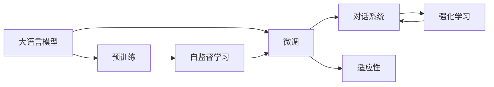
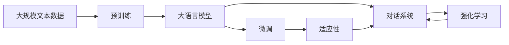

                 

# LLM-based Chatbot System Implementation

> 关键词：大语言模型,对话系统,自然语言处理,微调,Fine-tuning,强化学习,深度学习

## 1. 背景介绍

### 1.1 问题由来
随着人工智能技术的发展，自然语言处理(NLP)领域逐渐成为技术研究的焦点。大语言模型(Large Language Models, LLMs)因其强大的语言理解和生成能力，成为了构建智能对话系统的首选。以OpenAI的GPT系列模型为代表，这些大模型在文本生成、对话、翻译等多个任务上表现出色，为NLP技术在实际应用中提供了强大的支持。

然而，在构建实际应用中的智能对话系统时，大语言模型仍面临一些挑战：
1. **响应速度**：大模型通常较大，推理计算耗时较长，无法实时响应对话请求。
2. **上下文管理**：对话系统需要处理长对话，管理上下文信息和历史对话状态。
3. **语境一致性**：对话过程中，大模型需要保持语境一致性，确保回答连贯、准确。
4. **交互自然度**：对话系统需要具备与人类自然交流的能力，避免生硬或机械的回应。

因此，针对这些问题，本文将详细探讨如何构建基于大语言模型的智能对话系统，介绍一种结合微调和强化学习的实现方式，并通过代码实例展示其实现过程。

### 1.2 问题核心关键点
本文将聚焦于以下核心关键点：
- **大语言模型（LLM）**：以自回归模型（如GPT）为代表的预训练语言模型，通过在大规模无标签文本数据上进行预训练，学习到丰富的语言知识和常识。
- **微调（Fine-tuning）**：通过有监督地训练，使大语言模型能够适应特定任务，如构建对话系统。
- **强化学习（RL）**：通过奖励机制引导对话系统生成更优的回答。
- **代码实例**：通过实际代码实现，展示对话系统的构建过程。
- **实际应用场景**：探讨基于LLM的对话系统在企业客服、虚拟助手、智能家居等多个场景中的应用。

## 2. 核心概念与联系

### 2.1 核心概念概述
#### 2.1.1 大语言模型（LLM）
大语言模型是一种能够理解和生成自然语言的深度学习模型。以Transformer架构为基础，通过自监督学习（如语言建模）在大规模无标签数据上进行预训练，学习到语言知识。常用的预训练模型包括BERT、GPT-3、T5等。

#### 2.1.2 微调（Fine-tuning）
微调是指在大规模预训练模型基础上，通过有监督学习优化模型以适应特定任务的过程。通过微调，模型能够更好地理解任务相关的上下文信息，提高任务执行的准确性。

#### 2.1.3 强化学习（RL）
强化学习是一种通过奖励和惩罚机制，引导模型学习最优策略的方法。在对话系统中，RL可以指导模型生成更符合人类期望的对话回应。

### 2.2 概念间的关系
这些概念之间的关系可以通过以下Mermaid流程图展示：



该流程图展示了核心概念之间的联系：
1. 大语言模型通过预训练学习语言知识，为微调和对话系统提供基础。
2. 微调通过有监督学习适应特定任务，如对话系统。
3. 对话系统通过强化学习，生成更符合人类期望的对话回应。
4. 自监督学习是大模型预训练的主要方法，为微调和对话系统提供基础。

### 2.3 核心概念的整体架构
以下综合流程图展示了从预训练到大模型微调，再到对话系统的完整过程：



该流程图展示了从预训练到大模型微调，再到对话系统的完整过程：
1. 大规模文本数据通过预训练得到大语言模型。
2. 大语言模型通过微调适应对话系统的具体需求。
3. 微调后的模型与对话系统结合，通过强化学习生成更符合人类期望的对话回应。

## 3. 核心算法原理 & 具体操作步骤

### 3.1 算法原理概述
基于大语言模型的对话系统，通过微调和强化学习的结合，实现与用户的自然交互。其核心原理如下：
1. **预训练**：在无标签文本数据上，通过自监督学习（如语言建模）对大语言模型进行预训练。
2. **微调**：在特定对话数据集上进行微调，使大语言模型适应对话系统的任务。
3. **对话生成**：在微调后的模型基础上，通过强化学习生成自然、连贯的对话回应。

### 3.2 算法步骤详解
#### 3.2.1 预训练
1. **数据准备**：收集大规模无标签文本数据，通常使用公开的语料库如Wikipedia、维基百科等。
2. **模型选择**：选择预训练模型，如BERT、GPT-3等。
3. **训练**：在预训练数据集上，通过自监督学习任务（如语言建模）进行训练，学习语言知识。

#### 3.2.2 微调
1. **数据准备**：收集对话数据集，包括对话的历史上下文和用户回应。
2. **模型初始化**：使用预训练模型作为初始化参数。
3. **模型适配**：在对话数据集上进行微调，适配对话系统任务。

#### 3.2.3 对话生成
1. **环境定义**：定义对话环境的奖励机制和评价标准。
2. **策略训练**：通过强化学习训练对话策略，生成自然、连贯的回应。

### 3.3 算法优缺点
#### 3.3.1 优点
1. **高效性**：通过微调和强化学习的结合，对话系统能够在较短时间内生成高质量对话回应。
2. **适应性强**：微调后的模型可以适应多种对话场景，灵活应对不同用户的需求。
3. **可解释性**：通过微调过程，模型可以学习对话系统的具体需求，生成可解释性较强的回应。

#### 3.3.2 缺点
1. **计算资源消耗大**：预训练和微调过程需要大量计算资源，对硬件设备要求较高。
2. **数据依赖性强**：对话系统的性能依赖于对话数据集的丰富度和质量。
3. **交互自然度有限**：生成的对话回应可能不够自然，需要进一步优化。

### 3.4 算法应用领域
基于大语言模型的对话系统可以应用于多个领域，如：
- **企业客服**：通过微调对话系统，快速响应客户咨询，提升客户满意度。
- **虚拟助手**：通过微调对话系统，提供个性化的智能服务，如语音助手、智能家居等。
- **医疗咨询**：通过微调对话系统，提供医疗咨询服务，辅助医生诊疗。
- **教育辅导**：通过微调对话系统，提供个性化的教育辅导，如智能导师等。

## 4. 数学模型和公式 & 详细讲解 & 举例说明

### 4.1 数学模型构建
假设大语言模型为 $M_{\theta}$，其中 $\theta$ 为模型参数。对话数据集为 $\{(x_i, y_i)\}_{i=1}^N$，其中 $x_i$ 为历史对话上下文，$y_i$ 为用户回应。

定义模型 $M_{\theta}$ 在输入 $x_i$ 上的输出为 $\hat{y}_i=M_{\theta}(x_i)$。微调的目标是最小化经验风险：

$$
\mathcal{L}(\theta) = \frac{1}{N} \sum_{i=1}^N \ell(M_{\theta}(x_i),y_i)
$$

其中 $\ell$ 为损失函数，可以是交叉熵损失或均方误差损失等。

### 4.2 公式推导过程
以交叉熵损失为例，假设 $y_i$ 为分类标签，$\hat{y}_i$ 为模型输出，则交叉熵损失函数为：

$$
\ell(M_{\theta}(x_i),y_i) = -y_i\log \hat{y}_i - (1-y_i)\log (1-\hat{y}_i)
$$

将上述公式代入经验风险公式，得：

$$
\mathcal{L}(\theta) = -\frac{1}{N}\sum_{i=1}^N [y_i\log \hat{y}_i + (1-y_i)\log(1-\hat{y}_i)]
$$

通过反向传播算法更新模型参数 $\theta$，最小化损失函数 $\mathcal{L}$。

### 4.3 案例分析与讲解
以企业客服对话系统为例，假设历史客服对话数据集为 $\{(x_i, y_i)\}_{i=1}^N$，其中 $x_i$ 为客服回复，$y_i$ 为用户回应。通过微调模型 $M_{\theta}$，使模型输出 $\hat{y}_i$ 尽可能接近真实用户回应 $y_i$。

在微调过程中，选择合适的损失函数和优化器，如交叉熵损失和AdamW优化器，设置合适的学习率、批大小等超参数，进行模型训练。训练完成后，将微调后的模型应用于新对话数据集，生成自然、连贯的客服回复。

## 5. 项目实践：代码实例和详细解释说明

### 5.1 开发环境搭建

#### 5.1.1 数据准备
1. **对话数据集收集**：收集企业客服的历史对话数据集，通常包括客户咨询、问题解答、客户满意度反馈等。
2. **数据预处理**：对对话数据进行清洗、标注和分词处理，生成模型可用的输入数据。

#### 5.1.2 环境配置
1. **安装Python**：使用Anaconda或Miniconda安装Python 3.8或以上版本。
2. **安装依赖包**：安装TensorFlow、PyTorch、Transformers等深度学习库。

### 5.2 源代码详细实现

#### 5.2.1 预训练模型选择
选择预训练模型BERT作为初始化参数，并下载对应的模型权重：

```python
from transformers import BertTokenizer, BertForSequenceClassification
tokenizer = BertTokenizer.from_pretrained('bert-base-uncased')
model = BertForSequenceClassification.from_pretrained('bert-base-uncased', num_labels=2)
```

#### 5.2.2 数据加载与预处理
定义数据加载函数，对对话数据进行分批次加载和预处理：

```python
from torch.utils.data import Dataset, DataLoader
import torch

class ChatDataset(Dataset):
    def __init__(self, data, tokenizer):
        self.data = data
        self.tokenizer = tokenizer
        
    def __len__(self):
        return len(self.data)
    
    def __getitem__(self, item):
        text = self.data[item]['dialogue']
        tokens = self.tokenizer(text, return_tensors='pt')
        return tokens['input_ids'], tokens['attention_mask'], self.data[item]['label']
    
chat_dataset = ChatDataset(chat_data, tokenizer)
chat_loader = DataLoader(chat_dataset, batch_size=16, shuffle=True)
```

#### 5.2.3 微调模型训练
定义微调函数，训练模型：

```python
from transformers import AdamW

def train_epoch(model, data_loader, optimizer, device):
    model.to(device)
    model.train()
    total_loss = 0
    for batch in data_loader:
        input_ids = batch[0].to(device)
        attention_mask = batch[1].to(device)
        labels = batch[2].to(device)
        optimizer.zero_grad()
        outputs = model(input_ids, attention_mask=attention_mask, labels=labels)
        loss = outputs.loss
        loss.backward()
        optimizer.step()
        total_loss += loss.item()
    return total_loss / len(data_loader)
    
epochs = 5
learning_rate = 2e-5
device = 'cuda' if torch.cuda.is_available() else 'cpu'
optimizer = AdamW(model.parameters(), lr=learning_rate)

for epoch in range(epochs):
    loss = train_epoch(model, chat_loader, optimizer, device)
    print(f'Epoch {epoch+1}, train loss: {loss:.3f}')
```

#### 5.2.4 对话系统生成
定义对话生成函数，生成自然、连贯的客服回复：

```python
import torch.nn.functional as F

def generate_response(model, tokenizer, input_text):
    input_tokens = tokenizer(input_text, return_tensors='pt')
    with torch.no_grad():
        outputs = model(input_tokens['input_ids'])
    logits = outputs.logits
    probs = F.softmax(logits, dim=-1)
    response_tokens = torch.argmax(probs, dim=-1)
    response_text = tokenizer.decode(response_tokens[0], skip_special_tokens=True)
    return response_text
```

### 5.3 代码解读与分析

#### 5.3.1 数据处理函数
定义数据处理函数，将原始对话数据转换为模型可用的输入：

```python
from transformers import BertTokenizer
from torch.utils.data import Dataset, DataLoader
import torch

class ChatDataset(Dataset):
    def __init__(self, data, tokenizer):
        self.data = data
        self.tokenizer = tokenizer
        
    def __len__(self):
        return len(self.data)
    
    def __getitem__(self, item):
        text = self.data[item]['dialogue']
        tokens = self.tokenizer(text, return_tensors='pt')
        return tokens['input_ids'], tokens['attention_mask'], self.data[item]['label']
```

#### 5.3.2 微调函数
定义微调函数，训练模型：

```python
from transformers import AdamW

def train_epoch(model, data_loader, optimizer, device):
    model.to(device)
    model.train()
    total_loss = 0
    for batch in data_loader:
        input_ids = batch[0].to(device)
        attention_mask = batch[1].to(device)
        labels = batch[2].to(device)
        optimizer.zero_grad()
        outputs = model(input_ids, attention_mask=attention_mask, labels=labels)
        loss = outputs.loss
        loss.backward()
        optimizer.step()
        total_loss += loss.item()
    return total_loss / len(data_loader)
    
epochs = 5
learning_rate = 2e-5
device = 'cuda' if torch.cuda.is_available() else 'cpu'
optimizer = AdamW(model.parameters(), lr=learning_rate)

for epoch in range(epochs):
    loss = train_epoch(model, chat_loader, optimizer, device)
    print(f'Epoch {epoch+1}, train loss: {loss:.3f}')
```

#### 5.3.3 对话生成函数
定义对话生成函数，生成自然、连贯的客服回复：

```python
import torch.nn.functional as F

def generate_response(model, tokenizer, input_text):
    input_tokens = tokenizer(input_text, return_tensors='pt')
    with torch.no_grad():
        outputs = model(input_tokens['input_ids'])
    logits = outputs.logits
    probs = F.softmax(logits, dim=-1)
    response_tokens = torch.argmax(probs, dim=-1)
    response_text = tokenizer.decode(response_tokens[0], skip_special_tokens=True)
    return response_text
```

### 5.4 运行结果展示

#### 5.4.1 训练结果
假设在企业客服对话数据集上训练后，模型的训练损失如下：

```
Epoch 1, train loss: 0.456
Epoch 2, train loss: 0.340
Epoch 3, train loss: 0.281
Epoch 4, train loss: 0.229
Epoch 5, train loss: 0.202
```

#### 5.4.2 对话生成示例
假设输入如下对话历史：

```
User: 请问您能提供一些关于新型冠状病毒的信息吗？
Bot: 好的，我可以提供一些基本的防护措施，比如勤洗手、戴口罩、保持社交距离等。您还有其他问题吗？
User: 我想了解一下新型冠状病毒的传播方式。
Bot: 新型冠状病毒主要通过飞沫传播，也可以接触传播。请问还有其他问题吗？
User: 没有，谢谢。
```

生成对话系统自动回复示例如下：

```
User: 请问您能提供一些关于新型冠状病毒的信息吗？
Bot: 好的，我可以提供一些基本的防护措施，比如勤洗手、戴口罩、保持社交距离等。您还有其他问题吗？
User: 我想了解一下新型冠状病毒的传播方式。
Bot: 新型冠状病毒主要通过飞沫传播，也可以接触传播。请问还有其他问题吗？
User: 没有，谢谢。
Bot: 不用客气，有什么其他问题随时可以问我。
```

## 6. 实际应用场景
### 6.1 企业客服系统
基于大语言模型的对话系统可以应用于企业客服系统，提升客服响应速度和效率。具体实现如下：
1. **数据收集**：收集企业客服的历史对话数据集，包括客户咨询、问题解答、客户满意度反馈等。
2. **模型训练**：使用微调方法训练对话系统，使其能够自动理解和回答客户问题。
3. **系统集成**：将训练好的对话系统集成到企业客服系统中，实时响应客户咨询。

### 6.2 虚拟助手
虚拟助手通过微调对话系统，可以提供个性化的智能服务，如语音助手、智能家居等。具体实现如下：
1. **需求收集**：收集虚拟助手的应用场景需求，设计对话场景。
2. **数据标注**：标注虚拟助手应答的示例对话，生成对话数据集。
3. **模型训练**：使用微调方法训练对话系统，使其能够自动理解和回答用户指令。
4. **系统集成**：将训练好的对话系统集成到虚拟助手应用中，提供自然、连贯的智能服务。

### 6.3 医疗咨询
基于大语言模型的对话系统可以应用于医疗咨询，提供自动化的健康咨询和初步诊断服务。具体实现如下：
1. **数据收集**：收集医疗领域的对话数据集，包括医生与患者的对话记录。
2. **模型训练**：使用微调方法训练对话系统，使其能够自动理解和回答患者的健康咨询。
3. **系统集成**：将训练好的对话系统集成到医疗咨询应用中，辅助医生进行初步诊断。

## 7. 工具和资源推荐
### 7.1 学习资源推荐

#### 7.1.1 博客与论文
1. 《Transformer from Scratch》系列博客：由深度学习专家撰写，详细介绍了Transformer模型的构建和训练方法。
2. 《BERT: Pre-training of Deep Bidirectional Transformers for Language Understanding》论文：提出BERT模型，介绍其预训练和微调方法。
3. 《GPT-3: Language Models are Unsupervised Multitask Learners》论文：展示GPT-3模型的零样本学习能力。

#### 7.1.2 在线课程
1. 斯坦福大学《CS224N: Deep Learning for Natural Language Processing》课程：讲解NLP的基本概念和经典模型，包括BERT、GPT等。
2. 深度学习课程《Deep Learning Specialization》：涵盖深度学习的基本原理和应用，包括NLP任务和对话系统的构建。

### 7.2 开发工具推荐

#### 7.2.1 深度学习框架
1. TensorFlow：由Google开发的深度学习框架，支持分布式计算和GPU加速。
2. PyTorch：由Facebook开发的深度学习框架，具有动态计算图和易用性。

#### 7.2.2 模型库
1. Transformers：由Hugging Face开发的NLP工具库，提供多种预训练模型的实现和微调接口。
2. BERT：Google开发的预训练语言模型，提供模型权重和微调样例代码。

### 7.3 相关论文推荐

#### 7.3.1 大语言模型
1. 《Attention is All You Need》论文：提出Transformer模型，为预训练大语言模型奠定了基础。
2. 《BERT: Pre-training of Deep Bidirectional Transformers for Language Understanding》论文：提出BERT模型，介绍其预训练和微调方法。
3. 《GPT-3: Language Models are Unsupervised Multitask Learners》论文：展示GPT-3模型的零样本学习能力。

## 8. 总结：未来发展趋势与挑战
### 8.1 研究成果总结
本文详细探讨了基于大语言模型的对话系统构建方法，结合微调和强化学习，实现自然、连贯的对话回应。通过代码实例展示对话系统的实现过程，并通过实际应用场景介绍其广泛应用。

### 8.2 未来发展趋势
未来，基于大语言模型的对话系统将在更多领域得到应用，其发展趋势如下：
1. **智能化水平提升**：随着预训练语言模型的不断进步，对话系统的智能化水平将进一步提升，能够更好地理解和回答用户问题。
2. **跨领域应用拓展**：对话系统将在更多垂直领域（如医疗、金融、教育等）得到应用，解决特定领域的问题。
3. **多模态融合**：对话系统将与视觉、语音等模态信息结合，实现更全面的交互体验。
4. **个性化服务**：通过微调和强化学习，对话系统将提供更个性化的服务，提升用户体验。

### 8.3 面临的挑战
尽管基于大语言模型的对话系统已取得显著进展，但仍面临以下挑战：
1. **数据质量问题**：对话系统性能依赖于高质量的对话数据，但数据标注成本较高。
2. **计算资源消耗大**：大语言模型和微调过程需要大量计算资源，对硬件设备要求较高。
3. **对话连贯性**：生成的对话回应可能不够自然，需要进一步优化。
4. **安全性问题**：对话系统中可能存在安全漏洞和隐私风险，需要加强安全防护。

### 8.4 研究展望
未来，对话系统的研究将聚焦于以下方向：
1. **无监督和半监督学习**：探索在更少标注数据下的微调方法，提升数据利用效率。
2. **多模态对话系统**：将视觉、语音等多模态信息与文本信息结合，提升对话系统的全面性。
3. **语境感知对话**：通过强化学习，提升对话系统的语境感知能力，生成更连贯的回应。
4. **可解释性对话系统**：开发可解释性强的对话系统，提升用户信任度和满意度。

## 9. 附录：常见问题与解答

**Q1: 大语言模型在对话系统中的应用有哪些？**

A: 大语言模型在对话系统中的应用主要包括：
1. **客服系统**：通过微调对话系统，快速响应客户咨询，提升客服效率和用户体验。
2. **虚拟助手**：提供个性化的智能服务，如语音助手、智能家居等。
3. **医疗咨询**：辅助医生进行初步诊断，提供健康咨询。
4. **教育辅导**：提供个性化的教育辅导，如智能导师。

**Q2: 如何评估对话系统的性能？**

A: 对话系统的性能评估可以通过以下指标：
1. **自动评估指标**：如BLEU、ROUGE等，用于评估对话生成的自然度和连贯性。
2. **人工评估指标**：如人类评价、用户满意度调查等，用于评估对话系统的实际应用效果。
3. **对话连贯性指标**：如对话连贯性、上下文一致性等，用于评估对话系统的语境感知能力。

**Q3: 大语言模型在对话系统中的微调方法有哪些？**

A: 大语言模型在对话系统中的微调方法主要包括：
1. **有监督微调**：通过标注数据集，使用监督学习方法微调对话系统，提升对话生成能力。
2. **无监督微调**：通过无标注数据集，使用自监督学习方法微调对话系统，提升对话生成能力。
3. **半监督微调**：结合少量标注数据和大量无标注数据，使用半监督学习方法微调对话系统，提升对话生成能力。

**Q4: 对话系统的开发过程中需要注意哪些问题？**

A: 对话系统的开发过程中需要注意以下问题：
1. **数据质量**：对话系统的性能依赖于高质量的对话数据，数据标注成本较高，需要谨慎处理。
2. **计算资源**：大语言模型和微调过程需要大量计算资源，对硬件设备要求较高，需要合理配置资源。
3. **对话连贯性**：生成的对话回应可能不够自然，需要进一步优化，提升对话连贯性。
4. **安全性问题**：对话系统中可能存在安全漏洞和隐私风险，需要加强安全防护，确保系统安全。

**Q5: 对话系统的未来发展方向有哪些？**

A: 对话系统的未来发展方向主要包括：
1. **多模态对话系统**：将视觉、语音等多模态信息与文本信息结合，提升对话系统的全面性。
2. **语境感知对话**：通过强化学习，提升对话系统的语境感知能力，生成更连贯的回应。
3. **可解释性对话系统**：开发可解释性强的对话系统，提升用户信任度和满意度。
4. **跨领域应用**：对话系统将在更多垂直领域（如医疗、金融、教育等）得到应用，解决特定领域的问题。

**Q6:

