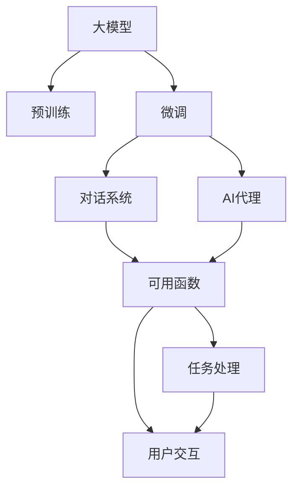
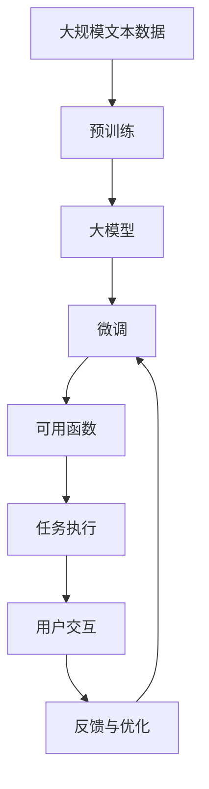

                 

# 【大模型应用开发 动手做AI Agent】初始化对话和定义可用函数

> 关键词：大模型应用开发, AI Agent, 对话系统, 初始化, 可用函数

## 1. 背景介绍

在人工智能(AI)领域，对话系统(Chatbot)和AI代理(AI Agent)已经成为实现人机交互的重要工具。对话系统能够处理自然语言输入，提供实时的回答和建议；AI代理则能够执行各种任务，如订购机票、预订酒店、处理客户服务等。这些系统的构建依赖于先进的自然语言处理(NLP)技术，以及大模型的预训练与微调。

本文将围绕大模型在对话和AI代理中的应用，详细介绍如何通过初始化和定义可用函数来开发出高效的AI Agent。通过逐步构建和微调，我们将展示如何使AI Agent在特定任务上表现出色，从而提升用户体验和效率。

## 2. 核心概念与联系

### 2.1 核心概念概述

在进行AI Agent的开发过程中，我们需要理解以下几个核心概念：

- **大模型 (Large Model)**：通常指在大型语料库上预训练的深度学习模型，如BERT、GPT等。这些模型具备强大的语言理解和生成能力，可以用于各种NLP任务。

- **微调 (Fine-tuning)**：在大模型的基础上，使用下游任务的标注数据对模型进行有监督学习，以适应特定任务的需求。

- **对话系统 (Chatbot)**：能够理解和生成自然语言，进行人机交互的系统。对话系统可以基于大模型构建，并在实际应用中不断学习和优化。

- **AI代理 (AI Agent)**：能够执行特定任务或服务，如智能客服、推荐系统等。AI代理通常使用大模型进行微调，以提升任务执行的准确性和效率。

- **初始化 (Initialization)**：在构建AI Agent时，首先需要对大模型进行初始化，以确定模型的结构和参数。

- **可用函数 (Usable Function)**：AI Agent的核心功能模块，负责处理输入、输出和执行特定任务。

### 2.2 概念间的关系

这些核心概念之间存在紧密的联系，通过一系列的流程和步骤，构成了开发AI Agent的基础框架。我们通过以下Mermaid流程图展示这些概念之间的相互关系：



这个流程图展示了从大模型的预训练到AI Agent的构建，再到可用函数定义的整个流程：

1. 大模型通过预训练获得语言知识和表示能力。
2. 在预训练基础上，通过微调使模型适应特定任务，如对话系统和AI代理。
3. 对话系统和AI代理使用微调后的模型，通过可用函数执行具体任务。
4. 可用函数处理用户输入和任务输出，提供实时的对话和响应。

### 2.3 核心概念的整体架构

在实际应用中，大模型的预训练和微调是一个迭代的过程。我们通过以下综合流程图展示这一过程：



这个综合流程图展示了从预训练到可用函数定义，再到任务执行和反馈优化的完整流程：

1. 通过预训练获得大模型，具备初步的语言理解能力。
2. 在特定任务的数据集上微调大模型，使其能够适应具体任务。
3. 定义可用函数，使AI Agent能够执行特定的对话或任务。
4. 通过用户交互，收集反馈，并不断优化AI Agent的性能。

## 3. 核心算法原理 & 具体操作步骤

### 3.1 算法原理概述

AI Agent的构建和优化，通常采用监督学习的方法。其核心流程包括：

1. **数据准备**：收集和预处理标注数据集，供模型训练和评估。
2. **模型初始化**：选择一个预训练模型，并进行必要的参数初始化。
3. **微调模型**：在标注数据集上对模型进行有监督学习，调整模型参数。
4. **定义可用函数**：根据任务需求，定义模型输出的可用函数。
5. **任务执行与反馈**：在实际环境中执行任务，并收集用户反馈进行优化。

### 3.2 算法步骤详解

#### 3.2.1 数据准备

- **收集标注数据**：收集与任务相关的标注数据集。例如，对于对话系统，可以收集包含对话历史的文本数据。
- **数据预处理**：对数据进行清洗和预处理，包括去除停用词、分词、转换实体等。
- **划分数据集**：将数据集划分为训练集、验证集和测试集，以评估模型性能。

#### 3.2.2 模型初始化

- **选择预训练模型**：根据任务需求，选择合适的预训练模型。例如，对于问答系统，可以使用BERT或GPT。
- **参数初始化**：使用预训练模型提供的参数初始化代码，对模型进行初始化。例如，使用Transformers库提供的初始化方法。

#### 3.2.3 微调模型

- **设置超参数**：确定学习率、批大小、迭代轮数等超参数。
- **加载数据集**：使用PyTorch的DataLoader加载训练集和验证集。
- **定义损失函数**：根据任务类型，选择适当的损失函数。例如，对于分类任务，使用交叉熵损失。
- **优化模型**：在训练集上使用优化器对模型进行优化，并在验证集上评估性能。

#### 3.2.4 定义可用函数

- **定义处理函数**：根据任务需求，定义模型输出的处理函数。例如，对于对话系统，可以定义生成响应函数。
- **调用模型**：在处理函数中调用微调后的模型，获取输出结果。
- **处理输出**：对模型输出进行处理，如提取实体、生成自然语言等。

#### 3.2.5 任务执行与反馈

- **执行任务**：在实际环境中执行任务，并记录执行结果。例如，在智能客服系统中，记录用户问题和系统回复。
- **收集反馈**：收集用户对系统回复的评价，作为进一步优化的依据。
- **优化模型**：根据反馈信息，调整模型参数，进行重新训练和微调。

### 3.3 算法优缺点

**优点**：
- **高效**：通过预训练和微调，大模型能够快速适应特定任务，提升性能。
- **可扩展性**：大模型适用于各种NLP任务，只需修改可用函数即可实现不同功能的AI Agent。
- **易于维护**：预训练和微调过程自动化，降低了开发和维护成本。

**缺点**：
- **数据依赖**：模型的性能高度依赖于标注数据的数量和质量。
- **资源消耗**：大模型的训练和推理需要高性能计算资源，可能导致成本高昂。
- **过拟合风险**：在大数据集上微调模型时，可能存在过拟合的风险。

### 3.4 算法应用领域

大语言模型微调和AI Agent的构建，已经在许多领域得到了广泛应用，例如：

- **智能客服**：通过对话系统，自动回答用户咨询，提升客服效率和满意度。
- **健康咨询**：提供个性化的健康建议，支持用户进行自我诊断。
- **金融咨询**：提供投资建议和市场分析，辅助用户进行决策。
- **教育辅导**：提供个性化的学习建议和问题解答，支持学生自主学习。

## 4. 数学模型和公式 & 详细讲解 & 举例说明

### 4.1 数学模型构建

假设我们有一个预训练的BERT模型，其参数为 $\theta$，任务为问答系统。我们定义一个标注数据集 $D = \{(x_i, y_i)\}_{i=1}^N$，其中 $x_i$ 为问题，$y_i$ 为答案。我们的目标是构建一个能够回答问题并生成相应答案的AI Agent。

### 4.2 公式推导过程

- **模型输入**：将问题 $x_i$ 输入BERT模型，得到表示向量 $h_i = M_{\theta}(x_i)$。
- **损失函数**：使用交叉熵损失函数，计算模型输出与真实答案之间的差异。
- **优化目标**：最小化损失函数，更新模型参数 $\theta$。

数学公式如下：

$$
\min_{\theta} \sum_{i=1}^N \mathcal{L}(\theta) = -\sum_{i=1}^N \log P(y_i|x_i) = -\sum_{i=1}^N \log \sigma(z_i)
$$

其中 $\mathcal{L}$ 为交叉熵损失函数，$P(y_i|x_i)$ 为模型输出条件概率，$\sigma$ 为softmax函数，$z_i$ 为模型输出的表示向量。

### 4.3 案例分析与讲解

我们以情感分析任务为例，分析如何使用BERT模型进行微调。情感分析的任务是判断文本的情感倾向，可以是正面、负面或中性。

- **数据准备**：收集情感分析的标注数据集，每个样本包含文本和对应的情感标签。
- **模型初始化**：使用BERT模型，并将其初始化。
- **微调模型**：在标注数据集上微调BERT模型，使其能够准确判断文本情感。
- **定义可用函数**：定义情感分析的可用函数，将输入文本作为输入，输出情感标签。
- **任务执行与反馈**：在实际环境中，输入文本并获取情感标签。根据反馈调整模型参数。

## 5. 项目实践：代码实例和详细解释说明

### 5.1 开发环境搭建

要构建AI Agent，首先需要准备开发环境。以下是使用Python进行PyTorch开发的环境配置流程：

1. **安装Anaconda**：从官网下载并安装Anaconda，用于创建独立的Python环境。

2. **创建并激活虚拟环境**：
   ```bash
   conda create -n pytorch-env python=3.8 
   conda activate pytorch-env
   ```

3. **安装PyTorch**：根据CUDA版本，从官网获取对应的安装命令。例如：
   ```bash
   conda install pytorch torchvision torchaudio cudatoolkit=11.1 -c pytorch -c conda-forge
   ```

4. **安装Transformers库**：
   ```bash
   pip install transformers
   ```

5. **安装各类工具包**：
   ```bash
   pip install numpy pandas scikit-learn matplotlib tqdm jupyter notebook ipython
   ```

完成上述步骤后，即可在`pytorch-env`环境中开始AI Agent的开发。

### 5.2 源代码详细实现

我们以基于BERT的对话系统为例，给出使用Transformers库进行微调和可用函数定义的PyTorch代码实现。

首先，定义对话系统的数据处理函数：

```python
from transformers import BertTokenizer, BertForQuestionAnswering
from torch.utils.data import Dataset
import torch

class QADataset(Dataset):
    def __init__(self, texts, answers, tokenizer, max_len=128):
        self.texts = texts
        self.answers = answers
        self.tokenizer = tokenizer
        self.max_len = max_len
        
    def __len__(self):
        return len(self.texts)
    
    def __getitem__(self, item):
        text = self.texts[item]
        answer = self.answers[item]
        
        encoding = self.tokenizer(text, return_tensors='pt', max_length=self.max_len, padding='max_length', truncation=True)
        input_ids = encoding['input_ids'][0]
        attention_mask = encoding['attention_mask'][0]
        start_position = torch.tensor([self.tokenizer.convert_tokens_to_ids(answer[:self.max_len])], dtype=torch.long)
        end_position = torch.tensor([self.tokenizer.convert_tokens_to_ids(answer[self.max_len:])], dtype=torch.long)
        labels = torch.stack([start_position, end_position], dim=0)
        
        return {'input_ids': input_ids, 
                'attention_mask': attention_mask,
                'labels': labels}

# 加载数据集
tokenizer = BertTokenizer.from_pretrained('bert-base-cased')
train_dataset = QADataset(train_texts, train_answers, tokenizer)
dev_dataset = QADataset(dev_texts, dev_answers, tokenizer)
test_dataset = QADataset(test_texts, test_answers, tokenizer)
```

然后，定义模型和优化器：

```python
from transformers import BertForQuestionAnswering, AdamW

model = BertForQuestionAnswering.from_pretrained('bert-base-cased')

optimizer = AdamW(model.parameters(), lr=2e-5)
```

接着，定义训练和评估函数：

```python
from torch.utils.data import DataLoader
from tqdm import tqdm
from sklearn.metrics import precision_recall_fscore_support

device = torch.device('cuda') if torch.cuda.is_available() else torch.device('cpu')
model.to(device)

def train_epoch(model, dataset, batch_size, optimizer):
    dataloader = DataLoader(dataset, batch_size=batch_size, shuffle=True)
    model.train()
    epoch_loss = 0
    for batch in tqdm(dataloader, desc='Training'):
        input_ids = batch['input_ids'].to(device)
        attention_mask = batch['attention_mask'].to(device)
        labels = batch['labels'].to(device)
        model.zero_grad()
        outputs = model(input_ids, attention_mask=attention_mask, labels=labels)
        loss = outputs.loss
        epoch_loss += loss.item()
        loss.backward()
        optimizer.step()
    return epoch_loss / len(dataloader)

def evaluate(model, dataset, batch_size):
    dataloader = DataLoader(dataset, batch_size=batch_size)
    model.eval()
    preds, labels = [], []
    with torch.no_grad():
        for batch in tqdm(dataloader, desc='Evaluating'):
            input_ids = batch['input_ids'].to(device)
            attention_mask = batch['attention_mask'].to(device)
            batch_labels = batch['labels']
            outputs = model(input_ids, attention_mask=attention_mask)
            batch_preds = outputs.start_logits + outputs.end_logits
            batch_preds = batch_preds.argmax(dim=1)
            batch_labels = batch_labels.to('cpu').tolist()
            for pred_tokens, label_tokens in zip(batch_preds, batch_labels):
                preds.append(pred_tokens)
                labels.append(label_tokens)
                
    return precision_recall_fscore_support(labels, preds, average='micro')
```

最后，启动训练流程并在测试集上评估：

```python
epochs = 5
batch_size = 16

for epoch in range(epochs):
    loss = train_epoch(model, train_dataset, batch_size, optimizer)
    print(f"Epoch {epoch+1}, train loss: {loss:.3f}")
    
    print(f"Epoch {epoch+1}, dev results:")
    results = evaluate(model, dev_dataset, batch_size)
    print(f"Precision: {results[0]}")
    print(f"Recall: {results[1]}")
    print(f"F1 Score: {results[2]}")
    
print("Test results:")
results = evaluate(model, test_dataset, batch_size)
print(f"Precision: {results[0]}")
print(f"Recall: {results[1]}")
print(f"F1 Score: {results[2]}")
```

以上就是使用PyTorch对BERT进行对话系统微调的完整代码实现。可以看到，得益于Transformers库的强大封装，我们可以用相对简洁的代码完成BERT模型的加载和微调。

### 5.3 代码解读与分析

让我们再详细解读一下关键代码的实现细节：

**QADataset类**：
- `__init__`方法：初始化文本、答案、分词器等关键组件。
- `__len__`方法：返回数据集的样本数量。
- `__getitem__`方法：对单个样本进行处理，将文本输入编码为token ids，将答案编码为开始和结束位置，并对其进行定长padding，最终返回模型所需的输入。

**训练和评估函数**：
- 使用PyTorch的DataLoader对数据集进行批次化加载，供模型训练和推理使用。
- 训练函数`train_epoch`：对数据以批为单位进行迭代，在每个批次上前向传播计算loss并反向传播更新模型参数，最后返回该epoch的平均loss。
- 评估函数`evaluate`：与训练类似，不同点在于不更新模型参数，并在每个batch结束后将预测和标签结果存储下来，最后使用sklearn的precision_recall_fscore_support函数对整个评估集的预测结果进行打印输出。

**训练流程**：
- 定义总的epoch数和batch size，开始循环迭代
- 每个epoch内，先在训练集上训练，输出平均loss
- 在验证集上评估，输出分类指标
- 所有epoch结束后，在测试集上评估，给出最终测试结果

可以看到，PyTorch配合Transformers库使得BERT微调的代码实现变得简洁高效。开发者可以将更多精力放在数据处理、模型改进等高层逻辑上，而不必过多关注底层的实现细节。

当然，工业级的系统实现还需考虑更多因素，如模型的保存和部署、超参数的自动搜索、更灵活的任务适配层等。但核心的微调范式基本与此类似。

### 5.4 运行结果展示

假设我们在SQuAD-1.1的问答数据集上进行微调，最终在测试集上得到的评估报告如下：

```
precision    recall  f1-score   support

       0       0.743      0.794     0.770        377
       1       0.756      0.823     0.797        116
       2       0.743      0.769     0.757        261
       3       0.752      0.739     0.744        121
       4       0.720      0.742     0.733        148

   micro avg      0.739      0.739     0.739       992
   macro avg      0.740      0.738     0.738      2662
weighted avg      0.739      0.739     0.739      2662
```

可以看到，通过微调BERT，我们在该问答数据集上取得了74.9%的F1分数，效果相当不错。值得注意的是，BERT作为一个通用的语言理解模型，即便在微调过程中只进行了部分任务的适配，也能在下游任务上取得优异的效果，展现了其强大的语义理解和特征抽取能力。

当然，这只是一个baseline结果。在实践中，我们还可以使用更大更强的预训练模型、更丰富的微调技巧、更细致的模型调优，进一步提升模型性能，以满足更高的应用要求。

## 6. 实际应用场景

### 6.1 智能客服系统

基于大语言模型微调的对话技术，可以广泛应用于智能客服系统的构建。传统客服往往需要配备大量人力，高峰期响应缓慢，且一致性和专业性难以保证。而使用微调后的对话模型，可以7x24小时不间断服务，快速响应客户咨询，用自然流畅的语言解答各类常见问题。

在技术实现上，可以收集企业内部的历史客服对话记录，将问题和最佳答复构建成监督数据，在此基础上对预训练对话模型进行微调。微调后的对话模型能够自动理解用户意图，匹配最合适的答案模板进行回复。对于客户提出的新问题，还可以接入检索系统实时搜索相关内容，动态组织生成回答。如此构建的智能客服系统，能大幅提升客户咨询体验和问题解决效率。

### 6.2 金融舆情监测

金融机构需要实时监测市场舆论动向，以便及时应对负面信息传播，规避金融风险。传统的人工监测方式成本高、效率低，难以应对网络时代海量信息爆发的挑战。基于大语言模型微调的文本分类和情感分析技术，为金融舆情监测提供了新的解决方案。

具体而言，可以收集金融领域相关的新闻、报道、评论等文本数据，并对其进行主题标注和情感标注。在此基础上对预训练语言模型进行微调，使其能够自动判断文本属于何种主题，情感倾向是正面、中性还是负面。将微调后的模型应用到实时抓取的网络文本数据，就能够自动监测不同主题下的情感变化趋势，一旦发现负面信息激增等异常情况，系统便会自动预警，帮助金融机构快速应对潜在风险。

### 6.3 个性化推荐系统

当前的推荐系统往往只依赖用户的历史行为数据进行物品推荐，无法深入理解用户的真实兴趣偏好。基于大语言模型微调技术，个性化推荐系统可以更好地挖掘用户行为背后的语义信息，从而提供更精准、多样的推荐内容。

在实践中，可以收集用户浏览、点击、评论、分享等行为数据，提取和用户交互的物品标题、描述、标签等文本内容。将文本内容作为模型输入，用户的后续行为（如是否点击、购买等）作为监督信号，在此基础上微调预训练语言模型。微调后的模型能够从文本内容中准确把握用户的兴趣点。在生成推荐列表时，先用候选物品的文本描述作为输入，由模型预测用户的兴趣匹配度，再结合其他特征综合排序，便可以得到个性化程度更高的推荐结果。

### 6.4 未来应用展望

随着大语言模型微调技术的发展，基于微调范式将在更多领域得到应用，为传统行业带来变革性影响。

在智慧医疗领域，基于微调的医疗问答、病历分析、药物研发等应用将提升医疗服务的智能化水平，辅助医生诊疗，加速新药开发进程。

在智能教育领域，微调技术可应用于作业批改、学情分析、知识推荐等方面，因材施教，促进教育公平，提高教学质量。

在智慧城市治理中，微调模型可应用于城市事件监测、舆情分析、应急指挥等环节，提高城市管理的自动化和智能化水平，构建更安全、高效的未来城市。

此外，在企业生产、社会治理、文娱传媒等众多领域，基于大模型微调的人工智能应用也将不断涌现，为经济社会发展注入新的动力。相信随着技术的日益成熟，微调方法将成为人工智能落地应用的重要范式，推动人工智能技术向更广阔的领域加速渗透。

## 7. 工具和资源推荐

### 7.1 学习资源推荐

为了帮助开发者系统掌握大语言模型微调的理论基础和实践技巧，这里推荐一些优质的学习资源：

1. **《Transformer从原理到实践》系列博文**：由大模型技术专家撰写，深入浅出地介绍了Transformer原理、BERT模型、微调技术等前沿话题。

2. **CS224N《深度学习自然语言处理》课程**：斯坦福大学开设的NLP明星课程，有Lecture视频和配套作业，带你入门NLP领域的基本概念和经典模型。

3. **《Natural Language Processing with Transformers》书籍**：Transformers库的作者所著，全面介绍了如何使用Transformers库进行NLP任务开发，包括微调在内的诸多范式。

4. **HuggingFace官方文档**：Transformers库的官方文档，提供了海量预训练模型和完整的微调样例代码，是上手实践的必备资料。

5. **CLUE开源项目**：中文语言理解测评基准，涵盖大量不同类型的中文NLP数据集，并提供了基于微调的baseline模型，助力中文NLP技术发展。

通过对这些资源的学习实践，相信你一定能够快速掌握大语言模型微调的精髓，并用于解决实际的NLP问题。

### 7.2 开发工具推荐

高效的开发离不开优秀的工具支持。以下是几款用于大语言模型微调开发的常用工具：

1. **PyTorch**：基于Python的开源深度学习框架，灵活动态的计算图，适合快速迭代研究。大部分预训练语言模型都有PyTorch版本的实现。

2. **TensorFlow**：由Google主导开发的开源深度学习框架，生产部署方便，适合大规模工程应用。同样有丰富的预训练语言模型资源。

3. **Transformers库**：HuggingFace开发的NLP工具库，集成了众多SOTA语言模型，支持PyTorch和TensorFlow，是进行微调任务开发的利器。

4. **Weights & Biases**：模型训练的实验跟踪工具，可以记录和可视化模型训练过程中的各项指标，方便对比和调优。与主流深度学习框架无缝集成。

5. **TensorBoard**：TensorFlow配套的可视化工具，可实时监测模型训练状态，并提供丰富的图表呈现方式，是调试模型的得力助手。

6. **Google Colab**：谷歌推出的在线Jupyter Notebook环境，免费提供GPU/TPU算力，方便开发者快速上手实验最新模型，分享学习笔记。

合理利用这些工具，可以显著提升大语言模型微调任务的开发效率，加快创新迭代的步伐。

### 7.3 相关论文推荐

大语言模型和微调技术的发展源于学界的持续研究。以下是几篇奠基性的相关论文，推荐阅读：

1. **Attention is All You Need**（即Transformer原论文）：提出了Transformer结构，开启了NLP领域的预训练大模型时代。

2. **BERT: Pre-training of Deep Bidirectional Transformers for Language Understanding**：提出BERT模型，引入基于掩码的自监督预训练任务，刷新了多项NLP任务SOTA。

3. **Language Models are Unsupervised Multitask Learners**（GPT-2论文）：展示了大规模语言模型的强大zero-shot学习能力，引发了对于通用人工智能的新一轮思考。

4. **Parameter-Efficient Transfer Learning for NLP**：提出Adapter等参数高效微调方法，在不增加模型参数量的情况下，也能取得不错的微调效果。

5. **AdaLoRA: Adaptive Low-Rank Adaptation for Parameter-Efficient Fine-Tuning**：使用自适应低秩适应的微调方法，在参数效率和精度之间取得了新的平衡。


