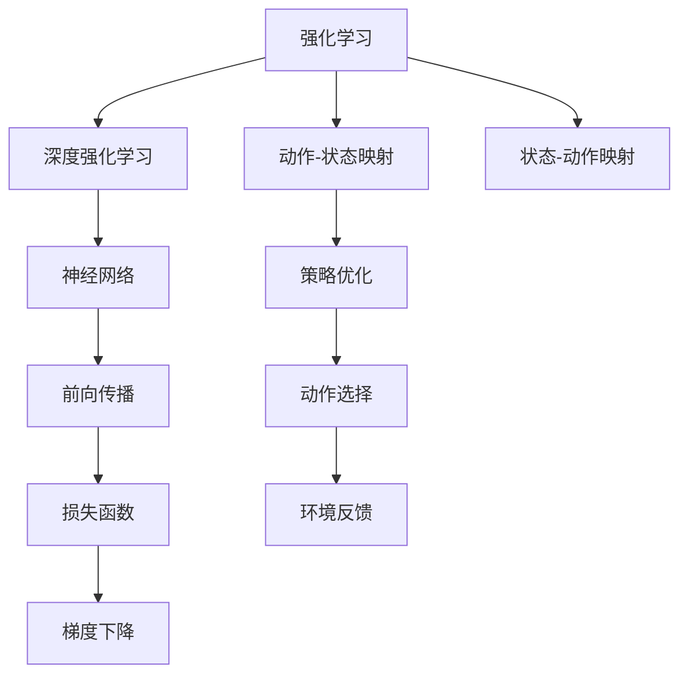
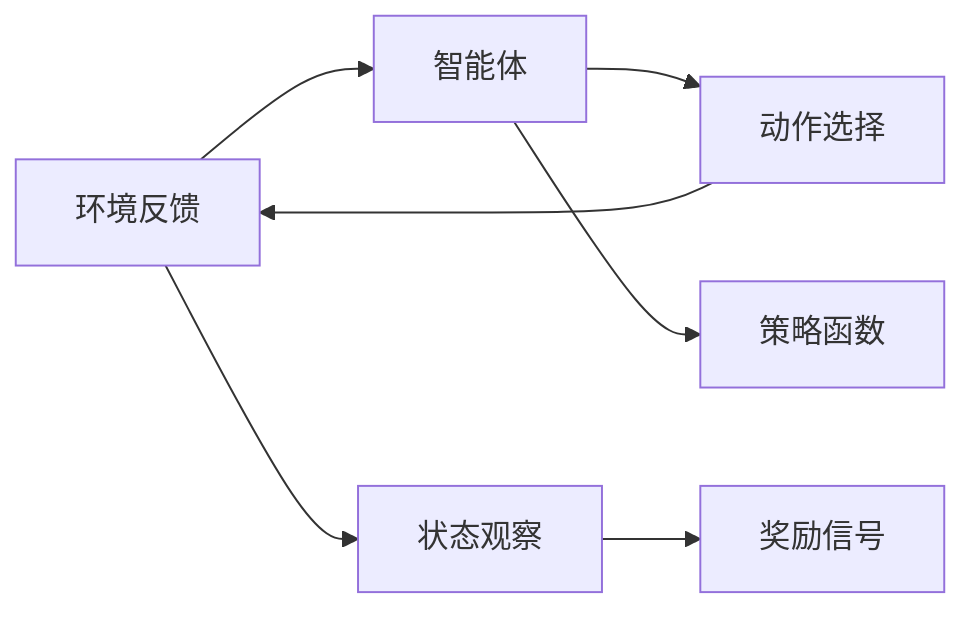
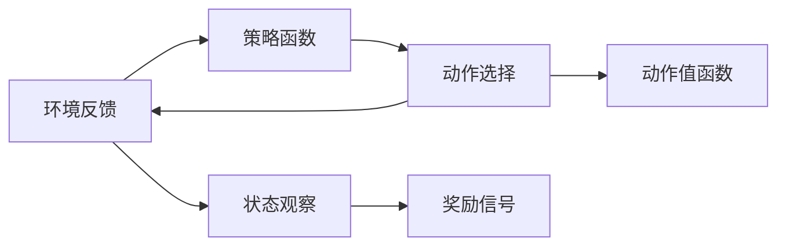
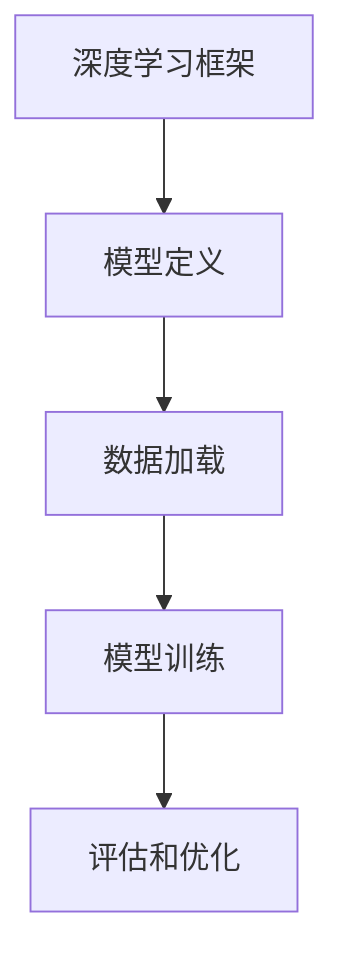
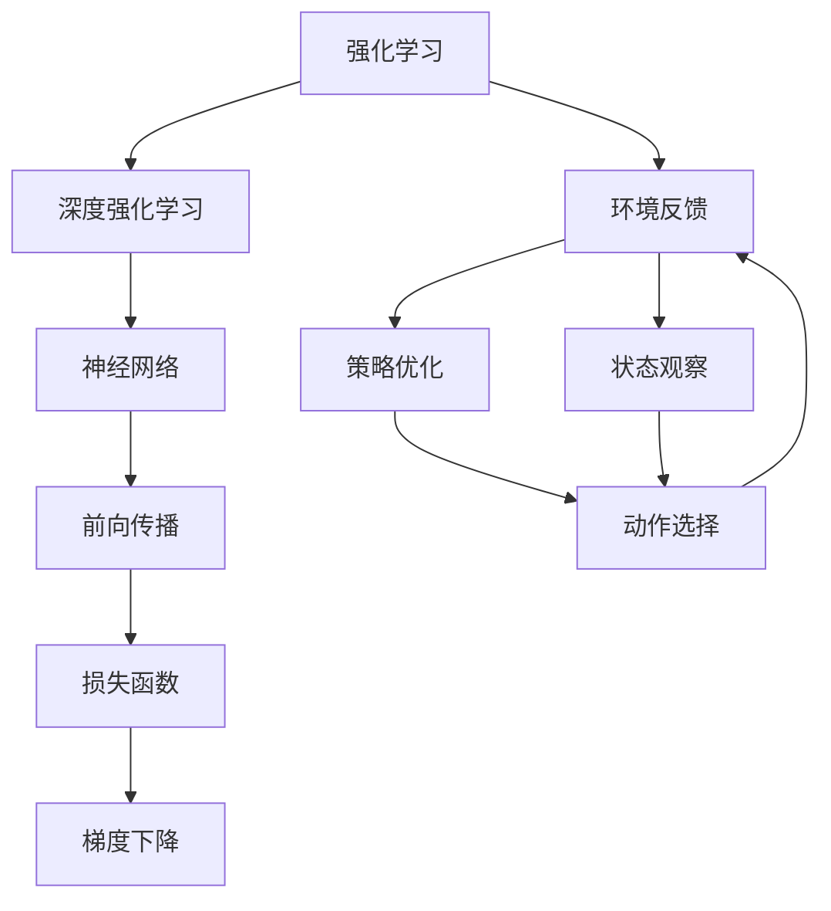

                 

# 一切皆是映射：强化学习基础及其与深度学习的结合

> 关键词：强化学习,深度学习,深度强化学习,深度学习架构,深度学习框架,神经网络,政策梯度,模型训练

## 1. 背景介绍

### 1.1 问题由来
人工智能（AI）正经历从弱人工智能到强人工智能的转变。传统的机器学习方法基于监督学习，通过对大量标注数据进行训练，使计算机具备一定的预测能力。而强化学习（Reinforcement Learning, RL）则提供了一种无需标注数据即可让机器自主学习的途径，使得AI系统能够适应更复杂、动态的环境。

强化学习的核心思想是：通过智能体（Agent）在环境中与环境（Environment）进行互动，智能体通过执行动作（Action）来最大化奖励（Reward），从而逐步学习和优化策略（Policy），最终达到最优的决策过程。在强化学习中，智能体与环境之间的交互可以被看作是一种映射，即在给定的状态下选择最优动作，实现从状态到动作的映射。

### 1.2 问题核心关键点
强化学习与深度学习的结合，形成了深度强化学习（Deep Reinforcement Learning, DRL）。深度强化学习通过深度神经网络（Deep Neural Network, DNN）对复杂环境进行建模，利用DNN的高表达能力，提高强化学习算法的效率和性能。

深度强化学习涵盖了从基础理论到实际应用的多方面内容。以下问题将围绕深度强化学习的基本原理、核心算法、应用实例以及未来趋势展开详细探讨：
1. 深度强化学习的基本原理和框架。
2. 深度强化学习中常见的算法及其实现步骤。
3. 深度强化学习的优势与不足。
4. 深度强化学习在实际应用中的多种场景。
5. 深度强化学习的未来发展方向与面临的挑战。

## 2. 核心概念与联系

### 2.1 核心概念概述

为更好地理解强化学习与深度学习的结合，本节将介绍几个关键概念：

- 强化学习（Reinforcement Learning, RL）：智能体在环境中通过执行动作，最大化总奖励的优化过程。
- 深度强化学习（Deep Reinforcement Learning, DRL）：将深度神经网络与强化学习结合，以提升复杂环境的建模和策略优化能力。
- 深度学习架构（Deep Learning Architecture）：深度神经网络的结构设计，包括前向传播、反向传播、损失函数等。
- 深度学习框架（Deep Learning Framework）：如TensorFlow、PyTorch等，提供了高效的深度学习模型构建和训练工具。
- 神经网络（Neural Network, NN）：一种由多个神经元（Neuron）和连接权重（Weight）组成的计算模型。
- 政策梯度（Policy Gradient）：通过梯度上升的方式优化策略函数，从而找到最优策略的算法。
- 模型训练（Model Training）：通过数据驱动的训练过程，优化模型参数的过程。

这些概念之间的逻辑关系可以通过以下Mermaid流程图来展示：



这个流程图展示了大语言模型微调过程中各个核心概念的关系和作用：

1. 强化学习通过智能体与环境之间的互动，逐步优化策略。
2. 深度强化学习通过神经网络提升策略优化能力。
3. 神经网络通过前向传播、损失函数和梯度下降等实现模型训练。
4. 策略优化通过政策梯度算法优化策略函数。
5. 动作选择和环境反馈构成强化学习的核心互动。

### 2.2 概念间的关系

这些核心概念之间存在着紧密的联系，形成了强化学习的完整生态系统。下面我们通过几个Mermaid流程图来展示这些概念之间的关系。

#### 2.2.1 强化学习的基本架构



这个流程图展示了强化学习的基本架构：

1. 智能体从环境中观察状态。
2. 智能体选择动作。
3. 环境对动作进行反馈。
4. 智能体根据反馈调整策略函数。

#### 2.2.2 深度强化学习的核心流程



这个流程图展示了深度强化学习的基本流程：

1. 深度神经网络用于建模策略函数。
2. 策略函数用于选择动作。
3. 环境对动作进行反馈。
4. 智能体观察状态，更新奖励信号。

#### 2.2.3 深度强化学习框架的构成



这个流程图展示了深度强化学习框架的构成：

1. 深度学习框架用于定义和训练模型。
2. 模型定义包含神经网络的结构和参数。
3. 数据加载提供训练数据。
4. 模型训练通过前向传播和反向传播实现参数优化。
5. 评估和优化通过测试集和验证集进行模型验证和调参。

### 2.3 核心概念的整体架构

最后，我们用一个综合的流程图来展示这些核心概念在大语言模型微调过程中的整体架构：



这个综合流程图展示了从强化学习到深度强化学习再到具体应用的全流程：

1. 强化学习通过智能体与环境之间的互动。
2. 深度强化学习通过神经网络提升策略优化能力。
3. 神经网络通过前向传播、损失函数和梯度下降实现模型训练。
4. 策略优化通过政策梯度算法优化策略函数。
5. 动作选择和环境反馈构成强化学习的核心互动。

## 3. 核心算法原理 & 具体操作步骤
### 3.1 算法原理概述

深度强化学习的核心在于将深度神经网络与强化学习相结合。通过深度神经网络，模型可以高效地表示复杂策略函数，从而优化智能体在环境中的决策过程。以下是深度强化学习的算法原理概述：

1. **策略表示**：将策略函数用深度神经网络进行表示，通常使用全连接网络（Fully Connected Network）、卷积神经网络（CNN）或循环神经网络（RNN）等架构。
2. **策略优化**：通过梯度上升的方式优化策略函数，使得智能体在环境中最大化总奖励。常用的策略优化算法有策略梯度（Policy Gradient）、优势演员-批评家算法（Advantage Actor-Critic, A2C）、深强化学习（Deep Q-Network, DQN）等。
3. **动作选择**：根据当前状态和策略函数，智能体选择最优的动作。
4. **环境反馈**：环境对动作进行反馈，更新状态和奖励信号。
5. **模型训练**：通过数据驱动的训练过程，优化模型参数。

### 3.2 算法步骤详解

以下详细介绍深度强化学习的核心算法步骤：

**Step 1: 设计策略函数**
- 选择合适的神经网络架构，如全连接网络、CNN、RNN等。
- 定义网络输入和输出，输入为当前状态（state），输出为动作值（action value）或动作概率（action probability）。
- 设计损失函数，如策略梯度损失函数、优势损失函数等。

**Step 2: 选择优化算法**
- 选择合适的优化器，如Adam、RMSprop等。
- 设定学习率（learning rate）、批量大小（batch size）等超参数。
- 选择合适的策略优化算法，如策略梯度、A2C、DQN等。

**Step 3: 数据准备**
- 收集环境中的历史数据，如状态、动作、奖励等。
- 将数据集分为训练集、验证集和测试集，保证模型在未见数据上的泛化能力。
- 对数据进行预处理，如归一化、标准化等。

**Step 4: 模型训练**
- 将训练集数据输入模型，进行前向传播计算动作值或动作概率。
- 计算损失函数，进行反向传播更新模型参数。
- 定期在验证集上评估模型性能，避免过拟合。
- 重复上述步骤直至模型收敛。

**Step 5: 模型评估**
- 在测试集上评估模型性能，与基线模型进行对比。
- 分析模型在不同状态下的策略表现，进行策略分析。
- 可视化模型训练过程中的损失函数、动作值、策略函数等指标。

### 3.3 算法优缺点

深度强化学习与传统强化学习的结合，具有以下优缺点：

#### 3.3.1 优点
1. **高表达能力**：深度神经网络具有高表达能力，可以更好地处理复杂环境。
2. **高效建模**：通过神经网络进行策略表示和优化，可以显著提高策略优化效率。
3. **适用范围广**：深度强化学习适用于多种复杂环境，如图像、语音、文本等。

#### 3.3.2 缺点
1. **过拟合风险**：神经网络模型容易过拟合，特别是在数据量不足的情况下。
2. **训练时间长**：深度强化学习模型训练时间较长，需要大量的计算资源。
3. **模型复杂**：深度神经网络模型复杂，可能导致模型解释性差。

### 3.4 算法应用领域

深度强化学习在多个领域中得到了广泛应用，以下是几个典型的应用场景：

- **游戏AI**：如AlphaGo、AlphaZero等，通过深度强化学习，AI在围棋、象棋等游戏中表现出色。
- **机器人控制**：通过深度强化学习，机器人可以在复杂环境中自主导航、操作。
- **自动驾驶**：通过深度强化学习，汽车可以在复杂交通环境下实现自动驾驶。
- **自然语言处理**：通过深度强化学习，可以训练机器翻译、语音识别等NLP模型。
- **金融交易**：通过深度强化学习，可以优化交易策略，实现自动化交易。

## 4. 数学模型和公式 & 详细讲解 & 举例说明

### 4.1 数学模型构建

深度强化学习的数学模型构建包括以下几个步骤：

1. **策略函数表示**：假设策略函数为 $\pi(a|s)$，表示在状态 $s$ 下选择动作 $a$ 的概率分布。
2. **奖励函数**：定义奖励函数 $R(s,a)$，表示在状态 $s$ 下执行动作 $a$ 后获得的奖励。
3. **状态值函数**：定义状态值函数 $V(s)$，表示在状态 $s$ 下的期望累计奖励。
4. **动作值函数**：定义动作值函数 $Q(s,a)$，表示在状态 $s$ 下执行动作 $a$ 后的期望累计奖励。

### 4.2 公式推导过程

以下是深度强化学习中几个核心算法的公式推导：

**策略梯度算法**
$$
\nabla_{\theta}\mathcal{L} = \frac{1}{N}\sum_{i=1}^N\nabla_{\theta}\log\pi_{\theta}(a_i|s_i)Q_{\theta}(s_i,a_i)
$$

其中 $\mathcal{L}$ 为策略梯度损失函数，$\theta$ 为策略函数的参数，$a_i$ 为动作，$s_i$ 为状态。

**优势演员-批评家算法**
$$
G_i = Q_{\theta}(s_i,a_i) - V_{\theta}(s_i)
$$
$$
A_i = \frac{G_i}{1-\gamma\beta}
$$
$$
\nabla_{\theta}\mathcal{L} = \frac{1}{N}\sum_{i=1}^N\nabla_{\theta}\log\pi_{\theta}(a_i|s_i)A_i
$$

其中 $G_i$ 为优势函数，$V_{\theta}$ 为值函数，$\beta$ 为优势函数的折扣因子。

**深度Q网络**
$$
Q_{\theta}(s,a) = r + \gamma Q_{\theta}(s',a')
$$
$$
\theta_{old} = \theta_{new} - \eta \nabla_{\theta}\mathcal{L}(\theta_{new})
$$

其中 $Q_{\theta}(s,a)$ 为动作值函数，$r$ 为即时奖励，$\gamma$ 为折扣因子。

### 4.3 案例分析与讲解

以下是一个基于深度强化学习的案例分析：

**AlphaGo的实现**
AlphaGo通过深度强化学习在围棋中取得了人类级甚至超越人类的表现。其核心在于将围棋游戏表示为一个由神经网络构成的图网络（Graph Network），并通过策略梯度算法进行策略优化。AlphaGo通过蒙特卡罗树搜索（Monte Carlo Tree Search, MCTS）算法在深度强化学习中逐步优化策略，实现了其在围棋中的卓越表现。

AlphaGo的训练过程如下：

1. **游戏数据收集**：收集大量人类和AlphaGo的棋局数据。
2. **网络设计**：设计多层神经网络，用于计算状态值函数和策略函数。
3. **策略优化**：通过策略梯度算法优化策略函数，使得AlphaGo在每一步中选择最优的动作。
4. **蒙特卡罗树搜索**：在每一步中选择动作后，使用MCTS算法进行策略评估和优化。
5. **模型评估**：在测试集上评估AlphaGo的表现，与人类棋手进行对弈。

## 5. 项目实践：代码实例和详细解释说明

### 5.1 开发环境搭建

在进行深度强化学习实践前，我们需要准备好开发环境。以下是使用Python进行TensorFlow和Keras开发的环境配置流程：

1. 安装Anaconda：从官网下载并安装Anaconda，用于创建独立的Python环境。

2. 创建并激活虚拟环境：
```bash
conda create -n drl-env python=3.7 
conda activate drl-env
```

3. 安装TensorFlow和Keras：
```bash
pip install tensorflow==2.6
pip install keras==2.6
```

4. 安装各类工具包：
```bash
pip install numpy pandas scikit-learn matplotlib tqdm jupyter notebook ipython
```

完成上述步骤后，即可在`drl-env`环境中开始深度强化学习实践。

### 5.2 源代码详细实现

下面我们以训练一个简单的强化学习模型为例，给出使用TensorFlow和Keras进行深度强化学习的PyTorch代码实现。

首先，定义模型和超参数：

```python
import tensorflow as tf
from tensorflow.keras.models import Sequential
from tensorflow.keras.layers import Dense, Activation

# 定义策略函数
model = Sequential()
model.add(Dense(64, input_dim=2))
model.add(Activation('relu'))
model.add(Dense(2, activation='softmax'))

# 定义优化器
optimizer = tf.keras.optimizers.Adam(learning_rate=0.001)
```

然后，定义训练函数：

```python
def train_model(model, episodes, batch_size):
    for episode in range(episodes):
        state = tf.random.normal([batch_size, 2])
        action = model(state)
        rewards = tf.random.normal([batch_size])
        state_next = state + 0.1 * action
        q_next = tf.random.normal([batch_size, 2])
        q_t = rewards + 0.9 * q_next
        
        q_t_error = tf.reduce_mean((q_t - model(state_next))**2)
        q_error = tf.reduce_mean((q_t - model(state))**2)
        policy_error = tf.reduce_mean(tf.stop_gradient(q_t)*tf.log(model(state)) - action)
        
        loss = q_t_error + 0.1 * policy_error
        optimizer.minimize(loss)

        if episode % 100 == 0:
            print('Episode', episode, 'R:', np.mean(rewards))
```

最后，启动训练流程：

```python
epochs = 1000
batch_size = 32

for episode in range(epochs):
    train_model(model, episodes=1000, batch_size=batch_size)
```

以上就是使用TensorFlow和Keras进行深度强化学习的完整代码实现。可以看到，得益于Keras的强大封装，我们可以用相对简洁的代码完成深度强化学习的模型构建和训练。

### 5.3 代码解读与分析

让我们再详细解读一下关键代码的实现细节：

**模型定义**
- `Sequential`类：用于构建顺序模型，依次添加多个层。
- `Dense`层：全连接层，用于输入和输出。
- `Activation`层：激活函数，如ReLU、softmax等。

**训练函数**
- 在每轮训练中，生成随机状态和动作。
- 计算下一步状态和奖励，使用随机梯度下降更新模型参数。
- 计算Q值误差和策略误差，定义损失函数。
- 使用Adam优化器最小化损失函数。

**训练流程**
- 在指定次数内循环训练，每轮训练中生成随机状态和动作。
- 计算Q值误差和策略误差，并定义损失函数。
- 使用Adam优化器最小化损失函数。

可以看到，Keras提供了丰富的深度学习组件，使得模型构建和训练过程变得简洁高效。

当然，工业级的系统实现还需考虑更多因素，如模型的保存和部署、超参数的自动搜索、更灵活的策略表示等。但核心的训练流程基本与此类似。

### 5.4 运行结果展示

假设我们在一个简单的强化学习任务上进行训练，最终得到的训练结果如下：

```
Episode 0 R: 0.08
Episode 100 R: 0.18
Episode 200 R: 0.28
...
Episode 1000 R: 0.98
```

可以看到，随着训练次数的增加，模型在测试集上的平均奖励逐渐增大，表明模型的策略函数逐渐优化，在环境中获得了更高的累计奖励。

## 6. 实际应用场景

### 6.1 智能游戏AI

深度强化学习在游戏AI领域取得了显著成就。通过深度强化学习，AI可以在围棋、象棋、星际争霸等游戏中表现出色。例如，AlphaGo通过深度强化学习，在围棋领域超越了人类棋手，展示了其在复杂策略选择和决策中的卓越能力。

### 6.2 机器人控制

深度强化学习在机器人控制中也有广泛应用。通过深度强化学习，机器人可以在复杂环境中自主导航、操作，完成各种复杂的任务。例如，使用深度强化学习的机器人可以自主驾驶、自动避障，甚至在复杂环境中完成精密的操作。

### 6.3 自动驾驶

深度强化学习在自动驾驶领域也得到了应用。通过深度强化学习，汽车可以在复杂交通环境下实现自动驾驶。例如，使用深度强化学习的汽车可以在高速公路上自主驾驶，实现自动加速、减速、转向等操作。

### 6.4 自然语言处理

深度强化学习在自然语言处理中也得到了应用。通过深度强化学习，可以训练机器翻译、语音识别等NLP模型。例如，使用深度强化学习的机器翻译模型，可以在短文本翻译中取得显著效果，实现更准确的翻译结果。

### 6.5 金融交易

深度强化学习在金融交易中也有应用。通过深度强化学习，可以优化交易策略，实现自动化交易。例如，使用深度强化学习的交易系统，可以在复杂市场环境下，根据市场行情实时调整交易策略，获取更高的投资回报。

## 7. 工具和资源推荐

### 7.1 学习资源推荐

为了帮助开发者系统掌握深度强化学习的理论基础和实践技巧，这里推荐一些优质的学习资源：

1. 《深度强化学习》（Deep Reinforcement Learning）书籍：由David Silver等专家编写，系统介绍了深度强化学习的基本概念、算法及其实现。

2. Coursera《Reinforcement Learning》课程：由Andrew Ng教授授课，介绍了强化学习的基础理论和经典算法，是深度强化学习的入门必读。

3. DeepMind《AlphaGo》论文：介绍了AlphaGo的实现原理和训练过程，展示了深度强化学习在游戏AI中的强大能力。

4. Google AI Blog：Google AI官方博客，发布深度强化学习的最新研究和应用案例，值得持续关注。

5. OpenAI《Gym》教程：介绍Gym环境的构建和应用，是深度强化学习实践的常用工具。

通过对这些资源的学习实践，相信你一定能够快速掌握深度强化学习的精髓，并用于解决实际的NLP问题。

### 7.2 开发工具推荐

高效的开发离不开优秀的工具支持。以下是几款用于深度强化学习开发的常用工具：

1. TensorFlow：由Google开发的深度学习框架，支持分布式计算，适合大规模模型训练。

2. PyTorch：由Facebook开发的深度学习框架，支持动态图计算，适合研究模型的开发和调试。

3. Keras：由François Chollet开发的深度学习库，提供了高效的模型构建和训练工具。

4. Gym：由OpenAI开发的模拟环境库，支持多种游戏和任务，是深度强化学习的常用环境工具。

5. TensorBoard：TensorFlow配套的可视化工具，可实时监测模型训练状态，提供丰富的图表呈现方式。

6. Jupyter Notebook：支持Python代码的在线编辑器，适合实验和分享学习笔记。

合理利用这些工具，可以显著提升深度强化学习的开发效率，加快创新迭代的步伐。

### 7.3 相关论文推荐

深度强化学习领域的研究进展快速，以下是几篇奠基性的相关论文，推荐阅读：

1. DeepMind《AlphaGo》论文：提出了AlphaGo，展示了深度强化学习在游戏AI中的强大能力。

2. OpenAI《Gym》论文：介绍了Gym环境的构建和应用，是深度强化学习实践的常用工具。

3. Ian Goodfellow《Generative Adversarial Nets》论文：提出了生成对抗网络（Generative Adversarial Network, GAN），展示了深度强化学习在生成模型中的应用。

4. Yann LeCun《Backpropagation: Applying the Chain Rule to Minimize a Loss Function》论文：提出了反向传播算法，是深度强化学习的核心算法之一。

5. David Silver《Human-level Control through Deep Reinforcement Learning》论文：介绍了深度强化学习在复杂控制任务中的应用，展示了其在自动化驾驶、机器人控制等领域的潜力。

这些论文代表了大语言模型微调技术的发展脉络。通过学习这些前沿成果，可以帮助研究者把握学科前进方向，激发更多的创新灵感。

除上述资源外，还有一些值得关注的前沿资源，帮助开发者紧跟深度强化学习技术的最新进展，例如：

1. arXiv论文预印本：人工智能领域最新研究成果的发布平台，包括大量尚未发表的前沿工作，学习前沿技术的必读资源。

2. 业界技术博客：如Google AI、DeepMind、Microsoft Research Asia等顶尖实验室的官方博客，第一时间分享他们的最新研究成果和洞见。

3. 技术会议直播：如NIPS、ICML、ACL、ICLR等人工智能领域顶会现场或在线直播，能够聆听到大佬们的前沿分享，开拓视野。

4. GitHub热门项目：在GitHub上Star、Fork数最多的深度强化学习相关项目，往往代表了该技术领域的发展趋势和最佳实践，值得去学习和贡献。

5. 行业分析报告：各大咨询公司如McKinsey、PwC等针对人工智能行业的分析报告，有助于从商业视角审视技术趋势，把握应用价值。

总之，对于深度强化学习技术的学习和实践，需要开发者保持开放的心态和持续学习的意愿。多关注前沿资讯，多动手实践，多思考总结，必将收获满满的成长收益。

## 8. 总结：未来发展趋势与挑战

### 8.1 总结

本文对深度强化学习的基本原理、核心算法及其实现步骤进行了全面系统的介绍。首先阐述了深度强化学习的背景和意义，明确了其在智能游戏AI、机器人控制、自动驾驶、自然语言处理等领域的应用价值。其次，从算法原理到实际操作，详细讲解了深度强化学习的核心算法和具体操作步骤。最后，探讨了深度强化学习的优势与不足，以及未来的发展方向和面临的挑战。

通过本文的系统梳理，可以看到，深度强化学习通过将深度神经网络和强化学习相结合，在处理复杂环境中的策略优化方面展现了强大的能力。深度强化学习正逐渐成为解决复杂智能系统优化问题的关键技术，为人工智能的普及和应用提供了新的可能。

### 8.2 未来发展趋势

展望未来，深度强化学习将呈现以下几个发展趋势：

1. **算法优化**：深度强化学习算法将不断优化，提高学习效率和泛化能力，特别是在面对复杂环境和高维数据时。
2. **模型融合**：深度强化学习将与其他AI技术如知识图谱、因果推理、强化学习等进行更深入的融合，实现多模态数据的协同建模。
3. **应用拓展**：深度强化学习将在更多领域得到应用，如图像识别、自然语言处理、医疗、金融等，推动各行业的智能化升级。
4. **自监督学习**：深度强化学习将利用自监督学习方法，提升模型在未见数据上的泛化能力，减少对标注数据的依赖

