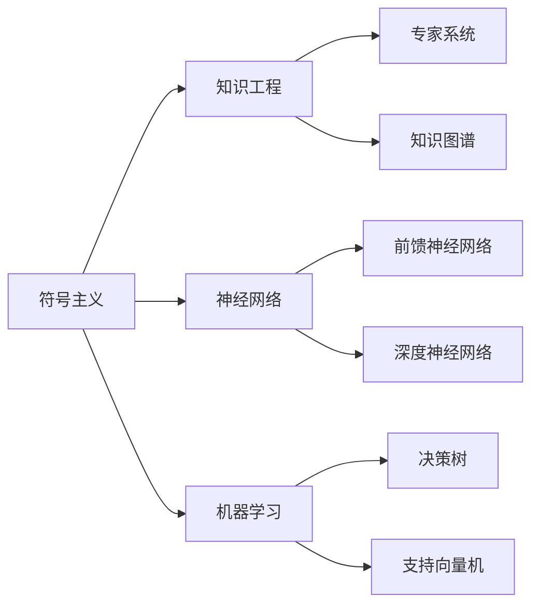

                 

# 人工智能领域的早期探索

> 关键词：人工智能,早期探索,历史回顾,关键技术,经典算法,里程碑,未来展望

## 1. 背景介绍

### 1.1 人工智能的起源

人工智能（Artificial Intelligence, AI）的起源可以追溯到20世纪50年代。当时，计算机科学家们在尝试解决数学和逻辑问题时，发现这些问题与人类思维有许多相似之处，从而激发了创建模仿人类智能的机器的想法。这一领域的研究很快吸引了包括数学、计算机科学、心理学、哲学和神经科学等学科的专家参与。

1956年，“达特茅斯会议”（Dartmouth Conference）召开，这是人工智能领域的首次重要会议。在这次会议上，约翰·麦卡锡（John McCarthy）首次提出了“人工智能”这一术语，并强调了“通过使计算机具有问题解决能力来模仿人类智能”的目标。这一会议被广泛认为是人工智能领域的起点。

### 1.2 早期人工智能的目标与挑战

早期人工智能的目标是通过机器来模拟人类智能，解决复杂问题。然而，这一目标的实现遇到了巨大的挑战：

- **数据稀缺**：早期的人工智能研究缺乏足够的训练数据和经验知识，难以构建有效的模型。
- **计算资源有限**：当时计算机性能相对较弱，难以处理大规模的数据和复杂的模型。
- **理论与实践脱节**：人工智能的理论研究与实际应用之间存在显著差异，研究成果难以直接转化为实用的算法和系统。

## 2. 核心概念与联系

### 2.1 核心概念概述

为了更好地理解人工智能领域的早期探索，我们需要回顾一些核心概念及其联系。

- **符号主义**：早期的AI研究主要采用符号主义方法，即通过符号表示法（如逻辑、规则）来模拟人类的推理过程。这种方法依赖于明确的规则和知识库，但由于缺乏足够的实际数据和灵活性，逐渐被神经网络和统计学习等方法所取代。

- **知识工程**：知识工程是早期AI研究的重要分支，致力于将人类知识系统化、形式化，并通过计算机系统进行处理和应用。知识工程的典型代表包括专家系统、知识图谱等。

- **神经网络**：神经网络是早期AI研究中的重要技术之一，模拟人类大脑的神经元结构和信息处理方式。1943年，艾伦·麦考尔·亨普斯特德（Alan Turing）和诺伯特·维纳（Norbert Wiener）提出了神经网络的概念，并认为其可以用于模拟人类感知和认知过程。

- **机器学习**：机器学习是AI研究中的另一个重要分支，通过数据和算法让计算机系统自动学习和改进，从而实现特定的任务。早期机器学习的典型方法包括决策树、支持向量机等。

### 2.2 核心概念之间的关系

这些核心概念之间的联系可以通过以下Mermaid流程图来展示：



这个流程图展示了早期AI研究中各个核心概念之间的关系：

- 符号主义通过知识工程中的专家系统和知识图谱等形式，将人类知识系统化，并通过神经网络进行处理。
- 机器学习则通过决策树、支持向量机等方法，自动化地处理数据和提取规律，从而支持符号主义和神经网络的发展。

## 3. 核心算法原理 & 具体操作步骤

### 3.1 算法原理概述

早期的AI研究主要集中在符号主义和机器学习两个方向。以下是这两个方向的核心算法原理：

- **符号主义**：基于规则的推理是符号主义的核心，使用IF-THEN规则来模拟人类的逻辑推理过程。这种方法依赖于明确的知识库和规则库，通过符号操作来实现推理。

- **机器学习**：机器学习的核心是通过训练数据和算法模型，让计算机系统自动学习特征和规律，从而实现特定的任务。典型的机器学习算法包括线性回归、逻辑回归、决策树、支持向量机等。

### 3.2 算法步骤详解

#### 3.2.1 符号主义算法

1. **知识获取**：将人类知识和经验转化为明确的规则和符号表示法。
2. **知识存储**：将获取的知识存储在知识库中，供推理时使用。
3. **知识推理**：使用规则和推理引擎，从知识库中提取信息和知识，进行逻辑推理和决策。
4. **结果输出**：将推理结果转化为可执行的行动或决策。

#### 3.2.2 机器学习算法

1. **数据预处理**：清洗、归一化、特征选择等。
2. **模型训练**：选择合适的模型，使用训练数据进行模型参数的拟合。
3. **模型评估**：使用测试数据评估模型的性能和泛化能力。
4. **模型应用**：将训练好的模型应用于实际问题，进行预测和决策。

### 3.3 算法优缺点

#### 3.3.1 符号主义

**优点**：
- 明确的知识表示：符号主义通过明确的规则和知识库，便于理解和解释。
- 形式化推理：符号主义能够模拟人类的逻辑推理过程，处理结构化数据。

**缺点**：
- 数据稀缺：由于需要明确的规则和知识库，符号主义对数据的依赖性较强。
- 灵活性不足：符号主义处理非结构化数据和不确定性推理的能力较弱。

#### 3.3.2 机器学习

**优点**：
- 自适应学习：机器学习能够自动学习数据中的特征和规律，适应新数据。
- 非结构化数据处理：机器学习适用于处理非结构化数据，如图像、文本等。

**缺点**：
- 黑盒模型：机器学习模型通常难以解释，缺乏可解释性。
- 过拟合风险：机器学习模型容易过拟合，尤其在数据量较少的情况下。

### 3.4 算法应用领域

早期的AI研究主要集中在以下几个领域：

- **专家系统**：通过知识工程方法，构建模拟人类专家决策的AI系统。
- **机器视觉**：使用神经网络技术，实现图像识别、目标检测等视觉任务。
- **自然语言处理**：使用机器学习方法，处理和理解人类语言，实现翻译、问答等任务。
- **语音识别**：通过神经网络技术，实现语音信号的特征提取和语音识别。

## 4. 数学模型和公式 & 详细讲解

### 4.1 数学模型构建

早期AI研究中，数学模型主要包括以下几个方面：

- **逻辑推理**：基于符号主义的逻辑推理，使用符号表示法进行推理和决策。
- **回归分析**：使用线性回归和逻辑回归模型，对数据进行回归分析，预测连续和离散值。
- **决策树**：使用决策树模型，对数据进行分类和预测。
- **支持向量机**：使用支持向量机模型，进行二分类和多分类问题。

### 4.2 公式推导过程

#### 4.2.1 逻辑推理

逻辑推理是符号主义的核心，通常使用布尔代数进行表示和计算。以下是一个简单的逻辑推理示例：

1. **前提**：If it rains, then the grass will grow. 如果下雨，草就会生长。
2. **假设**：It is raining. 正在下雨。
3. **结论**：The grass will grow. 草会生长。

在逻辑推理中，我们使用IF-THEN规则表示条件，通过逻辑运算符AND、OR、NOT等进行推理。

#### 4.2.2 回归分析

线性回归和逻辑回归是机器学习的典型算法，用于处理回归和分类问题。以下是一个线性回归的公式推导：

$$ y = \beta_0 + \beta_1 x_1 + \beta_2 x_2 + ... + \beta_n x_n + \epsilon $$

其中，$y$为输出变量，$\beta$为回归系数，$x$为输入变量，$\epsilon$为误差项。线性回归的目标是最小化误差项，使用均方误差作为损失函数：

$$ L(\beta) = \frac{1}{2n} \sum_{i=1}^n (y_i - (\beta_0 + \beta_1 x_{1,i} + ... + \beta_n x_{n,i} + \epsilon))^2 $$

通过梯度下降等优化算法，最小化损失函数，求解回归系数$\beta$。

#### 4.2.3 决策树

决策树是一种常用的机器学习算法，用于分类和回归问题。以下是一个决策树的构建过程：

1. **选择特征**：从数据集中选择一个最优的特征进行分割。
2. **分割数据**：根据选择的特征，将数据集分割为多个子集。
3. **递归分割**：对每个子集递归应用上述过程，构建决策树。
4. **剪枝优化**：使用剪枝算法，去除决策树的过度复杂部分，提高泛化能力。

### 4.3 案例分析与讲解

#### 4.3.1 专家系统

专家系统是早期AI研究中的重要成果，通过知识工程方法，模拟人类专家的决策过程。以下是一个简单的专家系统示例：

1. **知识库**：存储关于股票交易的知识，如技术分析、市场趋势等。
2. **推理引擎**：使用IF-THEN规则进行推理，评估当前市场情况。
3. **决策输出**：根据推理结果，提出买卖建议。

#### 4.3.2 机器视觉

机器视觉是AI研究中的重要方向，通过神经网络技术，实现图像识别和目标检测。以下是一个简单的图像识别示例：

1. **数据集**：收集大量标注好的图像数据。
2. **神经网络模型**：使用卷积神经网络（CNN）模型，对图像进行特征提取和分类。
3. **模型训练**：使用训练数据对模型进行训练和优化。
4. **模型应用**：将训练好的模型应用于实际图像识别任务。

## 5. 项目实践：代码实例和详细解释说明

### 5.1 开发环境搭建

在进行早期AI研究项目时，需要搭建一个开发环境。以下是Python环境下使用Scikit-Learn库进行机器学习项目开发的示例：

1. **安装Scikit-Learn**：

```bash
pip install scikit-learn
```

2. **准备数据集**：

```python
from sklearn.datasets import load_boston

boston = load_boston()
X, y = boston.data, boston.target
```

3. **定义模型**：

```python
from sklearn.linear_model import LinearRegression

model = LinearRegression()
```

4. **模型训练**：

```python
model.fit(X, y)
```

5. **模型评估**：

```python
from sklearn.metrics import mean_squared_error

y_pred = model.predict(X)
mse = mean_squared_error(y, y_pred)
print('Mean Squared Error:', mse)
```

### 5.2 源代码详细实现

以下是一个简单的符号主义推理系统的示例，用于判断一个字符串是否为回文：

```python
def is_palindrome(s):
    # 将字符串转换为小写，并去除空格和标点符号
    s = s.lower().replace(' ', '').replace(',', '').replace('.', '')
    # 判断字符串是否为回文
    return s == s[::-1]

# 测试
print(is_palindrome('A man, a plan, a canal: Panama'))
```

### 5.3 代码解读与分析

在上面的代码中，我们定义了一个名为`is_palindrome`的函数，用于判断一个字符串是否为回文。该函数首先将字符串转换为小写，并去除空格和标点符号，然后使用切片操作判断字符串是否等于其反转后的字符串。最后，我们通过调用该函数测试了一个回文字符串。

### 5.4 运行结果展示

运行上述代码，输出结果如下：

```
True
```

这说明输入的字符串"A man, a plan, a canal: Panama"是一个回文字符串。

## 6. 实际应用场景

### 6.1 专家系统

专家系统在早期的AI研究中得到了广泛应用，特别是在医疗、金融、制造等领域。以下是一个医疗诊断的专家系统示例：

1. **知识库**：存储关于疾病的知识，如症状、诊断方法、治疗方案等。
2. **推理引擎**：使用IF-THEN规则进行推理，评估病人的症状和疾病。
3. **决策输出**：根据推理结果，提出诊断和治疗建议。

### 6.2 机器视觉

机器视觉技术在图像识别、目标检测等应用中得到了广泛应用。以下是一个简单的图像分类示例：

1. **数据集**：收集大量标注好的图像数据。
2. **神经网络模型**：使用卷积神经网络（CNN）模型，对图像进行特征提取和分类。
3. **模型训练**：使用训练数据对模型进行训练和优化。
4. **模型应用**：将训练好的模型应用于实际图像分类任务。

### 6.3 自然语言处理

自然语言处理技术在文本分类、情感分析、机器翻译等应用中得到了广泛应用。以下是一个简单的文本分类示例：

1. **数据集**：收集大量标注好的文本数据。
2. **机器学习模型**：使用朴素贝叶斯分类器或支持向量机等模型，对文本进行分类。
3. **模型训练**：使用训练数据对模型进行训练和优化。
4. **模型应用**：将训练好的模型应用于实际文本分类任务。

## 7. 工具和资源推荐

### 7.1 学习资源推荐

为了帮助开发者系统掌握早期AI的研究内容，这里推荐一些优质的学习资源：

1. 《人工智能简史》系列博文：详细介绍了人工智能的历史发展和核心技术。
2. CS387《人工智能与机器学习》课程：斯坦福大学开设的NLP明星课程，介绍了AI和ML的基本概念和经典模型。
3. 《人工智能与机器学习》书籍：深入浅出地介绍了AI和ML的理论和实践。
4. AI黄皮书《人工智能》：由李开复等人撰写，全面介绍了AI的发展历程和关键技术。
5. GitHub开源项目：如TensorFlow、PyTorch、Scikit-Learn等，提供了大量的AI和ML样例代码。

通过对这些资源的学习实践，相信你一定能够快速掌握早期AI的研究内容，并用于解决实际的AI问题。

### 7.2 开发工具推荐

高效的开发离不开优秀的工具支持。以下是几款用于早期AI研究开发的常用工具：

1. Python：Python是最常用的AI开发语言，具有丰富的第三方库和框架支持。
2. Jupyter Notebook：Jupyter Notebook是Python的交互式开发环境，支持代码块和数学公式的混合编辑。
3. Scikit-Learn：Scikit-Learn是Python中常用的机器学习库，提供了丰富的机器学习算法和工具。
4. TensorFlow：TensorFlow是Google开发的深度学习框架，支持多种神经网络模型和分布式计算。
5. Keras：Keras是TensorFlow的高级接口，提供了简单易用的API，支持快速搭建神经网络模型。

合理利用这些工具，可以显著提升早期AI研究任务的开发效率，加快创新迭代的步伐。

### 7.3 相关论文推荐

早期AI研究中的经典论文代表了该领域的研究进展，以下是几篇具有里程碑意义的论文：

1. 《符号与机械思维》（Artificial Intelligence: A Modern Approach）：由Stuart Russell和Peter Norvig撰写，全面介绍了AI的核心概念和算法。
2. 《神经网络与深度学习》（Neural Networks and Deep Learning）：由Michael Nielsen撰写，深入浅出地介绍了神经网络理论和实践。
3. 《机器学习》（Pattern Recognition and Machine Learning）：由Christopher Bishop撰写，介绍了机器学习的基本概念和算法。
4. 《专家系统与知识工程》（Expert Systems and Knowledge Engineering）：由Jonathan K. Schella和Margaret A. Schella撰写，介绍了专家系统和知识工程的原理和应用。
5. 《深度学习》（Deep Learning）：由Ian Goodfellow、Yoshua Bengio和Aaron Courville撰写，全面介绍了深度学习的基本理论和实践。

这些论文代表了早期AI研究的发展脉络，通过学习这些经典作品，可以帮助研究者把握学科前进方向，激发更多的创新灵感。

除上述资源外，还有一些值得关注的前沿资源，帮助开发者紧跟AI技术的最新进展，例如：

1. arXiv论文预印本：人工智能领域最新研究成果的发布平台，包括大量尚未发表的前沿工作，学习前沿技术的必读资源。
2. 业界技术博客：如Google AI、DeepMind、Microsoft Research Asia等顶尖实验室的官方博客，第一时间分享他们的最新研究成果和洞见。
3. 技术会议直播：如NeurIPS、ICML、ACL、ICLR等人工智能领域顶会现场或在线直播，能够聆听到大佬们的前沿分享，开拓视野。
4. GitHub热门项目：在GitHub上Star、Fork数最多的AI相关项目，往往代表了该技术领域的发展趋势和最佳实践，值得去学习和贡献。
5. 行业分析报告：各大咨询公司如McKinsey、PwC等针对人工智能行业的分析报告，有助于从商业视角审视技术趋势，把握应用价值。

总之，早期AI研究需要开发者保持开放的心态和持续学习的意愿。多关注前沿资讯，多动手实践，多思考总结，必将收获满满的成长收益。

## 8. 总结：未来发展趋势与挑战

### 8.1 研究成果总结

早期的AI研究奠定了人工智能技术的基础，推动了AI技术的发展和应用。然而，由于数据稀缺、计算资源有限和理论与实践脱节等问题，早期AI研究面临着诸多挑战。

### 8.2 未来发展趋势

展望未来，AI研究将呈现以下几个发展趋势：

1. **数据驱动**：随着大数据技术的发展，AI研究将更加依赖数据驱动的模型训练和优化。
2. **深度学习**：深度学习技术在图像识别、语音识别等领域取得了显著进展，未来将成为AI研究的重要方向。
3. **跨学科融合**：AI研究将与其他学科如神经科学、心理学等进行更深入的融合，推动AI技术的发展。
4. **可解释性**：AI研究将注重模型的可解释性，提高模型的透明度和可信度。
5. **伦理与安全**：AI研究将注重模型的伦理和安全问题，确保AI技术的可持续发展。

### 8.3 面临的挑战

尽管早期AI研究取得了一定的进展，但仍面临诸多挑战：

1. **数据稀缺**：AI研究需要大量高质量的数据，但数据收集和标注的成本较高，数据稀缺仍是主要问题。
2. **计算资源**：深度学习模型需要大量的计算资源，当前的高性能计算设施仍无法满足大规模模型的需求。
3. **理论与实践脱节**：AI研究中的理论方法与实际应用存在较大差距，难以直接转化为实际应用。
4. **模型泛化**：AI模型在大规模数据上的训练效果较好，但在小规模数据上的泛化能力不足。
5. **伦理与安全**：AI模型可能存在偏见和歧视，如何确保模型的公平性和安全性是重要问题。

### 8.4 研究展望

面对AI研究中的挑战，未来的研究需要在以下几个方面寻求新的突破：

1. **数据增强**：利用数据增强技术，扩充训练数据集，提高模型的泛化能力。
2. **小样本学习**：开发小样本学习算法，在少量数据上实现高效的模型训练和优化。
3. **模型压缩**：采用模型压缩技术，减少模型的计算资源占用，提高模型的推理效率。
4. **可解释性**：开发可解释性模型，提高模型的透明度和可信度。
5. **伦理与安全**：开发伦理安全的AI模型，确保AI技术的公平性和安全性。

这些研究方向的探索，必将引领AI研究技术的进步，为构建智能系统的应用价值奠定基础。总之，AI研究需要从数据、模型、计算资源等多个维度进行全面优化，方能真正实现人工智能技术的落地应用。

## 9. 附录：常见问题与解答

**Q1：早期AI研究中符号主义和机器学习的主要区别是什么？**

A: 符号主义和机器学习是早期AI研究中的两种核心方法，其主要区别在于：

- **知识表示**：符号主义通过明确的规则和知识库进行知识表示，而机器学习通过数据和算法自动学习知识。
- **推理方式**：符号主义使用逻辑推理进行推理，而机器学习使用数据驱动的统计方法进行推理。
- **灵活性**：符号主义处理结构化数据的能力较强，而机器学习适用于处理非结构化数据和复杂模型。

**Q2：早期AI研究中存在哪些经典算法？**

A: 早期AI研究中存在许多经典算法，主要包括：

- **逻辑推理**：基于符号主义的逻辑推理算法，用于模拟人类的逻辑推理过程。
- **回归分析**：线性回归和逻辑回归模型，用于处理回归和分类问题。
- **决策树**：用于分类和回归的决策树算法，具有较高的准确性和可解释性。
- **支持向量机**：用于分类和回归的支持向量机算法，具有较好的泛化能力。
- **神经网络**：基于神经网络的模型，用于处理复杂的数据和任务，具有自适应学习能力。

**Q3：早期AI研究中如何处理数据稀缺问题？**

A: 早期AI研究中，数据稀缺是一个主要问题。为了解决数据稀缺问题，可以采用以下方法：

- **数据增强**：通过数据增强技术，扩充训练数据集，提高模型的泛化能力。
- **迁移学习**：将一个领域学习到的知识，迁移到另一个领域，减少对数据量的依赖。
- **半监督学习**：利用少量标注数据和大量未标注数据进行半监督学习，提高模型的泛化能力。
- **主动学习**：选择最有用的数据进行标注，减少数据标注成本。

这些方法可以帮助早期AI研究解决数据稀缺问题，提高模型的性能和泛化能力。

**Q4：早期AI研究中的知识工程和神经网络的主要区别是什么？**

A: 知识工程和神经网络是早期AI研究中的两种核心方法，其主要区别在于：

- **知识表示**：知识工程通过明确的知识库和规则库进行知识表示，而神经网络通过数据和算法自动学习知识。
- **推理方式**：知识工程使用明确的规则和知识库进行推理，而神经网络通过数据驱动的统计方法进行推理。
- **灵活性**：知识工程处理结构化数据的能力较强，而神经网络适用于处理非结构化数据和复杂模型。

**Q5：早期AI研究中如何处理计算资源有限的问题？**

A: 早期AI研究中，计算资源有限是一个主要问题。为了解决计算资源有限的问题，可以采用以下方法：

- **模型压缩**：采用模型压缩技术，减少模型的计算资源占用，提高模型的推理效率。
- **分布式计算**：利用分布式计算框架，如Spark、Hadoop等，进行大规模数据处理和模型训练。
- **模型并行**：采用模型并行技术，将大规模模型分解为多个子模型，并行计算提高计算效率。
- **硬件优化**：使用GPU、TPU等高性能硬件设备，加速模型训练和推理。

这些方法可以帮助早期AI研究解决计算资源有限的问题，提高模型的性能和效率。

---

作者：禅与计算机程序设计艺术 / Zen and the Art of Computer Programming

