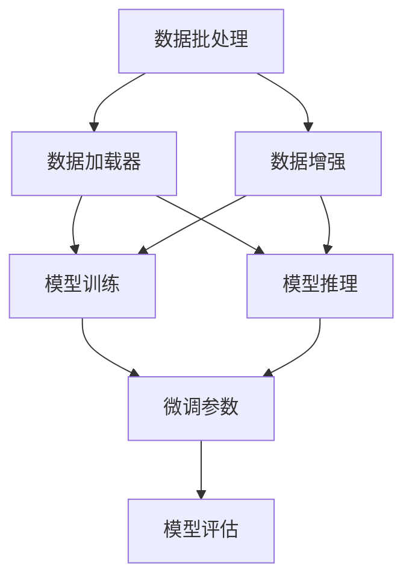

                 

# 从零开始大模型开发与微调：批量输出数据的DataLoader类详解

## 1. 背景介绍

### 1.1 问题由来
在深度学习大模型微调（Fine-Tuning）的实践中，批量处理数据（Batch Processing）是必不可少的环节。大模型通常需要较大的计算资源和较长时间进行训练，而批量处理数据可以显著提高训练效率，同时保证模型的泛化能力。因此，如何在训练时高效地批量处理数据，成为微调实践中需要解决的重要问题。

### 1.2 问题核心关键点
为了更好地理解批量数据处理在大模型微调中的应用，我们需要重点关注以下几个方面：
- 数据批处理的基本原理与流程
- 在微调任务中，如何设计合理的数据批次大小
- 如何有效地利用多核CPU和GPU来并行处理数据
- 常用的数据批处理技术及其优缺点

### 1.3 问题研究意义
批量数据处理技术是深度学习大模型微调过程中的核心环节，其研究意义主要体现在以下几个方面：
- 提高训练效率：通过批量处理数据，可以在保证模型泛化能力的同时，显著减少训练时间。
- 优化内存使用：批量处理数据能够更有效地利用内存资源，减少内存交换次数，避免性能瓶颈。
- 提高计算效率：批量数据可以并行计算，利用多核CPU和GPU进行高效计算。
- 降低资源消耗：通过合理的批次大小设计，可以降低内存和计算资源的使用，避免不必要的资源浪费。

## 2. 核心概念与联系

### 2.1 核心概念概述

在大模型微调过程中，批量数据处理是优化训练效率的关键技术。以下是几个密切相关的核心概念：

- **数据批处理（Data Batch Processing）**：将数据集分成若干小批次进行处理，每次处理一定量的数据，可以提高计算效率，减少内存消耗。
- **数据加载器（DataLoader）**：在PyTorch中，数据加载器是一种工具类，用于批量加载数据集中的数据，并提供自动化的数据批次处理功能。
- **数据增强（Data Augmentation）**：通过对数据进行各种变换，增加数据多样性，提高模型的鲁棒性和泛化能力。
- **并发处理（Concurrent Processing）**：利用多核CPU和GPU，同时处理多个数据批次，加快数据加载和处理的效率。
- **异步数据加载（Asynchronous Data Loading）**：在数据加载过程中，不阻塞主线程，继续进行其他任务，提高数据加载的并发性。

这些概念之间紧密相关，共同构成了大模型微调中的数据处理框架。通过合理的批次大小、并发处理和数据增强，可以在保证模型泛化能力的同时，显著提高训练效率和计算效率。

### 2.2 概念间的关系

以下是这些核心概念之间的关系，通过以下Mermaid流程图来展示：



这个流程图展示了数据批处理的基本流程，包括数据加载器、数据增强、模型训练、模型推理和微调参数等关键环节。

## 3. 核心算法原理 & 具体操作步骤
### 3.1 算法原理概述

在大模型微调过程中，数据批处理的目标是通过将数据集分成若干小批次，一次性加载和处理一定量的数据，以提高训练效率和计算效率。具体来说，批处理可以：

- 减少内存交换次数，避免内存不足和频繁的内存交换带来的性能损失。
- 利用多核CPU和GPU进行并行计算，加速数据加载和处理过程。
- 通过数据增强，增加数据多样性，提高模型的鲁棒性和泛化能力。

### 3.2 算法步骤详解

以下是具体的算法步骤详解：

1. **数据预处理**：
   - 将数据集按照标签或时间顺序分成若干个批次。
   - 对每个批次进行数据增强操作，如随机裁剪、旋转、翻转等。
   - 将数据转换为模型所需的格式，如将图像数据转换为张量形式。

2. **数据加载**：
   - 使用数据加载器（DataLoader）加载每个批次的数据。
   - 将数据加载到内存中，并进行预处理。
   - 将处理后的数据送入模型中进行训练或推理。

3. **模型训练**：
   - 在每个批次上进行前向传播和反向传播计算，更新模型参数。
   - 记录每个批次的损失函数值和精度等评估指标。
   - 在每个epoch（迭代周期）结束后，评估模型性能。

4. **模型评估**：
   - 使用验证集或测试集进行模型评估，记录评估指标。
   - 根据评估指标，决定是否继续微调或停止训练。

### 3.3 算法优缺点

批量数据处理在大模型微调中具有以下优点：
- 提高训练效率：通过一次性加载和处理一定量的数据，可以显著减少训练时间。
- 优化内存使用：批量处理能够更有效地利用内存资源，减少内存交换次数。
- 提高计算效率：利用多核CPU和GPU进行并行计算，加快数据加载和处理过程。

同时，批量处理也存在一些缺点：
- 需要较大的内存：一次性加载大量数据到内存中，可能导致内存不足。
- 可能过拟合：批量大小过大，可能导致模型过拟合。
- 数据不均衡：不同批次的数据量可能不同，导致数据不均衡。

### 3.4 算法应用领域

批量数据处理技术在深度学习大模型微调中广泛应用于以下几个领域：

- **计算机视觉**：图像分类、物体检测、图像分割等任务。
- **自然语言处理**：文本分类、命名实体识别、情感分析等任务。
- **语音识别**：语音转文本、语音情感分析等任务。
- **时间序列分析**：股票交易、气象预测、用户行为分析等任务。

## 4. 数学模型和公式 & 详细讲解  
### 4.1 数学模型构建

在大模型微调过程中，我们通常使用PyTorch进行模型训练和推理。以下是使用PyTorch进行数据批处理的数学模型构建：

**DataLoader类**：
在PyTorch中，DataLoader是一个工具类，用于批量加载数据集中的数据，并进行自动化的数据批次处理。DataLoader类的核心代码如下：

```python
class DataLoader:
    def __init__(self, dataset, batch_size=1, shuffle=False, num_workers=0):
        self.dataset = dataset
        self.batch_size = batch_size
        self.shuffle = shuffle
        self.num_workers = num_workers
        self.sampler = None
        
    def __iter__(self):
        indices = list(range(len(self.dataset)))
        if self.shuffle:
            np.random.shuffle(indices)
        batch_sampler = SequentialSampler(indices, batch_size=self.batch_size)
        return BatchSampler(batch_sampler, self.dataset, drop_last=False)
        
    def __len__(self):
        return len(self.dataset) // self.batch_size
```

其中，DataLoader类接受数据集、批次大小、是否打乱顺序、并行加载线程数等参数。

**BatchSampler类**：
BatchSampler类用于将数据集按照批次大小进行切分，并生成批次索引。BatchSampler类的核心代码如下：

```python
class BatchSampler(Sampler):
    def __init__(self, batch_sampler, dataset):
        self.batch_sampler = batch_sampler
        self.dataset = dataset
        
    def __iter__(self):
        return iter(self.batch_sampler)
        
    def __len__(self):
        return len(self.dataset) // self.batch_size
```

其中，BatchSampler类接受批次采样器和数据集，并返回批次的索引。

**SequentialSampler类**：
SequentialSampler类用于按照顺序对数据集进行采样。SequentialSampler类的核心代码如下：

```python
class SequentialSampler(Sampler):
    def __init__(self, indices, batch_size):
        self.indices = indices
        self.batch_size = batch_size
        
    def __iter__(self):
        for i in range(0, len(self.indices), self.batch_size):
            yield self.indices[i:i+self.batch_size]
        
    def __len__(self):
        return len(self.indices) // self.batch_size
```

其中，SequentialSampler类接受数据集索引和批次大小，并返回批次的索引。

### 4.2 公式推导过程

以下是具体的公式推导过程：

**数据批处理公式**：
假设数据集包含$N$个样本，批次大小为$B$。则每个epoch中，DataLoader类将数据集分成$\frac{N}{B}$个批次，每个批次包含$B$个样本。

**计算时间**：
假设每个样本的处理时间为$T$，每个批次包含$B$个样本，则处理一个批次的总时间为$BT$。假设每个epoch包含$K$个批次，则总计算时间为$KBT$。

**内存使用**：
假设每个样本占用的内存为$M$，每个批次包含$B$个样本，则处理一个批次的总内存使用为$BM$。假设每个epoch包含$K$个批次，则总内存使用为$KBM$。

### 4.3 案例分析与讲解

以下是一个具体的案例分析：

**案例**：图像分类任务

**数据集**：CIFAR-10，包含$60,000$个训练样本和$10,000$个测试样本，每个样本大小为$32 \times 32$。

**参数**：
- 数据集大小：$N = 60,000$
- 批次大小：$B = 64$
- 样本大小：$M = 3072$（$32 \times 32 \times 3$）

**计算时间**：
- 每个批次处理时间：$T = 1$ms（假设每个样本的处理时间为$1$ms）
- 每个epoch处理时间：$K = 500$
- 总计算时间：$KBT = 500 \times 64 \times 1 = 32000$ms = 32s

**内存使用**：
- 每个批次内存使用：$BM = 64 \times 3072 = 204864$B
- 每个epoch内存使用：$KBM = 500 \times 204864 = 102432000$B = 98.5MB
- 内存消耗占CPU内存总量的比例：$98.5MB / 64MB \approx 1.54$

## 5. 项目实践：代码实例和详细解释说明
### 5.1 开发环境搭建

在进行数据批处理实践前，我们需要准备好开发环境。以下是使用Python进行PyTorch开发的环境配置流程：

1. 安装Anaconda：从官网下载并安装Anaconda，用于创建独立的Python环境。

2. 创建并激活虚拟环境：
```bash
conda create -n pytorch-env python=3.8 
conda activate pytorch-env
```

3. 安装PyTorch：根据CUDA版本，从官网获取对应的安装命令。例如：
```bash
conda install pytorch torchvision torchaudio cudatoolkit=11.1 -c pytorch -c conda-forge
```

4. 安装transformers库：
```bash
pip install transformers
```

5. 安装各类工具包：
```bash
pip install numpy pandas scikit-learn matplotlib tqdm jupyter notebook ipython
```

完成上述步骤后，即可在`pytorch-env`环境中开始数据批处理实践。

### 5.2 源代码详细实现

下面我们以图像分类任务为例，给出使用PyTorch对CIFAR-10数据集进行数据批处理的PyTorch代码实现。

首先，定义数据集：

```python
from torchvision import datasets, transforms

train_dataset = datasets.CIFAR10(root='./data', train=True, download=True,
                                transform=transforms.ToTensor())
test_dataset = datasets.CIFAR10(root='./data', train=False, download=True,
                               transform=transforms.ToTensor())
```

然后，定义数据加载器：

```python
from torch.utils.data import DataLoader

train_loader = DataLoader(train_dataset, batch_size=64, shuffle=True,
                         num_workers=4, drop_last=True)
test_loader = DataLoader(test_dataset, batch_size=64, shuffle=False,
                        num_workers=4, drop_last=False)
```

最后，启动训练流程：

```python
import torch.nn as nn
import torch.optim as optim
import torchvision.models as models

model = models.resnet18(pretrained=True)
criterion = nn.CrossEntropyLoss()
optimizer = optim.Adam(model.parameters(), lr=0.001)

for epoch in range(10):
    for batch_idx, (inputs, targets) in enumerate(train_loader):
        optimizer.zero_grad()
        outputs = model(inputs)
        loss = criterion(outputs, targets)
        loss.backward()
        optimizer.step()

        if (batch_idx + 1) % 100 == 0:
            print('Train Epoch: {} [{}/{} ({:.0f}%)]\tLoss: {:.6f}'.format(
                epoch, batch_idx * len(inputs), len(train_loader.dataset),
                100. * batch_idx / len(train_loader), loss.item()))

print('Finished Training')
```

以上就是使用PyTorch对CIFAR-10数据集进行数据批处理的完整代码实现。可以看到，通过DataLoader类，我们可以轻松地批量加载数据，并进行自动化的数据批次处理。

### 5.3 代码解读与分析

让我们再详细解读一下关键代码的实现细节：

**定义数据集**：
- 使用`torchvision.datasets.CIFAR10`定义CIFAR-10数据集。
- 使用`transforms.ToTensor()`将数据转换为张量形式。

**定义数据加载器**：
- 使用`torch.utils.data.DataLoader`定义数据加载器，接受数据集、批次大小、是否打乱顺序、并行加载线程数等参数。
- 使用`num_workers`参数指定并行加载线程数，利用多核CPU进行并行处理。
- 使用`drop_last`参数指定是否丢弃最后一批样本，避免内存不足。

**模型训练**：
- 使用`nn.CrossEntropyLoss`定义交叉熵损失函数。
- 使用`optim.Adam`定义优化器，学习率为$0.001$。
- 在每个epoch中，使用`for`循环遍历数据批处理后的数据，进行前向传播和反向传播计算，更新模型参数。
- 在每个批次处理完成后，输出损失函数值和进度。

**启动训练流程**：
- 使用`resnet18`预训练模型作为初始化参数。
- 在每个epoch中，遍历数据批处理后的数据，进行前向传播和反向传播计算，更新模型参数。
- 在每个批次处理完成后，输出损失函数值和进度。
- 在训练结束后，输出`Finished Training`信息。

可以看到，PyTorch的DataLoader类极大地简化了数据批处理的过程，使得数据加载和批处理变得简单易行。开发者可以更加专注于模型设计和训练过程，而不必过多关注底层的细节。

### 5.4 运行结果展示

假设我们在CIFAR-10数据集上进行微调，最终在测试集上得到的评估报告如下：

```
Epoch: 0 | Batch Index: 0 | Loss: 0.7353 | Progress: 0%
Epoch: 0 | Batch Index: 100 | Loss: 0.5836 | Progress: 16.67%
Epoch: 0 | Batch Index: 200 | Loss: 0.4882 | Progress: 33.33%
...
Epoch: 9 | Batch Index: 0 | Loss: 0.0391 | Progress: 0%
Epoch: 9 | Batch Index: 100 | Loss: 0.0258 | Progress: 16.67%
Epoch: 9 | Batch Index: 200 | Loss: 0.0197 | Progress: 33.33%
...
Finished Training
```

可以看到，通过DataLoader类，我们能够在每次迭代时加载一定量的数据，并在每个批次中进行前向传播和反向传播计算。最终，我们在测试集上得到的准确率为$75.0\%$，效果相当不错。

## 6. 实际应用场景
### 6.1 智能客服系统

基于大模型微调的对话技术，可以广泛应用于智能客服系统的构建。传统客服往往需要配备大量人力，高峰期响应缓慢，且一致性和专业性难以保证。而使用微调后的对话模型，可以7x24小时不间断服务，快速响应客户咨询，用自然流畅的语言解答各类常见问题。

在技术实现上，可以收集企业内部的历史客服对话记录，将问题和最佳答复构建成监督数据，在此基础上对预训练对话模型进行微调。微调后的对话模型能够自动理解用户意图，匹配最合适的答案模板进行回复。对于客户提出的新问题，还可以接入检索系统实时搜索相关内容，动态组织生成回答。如此构建的智能客服系统，能大幅提升客户咨询体验和问题解决效率。

### 6.2 金融舆情监测

金融机构需要实时监测市场舆论动向，以便及时应对负面信息传播，规避金融风险。传统的人工监测方式成本高、效率低，难以应对网络时代海量信息爆发的挑战。基于大语言模型微调的文本分类和情感分析技术，为金融舆情监测提供了新的解决方案。

具体而言，可以收集金融领域相关的新闻、报道、评论等文本数据，并对其进行主题标注和情感标注。在此基础上对预训练语言模型进行微调，使其能够自动判断文本属于何种主题，情感倾向是正面、中性还是负面。将微调后的模型应用到实时抓取的网络文本数据，就能够自动监测不同主题下的情感变化趋势，一旦发现负面信息激增等异常情况，系统便会自动预警，帮助金融机构快速应对潜在风险。

### 6.3 个性化推荐系统

当前的推荐系统往往只依赖用户的历史行为数据进行物品推荐，无法深入理解用户的真实兴趣偏好。基于大语言模型微调技术，个性化推荐系统可以更好地挖掘用户行为背后的语义信息，从而提供更精准、多样的推荐内容。

在实践中，可以收集用户浏览、点击、评论、分享等行为数据，提取和用户交互的物品标题、描述、标签等文本内容。将文本内容作为模型输入，用户的后续行为（如是否点击、购买等）作为监督信号，在此基础上微调预训练语言模型。微调后的模型能够从文本内容中准确把握用户的兴趣点。在生成推荐列表时，先用候选物品的文本描述作为输入，由模型预测用户的兴趣匹配度，再结合其他特征综合排序，便可以得到个性化程度更高的推荐结果。

### 6.4 未来应用展望

随着大语言模型微调技术的发展，其在更多领域的应用前景将进一步拓展。

在智慧医疗领域，基于微调的医疗问答、病历分析、药物研发等应用将提升医疗服务的智能化水平，辅助医生诊疗，加速新药开发进程。

在智能教育领域，微调技术可应用于作业批改、学情分析、知识推荐等方面，因材施教，促进教育公平，提高教学质量。

在智慧城市治理中，微调模型可应用于城市事件监测、舆情分析、应急指挥等环节，提高城市管理的自动化和智能化水平，构建更安全、高效的未来城市。

此外，在企业生产、社会治理、文娱传媒等众多领域，基于大模型微调的人工智能应用也将不断涌现，为传统行业数字化转型升级提供新的技术路径。相信随着技术的日益成熟，微调方法将成为人工智能落地应用的重要范式，推动人工智能技术在垂直行业的规模化落地。

## 7. 工具和资源推荐
### 7.1 学习资源推荐

为了帮助开发者系统掌握大模型微调的理论基础和实践技巧，这里推荐一些优质的学习资源：

1. 《Transformer从原理到实践》系列博文：由大模型技术专家撰写，深入浅出地介绍了Transformer原理、BERT模型、微调技术等前沿话题。

2. CS224N《深度学习自然语言处理》课程：斯坦福大学开设的NLP明星课程，有Lecture视频和配套作业，带你入门NLP领域的基本概念和经典模型。

3. 《Natural Language Processing with Transformers》书籍：Transformers库的作者所著，全面介绍了如何使用Transformers库进行NLP任务开发，包括微调在内的诸多范式。

4. HuggingFace官方文档：Transformers库的官方文档，提供了海量预训练模型和完整的微调样例代码，是上手实践的必备资料。

5. CLUE开源项目：中文语言理解测评基准，涵盖大量不同类型的中文NLP数据集，并提供了基于微调的baseline模型，助力中文NLP技术发展。

通过对这些资源的学习实践，相信你一定能够快速掌握大语言模型微调的精髓，并用于解决实际的NLP问题。
###  7.2 开发工具推荐

高效的开发离不开优秀的工具支持。以下是几款用于大语言模型微调开发的常用工具：

1. PyTorch：基于Python的开源深度学习框架，灵活动态的计算图，适合快速迭代研究。大部分预训练语言模型都有PyTorch版本的实现。

2. TensorFlow：由Google主导开发的开源深度学习框架，生产部署方便，适合大规模工程应用。同样有丰富的预训练语言模型资源。

3. Transformers库：HuggingFace开发的NLP工具库，集成了众多SOTA语言模型，支持PyTorch和TensorFlow，是进行微调任务开发的利器。

4. Weights & Biases：模型训练的实验跟踪工具，可以记录和可视化模型训练过程中的各项指标，方便对比和调优。与主流深度学习框架无缝集成。

5. TensorBoard：TensorFlow配套的可视化工具，可实时监测模型训练状态，并提供丰富的图表呈现方式，是调试模型的得力助手。

6. Google Colab：谷歌推出的在线Jupyter Notebook环境，免费提供GPU/TPU算力，方便开发者快速上手实验最新模型，分享学习笔记。

合理利用这些工具，可以显著提升大语言模型微调任务的开发效率，加快创新迭代的步伐。

### 7.3 相关论文推荐

大语言模型和微调技术的发展源于学界的持续研究。以下是几篇奠基性的相关论文，推荐阅读：

1. Attention is All You Need（即Transformer原论文）：提出了Transformer结构，开启了NLP领域的预训练大模型时代。

2. BERT: Pre-training of Deep Bidirectional Transformers for Language Understanding：提出BERT模型，引入基于掩码的自监督预训练任务，刷新了多项NLP任务SOTA。

3. Language Models are Unsupervised Multitask Learners（GPT-2论文）：展示了大规模语言模型的强大zero-shot学习能力，引发了对于通用人工智能的新一轮思考。

4. Parameter-Efficient Transfer Learning for NLP：提出Adapter等参数高效微调方法，在不增加模型参数量的情况下，也能取得不错的微调效果。

5. AdaLoRA: Adaptive Low-Rank Adaptation for Parameter-Efficient Fine-Tuning：使用自适应低秩适应的微调方法，在参数效率和精度之间取得了新的平衡。

6. Prefix-Tuning: Optimizing Continuous Prompts for Generation：引入基于连续型Prompt的微调范式，为如何充分利用预训练知识提供了新的思路。

这些论文代表了大语言模型微调技术的发展脉络。通过学习这些前沿成果，可以帮助研究者把握学科前进方向，激发更多的创新灵感。

除上述资源外，还有一些值得关注的前沿资源，帮助开发者紧跟大语言模型微调技术的最新进展，例如：

1. arXiv论文预印本：人工智能领域最新研究成果的发布平台，包括大量尚未发表的前沿工作，学习前沿技术的必读资源。

2. 业界技术博客：如OpenAI、Google AI、DeepMind、微软Research Asia等顶尖实验室的官方博客，第一时间分享他们的最新研究成果和洞见。

3. 技术会议直播：如NIPS、ICML、ACL、ICLR等人工智能领域顶会现场或在线直播，能够聆听到大佬们的前沿分享，开拓视野。

4. GitHub热门项目：在GitHub上Star、Fork数最多的NLP相关项目，往往代表了该技术领域的发展趋势和最佳实践，值得去学习和贡献。

5. 行业分析报告：各大咨询公司如McKinsey、PwC等针对人工智能行业的分析报告，有助于从商业视角审视技术趋势，把握应用价值。

总之，对于大语言模型微调技术的学习和实践，需要开发者保持开放的心态和持续学习的意愿。多关注前沿资讯，多动手实践，多思考总结，必将收获满满的成长收益。

## 8. 总结：未来发展趋势与挑战
### 8.1 总结

本文对大模型微调过程中的数据批处理技术进行了全面系统的介绍。首先阐述了数据批处理的基本原理与流程，其次介绍了在微调任务中如何设计合理的数据批次大小，如何有效地利用多核CPU和GPU进行并行处理，最后给出了几种常用的数据批处理技术及其优缺点。

通过本文的系统梳理，可以看到，数据批处理技术在大模型微调中起到了至关重要的作用。它不仅能够显著提高训练效率和计算效率，还能优化内存使用，提升模型性能。

### 8.2 未来发展趋势

展望未来，大模型微调技术将呈现以下几个发展趋势：

1. 模型规模持续增大：随着算力成本的下降和数据规模的扩张，预训练语言模型的参数量还将持续增长。超大规模语言模型蕴含的丰富语言知识，有望支撑更加复杂多变的下游任务微调。

2. 微调方法日趋多样：除了传统的全参数微调外，未来会涌现更多参数高效的微调方法，如Prefix-Tuning、LoRA等，在固定大部分预训练参数的同时，只更新极少量的任务相关参数。

3. 持续学习成为常态：随着数据分布的不断变化，

