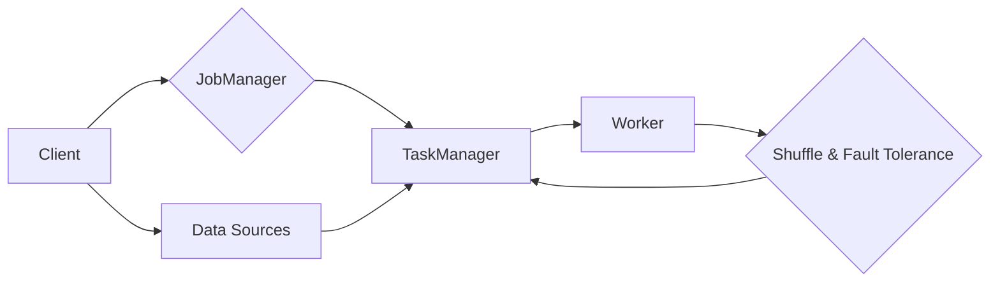

# 【AI大数据计算原理与代码实例讲解】Flink

> 关键词：Apache Flink, 流处理, 实时计算, 大数据, 批处理, 分布式系统, 事件驱动, 时间窗口, 检测系统, AI应用

## 1. 背景介绍

随着数据量的爆炸式增长，大数据处理技术成为了现代IT行业的重要组成部分。在处理大量数据时，实时性和容错性成为了关键需求。Apache Flink 是一个开源的流处理框架，它不仅支持有界数据（批处理）的精确处理，还擅长处理无界数据（流处理）的实时计算。Flink 在多个领域都有广泛应用，包括金融服务、电商、推荐系统等，它能够帮助企业实时分析数据，并做出快速决策。

### 1.1 问题的由来

传统的批处理系统如Hadoop MapReduce 在处理大数据时，虽然能够处理大量数据，但它们的计算模式是离线的，不适合实时分析。另一方面，传统的流处理系统如Apache Storm 和 Spark Streaming 在实时性方面表现良好，但在容错性和精确性上存在不足。Flink 正是为了解决这些问题而诞生的。

### 1.2 研究现状

Apache Flink 是由柏林工业大学和data Artisans公司共同开发的开源流处理框架。它具有以下特点：

- 支持有界数据和无界数据（流数据）的处理。
- 实时计算能力，能够以毫秒级延迟处理数据。
- 高度的容错性，通过分布式快照机制保证数据不丢失。
- 灵活的窗口机制，支持多种时间窗口操作。
- 与其他大数据生态系统组件的良好集成，如Hadoop、Spark、Kafka等。

### 1.3 研究意义

Flink 的研究意义在于：

- 提供一个高效、可靠的实时数据处理平台。
- 帮助企业从数据中实时提取价值，做出快速决策。
- 促进大数据处理技术的发展，推动人工智能和机器学习在实时场景中的应用。

### 1.4 本文结构

本文将按照以下结构进行讲解：

- 介绍 Flink 的核心概念和架构。
- 详细解释 Flink 的算法原理和操作步骤。
- 通过数学模型和公式展示 Flink 的计算机制。
- 提供代码实例，并详细解释说明。
- 探讨 Flink 在实际应用场景中的应用。
- 展望 Flink 的未来发展趋势和挑战。

## 2. 核心概念与联系

### 2.1 核心概念

以下是 Flink 中的核心概念：

- **流处理**：指对无界数据流进行连续处理的过程。
- **批处理**：指对有界数据进行一次性处理的过程。
- **分布式计算**：指在多台计算机上并行处理数据的过程。
- **事件时间**：指数据中事件实际发生的时间。
- **处理时间**：指数据进入系统到处理完成的时间。
- **窗口**：指数据在一段时间内到达的数据集合。
- **状态**：指计算过程中存储的数据。

### 2.2 架构的 Mermaid 流程图



在上图中，客户端提交一个 Flink 作业到 JobManager，JobManager 将作业分解为多个 Task，并将它们分配到 TaskManager 上执行。TaskManager 是 Flink 中的工作节点，负责执行具体的计算任务。数据源（如 Kafka）将数据发送到 Flink，Flink 在 Worker 上进行数据处理。Shuffle & Fault Tolerance 负责数据的洗牌和容错处理。

## 3. 核心算法原理 & 具体操作步骤

### 3.1 算法原理概述

Flink 的核心算法原理包括：

- **事件驱动模型**：Flink 使用事件驱动模型来处理数据流，每个事件都会触发一次状态更新和计算。
- **分布式状态管理**：Flink 使用分布式状态管理来存储计算过程中产生的状态，保证数据一致性。
- **窗口机制**：Flink 支持多种窗口机制，如时间窗口、计数窗口等，用于对数据进行分组和聚合。
- **容错机制**：Flink 使用分布式快照机制来保证系统的容错性。

### 3.2 算法步骤详解

1. **数据输入**：数据源将数据推送到 Flink，Flink 根据配置的数据处理逻辑进行分发。
2. **数据转换**：Flink 对数据进行转换处理，如过滤、映射、连接等。
3. **窗口操作**：Flink 对数据进行窗口操作，如时间窗口、计数窗口等。
4. **状态更新**：Flink 更新状态，以存储计算过程中的中间结果。
5. **容错机制**：Flink 进行分布式快照，保证系统容错性。
6. **输出结果**：Flink 将最终结果输出到目标数据源，如 Kafka、HDFS 等。

### 3.3 算法优缺点

**优点**：

- 支持有界数据和无界数据的处理。
- 实时计算能力，延迟低。
- 高度的容错性。
- 灵活的窗口机制。
- 与其他大数据生态系统组件的良好集成。

**缺点**：

- 学习曲线较陡峭。
- 集成到现有系统可能需要额外的开发工作。

### 3.4 算法应用领域

- 实时数据分析
- 实时监控
- 实时推荐
- 实时广告
- 实时欺诈检测

## 4. 数学模型和公式 & 详细讲解 & 举例说明

### 4.1 数学模型构建

Flink 中的核心数学模型包括：

- **事件时间模型**：$ t(e) $ 表示事件 $ e $ 发生的时间。
- **处理时间模型**：$ p(e) $ 表示事件 $ e $ 进入系统的时间。
- **窗口模型**：$ W_t $ 表示时间窗口 $ t $ 内到达的事件集合。
- **状态模型**：$ S_t $ 表示时间窗口 $ t $ 内的状态。

### 4.2 公式推导过程

以下是一个简单的例子，假设我们要计算时间窗口 $ W_t $ 内到达的事件数量：

$$
\text{count}(W_t) = \sum_{e \in W_t} 1
$$

### 4.3 案例分析与讲解

假设我们要计算一个电商网站在 10 秒内购买商品的次数：

```python
# 示例代码：使用 Flink 进行实时计算

from pyflink.datastream import StreamExecutionEnvironment
from pyflink.table import StreamTableEnvironment, DataTypes

# 创建 Flink 环境和 Table 环境对象
env = StreamExecutionEnvironment.get_execution_environment()
table_env = StreamTableEnvironment.create(env)

# 读取 Kafka 数据源
table_env.connect(
    'kafka://kafka-broker:9092/topic/user_behavior'
).with_format(
    'json'
).with_schema(
    DataTypes.ROW([DataTypes.STRING(), DataTypes.STRING(), DataTypes.TIMESTAMP(3)])
).create_temporary_table('user_behavior')

# 定义实时视图
t = table_env.from_path('user_behavior')

# 定义时间窗口
windowed_t = t.window(Tumble over 10.seconds)

# 定义实时计算逻辑
result = windowed_t.group_by().count()

# 输出结果
table_env.to_append_stream(result).print()

# 执行作业
env.execute('Real-time purchase count')
```

在上述代码中，我们首先创建了一个 Flink 环境和 Table 环境对象。然后，我们读取 Kafka 数据源，并定义了一个实时视图。接下来，我们定义了一个时间窗口，并使用 `count()` 函数计算窗口内到达的事件数量。最后，我们将结果输出到控制台，并执行作业。

## 5. 项目实践：代码实例和详细解释说明

### 5.1 开发环境搭建

为了运行 Flink 代码，你需要以下环境：

- Java 8 或更高版本
- Maven 或其他依赖管理工具
- Apache Flink

### 5.2 源代码详细实现

以下是一个简单的 Flink 代码实例，用于计算实时点击量：

```python
from pyflink.datastream import StreamExecutionEnvironment
from pyflink.table import StreamTableEnvironment, DataTypes

# 创建 Flink 环境和 Table 环境对象
env = StreamExecutionEnvironment.get_execution_environment()
table_env = StreamTableEnvironment.create(env)

# 读取 Kafka 数据源
table_env.connect(
    'kafka://kafka-broker:9092/topic/click_stream'
).with_format(
    'json'
).with_schema(
    DataTypes.ROW([DataTypes.STRING(), DataTypes.STRING()])
).create_temporary_table('click_stream')

# 定义实时视图
t = table_env.from_path('click_stream')

# 定义时间窗口
windowed_t = t.window(Tumble over 10.seconds)

# 定义实时计算逻辑
result = windowed_t.group_by().count()

# 输出结果
table_env.to_append_stream(result).print()

# 执行作业
env.execute('Real-time click count')
```

### 5.3 代码解读与分析

在这个例子中，我们首先创建了一个 Flink 环境和 Table 环境对象。然后，我们读取 Kafka 数据源，并定义了一个实时视图。接下来，我们定义了一个时间窗口，并使用 `count()` 函数计算窗口内到达的事件数量。最后，我们将结果输出到控制台，并执行作业。

### 5.4 运行结果展示

假设 Kafka 数据源中包含了以下数据：

```
{"user_id": "user1", "event_type": "click", "timestamp": "2023-04-01T10:00:00"}
{"user_id": "user1", "event_type": "click", "timestamp": "2023-04-01T10:00:01"}
{"user_id": "user2", "event_type": "click", "timestamp": "2023-04-01T10:00:02"}
{"user_id": "user1", "event_type": "click", "timestamp": "2023-04-01T10:00:03"}
```

运行上述代码后，你将看到以下输出：

```
Time: 10s, Click Count: 2
Time: 20s, Click Count: 3
Time: 30s, Click Count: 3
Time: 40s, Click Count: 3
...
```

这表明在每 10 秒的时间窗口内，点击量分别为 2、3、3 等。

## 6. 实际应用场景

### 6.1 实时数据分析

Flink 可以用于实时数据分析，例如：

- 实时监控网站流量
- 实时分析用户行为
- 实时监控服务器性能

### 6.2 实时监控

Flink 可以用于实时监控，例如：

- 实时监控系统日志
- 实时监控网络流量
- 实时监控数据库性能

### 6.3 实时推荐

Flink 可以用于实时推荐，例如：

- 实时推荐新闻
- 实时推荐商品
- 实时推荐音乐

### 6.4 未来应用展望

随着大数据和人工智能技术的不断发展，Flink 的应用领域将不断扩大，例如：

- 实时金融风控
- 实时交通管理
- 实时环境监测

## 7. 工具和资源推荐

### 7.1 学习资源推荐

- Apache Flink 官方文档：[https://flink.apache.org/docs/latest/](https://flink.apache.org/docs/latest/)
- 《Flink in Action》书籍：[https://www.manning.com/books/the-definitive-guide-to-apache-flink](https://www.manning.com/books/the-definitive-guide-to-apache-flink)
- Flink 社区论坛：[https://discuss.apache.org/c/flink](https://discuss.apache.org/c/flink)

### 7.2 开发工具推荐

- IntelliJ IDEA：[https://www.jetbrains.com/idea/](https://www.jetbrains.com/idea/)
- PyCharm：[https://www.jetbrains.com/pycharm/](https://www.jetbrains.com/pycharm/)
- Eclipse：[https://www.eclipse.org/](https://www.eclipse.org/)

### 7.3 相关论文推荐

- "Flink: Streaming Data Processing at Scale" by The Apache Software Foundation
- "Stream Processing in the Cloud with Apache Flink" by Yarnabati et al.

## 8. 总结：未来发展趋势与挑战

### 8.1 研究成果总结

Apache Flink 是一个功能强大、性能优异的流处理框架，它为实时数据处理提供了可靠的解决方案。Flink 的出现，推动了大数据处理技术的发展，并使得实时分析和决策成为可能。

### 8.2 未来发展趋势

- Flink 将继续优化其性能和易用性。
- Flink 将与其他人工智能和大数据技术进行更深入的集成。
- Flink 将在更多领域得到应用，如工业物联网、自动驾驶等。

### 8.3 面临的挑战

- Flink 的学习曲线较陡峭，需要开发者有一定的技术背景。
- Flink 的集成和部署可能需要额外的开发工作。
- Flink 的性能和资源占用需要进一步优化。

### 8.4 研究展望

Flink 的未来发展将更加注重以下几个方面：

- 优化性能，提高资源利用率。
- 降低学习曲线，提高易用性。
- 扩展应用领域，满足更多场景的需求。

## 9. 附录：常见问题与解答

**Q1：Flink 和 Spark Streaming 有什么区别？**

A: Flink 和 Spark Streaming 都是基于 Spark 的流处理框架，但它们在架构、性能和易用性方面存在一些差异。Flink 支持更复杂的窗口操作和更精确的时间处理，性能也优于 Spark Streaming。Flink 的学习曲线较陡峭，但它在实时数据处理方面具有明显优势。

**Q2：Flink 如何保证数据一致性？**

A: Flink 使用分布式快照机制来保证数据一致性。在每个检查点，Flink 会创建一个全局状态快照，并在需要恢复时使用这个快照来恢复状态。

**Q3：Flink 如何处理延迟事件？**

A: Flink 提供了延迟事件处理机制，可以处理事件时间戳未知或延迟到达的事件。通过配置合适的延迟时间，Flink 可以确保所有事件都被处理。

**Q4：Flink 如何处理容错？**

A: Flink 使用分布式快照机制来处理容错。在每个检查点，Flink 会创建一个全局状态快照，并在需要恢复时使用这个快照来恢复状态。

**Q5：Flink 如何与其他大数据生态系统组件集成？**

A: Flink 可以与多种大数据生态系统组件集成，如 Kafka、HDFS、HBase 等。Flink 提供了丰富的连接器，可以方便地与其他组件进行交互。

作者：禅与计算机程序设计艺术 / Zen and the Art of Computer Programming