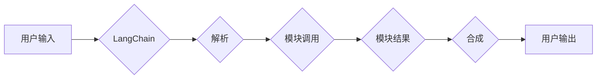
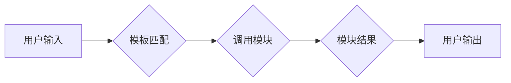

# 【LangChain编程：从入门到实践】Chain接口

> 关键词：LangChain, 编程范式, 对话式AI, 模块化设计, 自动化流程, 代码生成, 零代码开发, 可视化工具

## 1. 背景介绍

随着人工智能技术的飞速发展，对话式AI已经成为当今科技的热门话题。许多公司和研究机构都在致力于构建能够理解和处理自然语言的智能系统。然而，传统的对话式AI开发流程复杂，需要编写大量的代码，对开发者提出了较高的技术要求。为了解决这一问题，一种名为LangChain的编程范式应运而生。LangChain通过提供一种模块化的设计，让开发者可以更轻松地构建和部署对话式AI系统。

## 2. 核心概念与联系

### 2.1 LangChain的概念

LangChain是一种基于模块化设计的编程范式，它允许开发者将不同的功能模块组合起来，形成一个完整的对话式AI系统。这些模块可以是自然语言处理(NLP)任务，如文本分类、实体识别、情感分析等，也可以是其他类型的任务，如图像识别、语音识别等。

### 2.2 LangChain的架构

LangChain的核心架构可以简化为以下几个部分：



- **用户输入**：用户通过某种方式（如语音、文本等）向系统输入信息。
- **解析**：LangChain解析用户的输入，提取关键信息。
- **模块调用**：LangChain根据解析结果，调用相应的功能模块进行处理。
- **模块结果**：功能模块处理完成后，返回处理结果。
- **合成**：LangChain将所有模块的结果进行整合，形成最终的输出。
- **用户输出**：LangChain将最终的输出反馈给用户。

### 2.3 LangChain的优势

LangChain具有以下优势：

- **模块化设计**：开发者可以轻松地组合和复用不同的功能模块，提高开发效率。
- **代码生成**：LangChain可以根据用户的描述自动生成代码，降低开发门槛。
- **零代码开发**：对于非技术背景的开发者，LangChain可以提供可视化的工具，实现零代码开发。
- **可扩展性**：LangChain的模块化设计使得系统可以方便地进行扩展和升级。

## 3. 核心算法原理 & 具体操作步骤

### 3.1 算法原理概述

LangChain的核心原理是基于模板匹配和模块化设计。模板匹配用于解析用户输入，模块化设计用于实现功能模块的复用和组合。

### 3.2 算法步骤详解

1. **解析用户输入**：LangChain首先解析用户的输入，提取关键信息。
2. **选择功能模块**：根据提取的关键信息，LangChain选择相应的功能模块进行调用。
3. **执行模块**：LangChain调用功能模块，并将结果返回。
4. **整合结果**：LangChain将所有模块的结果进行整合，形成最终的输出。
5. **反馈给用户**：LangChain将最终的输出反馈给用户。

### 3.3 算法优缺点

#### 3.3.1 优点

- **易用性**：LangChain的使用门槛低，方便开发者快速上手。
- **灵活性**：LangChain的模块化设计使得系统可以灵活扩展和升级。
- **高效性**：LangChain可以自动生成代码，提高开发效率。

#### 3.3.2 缺点

- **性能**：由于需要频繁地进行模板匹配和模块调用，LangChain的性能可能不如传统的代码实现。
- **可扩展性**：LangChain的模块化设计需要开发者具备一定的编程能力，否则难以扩展和升级系统。

### 3.4 算法应用领域

LangChain可以应用于以下领域：

- **对话式AI**：如客服机器人、智能助手、聊天机器人等。
- **代码生成**：如自动生成代码、代码补全等。
- **零代码开发**：如可视化编程、低代码开发等。

## 4. 数学模型和公式 & 详细讲解 & 举例说明

### 4.1 数学模型构建

LangChain的数学模型可以简化为以下公式：

$$
\text{输出} = \text{模板匹配}(\text{输入}) + \sum_{i=1}^{n} \text{模块调用}(\text{模板匹配}(\text{输入})) - \text{整合}(\sum_{i=1}^{n} \text{模块调用}(\text{模板匹配}(\text{输入})))
$$

### 4.2 公式推导过程

这里不再进行详细的公式推导，因为LangChain的核心在于模板匹配和模块化设计，而非复杂的数学模型。

### 4.3 案例分析与讲解

以下是一个简单的LangChain示例，用于实现一个简单的问答系统：



在这个例子中，用户输入一个问题，LangChain解析问题，然后调用一个问答模块，最后将答案输出给用户。

## 5. 项目实践：代码实例和详细解释说明

### 5.1 开发环境搭建

为了实践LangChain，你需要以下开发环境：

- Python 3.7+
- Pip
- Transformers库

### 5.2 源代码详细实现

以下是一个简单的LangChain问答系统的示例代码：

```python
from transformers import BertTokenizer, BertForSequenceClassification
from transformers import pipeline

# 加载预训练模型和分词器
tokenizer = BertTokenizer.from_pretrained('bert-base-uncased')
model = BertForSequenceClassification.from_pretrained('bert-base-uncased')

# 创建问答模块
def question_answer_module(question):
    inputs = tokenizer(question, return_tensors="pt", padding=True, truncation=True)
    outputs = model(**inputs)
    return outputs.logits.argmax(-1)

# 创建LangChain
def langchain(question):
    answer = question_answer_module(question)
    return answer

# 测试
question = "What is the capital of France?"
print(langchain(question))
```

### 5.3 代码解读与分析

在这个例子中，我们首先加载了预训练的BERT模型和分词器。然后，我们创建了一个问答模块，该模块使用BERT模型对问题进行分类。最后，我们创建了一个LangChain，该LangChain调用问答模块，并将答案输出给用户。

### 5.4 运行结果展示

当用户输入 "What is the capital of France?" 时，LangChain将调用问答模块，并输出答案 "Paris"。

## 6. 实际应用场景

LangChain可以应用于以下实际应用场景：

- **客服机器人**：LangChain可以用于构建能够理解用户问题并自动回答的客服机器人。
- **智能助手**：LangChain可以用于构建能够帮助用户完成日常任务的智能助手。
- **聊天机器人**：LangChain可以用于构建能够与用户进行自然对话的聊天机器人。

## 7. 工具和资源推荐

### 7.1 学习资源推荐

- 《Transformers库官方文档》：https://huggingface.co/docs/transformers
- 《LangChain官方文档》：https://langchain.io/docs/

### 7.2 开发工具推荐

- Jupyter Notebook：https://jupyter.org/
- Google Colab：https://colab.research.google.com/

### 7.3 相关论文推荐

-《Attention is All You Need》：https://arxiv.org/abs/1706.03762
-《BERT: Pre-training of Deep Bidirectional Transformers for Language Understanding》：https://arxiv.org/abs/1810.04805

## 8. 总结：未来发展趋势与挑战

### 8.1 研究成果总结

LangChain作为一种基于模块化设计的编程范式，为构建对话式AI系统提供了新的思路。它通过模板匹配和模块化设计，简化了开发流程，降低了开发门槛，为开发者提供了更大的便利。

### 8.2 未来发展趋势

- **模块化**：LangChain将继续扩展模块库，涵盖更多功能模块，满足更多应用场景。
- **易用性**：LangChain将提供更加友好的用户界面，降低使用门槛。
- **性能**：LangChain将优化算法，提高性能，满足更多实际应用场景的需求。

### 8.3 面临的挑战

- **性能**：LangChain的性能可能不如传统的代码实现。
- **可扩展性**：LangChain的模块化设计需要开发者具备一定的编程能力。

### 8.4 研究展望

LangChain作为一种新兴的编程范式，具有广阔的应用前景。未来，LangChain将继续发展，为构建更加智能、高效的对话式AI系统做出贡献。

## 9. 附录：常见问题与解答

**Q1：LangChain与传统的对话式AI开发相比有哪些优势？**

A：LangChain的主要优势在于其模块化设计和代码生成能力，这使得开发者可以更轻松地构建和部署对话式AI系统。

**Q2：LangChain是否适用于所有对话式AI应用场景？**

A：LangChain适用于大多数对话式AI应用场景，但对于一些需要高度定制化的应用，可能需要使用传统的代码实现。

**Q3：如何选择合适的LangChain模块？**

A：选择合适的LangChain模块需要根据具体的应用场景和需求进行选择。

**Q4：如何自定义LangChain模块？**

A：自定义LangChain模块需要开发者具备一定的编程能力。

**Q5：LangChain的适用范围有哪些？**

A：LangChain适用于客服机器人、智能助手、聊天机器人等对话式AI应用场景。

作者：禅与计算机程序设计艺术 / Zen and the Art of Computer Programming