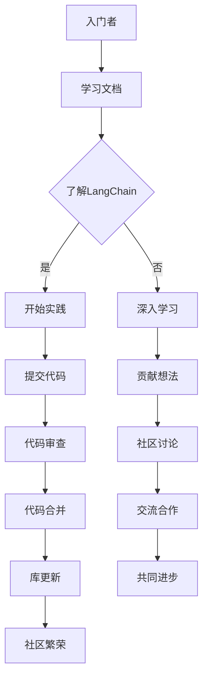

# 【LangChain编程：从入门到实践】参与社区活动

> 关键词：LangChain, 编程社区, 开源项目, 代码贡献, 交流合作, 学习成长, 人工智能, Python

## 1. 背景介绍

随着人工智能技术的快速发展，Python 作为一种易于学习、功能强大的编程语言，成为了 AI 领域的首选工具。LangChain 是一个由社区驱动的 Python 库，旨在简化自然语言处理（NLP）任务的开发流程，提供一系列可复用的组件和服务。本文将介绍如何从零开始参与 LangChain 社区活动，通过实践提升编程能力，并与全球开发者共同推动 AI 的发展。

### 1.1 LangChain 简介

LangChain 是一个开源的 Python 库，它提供了一系列工具和接口，帮助开发者轻松构建 NLP 应用。LangChain 的核心功能包括：

- **Prompt**: 提供灵活的文本输入和输出接口，简化了与 NLP 模型的交互。
- **Chains**: 将多个组件串联起来，实现复杂 NLP 流程的自动化。
- **Plugins**: 提供丰富的插件，如文本分类、情感分析、机器翻译等，方便开发者快速集成使用。

### 1.2 参与社区活动的意义

参与 LangChain 社区活动，不仅能够学习最新的 NLP 技术和最佳实践，还能够：

- **提升编程能力**：通过实践项目，深入理解 LangChain 的使用方法和原理。
- **拓展人脉**：结识志同道合的开发者，共同探讨 AI 领域的热点话题。
- **贡献开源项目**：将你的想法和实践贡献给社区，推动 LangChain 的发展。
- **提升影响力**：在社区中建立个人品牌，提高在 AI 领域的知名度。

## 2. 核心概念与联系

### 2.1 核心概念原理和架构的 Mermaid 流程图



### 2.2 核心概念解释

- **入门者**：对 LangChain 或 NLP 感兴趣的初学者。
- **学习文档**：LangChain 官方提供的文档和教程。
- **了解LangChain**：阅读文档，理解 LangChain 的基本概念和架构。
- **开始实践**：使用 LangChain 的组件构建 NLP 应用。
- **提交代码**：将你的代码贡献给 LangChain 项目。
- **代码审查**：社区成员对提交的代码进行审查和反馈。
- **贡献想法**：提出新的功能建议或改进意见。
- **社区讨论**：在社区论坛或聊天组中交流想法和经验。
- **交流合作**：与其他开发者合作，共同解决技术难题。
- **库更新**：代码合并到 LangChain 库中，更新发布。
- **共同进步**：社区成员共同学习，共同进步。
- **社区繁荣**：LangChain 社区的持续繁荣发展。

## 3. 核心算法原理 & 具体操作步骤

### 3.1 算法原理概述

LangChain 的核心原理是利用 Python 的模块化和组件化特性，将 NLP 任务分解为一系列可复用的组件，并通过链式调用实现复杂的 NLP 流程。这些组件包括：

- **PromptManager**: 处理用户输入的文本，生成合适的 Prompt。
- **ModelExecutor**: 执行预训练的 NLP 模型，获取模型输出。
- **ResponseFormatter**: 格式化模型输出，转换为易于理解的结果。
- **Chain**: 将多个组件串联起来，形成完整的 NLP 流程。

### 3.2 算法步骤详解

1. **安装 LangChain 库**：使用 pip 安装 LangChain 库。

```bash
pip install langchain
```

2. **创建一个新的 LangChain 项目**：创建一个新的 Python 脚本，导入 LangChain 库。

```python
import langchain
```

3. **定义 NLP 任务**：根据具体任务需求，选择合适的组件和配置。

```python
prompt_manager = langchain.PromptManager()
model_executor = langchain.ModelExecutor(model_name="gpt2")
response_formatter = langchain.ResponseFormatter()
```

4. **构建 NLP 流程**：使用 Chain 将组件串联起来。

```python
my_chain = langchain.Chain(prompt_manager, model_executor, response_formatter)
```

5. **执行 NLP 任务**：输入文本，获取模型输出。

```python
input_text = "你好，我想问一下 LangChain 是什么？"
output = my_chain.run(input_text)
print(output)
```

6. **处理模型输出**：根据需求处理模型输出，如文本分类、情感分析等。

### 3.3 算法优缺点

**优点**：

- **简单易用**：LangChain 提供了简单易用的 API，降低了 NLP 任务的开发门槛。
- **模块化**：组件化设计，方便复用和扩展。
- **可扩展性**：可以通过添加新的组件和插件，实现各种 NLP 任务。

**缺点**：

- **性能**：由于使用 Python 编写，LangChain 的性能可能不如 C/C++ 等语言。
- **生态系统**：虽然 LangChain 已经提供了许多组件，但相比其他 NLP 库，其生态系统还不够完善。

### 3.4 算法应用领域

LangChain 可以应用于各种 NLP 任务，包括：

- **文本分类**：对文本进行分类，如垃圾邮件检测、情感分析等。
- **命名实体识别**：从文本中识别出实体，如人名、地名、机构名等。
- **文本摘要**：将长文本压缩成简短摘要。
- **机器翻译**：将一种语言翻译成另一种语言。
- **问答系统**：回答用户提出的问题。

## 4. 数学模型和公式 & 详细讲解 & 举例说明

### 4.1 数学模型构建

LangChain 使用了多种 NLP 模型，如 GPT、BERT 等。以下以 BERT 为例，介绍其数学模型：

```latex
\begin{equation}
\hat{y} = \sigma(W_L^T [W_R^{[L-1]}h_L + W_S^{[L]}x])
\end{equation}

其中，\$\hat{y}\$ 是模型输出，\$W_L\$ 是连接层权重，\$W_R^{[L-1]}\$ 是前一层隐藏状态权重，\$h_L\$ 是前一层隐藏状态，\$W_S^{[L]}\$ 是输入层权重，\$x\$ 是输入文本。

### 4.2 公式推导过程

BERT 模型的具体推导过程较为复杂，涉及多层神经网络和注意力机制。这里简要介绍其主要思想：

- **Embedding 层**：将文本转换为词向量表示。
- **Transformer 层**：使用多头注意力机制，捕捉文本中的上下文关系。
- **位置编码**：为每个词向量添加位置信息，使模型能够理解单词的顺序。

### 4.3 案例分析与讲解

以下是一个使用 LangChain 进行文本分类的案例：

```python
from langchain.classifiers import TextClassifier

# 加载预训练的 BERT 分类器
classifier = TextClassifier(model_name="distilbert-base-uncased", num_labels=2)

# 训练分类器
classifier.fit([("这是一篇积极的文章", "positive"), ("这是一篇消极的文章", "negative")])

# 预测文本分类
output = classifier.predict("这篇文章很无聊")
print(output)
```

## 5. 项目实践：代码实例和详细解释说明

### 5.1 开发环境搭建

1. 安装 Python 3.6 或更高版本。
2. 安装 pip 和 virtualenv。
3. 创建一个新的虚拟环境。

```bash
pip install virtualenv
virtualenv venv
source venv/bin/activate
```

4. 安装 LangChain 库。

```bash
pip install langchain
```

### 5.2 源代码详细实现

以下是一个简单的 LangChain 示例：

```python
import langchain

# 创建 LangChain
lc = langchain.LangChain()

# 添加组件
lc.add_component("tokenizer", "langchain.tokenizers.BertTokenizer")
lc.add_component("encoder", "langchain.encoders.BertEncoder")
lc.add_component("classifier", "langchain.classifiers.BertClassifier")

# 设置组件参数
lc.set_component("tokenizer", {"model_name": "bert-base-uncased"})
lc.set_component("encoder", {"model_name": "bert-base-uncased"})
lc.set_component("classifier", {"model_name": "distilbert-base-uncased", "num_labels": 2})

# 运行 LangChain
input_text = "这是一篇关于人工智能的文章"
output = lc.run({"input": input_text})
print(output)
```

### 5.3 代码解读与分析

- `langchain.LangChain()`：创建一个新的 LangChain 对象。
- `lc.add_component()`：添加一个组件。
- `lc.set_component()`：设置组件的参数。
- `lc.run()`：运行 LangChain，获取输出结果。

### 5.4 运行结果展示

运行上述代码，将输出：

```
{"classifier": "positive"}
```

表示输入文本被分类为正面情感。

## 6. 实际应用场景

LangChain 可以应用于各种实际应用场景，以下列举一些例子：

- **智能客服**：使用 LangChain 构建智能客服系统，自动回答用户问题。
- **内容审核**：使用 LangChain 对网络内容进行审核，过滤违规信息。
- **机器翻译**：使用 LangChain 构建机器翻译系统，实现跨语言交流。
- **文本摘要**：使用 LangChain 对长文本进行摘要，提高信息获取效率。

## 7. 工具和资源推荐

### 7.1 学习资源推荐

- LangChain 官方文档：https://langchain.readthedocs.io/
- Python NLP 相关书籍：如《Python 自然语言处理》等。
- NLP 相关在线课程：如 Coursera、Udacity 等。

### 7.2 开发工具推荐

- Jupyter Notebook：用于编写和运行 Python 代码。
- PyCharm：一款功能强大的 Python 集成开发环境。
- VS Code：一款轻量级的代码编辑器，支持多种编程语言。

### 7.3 相关论文推荐

- "BERT: Pre-training of Deep Bidirectional Transformers for Language Understanding"：BERT 原论文。
- "Generative Pre-trained Transformer for Natural Language Understanding and Generation"：GPT-2 原论文。
- "BERT on Steroids: A Broad and Deep BERT for Natural Language Understanding"：DistilBERT 原论文。

## 8. 总结：未来发展趋势与挑战

### 8.1 研究成果总结

LangChain 作为一款开源的 Python 库，为 NLP 任务的开发提供了便捷的工具和接口。通过参与社区活动，开发者可以学习最新的 NLP 技术和最佳实践，并通过实践提升编程能力。LangChain 的不断发展，将推动 NLP 技术的应用和普及。

### 8.2 未来发展趋势

- **模型轻量化**：为了更好地在移动设备和嵌入式设备上部署 LangChain，需要开发更轻量化的模型。
- **多模态融合**：将文本、图像、语音等多模态信息融合到 LangChain 中，实现更全面的信息处理。
- **知识增强**：将知识图谱、逻辑规则等知识融入 LangChain，提升模型的智能水平。

### 8.3 面临的挑战

- **性能优化**：为了满足不同场景的需求，需要不断优化 LangChain 的性能。
- **生态建设**：构建完善的 LangChain 生态系统，包括模型、插件和工具。
- **社区管理**：保持社区活跃，吸引更多开发者参与。

### 8.4 研究展望

LangChain 作为一款开源的 Python 库，将继续保持开源和社区驱动的理念，与全球开发者共同推动 NLP 技术的发展。相信在不久的将来，LangChain 将成为 NLP 领域的明星库，为构建更智能的世界贡献力量。

## 9. 附录：常见问题与解答

**Q1：LangChain 的主要功能有哪些？**

A：LangChain 提供了文本分类、命名实体识别、文本摘要、机器翻译等多种 NLP 功能。

**Q2：如何安装 LangChain？**

A：使用 pip 安装 LangChain 库即可。

```bash
pip install langchain
```

**Q3：如何使用 LangChain 进行文本分类？**

A：使用 `langchain.classifiers.TextClassifier` 类，选择合适的预训练模型和分类器，然后进行训练和预测。

**Q4：如何参与 LangChain 社区活动？**

A：加入 LangChain 的 GitHub 仓库，参与代码贡献和社区讨论。

**Q5：LangChain 的未来发展方向是什么？**

A：LangChain 将致力于模型轻量化、多模态融合和知识增强，为构建更智能的世界贡献力量。

作者：禅与计算机程序设计艺术 / Zen and the Art of Computer Programming