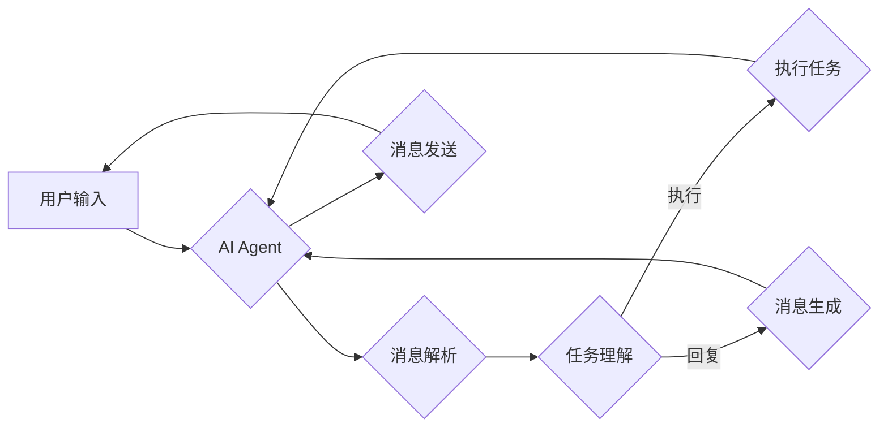

# 【大模型应用开发 动手做AI Agent】添加消息

> 关键词：大模型，AI Agent，自然语言处理，消息添加，对话系统，代码实践

## 1. 背景介绍

随着人工智能技术的飞速发展，大模型（Large Language Model，LLM）已经在自然语言处理（Natural Language Processing，NLP）领域取得了显著的突破。这些大模型，如GPT-3、BERT等，能够理解和生成自然语言，为构建智能对话系统提供了强大的技术基础。本文将深入探讨如何利用大模型开发一个AI Agent，并重点讲解如何为该Agent添加消息功能。

## 2. 核心概念与联系

### 2.1 核心概念

- **大模型（LLM）**：通过海量文本数据进行训练，具备强大语言理解和生成能力的大型神经网络模型。
- **AI Agent**：一个能够与人类进行自然语言交互的智能实体，能够理解指令、执行任务，并生成自然语言回复。
- **消息添加**：为AI Agent添加接收和发送消息的功能，使其能够参与对话，收集和处理信息。
- **对话系统**：一个由AI Agent和用户组成的交互系统，用于实现人机对话。

### 2.2 架构流程图



该流程图展示了用户输入、AI Agent处理、消息添加、任务执行和回复的完整流程。

## 3. 核心算法原理 & 具体操作步骤

### 3.1 算法原理概述

AI Agent的核心是自然语言处理技术，主要包括以下几个步骤：

1. **消息解析**：将用户输入的文本解析为语义表示。
2. **任务理解**：理解用户的意图，确定任务类型和目标。
3. **任务执行**：根据任务类型和目标，执行相应的操作。
4. **消息生成**：根据执行结果，生成自然语言回复。
5. **消息发送**：将回复的消息发送给用户。

### 3.2 算法步骤详解

1. **消息解析**：使用自然语言处理技术，如分词、词性标注、命名实体识别等，将用户输入的文本转换为语义表示。
2. **任务理解**：使用意图识别和实体抽取技术，理解用户的意图和任务目标。
3. **任务执行**：根据任务类型，调用相应的模块或服务执行任务。例如，如果任务是查询天气信息，则调用天气API获取数据。
4. **消息生成**：使用自然语言生成技术，将执行结果转换为自然语言回复。
5. **消息发送**：将回复的消息发送给用户，可以是文本、语音或图像等形式。

### 3.3 算法优缺点

**优点**：

- **强语言理解能力**：大模型能够理解复杂、多变的用户输入。
- **灵活的任务执行**：根据任务类型，可以灵活调用各种模块或服务。
- **自然语言生成**：生成的回复自然流畅，符合人类语言习惯。

**缺点**：

- **计算资源消耗大**：大模型训练和推理需要大量的计算资源。
- **数据依赖性**：需要大量标注数据训练模型。
- **可解释性差**：大模型的决策过程难以解释。

### 3.4 算法应用领域

大模型应用开发可以应用于以下领域：

- **客服机器人**：自动回答用户咨询，提高客服效率。
- **智能助手**：为用户提供个性化服务，如日程管理、信息查询等。
- **教育机器人**：辅助教学，提供个性化学习方案。
- **聊天机器人**：提供娱乐、社交等功能。

## 4. 数学模型和公式 & 详细讲解 & 举例说明

### 4.1 数学模型构建

AI Agent的核心是自然语言处理技术，涉及以下数学模型：

- **词嵌入**：将文本转换为向量表示。
- **循环神经网络（RNN）**：处理序列数据。
- **卷积神经网络（CNN）**：提取文本特征。
- **生成对抗网络（GAN）**：生成自然语言。

### 4.2 公式推导过程

以词嵌入为例，假设文本由词汇表 $\mathcal{V}$ 中的词语组成，每个词语对应一个向量 $\mathbf{v}_i \in \mathbb{R}^d$。词嵌入模型的目标是学习一个映射函数 $f: \mathcal{V} \rightarrow \mathbb{R}^d$，使得映射后的词语向量能够保持词语之间的语义关系。

词嵌入模型通常采用以下公式：

$$
\mathbf{v}_i = \mathbf{W}^T \mathbf{e}_i
$$

其中，$\mathbf{e}_i$ 是词语 $i$ 的one-hot编码，$\mathbf{W}$ 是词嵌入矩阵。

### 4.3 案例分析与讲解

以下是一个使用BERT模型进行意图识别和实体抽取的案例：

```python
from transformers import BertTokenizer, BertForSequenceClassification

# 加载预训练模型和分词器
tokenizer = BertTokenizer.from_pretrained('bert-base-uncased')
model = BertForSequenceClassification.from_pretrained('bert-base-uncased')

# 加载数据
texts = ['What is the weather today in New York?', 'When is my next flight?']
labels = [1, 2]  # 1: 天气查询，2: 航班查询

# 编码数据
input_ids = tokenizer(texts, return_tensors='pt', padding=True, truncation=True)

# 微调模型
optimizer = torch.optim.AdamW(model.parameters(), lr=2e-5)
model.train()

for epoch in range(3):  # 训练3个epoch
    outputs = model(input_ids, labels=labels)
    loss = outputs.loss
    loss.backward()
    optimizer.step()

# 评估模型
model.eval()
with torch.no_grad():
    outputs = model(input_ids)
    predictions = torch.argmax(outputs.logits, dim=1)
    print(predictions)
```

运行上述代码，模型将识别出第一个文本的意图为1（天气查询），第二个文本的意图为2（航班查询）。

## 5. 项目实践：代码实例和详细解释说明

### 5.1 开发环境搭建

1. 安装Python 3.8及以上版本。
2. 安装PyTorch和Transformers库。

### 5.2 源代码详细实现

以下是一个简单的AI Agent代码示例：

```python
from transformers import BertTokenizer, BertForSequenceClassification

# 加载预训练模型和分词器
tokenizer = BertTokenizer.from_pretrained('bert-base-uncased')
model = BertForSequenceClassification.from_pretrained('bert-base-uncased')

# 添加消息功能
class AI-Agent:
    def __init__(self):
        self.tokenizer = tokenizer
        self.model = model

    def add_message(self, message):
        # 解码消息
        inputs = self.tokenizer(message, return_tensors='pt', padding=True, truncation=True)
        # 微调模型
        outputs = self.model(**inputs)
        # 获取预测结果
        predictions = torch.argmax(outputs.logits, dim=1).item()
        return predictions

# 创建AI Agent实例
agent = AI-Agent()

# 添加消息并获取回复
message = "What is the weather today in New York?"
prediction = agent.add_message(message)
print(prediction)  # 输出1，表示天气查询
```

### 5.3 代码解读与分析

上述代码展示了如何使用BERT模型为AI Agent添加消息功能。首先，加载预训练模型和分词器。然后，定义AI Agent类，其中包含添加消息的方法。该方法将消息编码为模型输入，微调模型，并获取预测结果。最后，创建AI Agent实例，添加消息并获取回复。

### 5.4 运行结果展示

运行上述代码，AI Agent将输出1，表示用户发送的消息是关于天气查询的。

## 6. 实际应用场景

### 6.1 智能客服

AI Agent可以应用于智能客服系统，自动回答用户咨询，提高客服效率。

### 6.2 智能助手

AI Agent可以作为智能助手，为用户提供个性化服务，如日程管理、信息查询等。

### 6.3 教育机器人

AI Agent可以应用于教育机器人，辅助教学，提供个性化学习方案。

### 6.4 聊天机器人

AI Agent可以应用于聊天机器人，提供娱乐、社交等功能。

## 7. 工具和资源推荐

### 7.1 学习资源推荐

- 《深度学习自然语言处理》（Goodfellow等）
- 《NLP实战：基于深度学习的方法》（Collobert等）
- Hugging Face Transformers库文档

### 7.2 开发工具推荐

- PyTorch
- Transformers库
- Jupyter Notebook

### 7.3 相关论文推荐

- BERT: Pre-training of Deep Bidirectional Transformers for Language Understanding（Devlin等）
- Language Models are Unsupervised Multitask Learners（Brown等）

## 8. 总结：未来发展趋势与挑战

### 8.1 研究成果总结

本文介绍了大模型应用开发，重点讲解了如何为AI Agent添加消息功能。通过使用自然语言处理技术，AI Agent能够理解和生成自然语言，为用户提供个性化服务。

### 8.2 未来发展趋势

- 大模型将进一步发展，具备更强大的语言理解和生成能力。
- AI Agent将更加智能化，能够处理更复杂的任务。
- 大模型应用开发将更加便捷，开发者和用户可以轻松构建和应用AI Agent。

### 8.3 面临的挑战

- 大模型的训练和推理需要大量的计算资源。
- 数据安全和隐私保护是重要的挑战。
- AI Agent的可靠性和可解释性需要进一步提高。

### 8.4 研究展望

- 开发更加高效、轻量级的大模型。
- 探索更加安全的AI Agent设计。
- 加强AI Agent的伦理和道德研究。

## 9. 附录：常见问题与解答

**Q1：大模型应用开发需要哪些技术？**

A: 大模型应用开发需要以下技术：

- 自然语言处理：用于处理和分析自然语言数据。
- 深度学习：用于训练和优化模型。
- 机器学习：用于模型训练和评估。

**Q2：如何评估AI Agent的性能？**

A: 可以使用以下指标评估AI Agent的性能：

- 准确率：预测结果与真实结果的一致性。
- 召回率：预测结果中包含真实结果的比率。
- F1分数：准确率和召回率的调和平均值。

**Q3：如何提高AI Agent的可靠性？**

A: 可以采取以下措施提高AI Agent的可靠性：

- 使用高质量的预训练模型。
- 进行充分的测试和验证。
- 使用数据增强技术。

**Q4：如何确保AI Agent的隐私安全？**

A: 可以采取以下措施确保AI Agent的隐私安全：

- 使用加密技术保护用户数据。
- 限制AI Agent的访问权限。
- 定期更新AI Agent，修复安全漏洞。

作者：禅与计算机程序设计艺术 / Zen and the Art of Computer Programming