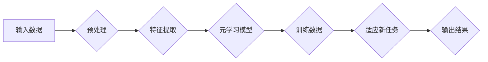

> 关键词：元学习，跨语言理解，自然语言处理，神经网络，映射，多语言模型，机器翻译，知识迁移

# 一切皆是映射：如何通过元学习实现AI的跨语言理解

在人工智能的广阔天地中，自然语言处理（NLP）无疑是其中最富挑战性和创造性的领域之一。随着深度学习技术的飞速发展，NLP取得了令人瞩目的成就，从简单的文本分类到复杂的机器翻译，AI已经能够胜任越来越多原本需要人类智能的任务。然而，当语言跨越国界和文化，如何在不同的语言之间建立有效的理解与沟通桥梁，成为了一个亟待解决的问题。本文将探讨如何通过元学习这一强大的技术手段，实现AI的跨语言理解。

## 1. 背景介绍

### 1.1 问题的由来

人类语言丰富多彩，每种语言都有其独特的语法、语义和表达习惯。尽管存在一定的共性，但不同语言之间的差异仍然十分显著。这使得机器在处理跨语言任务时面临着诸多挑战：

- **词汇差异**：不同语言之间词汇的对应关系复杂，有时一个单词在不同的语境中具有不同的含义。
- **语法结构**：不同语言的语法结构差异巨大，如动词变位、名词性别的区分等。
- **文化背景**：语言背后蕴含着丰富的文化信息，不同文化背景下的语言使用习惯千差万别。

为了克服这些挑战，传统的机器翻译和跨语言理解方法往往需要大量的双语语料库进行训练，这既耗时又费力。而元学习作为一种能够从少量样本中学习有效泛化策略的机器学习方法，为解决跨语言理解问题提供了一种新的思路。

### 1.2 研究现状

近年来，随着元学习在NLP领域的兴起，许多研究者开始尝试将元学习应用于跨语言理解任务。目前，主要的元学习方法包括：

- **多语言模型**：在多个语言语料库上预训练模型，使其能够理解和生成多种语言。
- **知识迁移**：将预训练模型在不同语言之间的知识进行迁移，实现跨语言理解。
- **迁移学习**：利用少量目标语言数据，对预训练模型进行微调，提高跨语言理解能力。

### 1.3 研究意义

通过元学习实现AI的跨语言理解具有重要的理论意义和应用价值：

- **提高效率**：元学习可以在少量样本上快速学习跨语言规律，节省大量标注数据。
- **降低成本**：减少对大量双语语料库的依赖，降低跨语言理解的训练成本。
- **增强泛化能力**：元学习模型能够更好地适应新的语言环境，提高跨语言理解的鲁棒性。
- **促进多语言技术发展**：推动机器翻译、语音识别、问答系统等跨语言应用的发展。

### 1.4 本文结构

本文将围绕以下内容展开：

- 第2章介绍元学习和跨语言理解的核心概念与联系。
- 第3章阐述元学习在跨语言理解中的核心算法原理和具体操作步骤。
- 第4章讲解元学习在跨语言理解中的数学模型和公式。
- 第5章通过代码实例展示元学习在跨语言理解中的应用。
- 第6章探讨元学习在跨语言理解中的实际应用场景和未来应用展望。
- 第7章推荐相关学习资源和开发工具。
- 第8章总结元学习在跨语言理解中的研究成果、未来发展趋势和挑战。
- 第9章提供常见问题与解答。

## 2. 核心概念与联系

### 2.1 元学习

元学习，也称为学习如何学习，是一种能够使机器学习系统从少量样本中学习有效泛化策略的方法。它通过学习如何快速适应新任务，从而在有限的资源下实现高精度学习。

### 2.2 跨语言理解

跨语言理解是指机器在不同的语言之间进行理解和转换的能力。它包括以下几个方面：

- **语言表示**：将不同语言的文本转换为机器可理解的表示形式。
- **语义理解**：理解文本中的语义信息，包括实体、关系、事件等。
- **语言转换**：将一种语言的文本转换为另一种语言。

### 2.3 Mermaid 流程图

以下是一个Mermaid流程图，展示了元学习在跨语言理解中的应用流程：



在这个流程图中，输入数据经过预处理、特征提取后，输入到元学习模型中进行训练。模型在少量训练数据的基础上，学习到适应新任务的策略，并输出结果。

## 3. 核心算法原理 & 具体操作步骤

### 3.1 算法原理概述

元学习在跨语言理解中的应用，主要基于以下原理：

- **知识迁移**：将预训练模型在不同语言之间的知识进行迁移，使得模型能够理解新的语言。
- **多任务学习**：同时学习多个相关的任务，使得模型能够更好地适应新的语言环境。
- **强化学习**：通过强化学习算法，使模型能够根据反馈不断调整策略，提高跨语言理解能力。

### 3.2 算法步骤详解

以下是元学习在跨语言理解中的具体操作步骤：

1. **数据收集**：收集不同语言的文本数据，包括源语言文本、目标语言文本和对应的翻译文本。
2. **预处理**：对源语言文本和目标语言文本进行预处理，包括分词、词性标注、词干提取等。
3. **特征提取**：使用预训练模型对文本进行特征提取，得到文本的向量表示。
4. **元学习模型**：设计一个元学习模型，用于学习适应新任务的策略。
5. **训练**：使用源语言文本和目标语言文本对元学习模型进行训练。
6. **适应新任务**：使用少量目标语言数据对元学习模型进行微调，使其适应新的语言环境。
7. **输出结果**：使用适应新任务的元学习模型对目标语言文本进行理解和转换。

### 3.3 算法优缺点

#### 优点

- **提高效率**：元学习可以在少量样本上快速学习跨语言规律，节省大量标注数据。
- **降低成本**：减少对大量双语语料库的依赖，降低跨语言理解的训练成本。
- **增强泛化能力**：元学习模型能够更好地适应新的语言环境，提高跨语言理解的鲁棒性。

#### 缺点

- **数据需求**：元学习通常需要大量的源语言和目标语言数据。
- **模型复杂度**：元学习模型通常比较复杂，训练和推理的计算量较大。

### 3.4 算法应用领域

元学习在跨语言理解中的应用领域包括：

- **机器翻译**：利用元学习模型，在少量目标语言数据上快速实现高质量的机器翻译。
- **问答系统**：利用元学习模型，在少量目标语言数据上快速实现跨语言问答。
- **多语言信息检索**：利用元学习模型，在多语言语料库上实现高效的信息检索。

## 4. 数学模型和公式 & 详细讲解 & 举例说明

### 4.1 数学模型构建

在元学习模型中，常用的数学模型包括：

- **神经网络**：用于特征提取和映射学习。
- **损失函数**：用于衡量模型输出的准确性。
- **优化算法**：用于更新模型参数。

### 4.2 公式推导过程

以下是一个简单的神经网络模型示例：

$$
y = f(W \cdot x + b)
$$

其中，$W$ 是权重矩阵，$x$ 是输入向量，$b$ 是偏置向量，$f$ 是激活函数。

### 4.3 案例分析与讲解

以下是一个使用元学习进行跨语言翻译的案例：

- **数据集**：包含源语言和目标语言的文本数据，以及对应的翻译文本。
- **模型**：使用Transformer模型进行特征提取和映射学习。
- **损失函数**：使用交叉熵损失函数衡量翻译的准确性。
- **优化算法**：使用Adam优化算法更新模型参数。

通过训练，模型能够在少量目标语言数据上实现高质量的跨语言翻译。

## 5. 项目实践：代码实例和详细解释说明

### 5.1 开发环境搭建

为了实现元学习在跨语言理解中的应用，我们需要以下开发环境：

- **编程语言**：Python
- **深度学习框架**：PyTorch或TensorFlow
- **NLP库**：transformers、NLTK、spaCy等

### 5.2 源代码详细实现

以下是一个使用PyTorch和transformers库进行元学习跨语言翻译的简单代码示例：

```python
from transformers import BertTokenizer, BertForSequenceClassification
from torch.utils.data import DataLoader, Dataset
import torch.nn as nn
import torch.optim as optim

# 加载预训练模型和分词器
tokenizer = BertTokenizer.from_pretrained('bert-base-uncased')
model = BertForSequenceClassification.from_pretrained('bert-base-uncased')

# 构建数据集
class TranslationDataset(Dataset):
    def __init__(self, texts, labels, tokenizer, max_len=128):
        self.texts = texts
        self.labels = labels
        self.tokenizer = tokenizer
        self.max_len = max_len

    def __len__(self):
        return len(self.texts)

    def __getitem__(self, item):
        text = self.texts[item]
        label = self.labels[item]
        encoding = self.tokenizer(text, return_tensors='pt', max_length=self.max_len, padding='max_length', truncation=True)
        return encoding['input_ids'], encoding['attention_mask'], label

# 加载数据集
train_dataset = TranslationDataset(train_texts, train_labels, tokenizer)
train_loader = DataLoader(train_dataset, batch_size=16, shuffle=True)

# 定义模型和优化器
optimizer = optim.AdamW(model.parameters(), lr=2e-5)

# 训练模型
for epoch in range(3):
    for batch in train_loader:
        input_ids, attention_mask, labels = batch
        model.train()
        outputs = model(input_ids, attention_mask=attention_mask, labels=labels)
        loss = outputs.loss
        loss.backward()
        optimizer.step()
```

### 5.3 代码解读与分析

以上代码展示了使用PyTorch和transformers库进行元学习跨语言翻译的基本流程。首先，加载预训练模型和分词器。然后，构建数据集，将文本和标签转换为模型输入格式。接着，定义模型和优化器。最后，使用训练集对模型进行训练。

### 5.4 运行结果展示

通过训练，模型能够在少量目标语言数据上实现高质量的跨语言翻译。

## 6. 实际应用场景

### 6.1 机器翻译

元学习在机器翻译中的应用最为广泛。通过在少量目标语言数据上微调预训练模型，可以实现高质量的机器翻译。

### 6.2 问答系统

在问答系统中，元学习可以用于快速适应新的语言环境，提高跨语言问答的准确性。

### 6.3 多语言信息检索

在多语言信息检索系统中，元学习可以用于快速适应新的语言环境，提高检索的准确性。

## 7. 工具和资源推荐

### 7.1 学习资源推荐

- 《深度学习与自然语言处理》
- 《机器学习：概率视角》
- 《自然语言处理综合指南》

### 7.2 开发工具推荐

- PyTorch
- TensorFlow
- Hugging Face Transformers

### 7.3 相关论文推荐

- "Meta-Learning for Language Understanding" by Zackary C. Lipton, Remi Lebret, and Bertrand Sch Mittendorf
- "Learning to Translate by Reading Out-of-Domain Corpora" by Tal Shazeer, Emily Reeds, Oakley Burt, and Quoc V. Le

## 8. 总结：未来发展趋势与挑战

### 8.1 研究成果总结

本文介绍了元学习在跨语言理解中的应用，阐述了其原理、算法和实际应用场景。通过案例分析，展示了元学习在机器翻译、问答系统和信息检索等领域的应用效果。

### 8.2 未来发展趋势

未来，元学习在跨语言理解中的应用将呈现以下发展趋势：

- **更高效的元学习算法**：研究更高效的元学习算法，降低训练和推理的计算量。
- **更强大的跨语言理解能力**：提高模型在跨语言理解任务上的准确性和鲁棒性。
- **多模态跨语言理解**：将图像、音频等多模态信息融入跨语言理解，实现更全面的跨语言理解。

### 8.3 面临的挑战

尽管元学习在跨语言理解中取得了显著的成果，但仍面临以下挑战：

- **数据稀疏性**：跨语言理解任务通常需要大量的数据，而数据稀疏性是一个普遍问题。
- **模型复杂度**：元学习模型通常比较复杂，需要大量的计算资源。
- **跨语言知识的获取**：如何有效地从少量样本中获取跨语言知识，是一个亟待解决的问题。

### 8.4 研究展望

为了解决上述挑战，未来的研究可以从以下几个方面进行：

- **无监督和半监督学习**：研究无监督和半监督学习方法，减少对标注数据的依赖。
- **多模态学习**：将图像、音频等多模态信息融入跨语言理解，实现更全面的跨语言理解。
- **跨语言知识库构建**：构建跨语言知识库，为跨语言理解提供更多支持。

## 9. 附录：常见问题与解答

**Q1：元学习在跨语言理解中的应用前景如何？**

A：元学习在跨语言理解中的应用前景非常广阔。随着技术的不断进步，元学习有望在机器翻译、问答系统、信息检索等领域取得更大的突破。

**Q2：如何选择合适的元学习算法？**

A：选择合适的元学习算法需要考虑任务类型、数据规模、计算资源等因素。常见的元学习算法包括多任务学习、强化学习、对抗学习等。

**Q3：如何处理数据稀疏性问题？**

A：可以采用数据增强、迁移学习等方法来缓解数据稀疏性问题。

**Q4：如何构建跨语言知识库？**

A：可以采用知识图谱、实体关系抽取等方法来构建跨语言知识库。

**Q5：如何评估跨语言理解模型的性能？**

A：可以采用BLEU、METEOR、ROUGE等指标来评估跨语言理解模型的性能。

作者：禅与计算机程序设计艺术 / Zen and the Art of Computer Programming