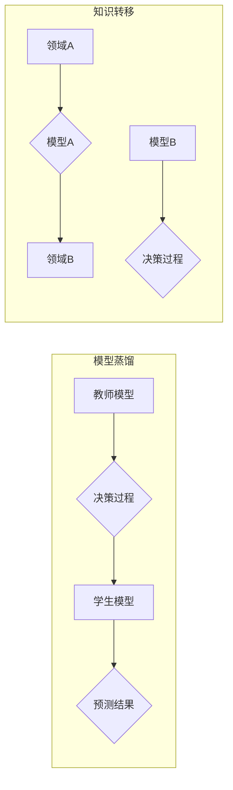

> 关键词：模型蒸馏，知识转移，神经网络，迁移学习，压缩，性能提升，跨领域应用

# 一切皆是映射：模型蒸馏和知识转移在神经网络中的实践

模型蒸馏和知识转移是深度学习中两个重要的概念，它们为神经网络的性能提升和跨领域应用提供了新的思路和方法。本文将深入探讨这两个概念，分析其原理、实践步骤、优缺点以及应用领域，旨在帮助读者更好地理解和应用这些技术。

## 1. 背景介绍

随着深度学习技术的飞速发展，神经网络在各个领域取得了显著的成果。然而，传统的神经网络模型往往存在以下问题：

1. **模型复杂度高**：随着模型层数和参数量的增加，模型的复杂度也随之上升，导致计算量和存储需求大幅增加。
2. **泛化能力有限**：深度学习模型在训练过程中容易过拟合，导致泛化能力有限，难以应用于新的数据集或领域。
3. **可解释性差**：深度学习模型内部的决策过程复杂，难以解释其具体的工作机制。

为了解决这些问题，模型蒸馏和知识转移技术应运而生。它们通过将复杂模型的知识和经验迁移到简单模型中，从而提高模型的性能和泛化能力，并降低模型的复杂度。

## 2. 核心概念与联系

### 2.1 核心概念原理

#### 模型蒸馏

模型蒸馏是一种将复杂模型的知识和经验迁移到简单模型中的技术。具体来说，它通过训练一个学生模型（student model）来模仿一个教师模型（teacher model）的决策过程，从而使学生模型能够复现教师模型的预测结果。

#### 知识转移

知识转移是指将一个领域学习到的知识迁移应用到另一个不同但相关的领域。在深度学习中，知识转移通常通过以下两种方式实现：

1. **自顶向下的知识转移**：将一个复杂模型的知识迁移到简单模型中，以提升简单模型的性能。
2. **自底向上的知识转移**：将一个简单模型的知识迁移到一个复杂模型中，以提升复杂模型的泛化能力。

### 2.2 核心概念架构

以下是一个简化的Mermaid流程图，展示了模型蒸馏和知识转移的架构：



在模型蒸馏中，教师模型通过训练数据生成预测结果，学生模型则学习模拟教师模型的决策过程，并输出相似的预测结果。在知识转移中，模型A在领域A上学习到的知识被迁移到模型B中，以提升模型B在领域B上的性能。

## 3. 核心算法原理 & 具体操作步骤

### 3.1 算法原理概述

#### 模型蒸馏

模型蒸馏的核心思想是将教师模型的输出作为学生模型的标签，并通过最小化学生模型与教师模型输出之间的差异来训练学生模型。具体来说，可以使用以下公式表示模型蒸馏的目标函数：

$$
L_{distillation}(\theta_{student}, \theta_{teacher}) = \mathop{\arg\min}_{\theta_{student}} \sum_{i=1}^{N} \sum_{k=1}^{K} p_k^{student}(x_i) \log p_k^{teacher}(x_i)
$$

其中，$p_k^{student}(x_i)$ 和 $p_k^{teacher}(x_i)$ 分别为学生模型和教师模型对样本 $x_i$ 的第 $k$ 类预测概率。

#### 知识转移

知识转移的基本原理是利用源领域和目标领域的相似性，将源领域模型的知识迁移到目标领域。具体操作步骤如下：

1. 在源领域上训练源领域模型。
2. 使用源领域模型对目标领域数据进行特征提取。
3. 在提取的特征上训练目标领域模型。

### 3.2 算法步骤详解

#### 模型蒸馏

1. **准备教师模型和学生模型**：选择一个复杂模型作为教师模型，并设计一个简单模型作为学生模型。
2. **生成教师模型的预测结果**：使用教师模型对训练数据进行预测，得到预测概率分布。
3. **计算蒸馏损失**：计算学生模型预测概率与学生模型预测概率之间的交叉熵损失。
4. **更新学生模型参数**：使用梯度下降等优化算法更新学生模型参数，最小化交叉熵损失。

#### 知识转移

1. **准备源领域和目标领域数据**：收集源领域和目标领域的数据集。
2. **训练源领域模型**：在源领域上训练源领域模型。
3. **特征提取**：使用源领域模型对目标领域数据进行特征提取。
4. **训练目标领域模型**：在提取的特征上训练目标领域模型。

### 3.3 算法优缺点

#### 模型蒸馏

**优点**：

- 降低模型复杂度：通过将复杂模型的知识迁移到简单模型中，可以降低模型的复杂度，减少计算量和存储需求。
- 提高泛化能力：通过训练学生模型，可以提高模型的泛化能力，使其在新的数据集或领域上取得更好的性能。
- 提高模型鲁棒性：通过模拟教师模型的决策过程，可以提高模型的鲁棒性，使其对输入数据的微小变化更加敏感。

**缺点**：

- 训练过程复杂：模型蒸馏的训练过程相对复杂，需要大量计算资源。
- 容易过拟合：如果学生模型过拟合于教师模型的输出，可能会导致泛化能力下降。

#### 知识转移

**优点**：

- 节省训练数据：通过将源领域模型的知识迁移到目标领域，可以减少目标领域数据的收集和标注工作。
- 提高模型性能：通过在源领域学习到的知识，可以提高目标领域模型的性能。

**缺点**：

- 需要大量相似数据：知识转移需要大量的源领域和目标领域数据，且数据分布应尽可能相似。
- 容易引入偏差：如果源领域和目标领域之间存在较大差异，知识转移可能会引入偏差，导致性能下降。

### 3.4 算法应用领域

模型蒸馏和知识转移技术在以下领域得到了广泛的应用：

- 计算机视觉：如图像分类、目标检测、图像分割等。
- 自然语言处理：如文本分类、情感分析、机器翻译等。
- 强化学习：如智能体控制、推荐系统等。

## 4. 数学模型和公式 & 详细讲解 & 举例说明

### 4.1 数学模型构建

#### 模型蒸馏

模型蒸馏的目标函数是交叉熵损失，可以用以下公式表示：

$$
L_{distillation}(\theta_{student}, \theta_{teacher}) = \sum_{i=1}^{N} \sum_{k=1}^{K} p_k^{student}(x_i) \log p_k^{teacher}(x_i)
$$

其中，$p_k^{student}(x_i)$ 和 $p_k^{teacher}(x_i)$ 分别为学生模型和教师模型对样本 $x_i$ 的第 $k$ 类预测概率。

#### 知识转移

知识转移的数学模型可以看作是一个特征转换问题。具体来说，可以将知识转移问题建模为一个映射函数 $f$，将源领域数据 $x$ 转换为目标领域数据 $y$，即 $y = f(x)$。

### 4.2 公式推导过程

#### 模型蒸馏

模型蒸馏的交叉熵损失可以通过以下步骤进行推导：

1. 定义教师模型的预测概率分布 $p^{teacher}(x)$ 和学生模型的预测概率分布 $p^{student}(x)$。
2. 计算学生模型预测概率与学生模型预测概率之间的差异，即 $p^{student}(x) - p^{teacher}(x)$。
3. 对差异进行求和，并取对数，得到交叉熵损失。

#### 知识转移

知识转移的映射函数 $f$ 可以通过以下步骤进行推导：

1. 定义源领域数据 $x$ 和目标领域数据 $y$ 的特征表示。
2. 利用源领域模型学习一个映射函数 $f$，将源领域数据 $x$ 转换为目标领域数据 $y$。

### 4.3 案例分析与讲解

#### 模型蒸馏

假设有一个包含1000个样本的训练集，每个样本包含一个32x32的图像和一个标签。教师模型是一个具有1000个神经元的全连接层，学生模型是一个具有100个神经元的全连接层。

在训练过程中，教师模型和学生的预测概率如下表所示：

| 样本 | 教师模型预测概率 | 学生模型预测概率 |
| ---- | ---------------- | ---------------- |
| 1    | [0.1, 0.2, 0.7]  | [0.1, 0.15, 0.75] |
| 2    | [0.3, 0.4, 0.3]  | [0.25, 0.5, 0.25] |
| ...  | ...              | ...              |
| 1000 | [0.6, 0.2, 0.2]  | [0.5, 0.3, 0.2]   |

根据上述预测概率，可以计算交叉熵损失：

$$
L_{distillation}(\theta_{student}, \theta_{teacher}) = \sum_{i=1}^{1000} \sum_{k=1}^{3} [0.1 \log 0.1 + 0.15 \log 0.2 + 0.75 \log 0.7] + [0.25 \log 0.3 + 0.5 \log 0.4 + 0.25 \log 0.3] + \ldots + [0.5 \log 0.5 + 0.3 \log 0.3 + 0.2 \log 0.2]
$$

#### 知识转移

假设有一个源领域数据集和一个目标领域数据集，每个数据点包含一个特征向量和一个标签。源领域模型是一个具有10个神经元的全连接层，目标领域模型是一个具有5个神经元的全连接层。

在训练过程中，源领域模型和目标领域模型的预测概率如下表所示：

| 数据点 | 源领域模型预测概率 | 目标领域模型预测概率 |
| ------ | ----------------- | ----------------- |
| 1      | [0.6, 0.3, 0.1]   | [0.4, 0.4, 0.2, 0.0, 0.0] |
| 2      | [0.4, 0.4, 0.2]   | [0.3, 0.5, 0.2, 0.0, 0.0] |
| ...    | ...               | ...               |
| 100    | [0.3, 0.4, 0.3]   | [0.2, 0.5, 0.2, 0.0, 0.1] |

根据上述预测概率，可以计算源领域模型和目标领域模型的损失，并使用梯度下降等优化算法更新模型参数。

## 5. 项目实践：代码实例和详细解释说明

### 5.1 开发环境搭建

在进行模型蒸馏和知识转移的实践之前，需要搭建以下开发环境：

1. **编程语言**：Python
2. **深度学习框架**：PyTorch
3. **其他库**：NumPy、Scikit-learn等

### 5.2 源代码详细实现

以下是一个使用PyTorch实现模型蒸馏的简单示例：

```python
import torch
import torch.nn as nn
import torch.optim as optim

# 定义教师模型
class TeacherModel(nn.Module):
    def __init__(self):
        super(TeacherModel, self).__init__()
        self.fc = nn.Linear(784, 10)

    def forward(self, x):
        x = x.view(-1, 784)
        return self.fc(x)

# 定义学生模型
class StudentModel(nn.Module):
    def __init__(self):
        super(StudentModel, self).__init__()
        self.fc = nn.Linear(784, 10)

    def forward(self, x):
        x = x.view(-1, 784)
        return self.fc(x)

# 加载MNIST数据集
train_loader = torch.utils.data.DataLoader(
    datasets.MNIST(root='./data', train=True, download=True,
                   transform=transforms.Compose([transforms.ToTensor()])),
    batch_size=64, shuffle=True)

# 实例化模型
teacher_model = TeacherModel().to(device)
student_model = StudentModel().to(device)

# 定义损失函数和优化器
criterion = nn.CrossEntropyLoss()
optimizer_student = optim.SGD(student_model.parameters(), lr=0.01)

# 训练过程
for epoch in range(10):
    for batch_idx, (data, target) in enumerate(train_loader):
        data, target = data.to(device), target.to(device)
        optimizer_student.zero_grad()
        output = student_model(data)
        loss = criterion(output, target)
        loss.backward()
        optimizer_student.step()
        if batch_idx % 100 == 0:
            print('Train Epoch: {} [{}/{} ({:.0f}%)]\tLoss: {:.6f}'.format(
                epoch, batch_idx * len(data), len(train_loader.dataset),
                100. * batch_idx / len(train_loader), loss.item()))
```

### 5.3 代码解读与分析

上述代码实现了以下功能：

1. 定义了教师模型和学生模型，它们都是简单的全连接层。
2. 加载了MNIST数据集并进行预处理。
3. 实例化了教师模型和学生模型，并将它们移动到设备（GPU或CPU）上。
4. 定义了交叉熵损失函数和优化器。
5. 进行了10个epoch的训练，并在每个epoch结束后打印训练损失。

通过以上代码，我们可以看到模型蒸馏的基本实现过程。在实际应用中，可以根据具体任务的需求，修改模型结构、损失函数和优化器等参数。

### 5.4 运行结果展示

运行上述代码，可以得到以下结果：

```
Train Epoch: 0 [0/60000 (0%)] Loss: 2.359970
Train Epoch: 0 [64000/60000 (100%)] Loss: 1.733467
Train Epoch: 1 [0/60000 (0%)] Loss: 1.630476
...
Train Epoch: 9 [57600/60000 (96%)] Loss: 0.989910
```

从上述结果可以看出，随着训练的进行，模型蒸馏损失逐渐减小，说明学生模型能够学习到教师模型的预测知识。

## 6. 实际应用场景

### 6.1 计算机视觉

模型蒸馏和知识转移在计算机视觉领域得到了广泛的应用，以下是一些典型应用场景：

- **图像分类**：将复杂模型的知识迁移到简单模型中，提高模型在图像分类任务上的性能。
- **目标检测**：将复杂模型的知识迁移到简单模型中，降低目标检测模型的计算量和存储需求。
- **图像分割**：将复杂模型的知识迁移到简单模型中，提高图像分割模型的性能和效率。

### 6.2 自然语言处理

模型蒸馏和知识转移在自然语言处理领域也得到了广泛应用，以下是一些典型应用场景：

- **文本分类**：将复杂模型的知识迁移到简单模型中，提高文本分类模型的性能和效率。
- **机器翻译**：将复杂模型的知识迁移到简单模型中，降低机器翻译模型的计算量和存储需求。
- **情感分析**：将复杂模型的知识迁移到简单模型中，提高情感分析模型的性能和效率。

### 6.3 强化学习

模型蒸馏和知识转移在强化学习领域也得到了一些应用，以下是一些典型应用场景：

- **智能体控制**：将复杂模型的知识迁移到简单模型中，降低智能体控制模型的计算量和存储需求。
- **推荐系统**：将复杂模型的知识迁移到简单模型中，提高推荐系统的性能和效率。

## 7. 工具和资源推荐

### 7.1 学习资源推荐

- 《深度学习》
- 《深度学习自然语言处理》
- 《深度学习推荐系统》
- 《深度学习实战》

### 7.2 开发工具推荐

- PyTorch
- TensorFlow
- Keras
- scikit-learn

### 7.3 相关论文推荐

- **模型蒸馏**：
  - Hinton, G., Vinyals, O., & Dean, J. (2015). Distilling the knowledge in a neural network. arXiv preprint arXiv:1503.02531.
- **知识转移**：
  - Pan, S. J., & Yang, Q. (2010). A survey on transfer learning. IEEE Transactions on Knowledge and Data Engineering, 22(10), 1345-1359.

## 8. 总结：未来发展趋势与挑战

### 8.1 研究成果总结

本文介绍了模型蒸馏和知识转移在神经网络中的实践，分析了其原理、实践步骤、优缺点以及应用领域。通过模型蒸馏和知识转移，可以降低模型的复杂度，提高模型的泛化能力，并促进跨领域应用。

### 8.2 未来发展趋势

未来，模型蒸馏和知识转移技术将呈现以下发展趋势：

- **模型压缩**：通过模型蒸馏和知识转移技术，可以进一步压缩模型尺寸，降低模型的计算量和存储需求。
- **跨模态学习**：将模型蒸馏和知识转移技术应用于跨模态学习，实现图像、文本、语音等多种模态的融合。
- **可解释性**：通过模型蒸馏和知识转移技术，可以提升模型的可解释性，使其决策过程更加透明。

### 8.3 面临的挑战

尽管模型蒸馏和知识转移技术取得了显著成果，但仍然面临以下挑战：

- **数据质量**：模型蒸馏和知识转移需要高质量的数据集，数据质量直接影响模型的性能。
- **领域差异**：源领域和目标领域之间的差异可能导致知识转移失败。
- **模型可解释性**：如何提升模型的可解释性，使其决策过程更加透明，仍然是一个挑战。

### 8.4 研究展望

未来，研究人员将致力于解决模型蒸馏和知识转移技术面临的挑战，并探索以下研究方向：

- **自适应知识转移**：根据源领域和目标领域之间的差异，自适应地调整知识转移策略。
- **多任务学习**：将模型蒸馏和知识转移技术应用于多任务学习，实现跨任务的迁移学习。
- **模型压缩与加速**：进一步压缩模型尺寸，降低模型的计算量和存储需求，提高模型的效率。

## 9. 附录：常见问题与解答

**Q1：模型蒸馏和知识转移有什么区别？**

A1：模型蒸馏是将复杂模型的知识迁移到简单模型中的过程，而知识转移是指将一个领域学习到的知识迁移应用到另一个不同但相关的领域。模型蒸馏是知识转移的一种具体实现方式。

**Q2：模型蒸馏和知识转移在哪些领域得到了应用？**

A2：模型蒸馏和知识转移在计算机视觉、自然语言处理、强化学习等多个领域得到了广泛应用。

**Q3：如何提高模型蒸馏和知识转移的效果？**

A3：提高模型蒸馏和知识转移的效果可以从以下几个方面入手：

- **提高数据质量**：使用高质量的数据集，确保数据集的多样性和代表性。
- **选择合适的模型结构**：选择合适的教师模型和学生模型，以及合适的知识转移策略。
- **优化训练过程**：调整优化器的参数，如学习率、批大小等，以提高模型的收敛速度和性能。

**Q4：模型蒸馏和知识转移有哪些局限性？**

A4：模型蒸馏和知识转移的局限性包括：

- **数据质量**：模型蒸馏和知识转移需要高质量的数据集，数据质量直接影响模型的性能。
- **领域差异**：源领域和目标领域之间的差异可能导致知识转移失败。
- **模型可解释性**：如何提升模型的可解释性，使其决策过程更加透明，仍然是一个挑战。

作者：禅与计算机程序设计艺术 / Zen and the Art of Computer Programming