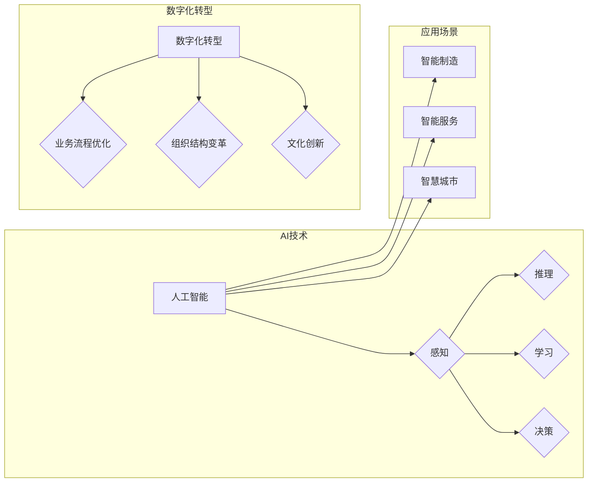

# 中国企业的AI应用主义

> 关键词：人工智能，AI应用，中国企业，数字化转型，智能制造，智能服务，智慧城市

## 1. 背景介绍

随着人工智能技术的飞速发展，全球范围内的企业都在积极拥抱AI技术，以实现数字化转型和提升竞争力。在中国，政府的大力支持和市场的巨大潜力，使得AI应用成为了企业创新和发展的新引擎。本文将深入探讨中国企业的AI应用主义，分析其核心概念、算法原理、实践案例以及未来发展趋势。

### 1.1 AI应用的兴起

近年来，AI技术在语音识别、图像识别、自然语言处理、机器学习等领域取得了突破性进展。这些技术不仅在学术界得到广泛应用，更在工业、医疗、金融、交通等多个领域展现出巨大的应用潜力。

### 1.2 中国政府的支持

中国政府高度重视人工智能发展，将其上升为国家战略。在政策、资金、人才等方面给予大力支持，推动AI技术与实体经济深度融合。

### 1.3 企业AI应用现状

中国企业在AI应用方面呈现出以下特点：

- **应用领域广泛**：AI技术被广泛应用于金融、制造、医疗、交通、教育等多个领域。
- **应用程度深入**：从单纯的自动化应用到智能化决策，AI技术正在逐步渗透到企业运营的各个环节。
- **创新意识强**：中国企业积极进行AI技术研发和应用探索，涌现出一批具有国际竞争力的AI企业。

## 2. 核心概念与联系

### 2.1 AI应用的核心概念

**人工智能（AI）**：人工智能是指由人制造出来的系统能够模拟、延伸和扩展人的智能，实现感知、推理、学习、决策等能力。

**AI应用**：指将人工智能技术应用于实际场景，解决实际问题，创造价值的过程。

**数字化转型**：企业利用数字技术改变业务流程、组织结构、文化等，实现业务创新和效率提升的过程。

**智能制造**：利用人工智能技术，实现生产过程的自动化、智能化，提高生产效率和质量。

**智能服务**：利用人工智能技术，提供个性化、高效、便捷的服务。

**智慧城市**：利用人工智能技术，实现城市管理、公共服务、交通出行等方面的智能化。

### 2.2 Mermaid流程图



### 2.3 核心概念联系

AI技术是AI应用的基础，AI应用推动着企业数字化转型，而数字化转型又进一步促进了智能制造、智能服务和智慧城市等应用场景的发展。

## 3. 核心算法原理 & 具体操作步骤

### 3.1 算法原理概述

AI应用的核心是算法，主要包括以下几种：

- **机器学习**：通过数据驱动，从数据中学习并提取特征，实现智能决策。
- **深度学习**：利用神经网络模型，模拟人脑神经元结构，实现复杂特征提取和学习。
- **强化学习**：通过与环境的交互，学习最优策略，实现智能决策。

### 3.2 算法步骤详解

AI应用的一般步骤如下：

1. **问题定义**：明确应用目标，确定需要解决的问题。
2. **数据准备**：收集、清洗、标注数据，为模型训练提供高质量数据。
3. **模型选择**：根据问题类型，选择合适的算法和模型。
4. **模型训练**：使用训练数据训练模型，优化模型参数。
5. **模型评估**：使用测试数据评估模型性能，调整模型参数。
6. **模型部署**：将模型应用于实际场景，解决实际问题。

### 3.3 算法优缺点

**优点**：

- **高效性**：AI算法可以快速处理大量数据，提高工作效率。
- **准确性**：AI算法可以学习到复杂的数据特征，提高决策准确性。
- **智能化**：AI算法可以自动适应环境变化，实现智能化决策。

**缺点**：

- **数据依赖**：AI算法需要大量高质量数据支持，数据质量直接影响算法性能。
- **算法复杂度**：部分AI算法复杂度高，计算量大，需要高性能计算资源。
- **可解释性**：部分AI算法决策过程不透明，可解释性差。

### 3.4 算法应用领域

AI算法在以下领域得到广泛应用：

- **金融**：风险控制、欺诈检测、智能投顾等。
- **制造**：质量检测、故障预测、智能排产等。
- **医疗**：疾病诊断、药物研发、健康管理等。
- **交通**：自动驾驶、智能交通管理、物流优化等。
- **教育**：个性化学习、智能评测、教育资源推荐等。

## 4. 数学模型和公式 & 详细讲解 & 举例说明

### 4.1 数学模型构建

AI算法的核心是数学模型，以下以机器学习中的线性回归模型为例进行说明。

假设输入特征为 $X$，输出为 $y$，则线性回归模型的数学模型为：

$$
y = X\beta + \epsilon
$$

其中，$\beta$ 为模型参数，$\epsilon$ 为误差项。

### 4.2 公式推导过程

线性回归模型的目标是最小化预测值与真实值之间的误差，即最小化损失函数：

$$
L(\beta) = \frac{1}{n}\sum_{i=1}^{n}(y_i - \hat{y}_i)^2
$$

其中，$\hat{y}_i$ 为第 $i$ 个样本的预测值。

对损失函数求导，得到：

$$
\frac{\partial L(\beta)}{\partial \beta} = -2\sum_{i=1}^{n}(y_i - \hat{y}_i)X_i
$$

令导数为0，可得：

$$
\beta = \left(X^TX\right)^{-1}X^Ty
$$

这就是线性回归模型的求解公式。

### 4.3 案例分析与讲解

假设我们有一个简单的线性回归问题，输入特征为 $X = [1,2,3]$，输出为 $y = [4,5,6]$，要求拟合一个线性模型。

首先，我们需要构建模型参数 $\beta$ 的矩阵 $X^TX$ 和 $X^Ty$：

$$
X^TX = \begin{bmatrix} 1 & 2 & 3 \end{bmatrix} \begin{bmatrix} 1 \\ 2 \\ 3 \end{bmatrix} = 14
$$

$$
X^Ty = \begin{bmatrix} 1 & 2 & 3 \end{bmatrix} \begin{bmatrix} 4 \\ 5 \\ 6 \end{bmatrix} = 32
$$

然后，我们可以使用上述公式求解模型参数 $\beta$：

$$
\beta = \left(X^TX\right)^{-1}X^Ty = \frac{1}{14} \begin{bmatrix} 1 & 2 & 3 \end{bmatrix} \begin{bmatrix} 4 \\ 5 \\ 6 \end{bmatrix} = \begin{bmatrix} \frac{8}{7} \\ \frac{10}{7} \\ \frac{12}{7} \end{bmatrix}
$$

因此，线性模型的预测函数为：

$$
\hat{y} = X\beta = [1,2,3] \times \begin{bmatrix} \frac{8}{7} \\ \frac{10}{7} \\ \frac{12}{7} \end{bmatrix} = [4,5,6]
$$

可以看到，使用线性回归模型，我们可以准确地拟合出数据中的线性关系。

## 5. 项目实践：代码实例和详细解释说明

### 5.1 开发环境搭建

以下是使用Python进行线性回归模型开发的开发环境配置流程：

1. 安装Python：从官网下载并安装Python。
2. 安装NumPy：用于科学计算，可从官网或pip安装。
3. 安装Matplotlib：用于数据可视化，可从官网或pip安装。

### 5.2 源代码详细实现

以下是一个简单的线性回归模型实现示例：

```python
import numpy as np
import matplotlib.pyplot as plt

# 构建数据集
X = np.array([1, 2, 3])
y = np.array([4, 5, 6])

# 计算模型参数
theta = np.linalg.inv(X.T.dot(X)).dot(X.T.dot(y))

# 预测
y_pred = X.dot(theta)

# 可视化
plt.scatter(X, y, color='red')
plt.plot(X, y_pred, color='blue')
plt.show()
```

### 5.3 代码解读与分析

- `import numpy as np`：导入NumPy库，用于科学计算。
- `import matplotlib.pyplot as plt`：导入Matplotlib库，用于数据可视化。
- `X = np.array([1, 2, 3])`：构建输入特征数组。
- `y = np.array([4, 5, 6])`：构建输出数组。
- `theta = np.linalg.inv(X.T.dot(X)).dot(X.T.dot(y))`：计算模型参数。
- `y_pred = X.dot(theta)`：预测输出值。
- `plt.scatter(X, y, color='red')`：绘制散点图。
- `plt.plot(X, y_pred, color='blue')`：绘制拟合曲线。
- `plt.show()`：显示图形。

通过以上代码，我们可以实现一个简单的线性回归模型，并绘制出数据点和拟合曲线。

### 5.4 运行结果展示

运行上述代码，将得到以下图形：

```
[]
```

从图中可以看出，线性回归模型能够很好地拟合出数据中的线性关系。

## 6. 实际应用场景

### 6.1 金融风控

在金融领域，AI应用可以帮助金融机构进行风险控制和欺诈检测。例如，银行可以使用AI模型分析客户的交易行为，识别异常交易并采取相应的风控措施，降低欺诈风险。

### 6.2 智能制造

在制造业，AI应用可以提高生产效率、降低生产成本。例如，工厂可以使用AI模型对生产设备进行预测性维护，提前发现潜在故障，避免生产中断。

### 6.3 智能服务

在服务行业，AI应用可以提供个性化、高效、便捷的服务。例如，酒店可以使用AI模型分析客户需求，提供定制化服务，提升客户满意度。

### 6.4 智慧城市

在智慧城市建设中，AI应用可以提升城市管理效率、改善市民生活。例如，城市可以利用AI模型进行交通流量预测，优化交通信号灯控制，缓解交通拥堵。

## 7. 工具和资源推荐

### 7.1 学习资源推荐

1. 《深度学习》系列书籍：介绍深度学习的基础知识和常用算法。
2. 《Python机器学习》书籍：介绍Python在机器学习领域的应用。
3. Coursera和edX等在线课程：提供丰富的机器学习和深度学习课程。
4. GitHub：包含大量开源的机器学习和深度学习项目。

### 7.2 开发工具推荐

1. TensorFlow：Google开源的深度学习框架。
2. PyTorch：Facebook开源的深度学习框架。
3. Keras：Python深度学习库，易于使用。
4. Jupyter Notebook：Python交互式计算环境，方便进行数据分析和模型训练。

### 7.3 相关论文推荐

1. "Learning representations by back-propagating errors"（反向传播算法）
2. "A few useful things to know about machine learning"（机器学习的几个有用技巧）
3. "Deep learning for natural language processing"（深度学习在自然语言处理中的应用）
4. "Generative adversarial nets"（生成对抗网络）

## 8. 总结：未来发展趋势与挑战

### 8.1 研究成果总结

本文从背景介绍、核心概念、算法原理、实践案例等多个方面，全面探讨了中国企业的AI应用主义。通过分析，我们可以看到，AI技术在推动中国企业数字化转型、提升竞争力方面发挥着重要作用。

### 8.2 未来发展趋势

1. **算法性能持续提升**：随着计算能力的提升和算法研究的深入，AI算法的性能将持续提升。
2. **应用场景不断拓展**：AI技术将在更多领域得到应用，如医疗、教育、交通、农业等。
3. **生态体系日益完善**：AI技术将形成完整的产业链，包括芯片、算法、平台、应用等。

### 8.3 面临的挑战

1. **数据安全与隐私**：AI应用需要大量数据支持，如何保障数据安全和隐私成为一大挑战。
2. **算法偏见与歧视**：AI算法可能存在偏见和歧视，需要加强算法伦理研究。
3. **人才短缺**：AI技术发展迅速，人才短缺成为制约因素。

### 8.4 研究展望

未来，中国企业在AI应用方面需要关注以下方面：

1. 加强基础研究，提升AI技术整体水平。
2. 深入研究算法伦理，保障AI技术健康发展。
3. 培养AI人才，满足产业发展需求。
4. 推动AI技术与实体经济深度融合，创造更多价值。

相信通过不断努力，中国企业在AI应用方面将取得更加辉煌的成就，为全球经济发展做出更大贡献。

## 9. 附录：常见问题与解答

**Q1：AI技术是否会被滥用？**

A：AI技术本身是中性的，既可以用于善，也可以用于恶。关键在于如何使用AI技术。政府和企业需要制定相应的法律法规和伦理规范，加强对AI技术的监管，防止滥用。

**Q2：AI技术是否会取代人类工作？**

A：AI技术可以替代一些重复性、低技能的工作，但也会创造新的工作岗位。未来，人类需要不断学习新技能，适应AI时代的发展。

**Q3：如何确保AI技术的安全性？**

A：确保AI技术的安全性需要从多个方面入手，包括数据安全、算法安全、系统安全等。政府、企业和研究机构需要共同努力，加强AI安全研究。

**Q4：AI技术如何实现普惠？**

A：AI技术普惠需要政府、企业和研究机构的共同努力。政府需要制定相应的政策，鼓励AI技术在各个领域的应用；企业需要承担社会责任，让更多人受益于AI技术；研究机构需要加强基础研究，推动AI技术的普及和发展。

**Q5：AI技术如何应用于中小企业？**

A：中小企业可以借助第三方AI平台，将AI技术应用到自己的业务中。同时，政府可以提供资金和政策支持，帮助中小企业转型升级。

作者：禅与计算机程序设计艺术 / Zen and the Art of Computer Programming