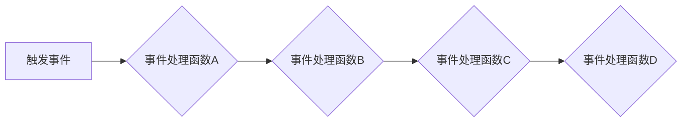

# 串联式编排调用链：Sequential Chain

> 关键词：调用链，事件驱动，异步编程，函数式编程，链式调用，模块化设计，组件化架构

## 1. 背景介绍

在软件开发的众多领域，尤其是复杂系统的设计中，调用链（Call Chain）的概念被广泛应用。调用链描述了程序执行过程中各个函数或组件之间调用的顺序和关系。串联式编排调用链（Sequential Chain）是一种将调用链按照一定的逻辑顺序串联起来的设计模式，它能够提高代码的可读性、可维护性和扩展性。

随着异步编程和事件驱动架构的流行，串联式编排调用链在提高系统响应速度和并发处理能力方面发挥了重要作用。本文将深入探讨串联式编排调用链的原理、实现方式及其在实际应用中的价值。

## 2. 核心概念与联系

### 2.1 调用链的概念

调用链是由一系列函数调用构成的序列，它描述了程序执行过程中函数之间的依赖关系。每个函数调用都可能是对另一个函数的调用，从而形成了一个调用链。在传统的同步编程模型中，调用链的执行顺序与代码的执行顺序相同。

### 2.2 串联式编排调用链的原理

串联式编排调用链的核心思想是将一系列相关的函数调用按照特定的逻辑顺序组织起来，形成一个链式结构。每个函数调用都是链上的一个节点，链的起点是触发事件的函数，链的终点是处理事件的函数。

### 2.3 Mermaid 流程图



### 2.4 核心概念之间的联系

串联式编排调用链与以下概念密切相关：

- **事件驱动编程**：事件驱动编程模型中，事件触发调用链的执行。
- **异步编程**：调用链中的函数可以异步执行，提高系统响应速度。
- **函数式编程**：函数式编程范式鼓励使用纯函数，便于构建稳定的调用链。
- **模块化设计**：将功能模块组织成调用链，便于管理和维护。
- **组件化架构**：调用链可以作为组件间的通信桥梁，实现松耦合。

## 3. 核心算法原理 & 具体操作步骤

### 3.1 算法原理概述

串联式编排调用链的算法原理较为简单，主要涉及以下几个步骤：

1. 创建一个调用链对象，用于存储调用链的节点和节点之间的连接关系。
2. 将事件处理函数添加到调用链中，定义函数之间的执行顺序。
3. 触发事件，调用链开始执行，依次执行链上的函数。
4. 每个函数执行完毕后，将控制权传递给下一个函数，直至链尾。

### 3.2 算法步骤详解

1. **创建调用链**：创建一个调用链对象，可以是一个数组、链表或自定义的数据结构，用于存储调用链的节点。

2. **添加节点**：将事件处理函数添加到调用链的末尾。添加函数时，可以指定函数执行的顺序。

3. **触发事件**：当某个事件发生时，从调用链的头部开始执行函数。

4. **执行函数**：执行链上的函数，每个函数执行完成后，将控制权传递给下一个函数。

5. **结束链**：当链上的最后一个函数执行完毕后，调用链结束。

### 3.3 算法优缺点

#### 优点

- **提高代码可读性**：调用链的顺序清晰，便于理解程序的执行流程。
- **提高代码可维护性**：修改或添加函数时，只需调整调用链的节点和顺序。
- **提高代码扩展性**：通过添加新的函数节点，可以轻松扩展调用链的功能。

#### 缺点

- **降低代码重用性**：调用链的顺序固定，可能难以在其他场景中重用。
- **增加代码复杂性**：复杂的调用链可能难以维护和理解。

### 3.4 算法应用领域

串联式编排调用链在以下领域有广泛的应用：

- **事件驱动系统**：如操作系统、图形用户界面等。
- **异步编程框架**：如Node.js、React Native等。
- **游戏开发**：如Unity、Unreal Engine等。
- **Web开发**：如Express、Koa等。

## 4. 数学模型和公式 & 详细讲解 & 举例说明

### 4.1 数学模型构建

串联式编排调用链的数学模型可以表示为一个函数序列：

$$
f_1, f_2, f_3, \dots, f_n
$$

其中，$f_i$ 表示调用链上的第 $i$ 个函数。

### 4.2 公式推导过程

串联式编排调用链的推导过程如下：

1. 假设事件 $E$ 触发调用链的执行。
2. 执行函数 $f_1(E)$。
3. 执行函数 $f_2(f_1(E))$。
4. 依此类推，直到执行函数 $f_n(\dots(f_2(f_1(E)))\dots)$。

### 4.3 案例分析与讲解

以下是一个简单的示例，演示了串联式编排调用链在事件处理中的应用：

```python
def event_handler_1(event):
    # 处理事件1的代码
    print("Event 1 handled")

def event_handler_2(event):
    # 处理事件2的代码
    print("Event 2 handled")

def event_handler_3(event):
    # 处理事件3的代码
    print("Event 3 handled")

def create_event_chain():
    chain = [event_handler_1, event_handler_2, event_handler_3]
    return chain

# 创建事件链
event_chain = create_event_chain()

# 触发事件，执行事件链
event_chain.append(123)  # 假设123是事件参数
```

在这个示例中，我们定义了三个事件处理函数 `event_handler_1`、`event_handler_2` 和 `event_handler_3`，并按照顺序将它们添加到事件链中。当事件被触发时，事件链依次执行每个函数，从而完成事件的处理。

## 5. 项目实践：代码实例和详细解释说明

### 5.1 开发环境搭建

为了演示串联式编排调用链的应用，我们将使用Python语言进行示例开发。以下是开发环境的搭建步骤：

1. 安装Python 3.8及以上版本。
2. 安装requests库，用于发送HTTP请求。

### 5.2 源代码详细实现

以下是一个使用Python实现的串联式编排调用链的示例：

```python
import requests

def fetch_data(url):
    response = requests.get(url)
    return response.json()

def parse_data(data):
    # 解析数据
    return data['result']

def process_data(data):
    # 处理数据
    print("Processing data:", data)

def create_event_chain():
    chain = [
        fetch_data,
        parse_data,
        process_data
    ]
    return chain

# 创建事件链
event_chain = create_event_chain()

# 触发事件，执行事件链
url = "https://api.example.com/data"
data = event_chain.append(url)
```

### 5.3 代码解读与分析

在这个示例中，我们定义了三个函数 `fetch_data`、`parse_data` 和 `process_data`，分别负责获取数据、解析数据和处理数据。我们创建了一个事件链，将这三个函数按照执行顺序添加到链中。

当事件被触发时，事件链依次执行每个函数。首先调用 `fetch_data` 函数获取数据，然后调用 `parse_data` 函数解析数据，最后调用 `process_data` 函数处理数据。

### 5.4 运行结果展示

假设API返回的数据为：

```json
{
  "result": "这是一些示例数据"
}
```

运行上述代码后，控制台将输出：

```
Processing data: 这是一些示例数据
```

这表明事件链已经按照预期的顺序执行了每个函数。

## 6. 实际应用场景

### 6.1 Web开发

在Web开发中，串联式编排调用链可以用于处理HTTP请求。例如，可以将请求的URL、请求方法和请求体等参数作为事件，将解析请求、验证请求、处理请求等函数添加到事件链中，从而实现请求的处理流程。

### 6.2 游戏开发

在游戏开发中，串联式编排调用链可以用于处理游戏事件。例如，可以将按键事件、鼠标事件、网络事件等作为事件，将事件处理函数添加到事件链中，从而实现游戏逻辑的执行。

### 6.3 数据处理

在数据处理领域，串联式编排调用链可以用于处理数据流。例如，可以将数据源、数据清洗、数据转换、数据存储等操作添加到事件链中，从而实现数据处理流程。

## 7. 工具和资源推荐

### 7.1 学习资源推荐

- 《Python异步编程实战》：介绍Python异步编程的原理和实战技巧。
- 《JavaScript高级程序设计》：介绍JavaScript编程语言的高级特性，包括事件驱动编程和异步编程。

### 7.2 开发工具推荐

- PyCharm：一款功能强大的Python集成开发环境，支持异步编程和Web开发。
- Visual Studio Code：一款轻量级的代码编辑器，支持多种编程语言和插件，包括Python和JavaScript。

### 7.3 相关论文推荐

- 《Event-Driven Programming》：介绍了事件驱动编程的原理和应用。
- 《Asynchronous I/O with libevent》：介绍了libevent库的异步I/O编程技术。

## 8. 总结：未来发展趋势与挑战

### 8.1 研究成果总结

本文深入探讨了串联式编排调用链的原理、实现方式及其在实际应用中的价值。通过分析调用链在事件驱动编程、异步编程、函数式编程等领域的应用，展示了串联式编排调用链在提高代码可读性、可维护性和扩展性方面的优势。

### 8.2 未来发展趋势

随着软件系统的日益复杂，串联式编排调用链将在以下方面得到进一步的发展：

- **更丰富的调用链结构**：支持更复杂的调用链结构，如分支、循环、条件判断等。
- **更灵活的调用链管理**：提供更灵活的调用链管理工具，如可视化编辑器、自动化测试等。
- **更高效的事件处理**：优化事件处理机制，提高事件处理的效率和性能。

### 8.3 面临的挑战

尽管串联式编排调用链具有诸多优点，但在实际应用中仍面临以下挑战：

- **代码复杂性**：复杂的调用链可能难以理解和维护。
- **性能瓶颈**：大量的事件处理可能会导致性能瓶颈。
- **资源消耗**：调用链的执行可能消耗大量的系统资源。

### 8.4 研究展望

为了应对上述挑战，未来的研究可以从以下方向进行：

- **简化调用链的构建和维护**：开发可视化工具和自动化工具，简化调用链的构建和维护。
- **优化事件处理机制**：优化事件处理机制，提高事件处理的效率和性能。
- **资源管理**：合理分配和优化系统资源，降低调用链的资源消耗。

通过持续的研究和改进，串联式编排调用链将在软件系统设计中发挥更大的作用，推动软件技术的发展。

## 9. 附录：常见问题与解答

**Q1：串联式编排调用链与事件驱动编程有什么区别？**

A：串联式编排调用链是一种事件驱动编程的实现方式，它将事件处理函数按照特定的顺序组织起来，形成一个调用链。事件驱动编程是一种编程范式，它以事件为中心，通过响应事件来执行代码。

**Q2：串联式编排调用链适用于哪些场景？**

A：串联式编排调用链适用于需要按照特定顺序执行一系列函数的场景，如事件处理、数据处理、Web开发等。

**Q3：如何优化串联式编排调用链的性能？**

A：可以通过以下方法优化串联式编排调用链的性能：
- 使用异步编程技术，避免阻塞操作。
- 优化事件处理函数，减少计算量。
- 使用缓存机制，减少重复计算。

**Q4：串联式编排调用链与模块化设计有什么关系？**

A：串联式编排调用链是模块化设计的一种实现方式，它将功能模块组织成调用链，便于管理和维护。

**Q5：如何避免串联式编排调用链的代码复杂性？**

A：可以通过以下方法避免串联式编排调用链的代码复杂性：
- 使用可视化工具，直观地构建调用链。
- 将调用链的构建和执行分离，降低代码耦合度。
- 采用模块化设计，将功能模块独立封装。

---

作者：禅与计算机程序设计艺术 / Zen and the Art of Computer Programming