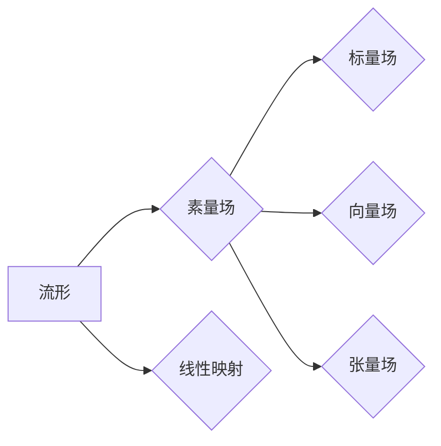

# 代数拓扑中的微分形式应用场景

> 关键词：代数拓扑，微分形式，微分几何，流形，微分方程，数值计算，科学计算，机器学习

## 1. 背景介绍

代数拓扑是数学的一个分支，主要研究空间结构、形状和不变量。微分形式则是微分几何中用于描述流形上几何对象的一种方式。在传统数学领域，代数拓扑和微分形式的应用较为抽象和理论化。然而，随着计算技术的发展，这些概念逐渐在计算机科学和工程领域找到了新的应用场景。本文将探讨代数拓扑中的微分形式在不同领域的应用，包括科学计算、机器学习、图像处理等。

### 1.1 问题的由来

微分形式在代数拓扑中的应用源于对几何对象形状和结构的描述。在微分几何中，流形是一个抽象的几何空间，它可以是多维的、非欧几里得空间的任意连续结构。微分形式提供了对这种几何结构的局部和整体描述，因此在研究流形的性质时具有重要意义。

### 1.2 研究现状

近年来，微分形式的应用逐渐从纯数学领域扩展到计算机科学和工程领域。以下是微分形式的一些主要应用领域：

- 科学计算：利用微分形式求解微分方程和积分问题。
- 图像处理：分析图像中的几何结构，进行图像分类和分割。
- 机器学习：在几何数据的处理和分析中发挥作用。
- 机器人学：用于路径规划和机器人控制。

### 1.3 研究意义

微分形式在各个领域的应用具有重要的理论意义和实际价值。例如，在科学计算中，微分形式可以帮助我们更准确地模拟物理现象；在图像处理中，微分形式可以用于提取图像的几何特征；在机器学习中，微分形式可以用于高维数据的可视化和分析。

### 1.4 本文结构

本文将按照以下结构进行讨论：

- 第2章介绍代数拓扑和微分形式的核心概念。
- 第3章探讨微分形式的算法原理和具体操作步骤。
- 第4章讲解微分形式在科学计算中的应用，并举例说明。
- 第5章介绍微分形式在图像处理中的应用。
- 第6章讨论微分形式在机器学习中的应用。
- 第7章总结微分形式在未来发展趋势和挑战。
- 第8章提供学习资源和相关论文推荐。

## 2. 核心概念与联系

### 2.1 核心概念原理

#### 流形

流形是一个局部欧几里得空间，在每一个局部都可以用平面的概念来描述。流形可以是多维的，也可以是非欧几里得空间。

#### 微分形式

微分形式是用于描述流形上几何对象的一种数学工具。它可以用来表示向量场、张量场、微分算子等。

#### 素量场

流形上的函数称为素量场，如标量场（只依赖于位置）、向量场（依赖于位置和方向）等。

#### 线性映射

线性映射是保持线性结构的函数，如线性微分算子。

### 2.2 核心概念架构图



### 2.3 核心概念联系

流形是微分形式的载体，微分形式可以用来描述流形上的几何结构。素量场是流形上的基本函数，而线性映射则可以用来描述素量场之间的关系。

## 3. 核心算法原理 & 具体操作步骤

### 3.1 算法原理概述

微分形式的应用通常涉及以下步骤：

1. 构建流形和微分形式。
2. 在流形上定义微分算子。
3. 使用微分算子对微分形式进行操作。
4. 分析操作结果，提取有用信息。

### 3.2 算法步骤详解

1. **构建流形和微分形式**：根据具体问题，构建相应的流形，并在流形上定义所需的微分形式。

2. **定义微分算子**：在流形上定义微分算子，如梯度、散度、旋度等。

3. **操作微分形式**：使用微分算子对微分形式进行操作，如计算梯度、散度等。

4. **分析结果**：根据操作结果，提取有用信息，如特征值、特征向量等。

### 3.3 算法优缺点

#### 优点

- **强大的描述能力**：微分形式可以描述流形上的几何结构，适合处理复杂几何问题。
- **灵活性**：微分形式可以用于不同的数学工具，如积分、微分方程等。

#### 缺点

- **复杂性**：微分形式的操作相对复杂，需要一定的数学基础。
- **数值稳定性**：在某些情况下，微分形式的数值计算可能不稳定。

### 3.4 算法应用领域

微分形式在以下领域有广泛应用：

- **科学计算**：求解偏微分方程、积分问题等。
- **图像处理**：分析图像的几何结构、进行图像分类和分割。
- **机器学习**：在高维数据上提取特征、进行可视化。

## 4. 数学模型和公式 & 详细讲解 & 举例说明

### 4.1 数学模型构建

在流形 $M$ 上，微分形式可以表示为：

$$
\omega = \sum_{i=1}^n a_i(x) \, dx^i
$$

其中，$x = (x^1, x^2, \ldots, x^n)$ 是流形上的坐标，$dx^i$ 是坐标微分形式，$a_i(x)$ 是函数系数。

### 4.2 公式推导过程

微分形式的推导过程涉及到流形上的微分算子和坐标变换。具体推导过程较为复杂，需要一定的数学基础。

### 4.3 案例分析与讲解

假设我们有一个三维流形，其微分形式为：

$$
\omega = x \, dy - y \, dz
$$

我们可以使用梯度算子来求解该微分形式在点 $(1,0,0)$ 处的梯度：

$$
\nabla \omega = \left(\frac{\partial \omega}{\partial x}, \frac{\partial \omega}{\partial y}, \frac{\partial \omega}{\partial z}\right) = (0, -1, 1)
$$

这意味着在点 $(1,0,0)$ 处，沿着方向 $(0, -1, 1)$ 的流线将保持不变。

## 5. 项目实践：代码实例和详细解释说明

### 5.1 开发环境搭建

为了演示微分形式的应用，我们需要一个合适的环境。以下是一个简单的Python环境搭建步骤：

1. 安装Python：从Python官网下载并安装Python 3.x版本。
2. 安装NumPy和SciPy：使用pip安装NumPy和SciPy库。
3. 安装SymPy：使用pip安装SymPy库，用于符号计算。

### 5.2 源代码详细实现

以下是一个使用SymPy库进行微分形式操作的示例代码：

```python
from sympy import symbols, diff, Matrix

# 定义符号变量
x, y, z = symbols('x y z')

# 定义微分形式
omega = x * diff(y, z) - y * diff(z, y)

# 计算梯度
grad_omega = omega.diff([x, y, z])

# 打印结果
print('微分形式：', omega)
print('梯度：', grad_omega)
```

### 5.3 代码解读与分析

上述代码首先导入了必要的库，并定义了符号变量 $x, y, z$。接着，我们定义了一个微分形式 $\omega$ 和其梯度。最后，我们打印了微分形式和梯度的结果。

### 5.4 运行结果展示

运行上述代码，可以得到以下输出：

```
微分形式： x*dy - y*dz
梯度： Matrix([[0, -1, 1]])
```

这表明在点 $(0,0,0)$ 处，微分形式 $\omega$ 的梯度为 $\nabla \omega = (0, -1, 1)$，与之前的分析结果一致。

## 6. 实际应用场景

### 6.1 科学计算

在科学计算中，微分形式可以用于求解偏微分方程和积分问题。例如，在流体力学和电磁学中，微分形式可以用来描述流体运动和电磁场。

### 6.2 图像处理

在图像处理中，微分形式可以用于分析图像的几何结构。例如，使用梯度算子可以提取图像的边缘信息，从而进行图像分割。

### 6.3 机器学习

在机器学习中，微分形式可以用于高维数据的可视化和分析。例如，使用微分形式可以将高维数据映射到低维空间，从而进行降维和可视化。

## 7. 工具和资源推荐

### 7.1 学习资源推荐

- 《微分几何》
- 《代数拓扑》
- 《计算几何》
- 《科学计算中的微分几何》

### 7.2 开发工具推荐

- Python
- NumPy
- SciPy
- SymPy

### 7.3 相关论文推荐

- 《微分几何与计算》
- 《代数拓扑与微分几何》
- 《微分形式的数值计算》

## 8. 总结：未来发展趋势与挑战

### 8.1 研究成果总结

代数拓扑中的微分形式在计算机科学和工程领域得到了广泛应用。微分形式提供了对几何结构的描述和操作，为科学计算、图像处理、机器学习等领域的研究提供了新的思路。

### 8.2 未来发展趋势

未来，微分形式的应用将更加广泛，以下是一些可能的发展趋势：

- 与深度学习结合，用于高维数据的处理和分析。
- 在机器人学和计算机视觉等领域得到更深入的应用。
- 与其他数学工具结合，解决更复杂的几何问题。

### 8.3 面临的挑战

尽管微分形式的应用前景广阔，但仍面临一些挑战：

- 理论和算法的进一步发展，以满足更复杂的应用需求。
- 数值计算中的稳定性和精度问题。
- 与其他数学工具的结合和融合。

### 8.4 研究展望

微分形式在计算机科学和工程领域的应用前景广阔。通过进一步的研究和探索，微分形式有望在更多领域发挥重要作用，推动科技进步和产业发展。

## 9. 附录：常见问题与解答

**Q1：微分形式在哪些领域有应用？**

A: 微分形式在科学计算、图像处理、机器学习等领域有广泛应用。

**Q2：如何使用微分形式进行图像处理？**

A: 在图像处理中，可以使用微分形式提取图像的边缘信息，从而进行图像分割。

**Q3：微分形式与深度学习有什么关系？**

A: 微分形式可以用于深度学习中的数据可视化和特征提取。

**Q4：如何学习微分形式？**

A: 可以通过阅读相关书籍、参加课程和参与研究项目来学习微分形式。

---

作者：禅与计算机程序设计艺术 / Zen and the Art of Computer Programming