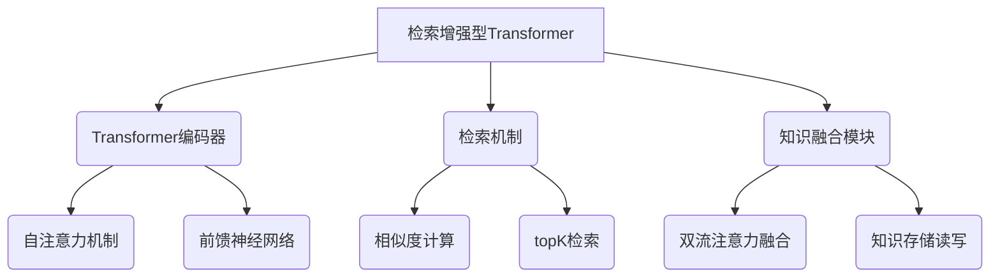

以下是技术博客文章的正文内容：

# 大语言模型原理基础与前沿 检索增强型Transformer

## 1. 背景介绍

### 1.1 问题的由来

随着人工智能技术的快速发展,大型语言模型在自然语言处理领域展现出了巨大的潜力。传统的语言模型通常基于n-gram统计方法或神经网络,但存在参数空间有限、泛化能力弱等缺陷。2017年,Transformer模型的出现为解决这些问题提供了新的思路。

Transformer模型借助注意力机制(Attention Mechanism)直接对输入序列中任意两个位置进行建模,避免了RNN的递归计算,大大提高了训练效率。通过堆叠多层Transformer编码器和解码器,模型可以学习输入序列的深层次表示,在机器翻译、文本生成等任务上取得了出色表现。

然而,现有的Transformer模型仍存在一些局限性:

1. **长序列性能差**:注意力机制的计算复杂度与序列长度的平方成正比,导致在处理长序列时计算代价高昂。
2. **缺乏知识增强**:模型训练过程中无法直接融入外部知识库,泛化能力受限。

为解决这些问题,研究人员提出了一系列改进方案,其中检索增强型Transformer(Retrieval-Augmented Transformer)模型凭借其创新的设计理念,成为了大语言模型发展的重要方向。

### 1.2 研究现状

检索增强型Transformer模型的核心思想是:在Transformer的编码器中引入检索机制,根据输入查询相关的知识片段,将这些知识与原始输入序列融合,从而丰富模型的语义表示能力。

目前,主流的检索增强型Transformer模型可分为两类:

1. **基于双流注意力融合(Dual-stream Attention Fusion)**:将检索得到的知识片段与原始输入序列通过注意力机制融合,例如RAG(Retrieval Augmented Generation)模型。

2. **基于知识存储读取(Knowledge Memory Reading and Writing)**:将检索得到的知识存储在外部记忆库中,Transformer在编码时可读写该记忆库,例如Mem2Mem模型。

这些模型在开放域问答、对话系统等任务上展现出了优异的性能,但仍存在一些需要改进的地方,如检索效率、知识融合方式等,这也是当前研究的热点方向。

### 1.3 研究意义

检索增强型Transformer模型的研究对于推动人工智能技术发展具有重要意义:

1. **提高语言模型的泛化能力**:融入外部知识库,使模型能够处理更广泛的领域,提高了泛化能力。
2. **支持长序列建模**:通过检索机制,模型可以关注输入序列中的关键信息,降低了长序列处理的计算代价。
3. **促进知识驱动的人机交互**:检索增强型模型能够基于知识库进行交互式问答和对话,这对于构建智能助手等应用至关重要。
4. **推动多模态融合发展**:未来,检索增强型Transformer可能与视觉、语音等其他模态相结合,实现多模态知识融合,拓展人工智能的应用场景。

综上所述,检索增强型Transformer模型是大语言模型发展的前沿方向,其研究有助于突破语言模型的瓶颈,推动人工智能技术向前迈进。

### 1.4 本文结构

本文将全面介绍检索增强型Transformer模型的原理、方法和应用。具体内容安排如下:

1. 核心概念与联系
2. 核心算法原理与具体操作步骤
3. 数学模型和公式详细讲解与案例分析
4. 项目实践:代码实例和详细解释说明
5. 实际应用场景
6. 工具和资源推荐
7. 总结:未来发展趋势与挑战
8. 附录:常见问题与解答

接下来,我们将逐一深入探讨上述内容。

## 2. 核心概念与联系

检索增强型Transformer模型主要由以下三个核心组件组成:

1. **Transformer编码器**:用于对输入序列进行编码,获取其语义表示。编码器由多个相同的层组成,每一层包括:
   - **自注意力机制(Self-Attention)**:捕捉输入序列中不同位置之间的依赖关系。
   - **前馈神经网络(Feed-Forward Network)**:对序列的表示进行非线性转换。

2. **检索机制(Retrieval Mechanism)**:根据输入查询相关的知识片段,通常包括以下步骤:
   - **相似度计算**:计算输入与知识库中每个条目的相似度得分。
   - **topK检索**:从知识库中选取与输入最相关的topK条知识片段。

3. **知识融合模块(Knowledge Fusion Module)**:将检索得到的知识片段与输入序列进行融合,常见方法有:
   - **双流注意力融合**:将知识片段与输入序列通过注意力机制融合。
   - **知识存储读写**:将知识片段存储在外部记忆库中,Transformer可读写该记忆库。

通过上述三个模块的紧密配合,检索增强型Transformer模型能够充分利用外部知识,增强语义理解和生成能力。

## 3. 核心算法原理与具体操作步骤

### 3.1 算法原理概述

检索增强型Transformer算法的核心思路是:先使用Transformer编码器对输入序列进行编码,得到其语义表示;然后基于该表示,通过检索机制从知识库中查找相关知识片段;最后将检索结果与原始输入融合,形成知识增强的序列表示,再送入Transformer的解码器进行任务特定的处理(如答案生成、文本续写等)。

该算法的优势在于:

1. **融入外部知识**:模型不再被限制在训练数据的知识范围内,可充分利用知识库中的丰富信息。
2. **关注重点内容**:通过检索机制,模型可以自适应地关注输入序列中的关键信息,降低了长序列处理的计算代价。
3. **模块化设计**:算法将编码、检索、融合三个模块分开,可灵活组合和替换不同的模块,提高了系统的可扩展性。

下面我们详细介绍算法的具体操作步骤。

### 3.2 算法步骤详解

1. **输入编码**:使用Transformer编码器对输入序列$X=(x_1,x_2,...,x_n)$进行编码,得到其隐藏状态表示$H^X=(h_1^X,h_2^X,...,h_n^X)$:

$$H^X=TransformerEncoder(X)$$

2. **相似度计算**:基于输入的隐藏状态表示$H^X$,计算输入与知识库$\mathcal{K}$中每个条目$k_i$的相似度得分$s_i$:

$$s_i=Sim(H^X,k_i),\quad k_i\in\mathcal{K}$$

相似度计算函数$Sim$可采用向量点积、余弦相似度等方法。

3. **TopK检索**:从知识库$\mathcal{K}$中选取与输入最相关的TopK条知识片段$\mathcal{R}=\{r_1,r_2,...,r_K\}$,通常根据相似度得分$s_i$从高到低排序选取TopK个。

4. **知识融合**:将检索得到的知识片段$\mathcal{R}$与原始输入序列$X$进行融合,生成知识增强的序列表示$\hat{H}$,常见方法包括:

   - **双流注意力融合**:
     $$\hat{H}=CrossAttention(H^X,TransformerEncoder(\mathcal{R}))$$
     其中$CrossAttention$为交叉注意力机制,用于融合两个序列的表示。

   - **知识存储读写**:
     $$M'=Write(M,\mathcal{R})\
     \hat{H}=TransformerEncoder(X,M')$$
     首先将知识片段$\mathcal{R}$写入外部记忆库$M$,得到更新后的记忆库$M'$;然后Transformer编码器在编码输入$X$的同时,可读写记忆库$M'$,生成知识增强的序列表示$\hat{H}$。

5. **任务解码**:将知识增强的序列表示$\hat{H}$输入到Transformer解码器中,根据不同的下游任务(如答案生成、文本续写等),对$\hat{H}$进行进一步处理,得到最终的输出$Y$:

$$Y=TransformerDecoder(\hat{H})$$

通过上述步骤,检索增强型Transformer算法实现了输入编码、知识检索与融合的无缝集成,使语言模型能够灵活地利用外部知识,提高了语义理解和生成的能力。

### 3.3 算法优缺点

**优点**:

1. **知识增强**:能够融入外部知识库,显著提高了模型的泛化能力。
2. **长序列建模**:通过检索关注机制,降低了对长序列的计算压力。
3. **模块化设计**:编码、检索、融合三个模块分开,可灵活替换和优化。

**缺点**:

1. **检索效率**:需要实时计算输入与知识库中所有条目的相似度,计算代价较高。
2. **知识噪声**:检索出的知识片段可能存在噪声和不相关信息,影响融合效果。
3. **知识覆盖范围**:模型的表现受限于知识库的覆盖范围和质量。

### 3.4 算法应用领域

检索增强型Transformer算法可广泛应用于自然语言处理的各种任务:

1. **开放域问答**:根据问题查找相关知识,综合回答。
2. **对话系统**:基于知识库进行多轮交互式对话。
3. **文本生成**:参考外部知识,生成更加丰富、连贯的文本。
4. **事实校验**:利用知识库验证文本中的事实陈述是否正确。
5. **关系抽取**:从文本和知识库中提取实体、关系等结构化信息。

总的来说,只要是涉及利用外部知识源的自然语言处理任务,都可以尝试应用检索增强型Transformer算法,以提升模型的泛化和理解能力。

## 4. 数学模型和公式详细讲解与举例说明

在介绍检索增强型Transformer模型的数学模型和公式之前,我们先回顾一下Transformer模型的基本原理。

Transformer模型由编码器(Encoder)和解码器(Decoder)两部分组成,其中编码器的作用是将输入序列编码为隐藏状态表示,解码器则根据编码器的输出和目标序列生成最终的输出序列。

编码器和解码器内部都采用了多头自注意力(Multi-Head Self-Attention)和前馈神经网络(Feed-Forward Network)机制。多头自注意力机制用于捕捉序列中不同位置之间的依赖关系,前馈神经网络则对序列的表示进行非线性转换。

### 4.1 数学模型构建

现在,我们来看看如何在Transformer的基础上构建检索增强型模型。

#### 4.1.1 输入编码

对于给定的输入序列$X=(x_1,x_2,...,x_n)$,我们首先使用Transformer编码器对其进行编码,得到隐藏状态表示$H^X=(h_1^X,h_2^X,...,h_n^X)$:

$$H^X=TransformerEncoder(X)$$

其中,TransformerEncoder由多个相同的编码器层组成,每一层包括多头自注意力子层和前馈神经网络子层。

#### 4.1.2 相似度计算

接下来,我们需要根据输入的隐藏状态表示$H^X$,计算输入与知识库$\mathcal{K}$中每个条目$k_i$的相似度得分$s_i$。

最常见的方法是使用向量点积或余弦相似度:

$$s_i=\phi(H^X)^\top\psi(k_i)$$

其中,$\