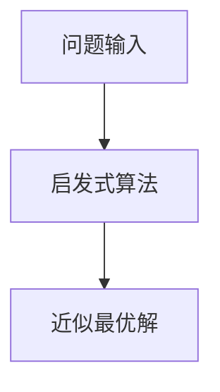
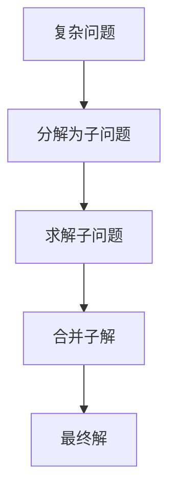
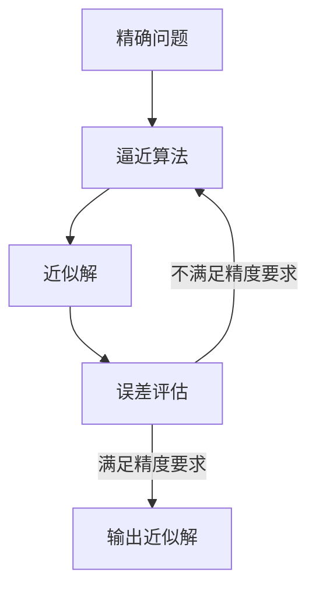
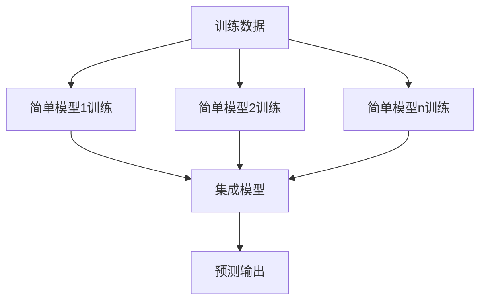

以下是《从简单到复杂再到简洁的认知演变》这篇技术博客文章的正文内容：

# 从简单到复杂再到简洁的认知演变

## 1. 背景介绍

### 1.1 问题的由来

在计算机科学和人工智能领域的发展历程中,我们不断追求更高效、更智能的算法和系统。然而,随着问题复杂度的增加,简单的解决方案往往无法满足需求。因此,我们不得不引入更复杂的模型和方法来应对挑战。但过度复杂化也会带来新的问题,如可解释性降低、效率低下等。因此,如何在简单和复杂之间寻求平衡,实现高效且简洁的解决方案,成为了一个重要课题。

### 1.2 研究现状

目前,学术界和工业界都在积极探索这一领域。一方面,复杂模型如深度神经网络、生成对抗网络等取得了令人瞩目的成就,但也面临着黑盒操作、数据饥渴等挑战。另一方面,一些基于简单原理的方法如决策树、贝叶斯模型等,虽然性能有限,但具有可解释性强、数据需求少等优点。因此,如何有机结合简单与复杂,实现高效且简洁的智能系统,成为了当前的研究热点。

### 1.3 研究意义

简洁高效的智能系统不仅能提高计算效率,节省资源开支,而且有助于提高系统的可解释性和可信度,这对于一些关键应用领域(如医疗、金融等)至关重要。此外,通过深入探讨简单与复杂的关系,我们也能够更好地理解智能的本质,为发展通用人工智能奠定理论基础。

### 1.4 本文结构

本文将从以下几个方面深入探讨这一主题:

1. 核心概念与联系
2. 核心算法原理与具体操作步骤
3. 数学模型和公式详细讲解与案例分析
4. 项目实践:代码实例和详细解释
5. 实际应用场景
6. 工具和资源推荐
7. 总结:未来发展趋势与挑战
8. 附录:常见问题与解答

## 2. 核心概念与联系

探讨简单与复杂的关系,需要明确几个核心概念:

1. **简单性(Simplicity)**: 指模型/算法/系统本身的结构简单、参数少、计算复杂度低等特点。简单性往往与可解释性、泛化性能、数据高效性等优点相关。

2. **复杂性(Complexity)**: 指模型/算法/系统本身的结构复杂、参数多、计算复杂度高等特点。复杂性往往与强大的表达能力、高精度等优点相关。

3. **简洁性(Elegance)**: 指在一定复杂度下,实现最大化的性能和效率。简洁性是简单性和复杂性的最佳平衡点。

4. **可解释性(Interpretability)**: 模型/算法/系统内在机理对人类可理解和解释的程度。可解释性对于一些关键应用领域非常重要。

5. **鲁棒性(Robustness)**: 模型/算法/系统对噪声、异常数据的容错能力。

这些概念相互影响、制约,需要根据具体问题和应用场景,权衡取舍。下面我们将从算法原理、数学模型和实践三个层面深入分析它们的关系。

## 3. 核心算法原理与具体操作步骤

### 3.1 算法原理概述

为了平衡简单性和复杂性,我们需要在算法层面作出设计。常见的技术路线包括:

1. **启发式算法(Heuristic Algorithms)**: 基于经验规则和近似策略,在可接受的时间和空间复杂度下,寻找近似最优解。这类算法通常简单高效,但性能往往无法保证。

2. **分而治之(Divide and Conquer)**: 将复杂问题分解为若干子问题,分别求解后合并。这种策略能够将复杂问题简单化,但合并求解时可能引入新的复杂度。

3. **逼近算法(Approximation Algorithms)**: 在保证一定精度下,通过降低复杂度来加速求解。这种算法在理论和实践中广泛应用,是平衡精度和效率的有效方式。

4. **集成学习(Ensemble Learning)**: 将多个简单模型集成,形成一个强大的复杂模型。这种策略能够发挥简单模型的优势,同时提升整体性能,是当前人工智能领域的主流方法。

### 3.2 算法步骤详解

以上算法思路在具体实现时,需要遵循如下步骤:

1. **问题形式化**: 将现实问题用数学模型精确描述,明确输入、输出和目标函数。

2. **算法设计**: 根据问题特点,选择合适的算法框架(如上述四种),设计具体的求解策略。

3. **复杂度分析**: 计算时间和空间复杂度,评估算法的渐近效率,作为性能的理论保证。

4. **实例分析**: 在典型的测试实例上,验证算法的正确性和性能表现。

5. **优化调整**: 根据分析结果,对算法进行必要的优化和调整,提升性能和鲁棒性。

6. **可解释性考虑**: 对于需要高可解释性的场景,在算法设计时应充分考虑其可解释性。

这些步骤环环相扣,需要反复迭代,才能得到理想的算法实现。算法设计是一个艺术,需要在简单与复杂之间权衡,追求最佳的简洁性。

### 3.3 算法优缺点

不同算法在简单性、复杂性、简洁性等方面存在权衡:

- **启发式算法**: 简单高效,但性能无法保证,可解释性较好。
- **分而治之算法**: 将复杂问题简单化,但合并求解时可能增加新的复杂度。
- **逼近算法**: 在可接受的精度损失下,降低复杂度,提高效率。
- **集成学习**: 发挥简单模型优势,提升整体性能,但可解释性较差。

因此,在具体应用中需要权衡各种因素,选择最优算法。

### 3.4 算法应用领域

这些算法在诸多领域都有广泛应用,包括但不限于:

- 组合优化问题: 如旅行商问题、工厂调度等。
- 大规模数据处理: 如网页排名、推荐系统等。
- 计算生物学: 如蛋白质结构预测、基因序列比对等。
- 人工智能: 如机器学习、计算机视觉、自然语言处理等。

## 4. 数学模型和公式详细讲解与举例说明

### 4.1 数学模型构建

精确的数学模型是算法分析和设计的基础。以组合优化问题为例,我们可以用如下模型描述:

$$
\begin{aligned}
\min\quad&f(x)\
\text{s.t.}\quad&x\in\mathcal{X}\
&g_i(x)\leq 0,\quad i=1,\ldots,m\
&h_j(x)=0,\quad j=1,\ldots,p
\end{aligned}
$$

其中:
- $x$是决策向量
- $f(x)$是目标函数
- $\mathcal{X}$是可行解空间
- $g_i(x)$是不等式约束
- $h_j(x)$是等式约束

通过这种数学描述,我们可以清晰地定义问题,并在此基础上设计算法。

### 4.2 公式推导过程

对于复杂的算法,我们需要通过数学推导,分析其性能保证。以逼近集成算法为例:

假设我们有$K$个基学习器$f_1,\ldots,f_K$,对于给定的输入$x$,算法的输出为:

$$
F(x)=\sum_{k=1}^K\alpha_kf_k(x)
$$

其中$\alpha_k$是基学习器的权重。我们希望$F(x)$尽可能逼近真实函数$f(x)$,即最小化如下损失函数:

$$
R(F)=\mathbb{E}_{x\sim\mathcal{D}}[L(F(x),f(x))]
$$

利用经验风险最小化理论,可以证明存在一组最优权重$\alpha^*$,使得:

$$
R(F^*)=R(\sum_{k=1}^K\alpha_k^*f_k)\leq R(f_k),\quad\forall k
$$

这意味着集成算法的性能不会比单个基学习器差。通过适当的集成策略,我们可以达到比单个基学习器更好的性能,从而平衡简单性和复杂性。

### 4.3 案例分析与讲解

我们用一个简单的二次规划问题,来具体说明数学建模和算法设计的过程:

$$
\begin{aligned}
\min\quad&\frac{1}{2}x^TQx+c^Tx\
\text{s.t.}\quad&Ax\leq b
\end{aligned}
$$

其中$Q$是对称正定矩阵。

这是一个凸优化问题,可以通过启发式算法、分而治之算法、逼近算法等方式求解。以内点法为例,算法步骤如下:

1) 初始化一个严格可行内点$x^0$
2) 对于第$k$次迭代:
    a) 计算关于$x^k$的牛顿方向$\Delta x^k$
    b) 以$\alpha^k$为步长,更新$x^{k+1}=x^k+\alpha^k\Delta x^k$
3) 重复2)直至达到收敛条件

该算法每次迭代只需求解一个线性方程组,复杂度较低,且可以保证收敛到全局最优解。它很好地平衡了简单性和复杂性,是一种简洁的算法。

### 4.4 常见问题解答

**Q: 如何在算法设计时权衡简单性和复杂性?**

A: 主要考虑以下几个因素:
- 问题的特点和约束条件
- 精度和效率的权衡
- 可解释性的需求
- 数据的规模和质量

通常我们会先尝试简单的算法,如果性能不佳则引入一定复杂度,直至达到满意的简洁性。

**Q: 为什么要追求简洁性?**

A: 简洁性能够带来诸多好处:
- 高效的计算性能
- 良好的可解释性和可信度
- 鲁棒性和泛化能力
- 易于实现和维护
- 节省计算资源

因此,在满足需求的前提下,我们应当追求尽可能简洁的算法和模型。

**Q: 数学建模对算法设计有何重要意义?**

A: 数学模型是算法分析的基础,能够:
- 精确定义问题和目标
- 为算法正确性提供理论保证
- 分析算法的复杂度和性能界限
- 指导算法设计和优化
- 促进算法思想的交流和发展

可以说,数学模型是连接现实问题与算法实现的纽带,对于设计高质量算法至关重要。

## 5. 项目实践:代码实例和详细解释说明

### 5.1 开发环境搭建

我们以Python为例,介绍如何搭建开发环境:

1. 安装Python 3.7及以上版本
2. 安装必要的Python包,如Numpy、Scipy、Matplotlib等
3. 选择合适的集成开发环境(IDE),如PyCharm、Spyder等

为了方便大家实践,我们提供了一个