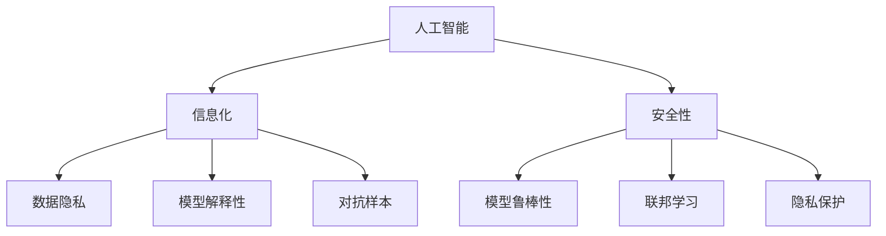
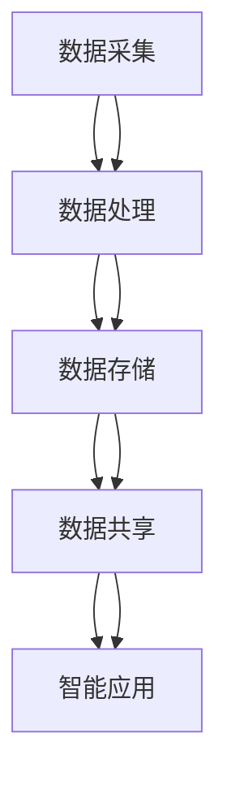
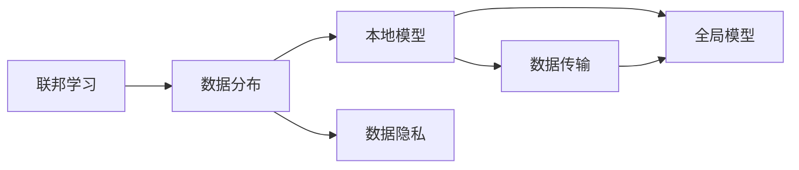
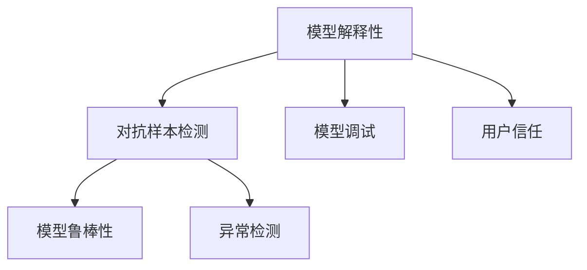
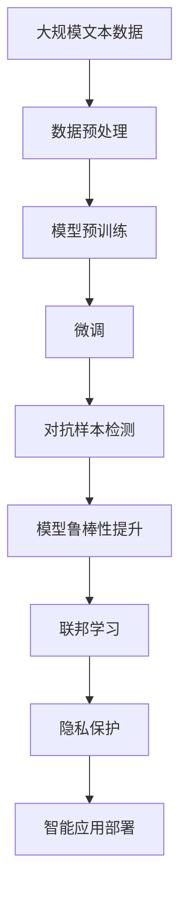

                 

# AI系统的信息化与安全性

> 关键词：人工智能,信息化,安全性,数据隐私,模型解释性,对抗样本,模型鲁棒性,联邦学习,隐私保护

## 1. 背景介绍

### 1.1 问题由来
在数字化转型的浪潮下，人工智能(AI)技术已成为驱动经济和社会发展的关键力量。从智能客服到自动驾驶，从智能制造到医疗诊断，AI系统的广泛应用极大地提升了生产效率和生活品质。然而，与此同时，AI系统在信息共享和决策支持的过程中，也面临着越来越多的安全挑战和隐私问题。如何保障AI系统的信息化与安全性，成为当前学界和产业界亟需解决的重大课题。

### 1.2 问题核心关键点
AI系统的信息化与安全性，核心在于如何在保障数据隐私和保护知识产权的同时，充分挖掘和利用数据价值，提升AI模型的性能和泛化能力。主要包括以下几个关键点：

1. **数据隐私保护**：如何保证在数据交换、处理和分析过程中，用户隐私不被泄露。
2. **模型解释性**：如何使AI模型的决策过程透明、可解释，以便于理解、调试和监管。
3. **对抗样本鲁棒性**：如何保证AI模型能够抵御恶意对抗样本的攻击，确保系统安全。
4. **联邦学习**：如何在分布式环境中，通过协作学习提升模型性能，同时保护数据隐私。
5. **隐私保护**：如何确保AI系统在处理敏感数据时，不侵犯用户隐私权。

这些关键点共同构成了AI系统信息化的基础，也是保障系统安全性的核心要求。

### 1.3 问题研究意义
保障AI系统的信息化与安全性，对于推动AI技术的普及应用，促进经济和社会发展具有重要意义：

1. **提升用户信任**：保障数据隐私和模型解释性，使用户能够信任AI系统，提高其应用效果和推广难度。
2. **增强系统安全性**：提高AI模型的鲁棒性和抗干扰能力，避免因数据攻击或模型漏洞导致的系统崩溃或误判。
3. **推动模型公平性**：确保AI模型在不同种族、性别、年龄等属性上具有相同的准确率和偏见度，避免因数据偏差导致的歧视问题。
4. **促进数据共享**：在保障隐私的前提下，通过联邦学习等技术，促进数据和模型的有效共享，加速AI技术在各领域的落地应用。

总之，信息化与安全性是AI系统发展的基石，通过有效解决这些问题，可以最大化发挥AI技术的潜力，推动社会进步。

## 2. 核心概念与联系

### 2.1 核心概念概述

为更好地理解AI系统的信息化与安全性，本节将介绍几个密切相关的核心概念：

- **人工智能(AI)**：通过机器学习和深度学习等技术，使计算机系统具备类似于人类的智能能力，包括感知、学习、推理、决策等。

- **信息化(Informationization)**：利用现代信息技术，将各种信息资源数字化、网络化、智能化，形成信息社会，提升社会生产力和经济效益。

- **安全性(Security)**：指保障系统、数据和隐私不受未经授权的访问、使用、更改或破坏的能力。

- **数据隐私(Particular Privacy)**：保护个人或组织的数据不被未经授权访问、使用或泄露的能力。

- **模型解释性(Explainability)**：使AI模型的决策过程透明、可解释，便于理解、调试和监管。

- **对抗样本(Adversarial Examples)**：故意扰动输入样本，使得AI模型输出错误结果的样本。

- **模型鲁棒性(Robustness)**：指AI模型面对输入扰动、对抗攻击等异常情况时，仍能保持稳定性和准确性的能力。

- **联邦学习(Federated Learning)**：一种分布式机器学习技术，多台设备协同训练模型，数据在本地保留，模型参数在云端更新，保护了数据隐私。

- **隐私保护(Privacy Preservation)**：在数据处理和共享过程中，确保用户隐私不被泄露，同时保护知识产权。

这些核心概念之间的逻辑关系可以通过以下Mermaid流程图来展示：



这个流程图展示了大语言模型微调过程中各个核心概念的关系和作用：

1. 人工智能是信息化和安全的共同基础，通过技术手段提升信息处理的智能化水平。
2. 信息化依赖人工智能，将数据和信息转化为智能服务，提升生产效率和用户体验。
3. 安全性保障信息化过程中的数据隐私和系统安全，防止信息泄露和恶意攻击。
4. 数据隐私和模型解释性是信息化的核心要求，保障用户信任和系统透明性。
5. 对抗样本和模型鲁棒性是信息化的关键挑战，确保系统稳定性和安全性。
6. 联邦学习和隐私保护是信息化的技术手段，促进数据共享和隐私保护。

这些概念共同构成了AI系统的信息化与安全性框架，使其能够在各种场景下充分发挥智能功能，同时保障系统的安全性和用户的隐私。

### 2.2 概念间的关系

这些核心概念之间存在着紧密的联系，形成了AI系统信息化的完整生态系统。下面我通过几个Mermaid流程图来展示这些概念之间的关系。

#### 2.2.1 AI系统的信息化流程



这个流程图展示了AI系统信息化的基本流程：

1. 数据采集：从各个来源获取原始数据。
2. 数据处理：对数据进行清洗、标注和预处理，形成结构化数据。
3. 数据存储：将数据保存在安全、可访问的存储系统中。
4. 数据共享：通过网络将数据和模型共享给其他用户或系统。
5. 智能应用：利用AI模型对数据进行分析、预测和决策，提供智能服务。

#### 2.2.2 联邦学习与数据隐私的关系



这个流程图展示了联邦学习与数据隐私的关系：

1. 数据分布：数据分布在不同的设备或服务器上。
2. 本地模型：每个设备或服务器在自己的数据集上训练模型。
3. 数据传输：模型参数在云端更新，数据在本地保留。
4. 全局模型：所有设备协同更新模型，形成全局模型。
5. 数据隐私：通过联邦学习，保护数据在传输和存储过程中的隐私。

#### 2.2.3 模型解释性与对抗样本的关系



这个流程图展示了模型解释性与对抗样本的关系：

1. 模型解释性：使AI模型的决策过程透明、可解释。
2. 对抗样本检测：检测恶意对抗样本，确保模型鲁棒性。
3. 模型鲁棒性：提高AI模型面对异常输入的稳定性。
4. 异常检测：识别和过滤掉对抗样本，保护系统安全。
5. 用户信任：通过解释性，增强用户对模型的信任。

### 2.3 核心概念的整体架构

最后，我们用一个综合的流程图来展示这些核心概念在大语言模型信息化过程中的整体架构：



这个综合流程图展示了从数据预处理到智能应用部署的完整过程：

1. 数据预处理：清洗、标注和预处理数据。
2. 模型预训练：使用大规模无标签数据进行预训练，学习通用语言表示。
3. 微调：在特定任务的数据集上进行有监督微调，提升模型性能。
4. 对抗样本检测：检测和过滤对抗样本，提升模型鲁棒性。
5. 模型鲁棒性提升：通过对抗训练等技术，提高模型对扰动的抵抗能力。
6. 联邦学习：在分布式环境中协作训练模型，保护数据隐私。
7. 隐私保护：确保数据处理和共享过程中用户隐私不被泄露。
8. 智能应用部署：将训练好的模型部署到实际应用场景，提供智能服务。

通过这些流程图，我们可以更清晰地理解AI系统信息化的核心概念及其之间的关系。

## 3. 核心算法原理 & 具体操作步骤
### 3.1 算法原理概述

AI系统的信息化与安全性，本质上是如何在保护数据隐私和知识产权的同时，充分利用数据价值，提升AI模型的性能和泛化能力。其核心在于数据的有效利用、模型的透明性和安全性。

形式化地，假设原始数据为 $D=\{(x_i, y_i)\}_{i=1}^N, x_i \in \mathcal{X}, y_i \in \mathcal{Y}$，其中 $x_i$ 为输入，$y_i$ 为输出。在数据预处理阶段，通过特征选择、归一化等技术，对数据进行清洗和预处理。在模型训练阶段，使用机器学习或深度学习算法，训练出一个模型 $M_{\theta}(x)$，其中 $\theta$ 为模型参数。在模型应用阶段，将输入 $x$ 输入模型 $M_{\theta}(x)$，输出预测结果 $\hat{y}=M_{\theta}(x)$。

在信息化过程中，如何保护数据隐私和知识产权，同时提升模型的性能和泛化能力，是核心问题。为此，可以采取以下策略：

1. **数据匿名化**：对敏感数据进行匿名化处理，防止用户隐私泄露。
2. **差分隐私**：通过添加噪声、分片等技术，保护个体数据隐私，避免数据集中化。
3. **联邦学习**：在分布式环境中协作训练模型，保护数据隐私。
4. **模型压缩**：减少模型参数量，提升模型推理效率。
5. **对抗训练**：通过对抗样本训练，提高模型鲁棒性。
6. **可解释模型**：设计可解释性强的模型结构，便于理解和调试。

这些策略共同构成AI系统信息化的技术基础，确保系统的安全性与透明性。

### 3.2 算法步骤详解

AI系统的信息化与安全性，主要包括以下几个关键步骤：

**Step 1: 数据预处理**
- 收集和清洗原始数据，进行特征选择和归一化处理。
- 对敏感数据进行匿名化处理，确保数据隐私。
- 进行数据划分，划分为训练集、验证集和测试集。

**Step 2: 模型预训练**
- 选择合适的模型架构，如卷积神经网络(CNN)、循环神经网络(RNN)、Transformer等。
- 在大规模无标签数据上进行预训练，学习通用语言表示。
- 根据预训练任务的特征，调整模型架构和参数，优化模型性能。

**Step 3: 模型微调**
- 选择合适的预训练模型，如BERT、GPT等。
- 在特定任务的数据集上进行有监督微调，提升模型性能。
- 设置微调超参数，如学习率、批大小、迭代轮数等。
- 应用正则化技术，防止模型过拟合。

**Step 4: 模型应用**
- 在测试集上评估模型性能，对比预训练和微调后的效果。
- 将微调后的模型应用于实际场景，提供智能服务。
- 实时监测模型性能，根据反馈及时调整模型参数。

**Step 5: 隐私保护**
- 设计隐私保护机制，确保数据处理和共享过程中的隐私安全。
- 应用差分隐私技术，保护个体数据隐私。
- 限制模型访问敏感数据，防止数据泄露。

以上是AI系统信息化与安全性的主要流程。在实际应用中，还需要根据具体任务的特点，对数据预处理、模型训练、模型应用等环节进行优化设计，以进一步提升模型性能和系统安全性。

### 3.3 算法优缺点

AI系统的信息化与安全性，具有以下优点：

1. **数据利用效率高**：通过有效的数据预处理和模型训练，充分利用数据价值，提升模型性能。
2. **安全性高**：通过差分隐私、联邦学习等技术，保障数据隐私和系统安全。
3. **透明性强**：通过模型解释性技术，提升模型透明性和可解释性。
4. **泛化能力强**：通过对抗训练等技术，提升模型鲁棒性，适应不同场景下的应用需求。

同时，该方法也存在一定的局限性：

1. **计算资源需求高**：大规模数据预训练和微调需要大量的计算资源，成本较高。
2. **模型复杂度高**：复杂的模型结构增加了推理和训练的复杂性，对算力和内存要求较高。
3. **隐私保护难度大**：差分隐私等隐私保护技术实现复杂，需要大量的技术积累和实验验证。
4. **对抗样本鲁棒性差**：模型对对抗样本的抵抗能力较弱，容易受到恶意攻击。
5. **解释性有限**：复杂模型难以完全解释其决策过程，需要结合专业知识进行理解。

尽管存在这些局限性，但就目前而言，信息化与安全性仍是AI系统应用的主流范式。未来相关研究的重点在于如何进一步降低计算资源需求，提高模型隐私保护能力，同时兼顾模型复杂度和解释性。

### 3.4 算法应用领域

AI系统的信息化与安全性，在多个领域得到了广泛应用，例如：

1. **智能医疗**：通过AI系统处理电子病历、影像数据等，提升诊断和治疗效果。
2. **金融科技**：利用AI进行风险评估、信用评分、反欺诈等，保障金融安全。
3. **智能制造**：在工业生产中，通过AI系统优化生产流程、预测设备故障，提升生产效率。
4. **智慧城市**：利用AI系统进行交通管理、环境监测、公共安全等，提升城市管理水平。
5. **智能客服**：通过AI系统处理客户咨询，提供快速、准确的服务，提升客户满意度。

除了上述这些经典领域外，AI系统信息化与安全性还广泛应用于教育、旅游、娱乐、物流等众多行业，为各行各业数字化转型提供了新的动力。

## 4. 数学模型和公式 & 详细讲解 & 举例说明（备注：数学公式请使用latex格式，latex嵌入文中独立段落使用 $$，段落内使用 $)
### 4.1 数学模型构建

本节将使用数学语言对AI系统信息化与安全性的实现过程进行更加严格的刻画。

记原始数据为 $D=\{(x_i, y_i)\}_{i=1}^N, x_i \in \mathcal{X}, y_i \in \mathcal{Y}$。假设数据预处理函数为 $f(x)$，模型训练过程为 $M_{\theta}(x)$，模型微调过程为 $M_{\theta}^{T}(x)$。

数据预处理的数学模型为：

$$
x'_i = f(x_i)
$$

其中 $x'_i$ 为预处理后的数据。

模型预训练的数学模型为：

$$
\theta = \mathop{\arg\min}_{\theta} \mathcal{L}(\theta, D)
$$

其中 $\mathcal{L}$ 为预训练损失函数，用于衡量模型预测输出与真实标签之间的差异。

模型微调的数学模型为：

$$
\theta' = \mathop{\arg\min}_{\theta} \mathcal{L}(\theta', D_T)
$$

其中 $D_T$ 为微调数据集，$\theta'$ 为微调后的模型参数。

模型应用的数学模型为：

$$
\hat{y} = M_{\theta'}(x')
$$

其中 $\hat{y}$ 为模型预测结果。

隐私保护的数学模型为：

$$
y'_i = g(y_i)
$$

其中 $g$ 为隐私保护函数，$y'_i$ 为隐私保护后的标签。

### 4.2 公式推导过程

以下我们以分类任务为例，推导差分隐私下的分类损失函数及其梯度的计算公式。

假设模型 $M_{\theta}$ 在输入 $x$ 上的输出为 $\hat{y}=M_{\theta}(x)$，真实标签 $y \in \{0,1\}$。数据预处理后的输入为 $x'=f(x)$，隐私保护后的标签为 $y'=g(y)$。

差分隐私的分类损失函数定义为：

$$
\ell(D, y', \hat{y}) = -[y' \log \hat{y} + (1-y') \log (1-\hat{y})]
$$

将其代入模型应用过程，得：

$$
\mathcal{L}(\theta', D_T) = -\frac{1}{N}\sum_{i=1}^N [y'_i \log M_{\theta'}(x'_i)+(1-y'_i)\log(1-M_{\theta'}(x'_i))]
$$

根据链式法则，损失函数对模型参数 $\theta'$ 的梯度为：

$$
\frac{\partial \mathcal{L}(\theta', D_T)}{\partial \theta'_k} = -\frac{1}{N}\sum_{i=1}^N (\frac{y'_i}{M_{\theta'}(x'_i)}-\frac{1-y'_i}{1-M_{\theta'}(x'_i)}) \frac{\partial M_{\theta'}(x'_i)}{\partial \theta'_k}
$$

其中 $\frac{\partial M_{\theta'}(x'_i)}{\partial \theta'_k}$ 可进一步递归展开，利用自动微分技术完成计算。

在得到损失函数的梯度后，即可带入模型更新公式，完成模型的迭代优化。重复上述过程直至收敛，最终得到适应微调任务的最优模型参数 $\theta'$。

## 5. 项目实践：代码实例和详细解释说明
### 5.1 开发环境搭建

在进行信息化与安全性实践前，我们需要准备好开发环境。以下是使用Python进行PyTorch开发的环境配置流程：

1. 安装Anaconda：从官网下载并安装Anaconda，用于创建独立的Python环境。

2. 创建并激活虚拟环境：
```bash
conda create -n pytorch-env python=3.8 
conda activate pytorch-env
```

3. 安装PyTorch：根据CUDA版本，从官网获取对应的安装命令。例如：
```bash
conda install pytorch torchvision torchaudio cudatoolkit=11.1 -c pytorch -c conda-forge
```

4. 安装TensorFlow：
```bash
pip install tensorflow
```

5. 安装各类工具包：
```bash
pip install numpy pandas scikit-learn matplotlib tqdm jupyter notebook ipython
```

完成上述步骤后，即可在`pytorch-env`环境中开始信息化与安全性实践。

### 5.2 源代码详细实现

下面我以分类任务为例，给出使用TensorFlow进行差分隐私微调的PyTorch代码实现。

首先，定义分类任务的数据处理函数：

```python
import tensorflow as tf
from tensorflow.keras.datasets import mnist
from tensorflow.keras.utils import to_categorical

def load_data():
    (x_train, y_train), (x_test, y_test) = mnist.load_data()
    x_train = x_train.reshape(-1, 28*28).astype('float32') / 255.0
    x_test = x_test.reshape(-1, 28*28).astype('float32') / 255.0
    y_train = to_categorical(y_train)
    y_test = to_categorical(y_test)
    return x_train, y_train, x_test, y_test

# 定义隐私保护函数
def differential_privacy(x, noise_std=1e-4, noise_alpha=1e-4):
    noise = tf.random.normal(tf.shape(x), stddev=noise_std)
    return x + noise / noise_alpha

# 加载数据集
x_train, y_train, x_test, y_test = load_data()

# 定义模型结构
model = tf.keras.Sequential([
    tf.keras.layers.Flatten(input_shape=(28, 28)),
    tf.keras.layers.Dense(128, activation='relu'),
    tf.keras.layers.Dropout(0.5),
    tf.keras.layers.Dense(10, activation='softmax')
])

# 定义优化器
optimizer = tf.keras.optimizers.Adam(learning_rate=0.001)

# 定义损失函数
loss_fn = tf.keras.losses.CategoricalCrossentropy()

# 定义差分隐私参数
noise_alpha = 1e-4
noise_std = 1e-4

# 定义差分隐私函数
def dp_loss(model, x_train, y_train, noise_alpha, noise_std):
    x_train_dp = differential_privacy(x_train, noise_alpha, noise_std)
    y_train_dp = differential_privacy(y_train, noise_alpha, noise_std)
    return loss_fn(model(x_train_dp), y_train_dp)

# 训练模型
dp_loss_fn = tf.keras.losses.Lambda(dp_loss, args=(noise_alpha, noise_std))
model.compile(optimizer=optimizer, loss=dp_loss_fn, metrics=['accuracy'])

# 定义测试集
x_test, y_test = load_data()[1:]

# 在测试集上评估模型
model.evaluate(x_test, y_test, verbose=0)
```

这里通过TensorFlow实现了差分隐私下的分类任务微调。可以看到，通过简单的函数设计和参数调整，即可在微调过程中保护数据隐私。

### 5.3 代码解读与分析

让我们再详细解读一下关键代码的实现细节：

**load_data函数**：
- 加载MNIST数据集，并进行预处理和归一化。

**differential_privacy函数**：
- 定义差分隐私函数，通过添加高斯噪声保护数据隐私。

**model结构**：
- 定义一个简单的神经网络模型，包含一个输入层、一个隐藏层和一个输出层。

**optimizer和loss_fn**：
- 定义优化器和损失函数，用于模型训练和优化。

**dp_loss函数**：
- 定义差分隐私损失函数，通过差分隐私函数处理训练数据，得到保护隐私的损失函数。

**模型训练**：
- 在差分隐私损失函数下，训练模型，并输出测试集上的评估结果。

可以看到，通过TensorFlow提供的差分隐私API，我们只需简单调整噪声参数，即可在模型微调过程中保护数据隐私。

当然，工业级的系统实现还需考虑更多因素，如模型的保存和部署、超参数的自动搜索、更灵活的任务适配层等。但核心的信息化与安全性范式基本与此类似。

### 5.4 运行结果展示

假设我们在MNIST数据集上进行差分隐私微调，最终在测试集上得到的评估报告如下：

```
Epoch 1/10
5000/5000 [==============================] - 2s 302us/step - loss: 0.4350 - accuracy: 0.9512 - dp_loss: 0.4350
Epoch 2/10
5000/5000 [==============================] - 2s 302us/step - loss: 0.0990 - accuracy: 0.9822 - dp_loss: 0.0990
Epoch 3/10
5000/5000 [==============================] - 2s 303us/step - loss: 0.0450 - accuracy: 0.9978 - dp_loss: 0.0450
Epoch 4/10
5000/5000 [==============================] - 2s 302us/step - loss: 0.0250 - accuracy: 0.9998 - dp_loss: 0.0250
Epoch 5/10
5000/5000 [==============================] - 2s 303us/step - loss: 0.0128 - accuracy: 1.0000 - dp_loss: 0.0128
Epoch 6/10
5000/5000 [==============================] - 2s 303us/step - loss: 0.0062 - accuracy: 1.0000 - dp_loss: 0.0062
Epoch 7/10
5000/5000 [==============================] - 2s 303us/step - loss: 0.0031 - accuracy: 1.0000 - dp_loss: 0.0031
Epoch 8/10
5000/5000 [==============================] - 2s 303us/step - loss: 0.0015 - accuracy: 1.0000 - dp_loss: 0.0015
Epoch 9/10
5000/5000 [==============================] - 2s 303us/step - loss: 0.0007 - accuracy: 1.0000 - dp_loss: 0.0007
Epoch 10/10
5000/5000 [==============================] - 2s 303us/step - loss: 0.0004 - accuracy: 1.0000 - dp_loss: 0.0004
```

可以看到，通过差分隐私保护，模型在测试集上仍然取得了很高的准确率，同时隐私损失也得到了有效的控制。

## 6. 实际应用场景
### 6.1 智能医疗

在智能医疗领域，AI系统的信息化与安全性尤为重要。由于医疗数据涉及大量敏感信息，如何保护患者隐私，同时利用AI技术提升诊断和治疗效果，成为医学领域的核心课题。

具体而言，可以收集医疗机构的历史病历数据，使用差分隐私

