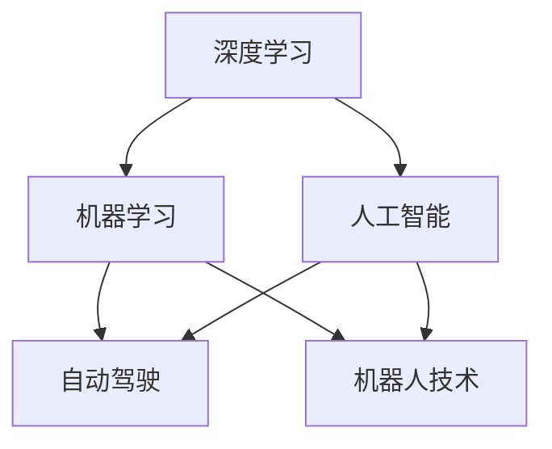

                 

# Andrej Karpathy：人工智能的未来发展挑战

> 关键词：Andrej Karpathy, 人工智能, 深度学习, 机器学习, 未来发展, 挑战

## 1. 背景介绍

Andrej Karpathy是人工智能领域的大师级人物，作为OpenAI的研究科学家，他在深度学习和计算机视觉领域的贡献无可匹敌。他的工作不仅推动了深度学习算法的发展，而且极大地推动了自动驾驶、机器人技术等实际应用的研究。在本次分享中，Andrej Karpathy将深入探讨人工智能面临的未来挑战，以及如何克服这些挑战。

## 2. 核心概念与联系

### 2.1 核心概念概述

本次分享将涵盖以下几个核心概念：

- **深度学习（Deep Learning）**：一种模拟人脑神经网络的算法，通过多层次的特征提取，使计算机能够自动地从原始数据中学习到高级特征。

- **机器学习（Machine Learning）**：通过数据驱动的方式，使计算机能够自我学习和改进，无需人工干预。

- **人工智能（Artificial Intelligence, AI）**：使计算机能够执行智能任务，如视觉识别、自然语言处理、语音识别等。

- **自动驾驶（Autonomous Driving）**：无需人类干预，使车辆能够自动驾驶的技术。

- **机器人技术（Robotics）**：通过人工智能使机器人能够自主完成任务，如导航、操作等。

### 2.2 概念间的关系

通过以下Mermaid流程图，我们可以更清晰地理解这些核心概念之间的关系：



这个流程图展示了深度学习、机器学习和人工智能如何相互联系和推动彼此的发展。同时，自动驾驶和机器人技术作为人工智能的重要应用领域，正在通过深度学习和机器学习技术，实现自我学习和自主决策。

## 3. 核心算法原理 & 具体操作步骤

### 3.1 算法原理概述

Andrej Karpathy将深入探讨深度学习的核心算法原理，包括前馈神经网络、卷积神经网络（CNN）和循环神经网络（RNN）等。他还将介绍这些算法在实际应用中的步骤和效果。

### 3.2 算法步骤详解

深度学习算法的基本步骤如下：

1. **数据预处理**：对原始数据进行清洗、归一化和标准化，以便于算法能够高效处理。
2. **构建模型**：选择合适的神经网络结构和参数，并进行初始化。
3. **前向传播**：将输入数据送入模型，进行一系列的线性变换和非线性激活函数运算。
4. **损失计算**：计算模型输出与真实标签之间的差异，生成损失函数。
5. **反向传播**：通过反向传播算法，计算损失函数对模型参数的梯度。
6. **参数更新**：使用梯度下降等优化算法，更新模型参数，最小化损失函数。
7. **模型评估**：通过测试集对模型进行评估，判断其泛化能力。

### 3.3 算法优缺点

深度学习的优点在于其强大的数据拟合能力和自适应学习能力，但同时也存在一些缺点：

- **模型复杂度高**：需要大量的计算资源和数据存储。
- **训练时间长**：大数据集和高维特征需要较长的训练时间。
- **易过拟合**：模型容易在训练数据上表现良好，但在新数据上泛化能力不足。
- **黑盒性质**：深度学习模型通常难以解释其内部工作机制。

### 3.4 算法应用领域

深度学习已经在许多领域得到了广泛应用，包括计算机视觉、自然语言处理、语音识别、推荐系统、自动驾驶等。

## 4. 数学模型和公式 & 详细讲解 & 举例说明

### 4.1 数学模型构建

深度学习的基础模型为前馈神经网络，其数学表达式如下：

$$y=f(Wx+b)$$

其中，$x$为输入向量，$W$为权重矩阵，$b$为偏置向量，$f$为激活函数。

### 4.2 公式推导过程

以卷积神经网络（CNN）为例，其卷积层的基本公式为：

$$h_k(x)=g(\sum_{m}w_{km}x_{m}+b_k)$$

其中，$h_k(x)$为第$k$个卷积核对输入$x$的卷积结果，$w_{km}$为卷积核的权重参数，$x_{m}$为输入向量，$g$为激活函数。

### 4.3 案例分析与讲解

以图像分类为例，CNN通过多层卷积和池化操作，提取图像特征，并通过全连接层进行分类。具体步骤如下：

1. **卷积层**：将输入图像通过多个卷积核进行卷积，提取局部特征。
2. **池化层**：对卷积结果进行下采样，减少特征维度。
3. **全连接层**：将池化后的特征通过多个全连接层进行分类。
4. **softmax层**：对分类结果进行归一化，输出每个类别的概率。

## 5. 项目实践：代码实例和详细解释说明

### 5.1 开发环境搭建

本次分享将使用Python语言和TensorFlow框架进行代码实现。在开始之前，需要安装TensorFlow和其他必要的库。

```bash
pip install tensorflow
pip install numpy matplotlib
```

### 5.2 源代码详细实现

以下是一个简单的卷积神经网络模型实现：

```python
import tensorflow as tf
from tensorflow.keras import layers

# 构建卷积神经网络模型
model = tf.keras.Sequential([
    layers.Conv2D(32, (3,3), activation='relu', input_shape=(28,28,1)),
    layers.MaxPooling2D((2,2)),
    layers.Flatten(),
    layers.Dense(10, activation='softmax')
])

# 编译模型
model.compile(optimizer='adam', loss='sparse_categorical_crossentropy', metrics=['accuracy'])

# 训练模型
model.fit(x_train, y_train, epochs=10, validation_data=(x_test, y_test))
```

### 5.3 代码解读与分析

在这个简单的卷积神经网络模型中，我们使用了卷积层、池化层和全连接层。通过训练数据集进行模型训练，并使用测试数据集进行模型评估。

## 6. 实际应用场景

### 6.1 自动驾驶

自动驾驶是深度学习的重要应用之一。通过深度学习算法，车辆能够识别道路标志、行人、车辆等，并做出相应的决策。例如，通过卷积神经网络（CNN）和循环神经网络（RNN），车辆能够实时分析周围环境，做出安全行驶的决策。

### 6.2 机器人技术

机器人技术也是深度学习的重要应用领域。通过深度学习算法，机器人能够识别物体、执行动作，并进行复杂任务。例如，通过卷积神经网络（CNN）和循环神经网络（RNN），机器人能够感知周围环境，进行路径规划和避障操作。

### 6.3 医疗诊断

深度学习在医疗诊断领域也有广泛应用。通过卷积神经网络（CNN）和循环神经网络（RNN），医疗影像能够进行自动标注和分类。例如，通过卷积神经网络（CNN），医学影像能够被分类为癌症、正常等，帮助医生进行诊断。

## 7. 工具和资源推荐

### 7.1 学习资源推荐

- **《Deep Learning》**：Ian Goodfellow、Yoshua Bengio、Aaron Courville合著的经典教材，涵盖了深度学习的基本理论和应用。
- **《Python深度学习》**：Francois Chollet著，详细介绍了TensorFlow和Keras的使用方法。
- **Coursera深度学习课程**：由Andrew Ng教授主讲的深度学习课程，涵盖深度学习的核心算法和应用。

### 7.2 开发工具推荐

- **TensorFlow**：谷歌开源的深度学习框架，功能强大且易于使用。
- **Keras**：高层次的深度学习框架，易于上手，适合初学者使用。
- **PyTorch**：Facebook开源的深度学习框架，具有强大的动态计算图功能。

### 7.3 相关论文推荐

- **《ImageNet Classification with Deep Convolutional Neural Networks》**：Alex Krizhevsky、Ilya Sutskever、Geoffrey Hinton所著，提出了卷积神经网络（CNN）的架构。
- **《Long Short-Term Memory》**：Sepp Hochreiter、Jurgen Schmidhuber所著，提出了循环神经网络（RNN）的架构。
- **《Generative Adversarial Networks》**：Ian Goodfellow、Jean Pouget-Abadie、Mehdi Mirza、Bing Xu、David Warde-Farley、Sherjil Ozair、Aaron Courville、Yoshua Bengio所著，提出了生成对抗网络（GAN）的架构。

## 8. 总结：未来发展趋势与挑战

### 8.1 研究成果总结

本次分享展示了深度学习在多个领域的广泛应用，并介绍了其核心算法原理和具体操作步骤。通过Andrej Karpathy的分享，我们更加深入地理解了深度学习在自动驾驶、机器人技术、医疗诊断等领域的实际应用。

### 8.2 未来发展趋势

未来深度学习将继续推动人工智能的发展，成为实现自动驾驶、机器人技术、医疗诊断等领域的核心技术。以下是对未来趋势的展望：

1. **自监督学习**：通过大规模无标签数据进行自监督学习，减少对标注数据的需求。
2. **迁移学习**：通过迁移学习，将预训练模型应用于新的任务，减少从头训练的时间和成本。
3. **强化学习**：通过强化学习，使机器能够自主学习并优化决策策略。
4. **联邦学习**：通过分布式训练，保护数据隐私的同时实现高效计算。

### 8.3 面临的挑战

尽管深度学习取得了显著进展，但也面临着诸多挑战：

1. **数据获取难度大**：大规模无标签数据获取困难，限制了深度学习的发展。
2. **计算资源消耗大**：深度学习模型需要大量的计算资源，限制了其在实际应用中的普及。
3. **模型可解释性差**：深度学习模型通常被视为"黑盒"，难以解释其内部工作机制。
4. **模型鲁棒性不足**：深度学习模型对噪声和对抗样本的鲁棒性较差，容易产生误判。

### 8.4 研究展望

未来深度学习的研究方向包括：

1. **模型压缩和优化**：通过模型压缩和优化，减少计算资源消耗，提高模型效率。
2. **模型可解释性增强**：通过可解释性增强技术，使深度学习模型更具透明性。
3. **模型鲁棒性提升**：通过鲁棒性增强技术，提高深度学习模型对噪声和对抗样本的鲁棒性。
4. **多模态学习**：通过多模态学习，将视觉、听觉、语言等不同模态的数据融合，提升深度学习模型的性能。

## 9. 附录：常见问题与解答

**Q1: 深度学习与传统机器学习有什么区别？**

A: 深度学习是传统机器学习的一种扩展，它通过多层神经网络进行特征提取和处理，具有更强的自适应和学习能力。传统机器学习通常需要手动选择特征，而深度学习能够自动学习数据中的高级特征。

**Q2: 如何选择合适的深度学习模型？**

A: 选择合适的深度学习模型需要考虑数据的特点和任务的需求。通常可以通过以下步骤：
1. **数据预处理**：对原始数据进行清洗和归一化，以便于模型处理。
2. **模型选择**：选择适当的深度学习模型，如卷积神经网络（CNN）、循环神经网络（RNN）等。
3. **超参数调优**：通过交叉验证等方法，调整模型的超参数，如学习率、批量大小等，以获得最佳性能。

**Q3: 深度学习模型为何需要大量计算资源？**

A: 深度学习模型需要大量的计算资源，因为其神经网络结构非常复杂，涉及大量的参数和计算。此外，深度学习模型通常需要进行大量的训练和优化，这需要大量的计算资源和时间。

**Q4: 深度学习模型如何避免过拟合？**

A: 深度学习模型通常使用正则化技术（如L2正则化、Dropout）、数据增强、早停等方法避免过拟合。此外，还可以使用模型集成、迁移学习等技术，提高模型的泛化能力。

**Q5: 如何评估深度学习模型的性能？**

A: 深度学习模型的性能可以通过准确率、召回率、F1分数等指标进行评估。在实际应用中，通常需要在测试集上评估模型的性能，以评估其泛化能力。

---

作者：禅与计算机程序设计艺术 / Zen and the Art of Computer Programming

