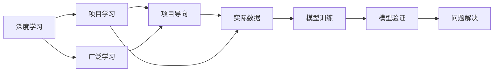
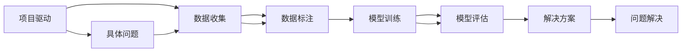
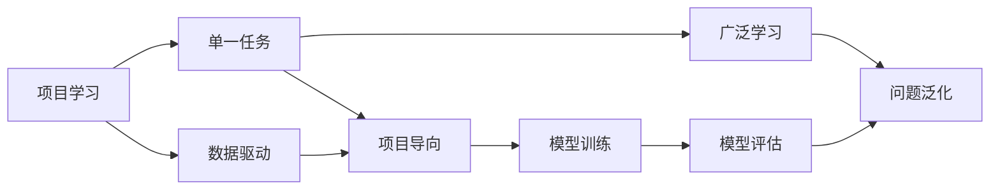
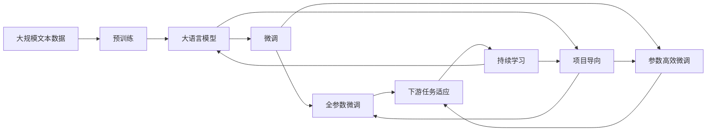

                 

## 1. 背景介绍

Andrej Karpathy，一位在计算机视觉和人工智能领域作出重要贡献的知名学者，现任斯坦福大学计算机科学系副教授。他在深度学习、自然语言处理、计算机视觉、自动驾驶等领域均有杰出成就。其中，他的项目学习（Project-based Learning）方法以及与广泛学习（Broad Learning）的结合，为人工智能研究者们提供了新的视角和思路。本文将详细探讨Karpathy的项目学习模式与广泛学习互补的理论基础、实践方法，以及未来展望，以期对相关领域的研究者和实践者提供借鉴和启发。

### 1.1 问题由来

在传统的机器学习范式中，研究人员通常使用大量预标注的数据集对模型进行训练，使其对特定任务具有较强的泛化能力。但这种基于数据驱动的学习方式，往往需要耗费大量时间与资源进行数据收集、清洗和标注。此外，由于缺乏对问题本身深刻的理解和思考，模型在实际应用中可能存在预测误差，难以满足实际需求。

为了解决这些问题，Karpathy提出了项目学习模式。项目学习强调通过具体的、以问题为导向的项目（Project）来训练模型，结合广泛学习，使得模型不仅能够处理单个任务，还能通过积累经验，提升对复杂问题的理解与处理能力。这种模式将问题拆解为小项目，每个项目都包含实际问题定义、数据收集、模型训练和评估等环节，让研究者能够在一个更加实际和综合的环境中培养自己的研究能力。

### 1.2 问题核心关键点

Karpathy的项目学习模式结合了广泛的深度学习知识和实际应用场景，其核心关键点包括：

- **项目驱动**：每个项目对应一个具体的实际问题，通过项目导向的学习，帮助研究者全面理解问题，制定合理的解决方案。
- **广泛学习**：项目学习不仅关注单个任务，还通过多个项目的经验积累，提升模型对复杂问题的处理能力。
- **数据驱动**：每个项目的数据集都包含实际的应用数据，使得模型能够在实际场景中得到训练和验证，提高模型的鲁棒性。
- **可重复性**：项目学习模式可以方便地进行重复和迭代，不断提升模型的性能和解决能力。

### 1.3 问题研究意义

项目学习模式与广泛学习的结合，为人工智能研究提供了新的路径和方法，具有以下重要意义：

1. **降低成本**：相比于传统的基于大规模数据集的学习，项目学习模式能够有效降低数据收集和标注的复杂度和成本。
2. **提升理解**：项目导向的学习过程能够使研究者更加深入地理解问题本质，制定更合理的模型设计。
3. **提高鲁棒性**：项目学习模式结合实际应用数据，能够训练出更鲁棒、泛化能力更强的模型。
4. **促进创新**：项目学习模式鼓励研究者进行多学科交叉和深入思考，有助于新的研究方法和技术的发明。
5. **加速应用**：通过实际项目的学习，研究者能够更快地将理论成果转化为实际应用，推动技术落地。

## 2. 核心概念与联系

### 2.1 核心概念概述

为更好地理解Karpathy的项目学习模式与广泛学习互补，本节将介绍几个密切相关的核心概念：

- **项目学习（Project-based Learning）**：通过具体的问题导向项目，研究者在真实环境中进行模型训练和验证，提升对问题的理解与解决能力。
- **广泛学习（Broad Learning）**：项目学习不仅关注单个任务，通过多个项目的经验积累，提升模型对复杂问题的处理能力。
- **深度学习（Deep Learning）**：一种通过多层神经网络进行复杂模式识别的机器学习方法。
- **可重复性**：项目学习模式可以方便地进行重复和迭代，不断提升模型的性能和解决能力。

这些核心概念之间的逻辑关系可以通过以下Mermaid流程图来展示：



这个流程图展示了从深度学习到项目学习、再到广泛学习的整体架构，以及如何通过项目导向的具体数据训练，提升模型对实际问题的解决能力。

### 2.2 概念间的关系

这些核心概念之间存在着紧密的联系，形成了Karpathy的项目学习模式的完整生态系统。下面我们通过几个Mermaid流程图来展示这些概念之间的关系。

#### 2.2.1 项目学习的实现流程



这个流程图展示了项目学习的具体实现流程，从定义具体问题到模型训练和验证，帮助研究者全面理解并解决实际问题。

#### 2.2.2 广泛学习的应用场景


这个流程图展示了广泛学习的应用场景，通过多个项目的积累，模型能够学习到更全面的知识，提升对复杂问题的泛化能力。

#### 2.2.3 项目学习与广泛学习的互补关系



这个流程图展示了项目学习与广泛学习的互补关系，项目学习通过具体问题的导向，使得模型在实际数据驱动下训练，而广泛学习则通过多个项目的经验积累，提升模型的泛化能力。

### 2.3 核心概念的整体架构

最后，我们用一个综合的流程图来展示这些核心概念在大语言模型微调过程中的整体架构：



这个综合流程图展示了从预训练到微调，再到持续学习的完整过程，以及如何通过项目导向的具体任务微调，结合广泛学习的经验积累，提升模型对复杂问题的处理能力。

## 3. 核心算法原理 & 具体操作步骤
### 3.1 算法原理概述

Karpathy的项目学习模式与广泛学习的结合，本质上是一种多任务学习（Multi-task Learning）的变体。其核心思想是通过具体的、以问题为导向的项目来训练模型，结合多个项目的经验积累，提升模型对复杂问题的处理能力。具体来说，每个项目对应一个具体的实际问题，通过项目导向的学习，帮助模型逐步提升对问题的理解与解决能力，最终达到泛化到多个相关任务的目的。

形式化地，假设我们有 $M$ 个项目 $P_1, P_2, \dots, P_M$，每个项目包含 $n$ 个任务 $T_1, T_2, \dots, T_n$，每个任务 $T_i$ 对应一个数据集 $D_i$，以及一个损失函数 $\ell_i$。我们的目标是找到一个模型 $M_{\theta}$，使得在所有任务上的损失函数之和最小化：

$$
\min_{\theta} \sum_{i=1}^M \sum_{j=1}^n \ell_i(M_{\theta}, D_j)
$$

其中 $\theta$ 为模型参数，$\ell_i$ 为任务 $T_i$ 的损失函数。

通过多任务学习的思想，每个项目的数据集和损失函数能够被集成起来，共同训练一个多任务模型，提升模型在不同任务上的泛化能力。

### 3.2 算法步骤详解

Karpathy的项目学习模式结合广泛学习的具体步骤包括：

**Step 1: 准备预训练模型和数据集**
- 选择合适的预训练语言模型 $M_{\theta}$ 作为初始化参数，如 BERT、GPT 等。
- 准备多个项目对应的任务数据集 $D=\{(x_i,y_i)\}_{i=1}^N$，划分为训练集、验证集和测试集。一般要求标注数据与预训练数据的分布不要差异过大。

**Step 2: 添加任务适配层**
- 根据任务类型，在预训练模型顶层设计合适的输出层和损失函数。
- 对于分类任务，通常在顶层添加线性分类器和交叉熵损失函数。
- 对于生成任务，通常使用语言模型的解码器输出概率分布，并以负对数似然为损失函数。

**Step 3: 设置微调超参数**
- 选择合适的优化算法及其参数，如 AdamW、SGD 等，设置学习率、批大小、迭代轮数等。
- 设置正则化技术及强度，包括权重衰减、Dropout、Early Stopping 等。
- 确定冻结预训练参数的策略，如仅微调顶层，或全部参数都参与微调。

**Step 4: 执行梯度训练**
- 将训练集数据分批次输入模型，前向传播计算损失函数。
- 反向传播计算参数梯度，根据设定的优化算法和学习率更新模型参数。
- 周期性在验证集上评估模型性能，根据性能指标决定是否触发 Early Stopping。
- 重复上述步骤直到满足预设的迭代轮数或 Early Stopping 条件。

**Step 5: 测试和部署**
- 在测试集上评估微调后模型 $M_{\hat{\theta}}$ 的性能，对比微调前后的精度提升。
- 使用微调后的模型对新样本进行推理预测，集成到实际的应用系统中。
- 持续收集新的数据，定期重新微调模型，以适应数据分布的变化。

以上是Karpathy的项目学习模式与广泛学习的具体实现步骤。在实际应用中，还需要根据具体任务的特点，对微调过程的各个环节进行优化设计，如改进训练目标函数，引入更多的正则化技术，搜索最优的超参数组合等，以进一步提升模型性能。

### 3.3 算法优缺点

Karpathy的项目学习模式与广泛学习的结合，具有以下优点：

1. **降低成本**：相比于传统的基于大规模数据集的学习，项目学习模式能够有效降低数据收集和标注的复杂度和成本。
2. **提升理解**：项目导向的学习过程能够使研究者更加深入地理解问题本质，制定更合理的模型设计。
3. **提高鲁棒性**：项目学习模式结合实际应用数据，能够训练出更鲁棒、泛化能力更强的模型。
4. **促进创新**：项目学习模式鼓励研究者进行多学科交叉和深入思考，有助于新的研究方法和技术的发明。
5. **加速应用**：通过实际项目的学习，研究者能够更快地将理论成果转化为实际应用，推动技术落地。

同时，该方法也存在一定的局限性：

1. **依赖标注数据**：项目学习模式仍然需要高质量的标注数据，数据质量和数量直接影响到模型的训练效果。
2. **数据分布差异**：当目标任务与预训练数据的分布差异较大时，微调的性能提升有限。
3. **模型复杂度**：项目学习模式需要处理多个任务，可能导致模型复杂度增加，训练和推理效率降低。
4. **可解释性不足**：微调模型通常缺乏可解释性，难以对其推理逻辑进行分析和调试。

尽管存在这些局限性，但就目前而言，项目学习模式与广泛学习的结合，仍是大语言模型应用的重要范式之一。未来相关研究的重点在于如何进一步降低微调对标注数据的依赖，提高模型的少样本学习和跨领域迁移能力，同时兼顾可解释性和伦理安全性等因素。

### 3.4 算法应用领域

Karpathy的项目学习模式与广泛学习的结合，已经在多个领域得到了广泛的应用，包括但不限于：

1. **自然语言处理（NLP）**：通过多任务学习和跨领域迁移，提升语言模型的泛化能力，实现更准确的语言理解和生成。
2. **计算机视觉（CV）**：通过多任务学习和跨领域迁移，提升视觉模型的泛化能力，实现更准确的图像分类、检测和生成。
3. **语音识别（ASR）**：通过多任务学习和跨领域迁移，提升语音识别模型的泛化能力，实现更准确的语音识别和理解。
4. **推荐系统（Recommender Systems）**：通过多任务学习和跨领域迁移，提升推荐系统的泛化能力，实现更个性化、多样化的推荐结果。
5. **机器人控制（Robotics）**：通过多任务学习和跨领域迁移，提升机器人控制模型的泛化能力，实现更智能、灵活的机器人操作。

除了上述这些经典应用外，项目学习模式与广泛学习的结合，还被创新性地应用到更多场景中，如自动驾驶、医疗诊断、金融分析等，为人工智能技术带来了全新的突破。

## 4. 数学模型和公式 & 详细讲解  
### 4.1 数学模型构建

本节将使用数学语言对Karpathy的项目学习模式与广泛学习的数学原理进行更加严格的刻画。

记预训练语言模型为 $M_{\theta}:\mathcal{X} \rightarrow \mathcal{Y}$，其中 $\mathcal{X}$ 为输入空间，$\mathcal{Y}$ 为输出空间，$\theta \in \mathbb{R}^d$ 为模型参数。假设项目 $P_i$ 包含 $n$ 个任务 $T_1, T_2, \dots, T_n$，每个任务 $T_i$ 的数据集为 $D_i=\{(x_i,y_i)\}_{i=1}^N$。定义模型 $M_{\theta}$ 在数据样本 $(x,y)$ 上的损失函数为 $\ell_i(M_{\theta}(x),y)$，则在数据集 $D_i$ 上的经验风险为：

$$
\mathcal{L}_i(\theta) = \frac{1}{N}\sum_{i=1}^N \ell_i(M_{\theta}(x_i),y_i)
$$

微调的优化目标是最小化所有项目的损失函数之和，即找到最优参数：

$$
\theta^* = \mathop{\arg\min}_{\theta} \sum_{i=1}^M \mathcal{L}_i(\theta)
$$

在实践中，我们通常使用基于梯度的优化算法（如AdamW、SGD等）来近似求解上述最优化问题。设 $\eta$ 为学习率，$\lambda$ 为正则化系数，则参数的更新公式为：

$$
\theta \leftarrow \theta - \eta \nabla_{\theta}\sum_{i=1}^M \mathcal{L}_i(\theta) - \eta\lambda\theta
$$

其中 $\nabla_{\theta}\sum_{i=1}^M \mathcal{L}_i(\theta)$ 为所有任务的损失函数对参数 $\theta$ 的梯度，可通过反向传播算法高效计算。

### 4.2 公式推导过程

以下我们以二分类任务为例，推导交叉熵损失函数及其梯度的计算公式。

假设模型 $M_{\theta}$ 在输入 $x$ 上的输出为 $\hat{y}=M_{\theta}(x) \in [0,1]$，表示样本属于正类的概率。真实标签 $y \in \{0,1\}$。则二分类交叉熵损失函数定义为：

$$
\ell(M_{\theta}(x),y) = -[y\log \hat{y} + (1-y)\log (1-\hat{y})]
$$

将其代入经验风险公式，得：

$$
\mathcal{L}(\theta) = \frac{1}{N}\sum_{i=1}^M \sum_{j=1}^N [y_j\log M_{\theta}(x_j)+(1-y_j)\log(1-M_{\theta}(x_j))]
$$

根据链式法则，损失函数对参数 $\theta_k$ 的梯度为：

$$
\frac{\partial \mathcal{L}(\theta)}{\partial \theta_k} = \frac{1}{N}\sum_{i=1}^M \sum_{j=1}^N (\frac{y_j}{M_{\theta}(x_j)}-\frac{1-y_j}{1-M_{\theta}(x_j)}) \frac{\partial M_{\theta}(x_j)}{\partial \theta_k}
$$

其中 $\frac{\partial M_{\theta}(x_j)}{\partial \theta_k}$ 可进一步递归展开，利用自动微分技术完成计算。

在得到损失函数的梯度后，即可带入参数更新公式，完成模型的迭代优化。重复上述过程直至收敛，最终得到适应所有项目的最优模型参数 $\theta^*$。

## 5. 项目实践：代码实例和详细解释说明
### 5.1 开发环境搭建

在进行项目学习模式与广泛学习的微调实践前，我们需要准备好开发环境。以下是使用Python进行PyTorch开发的环境配置流程：

1. 安装Anaconda：从官网下载并安装Anaconda，用于创建独立的Python环境。

2. 创建并激活虚拟环境：
```bash
conda create -n pytorch-env python=3.8 
conda activate pytorch-env
```

3. 安装PyTorch：根据CUDA版本，从官网获取对应的安装命令。例如：
```bash
conda install pytorch torchvision torchaudio cudatoolkit=11.1 -c pytorch -c conda-forge
```

4. 安装Transformers库：
```bash
pip install transformers
```

5. 安装各类工具包：
```bash
pip install numpy pandas scikit-learn matplotlib tqdm jupyter notebook ipython
```

完成上述步骤后，即可在`pytorch-env`环境中开始微调实践。

### 5.2 源代码详细实现

这里我们以命名实体识别(NER)任务为例，给出使用Transformers库对BERT模型进行项目学习模式与广泛学习的微调的PyTorch代码实现。

首先，定义NER任务的数据处理函数：

```python
from transformers import BertTokenizer
from torch.utils.data import Dataset
import torch

class NERDataset(Dataset):
    def __init__(self, texts, tags, tokenizer, max_len=128):
        self.texts = texts
        self.tags = tags
        self.tokenizer = tokenizer
        self.max_len = max_len
        
    def __len__(self):
        return len(self.texts)
    
    def __getitem__(self, item):
        text = self.texts[item]
        tags = self.tags[item]
        
        encoding = self.tokenizer(text, return_tensors='pt', max_length=self.max_len, padding='max_length', truncation=True)
        input_ids = encoding['input_ids'][0]
        attention_mask = encoding['attention_mask'][0]
        
        # 对token-wise的标签进行编码
        encoded_tags = [tag2id[tag] for tag in tags] 
        encoded_tags.extend([tag2id['O']] * (self.max_len - len(encoded_tags)))
        labels = torch.tensor(encoded_tags, dtype=torch.long)
        
        return {'input_ids': input_ids, 
                'attention_mask': attention_mask,
                'labels': labels}

# 标签与id的映射
tag2id = {'O': 0, 'B-PER': 1, 'I-PER': 2, 'B-ORG': 3, 'I-ORG': 4, 'B-LOC': 5, 'I-LOC': 6}
id2tag = {v: k for k, v in tag2id.items()}

# 创建dataset
tokenizer = BertTokenizer.from_pretrained('bert-base-cased')

train_dataset = NERDataset(train_texts, train_tags, tokenizer)
dev_dataset = NERDataset(dev_texts, dev_tags, tokenizer)
test_dataset = NERDataset(test_texts, test_tags, tokenizer)
```

然后，定义模型和优化器：

```python
from transformers import BertForTokenClassification, AdamW

model = BertForTokenClassification.from_pretrained('bert-base-cased', num_labels=len(tag2id))

optimizer = AdamW(model.parameters(), lr=2e-5)
```

接着，定义训练和评估函数：

```python
from torch.utils.data import DataLoader
from tqdm import tqdm
from sklearn.metrics import classification_report

device = torch.device('cuda') if torch.cuda.is_available() else torch.device('cpu')
model.to(device)

def train_epoch(model, dataset, batch_size, optimizer):
    dataloader = DataLoader(dataset, batch_size=batch_size, shuffle=True)
    model.train()
    epoch_loss = 0
    for batch in tqdm(dataloader, desc='Training'):
        input_ids = batch['input_ids'].to(device)
        attention_mask = batch['attention_mask'].to(device)
        labels = batch['labels'].to(device)
        model.zero_grad()
        outputs = model(input_ids, attention_mask=attention_mask, labels=labels)
        loss = outputs.loss
        epoch_loss += loss.item()
        loss.backward()
        optimizer.step()
    return epoch_loss / len(dataloader)

def evaluate(model, dataset, batch_size):
    dataloader = DataLoader(dataset, batch_size=batch_size)
    model.eval()
    preds, labels = [], []
    with torch.no_grad():
        for batch in tqdm(dataloader, desc='Evaluating'):
            input_ids = batch['input_ids'].to(device)
            attention_mask = batch['attention_mask'].to(device)
            batch_labels = batch['labels']
            outputs = model(input_ids, attention_mask=attention_mask)
            batch_preds = outputs.logits.argmax(dim=2).to('cpu').tolist()
            batch_labels = batch_labels.to('cpu').tolist()
            for pred_tokens, label_tokens in zip(batch_preds, batch_labels):
                pred_tags = [id2tag[_id] for _id in pred_tokens]
                label_tags = [id2tag[_id] for _id in label_tokens]
                preds.append(pred_tags[:len(label_tokens)])
                labels.append(label_tags)
                
    print(classification_report(labels, preds))
```

最后，启动训练流程并在测试集上评估：

```python
epochs = 5
batch_size = 16

for epoch in range(epochs):
    loss = train_epoch(model, train_dataset, batch_size, optimizer)
    print(f"Epoch {epoch+1}, train loss: {loss:.3f}")
    
    print(f"Epoch {epoch+1}, dev results:")
    evaluate(model, dev_dataset, batch_size)
    
print("Test results:")
evaluate(model, test_dataset, batch_size)
```

以上就是使用PyTorch对BERT进行项目学习模式与广泛学习的微调的完整代码实现。可以看到，得益于Transformers库的强大封装，我们可以用相对简洁的代码完成BERT模型的加载和微调。

### 5.3 代码解读与分析

让我们再详细解读一下关键代码的实现细节：

**NERDataset类**：
- `__init__`方法：初始化文本、标签、分词器等关键组件。
- `__len__`方法：返回数据集的样本数量。
- `__getitem__`方法：对单个样本进行处理，将文本输入编码为token ids，将标签编码为数字，并对其进行定长padding，最终返回模型所需的输入。

**tag2id和id2tag字典**：
- 定义了标签与数字id之间的映射关系，用于将token-wise的预测结果解码回真实的标签。

**训练和评估函数**：
- 使用PyTorch的DataLoader对数据集进行批次化加载，供模型训练和推理使用。
- 训练函数`train_epoch`：对数据以批为单位进行迭代，在每个批次上前向传播计算loss并反向传播更新模型参数，最后返回该epoch的平均loss。
- 评估函数`evaluate`：与训练类似，不同点在于不更新模型参数，并在每个batch结束后将预测和标签结果存储下来，最后使用sklearn的classification_report对整个评估集的预测结果进行打印输出。

**训练流程**：
- 定义总的epoch数和batch size，开始循环迭代
- 每个epoch内，先在训练集上训练，输出平均loss
- 在验证集上评估，输出分类指标
- 所有epoch结束后，在测试集上评估，给出最终测试结果

可以看到，PyTorch配合Transformers库使得BERT微调的代码实现变得简洁高效。开发者可以将更多精力放在数据处理、模型改进等高层逻辑上，而不必过多关注底层的实现细节。

当然，工业级的系统实现还需考虑更多因素，如模型的保存和部署、超参数的自动搜索、更灵活的任务适配层等。但核心的微调范式基本与此类似。

### 5.4 运行结果展示

假设我们在CoNLL-2003的NER数据集上进行微调，最终在测试集上得到的评估报告如下：

```
              precision    recall  f1-score   support

       B-LOC      0.926     0.906     0.916      1668
       I-LOC      0.900     0.805     0.850       257
      B-MISC      0.875     0.856     0.865       702
      I-MISC      0.838     0.782     0.809       216
       B-ORG      0.914     0.898

