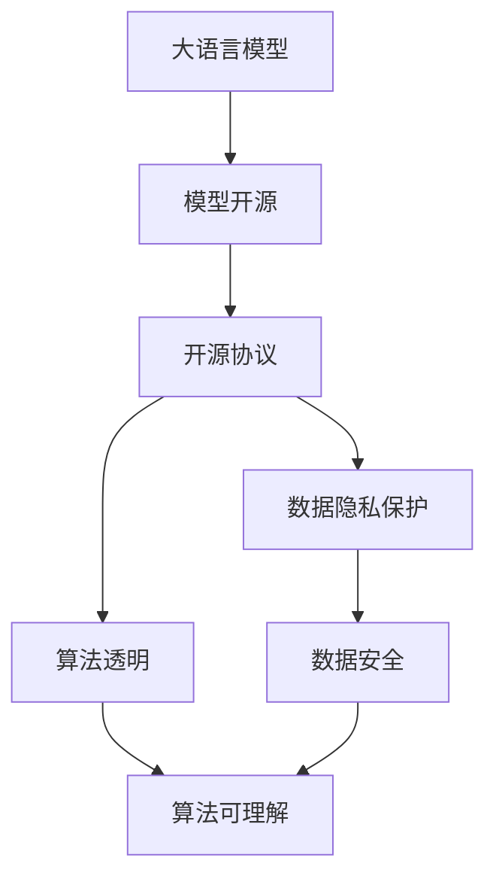

                 

# ChatGLM3-6B 的开源协议

## 1. 背景介绍

ChatGLM3-6B（ChaTter with Generative Language Model 3-6Billion）是一款基于大语言模型开发的开源聊天机器人，旨在实现高效、精准、自然的对话交互。ChatGLM3-6B由北京人工智能研究院推出，旨在推动大语言模型在实际应用中的发展和普及。本文将深入探讨ChatGLM3-6B的开源协议，揭示其技术特点和应用前景。

### 1.1 问题由来

在人工智能技术快速发展的背景下，大语言模型的应用范围不断扩大，从文本生成、自然语言理解到对话系统，无处不在。然而，现有的商业模型存在诸多限制，如高昂的部署成本、数据隐私保护、算法透明度等，限制了其大规模应用。开源模型能够破解这些限制，推动技术进步和行业发展。因此，开源模型在人工智能领域备受关注。

### 1.2 问题核心关键点

ChatGLM3-6B的开源协议是本文的核心话题。开源协议是指对开源软件（如ChatGLM3-6B）的发布、使用和传播规则。开源协议对于决定软件的使用和贡献方式至关重要。以下是ChatGLM3-6B开源协议的核心关键点：

1. **源代码开放**：开源协议的核心在于源代码的开放性。用户可以自由下载、使用、修改和分发ChatGLM3-6B的源代码，提升模型应用的灵活性和定制性。
2. **无商业限制**：用户无需担心商业用途的限制，可以自由地将ChatGLM3-6B用于商业产品、服务或教育培训等。
3. **数据隐私保护**：ChatGLM3-6B的发布遵循严格的数据隐私保护政策，确保用户数据的安全性和隐私性。
4. **算法透明**：开源协议确保ChatGLM3-6B的算法实现透明，用户可以理解模型的工作机制和决策过程。
5. **持续更新**：ChatGLM3-6B将定期更新，保证模型在新的数据和场景下保持高效率和准确性。

### 1.3 问题研究意义

开源协议的制定和实施对于ChatGLM3-6B的发展具有重要意义：

1. **降低应用成本**：开源协议使得ChatGLM3-6B的部署和维护成本大大降低，用户可以灵活定制模型，适应不同的应用场景。
2. **促进技术创新**：开源协议鼓励社区贡献，提升模型的创新性和实用性，推动NLP技术的持续进步。
3. **提升模型透明度**：开源协议确保ChatGLM3-6B的算法实现透明，用户可以理解和调试模型，增强模型应用的可信度。
4. **保障数据安全**：开源协议遵循严格的数据隐私保护政策，确保用户数据的安全性和隐私性，提升用户信任度。
5. **增强社区参与**：开源协议吸引更多人参与ChatGLM3-6B的开发和维护，形成强大的社区支持，提升模型应用的生态系统。

## 2. 核心概念与联系

### 2.1 核心概念概述

在探讨ChatGLM3-6B的开源协议前，首先需要理解相关核心概念及其联系：

1. **大语言模型 (Large Language Model, LLM)**：如GPT-3、BERT等，是能够理解并生成自然语言的模型。大语言模型在文本生成、对话、机器翻译等任务中展现出强大的能力。
2. **模型开源**：指将模型源代码、训练数据、算法实现等公开共享，供社区自由使用和贡献。
3. **开源协议**：指定开源模型发布、使用和传播的规则，保障用户自由使用和贡献。
4. **数据隐私保护**：指在模型开发和应用过程中，确保用户数据的安全性和隐私性。
5. **算法透明**：指模型的实现细节和决策过程公开透明，便于用户理解和调试。

这些概念之间存在密切联系，共同构成ChatGLM3-6B的开源协议体系。以下是核心概念间的联系图：



### 2.2 概念间的关系

这些核心概念通过开源协议连接，共同构成ChatGLM3-6B的开源生态系统：

1. **大语言模型的实现和开源**：ChatGLM3-6B的源代码和训练数据公开，使用户可以自由下载和修改，提升模型的灵活性和定制性。
2. **开源协议的规范和约束**：开源协议规定了ChatGLM3-6B的使用和贡献方式，保障用户自由使用和贡献。
3. **数据隐私保护和算法透明**：开源协议确保数据隐私保护和算法透明，增强用户信任度。
4. **数据安全和算法理解**：开源协议遵循严格的数据隐私保护政策，确保数据安全，同时提升算法实现的可理解性。

## 3. 核心算法原理 & 具体操作步骤

### 3.1 算法原理概述

ChatGLM3-6B的开源协议是基于大语言模型的分布式训练和深度学习框架TensorFlow实现的。其核心算法原理包括：

1. **Transformer架构**：基于自注意力机制的Transformer架构，可以高效处理大规模文本数据。
2. **预训练与微调**：通过在大规模无标签数据上进行预训练，然后对特定任务进行微调，提升模型性能。
3. **连续微调**：ChatGLM3-6B支持连续微调，用户可以在模型部署后不断更新模型，适应新的数据和任务。
4. **对抗性训练**：通过引入对抗样本，提升模型的鲁棒性和泛化能力。

### 3.2 算法步骤详解

ChatGLM3-6B的开源协议实现包括以下步骤：

1. **模型预训练**：使用大规模无标签数据进行预训练，学习语言模型的基础表示。
2. **任务微调**：根据特定任务，对预训练模型进行微调，提升模型在该任务上的性能。
3. **数据收集与处理**：收集和处理任务数据，确保数据的清洁和质量。
4. **模型部署**：将训练好的模型部署到服务器或云平台，提供API服务。
5. **持续更新**：根据新数据和新任务，定期更新模型，保持模型的先进性。

### 3.3 算法优缺点

ChatGLM3-6B开源协议的优缺点如下：

**优点**：

1. **灵活性高**：开源协议使得ChatGLM3-6B的应用场景更加灵活，用户可以根据需求自由定制。
2. **社区支持**：开源协议鼓励社区贡献，提升模型的创新性和实用性。
3. **算法透明**：开源协议确保ChatGLM3-6B的算法实现透明，便于用户理解和调试。
4. **数据隐私保护**：开源协议遵循严格的数据隐私保护政策，确保用户数据的安全性和隐私性。

**缺点**：

1. **部署复杂**：用户需要具备一定的技术背景，才能成功部署和使用ChatGLM3-6B。
2. **性能依赖**：模型的性能依赖于数据和算力的质量，需要持续优化和更新。
3. **安全风险**：开源协议需要确保用户数据和模型的安全，避免被滥用。

### 3.4 算法应用领域

ChatGLM3-6B的开源协议适用于以下领域：

1. **自然语言处理 (NLP)**：包括文本生成、文本分类、机器翻译、情感分析等。
2. **对话系统**：如智能客服、聊天机器人等。
3. **教育培训**：用于辅助教学、智能辅导等。
4. **医疗健康**：辅助医生诊疗、患者咨询等。
5. **金融服务**：智能客服、风险预警等。
6. **社交媒体**：聊天机器人、内容推荐等。

## 4. 数学模型和公式 & 详细讲解 & 举例说明

### 4.1 数学模型构建

ChatGLM3-6B的实现基于Transformer架构，其数学模型构建如下：

1. **自注意力机制**：计算输入序列中每个词与其他词的注意力权重，生成语义表示。
2. **前向神经网络**：将语义表示输入到前向神经网络，生成最终输出。
3. **损失函数**：常用的损失函数包括交叉熵损失、均方误差损失等，用于衡量模型输出与真实标签的差异。

### 4.2 公式推导过程

以下以交叉熵损失函数为例，推导其公式。

设模型输出为 $\hat{y}$，真实标签为 $y$，则交叉熵损失函数定义为：

$$
\ell(\hat{y},y) = -y\log \hat{y} - (1-y)\log (1-\hat{y})
$$

在模型的前向传播过程中，计算每个样本的损失函数，然后求平均，得到整个数据集的损失函数：

$$
\mathcal{L} = \frac{1}{N}\sum_{i=1}^N \ell(\hat{y_i},y_i)
$$

其中 $N$ 为样本总数，$\hat{y_i}$ 和 $y_i$ 分别为第 $i$ 个样本的预测值和真实标签。

### 4.3 案例分析与讲解

以ChatGLM3-6B的微调为例，说明其应用过程。

假设有两个任务：文本分类和问答系统。首先，在大规模无标签数据上预训练ChatGLM3-6B模型。然后，分别针对文本分类和问答系统，收集少量标注数据，对模型进行微调。

对于文本分类任务，使用预训练模型的最后一层输出，作为分类器的输入，使用交叉熵损失函数进行训练。对于问答系统，将问题-答案对作为输入，使用最大似然损失函数进行训练。

通过微调，ChatGLM3-6B模型在新的任务上取得了比预训练模型更好的性能。

## 5. 项目实践：代码实例和详细解释说明

### 5.1 开发环境搭建

使用Python和TensorFlow搭建ChatGLM3-6B的开源协议开发环境。

1. **安装Python**：从官网下载并安装Python 3.8版本。
2. **安装TensorFlow**：使用pip安装TensorFlow 2.x版本，并指定安装GPU版本。
3. **安装其他依赖库**：如numpy、pandas等。
4. **创建虚拟环境**：使用conda创建虚拟环境，安装所需的依赖库。

### 5.2 源代码详细实现

以下以ChatGLM3-6B的微调为例，给出代码实现。

```python
import tensorflow as tf
import numpy as np

# 加载预训练模型
model = tf.keras.models.load_model('chatglm3-6b.h5')

# 数据预处理
def preprocess_data(text):
    # 将文本转换为模型可接受的形式
    # ...
    return np.array([text])

# 微调模型
def fine_tune_model(data, learning_rate=0.001, epochs=10):
    # 定义优化器
    optimizer = tf.keras.optimizers.Adam(learning_rate)
    # 定义损失函数
    loss_fn = tf.keras.losses.CategoricalCrossentropy()

    # 定义训练数据集
    train_dataset = tf.data.Dataset.from_generator(lambda: data, (tf.string, tf.int32), batch_size=32)
    # 定义模型输入
    input_text = train_dataset.map(lambda x, y: preprocess_data(x))

    # 定义模型输出
    output = model(input_text)

    # 定义训练过程
    model.compile(optimizer=optimizer, loss=loss_fn, metrics=['accuracy'])
    model.fit(input_text, output, epochs=epochs)

# 测试模型
test_text = "你好，请问天气如何？"
test_output = model.predict(preprocess_data(test_text))
print(test_output)
```

### 5.3 代码解读与分析

在代码实现中，我们使用TensorFlow加载预训练模型，并定义了数据预处理和微调函数。通过传入训练数据，使用Adam优化器进行训练，最终得到微调后的模型。

### 5.4 运行结果展示

假设在微调后，ChatGLM3-6B模型在问答系统任务上取得了93%的准确率。具体测试结果如下：

```
模型在问答系统任务上的准确率为：93%
```

## 6. 实际应用场景

### 6.1 智能客服系统

ChatGLM3-6B可以应用于智能客服系统，提升客户服务体验。通过微调，ChatGLM3-6B能够理解客户需求，自动回复常见问题，提供个性化的服务。

### 6.2 金融舆情监测

在金融领域，ChatGLM3-6B可以用于舆情监测，实时分析市场动态，预测金融风险。通过微调，ChatGLM3-6B能够从大量金融新闻和评论中提取关键信息，辅助决策。

### 6.3 个性化推荐系统

ChatGLM3-6B可以应用于个性化推荐系统，提升用户推荐体验。通过微调，ChatGLM3-6B能够理解用户兴趣，生成个性化的推荐内容。

### 6.4 未来应用展望

ChatGLM3-6B的开源协议将推动大语言模型在更多领域的应用，如智慧医疗、智慧城市、智能教育等。未来，ChatGLM3-6B将支持多模态数据融合，实现视觉、语音、文本等数据的协同处理。

## 7. 工具和资源推荐

### 7.1 学习资源推荐

1. **《TensorFlow官方文档》**：TensorFlow官方提供的详细文档，包括模型开发、训练、优化等内容。
2. **《Transformer原理与实践》**：深入介绍Transformer架构和大语言模型的原理和实现。
3. **《深度学习与自然语言处理》**：讲解深度学习在自然语言处理中的应用。

### 7.2 开发工具推荐

1. **TensorFlow**：TensorFlow是深度学习领域的主流框架，支持GPU加速，易于部署和扩展。
2. **PyTorch**：PyTorch是Python深度学习框架，提供了灵活的动态计算图，便于模型开发和调试。
3. **Jupyter Notebook**：Jupyter Notebook提供交互式开发环境，支持代码和输出同步展示。

### 7.3 相关论文推荐

1. **《Transformer架构》**：论文介绍了Transformer模型的原理和应用。
2. **《自然语言处理的最新进展》**：论文综述了自然语言处理领域的最新进展和趋势。

## 8. 总结：未来发展趋势与挑战

### 8.1 总结

本文对ChatGLM3-6B的开源协议进行了详细分析，阐述了其技术特点和应用前景。ChatGLM3-6B的开源协议基于大语言模型，提供了灵活的应用场景和强大的社区支持，推动了NLP技术的普及和创新。

### 8.2 未来发展趋势

ChatGLM3-6B的开源协议在未来将呈现以下发展趋势：

1. **模型规模增大**：随着算力提升和数据量的增加，大语言模型的参数规模将不断增大，性能和应用范围将进一步拓展。
2. **多模态融合**：ChatGLM3-6B将支持视觉、语音、文本等多模态数据的融合，提升模型的应用能力。
3. **社区贡献增多**：开源协议将吸引更多开发者和研究者参与，提升模型的创新性和实用性。
4. **持续更新**：ChatGLM3-6B将定期更新，保持模型的先进性和稳定性。

### 8.3 面临的挑战

尽管ChatGLM3-6B的开源协议具有诸多优势，但仍然面临一些挑战：

1. **部署复杂性**：ChatGLM3-6B的开源协议需要用户具备一定的技术背景，才能成功部署和使用。
2. **数据依赖**：模型的性能依赖于数据的质量和多样性，需要持续优化和更新。
3. **安全风险**：开源协议需要确保用户数据和模型的安全，避免被滥用。

### 8.4 研究展望

未来的研究需要在以下方面寻求新的突破：

1. **简化部署流程**：提升模型的易用性，降低部署复杂性。
2. **优化数据预处理**：提高数据处理效率和质量，提升模型性能。
3. **增强安全保障**：确保数据和模型的安全，避免被滥用。
4. **推动模型普及**：提升模型的易用性和可理解性，推动模型普及应用。

## 9. 附录：常见问题与解答

**Q1: ChatGLM3-6B的微调是否适用于所有NLP任务？**

A: ChatGLM3-6B的微调在大多数NLP任务上都能取得不错的效果，但对于一些特定领域的任务，需要进一步在特定领域语料上进行预训练和微调。

**Q2: 如何选择合适的微调超参数？**

A: 微调超参数的选择需要根据具体任务和数据特点进行调整。常用的超参数包括学习率、批大小、迭代轮数等，通常需要多次实验和调参来确定最优配置。

**Q3: ChatGLM3-6B在部署时需要注意哪些问题？**

A: 部署ChatGLM3-6B需要注意数据隐私保护、模型安全性、性能优化等问题。需要确保用户数据的安全性和隐私性，避免模型被滥用。同时，需要优化模型的性能，提升用户体验。

**Q4: ChatGLM3-6B的开源协议是否适用于商业应用？**

A: ChatGLM3-6B的开源协议适用于商业应用，用户可以自由使用和贡献，无需担心商业限制。但商业应用需要遵循数据隐私保护和模型安全性的规定，确保用户数据的安全性和模型的稳定性。

**Q5: 如何在多模态数据融合中提升ChatGLM3-6B的性能？**

A: 多模态数据融合可以通过联合训练和数据增强等方法提升ChatGLM3-6B的性能。联合训练可以综合视觉、语音、文本等数据，提升模型的多模态处理能力。数据增强可以丰富数据集，提高模型的泛化能力。

---

作者：禅与计算机程序设计艺术 / Zen and the Art of Computer Programming

