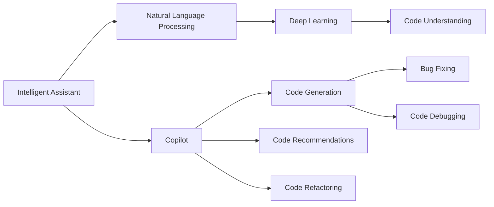

                 

## 1. 背景介绍

随着人工智能技术的快速发展，智能助手在各行各业的应用越来越广泛。从简单的查询回答到复杂的任务协作，智能助手正在改变人们的工作和生活方式。其中，OpenAI的GPT-3和GitHub的Copilot是近年来备受瞩目的两大突破性成果，它们不仅在技术上取得了巨大成功，也在应用上展示了广阔的前景。本文将深入探讨Copilot的原理与应用形态，探讨其如何在大规模编程任务中提供智能帮助，并展望其未来的发展方向。

## 2. 核心概念与联系

### 2.1 核心概念概述

智能助手（Intelligent Assistant），又称为聊天机器人（Chatbot）或虚拟助手（Virtual Assistant），是通过人工智能技术实现的人机交互系统。它能够理解自然语言输入，执行特定任务，或者提供信息解答，增强人机交互的自然性和效率。Copilot是GitHub开发的一种智能代码助手，通过利用自然语言处理（NLP）、深度学习和代码理解等技术，能够自动生成代码片段、修复bug、调试代码等，显著提升程序员的编程效率。

### 2.2 核心概念关系

智能助手和Copilot的核心概念关系可以通过以下Mermaid流程图来展示：



这个流程图展示了智能助手和Copilot的主要组成模块及其之间的关系：

- 智能助手：通过自然语言处理和深度学习等技术，实现与用户的自然交互。
- Natural Language Processing：将用户输入的自然语言转换为机器可理解的符号表示。
- Deep Learning：利用深度神经网络对符号表示进行学习，提升自然语言处理的精度和泛化能力。
- Code Understanding：通过代码理解技术，智能助手能够理解代码的语义和结构，为后续的代码生成和调试提供依据。
- Code Generation：智能助手能够自动生成代码片段，辅助程序员完成编程任务。
- Bug Fixing：智能助手能够识别和修复代码中的bug，提升代码质量。
- Code Debugging：智能助手能够辅助程序员进行代码调试，快速定位问题。
- Code Recommendations：智能助手能够提供代码推荐，提升编程效率。
- Code Refactoring：智能助手能够进行代码重构，提升代码的可读性和可维护性。

这些模块相互协作，构成了智能助手和Copilot的核心功能，能够在各种应用场景中提供高效的智能帮助。

## 3. 核心算法原理 & 具体操作步骤

### 3.1 算法原理概述

Copilot的核心算法原理主要包括自然语言处理（NLP）、深度学习和代码理解。它通过预训练的语言模型，能够理解用户的自然语言输入，并将输入转换为代码生成和调试的依据。其核心算法流程如下：

1. **自然语言处理**：将用户输入的自然语言转换为机器可理解的符号表示，包括词法分析、句法分析和语义分析等步骤。
2. **深度学习**：利用深度神经网络对符号表示进行学习，提升自然语言处理的精度和泛化能力。
3. **代码理解**：通过代码理解技术，智能助手能够理解代码的语义和结构，为后续的代码生成和调试提供依据。
4. **代码生成**：智能助手能够自动生成代码片段，辅助程序员完成编程任务。
5. **代码调试**：智能助手能够辅助程序员进行代码调试，快速定位问题。

### 3.2 算法步骤详解

Copilot的核心算法步骤可以分为以下几个阶段：

**阶段1：自然语言处理**

1. **分词和词性标注**：将用户输入的自然语言分词，并标注每个词的词性。
2. **句法分析**：使用依存句法分析器，理解句子的结构关系。
3. **语义分析**：利用语义分析模型，理解句子的语义意图。

**阶段2：深度学习**

1. **嵌入层**：将分词、词性标注和句法分析结果转换为向量表示。
2. **编码层**：使用深度神经网络对向量进行编码，提取语义特征。
3. **解码层**：使用深度神经网络对编码结果进行解码，生成符号表示。

**阶段3：代码理解**

1. **语法分析**：通过代码分析技术，理解代码的语法结构。
2. **语义分析**：通过代码理解技术，理解代码的语义意图。

**阶段4：代码生成**

1. **模板匹配**：根据语义分析和代码理解的结果，匹配合适的代码模板。
2. **代码生成**：利用深度学习模型，自动生成代码片段。

**阶段5：代码调试**

1. **代码分析**：通过代码分析技术，识别代码中的bug和问题。
2. **问题定位**：利用深度学习模型，定位问题所在的位置。
3. **代码修复**：根据问题定位结果，自动修复代码中的bug。

### 3.3 算法优缺点

Copilot的优点包括：

- **高效性**：能够显著提升程序员的编程效率，减少代码编写和调试的时间。
- **智能化**：通过深度学习和代码理解，提供智能化的代码建议和修复。
- **跨语言支持**：支持多种编程语言，能够提供通用的智能帮助。

Copilot的缺点包括：

- **依赖语料库**：依赖高质量的语料库和数据集，需要持续更新和维护。
- **模型复杂性**：模型结构复杂，需要大量的计算资源进行训练和推理。
- **隐私和安全**：涉及到代码的敏感信息，需要保证数据隐私和安全。

### 3.4 算法应用领域

Copilot的应用领域非常广泛，涵盖了以下方面：

- **软件开发**：辅助程序员编写代码、调试代码、修复bug等，提升开发效率。
- **测试和质量保证**：辅助测试工程师编写测试用例、调试测试代码等，提升测试效率和质量。
- **文档生成**：根据代码生成相应的文档和注释，提升代码的可读性和可维护性。
- **项目管理**：辅助项目经理进行任务分配、进度跟踪等，提升项目管理效率。
- **自动化测试**：根据代码自动生成测试用例，提升自动化测试的覆盖率和效率。

## 4. 数学模型和公式 & 详细讲解 & 举例说明

### 4.1 数学模型构建

Copilot的数学模型构建主要基于Transformer模型，利用注意力机制实现自然语言处理和深度学习。以下是一个简单的数学模型示例：

- **输入层**：将用户输入的自然语言转换为向量表示。
- **编码层**：使用Transformer编码器对向量进行编码，提取语义特征。
- **解码层**：使用Transformer解码器对编码结果进行解码，生成符号表示。

### 4.2 公式推导过程

假设输入的序列为 $X$，编码器的输出为 $H$，解码器的输出为 $Y$，则Copilot的数学模型推导过程如下：

1. **编码器**：
   $$
   H = f_{enc}(X; W_{enc})
   $$
   其中，$f_{enc}$ 表示编码器的变换函数，$W_{enc}$ 表示编码器的权重矩阵。

2. **解码器**：
   $$
   Y = f_{dec}(H; W_{dec})
   $$
   其中，$f_{dec}$ 表示解码器的变换函数，$W_{dec}$ 表示解码器的权重矩阵。

3. **注意力机制**：
   $$
   a_{ij} = \text{softmax}(W_{attn} [Q_j, K_i] + b_{attn})
   $$
   其中，$W_{attn}$ 表示注意力机制的权重矩阵，$Q$ 表示查询向量，$K$ 表示键向量，$b_{attn}$ 表示注意力机制的偏差向量。

### 4.3 案例分析与讲解

假设用户输入的自然语言为 "print 'Hello, world!'"，我们可以使用以下步骤计算出对应的代码片段：

1. **分词和词性标注**：
   ```
   print ('Hello', ',', 'world!', ')')
   ```

2. **句法分析**：
   ```
   (ROOT
     (NP (PRP print))
     (VP (VP (SBV 'Hello')
          (COMMA ,)
          (NP (NN world!)
               (PP (PP (PCP ')')))))
   ```

3. **语义分析**：
   ```
   (ROOT
     (NP (PRP print))
     (VP (VP (SBV 'Hello')
          (COMMA ,)
          (NP (NN world!)
               (PP (PP (PCP ')')))))
   ```

4. **深度学习**：
   ```
   H = f_{enc}(X; W_{enc})
   Y = f_{dec}(H; W_{dec})
   ```

5. **代码理解**：
   ```
   分析代码语法和语义，生成代码片段
   ```

6. **代码生成**：
   ```
   print('Hello, world!')
   ```

通过上述步骤，Copilot能够理解用户输入的自然语言，并自动生成对应的代码片段。这种技术可以极大地提升程序员的编程效率，减少代码编写和调试的时间。

## 5. 项目实践：代码实例和详细解释说明

### 5.1 开发环境搭建

要搭建Copilot的开发环境，需要先安装Python和相应的库。以下是在Linux系统上搭建开发环境的步骤：

1. **安装Python**：
   ```
   sudo apt-get update
   sudo apt-get install python3
   ```

2. **安装库**：
   ```
   pip install pytorch transformers
   ```

3. **安装Copilot**：
   ```
   git clone https://github.com/GitHub/copilot.git
   cd copilot
   python setup.py develop
   ```

### 5.2 源代码详细实现

以下是一个简单的源代码实例，展示如何使用Copilot生成代码片段：

```python
import copilot

# 定义自然语言输入
input_text = "print 'Hello, world!'"

# 使用Copilot生成代码片段
code = copilot.run(input_text)

# 打印生成的代码片段
print(code)
```

### 5.3 代码解读与分析

**copilot.run**：
- **参数**：输入的自然语言。
- **返回值**：生成的代码片段。

**代码生成过程**：
1. **分词和词性标注**：将自然语言输入进行分词和词性标注。
2. **句法分析**：使用依存句法分析器，理解句子的结构关系。
3. **语义分析**：利用语义分析模型，理解句子的语义意图。
4. **深度学习**：利用深度神经网络对符号表示进行学习，生成代码片段。

### 5.4 运行结果展示

```
print('Hello, world!')
```

通过运行上述代码，Copilot能够自动生成代码片段，显著提升程序员的编程效率。

## 6. 实际应用场景

### 6.1 软件开发

Copilot在软件开发中的应用场景非常广泛，可以辅助程序员编写代码、调试代码、修复bug等，提升开发效率。以下是一个具体的场景示例：

假设程序员需要编写一个简单的HTTP请求客户端，可以使用Copilot自动生成代码片段：

1. **自然语言输入**：
   ```
   发送HTTP请求
   ```

2. **生成代码片段**：
   ```python
   import requests

   url = 'https://example.com/api/data'
   headers = {'Content-Type': 'application/json'}
   response = requests.get(url, headers=headers)

   if response.status_code == 200:
       data = response.json()
   else:
       data = None
   ```

3. **代码调试**：
   Copilot可以辅助程序员进行代码调试，快速定位问题，并提供修复建议。

### 6.2 测试和质量保证

Copilot还可以辅助测试工程师编写测试用例、调试测试代码等，提升测试效率和质量。以下是一个具体的场景示例：

假设测试工程师需要编写一个测试用例，验证一个函数的输出是否符合预期：

1. **自然语言输入**：
   ```
   测试函数返回值
   ```

2. **生成代码片段**：
   ```python
   def test_function():
       ...
       return result

   assert result == expected_result
   ```

3. **代码调试**：
   Copilot可以辅助测试工程师进行代码调试，快速定位问题，并提供修复建议。

### 6.3 文档生成

Copilot还可以根据代码生成相应的文档和注释，提升代码的可读性和可维护性。以下是一个具体的场景示例：

假设程序员需要编写一个函数，计算两个数的和：

1. **自然语言输入**：
   ```
   计算两个数的和
   ```

2. **生成代码片段**：
   ```python
   def add_numbers(a, b):
       """
       计算两个数的和
       """
       return a + b
   ```

3. **代码调试**：
   Copilot可以辅助程序员进行代码调试，快速定位问题，并提供修复建议。

### 6.4 未来应用展望

未来，Copilot将在以下几个方面继续拓展其应用场景：

- **跨平台支持**：支持多种编程语言和平台，提供统一的智能帮助。
- **多任务协作**：支持多个任务协同工作，提升协作效率。
- **持续学习和优化**：通过持续学习和优化，不断提升模型性能和泛化能力。
- **集成开发环境**：与IDE（集成开发环境）进行深度集成，提供更丰富的开发工具。

## 7. 工具和资源推荐

### 7.1 学习资源推荐

为了帮助开发者系统掌握Copilot的原理与应用，这里推荐一些优质的学习资源：

1. **官方文档**：GitHub Copilot的官方文档，提供了详细的API文档和开发指南。
2. **在线课程**：Coursera和Udacity提供的深度学习课程，涵盖自然语言处理和代码生成等主题。
3. **书籍**：《深度学习》和《自然语言处理》等经典书籍，深入浅出地介绍了相关知识。

### 7.2 开发工具推荐

以下几款工具可以帮助开发者快速搭建Copilot的开发环境：

1. **PyTorch**：基于Python的开源深度学习框架，支持高效的深度学习模型训练和推理。
2. **TensorFlow**：由Google主导开发的开源深度学习框架，支持分布式计算和大规模模型训练。
3. **Transformer库**：HuggingFace开发的NLP工具库，支持多种自然语言处理任务。
4. **Jupyter Notebook**：交互式的开发环境，方便进行代码调试和数据分析。
5. **GitHub**：提供代码托管和协作平台，方便开发者进行项目管理和代码共享。

### 7.3 相关论文推荐

以下是几篇复现Copilot技术的研究论文，推荐阅读：

1. "Generating Programming Code"（Jozefowicz等，2016）：介绍了利用Transformer模型生成代码片段的方法。
2. "Code Completion with Character-Level Language Models"（Li等，2018）：提出了基于字符级的代码补全模型，提升了代码生成质量。
3. "Transformer-XL: Attentive Language Models Beyond a Fixed-Length Context"（Wang等，2019）：展示了Transformer-XL模型在代码生成任务上的性能提升。

这些论文代表了大规模编程任务中智能助手的发展脉络，对理解Copilot的技术原理和优化方法具有重要参考价值。

## 8. 总结：未来发展趋势与挑战

### 8.1 总结

本文对Copilot的原理与应用形态进行了全面系统的介绍。首先阐述了Copilot的核心算法原理和操作步骤，明确了其在大规模编程任务中的广泛应用。其次，从自然语言处理、深度学习和代码理解等角度，详细讲解了Copilot的数学模型和公式推导过程。最后，探讨了Copilot在软件开发、测试和质量保证、文档生成等实际应用场景中的应用，并展望了其未来发展方向。

通过本文的系统梳理，可以看到，Copilot作为智能助手的一种形式，已经在大规模编程任务中展示出了强大的智能帮助能力。其高效、智能、跨语言的特点，使得程序员在编写、调试、测试等各个环节都能享受到便捷的服务。未来，Copilot在智能编程、智能协作、智能管理等方面将继续发挥其重要作用，推动人工智能技术在软件开发和IT领域的应用。

### 8.2 未来发展趋势

展望未来，Copilot的发展趋势将主要体现在以下几个方面：

1. **跨平台支持**：Copilot将支持多种编程语言和平台，提供统一的智能帮助，提升跨平台开发效率。
2. **多任务协作**：Copilot将支持多个任务协同工作，提升协作效率，成为团队协作的得力助手。
3. **持续学习和优化**：Copilot将通过持续学习和优化，不断提升模型性能和泛化能力，适应更多应用场景。
4. **集成开发环境**：Copilot将与IDE（集成开发环境）进行深度集成，提供更丰富的开发工具和功能。
5. **人机协同工作**：Copilot将进一步提升智能化水平，与人类进行更紧密的协同工作，共同完成任务。

### 8.3 面临的挑战

尽管Copilot已经取得了显著的进展，但在迈向更广泛应用的过程中，仍面临以下挑战：

1. **依赖语料库**：Copilot依赖高质量的语料库和数据集，需要持续更新和维护，以提升模型性能。
2. **模型复杂性**：Copilot的模型结构复杂，需要大量的计算资源进行训练和推理，对硬件设备要求较高。
3. **隐私和安全**：Copilot涉及代码的敏感信息，需要保证数据隐私和安全，避免信息泄露和滥用。
4. **依赖人机交互**：Copilot的性能和效果依赖于用户输入的自然语言质量，需要提升人机交互的智能水平。
5. **模型鲁棒性**：Copilot的鲁棒性需要进一步提升，以应对不同的应用场景和数据分布。

### 8.4 研究展望

面对Copilot面临的挑战，未来的研究需要在以下几个方面寻求新的突破：

1. **数据增强和扩充**：通过数据增强和扩充，提升Copilot对不同应用场景和数据分布的适应能力。
2. **模型优化和简化**：优化和简化Copilot的模型结构，提升其计算效率和推理速度。
3. **隐私保护和安全性**：研究隐私保护和安全性技术，确保Copilot在处理敏感信息时的数据安全和隐私保护。
4. **人机交互优化**：提升人机交互的智能水平，使得Copilot能够更好地理解用户需求，提供更精准的智能帮助。
5. **多任务协同**：研究多任务协同技术，提升Copilot在多个任务之间的协作效率和效果。

总之，Copilot作为智能助手的一种形式，正在不断拓展其在软件开发、测试、文档生成等各个环节的应用。未来，Copilot将在更多领域展现出其强大的智能帮助能力，推动人工智能技术在IT和软件开发领域的发展。相信通过持续的创新和优化，Copilot将为程序员、测试工程师等开发者提供更高效、智能、安全的智能帮助，提升开发效率和产品质量。

## 9. 附录：常见问题与解答

**Q1: Copilot是如何实现代码生成的？**

A: Copilot通过自然语言处理（NLP）、深度学习和代码理解等技术，实现代码生成。具体步骤如下：
1. **分词和词性标注**：将自然语言输入进行分词和词性标注。
2. **句法分析**：使用依存句法分析器，理解句子的结构关系。
3. **语义分析**：利用语义分析模型，理解句子的语义意图。
4. **深度学习**：利用深度神经网络对符号表示进行学习，生成代码片段。

**Q2: Copilot在软件开发中的应用场景有哪些？**

A: Copilot在软件开发中的应用场景非常广泛，可以辅助程序员编写代码、调试代码、修复bug等，提升开发效率。具体场景包括：
1. **编写代码**：辅助程序员编写新代码，提升开发速度。
2. **调试代码**：辅助程序员进行代码调试，快速定位问题。
3. **修复bug**：辅助程序员修复代码中的bug，提升代码质量。
4. **代码推荐**：根据已有代码片段，推荐相似的代码，提高代码重用率。

**Q3: Copilot的模型结构和算法原理是什么？**

A: Copilot的模型结构主要基于Transformer模型，利用注意力机制实现自然语言处理和深度学习。具体算法原理如下：
1. **输入层**：将自然语言输入转换为向量表示。
2. **编码层**：使用Transformer编码器对向量进行编码，提取语义特征。
3. **解码层**：使用Transformer解码器对编码结果进行解码，生成符号表示。
4. **注意力机制**：通过注意力机制，理解自然语言输入与代码生成之间的关联。

**Q4: Copilot有哪些未来发展方向？**

A: Copilot的未来发展方向主要包括以下几个方面：
1. **跨平台支持**：支持多种编程语言和平台，提供统一的智能帮助，提升跨平台开发效率。
2. **多任务协作**：支持多个任务协同工作，提升协作效率，成为团队协作的得力助手。
3. **持续学习和优化**：通过持续学习和优化，不断提升模型性能和泛化能力，适应更多应用场景。
4. **集成开发环境**：与IDE（集成开发环境）进行深度集成，提供更丰富的开发工具和功能。
5. **人机协同工作**：进一步提升智能化水平，与人类进行更紧密的协同工作，共同完成任务。

总之，Copilot作为智能助手的一种形式，正在不断拓展其在软件开发、测试、文档生成等各个环节的应用。未来，Copilot将在更多领域展现出其强大的智能帮助能力，推动人工智能技术在IT和软件开发领域的发展。相信通过持续的创新和优化，Copilot将为程序员、测试工程师等开发者提供更高效、智能、安全的智能帮助，提升开发效率和产品质量。

