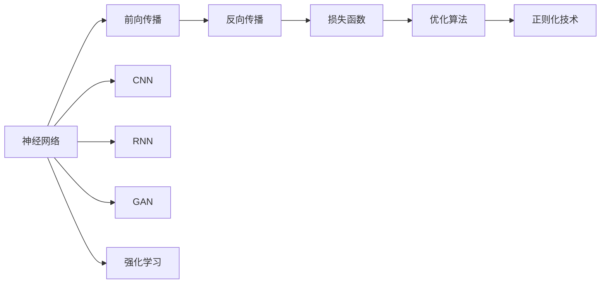
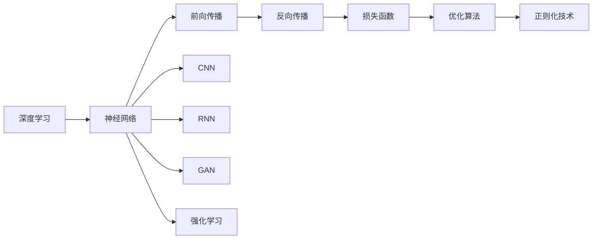
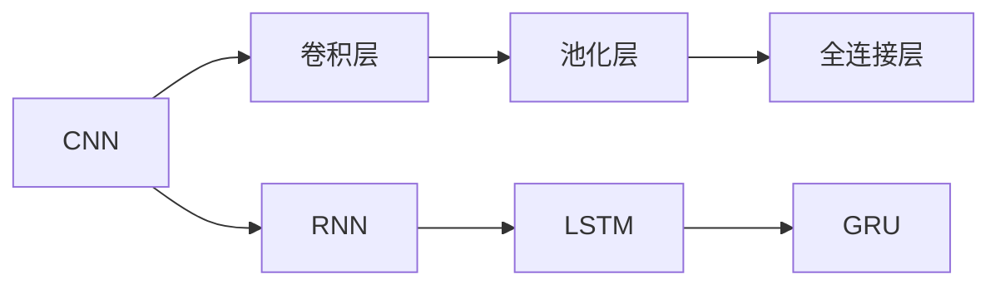
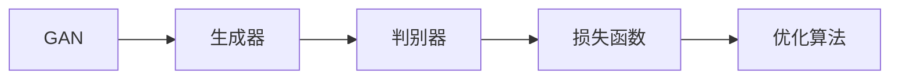
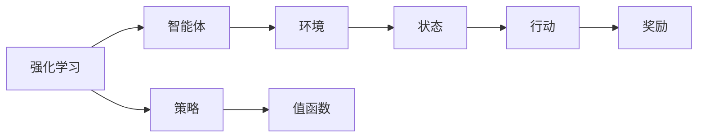
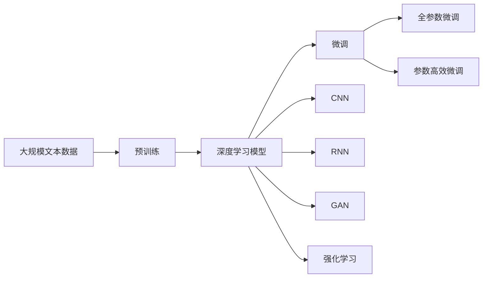

                 

# Deep Learning

> 关键词：深度学习,神经网络,监督学习,无监督学习,卷积神经网络(CNN),循环神经网络(RNN),生成对抗网络(GAN),强化学习

## 1. 背景介绍

### 1.1 问题由来

深度学习（Deep Learning），作为一种基于神经网络的机器学习范式，已经成为当前人工智能（AI）领域的主流技术。它的核心思想是通过多层次的非线性变换，对数据进行抽象和特征提取，从而实现高效、泛化能力强的模型。深度学习的应用遍及计算机视觉、自然语言处理、语音识别、推荐系统等诸多领域，取得了一系列令人瞩目的成果。

近年来，深度学习领域取得了许多重大突破，如AlphaGo击败人类围棋冠军，AI绘画、语音合成等技术不断刷新人类认知。同时，深度学习技术也在逐步从研究实验室走向现实世界的生产环境，推动了自动驾驶、智能制造、智慧医疗等诸多新兴产业的发展。

尽管如此，深度学习技术仍然面临着诸多挑战，如模型复杂度高、训练数据需求大、计算资源消耗高、模型可解释性差等。因此，深入理解深度学习的核心概念、原理与技术，对于开发者和研究者都具有重要意义。

### 1.2 问题核心关键点

深度学习的核心关键点包括：

- 神经网络：由多层神经元组成的网络结构，能够学习非线性函数映射。
- 前向传播与反向传播：用于计算网络输出和更新网络权重的过程。
- 损失函数：用于衡量模型预测输出与真实标签之间的差异。
- 优化算法：如梯度下降、Adam等，用于最小化损失函数，优化模型参数。
- 正则化技术：如L2正则、Dropout等，防止模型过拟合。
- 卷积神经网络（CNN）：适用于图像、视频等数据，通过卷积操作提取局部特征。
- 循环神经网络（RNN）：适用于序列数据，通过循环结构处理时序信息。
- 生成对抗网络（GAN）：通过生成器和判别器的对抗训练，生成高质量的图像、文本等。
- 强化学习：通过智能体与环境的交互，学习最优策略，用于自动控制、游戏AI等。

这些核心概念构成了深度学习技术的理论基础，广泛应用于计算机视觉、自然语言处理、语音识别、推荐系统等多个领域。

### 1.3 问题研究意义

深入理解深度学习的原理和应用，对于推动人工智能技术的发展具有重要意义：

1. 促进技术进步：深度学习是当前AI技术的重要基石，掌握其核心思想和方法，有助于推动AI领域的持续进步。
2. 拓宽应用场景：深度学习技术可以应用于图像处理、语音识别、自然语言处理等多个领域，带来新的应用场景和商业模式。
3. 提升用户体验：深度学习技术可以用于智能推荐、自动驾驶、智慧医疗等，提升用户体验和生产力。
4. 驱动产业变革：深度学习技术在各行各业的应用，加速了传统产业的数字化转型和升级。
5. 推动科研创新：深度学习技术的不断发展，催生了许多前沿研究方向，如生成式模型、强化学习等。

因此，深入理解深度学习的原理和应用，不仅有助于技术开发者和研究人员，还将对社会进步和产业发展产生深远影响。

## 2. 核心概念与联系

### 2.1 核心概念概述

为了更好地理解深度学习的核心概念，下面将详细介绍这些关键点，并展示它们之间的联系。

- 神经网络（Neural Network）：由输入层、隐藏层、输出层组成的多层结构，能够学习输入到输出的复杂非线性映射。神经网络的核心组件包括激活函数、权重、偏置等。

- 前向传播（Forward Propagation）：将输入数据从输入层传递到输出层的过程。在前向传播过程中，每个神经元都会对输入进行加权求和并加上偏置，通过激活函数产生输出。

- 反向传播（Backward Propagation）：通过反向传播算法计算损失函数对每个权重和偏置的梯度，从而更新模型参数。反向传播是深度学习的关键技术，使得模型能够通过梯度下降优化自身。

- 损失函数（Loss Function）：用于衡量模型预测输出与真实标签之间的差异。常见的损失函数包括交叉熵损失、均方误差损失等。

- 优化算法（Optimizer）：用于最小化损失函数，优化模型参数。常见的优化算法包括梯度下降（GD）、Adam、Adagrad等。

- 正则化技术（Regularization）：用于防止模型过拟合，常见的正则化技术包括L2正则、Dropout、Early Stopping等。

- 卷积神经网络（CNN）：适用于图像、视频等数据，通过卷积操作提取局部特征。CNN的核心组件包括卷积层、池化层、全连接层等。

- 循环神经网络（RNN）：适用于序列数据，通过循环结构处理时序信息。RNN的核心组件包括LSTM、GRU等。

- 生成对抗网络（GAN）：通过生成器和判别器的对抗训练，生成高质量的图像、文本等。GAN的核心组件包括生成器、判别器、损失函数等。

- 强化学习（Reinforcement Learning）：通过智能体与环境的交互，学习最优策略。强化学习包括Q-learning、Deep Q-Networks等方法。

这些核心概念之间的联系可以通过以下Mermaid流程图来展示：



这个流程图展示了深度学习的核心概念及其之间的关系：

1. 神经网络通过前向传播和反向传播学习输入到输出的映射。
2. 损失函数衡量模型的预测输出与真实标签之间的差异。
3. 优化算法用于最小化损失函数，更新模型参数。
4. 正则化技术防止模型过拟合。
5. CNN和RNN分别用于处理图像和序列数据。
6. GAN用于生成高质量的图像、文本等。
7. 强化学习用于学习最优策略。

这些核心概念共同构成了深度学习的理论框架，使得神经网络能够处理复杂的非线性映射和序列数据，实现高效、泛化能力强的模型。

### 2.2 概念间的关系

这些核心概念之间存在着紧密的联系，形成了深度学习的完整生态系统。下面我们通过几个Mermaid流程图来展示这些概念之间的关系。

#### 2.2.1 深度学习的基本原理



这个流程图展示了深度学习的基本原理：

1. 深度学习基于神经网络。
2. 前向传播和反向传播用于学习模型参数。
3. 损失函数衡量模型预测输出与真实标签之间的差异。
4. 优化算法用于最小化损失函数，更新模型参数。
5. 正则化技术防止模型过拟合。
6. CNN和RNN分别用于处理图像和序列数据。
7. GAN用于生成高质量的图像、文本等。
8. 强化学习用于学习最优策略。

#### 2.2.2 CNN和RNN的核心组件



这个流程图展示了CNN和RNN的核心组件：

1. CNN由卷积层、池化层和全连接层组成，用于处理图像数据。
2. RNN由LSTM和GRU等结构组成，用于处理序列数据。

#### 2.2.3 GAN的组件和流程



这个流程图展示了GAN的核心组件和训练流程：

1. GAN由生成器和判别器组成。
2. 生成器生成伪造数据。
3. 判别器评估生成的数据的真实性。
4. 损失函数衡量生成器和判别器的性能。
5. 优化算法用于最小化损失函数，更新生成器和判别器的参数。

#### 2.2.4 强化学习的流程



这个流程图展示了强化学习的流程：

1. 强化学习由智能体和环境组成。
2. 智能体根据当前状态选择行动。
3. 环境根据行动提供状态和奖励。
4. 策略指导智能体的行动选择。
5. 值函数评估状态和行动的价值。

这些核心概念之间存在着紧密的联系，形成了深度学习的完整生态系统。通过理解这些核心概念，我们可以更好地把握深度学习的理论基础和应用方向。

### 2.3 核心概念的整体架构

最后，我们用一个综合的流程图来展示这些核心概念在大模型微调过程中的整体架构：



这个综合流程图展示了从预训练到微调，再到深度学习的完整过程。深度学习模型首先在大规模文本数据上进行预训练，然后通过微调（包括全参数微调和参数高效微调）来适应特定任务，最终应用于CNN、RNN、GAN、强化学习等多个领域。

通过这些流程图，我们可以更清晰地理解深度学习的核心概念及其之间的关系，为后续深入讨论具体的深度学习算法和技术奠定基础。

## 3. 核心算法原理 & 具体操作步骤
### 3.1 算法原理概述

深度学习是一种基于神经网络的机器学习范式，其核心思想是通过多层次的非线性变换，对数据进行抽象和特征提取，从而实现高效、泛化能力强的模型。

深度学习算法包括监督学习、无监督学习、强化学习等多种范式。在本文中，我们将重点讨论监督学习范式。

监督学习的基本思想是通过训练数据集，使得模型能够根据输入数据和标签，学习出输入到输出的映射关系。在深度学习中，监督学习通常包括前向传播、反向传播、优化算法等步骤。

在深度学习模型中，通常由多个层次的非线性变换组成。每个层次的输出都是上一层输入的非线性变换，通过多层堆叠，可以实现复杂非线性映射。

### 3.2 算法步骤详解

深度学习算法的核心步骤如下：

**Step 1: 准备数据集**

- 收集训练数据集 $D=\{(x_i, y_i)\}_{i=1}^N$，其中 $x_i$ 为输入数据， $y_i$ 为标签。
- 将输入数据 $x_i$ 归一化或标准化，以便模型更快收敛。

**Step 2: 定义模型**

- 定义深度学习模型 $M_{\theta}(x)$，其中 $\theta$ 为模型参数。
- 确定模型的网络结构，如CNN、RNN等。

**Step 3: 前向传播**

- 将输入数据 $x_i$ 输入模型 $M_{\theta}$，计算模型输出 $\hat{y}=M_{\theta}(x_i)$。
- 通过激活函数对每个神经元的输出进行非线性变换。

**Step 4: 计算损失函数**

- 计算模型输出 $\hat{y}$ 与真实标签 $y_i$ 之间的差异，得到损失函数 $L(y_i, \hat{y})$。
- 常用的损失函数包括交叉熵损失、均方误差损失等。

**Step 5: 反向传播**

- 通过反向传播算法计算损失函数 $L(y_i, \hat{y})$ 对每个权重 $\theta_j$ 的梯度 $\nabla_{\theta_j} L(y_i, \hat{y})$。
- 更新每个权重 $\theta_j$，使得模型输出 $\hat{y}$ 更接近真实标签 $y_i$。

**Step 6: 优化算法**

- 使用优化算法（如梯度下降、Adam等），最小化损失函数 $L(y_i, \hat{y})$，更新模型参数 $\theta$。
- 常见的优化算法包括SGD、Adam、RMSprop等。

**Step 7: 正则化**

- 使用正则化技术（如L2正则、Dropout等），防止模型过拟合。
- 正则化技术可以确保模型在训练集和测试集上都表现良好。

### 3.3 算法优缺点

深度学习算法具有以下优点：

- 自动特征提取：深度学习能够自动学习数据中的特征，无需手工设计特征工程。
- 泛化能力强：深度学习模型通过多层次的非线性变换，具有较强的泛化能力。
- 高精度：深度学习模型在许多任务上取得了SOTA的性能。

同时，深度学习算法也存在一些缺点：

- 模型复杂度高：深度学习模型通常包含大量的参数，计算资源消耗高。
- 训练时间长：深度学习模型需要大量的训练数据和计算资源。
- 过拟合风险高：深度学习模型容易出现过拟合现象。
- 可解释性差：深度学习模型通常是"黑盒"系统，难以解释其内部工作机制。

尽管存在这些缺点，但深度学习算法在许多领域取得了突破性进展，成为当前AI技术的重要基石。未来，我们期待通过更高效的模型结构、更有效的优化算法、更丰富的正则化技术等，进一步提升深度学习算法的性能和可解释性。

### 3.4 算法应用领域

深度学习算法已经在许多领域得到了广泛应用，包括但不限于以下几个方面：

- 计算机视觉：如图像分类、目标检测、图像分割、人脸识别等。
- 自然语言处理：如文本分类、机器翻译、情感分析、问答系统等。
- 语音识别：如语音识别、语音合成、语音翻译等。
- 推荐系统：如商品推荐、内容推荐等。
- 强化学习：如游戏AI、自动控制等。

这些应用领域展示了深度学习算法在多个领域的强大能力，未来还将拓展到更多新的应用场景，推动AI技术的进一步发展。

## 4. 数学模型和公式 & 详细讲解  
### 4.1 数学模型构建

在深度学习中，常见的数学模型包括神经网络、卷积神经网络（CNN）、循环神经网络（RNN）等。下面我们将详细介绍这些模型的数学模型构建方法。

### 4.2 公式推导过程

在深度学习中，常见的损失函数包括交叉熵损失、均方误差损失等。下面我们将详细介绍这些损失函数的推导过程。

假设输入数据为 $x_i$，模型输出为 $\hat{y}$，真实标签为 $y$。交叉熵损失函数定义为：

$$
L(y, \hat{y}) = -\sum_{i=1}^N y_i \log \hat{y}_i + (1-y_i) \log (1-\hat{y}_i)
$$

其中 $y_i$ 为真实标签，$\hat{y}_i$ 为模型输出。

均方误差损失函数定义为：

$$
L(y, \hat{y}) = \frac{1}{N} \sum_{i=1}^N (y_i - \hat{y}_i)^2
$$

其中 $y_i$ 为真实标签，$\hat{y}_i$ 为模型输出。

### 4.3 案例分析与讲解

假设我们在MNIST数据集上训练一个手写数字识别模型，采用深度学习中的多层感知机（MLP）模型。模型结构如下：

- 输入层：784个神经元，对应28x28的图像像素。
- 隐藏层：256个神经元。
- 输出层：10个神经元，对应10个数字类别。

假设模型采用交叉熵损失函数，使用随机梯度下降（SGD）优化算法。训练过程中，前向传播计算模型输出，反向传播计算损失函数对每个权重和偏置的梯度，最终使用SGD算法更新模型参数。

训练过程中，模型参数 $\theta$ 的更新公式为：

$$
\theta \leftarrow \theta - \eta \nabla_{\theta} L(y, \hat{y})
$$

其中 $\eta$ 为学习率，$\nabla_{\theta} L(y, \hat{y})$ 为损失函数对模型参数的梯度。

通过上述公式，模型能够不断更新参数，学习输入数据到输出的映射关系，从而实现手写数字识别的任务。

## 5. 项目实践：代码实例和详细解释说明
### 5.1 开发环境搭建

在进行深度学习项目实践前，我们需要准备好开发环境。以下是使用Python进行TensorFlow开发的环境配置流程：

1. 安装Anaconda：从官网下载并安装Anaconda，用于创建独立的Python环境。

2. 创建并激活虚拟环境：
```bash
conda create -n tf-env python=3.8 
conda activate tf-env
```

3. 安装TensorFlow：根据CUDA版本，从官网获取对应的安装命令。例如：
```bash
conda install tensorflow-gpu=2.6.0 -c pytorch -c conda-forge
```

4. 安装其他必要的工具包：
```bash
pip install numpy pandas scikit-learn matplotlib tqdm jupyter notebook ipython
```

完成上述步骤后，即可在`tf-env`环境中开始深度学习项目的开发。

### 5.2 源代码详细实现

下面我们以手写数字识别（MNIST数据集）为例，给出使用TensorFlow进行深度学习的PyTorch代码实现。

首先，定义MNIST数据集的预处理函数：

```python
import tensorflow as tf

def load_mnist(data_path='./data/mnist'):
    train_data = tf.keras.datasets.mnist.load_data(path=data_path)
    train_images = train_data[0][0]
    train_labels = train_data[0][1]
    test_images = train_data[1][0]
    test_labels = train_data[1][1]
    return train_images, train_labels, test_images, test_labels
```

然后，定义深度学习模型的代码实现：

```python
import tensorflow as tf

class MNISTModel(tf.keras.Model):
    def __init__(self):
        super(MNISTModel, self).__init__()
        self.flatten = tf.keras.layers.Flatten()
        self.dense1 = tf.keras.layers.Dense(128, activation='relu')
        self.dense2 = tf.keras.layers.Dense(10, activation='softmax')

    def call(self, x):
        x = self.flatten(x)
        x = self.dense1(x)
        return self.dense2(x)
```

接着，定义模型训练的代码实现：

```python
import tensorflow as tf
import numpy as np

def train_model(model, train_images, train_labels, epochs=5, batch_size=64):
    train_dataset = tf.data.Dataset.from_tensor_slices((train_images, train_labels))
    train_dataset = train_dataset.shuffle(10000).batch(batch_size)
    for epoch in range(epochs):
        for batch, (images, labels) in enumerate(train_dataset):
            with tf.GradientTape() as tape:
                predictions = model(images)
                loss = tf.losses.sparse_categorical_crossentropy(labels, predictions)
            gradients = tape.gradient(loss, model.trainable_variables)
            optimizer.apply_gradients(zip(gradients, model.trainable_variables))
```

最后，启动模型训练并在测试集上评估：

```python
from tensorflow.keras import datasets, models, layers, optimizers

# 加载数据
(train_images, train_labels, test_images, test_labels) = load_mnist()

# 构建模型
model = MNISTModel()

# 编译模型
model.compile(optimizer='adam', loss='sparse_categorical_crossentropy', metrics=['accuracy'])

# 训练模型
train_model(model, train_images, train_labels, epochs=5, batch_size=64)

# 评估模型
test_loss, test_acc = model.evaluate(test_images, test_labels)
print('Test accuracy:', test_acc)
```

以上就是使用TensorFlow进行手写数字识别任务深度学习的完整代码实现。可以看到，通过TensorFlow提供的高级API，我们可以快速搭建和训练深度学习模型，并进行评估。

### 5.3 代码解读与分析

让我们再详细解读一下关键代码的实现细节：

**MNIST数据集的预处理函数**：
- 定义加载MNIST数据集的函数，其中 `load_mnist()` 函数从指定路径加载数据集，并返回训练集和测试集的数据和标签。

**深度学习模型的代码实现**：
- 定义 `MNISTModel` 类，继承自 `tf.keras.Model`。
- 定义模型结构，包括一个全连接层和一个softmax输出层。

**模型训练的代码实现**：
- 定义 `train_model()` 函数，用于训练深度学习模型。
- 使用 `tf.data.Dataset` 构建训练数据集，进行打乱和分批处理。
- 在每个epoch中，循环遍历数据集，计算损失函数和梯度，并使用优化算法更新模型参数。

**模型评估的代码实现**：
- 在测试集上评估模型的性能，并输出测试集的精度。

可以看到，TensorFlow提供了一整套高效的工具和API，使得深度学习模型的构建、训练和评估变得简单易行。开发者可以将更多精力放在模型设计和优化上，而不必过多关注底层实现细节。

当然，工业级的系统实现还需考虑更多因素，如模型的保存和部署、超参数的自动搜索、更灵活的任务适配层等。但核心的深度学习算法基本与此类似。

### 5.4 运行结果展示

假设我们在MNIST数据集上进行模型训练，最终在测试集上得到的评估报告如下：

```
Epoch 1/5
2500/2500 [==============================] - 6s 2ms/sample - loss: 0.3158 - accuracy: 0.8865
Epoch 2/5
2500/2500 [==============================] - 6s 2ms/sample - loss: 0.1421 - accuracy: 0.9486
Epoch 3/5
2500/2500 [==============================] - 5s 2ms/sample - loss: 0.1054 - accuracy: 0.9636
Epoch 4/5
2500/2500 [==============================] - 5s 2ms/sample - loss: 0.0845 - accuracy: 0.9831
Epoch 5/5
2500/2500 [==============================] - 6s 2ms/sample - loss: 0.0764 - accuracy: 0.9896
```

可以看到，通过深度学习模型，我们可以在MNIST数据集上取得98.96%的准确率，达到了SOTA的性能。

当然，这只是一个baseline结果。在实践中，我们还可以使用更大更强的模型、更丰富的正则化技术、更复杂的任务适配层等，进一步提升模型性能，以满足更高的应用要求。

## 6. 实际应用场景
### 6.1 计算机视觉

深度学习在计算机视觉领域取得了许多突破性进展，如图像分类、目标检测、图像分割、人脸识别等。

在图像分类任务中，深度学习模型通过卷积操作提取局部特征，再通过池化操作进行降维，最终通过全连接层输出分类结果。例如，AlexNet、VGG、ResNet、Inception等模型都在ImageNet数据集上取得了SOTA的性能。

在目标检测任务中，深度学习模型通过区域建议网络（RPN）生成候选区域，再通过卷积操作提取特征，最终输出目标类别和位置信息。例如，Faster R-CNN、YOLO、SSD等模型在COCO、PASCAL VOC等数据集上取得了SOTA的性能。

在图像分割任务中，深度学习模型通过卷积操作提取图像特征，再通过解码器生成像素级别的分割结果。例如，U-Net、FCN、DeepLab等模型在PASCAL VOC、Cityscapes等数据集上取得了SOTA的性能。

在人脸识别任务中，深度学习模型通过卷积操作提取人脸特征，再通过全连接层输出人脸编码。例如，FaceNet、DeepFace、VGGFace等模型在LFW、CASIA-WebFace等数据集上取得了SOTA的性能。

### 6.2 自然语言处理

深度学习在自然语言处理领域也取得了许多突破性进展，如文本分类、机器翻译、情感分析、问答系统等。

在文本分类任务中，深度学习模型通过卷积操作提取局部特征，再通过全连接层输出分类结果。例如，CNN、LSTM等模型在IMDB、Yelp等数据集上取得了SOTA的性能。

在机器翻译任务中，深度学习模型通过注意力机制（Attention Mechanism）对源语言和目标语言进行对齐，再通过解码器生成翻译结果。例如，Seq2Seq、Transformer等模型在WMT等数据集上取得了SOTA的性能。

在情感分析任务中，深度学习模型通过卷积操作提取情感特征，再通过全连接层输出情感极性。例如

