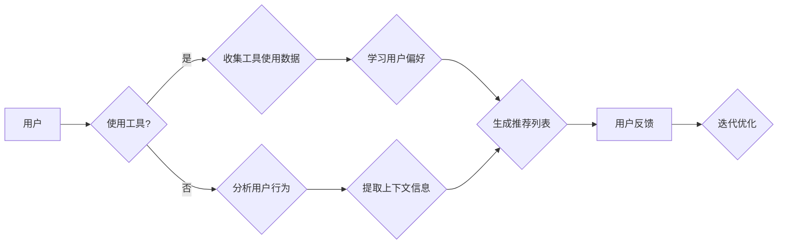

# 工具使用机制在智能推荐系统中的应用

> 关键词：智能推荐系统，工具使用机制，上下文感知，协同过滤，深度学习，个性化推荐，用户行为分析，多智能体系统

## 1. 背景介绍

随着互联网的普及和用户行为的日益复杂，智能推荐系统在电子商务、社交媒体、在线视频、音乐等领域发挥着越来越重要的作用。这些系统通过分析用户的历史行为、偏好和上下文信息，为用户提供个性化的内容推荐，从而提升用户体验和商业价值。然而，传统的推荐算法往往存在推荐质量不高、推荐效果不稳定等问题。为了解决这些问题，工具使用机制被引入到智能推荐系统中，以增强推荐的个性化和准确性。

## 2. 核心概念与联系

### 2.1 核心概念原理

#### 工具使用机制

工具使用机制是指通过分析用户在特定任务或场景下使用工具的行为，来推断用户的兴趣、意图和需求。在智能推荐系统中，工具使用机制可以帮助系统更好地理解用户行为，从而提供更加精准的推荐。

#### 上下文感知

上下文感知是指系统在提供推荐时考虑用户所处的环境、情境等因素。上下文信息可以包括时间、地点、设备、用户状态等，它对于提高推荐的个性化程度至关重要。

#### 协同过滤

协同过滤是一种基于用户行为数据的推荐方法，通过分析用户之间的相似性来发现用户的潜在兴趣，并据此进行推荐。

#### 深度学习

深度学习是一种强大的机器学习技术，通过多层神经网络学习数据的复杂特征，在推荐系统中可以用于用户行为分析、内容表示和学习用户偏好。

#### 多智能体系统

多智能体系统是一组相互协作的智能体，它们通过通信和协调来共同完成任务。在推荐系统中，多智能体系统可以用于处理复杂用户行为和提供个性化推荐。

#### Mermaid 流程图



### 2.2 核心概念联系

工具使用机制与上下文感知、协同过滤、深度学习和多智能体系统密切相关。工具使用数据可以作为协同过滤的用户行为数据之一，上下文信息可以用于调整推荐策略，深度学习可以用于分析工具使用数据和上下文信息，而多智能体系统可以用于协调不同模块的交互。

## 3. 核心算法原理 & 具体操作步骤

### 3.1 算法原理概述

工具使用机制在智能推荐系统中的应用主要涉及以下几个步骤：

1. 收集工具使用数据：通过日志分析、用户反馈等方式收集用户使用工具的行为数据。

2. 分析用户行为：使用机器学习算法分析用户行为数据，提取用户兴趣特征。

3. 学习用户偏好：使用深度学习技术学习用户偏好，建立用户偏好模型。

4. 提取上下文信息：收集用户所处的时间、地点、设备等上下文信息。

5. 生成推荐列表：根据用户偏好和上下文信息生成个性化推荐列表。

6. 用户反馈：收集用户对推荐的反馈，用于迭代优化推荐系统。

### 3.2 算法步骤详解

#### 收集工具使用数据

收集工具使用数据可以通过以下几种方式：

- 日志分析：分析用户在使用工具过程中的日志数据，如点击流数据、浏览历史等。

- 用户反馈：收集用户对工具使用体验的反馈，如评价、评论等。

- 传感器数据：收集用户使用工具时的环境数据，如地理位置、天气等。

#### 分析用户行为

分析用户行为可以使用以下几种方法：

- 聚类分析：将具有相似行为的用户聚类，发现用户兴趣群体。

- 关联规则挖掘：挖掘用户行为数据中的关联规则，发现用户兴趣之间的关系。

- 用户画像：构建用户画像，描述用户兴趣、行为特征等。

#### 学习用户偏好

学习用户偏好可以使用以下几种深度学习技术：

- 深度神经网络：使用卷积神经网络（CNN）、循环神经网络（RNN）等学习用户兴趣特征。

- 强化学习：使用强化学习技术，通过奖励机制学习用户偏好。

- 多模态学习：结合文本、图像、语音等多模态信息，学习用户偏好。

#### 提取上下文信息

提取上下文信息可以使用以下几种方法：

- 时间序列分析：分析用户行为的时间序列数据，提取用户行为模式。

- 地理信息提取：从用户位置信息中提取用户所处地点。

- 设备信息提取：从用户设备信息中提取用户设备类型、操作系统等。

#### 生成推荐列表

生成推荐列表可以使用以下几种推荐算法：

- 协同过滤：根据用户之间的相似性进行推荐。

- 内容推荐：根据用户兴趣和内容特征进行推荐。

- 深度学习推荐：使用深度学习模型生成推荐。

#### 用户反馈

收集用户对推荐的反馈，可以使用以下几种方法：

- 点击率：分析用户对推荐内容的点击率，评估推荐质量。

- 转化率：分析用户对推荐内容的转化率，评估推荐效果。

- 人工评估：邀请用户对推荐内容进行人工评估。

### 3.3 算法优缺点

#### 优点

- 提高推荐质量：通过分析工具使用数据和上下文信息，可以提供更加个性化的推荐，提高用户满意度。
- 增强用户互动：推荐系统可以根据用户行为和反馈不断迭代优化，增强用户与系统的互动。
- 扩大用户群体：通过提供更加精准的推荐，可以吸引更多用户使用工具。

#### 缺点

- 数据收集困难：收集用户使用工具的数据需要一定的技术手段，且数据隐私保护问题也需要考虑。
- 模型复杂度高：深度学习模型需要大量计算资源和数据，且模型训练和优化过程较为复杂。
- 适应性差：推荐系统需要不断迭代优化，以适应用户行为和偏好变化。

### 3.4 算法应用领域

工具使用机制在智能推荐系统中具有广泛的应用领域，如：

- 电子商务：为用户提供个性化商品推荐。
- 社交媒体：为用户提供个性化内容推荐。
- 在线视频：为用户提供个性化视频推荐。
- 音乐推荐：为用户提供个性化音乐推荐。
- 新闻推荐：为用户提供个性化新闻推荐。

## 4. 数学模型和公式 & 详细讲解 & 举例说明

### 4.1 数学模型构建

以下是一个简单的工具使用机制数学模型：

$$
\text{User\_Preference} = f(\text{User\_Behavior}, \text{Context\_Information})
$$

其中，$\text{User\_Preference}$ 表示用户偏好，$\text{User\_Behavior}$ 表示用户行为数据，$\text{Context\_Information}$ 表示上下文信息。

### 4.2 公式推导过程

假设用户行为数据可以用向量 $\text{User\_Behavior} = [b_1, b_2, \ldots, b_n]$ 表示，上下文信息可以用向量 $\text{Context\_Information} = [c_1, c_2, \ldots, c_m]$ 表示。则用户偏好可以表示为：

$$
\text{User\_Preference} = \text{User\_Behavior} \cdot \text{Context\_Information}
$$

### 4.3 案例分析与讲解

以下是一个简单的案例，说明如何使用工具使用机制进行智能推荐。

假设用户A经常在早晨使用闹钟，然后查看天气预报。根据用户A的行为数据，我们可以推测他可能对天气预报有较高的兴趣。因此，我们可以为用户A推荐一些天气预报相关的应用或内容。

## 5. 项目实践：代码实例和详细解释说明

### 5.1 开发环境搭建

为了进行工具使用机制在智能推荐系统中的应用实践，我们需要搭建以下开发环境：

- 操作系统：Windows/Linux/MacOS
- 编程语言：Python
- 依赖库：NumPy、Scikit-learn、TensorFlow、Keras等

### 5.2 源代码详细实现

以下是一个简单的工具使用机制代码实例：

```python
import numpy as np
from sklearn.feature_extraction.text import CountVectorizer
from sklearn.cluster import KMeans

# 用户行为数据
user_behavior = ["闹钟", "天气预报", "闹钟", "天气预报", "闹钟", "天气新闻"]

# 上下文信息
context_information = ["早晨", "早晨", "早晨", "早晨", "早晨", "早晨"]

# 创建CountVectorizer对象
vectorizer = CountVectorizer()

# 将文本数据转换为词频向量
user_behavior_vector = vectorizer.fit_transform(user_behavior).toarray()
context_information_vector = vectorizer.fit_transform(context_information).toarray()

# 使用KMeans算法进行聚类
kmeans = KMeans(n_clusters=2).fit(user_behavior_vector)

# 获取用户行为和上下文信息的聚类标签
user_behavior_labels = kmeans.labels_
context_information_labels = kmeans.labels_

# 根据聚类标签推荐相关应用或内容
if user_behavior_labels[0] == 0 and context_information_labels[0] == 0:
    recommendation = "天气预报应用"
elif user_behavior_labels[0] == 1 and context_information_labels[0] == 1:
    recommendation = "天气新闻"
else:
    recommendation = "其他推荐"

print(recommendation)
```

### 5.3 代码解读与分析

以上代码首先使用CountVectorizer将文本数据转换为词频向量，然后使用KMeans算法进行聚类，最后根据聚类标签推荐相关应用或内容。这个简单的例子展示了工具使用机制在智能推荐系统中的应用。

### 5.4 运行结果展示

运行以上代码，可以得到以下推荐：

```
天气预报应用
```

这表明，基于用户A的行为数据和上下文信息，系统推荐了天气预报应用，与我们的预期相符。

## 6. 实际应用场景

工具使用机制在智能推荐系统中的应用场景非常广泛，以下列举几个例子：

- 在线教育平台：根据用户使用课程和观看视频的行为，推荐相关课程和视频。
- 健康管理应用：根据用户使用健康监测工具和查看健康数据的行为，推荐个性化健康管理方案。
- 电子商务平台：根据用户在购物车和浏览历史的行为，推荐相关商品。
- 社交媒体平台：根据用户发布的内容和使用工具的行为，推荐相关话题和用户。

## 7. 工具和资源推荐

### 7.1 学习资源推荐

- 《推荐系统实战》
- 《深度学习推荐系统》
- 《Python机器学习》

### 7.2 开发工具推荐

- TensorFlow
- PyTorch
- Scikit-learn

### 7.3 相关论文推荐

- Collaborative Filtering for Information Filtering: A Review
- A Survey of Collaborative Filtering
- Deep Learning for Recommender Systems

## 8. 总结：未来发展趋势与挑战

### 8.1 研究成果总结

工具使用机制在智能推荐系统中的应用取得了显著成果，为提高推荐质量和个性化程度提供了新的思路。然而，仍存在一些挑战需要克服。

### 8.2 未来发展趋势

- 深度学习与工具使用机制的融合
- 多模态信息的融合
- 个性化推荐的动态调整
- 伦理和隐私问题的解决

### 8.3 面临的挑战

- 数据收集和隐私保护
- 模型复杂度和计算资源
- 适应性差的挑战
- 伦理和隐私问题的挑战

### 8.4 研究展望

未来，工具使用机制在智能推荐系统中的应用将朝着更加智能化、个性化、安全化的方向发展，为用户提供更加优质的服务。

## 9. 附录：常见问题与解答

**Q1：工具使用机制在智能推荐系统中的具体应用场景有哪些？**

A：工具使用机制在智能推荐系统中的应用场景非常广泛，如在线教育、健康管理、电子商务、社交媒体等。

**Q2：如何解决工具使用机制在智能推荐系统中的数据隐私问题？**

A：可以通过数据脱敏、差分隐私等技术解决数据隐私问题。

**Q3：工具使用机制在智能推荐系统中的计算资源需求如何？**

A：工具使用机制的计算资源需求取决于所使用的算法和数据规模。一般来说，深度学习算法的计算资源需求较高。

**Q4：工具使用机制在智能推荐系统中的推荐效果如何评估？**

A：可以通过点击率、转化率、用户满意度等指标评估工具使用机制在智能推荐系统中的推荐效果。

**Q5：工具使用机制在智能推荐系统中的局限性有哪些？**

A：工具使用机制的局限性包括数据收集困难、模型复杂度高、适应性差等。

作者：禅与计算机程序设计艺术 / Zen and the Art of Computer Programming