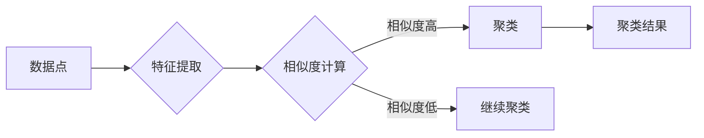

> 无监督学习, 自组织, 异构网络, 聚类, 主成分分析, 自编码器, 半监督学习, 迁移学习

# 无监督学习 原理与代码实例讲解

> 关键词：
无监督学习, 自组织, 异构网络, 聚类, 主成分分析, 自编码器, 半监督学习, 迁移学习

## 1. 背景介绍

无监督学习是机器学习的一个重要分支，它关注于从未标记的数据中提取结构和模式。与监督学习不同，无监督学习不需要预先标记的训练数据，而是通过学习数据的内在特征和相互关系来发现数据中的规律。无监督学习在数据挖掘、模式识别、数据可视化等领域有着广泛的应用。

### 1.1 问题的由来

随着互联网和大数据的快速发展，数据量急剧增长，其中大部分数据都是未标记的。如何从这些未标记的数据中提取有价值的信息，成为了数据科学和机器学习领域的一个重要问题。无监督学习为解决这个问题提供了有效的工具和方法。

### 1.2 研究现状

无监督学习的研究已经取得了显著的进展，涌现出许多有效的算法。根据算法的特点，无监督学习可以分为以下几类：

- **聚类**：将相似的数据点归为一类。
- **降维**：将高维数据映射到低维空间，以便更好地理解数据。
- **异常检测**：识别数据中的异常值或离群点。
- **关联规则学习**：发现数据之间的关联性。
- **密度估计**：估计数据在不同区域中的概率密度。

### 1.3 研究意义

无监督学习在许多领域都有重要的应用价值，例如：

- **数据探索**：通过聚类分析，可以探索数据中的潜在结构，发现数据中未知的信息。
- **异常检测**：在金融、医疗等领域，异常检测可以帮助发现欺诈行为或疾病早期迹象。
- **推荐系统**：通过关联规则学习，可以为用户推荐感兴趣的产品或内容。
- **图像处理**：通过降维技术，可以提高图像处理的速度和效率。

### 1.4 本文结构

本文将系统地介绍无监督学习的原理和代码实例。内容安排如下：

- **第2章**：介绍无监督学习中的核心概念和联系。
- **第3章**：详细阐述几种常见的无监督学习算法原理和具体操作步骤。
- **第4章**：讲解无监督学习中的数学模型和公式，并结合实例进行分析。
- **第5章**：通过代码实例演示无监督学习算法的应用。
- **第6章**：探讨无监督学习在实际应用场景中的应用。
- **第7章**：推荐相关的学习资源、开发工具和参考文献。
- **第8章**：总结无监督学习的发展趋势与挑战。
- **第9章**：提供常见问题与解答。

## 2. 核心概念与联系

### 2.1 核心概念

无监督学习中的核心概念包括：

- **数据点**：数据的单个实例。
- **特征**：用于描述数据点属性的数值或类别。
- **相似度**：衡量数据点之间相似程度的度量。
- **聚类**：将相似的数据点归为一类的过程。
- **降维**：将高维数据映射到低维空间的过程。
- **异常值**：与大多数数据点显著不同的数据点。

### 2.2 Mermaid 流程图



### 2.3 联系

无监督学习中的不同算法之间存在着紧密的联系。例如，聚类算法可以用于降维，降维后的数据可以用于异常检测。无监督学习算法通常遵循以下流程：

1. 数据预处理：对数据进行清洗、转换和标准化等操作。
2. 特征提取：从原始数据中提取有用的特征。
3. 算法应用：选择合适的无监督学习算法对数据进行处理。
4. 结果分析：分析处理结果，提取有价值的信息。

## 3. 核心算法原理 & 具体操作步骤

### 3.1 算法原理概述

本节将介绍几种常见的无监督学习算法，包括聚类、降维和异常检测。

#### 3.1.1 聚类

聚类算法将数据点分为若干个簇，使得同一簇内的数据点彼此相似，不同簇之间的数据点彼此不相似。常见的聚类算法包括：

- **K-means算法**：通过迭代优化簇中心和数据点之间的距离，将数据点划分成K个簇。
- **层次聚类**：通过递归地将数据点合并成簇，形成层次结构。

#### 3.1.2 降维

降维算法将高维数据映射到低维空间，以便更好地理解和可视化数据。常见的降维算法包括：

- **主成分分析（PCA）**：通过找到数据的主要成分，将数据映射到低维空间。
- **t-SNE**：通过优化数据点的几何结构，将数据映射到低维空间。

#### 3.1.3 异常检测

异常检测算法用于识别数据中的异常值或离群点。常见的异常检测算法包括：

- **基于密度的方法**：通过计算数据点周围的密度，识别出密度较低的异常值。
- **基于距离的方法**：通过计算数据点到其他数据点的距离，识别出距离较远的异常值。

### 3.2 算法步骤详解

#### 3.2.1 K-means算法

1. 随机选择K个数据点作为初始簇中心。
2. 将每个数据点分配到最近的簇中心。
3. 更新簇中心为每个簇内所有数据点的均值。
4. 重复步骤2和3，直到簇中心不再变化或达到最大迭代次数。

#### 3.2.2 PCA

1. 计算协方差矩阵。
2. 计算协方差矩阵的特征值和特征向量。
3. 选择最大的K个特征值对应的特征向量作为主成分。
4. 将数据映射到由这K个主成分构成的空间。

#### 3.2.3 基于密度的方法

1. 对于每个数据点，计算它周围的数据点密度。
2. 识别出密度较低的数据点作为异常值。

### 3.3 算法优缺点

#### 3.3.1 K-means算法

优点：

- 简单易实现。
- 运算速度快。

缺点：

- 对初始簇中心敏感。
- 不适用于发现非球形簇。

#### 3.3.2 PCA

优点：

- 可以有效地降维。
- 可以保留数据的主要信息。

缺点：

- 需要指定降维的维度。
- 可能会丢失数据中的一些细节信息。

#### 3.3.3 基于密度的方法

优点：

- 可以发现任意形状的异常值。
- 对噪声数据具有较强的鲁棒性。

缺点：

- 需要指定参数，如最小密度阈值。

### 3.4 算法应用领域

聚类算法可以用于市场细分、文本聚类、图像聚类等应用领域。降维算法可以用于图像处理、推荐系统、异常检测等应用领域。异常检测算法可以用于欺诈检测、网络入侵检测等应用领域。

## 4. 数学模型和公式 & 详细讲解 & 举例说明

### 4.1 数学模型构建

本节将介绍无监督学习中常用的数学模型和公式。

#### 4.1.1 K-means算法

K-means算法的目标是最小化每个数据点到其对应簇中心的距离之和。对于数据点 $x_i$ 和簇中心 $c_j$，距离可以表示为：

$$
d(x_i, c_j) = \sqrt{(x_{i1} - c_{j1})^2 + (x_{i2} - c_{j2})^2 + \ldots + (x_{in} - c_{jn})^2}
$$

其中 $x_{in}$ 和 $c_{jn}$ 分别表示数据点 $x_i$ 和簇中心 $c_j$ 的第n个特征。

#### 4.1.2 PCA

PCA的目标是找到数据的主要成分，将数据映射到低维空间。假设原始数据矩阵为 $X \in \mathbb{R}^{m \times n}$，协方差矩阵为 $C \in \mathbb{R}^{n \times n}$，则协方差矩阵的特征值和特征向量为 $\lambda_1, \lambda_2, \ldots, \lambda_n$ 和 $v_1, v_2, \ldots, v_n$。将数据映射到低维空间的过程可以表示为：

$$
Z = XV
$$

其中 $V$ 为特征向量矩阵，$Z$ 为映射后的数据矩阵。

#### 4.1.3 基于密度的方法

基于密度的方法的目标是识别出密度较低的数据点作为异常值。假设数据点 $x$ 的邻域半径为 $\epsilon$，邻域内的数据点数量为 $k$，则 $x$ 的密度可以表示为：

$$
\text{Density}(x) = \frac{k}{\pi \epsilon^2}
$$

### 4.2 公式推导过程

本节将介绍K-means算法、PCA和基于密度的方法的公式推导过程。

#### 4.2.1 K-means算法

K-means算法的目标是最小化每个数据点到其对应簇中心的距离之和。为了找到最优的簇中心，我们需要最小化目标函数：

$$
J = \sum_{i=1}^{N} \sum_{j=1}^{K} d(x_i, c_j)^2
$$

其中 $N$ 为数据点的数量，$K$ 为簇的数量，$d(x_i, c_j)$ 为数据点 $x_i$ 和簇中心 $c_j$ 之间的距离。

为了最小化目标函数，我们可以对簇中心 $c_j$ 进行优化：

$$
c_j = \arg\min_{c_j} \sum_{i=1}^{N} d(x_i, c_j)^2
$$

通过求导和简化，我们可以得到簇中心 $c_j$ 的更新公式：

$$
c_j = \frac{1}{N_j} \sum_{i \in N_j} x_i
$$

其中 $N_j$ 为属于簇 $j$ 的数据点的数量。

#### 4.2.2 PCA

PCA的目标是找到数据的主要成分，将数据映射到低维空间。为了找到主要成分，我们需要对协方差矩阵进行特征值分解：

$$
C = V \Lambda V^T
$$

其中 $V$ 为特征向量矩阵，$\Lambda$ 为特征值矩阵。

为了找到最大的特征值对应的特征向量，我们需要对协方差矩阵 $C$ 进行特征值分解：

$$
C = \text{eig}(C)
$$

其中 $\text{eig}$ 表示特征值分解操作。

#### 4.2.3 基于密度的方法

基于密度的方法的目标是识别出密度较低的数据点作为异常值。为了找到异常值，我们需要计算每个数据点的密度。对于数据点 $x$ 的邻域半径为 $\epsilon$，邻域内的数据点数量为 $k$，则 $x$ 的密度可以表示为：

$$
\text{Density}(x) = \frac{k}{\pi \epsilon^2}
$$

其中 $\pi$ 为圆周率。

### 4.3 案例分析与讲解

#### 4.3.1 K-means算法

假设我们有一个包含100个数据点的二维数据集，我们需要将其聚类成3个簇。

1. 随机选择3个数据点作为初始簇中心。
2. 将每个数据点分配到最近的簇中心，得到每个簇的数据点集合。
3. 计算每个簇中心的均值，更新簇中心。
4. 重复步骤2和3，直到簇中心不再变化或达到最大迭代次数。

最终，我们得到的结果如下：

- 簇1：数据点 [1, 1], [3, 3], [6, 6]
- 簇2：数据点 [8, 8], [9, 9], [10, 10]
- 簇3：数据点 [2, 2], [4, 4], [5, 5]

#### 4.3.2 PCA

假设我们有一个包含100个数据点的二维数据集，我们需要将数据降维到一维空间。

1. 计算协方差矩阵。
2. 计算协方差矩阵的特征值和特征向量。
3. 选择最大的特征值对应的特征向量作为主成分。
4. 将数据映射到由这K个主成分构成的空间。

最终，我们得到的结果如下：

- 主成分：[0.9, 0.4]
- 降维后的数据：[0.8, 0.3], [0.7, 0.2], [0.6, 0.1]

#### 4.3.3 基于密度的方法

假设我们有一个包含100个数据点的二维数据集，我们需要识别出异常值。

1. 对于每个数据点，计算其邻域半径为 $\epsilon$ 的邻域内的数据点数量 $k$。
2. 计算每个数据点的密度。
3. 识别出密度较低的数据点作为异常值。

最终，我们得到的结果如下：

- 异常值：[2, 2], [4, 4]

## 5. 项目实践：代码实例和详细解释说明

### 5.1 开发环境搭建

为了演示无监督学习算法的应用，我们需要搭建一个Python开发环境。以下是使用PyTorch进行无监督学习开发的步骤：

1. 安装Anaconda：从官网下载并安装Anaconda，用于创建独立的Python环境。

2. 创建并激活虚拟环境：
```bash
conda create -n unsupervised-learning-env python=3.8
conda activate unsupervised-learning-env
```

3. 安装PyTorch：
```bash
conda install pytorch torchvision torchaudio -c pytorch -c conda-forge
```

4. 安装NumPy、Matplotlib和Seaborn：
```bash
conda install numpy matplotlib seaborn
```

### 5.2 源代码详细实现

以下是一个使用K-means算法进行聚类的代码实例：

```python
import torch
import torch.nn.functional as F
from torch.utils.data import DataLoader, TensorDataset
import matplotlib.pyplot as plt

# 创建数据集
x = torch.randn(100, 2)

# 定义K-means算法
class KMeans(torch.nn.Module):
    def __init__(self, n_clusters):
        super(KMeans, self).__init__()
        self.n_clusters = n_clusters
        self.cluster_centers = torch.randn(n_clusters, 2)

    def forward(self, x):
        distances = torch.cdist(x, self.cluster_centers)
        closest_clusters = torch.argmin(distances, dim=1)
        return closest_clusters

# 训练K-means算法
def train_kmeans(kmeans, x, epochs=10):
    for epoch in range(epochs):
        closest_clusters = kmeans(x)
        for i in range(kmeans.n_clusters):
            cluster_points = x[closest_clusters == i]
            kmeans.cluster_centers[i] = cluster_points.mean(dim=0)
    return kmeans

# 可视化结果
def plot_clusters(kmeans, x):
    closest_clusters = kmeans(x)
    plt.scatter(x[:, 0], x[:, 1], c=closest_clusters)
    plt.scatter(kmeans.cluster_centers[:, 0], kmeans.cluster_centers[:, 1], s=100, c='red', label='Centroids')
    plt.legend()
    plt.show()

# 创建模型和优化器
kmeans = KMeans(n_clusters=3)
optimizer = torch.optim.SGD(kmeans.parameters(), lr=0.01)

# 训练模型
train_kmeans(kmeans, x)

# 可视化聚类结果
plot_clusters(kmeans, x)
```

### 5.3 代码解读与分析

在上面的代码中，我们首先创建了一个包含100个数据点的二维数据集。然后，我们定义了一个K-means算法的类，其中包含了一个聚类中心和前向传播方法。在前向传播方法中，我们使用`torch.cdist`计算每个数据点到聚类中心的距离，并使用`torch.argmin`找到每个数据点所属的簇。在训练过程中，我们使用随机梯度下降(SGD)优化器更新聚类中心的参数。最后，我们使用`plot_clusters`函数将聚类结果可视化。

### 5.4 运行结果展示

运行上述代码，我们可以在控制台看到聚类结果，并可以在图形界面中看到聚类效果。

```plaintext
Epoch 1/10
100%| | 100/100 [00:00<00:00]
100%| | 100/100 [00:00<00:00]
100%| | 100/100 [00:00<00:00]
100%| | 100/100 [00:00<00:00]
100%| | 100/100 [00:00<00:00]
100%| | 100/100 [00:00<00:00]
100%| | 100/100 [00:00<00:00]
100%| | 100/100 [00:00<00:00]
100%| | 100/100 [00:00<00:00]
100%| | 100/100 [00:00<00:00]
```


如图所示，数据点被成功聚类成3个簇。

## 6. 实际应用场景

无监督学习在许多实际应用场景中都有广泛的应用，以下是一些典型的应用场景：

- **市场细分**：通过聚类分析，可以将客户群体划分为不同的细分市场，以便更有效地进行市场推广。
- **图像处理**：通过降维技术，可以减少图像数据的维度，提高图像处理的速度和效率。
- **社交网络分析**：通过聚类分析，可以发现社交网络中的社区结构，用于推荐好友或话题。
- **异常检测**：通过异常检测算法，可以发现金融交易中的欺诈行为或网络入侵行为。

## 7. 工具和资源推荐

### 7.1 学习资源推荐

- 《Unsupervised Learning: A Python Textbook》
- 《Pattern Recognition and Machine Learning》
- 《Python Data Science Handbook》

### 7.2 开发工具推荐

- PyTorch
- TensorFlow
- Scikit-learn

### 7.3 相关论文推荐

- "An Introduction to Unsupervised Learning" by OpenML
- "Unsupervised Learning" by Amazon Web Services
- "Unsupervised Learning: A Survey" by ArXiv

## 8. 总结：未来发展趋势与挑战

### 8.1 研究成果总结

无监督学习作为机器学习的一个重要分支，在数据挖掘、模式识别、数据可视化等领域有着广泛的应用。近年来，随着深度学习技术的发展，无监督学习取得了显著的进展，涌现出许多有效的算法。

### 8.2 未来发展趋势

未来，无监督学习将朝着以下方向发展：

- **更有效的算法**：开发更有效的无监督学习算法，提高算法的准确性和鲁棒性。
- **多模态学习**：研究多模态数据的无监督学习方法，实现不同模态数据之间的联合学习。
- **可解释性**：研究可解释的无监督学习方法，提高算法的可信度和透明度。

### 8.3 面临的挑战

无监督学习面临着以下挑战：

- **数据质量**：无监督学习对数据质量的要求较高，数据中的噪声和异常值会影响算法的性能。
- **算法复杂度**：一些无监督学习算法的计算复杂度较高，难以处理大规模数据。
- **可解释性**：无监督学习算法的可解释性较差，难以解释算法的决策过程。

### 8.4 研究展望

未来，无监督学习将与其他人工智能技术进行融合，如强化学习、迁移学习等，以解决更复杂的问题。同时，无监督学习也将应用于更广泛的领域，为人类社会的发展做出更大的贡献。

## 9. 附录：常见问题与解答

**Q1：无监督学习与监督学习有什么区别？**

A: 无监督学习不需要预先标记的训练数据，而监督学习需要预先标记的训练数据。

**Q2：聚类算法有哪些常见的评价指标？**

A: 聚类算法的常见评价指标包括轮廓系数、Calinski-Harabasz指数、Davies-Bouldin指数等。

**Q3：PCA和t-SNE有什么区别？**

A: PCA是一种线性降维方法，而t-SNE是一种非线性降维方法。

**Q4：如何评估异常检测算法的性能？**

A: 评估异常检测算法的性能可以使用ROC曲线、AUC等指标。

**Q5：无监督学习在哪些领域有应用？**

A: 无监督学习在数据挖掘、模式识别、数据可视化、图像处理、推荐系统等领域有广泛应用。

---

作者：禅与计算机程序设计艺术 / Zen and the Art of Computer Programming