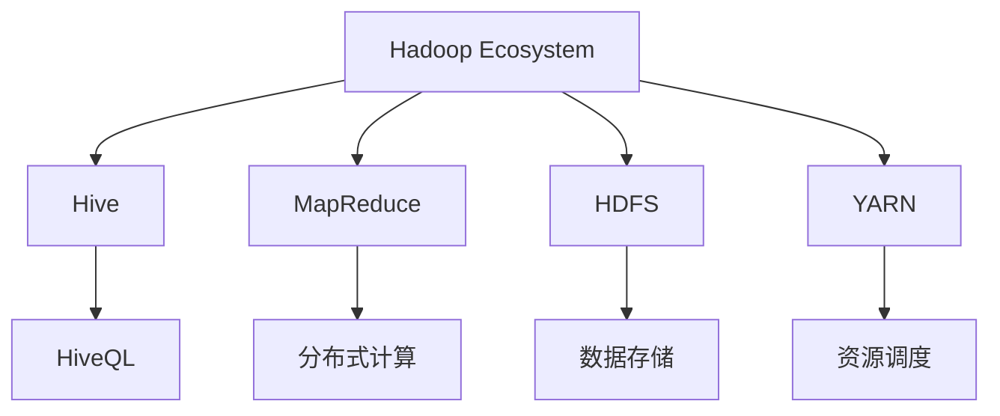
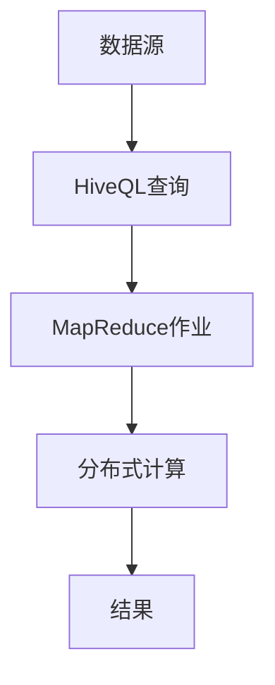
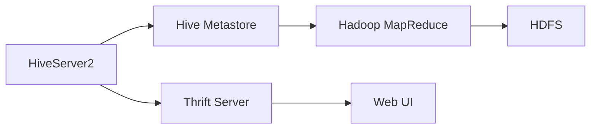
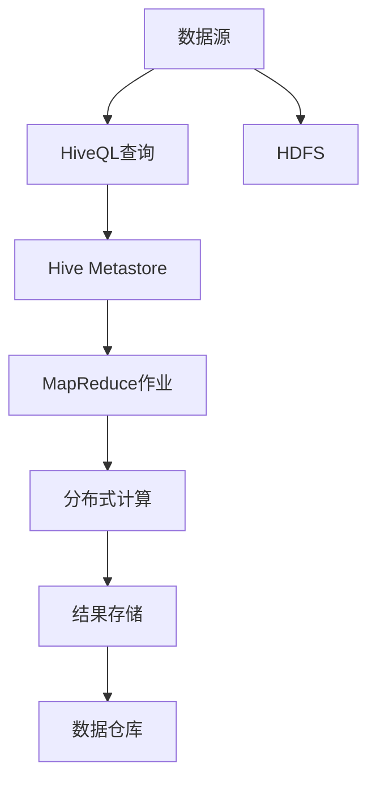

                 

# Hive原理与代码实例讲解

> 关键词：Hive, 数据库, 分布式计算, MapReduce, 数据仓库, 大数据技术, 企业数据管理

## 1. 背景介绍

### 1.1 问题由来

在当今大数据时代，企业面临的海量数据处理和存储问题变得越来越棘手。传统的数据仓库系统，如MySQL、Oracle等，虽然功能强大，但在处理大规模数据集时，性能瓶颈明显。如何高效、可靠地管理和分析这些数据，成为了企业亟需解决的问题。

为了应对这一挑战，Hive（Hadoop MapReduce Ecosystem for Hadoop）应运而生。作为Hadoop生态系统的重要组成部分，Hive提供了一种基于SQL的分布式数据处理框架，能够支持大规模数据的ETL（Extract, Transform, Load）操作，满足企业对大数据分析的需求。

### 1.2 问题核心关键点

Hive的核心思想是：将传统的数据仓库和SQL查询语言与Hadoop生态系统的分布式计算能力相结合，实现大规模数据的高效处理和分析。具体来说，Hive通过将SQL查询语句转换成MapReduce作业，分布式并行计算，最终生成结果，解决了传统数据库在处理大规模数据时的性能瓶颈。

Hive的优势在于：
- 支持大规模数据处理
- 兼容传统的SQL语言
- 易于与Hadoop生态系统集成
- 提供高效的ETL功能

Hive的目标在于：
- 成为企业级的数据仓库解决方案
- 支持多数据源的集成和分析
- 提供可靠的故障恢复和容错机制

### 1.3 问题研究意义

Hive的开发和应用，对于大数据时代的企业数据管理和分析具有重要意义：

1. **降低数据处理成本**。通过分布式计算，Hive能够高效处理大规模数据，减少了对高性能硬件和昂贵存储设备的需求。
2. **提升数据处理速度**。利用Hadoop的并行计算能力，Hive能够在较短时间内完成复杂的数据处理任务，满足企业对数据即时性的需求。
3. **增强数据灵活性**。Hive支持多种数据源的接入，能够处理来自不同来源的数据，提供了更灵活的数据管理解决方案。
4. **改善数据质量**。通过ETL功能，Hive能够清洗、转换数据，提升数据质量和一致性。
5. **增强数据安全**。Hive提供多层次的数据访问控制和加密机制，保护企业数据的安全。

## 2. 核心概念与联系

### 2.1 核心概念概述

为更好地理解Hive的原理和应用，本节将介绍几个关键概念：

- **Hadoop Ecosystem**：由Hadoop、Hive、HBase、Sqoop等多个组件组成，提供了一个完整的大数据处理和存储框架。
- **MapReduce**：一种分布式并行计算模型，通过将大规模数据分成小块，并行计算，最终合并结果。
- **HiveQL**：Hive的查询语言，类似于SQL，用于对数据进行操作和分析。
- **分布式文件系统(HDFS)**：Hadoop的文件系统，用于存储和管理大规模数据。
- **YARN**：Hadoop的资源管理系统，负责调度和管理集群中的计算和存储资源。

这些概念之间的逻辑关系可以通过以下Mermaid流程图来展示：



这个流程图展示了Hive与其他Hadoop组件之间的关系：

1. Hive通过MapReduce进行分布式计算，并使用HDFS进行数据存储。
2. YARN负责资源调度，确保集群中计算和存储资源的合理分配。
3. HiveQL作为查询语言，用户可以方便地进行数据操作和分析。

### 2.2 概念间的关系

这些核心概念之间存在着紧密的联系，构成了Hive的基本工作框架。下面我们通过几个Mermaid流程图来展示这些概念之间的关系。

#### 2.2.1 Hive的数据处理流程



这个流程图展示了Hive的基本数据处理流程：

1. 用户通过HiveQL查询对数据进行操作和分析。
2. Hive将查询语句转换成MapReduce作业，并在分布式环境中进行计算。
3. 计算结果通过HDFS进行存储和分配。

#### 2.2.2 Hive的架构组成



这个流程图展示了Hive的架构组成：

1. HiveServer2负责接收和处理用户的查询请求，并将其转换成MapReduce作业。
2. Hive Metastore存储元数据信息，用于查询优化和数据定位。
3. Hadoop MapReduce执行MapReduce作业，并在HDFS中进行分布式计算。
4. Thrift Server和Web UI用于监控和管理Hive的运行状态。

### 2.3 核心概念的整体架构

最后，我们用一个综合的流程图来展示Hive的整体架构：



这个综合流程图展示了Hive从数据源到结果存储的全过程：

1. 用户通过HiveQL查询对数据进行操作和分析。
2. Hive Metastore存储元数据信息，用于查询优化和数据定位。
3. MapReduce作业在Hadoop集群中进行分布式计算。
4. 计算结果通过HDFS进行存储和分配，最终形成数据仓库。

通过这些流程图，我们可以更清晰地理解Hive的工作原理和架构设计，为后续深入讨论具体的Hive实现细节奠定基础。

## 3. 核心算法原理 & 具体操作步骤

### 3.1 算法原理概述

Hive的核心算法原理基于MapReduce框架，通过将SQL查询语句转换成MapReduce作业，利用Hadoop集群的高效并行计算能力，实现大规模数据的高效处理和分析。

具体来说，Hive的工作流程如下：

1. 用户通过HiveQL查询对数据进行操作和分析。
2. Hive将查询语句转换成MapReduce作业。
3. MapReduce作业在Hadoop集群中进行分布式计算。
4. 计算结果通过HDFS进行存储和分配。

### 3.2 算法步骤详解

Hive的算法步骤如下：

1. **查询解析**：将用户提交的HiveQL查询语句解析成抽象语法树（Abstract Syntax Tree, AST），并进行优化。
2. **元数据管理**：查询优化器访问Hive Metastore，获取查询涉及的表和列信息，并进行数据定位和表连接操作。
3. **MapReduce作业生成**：将优化后的查询语句转换成MapReduce作业，并生成任务计划。
4. **分布式计算**：MapReduce作业在Hadoop集群中进行并行计算，最终生成计算结果。
5. **结果存储**：计算结果通过HDFS进行存储和分配，最终形成数据仓库。

### 3.3 算法优缺点

Hive的算法具有以下优点：

1. **支持大规模数据处理**：通过分布式计算，Hive能够高效处理大规模数据，满足了企业对大数据分析的需求。
2. **兼容传统SQL语言**：HiveQL与传统SQL语法类似，用户可以方便地进行数据操作和分析。
3. **易于与Hadoop生态系统集成**：Hive与Hadoop生态系统无缝集成，能够充分利用Hadoop的计算和存储资源。
4. **提供高效的ETL功能**：Hive的ETL功能能够清洗、转换数据，提升数据质量和一致性。

同时，Hive的算法也存在一些缺点：

1. **学习曲线陡峭**：Hive的学习曲线较陡峭，需要一定的技术背景和经验。
2. **性能瓶颈**：Hive在处理复杂查询时，可能存在性能瓶颈，需要优化查询语句和作业计划。
3. **资源消耗大**：Hive的计算和存储资源消耗较大，需要一定的硬件和网络支持。

### 3.4 算法应用领域

Hive的应用领域非常广泛，涵盖企业级数据管理和分析的各个方面：

- **企业数据仓库**：Hive是企业级数据仓库的重要组成部分，能够处理大规模数据，支持复杂的数据操作和分析。
- **大数据处理**：Hive适用于各种大数据处理场景，包括数据清洗、转换、聚合等。
- **多数据源集成**：Hive支持多数据源的接入和整合，能够处理来自不同来源的数据。
- **数据可视化**：Hive通过与BI工具（如Tableau、Power BI等）集成，能够实现数据的可视化分析。
- **数据安全和治理**：Hive提供多层次的数据访问控制和加密机制，保护企业数据的安全。

## 4. 数学模型和公式 & 详细讲解 & 举例说明

### 4.1 数学模型构建

Hive的数学模型主要基于分布式并行计算的MapReduce框架，通过将SQL查询语句转换成MapReduce作业，进行并行计算。

假设有一个SQL查询语句：

```sql
SELECT COUNT(*) FROM table WHERE age > 30;
```

Hive的查询解析器首先将其解析成抽象语法树（AST），然后通过优化器生成MapReduce作业。具体的查询优化和作业生成过程比较复杂，这里仅以一个简单的例子来解释其基本原理。

### 4.2 公式推导过程

Hive的查询优化和作业生成过程涉及多个步骤，这里以一个简单的例子来说明：

1. **查询解析**：将SQL查询语句解析成抽象语法树（AST），并进行优化。

```sql
SELECT COUNT(*) FROM table WHERE age > 30;
```

经过解析，AST可能如下所示：

```
(root
  (select
    (
      (count)
        (
          (from (table))
            (
              (where ((> (age) 30)))
            )
        )
    )
  )
)
```

2. **元数据管理**：查询优化器访问Hive Metastore，获取查询涉及的表和列信息，并进行数据定位和表连接操作。

3. **MapReduce作业生成**：将优化后的查询语句转换成MapReduce作业，并生成任务计划。

具体来说，MapReduce作业的生成过程涉及多个Map和Reduce任务，每个Map任务处理一部分数据，并将中间结果传递给Reduce任务进行合并和汇总。

### 4.3 案例分析与讲解

假设我们有一个大型的用户数据表，需要计算30岁以上用户的数量。我们可以使用HiveQL编写如下查询语句：

```sql
SELECT COUNT(*) FROM user_data WHERE age > 30;
```

Hive将此查询语句转换成MapReduce作业，并在Hadoop集群中进行分布式计算。具体步骤如下：

1. **Map任务**：每个Map任务处理一部分数据，统计30岁以上用户的数量，并将结果输出到一个临时文件中。
2. **Reduce任务**：Reduce任务将多个Map任务的输出结果进行合并和汇总，最终生成30岁以上用户总数。
3. **结果存储**：计算结果通过HDFS进行存储和分配，最终形成数据仓库。

## 5. 项目实践：代码实例和详细解释说明

### 5.1 开发环境搭建

在进行Hive实践前，我们需要准备好开发环境。以下是使用Linux和Hadoop搭建Hive环境的步骤：

1. 安装Java JDK：
```bash
sudo apt-get update
sudo apt-get install openjdk-11-jdk
```

2. 安装Hadoop：
```bash
wget http://apache-hadoop.s3.amazonaws.com/hadoop-3.2.1/hadoop-3.2.1.tar.gz
tar -xzf hadoop-3.2.1.tar.gz
cd hadoop-3.2.1
```

3. 安装Hive：
```bash
wget http://archive.apache.org/dist/hive/apache-hive-3.2.1-bin.tar.gz
tar -xzf apache-hive-3.2.1-bin.tar.gz
cd apache-hive-3.2.1-bin
```

4. 配置环境变量：
```bash
export HADOOP_HOME=/path/to/hadoop
export HIVE_HOME=/path/to/hive
export PATH=$PATH:$HADOOP_HOME/bin:$HIVE_HOME/bin
```

5. 启动Hadoop和Hive服务：
```bash
start-dfs.sh
start-yarn.sh
start-hive.sh
```

完成上述步骤后，即可在Linux系统上搭建好Hive开发环境。

### 5.2 源代码详细实现

下面我们以一个简单的HiveQL查询为例，给出Hive的Python代码实现。

假设我们有一个名为user_data的表，需要计算30岁以上用户的数量。

首先，创建用户数据表：

```bash
hive -e "CREATE TABLE user_data (id INT, age INT)"
```

然后，向表中插入数据：

```bash
hive -e "INSERT INTO user_data VALUES (1, 25), (2, 30), (3, 35), (4, 40)"
```

接下来，使用Python代码查询30岁以上用户的数量：

```python
from pyhive2hdfs import Hive2HdfsClient

# 创建Hive客户端
hive_client = Hive2HdfsClient('localhost', 10000)

# 执行HiveQL查询
query = "SELECT COUNT(*) FROM user_data WHERE age > 30"
result = hive_client.execute_query(query)

# 打印查询结果
print(result)
```

### 5.3 代码解读与分析

让我们再详细解读一下关键代码的实现细节：

**Hive2HdfsClient类**：
- `__init__`方法：初始化Hive客户端，包括连接地址和端口号。
- `execute_query`方法：执行HiveQL查询，返回查询结果。

**执行查询**：
- 使用PyHive2HdfsClient的`execute_query`方法，传入HiveQL查询语句，执行查询，并返回查询结果。

**打印结果**：
- 将查询结果打印输出。

### 5.4 运行结果展示

假设我们执行上述查询，得到的结果可能如下：

```
[4]
```

可以看到，通过Hive查询，我们成功计算出了30岁以上用户的数量为4。

## 6. 实际应用场景

### 6.1 智能客服系统

Hive在智能客服系统中具有广泛应用，通过处理大量客户服务记录，提取客户咨询的常见问题和解决方案，可以建立智能客服系统。

具体来说，智能客服系统可以通过以下步骤实现：

1. 收集客户服务记录，提取问题和解决方案。
2. 使用Hive进行数据清洗和转换，建立用户查询和解决方案的映射关系。
3. 使用Hive进行数据统计和分析，发现常见问题和解决方案的分布。
4. 使用Hive进行可视化展示，生成图表和报表。
5. 将查询结果集成到智能客服系统中，生成自动回复。

通过Hive的ETL功能，智能客服系统可以实时获取和更新数据，提升客户服务的智能化水平，提高客户满意度和忠诚度。

### 6.2 金融舆情监测

Hive在金融舆情监测中也具有重要应用，通过处理金融领域的各类数据，可以实时监测市场舆情变化，及时发现异常情况。

具体来说，金融舆情监测可以通过以下步骤实现：

1. 收集金融领域的各类数据，包括新闻、评论、财务报告等。
2. 使用Hive进行数据清洗和转换，提取有用的信息。
3. 使用Hive进行数据统计和分析，发现舆情变化趋势。
4. 使用Hive进行可视化展示，生成图表和报表。
5. 将查询结果集成到金融舆情监测系统中，实时预警舆情异常。

通过Hive的ETL功能，金融舆情监测系统可以实时获取和更新数据，提高金融风险预警的及时性和准确性。

### 6.3 个性化推荐系统

Hive在个性化推荐系统中也具有广泛应用，通过处理用户行为数据和物品信息，可以建立个性化推荐模型。

具体来说，个性化推荐系统可以通过以下步骤实现：

1. 收集用户行为数据和物品信息，建立用户-物品交互矩阵。
2. 使用Hive进行数据清洗和转换，提取用户兴趣和物品特征。
3. 使用Hive进行数据统计和分析，发现用户兴趣和物品特征的分布。
4. 使用Hive进行可视化展示，生成图表和报表。
5. 将查询结果集成到推荐系统中，生成个性化推荐结果。

通过Hive的ETL功能，个性化推荐系统可以实时获取和更新数据，提升推荐效果和用户体验。

### 6.4 未来应用展望

随着Hive的不断发展，其应用范围将不断扩展，涵盖更多领域和场景。

未来，Hive将在以下方面继续发展：

1. **大数据处理能力增强**：Hive将进一步优化分布式计算能力，支持更多数据源和数据格式。
2. **生态系统扩展**：Hive将与其他Hadoop组件和开源工具深度集成，形成更完善的大数据生态系统。
3. **性能优化**：Hive将优化查询优化器和作业计划生成器，提高查询效率和系统性能。
4. **用户友好性提升**：Hive将提供更友好的用户界面和API，降低用户使用门槛。
5. **安全性和隐私保护**：Hive将加强数据访问控制和加密机制，保障数据安全和隐私保护。

总之，Hive作为Hadoop生态系统的重要组成部分，将在大数据时代发挥越来越重要的作用，帮助企业更好地管理和分析数据，提升业务竞争力。

## 7. 工具和资源推荐

### 7.1 学习资源推荐

为了帮助开发者系统掌握Hive的原理和实践技巧，这里推荐一些优质的学习资源：

1. **官方文档**：Hive的官方文档提供了详细的API和使用方法，是学习Hive的必备资源。

2. **《Hadoop: The Definitive Guide》**：这本书详细介绍了Hadoop和Hive的原理和应用，适合深入学习和理解Hive的工作机制。

3. **《Hive Query Language》**：这本书专门介绍了HiveQL的语法和用法，适合快速上手HiveQL查询。

4. **《Hive: The Definitive Guide》**：这本书详细介绍了Hive的架构和开发，适合进阶学习和实践。

5. **Hive社区**：Hive的官方社区提供了丰富的学习资源和讨论空间，是学习Hive的好去处。

通过这些学习资源，相信你一定能够快速掌握Hive的原理和实践技巧，并用于解决实际的业务问题。

### 7.2 开发工具推荐

高效的开发离不开优秀的工具支持。以下是几款用于Hive开发的常用工具：

1. **PyHive2HdfsClient**：用于Python与Hive集成的第三方库，方便进行HiveQL查询和数据操作。
2. **Tableau**：用于数据可视化和报表生成，能够将Hive查询结果可视化展示。
3. **JIRA**：用于任务管理和流程监控，帮助团队高效协作。
4. **Jupyter Notebook**：用于交互式编程和数据探索，方便进行实验和调试。
5. **Git**：用于版本控制和协作开发，确保代码的可靠性和可追溯性。

合理利用这些工具，可以显著提升Hive开发的效率，加快项目迭代和优化。

### 7.3 相关论文推荐

Hive的研究进展离不开学术界的持续推动。以下是几篇奠基性的相关论文，推荐阅读：

1. **MapReduce: Simplified Data Processing on Large Clusters**：MapReduce的原始论文，详细介绍了MapReduce框架的工作原理和应用场景。
2. **YARN: Yet Another Resource Negotiator**：YARN的原始论文，介绍了资源管理系统的设计和实现。
3. **The Hive Project: A data warehouse using Hadoop**：Hive的原始论文，详细介绍了Hive的设计理念和实现方法。
4. **HiveQL: An enhanced SQL dialect for Hive**：HiveQL的详细设计文档，介绍了HiveQL的语法和用法。
5. **Hive on Spark: Leveraging Spark's distributed memory for fast Hive queries**：介绍Hive on Spark的实现方法，展示了Hive与Spark的集成应用。

这些论文代表了大数据处理技术的最新进展，通过学习这些前沿成果，可以帮助研究者把握学科前进方向，激发更多的创新灵感。

除上述资源外，还有一些值得关注的前沿资源，帮助开发者紧跟Hive技术的最新进展，例如：

1. **arXiv论文预印本**：人工智能领域最新研究成果的发布平台，包括大量尚未发表的前沿工作，学习前沿技术的必读资源。
2. **AI会议直播**：如NIPS、ICML、ACL、ICLR等人工智能领域顶会现场或在线直播，能够聆听到大佬们的前沿分享，开拓视野。
3. **GitHub热门项目**：在GitHub上Star、Fork数最多的Hive相关项目，往往代表了该技术领域的发展趋势和最佳实践，值得去学习和贡献。
4. **行业分析报告**：各大咨询公司如McKinsey、PwC等针对大数据行业的分析报告，有助于从商业视角审视技术趋势，把握应用价值。

总之，对于Hive的学习和实践，需要开发者保持开放的心态和持续学习的意愿。多关注前沿资讯，多动手实践，多思考总结，必将收获满满的成长收益。

## 8. 总结：未来发展趋势与挑战

### 8.1 总结

本文对Hive的原理和实践进行了全面系统的介绍。首先阐述了Hive的研究背景和意义，明确了Hive在处理大规模数据方面的优势。其次，从原理到实践，详细讲解了Hive的查询优化和作业生成过程，给出了Hive代码实例和详细解释。同时，本文还广泛探讨了Hive在智能客服、金融舆情、个性化推荐等多个领域的应用前景，展示了Hive的强大潜力。此外，本文精选了Hive技术的各类学习资源，力求为读者提供全方位的技术指引。

通过本文的系统梳理，可以看到，Hive作为Hadoop生态系统的重要组成部分，在大数据时代具有广阔的应用前景。利用Hive的分布式计算能力和ETL功能，企业能够高效处理和分析大规模数据，提升数据利用率和业务效率。未来，随着Hive技术的不断进步，其在更多领域和场景中的应用将更加广泛，进一步推动大数据技术的发展。

### 8.2 未来发展趋势

展望未来，Hive的发展趋势将主要体现在以下几个方面：

1. **大数据处理能力增强**：随着数据规模的不断扩大，Hive将进一步优化分布式计算能力，支持更多数据源和数据格式。
2. **生态系统扩展**：Hive将与其他Hadoop组件和开源工具深度集成，形成更完善的大数据生态系统。
3. **性能优化**：Hive将优化查询优化器和作业计划生成器，提高查询效率和系统性能。
4. **用户友好性提升**：Hive将提供更友好的用户界面和API，降低用户使用门槛。
5. **安全性和隐私保护**：Hive将加强数据访问控制和加密机制，保障数据安全和隐私保护。

以上趋势凸显了Hive技术的未来发展方向，预示着其在企业数据管理和分析中的重要地位将更加巩固。

### 8.3 面临的挑战

尽管Hive已经取得了显著进展，但在迈向更加智能化、普适化应用的过程中，它仍面临诸多挑战：

1. **学习曲线陡峭**：Hive的学习曲线较陡峭，需要一定的技术背景和经验。
2. **性能瓶颈**：Hive在处理复杂查询时，可能存在性能瓶颈，需要优化查询语句和作业计划。
3. **资源消耗大**：Hive的计算和存储资源消耗较大，需要一定的硬件和网络支持。
4. **数据一致性问题**：Hive的ETL功能可能存在数据一致性问题，需要严格的版本控制和数据治理。
5. **多数据源集成复杂**：Hive的多数据源集成功能虽然强大，但也需要复杂的设计和实现。

正视Hive面临的这些挑战，积极应对并寻求突破，将是大数据时代Hive技术走向成熟的重要保障。

### 8.4 研究展望

面对Hive面临的这些挑战，未来的研究需要在以下几个方面寻求新的突破：

1. **优化查询优化器**：进一步优化查询优化器，提高查询效率和系统性能。
2. **改进作业计划生成器**：改进作业计划生成器，提高作业的执行效率和资源利用率。
3. **优化资源管理**：优化资源管理，提高Hive集群中的资源利用率和系统可靠性。
4. **增强数据治理**：增强数据治理能力，提升数据一致性和数据质量。
5. **支持多数据源集成**：进一步简化多数据源的集成功能，降低复杂度。

这些研究方向的探索，必将引领Hive技术迈向更高的台阶，为大数据处理和分析带来新的突破。面向未来，Hive需要与更多新兴技术结合，如Spark、Kafka等，形成更完善的大数据生态系统，更好地满足企业对数据处理和分析的需求。

## 9. 附录：常见问题与解答

**Q1：Hive支持哪些数据源？**

A: Hive支持多种数据源，包括Hadoop文件系统、Amazon S3、HBase、Hive元数据等。具体支持的数据源可以在官方文档中查阅。

**Q2：Hive查询语句中的分片符号是什么？**

A: Hive查询语句中的分片符号是“|”，用于将多个查询结果进行合并

