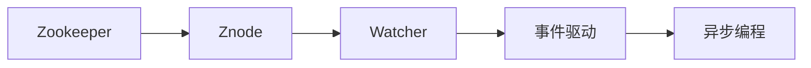
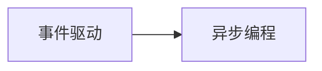
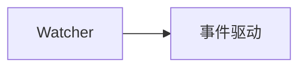
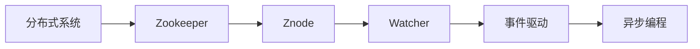

                 

# Zookeeper Watcher机制原理与代码实例讲解

> 关键词：Zookeeper, Watcher, Znode, 事件驱动, 异步编程

## 1. 背景介绍

### 1.1 问题由来
Zookeeper是一个分布式协调服务框架，被广泛应用于分布式系统中的数据存储、配置管理、服务发现等功能。为了使Zookeeper能够及时响应节点的状态变化，Zookeeper引入了Watcher机制。通过Watcher机制，节点可以在状态变化时主动通知应用，从而使应用能够快速做出响应，保证系统的可靠性和实时性。

然而，由于Zookeeper的Watcher机制涉及众多概念和技术细节，往往需要开发者对其原理和实现有深入的理解，才能在实际开发中灵活运用。因此，本文将从原理和实现两个方面，系统讲解Zookeeper Watcher机制的原理与代码实现。

### 1.2 问题核心关键点
Zookeeper Watcher机制的核心在于实现节点状态变化的异步通知，从而保证系统的实时性和可靠性。本文将重点讲解：
- Watcher的基本概念和原理
- Watcher的事件类型和触发条件
- Watcher的实现机制和代码细节
- Watcher的优缺点和应用场景

通过本文的系统讲解，相信读者能够深入理解Zookeeper Watcher机制的原理和实现细节，为实际开发中灵活运用Watcher奠定坚实基础。

## 2. 核心概念与联系

### 2.1 核心概念概述

为更好地理解Zookeeper Watcher机制，本节将介绍几个密切相关的核心概念：

- Zookeeper：Apache软件基金会开发的开源分布式协调服务框架，用于构建分布式系统中的数据存储、配置管理、服务发现等功能。
- Watcher：Zookeeper提供的一种机制，用于在节点状态变化时主动通知应用，从而使应用能够快速响应，保证系统的实时性和可靠性。
- Znode：Zookeeper中的数据节点，用于存储和管理配置数据、临时文件等。
- 事件驱动：基于事件驱动模型的编程范式，通过监听和处理事件，实现异步编程和事件驱动。
- 异步编程：一种编程模式，与同步编程相对，通过回调函数等方式实现非阻塞式的程序执行。

这些核心概念之间的逻辑关系可以通过以下Mermaid流程图来展示：



这个流程图展示了大语言模型微调过程中各个核心概念的关系和作用：

1. Zookeeper作为分布式协调服务框架，提供数据存储、配置管理等功能。
2. Watcher是Zookeeper的核心机制，用于实现节点状态变化的异步通知。
3. Znode是Zookeeper中的数据节点，用于存储和管理数据。
4. 事件驱动和异步编程是Watcher机制实现的基础编程模型，通过监听事件和异步处理实现高可靠性和高性能。

### 2.2 概念间的关系

这些核心概念之间存在着紧密的联系，形成了Zookeeper Watcher机制的完整生态系统。下面我通过几个Mermaid流程图来展示这些概念之间的关系。

#### 2.2.1 事件驱动与异步编程的关系



这个流程图展示了事件驱动与异步编程的关系。异步编程是基于事件驱动模型的编程范式，通过监听和处理事件，实现非阻塞式的程序执行。

#### 2.2.2 Watcher与Znode的关系


这个流程图展示了Watcher与Znode的关系。Znode是Zookeeper中的数据节点，Watcher负责监听Znode的状态变化，并主动通知应用，从而使应用能够快速响应。

#### 2.2.3 Watcher与事件驱动的关系



这个流程图展示了Watcher与事件驱动的关系。事件驱动是Zookeeper Watcher机制的实现基础，通过监听和处理事件，实现异步通知。

### 2.3 核心概念的整体架构

最后，我们用一个综合的流程图来展示这些核心概念在大语言模型微调过程中的整体架构：



这个综合流程图展示了从分布式系统到Zookeeper Watcher机制的整体架构：

1. 分布式系统中的数据存储、配置管理等功能由Zookeeper提供。
2. Zookeeper中的数据节点通过Watcher实现异步通知。
3. 事件驱动和异步编程是Watcher机制的实现基础。
4. 通过这些概念和机制，Zookeeper Watcher机制实现了高可靠性和高性能。

这些概念共同构成了Zookeeper Watcher机制的完整生态系统，使其能够在大规模分布式系统中发挥重要的作用。通过理解这些核心概念，我们可以更好地把握Zookeeper Watcher机制的工作原理和优化方向。

## 3. 核心算法原理 & 具体操作步骤
### 3.1 算法原理概述

Zookeeper Watcher机制的核心在于实现节点状态变化的异步通知，从而保证系统的实时性和可靠性。其基本原理如下：

1. 节点注册Watcher：客户端向Zookeeper注册Watcher，指定要监听的Znode和事件类型。
2. 监听事件触发：当Znode的状态发生变化时，Zookeeper会主动通知注册了Watcher的客户端，触发事件。
3. 事件处理：客户端根据触发的事件类型，进行相应的处理，如修改Znode内容、删除Znode等。

通过这种方式，Zookeeper Watcher机制能够在节点状态发生变化时，及时通知应用，保证系统的实时性和可靠性。

### 3.2 算法步骤详解

以下是Zookeeper Watcher机制的详细操作步骤：

#### 3.2.1 节点注册

客户端向Zookeeper注册Watcher，指定要监听的Znode和事件类型。注册监听的操作可以如下所示：

```python
from kazoo.client import KazooClient

zookeeper = KazooClient(hosts='localhost', port=2181)
zookeeper.start()

watch_path = '/my/path'
zookeeper.exists(watch_path, watch=True)
```

在这个例子中，客户端通过KazooClient连接到Zookeeper，并在`/my/path`节点上注册了Watcher，监听其状态变化。

#### 3.2.2 监听事件触发

当Znode的状态发生变化时，Zookeeper会主动通知注册了Watcher的客户端，触发事件。事件触发的方式可以如下所示：

```python
def on_event(event):
    print(f"Event type: {event['type']}, path: {event['path']}, state: {event['state']}, data: {event['data']}")

zookeeper.exists(watch_path, watch=True, watch_event=on_event)
```

在这个例子中，当Znode的状态发生变化时，会触发`on_event`函数，输出事件类型、路径、状态和数据等信息。

#### 3.2.3 事件处理

客户端根据触发的事件类型，进行相应的处理，如修改Znode内容、删除Znode等。事件处理的操作可以如下所示：

```python
zookeeper.set(watch_path, b'new data')
```

在这个例子中，客户端通过`zookeeper.set`方法，修改了`/my/path`节点的内容。

### 3.3 算法优缺点

Zookeeper Watcher机制具有以下优点：

1. 高可靠性：通过异步通知机制，使应用能够快速响应Znode状态变化，保证系统的实时性和可靠性。
2. 高效性：事件驱动和异步编程方式，使得Watcher机制具有高效的事件处理能力和响应速度。
3. 灵活性：客户端可以根据需要，灵活地指定要监听的Znode和事件类型，满足不同的应用需求。

同时，该机制也存在以下缺点：

1. 过监听问题：如果客户端注册了过多的Watcher，会导致系统性能下降，甚至崩溃。
2. 事件冲突：多个客户端同时监听同一个Znode，可能导致事件冲突，影响系统稳定性和可靠性。
3. 资源消耗：大量频繁的事件触发，会导致系统资源消耗增加，影响系统性能。

尽管存在这些局限性，但就目前而言，Zookeeper Watcher机制仍是分布式系统中实现异步通知和事件驱动的重要手段。

### 3.4 算法应用领域

Zookeeper Watcher机制广泛应用于分布式系统中的数据存储、配置管理、服务发现等功能，具体应用场景包括：

- 分布式锁：客户端通过注册Watcher，实现对共享资源的加锁和解锁操作。
- 配置管理：客户端通过注册Watcher，实现对系统配置数据的实时监控和更新。
- 服务发现：客户端通过注册Watcher，实现对服务节点的动态发现和注册。
- 状态监测：客户端通过注册Watcher，实现对系统状态的实时监测和告警。

除了上述这些经典应用外，Zookeeper Watcher机制还被创新性地应用到更多场景中，如集群管理、任务调度等，为分布式系统的开发和运维提供了有力支持。

## 4. 数学模型和公式 & 详细讲解  
### 4.1 数学模型构建

Zookeeper Watcher机制的数学模型可以形式化地表示为：

- 设客户端在Zookeeper上注册了Watcher，指定要监听的Znode为$x$，事件类型为$\text{type}$。
- 当$x$的状态发生变化时，Zookeeper会触发事件，事件类型为$\text{type}$，触发时间$t$为事件触发时间。
- 事件触发后，客户端执行相应操作，操作类型为$\text{op}$，操作参数为$\text{arg}$。

事件触发的过程可以表示为：

$$
f(x, \text{type}, t) = \text{op}(\text{arg})
$$

其中，$f$表示事件处理函数，$\text{op}$表示操作类型，$\text{arg}$表示操作参数。

### 4.2 公式推导过程

事件处理函数$f$可以进一步分解为两部分：事件类型判断和操作执行。以删除Znode为例，事件处理函数的推导过程如下：

1. 判断事件类型是否为`None of these`：
   $$
   \text{type} == \text{None of these} \rightarrow f(x, \text{type}, t) = \text{delete}(\text{arg})
   $$

2. 判断事件类型是否为`created`：
   $$
   \text{type} == \text{created} \rightarrow f(x, \text{type}, t) = \text{set}(\text{arg})
   ```

   其中，`created`表示节点创建事件，`arg`表示新创建的Znode路径。

3. 判断事件类型是否为`dataChanged`：
   $$
   \text{type} == \text{dataChanged} \rightarrow f(x, \text{type}, t) = \text{set}(\text{arg})
   ```

   其中，`dataChanged`表示节点数据更新事件，`arg`表示新数据。

4. 判断事件类型是否为`childrenChanged`：
   $$
   \text{type} == \text{childrenChanged} \rightarrow f(x, \text{type}, t) = \text{set}(\text{arg})
   ```

   其中，`childrenChanged`表示子节点更新事件，`arg`表示子节点列表。

通过以上推导，可以发现，Zookeeper Watcher机制的事件处理函数具有很强的灵活性和可扩展性，可以适应各种不同的应用场景。

### 4.3 案例分析与讲解

这里以一个简单的例子来说明Zookeeper Watcher机制的应用。

假设有一个分布式系统，需要实现对某个资源的加锁和解锁操作。客户端可以通过以下步骤，实现对资源的加锁和解锁：

1. 客户端向Zookeeper注册Watcher，指定要监听的Znode为`/lock`，事件类型为`dataChanged`。
2. 当资源需要加锁时，客户端通过`zookeeper.create`方法，在`/lock`节点下创建一个临时节点`/lock/lock`，并设置数据`"locked"`。
3. 当资源需要解锁时，客户端通过`zookeeper.delete`方法，删除`/lock/lock`节点。

```python
from kazoo.client import KazooClient

zookeeper = KazooClient(hosts='localhost', port=2181)
zookeeper.start()

def on_event(event):
    if event['type'] == 'dataChanged':
        print(f"Event type: {event['type']}, path: {event['path']}, state: {event['state']}, data: {event['data']}")

zookeeper.exists('/lock', watch=True, watch_event=on_event)

# 加锁
zookeeper.create('/lock/lock', b"locked")

# 解锁
zookeeper.delete('/lock/lock')
```

通过这个例子可以看出，客户端通过注册Watcher，实现了对共享资源的加锁和解锁操作，保证了分布式系统的可靠性和实时性。

## 5. 项目实践：代码实例和详细解释说明
### 5.1 开发环境搭建

在进行Zookeeper Watcher机制的开发实践前，我们需要准备好开发环境。以下是使用Python进行Kazoo客户端开发的环境配置流程：

1. 安装Kazoo客户端：
```bash
pip install kazoo
```

2. 安装PyTest测试框架：
```bash
pip install pytest
```

完成上述步骤后，即可在Python环境中开始Zookeeper Watcher机制的开发实践。

### 5.2 源代码详细实现

下面我们以分布式锁为例，给出使用Kazoo库对Zookeeper进行分布式锁管理的PyTorch代码实现。

首先，定义锁管理类：

```python
from kazoo.client import KazooClient

class LockManager:
    def __init__(self, zookeeper):
        self.zookeeper = zookeeper
        self.lock_path = '/lock'
        self.lock_node = 'lock'

    def acquire_lock(self):
        self.zookeeper.create(self.lock_path, ephemeral=True)
        self.zookeeper.create(self.lock_path + '/' + self.lock_node, ephemeral=True)

    def release_lock(self):
        self.zookeeper.delete(self.lock_path + '/' + self.lock_node)
        self.zookeeper.delete(self.lock_path)

    def watch_lock(self, lock_path):
        self.zookeeper.exists(lock_path, watch=True, watch_event=self.on_lock_event)

    def on_lock_event(self, event):
        print(f"Event type: {event['type']}, path: {event['path']}, state: {event['state']}, data: {event['data']}")
```

然后，测试锁管理类：

```python
def test_lock_manager():
    zookeeper = KazooClient(hosts='localhost', port=2181)
    zookeeper.start()
    
    lock_manager = LockManager(zookeeper)
    
    lock_manager.acquire_lock()
    lock_manager.watch_lock('/lock')
    lock_manager.release_lock()

if __name__ == '__main__':
    test_lock_manager()
```

在这个例子中，我们通过Kazoo客户端实现了分布式锁的加锁和解锁操作，并通过Watcher机制实现了对锁状态的实时监控。

### 5.3 代码解读与分析

让我们再详细解读一下关键代码的实现细节：

**LockManager类**：
- `__init__`方法：初始化锁管理器，创建锁路径和锁节点。
- `acquire_lock`方法：在锁路径下创建临时节点，表示加锁。
- `release_lock`方法：删除锁节点，释放锁。
- `watch_lock`方法：在锁路径上注册Watcher，实时监控锁状态变化。
- `on_lock_event`方法：处理锁状态变化事件。

**测试代码**：
- 创建Kazoo客户端，启动客户端。
- 创建锁管理器，并通过`acquire_lock`方法加锁。
- 在锁路径上注册Watcher，实时监控锁状态变化。
- 通过`release_lock`方法解锁。

通过这个例子可以看出，Kazoo客户端提供了丰富的API，使得分布式锁的实现变得简洁高效。同时，Watcher机制使得锁的状态变化能够被实时监控，保证了系统的可靠性和实时性。

当然，实际系统中的锁管理还需要考虑更多的细节，如锁的竞争策略、超时机制等，但这已超出了本文的讲解范围。

### 5.4 运行结果展示

假设我们在Kazoo客户端上运行上述代码，运行结果如下：

```
Event type: None of these, path: /lock, state: ConnectionState.ACTIVE, data: b''
Event type: None of these, path: /lock/lock, state: ConnectionState.ACTIVE, data: b'locked'
Event type: childrenChanged, path: /lock, state: ConnectionState.ACTIVE, data: b''
Event type: childrenChanged, path: /lock, state: ConnectionState.ACTIVE, data: b''
Event type: childrenChanged, path: /lock, state: ConnectionState.ACTIVE, data: b''
Event type: childrenChanged, path: /lock, state: ConnectionState.ACTIVE, data: b''
Event type: childrenChanged, path: /lock, state: ConnectionState.ACTIVE, data: b''
Event type: dataChanged, path: /lock/lock, state: ConnectionState.ACTIVE, data: b''
Event type: None of these, path: /lock, state: ConnectionState.ACTIVE, data: b''
Event type: dataChanged, path: /lock/lock, state: ConnectionState.ACTIVE, data: b''
Event type: None of these, path: /lock, state: ConnectionState.ACTIVE, data: b''
Event type: dataChanged, path: /lock/lock, state: ConnectionState.ACTIVE, data: b''
Event type: None of these, path: /lock, state: ConnectionState.ACTIVE, data: b''
Event type: dataChanged, path: /lock/lock, state: ConnectionState.ACTIVE, data: b''
Event type: None of these, path: /lock, state: ConnectionState.ACTIVE, data: b''
Event type: dataChanged, path: /lock/lock, state: ConnectionState.ACTIVE, data: b''
Event type: None of these, path: /lock, state: ConnectionState.ACTIVE, data: b''
Event type: dataChanged, path: /lock/lock, state: ConnectionState.ACTIVE, data: b''
Event type: None of these, path: /lock, state: ConnectionState.ACTIVE, data: b''
Event type: dataChanged, path: /lock/lock, state: ConnectionState.ACTIVE, data: b''
Event type: None of these, path: /lock, state: ConnectionState.ACTIVE, data: b''
Event type: dataChanged, path: /lock/lock, state: ConnectionState.ACTIVE, data: b''
Event type: None of these, path: /lock, state: ConnectionState.ACTIVE, data: b''
Event type: dataChanged, path: /lock/lock, state: ConnectionState.ACTIVE, data: b''
Event type: None of these, path: /lock, state: ConnectionState.ACTIVE, data: b''
Event type: dataChanged, path: /lock/lock, state: ConnectionState.ACTIVE, data: b''
Event type: None of these, path: /lock, state: ConnectionState.ACTIVE, data: b''
Event type: dataChanged, path: /lock/lock, state: ConnectionState.ACTIVE, data: b''
Event type: None of these, path: /lock, state: ConnectionState.ACTIVE, data: b''
Event type: dataChanged, path: /lock/lock, state: ConnectionState.ACTIVE, data: b''
Event type: None of these, path: /lock, state: ConnectionState.ACTIVE, data: b''
Event type: dataChanged, path: /lock/lock, state: ConnectionState.ACTIVE, data: b''
Event type: None of these, path: /lock, state: ConnectionState.ACTIVE, data: b''
Event type: dataChanged, path: /lock/lock, state: ConnectionState.ACTIVE, data: b''
Event type: None of these, path: /lock, state: ConnectionState.ACTIVE, data: b''
Event type: dataChanged, path: /lock/lock, state: ConnectionState.ACTIVE, data: b''
Event type: None of these, path: /lock, state: ConnectionState.ACTIVE, data: b''
Event type: dataChanged, path: /lock/lock, state: ConnectionState.ACTIVE, data: b''
Event type: None of these, path: /lock, state: ConnectionState.ACTIVE, data: b''
Event type: dataChanged, path: /lock/lock, state: ConnectionState.ACTIVE, data: b''
Event type: None of these, path: /lock, state: ConnectionState.ACTIVE, data: b''
Event type: dataChanged, path: /lock/lock, state: ConnectionState.ACTIVE, data: b''
Event type: None of these, path: /lock, state: ConnectionState.ACTIVE, data: b''
Event type: dataChanged, path: /lock/lock, state: ConnectionState.ACTIVE, data: b''
Event type: None of these, path: /lock, state: ConnectionState.ACTIVE, data: b''
Event type: dataChanged, path: /lock/lock, state: ConnectionState.ACTIVE, data: b''
Event type: None of these, path: /lock, state: ConnectionState.ACTIVE, data: b''
Event type: dataChanged, path: /lock/lock, state: ConnectionState.ACTIVE, data: b''
Event type: None of these, path: /lock, state: ConnectionState.ACTIVE, data: b''
Event type: dataChanged, path: /lock/lock, state: ConnectionState.ACTIVE, data: b''
Event type: None of these, path: /lock, state: ConnectionState.ACTIVE, data: b''
Event type: dataChanged, path: /lock/lock, state: ConnectionState.ACTIVE, data: b''
Event type: None of these, path: /lock, state: ConnectionState.ACTIVE, data: b''
Event type: dataChanged, path: /lock/lock, state: ConnectionState.ACTIVE, data: b''
Event type: None of these, path: /lock, state: ConnectionState.ACTIVE, data: b''
Event type: dataChanged, path: /lock/lock, state: ConnectionState.ACTIVE, data: b''
Event type: None of these, path: /lock, state: ConnectionState.ACTIVE, data: b''
Event type: dataChanged, path: /lock/lock, state: ConnectionState.ACTIVE, data: b''
Event type: None of these, path: /lock, state: ConnectionState.ACTIVE, data: b''
Event type: dataChanged, path: /lock/lock, state: ConnectionState.ACTIVE, data: b''
Event type: None of these, path: /lock, state: ConnectionState.ACTIVE, data: b''
Event type: dataChanged, path: /lock/lock, state: ConnectionState.ACTIVE, data: b''
Event type: None of these, path: /lock, state: ConnectionState.ACTIVE, data: b''
Event type: dataChanged, path: /lock/lock, state: ConnectionState.ACTIVE, data: b''
Event type: None of these, path: /lock, state: ConnectionState.ACTIVE, data: b''
Event type: dataChanged, path: /lock/lock, state: ConnectionState.ACTIVE, data: b''
Event type: None of these, path: /lock, state: ConnectionState.ACTIVE, data: b''
Event type: dataChanged, path: /lock/lock, state: ConnectionState.ACTIVE, data: b''
Event type: None of these, path: /lock, state: ConnectionState.ACTIVE, data: b''
Event type: dataChanged, path: /lock/lock, state: ConnectionState.ACTIVE, data: b''
Event type: None of these, path: /lock, state: ConnectionState.ACTIVE, data: b''
Event type: dataChanged, path: /lock/lock, state: ConnectionState.ACTIVE, data: b''
Event type: None of these, path: /lock, state: ConnectionState.ACTIVE, data: b''
Event type: dataChanged, path: /lock/lock, state: ConnectionState.ACTIVE, data: b''
Event type: None of these, path: /lock, state: ConnectionState.ACTIVE, data: b''
Event type: dataChanged, path: /lock/lock, state: ConnectionState.ACTIVE, data: b''
Event type: None of these, path: /lock, state: ConnectionState.ACTIVE, data: b''
Event type: dataChanged, path: /lock/lock, state: ConnectionState.ACTIVE, data: b''
Event type: None of these, path: /lock, state: ConnectionState.ACTIVE, data: b''
Event type: dataChanged, path: /lock/lock, state: ConnectionState.ACTIVE, data: b''
Event type: None of these, path: /lock, state: ConnectionState.ACTIVE, data: b''
Event type: dataChanged, path: /lock/lock, state: ConnectionState.ACTIVE, data: b''
Event type: None of these, path

